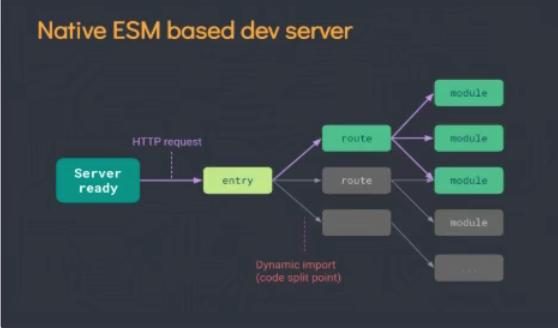

## Vue

### 使用vite创建工程:

- 什么是vite?--------------新一代的前端构建工具

- 官方文档:[开始 | Vite 官方中文文档 (vitejs.dev)](https://cn.vitejs.dev/guide/)e

- 优势:

  - 开发环境中,无需打包操作,可以快速冷启动(相反:大部分npm run serve运行项目时,都是先打包在运行)
  - 轻量快速的热重载(HMR),即一改代码就局部刷新
  - 真正按需编译,不在等待整个应用编译完成
    - 传统构建与vite构建对比:
    - 
    - vite
    - 传统流程:从入口文件entry分析路由等规则,在分析模块,然后打包,在服务其上运行
    - vite:先准备好一个空的服务器,根据http请求从入口文件进入,根据请求分析路由和对应的模块,(按需)
  - 创建流程:
    - npm init vite-app 'name'
    - npm i (需手动添加依赖)
    - npm run dev 启动

- 结构分析:

  - main.js

    ```vue
    //引入的不再是Vue构造函数了,引入的是一个名为createApp的工厂函数.用来创建一个应用
    import { createApp } from 'vue'
    import App from './App.vue'
    // import Vue from 'vue'
    
    
    //创建一个应用实例对象app(类似于vue2的vm,但比vm更轻)
    const app = createApp(App)
    //挂载
    app.mount('#app')
    console.log('app',app)
    
    //vue2的写法:
    // const vm = new Vue({
        //指定渲染的目标容器
        // el:"#app",
        //指定渲染那个组件到上边的容器
        // render:h => h(App)
    // })//或 .$mount('#app)
    // console.log('vm',vm)
    ```

  - 组件中不需要根标签其他暂无特别变化

### 常用Composition API(组合式API)

------

#### 1.setup

1. 理解:vue3中一个新的配置项,值是一个**函数**.是所有Composition API(组合API)的"表演舞台".
2. 组件中用到的数据,方法等等均要配置在setup中
3. setup函数的两种返回值:
   1. 对象:则对象中的属性方法在模板中均可以直接使用
   2. 渲染函数:则可以自定义渲染内容,模板的内容会被覆盖
4. 注意点:
   1. 尽量不要与vue2配置混用
      - vue2的配置中可以访问到setup中的属性方法,但vue3setup中是不能访问到vue2中的配置
      - 如果有重名setup优先
   2. setup不能是一个async函数,因为返回值不在是return,而是promise,模板看不到return对象中的属性

#### 2.ref函数

1. 作用:定义一个响应式数据,

2. 缺点:定义引用类型数据时获取数据太麻烦,需要把握```.value```的使用

3. 用法:

   ```vue
   //引入ref
   import {ref} from 'vue'
   ......
   //age为响应式,name不是
       let name = '小李';
   //创建一个包含响应式数据的引用对象(reference对象,简称 ref对象)
       let age = ref('18');
       let obj = ref({
             sex:'男',
             do:'喝水'
           })
   
           function sayHello(){
             age.value = '永远18',
             console.log(age),
             console.log(obj.value)
           }
   ```

4. 上述ref函数输出基本类型age:

5. 上述ref函数输出对象类型obj:

6. 上述ref函数输出对象类型obj.value:

7. 获取:

   1. js中: 通过 ```自定义变量名.value获取```
   2. 模板中读取数据: {{自定义变量名}}

8. 备注:

   1. 接收的数据可以是:基本类型,也可以是对象类型
   2. 基本类型由object.defineProperty()的get,set完成
   3. 对象数据类型由vue3中的新函数```reactive```

#### 3.reactive函数

1. 作用:定义一个引用类型的响应式数据(基本类型用ref)

2. 用法:```const 代理对象 = reactive(源对象)```接收一个对象(或数组),返回一个代理对象(**Proxy的实例对象**),内部基于ES6的Proxy实现,通过代理对象操作源对象内部数据进行操作

   ```vue
   <template>
     <h2>我的名字是:{{name}}</h2>
     <h2>我的年龄是:{{age}}</h2>
     <button @click="sayHello">改变值</button>
     <h2>obj的属性:性别:{{obj.sex.nan.he.gg}}</h2>
     <h2>数组:{{shuzu}}</h2>
     <h1>以下为preson对象</h1>
     <h2 v-for="item,index in preson " :key="index">{{item}}</h2>
   </template>
   
   <script>
   //引入ref
   import {ref,reactive} from 'vue'
   export default {
     name: 'App',
     setup(){
       //age为响应式,name不是
       let name = '小李';
       let age = ref('18');
       //ref监测对象是深度检测,但是取值比较麻烦
       let obj = ref({
         sex:{
           nan:{
             he:{
               gg:'能拿到么'
             }
           }
         },
         do:'喝水'
       });
       //reactive也可以检测数组元素的变化,而且支持通过数组索引更改数组元素
       let shuzu = reactive(['1','2','3']);
       //用reactive也可以检测到对象数据内部的变化,而且拿数据方便
       let preson = reactive({
         shengao : 180,
         tizhong : 68,
         aihao : {
           basktebal:'good'
         }
       
       })
   
       function sayHello(){
         age.value = '永远18',
         obj.value.sex.nan.he.gg = '女'
         preson.aihao.basktebal = 'verey good'
         shuzu[0] = '无穷大'
       }
       return{
         name,
         age,
         sayHello,
         obj,
         preson,
         shuzu,
       }
     }
   }
   </script>
   ```


#### 4.vue2与vue3中的数据响应

1. vue2:

   - 通过Object.defineproperty()对属性的读取,修改进行拦截(数据劫持)(get,set).在拦截中写自己的相关逻辑

   - 对于数组,通过重写更新数组的一系列方法实现拦截

   - 缺点:添加删除无法捕获,添加属性时,要手动用Object.defineProperyty()设置get(),set()进行拦截

   - ```vue
      //源数据
             let preson = {
                 name: 'xiaoli',
                 sex: '男'
             }
             模拟vue2数据响应式
             添加,删除无法捕获
              let p = {}
              Object.defineProperty(p, 'sex', {
                  get() {// 获取时调用
                      console.log('有人获取sex')
                      return preson.sex
                  },
                  set(value) {//修改时调用
                      console.log('有人修改sex')
                      return preson.sex = value
                  }
              })
     ```

2. vue3

   - 通过window上的Proxy(代理)实现对象的代理:拦截对象中任意属性的变化,包括读写,添加,删除

   - 通过window上的另一个API Reflect(反射)实现对象反射:对代理对象的属性进行操作

   - ```vue
     //模拟vue3中的响应式,借助window上的Proxy实现代理,借助Reflect()反射对象,一个代理一个反射
             //让p成为preson的代理
             //第一个参数 代理的源对象
             let p = new Proxy(preson,{//(这时已经可以代理增删改了,但是无法捕获到增删改),需要配置下面的函数,函数相当于截获操作,然后自己写逻辑
                 //实现数据响应(捕获增删改查)
                 // Proxy中的get,set可以获取两个参数,target(源数据),propName(读取的属性)
     
                 get(target,propName){
                     console.log(`读取了${target}中的${propName}属性`)
                     //这里的使用[]获取对象属性,[]=>可以读取变量的内容,也可以按照真实存在的key值查找属性(需加引号),也可以是数字
                     //.propName,.运算符就去找到对象中名为propName的属性 
                     // return target[propName]
     
                     return Reflect.get(target,propName)
                 },
     
                 //set有三个参数,前两个与get相同,最后一个是修改的值,
                 //这里的set既能捕获修改也能捕获添加
     
                 set(target,propName,value){
                     console.log(`修改了${target}中${propName}属性,修改的值为${value}`)
                     // return target[propName] = value
                     return Reflect.set(target,propName,value)
                 },
                 //捕获删除
                 deleteProperty(target,propName){
                     console.log(`删除了${target}中的%{propName}属性`)
                     // return delete target[propName]
                     return Reflect.deleteProperty(target,propName)
                 }
             })
     ```

#### 5.ref与reactive的比较

- 定义数据方面:
  - ref:适合定义基本类型的数据,定义对象类型的数据时,内部还是调用了reactive
  - reactive:适合定义对象类型(数组)的数据
- 实现原理层面:
  - ref: 使用Object.defineProperty()的get和set进行数据劫持,实现响应式
  - reactive:使用window上的Proxy实现数据代理的方式进行数据劫持,并通过Reflect数据反射操作源数据
- 使用方面
  - ref:对数据进行操作时需用.value进行获取,模板获取时直接获取
  - reactive:可以直接获取

#### 6.setup使用注意点

- setup的执行时机

  - 在beforeCreate之前执行一次,this是undefined

- setup的参数:

  - props:接收外部组件传递且被本组件中props接收的数据,值为对象

    - 须在上方使用props:[]接收一下

  - context(上下文):

    - attrs:接收外组件传递的参数中未被props接收的值,相当于2中的$attrs
    - emit:触发自定义事件的函数,相当于$emit,须在上方先用emits:[]接收一下自定义事件
    - slots:收到插槽的内容,相当于$slots

  - ```vue
       name:'Stu',
        props:['canshu','canshu2'],
        beforeCreate() {
            //证明setup比beforeCreate执行的要早
            // console.log('beforeCreate了')
        },
        emits:['hello'],
        //props参数:接收的父组件传递且用props:[]接收了的参数,需在上方用props接收一下
        //context(上下文)参数:
        //  attrs:用来接收未被props接收的参数
        //  emit:触发自定义事件,需要在上方用emits接收一下
        //  slots:获取当前插槽
        setup(props,context) {
            // console.log(props)
            // console.log(context.attrs)
            // context.emit('hello',66)
            console.log(context.slots)
            
       其中参数为父组件传递的两个:canshu='参数',canshu1='参数1'
    ```


#### 7.计算属性

- 用法:

  ```
  setup() {
          let person = reactive({
              fristName:'',
              lastName:'',
          });
          //计算得出的属性添加到person对象上
          person.name = computed({
              get(){
                  return person.fristName + person.lastName
              },
              set(){
                  
              }
          })
          //简写
          //person.name = computed(()=>{
            //  return person.fristName + person.lastName
          /})
          return {
             person,
          }
      }
  ```


#### 8.监视属性

- 与vue2中配置类似

- watch有三个参数:检测的目标,回调函数(变化后的值,变化前的值),第三个参数是对象里边可以配置如深度监视,初始化调用等,

- 监视reactive定义的响应数据时,自动开启深度监视,且回调函数的第二个参数时不正确的

- 监视ref定义的响应数据时,不是深度监视,所以监视ref定义的对象时(不推荐这样定义),需```.value```才可以转化为深度监视(.value后拿到的就是ref调用reactive定义的对象响应式,本质还是上方第三条说明)

- ```vue
  <template>
      <h2>姓:</h2>
      <input type="text" v-model="person.fristName"> 
      <h2>名字:</h2>
      <input type="text" v-model="person.lastName">
      <h2>全名:</h2>
      <input type="text" v-model="person.name">
      <h2>num:{{num}}</h2>
      <h2>msg:{{msg}}</h2>
      <button @click="num++;msg+='!'"> 点击更改num的值</button>
  </template>
  
  <script>
  import {reactive,watch,ref} from 'vue'
  export default {
      name:'Stu',
      setup() {
          let person = reactive({
              fristName:1,
              lastName:2,
          });
          let num = ref('0');
          let msg = ref('你好')
          //watch有三个参数:检测的目标,回调函数(变化后的值,变化前的值),第三个参数是对象里边可以配置如深度监视等
          //监视ref定义的响应式数据
          watch(num,(newValue,oldValue)=>{
              console.log('sum变化了'+newValue+'-'+oldValue)
          },{immediate:true})
          //watch监视多个ref响应式数据
          //将所有的ref放在数组中作为第一个参数,回调函数中的newValue与oldValue此时也是数组,里边存放新值与旧值
          watch([num,msg],(newValue,oldValue)=>{
              console.log('msg,num变化了'+newValue+'-'+oldValue)
          })
          //watch监视reactive定义的响应式数据
          //监视reactive时其中的oldValue的值不正确,且强制开启深度监视
          watch(person,(newValue,oldValue)=>{
              console.log('person变化了')
              console.log(JSON.stringify(newValue),JSON.stringify(oldValue))
          })
          //watch监视reactive定义的响应式数据中的某个属性
          //第一个参数要写成函数的形式,若监视多个属性每个属性都要写成函数,且放在数组中
          watch([()=>person.fristName,()=>person.lastName],(newValue,oldValue)=>{
              console.log('fritsname变化了'+newValue+'-'+oldValue)
          })
          return {
             person,
             num,
             msg,
          }
      }
  }
  </script>
  ```

#### 9.watchEffect

- 与watch功能类似,但不用指定监视目标,回调函数中使用了哪些属性就监视那些属性,

- ```vue
  setup() {
          let num = ref('0');
          let msg = ref('你好')
          watchEffect(()=>{
              let hah = msg.value
             console.log(hah)
          })
          return {
              num,
              msg,
          }
      }
  ```

#### 10.vue3的生命周期

- 生命周期图示

- 特点:
  - 将vue2生命周期钩子beforeDestroy()和destoryed()改为了beforeUnmount和Unmounted,与挂载前和挂在后更加对应.
  - vue2的生命周期钩子也能用
  - vue3的生命周期钩子用法:
    - 首先引入
    - 在setup(){}中配置
    - 其中与vue2中的对应关系如下:
      - 

#### 11.自定义hook函数

- 什么是hook?
  - 本质上是一个函数,把setup函数中使用的Composition API进行了封装,
  - 创建hook文件夹,并创建相关js文件,导出后尽可以多组件复用其中的功能了
- 类似于vue2.x中的mixin

#### 12.toRef

- 作用:创建一个ref对象,其value值指向另一个对象的某个属性,当toref对象数据变化时,对应的属性也接着变化

- 应用场景:要将响应式对象中的某个属性单独提供给外部使用

- 语法:```const name = toRef(person,'name)```,```...toRefs(person)```

- ```vue
  <template>
      <h2>姓名:{{num}}</h2>
      <h2>性别:{{msg}}</h2>
      <button @click="msg++;num+='!'"> 点击更改num的值</button>
  </template>
  
  <script>
  import {reactive,toRef,toRefs} from 'vue'
  export default {
      name:'Stu',
      setup() {
         //将对象的某个属性通过另一个变量来控制
         let person =reactive({
             name : '效力',
             job:{
                 //薪水
                 salary:20
             }
         })
         //这样指向person的属性其实相当于num = '效力,num变化不能响应的改变person的属性的值,使用ref时,对应的属性分离开了不能响应
      //    let num = person.name
          return {
              //创建一个ref对象,指向另一个对象的某个属性,实现num修改,对应的对象属性也修改
              // 第一个参数对象形式,即目标对象(指向对象嵌套的属性时,要写到嵌套最底层),第二个参数属性名
              // num:toRef(person,'name'),
              // num,
              // msg:toRef(person.job,'salary'),
              //toRefs,一次创建多个,将创建的toRefs对象展开放在return中,只能响应person的属性,不能响应里边的嵌套对象的属性,在模板中要.出来
              ...toRefs(person)
          }
      }
  }
  </script>
  ```

#### 13.getCurrentInstance(获取应用实例)

- `getCurrentInstance` 支持访问内部组件实例。

- `getCurrentInstance` 只暴露给高阶使用场景，典型的比如在库中。强烈反对在应用的代码中使用 `getCurrentInstance`。请**不要**把它当作在组合式 API 中获取 `this` 的替代方案来使用(**打包时会报错**)

- ```ts
  import { getCurrentInstance } from 'vue'
  
  const MyComponent = {
    setup() {
      const internalInstance = getCurrentInstance()
  
      internalInstance.appContext.config.globalProperties // 访问 globalProperties
    }
  }
  ```

- 想要获取应用实例可以使用:

  ```vue
  <td><input type="file" ref="fileinput" accept=".wgt" @change="readfile($event)"></td>
  
  
  setup() {
        //通过ref获取组件实例
        let fileinput = ref('fileinput')
        //置为空
        fileinput.value.value = ''
        }
  ```

  

### 其他composition API

#### shallowReactive:

- 与reactive相似,但只考虑第一层响应式
- 使用场景:如果一个对象数据结构较深.但变化的只有外层属性

#### shallowRef:

- 只对基本类型数据做响应式,不处理对象类型的响应式,
- 使用场景:如果一个对象数据,后续功能不会带来属性的修改,而是生成新数据替换.

#### readonly:

- 限制响应式数据为只读,不能修改(深只读)
- 使用场景:当数据是别人给的,且别人不允许修改时

#### shallowReadonly:

- 限制响应式数据为浅只读,只限制第一层属性为只读

#### toRaw:

- 将reactive生成的响应式对象转为普通对象
- 使用场景:用于读取响应式对象的普通对象,对这个普通对象的所有操作,不会引起页面更新

#### markRaw:

- 标记一个对象使其永远不会再成为响应式对象
- 使用场景:有些值不应被设置为响应式,如复杂的第三方库
- 使用场景:当渲染具有不可变数据源的大列表时,跳过响应式转换可提高性能

#### customRef:

- 创建一个自定义的ref,并对器依赖项跟踪和更新触发进行显示控制

#### provide(提供)与inject(注入)

- 实现祖孙组件间通信

- 原理:父组件有一个provide选项来提供数据,子组件有一个inject选项来开始使用数据

  - 祖组件中:

    ```vue
    setup(){
    	....
    	let car = reactive({name:'奔驰',price:'40万'})
    	provide('car',car)
    }
    ```

  - 孙组件中:

    ```
    setup(){
    	....
    	const car = inject('car')
    	return {car}
    }
    ```

    

### 新的组件

#### 1.Fragment

- 在vue2组件必须有一个根标签,在vue3中组件可以没有根标签,内部会将多个标签包含在一个Fragment虚拟元素中

#### 2.Teleport(瞬间移动)

- 是一种能够将我们的组件html结构移动到指定位置的技术

- 比如:可以让子组件自己写的弹窗移动到body中,展示效果会更好

- ```vue
  <teleport to="移动位置">
  	html结构
  </teleport>
  ```

#### 3.Suspense(官方说现在是实验阶段)

- 等待异步组件时渲染一些额外的内容,让用户有更好的体验,

- 使用步骤:

  - 引入异步组件:

    ```vue
    import {defineAsyncComponent} from'vue'
    const Child = defineAsyncComponent(()=>import('./components/Child.vue'))
    ```

  - 使用Suspense包裹组件,并配置好default与faback

    ```vue
    <template>
    	<div>
            <h3>
                我是app组件
        	</h3>
            <Suspense>
        		<template v-slot:default>
                    <Child/>
    			</template>
    			<template v-slot:fallback>
    				<h3>
                        加载中
                    </h3>
    			</template>
        	</Suspense>
        </div>
    </template>
    ```


### 其他

- vue3中对这些api做出了调整

- data选项始终为函数

- 动画与过渡关键字更加细致

  ```
  vue2                 vue3
  v-enter              v-enter-from
  v-leave              v-leave-to
  ```

- 移除按键编码触发键盘事件

- 移除过滤器filter

## 完结

