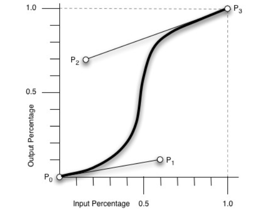
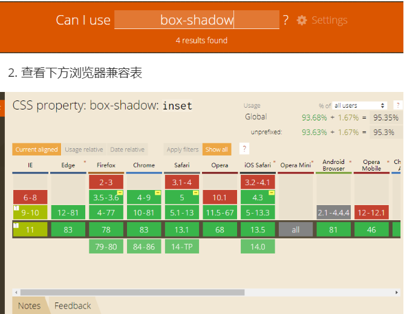

# HTML网页结构

### <!doctype html>

> 告诉浏览器文档类型为HTML5,

- `! `=> 强调
- `doc `=> document 文档
- `type `=> 类型

### html

> 网页的大包围,所有的标签都写在html中,
> `lang`属性:告诉浏览器网页展示的语言类型,zh-cn中文,en英文只跟浏览器的翻译有关
- head

  > 设置网页的基本信息,除``title` 外基本不对用户展示

  - meta

    > charset="utf-8"  设置网页以哪种字符集展示网页语言,注意要与文件存储时的字符集相同
    >
    > name  = "keywords" content = "关键字" 供浏览器引擎搜索,关键字一般不超过三十个
    >
    > name  = "description" content = "网页的描述" 网页被搜索出来时,展示在下方的小字

  - tilte

    > 网页的标题,搜索引擎也可以搜索到其中的内容,

- `title,name="keywords",name="description"`并称网页三要素,添加三要素网页可被百度引擎收录

- body

  > 网页展示给用户的内容都写在body中

# HTML标签

> 语义化标签:有专门的指代性的名词,如标题标签,一看就知道内容为标题.符合W3C规范更利于SEO
>
> 按照规范标签中可以用css样式代替的属性,统一在css中进行设置

### H1~H6

> 权重递减

- h1

  > 网页内容大标题,一个网页只能有一个,有多个时在SEO中会分掉一部分权重,不利于搜索

- h2

  > 网页的分块标题2~5个比较合适

- h3

  > 主页详细分块标题,个数根据需要确定

- h4

  > 非主页下列表内容标题,相对于h3的权重更低一点

### p

> 段落标签(换行标签(br)不推荐使用,且HTML5之后自闭和标签不在添加/)

### a

> 超链接标签.`<a herf="" target="">`

- `herf`三种跳转方式

  > 跳转到公网:'http://www.baidu.com'
  >
  > 跳转到页面内某个地方: '#标签id',跳转到页面内指定id的标签
  >
  > 跳转到本地文件:herf="本地文件路径(相对或绝对)"

  - 相对路径:以自身为基准去其他地方寻址

    > `./`在当前文件夹下寻找
    >
    > `../`在上一级文件夹下寻找

  - 绝对路径:以客观地址为基准进行寻址

- `target`打开网页的位置

  > target='_self':在当前页打开
  >
  > target='_blank':在新页面打开

### hr
> 分隔线标签

### base

> 在head中书写,统一超链接 target的值 :<base target="_blank">链接跳转统一为新开标签

### 转义字符

> [转义符对照表](https://tool.oschina.net/commons?type=2)
>
> 当想要展示的内容与代码语法相混淆时,支持使用转义字符代替

- | 特殊字符 | 描述   | 转义符  |
  | -------- | ------ | ------- |
  |          | 空格   | &nbsp ; |
  | <        | 小于号 | &lt     |
  | >        | 大于号 | &gt     |
  | &        | 和号   | &amp    |

  > 还有很多,可以直接查表

### 文本格式化标签

| 标签          | 描述   |
| ------------- | ------ |
| <b> /<strong> | 加粗   |
| <i> /<em>     | 斜体   |
| <s>/<del>     | 删除   |
| <u>/<ins>     | 下划线 |

> 表中前后的区别:后者具有语义化更符合W3C规范,

### img

> 图片四要素:src width,height,alt

- `src`:图片地址

- `width`:图片宽度,`height`:图片高度

  > 属性默认单位为px不需要加单位,直接填写图片真实宽高需要修改时通过css修改:1,用来占位防止图片未加载时影响其他页面的布局2,引擎搜索到时不要再自己计算图片的大小,便于SEO

- `alt`:图片加载时显示文字内容(便于seo)

- `title`:鼠标悬停时显示

- `border`:边框宽度

  > W3C规定所有可以由CSS样式展示的属性都写在样式中,不写在属性中
  
- `srcset`: 根据不同屏幕的DPR显示不同图片,表示在2倍屏下使用的图片

  `

### 列表

#### 无序列表

> ul>li
>
> ul中不要放除li标签外的其他标签或文字,想放的话在li中放入

#### 有序列表

> ol>li

#### 自定义列表

> dl>dt/dd
>
> dt:相当于一个块的标题或者一个名词
>
> dd:相当于标题下一条条的内容或对名词的一个个解释

# CSS基础

## css引入的三种方式

- 行内式

  > 直接写在标签内部的style属性中,三种引入方式中权重最高

- 内联样式

  > 写在head标签的<style>标签

- 外联样式

  > 在head中通过link href="css样式表地址"  rel="stylesheet",引入外部样式表
  >
  > 需要注意的是:rel属性必须写,他告诉浏览器以什么格式来解析链接的文件,不加rel属性时不生效

**规范:书写属性值的时候要 属性名+:+空格+属性值+分号**

## css选择器

> 确定样式要添加到哪个元素上面

- 标签选择器

  > 标签名+空格+大括号: div {}

- 类名选择器

  > 点+类名+空格+大括号: .类名 {}

- id选择器

  > 井号+id+空格+大括号: #id {}

- 通配符选择器

  > 选择页面的所有元素: 星号+大括号:*{}

- 复合选择器

  > 由两个或多个基础选择器通过不同的方式组合而成

  - 后代选择器

    > 父名 子名 孙名:{}

  - 子代选择器

    > 父名>子名

  - 交集选择器

    > 选中p标签中类名为one的元素:p.one{}

  - 并集选择器

    > 选中p标签和span标签:p,span {}

## css字体属性

- font-style: 斜体/正常/倾斜;

  > 斜体:italic
  >
  > 正常:normal(默认值)
  >
  > 倾斜:oblique

- font-weight: 值;

  > 值可以是:100~900(一百的倍数),normal,bold,border,lighter
  >
  > normal=>400,bold=>700

- font-size: 大小+单位;

  > 单位:px 像素点以像素点的个数为基础
  >
  > 单位:em 相对于当前对象内文本的字体尺寸大小
  >
  > 现在网络普遍使用14px+,小于12px会强制显示为12px,浏览器默认字体大小为16px
  >
  > 尽量使用双数字体大小

- font-family: 字体种类;

  > 字体格式可以是中文或英文,为中文或者英文有空格时都要加英文状态下的引号,英文字体必须在中文字之前
  >
  > 为中文时,最好通过Unicode编码转换一下,在控制台使用escape('字体名'),将的到的字符串中'%u'替换为\即可
  >
  > escape('宋体')=>'%u5B8B%u4F53'
  >
  > 例子:font-family: \5B8B\4F53; =font-family: '宋体';

- font: 字体格式 字体粗细 字体大小/行高 字体种类;

  > 简写时必须按照上面的顺序,想要省略的话其中字体大小和字体种类是不可以省略的.

## 今日规范

> 命名要具有语义性,不能使用数字,拼音,符号
>
> 命名需要多个单词的情况下,在标记语言中用横线连接,(下划线也可以但不推荐,因为有的编辑器下划线不明显),编程语言中可以使用驼峰命名
>
> 命名要进行适当的缩写,单词连接不要超过四层

# CSS样式二 外观属性

> 内联样式表和外链样式表中按照选择器的范围从上到下写,比如所有标签选择器都在所有类名选择器之上

## color颜色

> 设置文本字体颜色color: 预设单词/#十六进制/rgb(0,0,0)/rgba(0,0,0,.5);

- 预设单词:red,blue,black....
- #+十六进制,简写:形如#AABBCC简写为#ABC.#ffffff简写为#fff(节省字节)
- rgb(),根据光的三原色
- rgba(0,0,0,.5)最后一项a为透明度,0.5简写.5节省一个字节

## line-height行高

> 设置两行文字之间的间距:line-height: px/百分比

- px

  > 行高一般为自己文字尺寸+7,8px(根据凑偶数原则来选择)

- 百分比

  > 基于当前标签的字体大小,字体默认大小为16px

## text-align文本对齐方式

> text-align: center(居中)/left(居左对齐)/right(居右对齐)

## text-indent首行缩进

> px:根据像素点缩进
>
> em:根据自身字体大小进行缩进 1em为1倍

## text-decoration文本修饰

> 去除或添加标签的默认格式如a标签的下划线
>
> none:最常用(无文本修饰)
>
> underline:下划线
>
> overline:上划线
>
> line-througt:删除线

## 元素的三种展现形式

> 在默认文档流下

#### 块元素:block

> div p ul dl ol li dd dt h1~h6

- 独占一行
- 可以设置宽高内外边距,具有结构性,宽度默认为父元素内容区域的百分之百
- 内部可以放块元素或者行内元素

#### 行内元素:inline

> img span ins/u del/s em/i b/strong 等文本格式化标签

- 一行可以容纳多个
- 无法设置宽高,由内容决定宽高,水平方向的设置内外边距是有效的,垂直方向设置内外边距无效
- 内部不可以放块元素只能放行内元素(a标签除外,是为了扩展热区,用户交互响应区域,使链接方便点击)

#### 行内块元素:inline-block

> 上述两种元素的结合体,老版IE浏览器不支持	

- 一行可容纳多个
- 可设置宽高以及内外边距,默认为内容宽高
- 当多个行内块元素放在一起的时候,元素之间会有空隙是因为写标签的时候标签之间有空格

#### 标签显示模式转换:

> 块转行内:display: inline;
>
> 行内转块:display: block;
>
> 块,行内转行内块: display: inline-block;

## 今日规范

> 行内元素不换行写,包裹的元素很多也不用换行写
>
> 块级元素换行写,只包含文本或行内元素时不换行
>
> 浏览器字体最小显示12px,小于12px将自动转换为12px,默认字体为16px
>
> 图片设置宽高时只设置宽度,高度自适应 auto 保证图片不失真
>
> 内联css样式 按照选择器范围大小从上到下写,如所有的标签选择器都在所有的类选择器之上

# 盒模型

> 把页面的元素看作是一个盒子,盒模型包括:元素内容,内边距(padding),边框(border),外边距(margin).
>
> 盒模型有两种:box-sizing: content-box(默认标准盒模型),box-sizing: border-box(怪异盒模型)
>
> content-box:盒子显示的宽度=width(内容宽度)+padding+border
>
> border-box:盒子显示的宽度=width width=内容宽度+padding+border
>
> 总的来说区别在于:
>
> 	标准盒模型设置的宽度就是内容的宽度,怪异盒模型设置的宽度就是显示的总宽度
> 	
> 	怪异盒模型适合移动端布局,标准盒模型适合pc端布局
>
>
> ​	

### width 元素宽度

> 只有块级元素,行内块可以设置
> 块级元素默认为父元素的百分之百,这里的百分之百代表的是父元素宽度减去内边距后的宽度,也就是说是默认为父元素的内容宽度
> 块级元素设置百分比宽度的时候依据父级元素设置的width宽度,而不是父元素加上padding后的宽度

### height 元素高度

> 同上,只有块级元素和行内块元素可以设置,一般父盒子不设置高度,由内容撑开

### border 边框

> 盒子边框

- border-width: px;边框宽度

- border-style: none/solid(最常用);边框样式

- border-color: 颜色值;边框颜色

  > border-style: none;和border-width: 0;的区别:
  >
  > none: 表示边框无,浏览器解析时不渲染
  >
  > 0:表示边框宽度为0,浏览器解析时会解析为0;
  >
  > 两者在浏览器上的表现效果是一致的

- 简写:border:border-width  || border-style||border-color

### padding 内边距

> 内容到边框的距离

- padding-top/bottom/left/right: 上内边距/下内边距/左内边距/由内边距;

  > 简写padding: 一个值/两个值/三个值/四个值;
  >
  > 对应方向:四个方向/上下 左右/上 左右 下/上右下左

- 特性:会撑大盒子或压缩内容

  > 设置了width,height的块级元素,增大padding时会一直撑大,未设置width,height的块级元素,增大padding时会增大到父元素的百分之百后向里挤压内容,根据此特性可实现文字竖直排列

### margin 外边距

> 边框外的空白区域

- margin-top/bottom/left/right: 上外边距/下外边距/左外边距/右外边距;

- 简写与padding相同

  > 标准流中,上下盒子之间的距离,哪个盒子的外边距大取哪个,左右边距的距离为两个盒子之和

- 嵌套盒子,外边距塌陷

  > 对于两个嵌套关系的块元素,如果父元素没有上边距或者上边框,则父元素的外边距会与子元素的上外边距重合,合并后取较大值
  >
  > 解决:给父元素添加1px的上边框或者上内边距
  >
  > 给父元素设置overflow: hidden;使其BFC(块级格式化上下文)化

- 需要使用margin: 0 auto;使子元素在父元素中居中时,推荐在父元素上定义padding来挤压子元素,这样当子元素很多时浏览器不必为每个子元素进行margin: 0 auto;的计算节省性能.

### 使用优先级

> width>padding>margin(有margin塌陷问题或margin重合问题)

# CSS背景

> 通过相关属性设置容器的背景

### background-image (背景图片)

> background-image: url(图片路径);
>
> url:资源统一定位符
>
> 其中的图片路径不加引号

### background-color (背景颜色)

> 三种设置方式: background-color: 单词/#十六进制/rgb()
>
> transparent 背景颜色透明

### background-repeat (背景平铺)

> background-repeat: no-repeat(不平铺)/repeat(平铺默认)/repat-x(横向平铺)/repeat-y(纵向平铺)

### background-size (背景尺寸)

> background-size: width  height/单词(cover);
>
> width  height
>
> :px或%,只取一个值的时候优先为x赋值,y为自适应
>
> 单词:cover按比例填满容器

### background-position (背景定位)

> background-position: x y/单词(top left)	
>
> x y:px/%,只有一个值的时候x另一个值自动改为50%,取百分比的时候距离算法:距左边的距离=(盒子宽度-背景图片宽度)x横向百分比,距上边的距离=(盒子高度-背景图片高度)x纵向百分比
>
> 单词:top(距离上边0)/center(居中)/bottom(距离底边为0)/left(距离左边为零)/right (距离右边为零)

### background (复合写法)

> background: color(背景颜色) url()(背景图片路径) repeat(平铺) position(定位)/size(尺寸)
>
> 属性顺序不能错,但是可以省略某些属性
>
> position/size有一个反斜杠的原因: 这两个属性有多个值所以用/来区分哪个属性值属于哪个属性

### background-clip (图片裁剪方式)

> background-clip: content-box/border-box/padding-box;
>
> content-box: 图片只在content区域显示
>
> padding-box: 图片在content区域和padding区域显示
>
> border-box: 图片在content padding border区域都显示

### background-attachment (背景固定)

> background-attachment: fixed/scroll;
>
> fixed:图片固定不随窗口滚动.
>
> scroll:图片随窗口滚动而滚动.

### background-origin (背景位移原点位置)

> background-origin: border-box/padding-box/content-box
>
> border-box: 以边框左上角为远点
>
> padding-box: 以内边距左上角为原点(默认)
>
> content-box: 以实际内容区域为原点

# 伪类选择器

### :hover

> 在基础选择器后添加,表示鼠标移动到元素上才显示的css样式
### 今日规范
> 当不是多级导航时可直接div>a来构建,多级导航用ul>li拓展性更强
> a链接的网址最后要加/保证链接的完整性
> 复合性写法在属性大于三个的时候采用,小于三个用单例写法.否则渲染的时候也会计算其他没写的属性,浪费性能

# CSS复合选择器

### 交集选择器

> 格式:基础选择器基础选择器 {}
>
> 两个基础选择器之间没有空格
>
> 选中均符合两个选择器选择的元素

### 并集选择器

> 格式:
>
> 基础选择器,(换行)
>
> 基础选择器,(换行)
>
> 基础选择器 {}
>
> 每个选择器都要换行写
>
> 只要符合一个选择器,元素就可以被选中

### 后代选择器

> 格式: 基础选择器A(空格)基础选择器B(空格) 基础选择器C {}
>
> 基础选择器之间用空格连接
>
> 选中A下的B下的C
>
> 注意:浏览器解读时从右到左解读:先选择父标签为B的所有C标签,再选择其中以A标签为父标签的B标签
>
> 在开发中一般用多类名来代替实现相同的效果,多类名比较灵活
>
> 一般在保证确定度的前提下,选择器不超过三层

### 子代选择器

> 格式: 基础选择器A(空格)>(空格)基础选择器B {}
>
> 选中以A为父标签的所有B标签

# CSS三大特性

### 层叠性

> 是浏览器解决冲突的一种能力
>
> 如果一个属性通过两个相同的选择器作用在同一个元素上,那么后写的属性会将先写的属性层叠掉,就近原则

### 继承性

> 有时候会发现,写了标签之后会有一些样式(除默认样式外),这些样式就是从父元素继承而来
>
> 允许继承的属性: line- ,font-,text-,以这些单词开头的属性都可以继承给子元素
>
> 注意:background-color并不是继承属性,子元素有类似继承效果的原因是子元素默认背景颜色为transparent(透明)

### 优先级

> 当多个规则应用在同意元素上时:
>
> 选择器相同:层叠性
>
> 选择器不同:按照下面权重来计算

| 选择器                | 权重    |
| --------------------- | ------- |
| 通配符选择器,继承属性 | 0,0,0,0 |
| 标签选择器            | 0,0,0,1 |
| 类选择器,伪类选择器   | 0,0,1,0 |
| ID选择器              | 0,1,0,0 |
| 行内样式              | 1,0,0,0 |
| !important            | 无穷大  |

> 当出现交集,并集,后代,子代选择器的时候,权重会相应的叠加,但不会进位
>
> div ul li{} (该选择器的权重为,0,0,0,1)
>
> a:hover{} (该选择器的权重为0,0,1,1)

- 内联样式与外链样式冲突的时候,依然按照上方权重来计算:

  >  外联:#only {},内联:.div {}
  >
  >  两个选择器选择相同的元素时,会应用#only {}

## 今日规范

> 类名的简写形式:
>
> 专门设置字体的类名:fz12 {font-size: 12px;},fc999 {color: #999;0}
>
> 这种类名虽然没有语义性,以实际用途简写命名也可以

## 网页编写步骤

1. 整体预览网页

   > 浏览器F12打开控制台,快捷键crtl+shift+p打开搜索框,输入capture,选择带full的选项,会自动下载当前网页的图片,可以预览整个网页

2. 将网页文字内容,根据语义性全部写出来

3. 分析网页的布局

4. 分析基础通用样式,包括:文字大小,文字颜色,行间距,色系种类等

# CSS伪类选择器

### a标签常用伪类:

- :link {} 未访问的链接

- :visited {} 已经访问的链接

- :hover {} 鼠标经过

- : active {} 激活中

  > 书写时注意按照上面的顺序,hv包包非常hao

### vertical-align (行内(块)元素对其方式)

> vertical-align: baseline | top |middle |bottom |sub;
>
> 是给子元素设置,并不是给父元素设置
>
> 一般在同一行元素高低不同时给子元素设置

- baseline: 基线对齐(默认)

  > 在没有设置宽高的div中img图片会与父元素底部产生间隙的原因就是这个默认属性,给图片设置为middle即可,开发中一般直接将img转换为块级元素,方便简单.

- top: 顶线对其

- middle: 中线对齐

- bottom: 底线对其

- sub:  垂直对齐文本下标

# 溢出文字的隐藏

> overflow: hidden;
>
> text-overflow: ellipsis;
>
> white-space: nowrap;

### white-space (自动换行)

> normal 默认,空白会被浏览器忽略
>
> pre 空白会被浏览器保留,其行为方式类似HTML中的pre标签
>
> nowrap 文本不会换行,文本会在同一行上继续,直到遇到br
>
> pre-wrap 保留空白符序列,但是正常的进行换行
>
> pre-line 合并空白符序列,保留换行符
>
> inherit 从父元素进行继承该属性

### text-overflow 文字溢出

> clip: 修剪文本
>
> ellipsis: 显示省略号来代替文本
>
> string: 使用给定的字符串来代表被修剪的文本

- 一定首先强制一行显示,再次和overflow属性搭配使用

### 多行文本超出隐藏

```javascript
display: -webkit-box;
-webkit-box-orient: vertical;
-webkit-line-clamp: 3; /* 控制在第几行的结尾进行显示....*/
overflow: hidden; /* 高度宽度必须规定好,不然之后一行也会展示出来*/
```

> 设置line-clamp属性要搭配display: -webkit-box/-webkit-inline-box;使用,并且需设置-webkit-box-orient: vertical;
>
> 加-webkit是非标准的,有兼容问题,使用需谨慎

### opacity 透明

> 父元素设置透明后,子元素也会设置透明,即使给子元素重新设置也不可以

# css伪类选择器

### 不常用伪类选择器

- `element1+element2`: 选中紧跟这element1的element2(同级)
- `element1~element2`:选中跟在elelment1后面的所有element2标签

### 子元素伪类选择器

- `child部分`

  > div p:first-child {} 选中p标签的父元素下的第一个子元素且是p
  >
  > div p:last-child {} 选中p标签的父元素下最后一个子元素且是p
  >
  > div p:nth-child(n): 选中p标签的父级元素下第n个子元素且是p标签,冒号前面未指定类型就是选中第三个子元素 n:可以是数字,公式:2n 2n+1等

- `of-type部分`

  > div p:first-of-type {} 选中p标签的父元素中同类型(标签都为p)的标签中的第一个
  >
  > div p:last-of-type {} 选中p标签的父元素中同类型(同为p标签)的标签的最后一个
  >
  > div p:nth-of-type(n) {} 选中p标签的父元素中同类型的(同为p标签)标签的第n个
  >
  > p可以是其他基础选择器当为类名时:
  >
  > 	div .des:nth-of-type(2n) {}
  >
  > 会选中所有类名为.des的同类型(同为a,同为p)标签的偶数个

- `child`与`of-type`的区别:

  > child没有类型规定,of-type是在同类型中选择.以类名查找时子元素的类型进行分类再继续查找

- `:not(基础选择器)`排除

  > 会在选中的元素中排除掉括号中基础选择器选择的元素

### 属性选择器

> 不用写冒号 ,属性值为数字时加引号

- a[target] {} 选中设置的有target属性的所有a标签
- a[target='_self'] {} 选中target属性值为下划线self的a标签
- a[target^=nn] {} 选中target属性值以nn开头的a标签
- a[target*=nn] {} 选中target属性值中包含nn的a标签
- a[target$=nn] {} 选中target属性值中以nn结尾的a标签

# 伪元素选择器

> 与伪类选择器不同,前面使用两个引号 ::
>
> 相当于在指定位置添加了一个看不见的标签
>
> 不会相互覆盖

### 针对文本

- `::first-letter {}`

  > 首字母伪元素选择器,选中首字母

- `::first-line {}`

  > 首行伪元素选择器,选中第一行

- `::selection {}`

  > 选中文字为元素选择器,对选中的文字添加样式

### ::before/::after

> 在某个元素内部开始位置或结束位置创建一个元素,该元素为行内元素,且必须结合content属性使用

```css
div::before {
    content: '开始位置';
}
div::after {
    content: '结束位置';
}
```


# 精灵图

- 精灵图制作网址:

  [精灵图制作网]: https://www.toptal.com/developers/css/sprite-generator/

# 百度页面新闻列表与反思

### 格局和细节

> **总览网页结构**
>
> **求同存异**: 提取共有属性如颜色,字体大小,行高,相同的选中效果等,找出同一部分结构的不同之处,提前设想解决方式,后期内容变更可能出现的问题如文字溢出
>
> **考虑后期维护**:选择易于维护变更的方式编写代码结构

# 表格与表单

### 表格

> table>tr>td/th(表头)
>
> 结构标签: thead 表头部,tbody 表身体
>
> td跨行和合并:rowspan='行数'
>
> td跨列合并:rolsoan='列数'

### 表单域

>form
>
>属性: action='请求的url'  method="get/post"  name='表单名称'

### 表单控件

- input

  - type:

    > text:文本框
    >
    > password: 密码框
    >
    > radio: 单选框
    >
    > checkbox:多选框 添加checked为默认选中
    >
    > submit: 提交表单按钮
    >
    > rest: 重置表单,回清空表单的所有信息
    >
    > file: 文件上传
    >
    > HTML5新增鸡肋标签:
    >
    > number: 数字选择框
    >
    > date: 年月日选择
    >
    > time:24小时内选择
    >
    > email:邮箱输入框

  - placeholder:输入提示

- label: 输入框前的名字标签,通过for与输入框绑定

- select 下拉框

  - ```html
    <select>
        <option>选项一</option>
        <option>选项二</option>
        <option>选项三</option>
    </select>
    ```

# 浮动

> 普通流(文档流): 就是一个网页内标签元素从上到下从左到右排列顺序的意思
>
> 浮动是指: 设置了浮动属性的元素会脱离标准流的控制,移动到其父元素content区域中指定位置的过程

```css
选择器 {
    float: left/right/none;左浮动/右浮动(从做开始还是从右开始)/不浮动
}
```

### 特点:

- 设置浮动属性的元素会脱离文档流,将原来的位置空出来,其他未脱离文档流的元素会填补上去.
- 元素浮动范围为父元素的content区域
- 浮动会改变元素的显示方式为: `block`
- 浮动的父元素会高度塌陷

### 清除浮动

1. 额外标签法:

   > 在拥有浮动元素的父元素的最后元素的位置添加一个空标签,并设置`clear: both;`
   >
   > ```html
   > <style>
   >  div {
   >      clear: both;
   >  }
   > </style>
   > .
   > .
   > .
   > .
   > <div> </div>
   > ```

2. 伪元素法:

   > 在父元素的结尾添加伪元素
   >
   > ```css
   > .father :after {
   >  content: '',
   >  display: block;
   >  height: 0;
   >  clear: both;
   >  visility: hidden;
   > }
   > ```
   >
   > 其实与空标签法是一个原理,IE6-IE7不支持

3. 设置为BFC(block format content)

   > 给父元素设置: overflow: hidden/scroll/auto;(除默认值visible外)

4. 使用before和after双伪类元素清除浮动

   > ```css
   > .clearfix:before,.clearfix:after { 
   > content:"";
   > display:table;  
   > }
   > .clearfix:after {
   > clear:both;
   > }
   > .clearfix {
   > *zoom:1;
   > }
   > ```
   >
   > 进阶安全版
   >
   > ```css
   > .clearfix{
   > 	zoom:1;
   > }
   > .clearfix:after,.clearfix:before{
   >  content:"";
   >  display:table;
   > }
   > .clearfix:after{
   >  clear:both;
   >  visibility:hidden;
   >  font-size:0;
   >  height:0;
   > }
   > ```

# 版心

> 版心: 是指网页中主体内容所在的区域,一般在浏览器窗口中水平居中显示,常见的宽度值为960px,980px,1000px,1200px等

# 布局流程

> 为提高网页制作效率,布局时通常需要遵守一定的布局流程,具体如下:
>
> 1. 确定页面的版心
> 2. 分析页面中的行模块,以及每个行模块中的列模块
> 3. 制作HTML结构
> 4. CSS初始化,然后开始运用盒子模型的原理,通过DIV+CSS布局来控制网页的各个模块

### 一列固定宽度居中


### 两列左窄右宽型


### 通栏平均分布型


# 定位

> position: static/relative/absolute/fixed;(不定位/相对定位/绝对定位/固定定位)
>
> 偏移量: top定义元素相对定位位置上边的距离,同理还有bottom,left,right

### relative 相对定位

> 相对于元素在文档流的默认位置定位
>
> 1. 不脱标,依然保留文档流中原来的位置

### absolute 绝对定位

> 相对于有定位属性(static除外)的父级位置进行定位
>
> 1. 脱标,不占有原来的位置,相当于自建一个新的层级(与浮动不同,浮动只有一个层级,绝对定位可以有无数个层级)
> 2. **定位元素的宽高百分比是通过定位父级计算,而不是结构父级**
> 3. 未设置偏移量时,元素出现的位置还是文档流的位置
> 4. 绝对定位和固定定位会改变元素的显示模式为:`block`

### fixed 固定定位

> 相对于浏览器窗口(window view)进行定位,不是body什么的,html,body默认高度为零,由内容撑开

### sticky 粘性定位

> css3新增的定位方式,是相对定位和固定定位的混合,元素在滚动到特定位置之前是相对定位,超过设置的阈值就是固定定位,
>
> 元素在可视区域就是相对定位,超出可视区域就是固定定位

#### 流盒

> 粘性定位元素最近的可滚动元素:overflow的值不是visible的盒子,如果没有则表示浏览器视窗盒子

- 根据用户滚动位置进行定位
- 使用粘性定位的时候**必须**要设置,top,left,right,bottom其中的一个,这个就是阈值
- 父元素的`overflow`属性设置`scroll,auto,overlay`属性粘性定位就会失效
- 粘性定位阈值设置为父元素的高度,会失效

### 叠放次序(z-index)

> 当多个元素同时设置定位时,可能出现遮盖的现象,通过z-index设置元素的层级,显示不想被遮盖的元素
>
> 只有绝对定位,相对定位,固定定位的元素可以设置该属性
>
> 符合后来者居上和拼爹理论,即未指定z-index的元素后者先显示,指定了的元素按照z-index来显示,定位父级的层级高,子元素的层级无论多少,比较的时候都高

### 定位实现垂直水平居中

```htmL
<style>
    html,
    body {
        height: 100%;
    }
    /* 第一种,推荐*/
    .div {
        position: adsolute;
        top: 0;
        bottom: 0;
        left: 0;
        right: 0;
        height: 100px;
        width: 100px;
        margin: auto;
    }
    /*第二种*/
    .div {
        position: adsolute;
        top: 50%;
        left: 50%;
        margin-left: -50px;
        margin-top: -50px;
        height: 100px;
        width: 100px;
        margin: auto;
    }
</style>
```

### 定位使用注意

> 定位元素会脱标并且独立新开文档流层级，高度依赖定位会导致浏览器压力大，并且在后期维护中因为定位元素并不能跟随文档流进行流动，所以维护成本高。
>
> 实际开发中 能用文档流+盒子模型处理的布局 轻易不使用浮动 能用浮动处理的布局 不要使用定位 。 只有在最关键的时刻才使用定位进行布局调整。
>
> 使用推荐:
>
> **DIV+CSS>float>position**

# 编程规范HTML+CSS

## HTML

### 命名规范

> 1. 使用具有语义性的单词
>
>    	正确示范 ： wrap description title  content
>       	错误示范 :  aaaa a1 $we 4tdds
>
> 2. 多个单词用中划线连接
>
>    	正确示范 :  header-nav content-left slide-bar  
>       	错误示范 :  headernav slideBar ContentLeft
>
> 3. 命名适当缩写,单词连接不要超过四层
>
>    	正确示范 :  head-tit-ico 
>       	错误示范 :  header-title-left-logo-icon
>
> 4. 不允许使用1,2,3序号来进行命名
>
>    	正确示范: content-product
>       	错误示范: content1 content2
>
> id避免与class重名
>
> id用于识别模块和一级结构区域,且唯一,不要更改线上项目id名称

- 常用命名表:

  | 头     | header    | 内容     | content     | 尾     | footer | 导航     | nav         |
  | ------ | --------- | -------- | ----------- | ------ | ------ | -------- | ----------- |
  | 子导航 | subnav    | 栏目     | column      | 主体   | main   | 新闻     | news        |
  | 版权   | copyright | 文章列表 | list        | 加入   | joinus | 合作伙伴 | partner     |
  | 标志   | logo      | 侧栏     | sidebar     | 横幅   | banner | 状态     | status      |
  | 菜单   | menu      | 子菜单   | submenu     | 滚动   | scroll | 搜索     | search      |
  | 标签页 | tab       | 提示信息 | msg         | 小技巧 | tips   | 标题     | title       |
  | 指南   | guild     | 服务     | service     | 热点   | hot    | 下载     | download    |
  | 注册   | regsiter  | 登录条   | loginbar    | 按钮   | btn    | 投票     | vote        |
  | 注释   | note      | 友情链接 | friend-link | 外套   | wrap   | 面包屑   | bread-crumb |
  | 当前的 | current   | 购物车   | shop        | 图标   | icon   | 文本     | txt         |
  | 容器   | container | wrap     |             |        |        |          |             |

### 尽量不要有空行

### 使用转义字符

### 标签书写和嵌套

> 1. 所有标签都在英文半角状态下书写
> 2. 双标签必须闭合,但标签不写闭合符
> 3. 子级相对父级缩进两个空格
> 4. 属性值带有引号,引号的风格统一为双引或单引
> 5. 列表标签内只允许 li dt dd.
> 6. 除a标签外的行内元素,不允许嵌套块级元素
> 7. p dt h 内不能嵌套块级元素

### 图片文件的命

> 1. 图片后缀名一律小写
>
> 2. 使用间隔符`-`连接
>
>    一般背景图片用`bg-`开头
>
>    按钮用`btn-`开头
>
>    图标`icon`开头
>
>    精灵图`spr-`开头

## CSS 

### 文件顶部注释

> ```css
> /*
>  * @description xxx中文说明 
>  * @author: 作者
>  * @update: 修改人+时间
> */
> ```

### 模块注释

> ```css
> /* module: module by ..... */
> 独占一行
> ```

### 简单注释

> 也另起一行

### 特殊注释

> ```/* TODO:  .......*/```

### 全部小写

### 引号

> 全部使用双引号, 根据公司来

### css3兼容前缀

> 使用css3的属性有必要加入浏览器前缀时顺序则按照:
>
> `-webkit-/-moz-/-ms-/-o-`之后写标准属性

### css书写位置的顺序

> css样式分类
>
> 1. 决定元素或其他元素**位置**的属性:display,position,float,overflow,clear,list-style,z-index
> 2. 自身的属性: width height padding margin line-height border background
> 3. 文本属性: text- font- color
> 4. 其他属性: css3新增,zoom tranform box-shadow等
>
> 浏览器渲染的时候会先确定元素的渲染位置,然后对元素的大小等进行绘制,按照浏览器渲染规则防止'重绘'消耗性能
>
> 按照以上顺序 1>2>3>4

### 布局方式

> 使用优先级: 文档流>盒子模型(padding+margin)>浮动>定位(定位会开设很多层级,引起层级问题和性能问题)

### z-index取值范围

> | 公共头部导航           | 1999 - 2100 |
> | ---------------------- | ----------- |
> | banner与二维码等弹出层 | 999 - 1900  |
> | 页面公共底部           | 1999 - 2100 |
> | 页面公共组件           | -1 - 999    |

### css细节优化

> 1. 0后面不需要加单位,小数的单位可以省略掉0
> 2. HEX 十六进制颜色进行适当的缩写,AABBCC缩写为ABC,AAAAA缩写为AAA
> 3. 不要边框时不要写成bordr: 0;写成border: none;
> 4. 合成精灵图的时候颜色相近的放在临近的位置
> 5. 在H5 规则下script style link标签统统不写type
> 6. 为了SEO和页面的可用性,使用display: none;或text-indent: -9999px;

# CSS3新增样式

> css3是最新的css标准.css3向下兼容css2,可以理解为:为了满足网页的日渐提升的功能性,与设计美学而新增的样式

### border_radius圆角属性

> border-radius: px/%/em;
>
> 一个值: 指定四个方向的值
>
> 两个值: 分别指定左上右下 右上左下
>
> 三个值: 左上 右上左下 右下
>
> 四个值: 顺时针 左上 右上 右下 左下
>
> 四个值/四个值: 左上X 右上X 右下X 左下X/左上Y 右上Y 右下Y 左下Y

### border-image边框图片(了解)

> border-image: source width outset repeat|initial|inherit

### box-shadow盒子阴影

> box-shadow:  x(x轴偏移量) y(y轴偏移量) blur(模糊半径) spread(扩展半径) color(颜色) inset(阴影在内部)
>
> box-shadow的值可以叠加很多层,后面用逗号隔开

### css3渐变

> 可以让你在两个或多个指定的颜色之间显示平稳过渡,它定义了两种渐变类型:
>
> ​	线性渐变:(Linear Gradients)-向下/向上/向左/向右对角方向
>
> ​	径向渐变:(Radial Gradients)-有他们的中心定义
>
> background-image: linear-gradient()
>
> background-image: radial-gradient()

#### 线性渐变

> 从一个方向到另一个方向的 水平垂直斜线 渐变

- 从上到下(默认)

  > background-image: linear-gradient(#e66465, #9198e5);

- 从左到右

  > background-image: linear-gradient(to right,  red, yellow);

- 左上到右下

  > background-image: linear-gradient: (to bottom right, red ,yellow);

- 任意角度

  > background-image: linear-gradient(90deg, red, yellow)

  

- 多种颜色

  > background-image: linear-gradient(to right, red, orange,yellow, green, blue, indigo, violet);
  >
  > 使用透明度: background-image: linear-gradient(to right, raba(4,4,4,0), rgba(0,0,0,1));

- 重复性渐变

  > background-image: repeating-linear-gradient(red, yellow 10%,green 20%);

#### 径向渐变

> 中心向外呈圆形扩散渐变
>
> background-image: radial-gradient(shape(形状),size at position,start-color,...., last-color);
>
> shape: circle(圆形) ellipse(椭圆形)

- 普通模式

  > background-image: radial-gradient(red, yellow, green);

- 分配比例

  > background-image: radial-gradient(red 50%, yellow 15%,green 60%);

- 设置形状

  > background-image: radial-gradient(circle, red, yellow,green);
  >
  > 默认为椭圆

- 重复渐变

  > background-image: reprating-radial-gradient(rea, yellow 10%,green 15%);

### css3文本补充

- text-align-last: left right justify center ;设置如何对齐最后一行或者紧挨着强制换行符之前的行
- text-overflow: clip ellipsis;规定当文本溢出包含元素时是裁剪还是省略号
- text-shadow: X Y blur color; 水平偏移值 垂直偏移值 阴影模糊值 颜色
- word-wrap: normal(单词内不换行/nowrap)

### css3transform 2D变幻

> 在2D平面上进行变幻 包括:平移(translate) 旋转(rotate) 缩放(scale) 倾斜(skew)
>
> transform: translate(20px,30px) rotate(30deg) scale(3,4) skew(20deg,30deg);
>
> transform-origin: x-axis y-axis z-axis;
>
> 注意:所有变换只是视觉效果,盒子实际不脱标,实际还是原来位置

- translate 平移

  > transform: translate(X,Y);

- rotate 旋转

  > transform: rotate(30deg);

- scale 缩放

  > transform: scale(2,3)
  >
  > 该方法增加或缩小的大小,却决于 X,Y的值

- skew 倾斜

  > transform: skew(30deg,20deg);

### css3transition 过渡

> transition: property duration timing-function delay;
>
> proerty(过渡的属性名称) width left 等数值型或color颜色  
>
> duration(过渡需要的时间) s ms
>
> timing-function(过渡速度曲线)
>
> delay 延时时长 m ms
>
> **不同属性的过渡可以叠加**: 后面加逗号可叠加其他属性的过渡效果

- timing-function 

  > | 值                            | 描述                                                         |
  > | :---------------------------- | :----------------------------------------------------------- |
  > | linear                        | 规定以相同速度开始至结束的过渡效果（等于 cubic-bezier(0,0,1,1)）。 |
  > | ease                          | 规定慢速开始，然后变快，然后慢速结束的过渡效果（cubic-bezier(0.25,0.1,0.25,1)）。 |
  > | ease-in                       | 规定以慢速开始的过渡效果（等于 cubic-bezier(0.42,0,1,1)）。  |
  > | ease-out                      | 规定以慢速结束的过渡效果（等于 cubic-bezier(0,0,0.58,1)）。  |
  > | ease-in-out                   | 规定以慢速开始和结束的过渡效果（等于 cubic-bezier(0.42,0,0.58,1)）。 |
  > | cubic-bezier(*n*,*n*,*n*,*n*) | **了解** cubic-bezier 函数中定义自己的值。可能的值是 0 至 1 之间的数值。 |

- >  cubic-bezier即为[贝兹曲线](https://www.baidu.com/s?wd=贝兹曲线&tn=44039180_cpr&fenlei=mv6quAkxTZn0IZRqIHckPjm4nH00T1YkuhR4PhwhuWfzm1wBmW7B0ZwV5Hcvrjm3rH6sPfKWUMw85HfYnjn4nH6sgvPsT6KdThsqpZwYTjCEQLGCpyw9Uz4Bmy-bIi4WUvYETgN-TLwGUv3EnHm1rHDsPWbdnHRvPHckrHbsn0)中的绘制方法。图上有四点，P0-3，其中P0、P3是默认的点，对应了[0,0], [1,1]。而剩下的P1、P2两点则是我们通过cubic-bezier()自定义的。cubic-bezier(x1, y1, x2, y2) 为自定义，x1,x2,y1,y2的值范围在[0, 1]。

  

### css3 animation @keyframes 帧动画

> 比transition更加强大

#### @keyframes 关键帧

> 属性值: 有正常数值的变换属性 或者 颜色
>
> 元素本身不脱标,动画过程中改变位置相关属性,也会改变文档流中的位置

- ```css
  @keyframes 帧动画名称 {
  	from {
  		属性: 属性值;	
  	}
  	百分比 {
  		属性: 属性值;
  	}
  	to {
  		属性: 属性值;
  	}
  }
  或者 
  @keyframes 帧动画名称 {
  	0% {
  		属性: 属性值;
  	}
  	50% {
  		属性: 属性值;
  	}
  	100% {
  		属性: 属性值;
  	}
  } 
  ```

#### animation 播放动画

> 给设置该属性的元素播放指定的动画

- anmarion-name:  **指定播放的动画,多个动画用逗号隔开**

  > animation-name: 动画一,动画二;

- animation-duration: **长时间播放完动画**

  > animation-duration: 10s,20s;

- animation-timing-function 于transition的timing-function取值相同

- animation-delay: **动画开始时间**

- animation-iteration-count: **动画循环次数**

  > infinite 循环播放

- animation-direction :**动画播放方向**

  > 默认为normal alternate代表动画播放在第偶数次向前第奇数次反向播放

- animation-play-state: **播放状态**

  > running(播放) paused(停止) 
  >
  > 不能复合性书写

- 复合性写法:

  > animation:[<animation-name> || <animation-duration> || <animation-timing-function> || <animation-delay> || <animation-iteration-count> || <animation-direction>] [, [<animation-name> || <animation-duration> || <animation-timing-function> || <animation-delay> || <animation-iteration-count> || <animation-direction>] ]
  >
  >  animation: move 3s linear infinite;

# flex弹性布局

> display: flex;设置了该属性的容器可以称为flex容器
>
> flex容器默认存在两根轴: 主轴(默认x轴) 辅轴(默认y轴)
>
> 容器中的元素默认沿主轴排列,且子元素的显示模式强制为`block`

#### 容器属性

> 可以定义在容器中的属性

- flex-direction 设置主轴方向

  > flex-direction: row(横向即x轴)/row-reverse(反向x轴)/colum(y轴)/cloum-reverse(反向y轴);

- justify-conent 元素在主轴方向的对齐方式

  > justify-content: flex-start(对齐开始位置)/flex-end(对齐结束位置)/center(居中)/space-between(两端对齐)/space-around(元素之间间距相等,元素与边框的间距为元素间间距的一半)/space-evently(元素之间以及元素与边框之间的距离都相等)
  >
  > space-evnetly: 在苹果浏览器兼容不好,可以使用以下方式达到同样的效果
  >
  > ```css
  > .father {
  >     display: flex;
  >     justify-content: space-between;
  > }
  > .father:before,
  > .father:after {
  >     content: '',    /* 使用伪元素达到相同的效果*/
  > }
  > ```

- algin-items 元素在辅轴上的对齐方式

  > algin-items: center(居中)/flex-start(对齐开始位置)/flex-end(对齐结束位置)/streth(子元素未设置空间大小时,沿辅轴方向铺满)/baseline(使文本对齐第一个子元素文本的基线)

- flex-wrap 保证元素宽度下换行方式

  > flex-wrap: nowrap(默认不换行)/wrap(换行)/wrap-reverse(反向换行);

- algin-content: 多根辅轴(沿辅轴方向有多行)的情况下的对齐方式,

  > 值与algin-items 的值相同

#### 子元素属性

- order 元素的排列顺序,值越大越靠后

  > order: 0;默认为0

- flex-grow 定义有剩余空间时元素的放大尺寸

  > flex-grow: 0;默认为零不放大,数值好比权重
  >
  > 元素放大尺寸 = 父元素剩余空间/元素总权重*元素自身权重

- flex-shrink 定义元素缩小尺寸

  > flex-shrink: 1;默认为1等比例缩小,为0不缩小

- flex-basis 定义元素在主轴上占据的空间

  > flex-basis: auto;空间为默认大小
  >
  > 如果有剩余空间,元素会变为设置的值

- flex 复合性写法:

  > flex: flex-grow/flex-shrink/flex-basis;
  >
  > flex: 0 1 auto;默认不放大 不缩小 空间默认大小
  >
  > 后两个属性可选

- algin-slef 单独设置元素在辅轴上的位置

  > aligin-slef: auto/center/flex-start/flex-end/streth/baseline
  >
  > 可覆盖父元素的align-items属性值,默认auto,表示继承父元素的align-items属性,

### 阿里字体图标

> 字体图标体积更小,不会失真,随意改变表现样式,且可减少图片请求

1. **拷贝项目下面生成的@font-face**

   > @font-face {
   >   font-family: 'iconfont';
   >   src: url('iconfont.eot');
   >   src: url('iconfont.eot?#iefix') format('embedded-opentype'),
   >       url('iconfont.woff2') format('woff2'),
   >       url('iconfont.woff') format('woff'),
   >       url('iconfont.ttf') format('truetype'),
   >       url('iconfont.svg#iconfont') format('svg');
   > }

2. **文件下载到本地 **

   > 只需要保留只要woff2 woff ttf一步骤中用到的文件,并将一步骤中路径换成本地文件路径

3. **定义icon样式**

   > .iconfont {
   >   font-family: "iconfont" !important;
   >   font-size: 16px;
   >   font-style: normal;
   >   -webkit-font-smoothing: antialiased;
   >   -moz-osx-font-smoothing: grayscale;
   > }

4. **挑选相应图标并获取字体编码，应用于页面**

   > ```html
   > <span class="iconfont">&#x33;</span>
   > ```

# CSS高级

### 兼容处理

> 不同的用户会通过不同的浏览器访问我们的网站,我们需要针对绝大部分主流用户浏览器进行兼容处理,兼容发处理主要包括两种方案(优雅降级,渐进增强)和两种技巧(前缀兼容与HACK兼容)

#### 邀请用户升级浏览器

> 这种方式目前比较普遍,在用户通过老板浏览器登录网站的时候通过服务判断用户浏览器内核版本从而返回升级页面,省时省力但对用户不是很友好.


#### meta强制解析模式

> x-ua-compatible 用来指定IE浏览器解析编译页面的model
>
> x-ua-compatible 头标签大小写不敏感,必须写在head中,必须在除title外的其他meta之前使用

- 使用一行代码来指定浏览器使用特定的文档模式

  ```html
  <meta http-equiv="x-ua-compatible" content="IE=9" >
  <meta http-equiv="x-ua-compatible" content="IE=8" >
  <meta http-equiv="x-ua-compatible" content="IE=7" >
  2、在一些情况下，我们需要限定浏览器对文档的解析到某一特定版本，或者将浏览器限定到一些旧版本的表现中。可以用如下的方式：
  <meta http-equiv="x-ua-compatible" content="IE=EmulateIE9" >
  <meta http-equiv="x-ua-compatible" content="IE=EmulateIE8" >
  <meta http-equiv="x-ua-compatible" content="IE=EmulateIE7" >
  使用这种写法，浏览器或者使用标准模式进行解析，或者使用 IE5 Quirks 模式进行解析。
  3、为了测试，我们也可以使用下面的语句指定浏览器按照最高的标准模式解析页面。
  <meta http-equiv="x-ua-compatible" content="IE=edge" >
  4、多个模式的指定。我们可以用逗号分割多个版本，这种情况下，浏览器会从这个列表中选择一个他所支持的最高版本来使用标准模式进行渲染。如下面的例子，在IE8进行浏览时，将会使用IE7的标准模式进行渲染，因为他本身不支持IE9和IE10。
  <meta http-equiv="x-ua-compatible" content="IE=7,9,10" >
  ```

  - 目前最实用的最新写法

    ```html
    <meta http-equiv="X-UA-Compatible" content="IE=Edge,chrome=1" >
    X-UA-Compatible定义浏览器的渲染方式；
    如果存在客户端Chrome Frame并启用，那么浏览器访问页面会被Chrome内核渲染（这一点没太大意义，因为你开发的项目不能要求用户在客户端来安装Chrome Frame）；也就是说IE浏览器变身Chrome是可以的，但前提是客户端安装了Chrome Frame
    使用IE内核浏览器来访问，会渲染至该浏览器的最高版本，比如你使用IE9浏览器，那么就算在兼容模式切换至IE7，但仍会渲染成IE9的样子（当然IE7浏览器是不会渲染成IE9的,不然想想都好美丽）。
    ```

  - 对多核浏览器(260 搜狗)等强制指定渲染内核 http://se.360.cn/v6/help/meta.html

    ```html 
    <meta name="renderer" content="webkit|ie-comp|ie-stand">
    //content的取值为webkit,ie-comp,ie-stand之一，区分大小写，分别代表用webkit内核，IE兼容内核，IE标准内核。
    ```

    //若页面需默认用极速核，增加标签

    ```html
    <meta name="renderer" content="webkit"> 
    //若页面需默认用ie兼容内核，增加标签：
    <meta name="renderer" content="ie-comp"> 
    // 若页面需默认用ie标准内核，增加标签：
    <meta name="renderer" content="ie-stand">
    ```

#### 兼容前缀

> 不同浏览器因为内核不同,针对同一条css属性的兼容支持也不同,我们可以通过加兼容前缀的方式让一些标准样式在浏览器内可以使用

| 浏览器前缀 | 浏览器                               |
| ---------- | ------------------------------------ |
| -webkit-   | Google Chrome Safari Android Browser |
| -moz-      | Firefox                              |
| -o-        | Opera                                |
| -ms-       | internet Explorer Edge               |
| -khtml-    | Konqueror                            |

- 使用方式

  > 如果css样式在主流浏览器中需要加兼容前缀才能生效,就先写兼容写法,最后写标准写法

  ```css
  .selector {
      -moz-box-shadow: 2px 2px 5px #969696; /*Firefox*/
      -webkit-box-shadow: 2px 2px 5px #969696" /*webkit*/
      box-shadow: 2px 2px 5px #969696;/*opera或ie9*/
  }
  ```

- **关于chrome浏览器内核小知识:** 

   chrome的内核确切的bai说是Chromium引擎，它是使用苹果公司的WebKit作为浏览器内核du原型，是WebKit内核的zhi一个分支。

  Chromium引擎虽然是属于WebKit的分支，却把WebKit的代码梳理得可读性提高很多，所以以前可能需要一天进行编译的代码，现在只要两个小时就能搞定。因此Chromium引擎和其它基于WebKit的引擎所渲染页面的效果也是有出入的。基于以上原因，有的地方会把Chromium引擎跟WebKit区分开来，有的地方则直接把Chromium引擎归为WebKit都是可以的。

  **关于国内浏览器内核小知识:**

  国内浏览器内核基本为webkit内核或 chrominm引擎内核 拼接 Edge 或 IE内核形成 , 比如360浏览器就有内核切换模式, 针对css属性规则上都直接沿用了webkit内核规则, 所以国内开发以chrome为开发浏览器也是考虑这层原因。

#### 兼容查询

> 学会利用工具网站 查询样式在各个浏览器的兼容情况，从而选择更合适的方案。

**工具网站**

地址： https://www.caniuse.com/

使用方法：

1. 在输入框输入需要查询兼容性的  样式属性

   

   > 表头为不同的浏览器品牌 主要查看 IE Edge firefox chrome safari opera这几个主流浏览器的兼容情况
   > 倒数第二行是当前用户主流浏览器版本，以黑色背景包裹。为主要兼容参考
   >
   > 一般我们只看倒数三行的兼容情况
   >
   > 红色标签代表 完全不兼容
   >
   > 绿色标签代表 完全兼容
   >
   > 黄色标签代表 兼容但需要加 兼容方案

#### HACK 兼容(了解)

> hack兼容方式主要应对老版本IE浏览器(IE6 IE7 IE8 IE9) 进行单独样式处理 

```
由于不同的浏览器对CSS的支持及解析结果不一样，还由于CSS中的优先级的关系。我们就可以根据这个来针对不同的浏览器来写不同的CSS。

　　CSS Hack大致有3种表现形式，CSS类内部Hack、选择器Hack以及HTML头部引用(if IE)Hack，CSS Hack主要针对IE浏览器。　　类内部Hack：比如 IE6能识别下划线"_"和星号" * "，IE7能识别星号" * "，但不能识别下划线"_"，而firefox两个都不能认识。等等　　

选择器Hack：比如 IE6能识别*html .class{}，IE7能识别*+html .class{}或者*:first-child+html .class{}。等等　　

HTML头部引用(if IE)Hack：针对所有IE：<!--[if IE]><!--您的代码--><![endif]-->，针对IE6及以下版本：<!--[if lt IE 7]><!--您的代码--><[endif]-->这类Hack不仅对CSS生效，对写在判断语句里面的所有代码都会生效。

书写顺序，一般是将识别能力强的浏览器的CSS写在后面。这里进行简单举例 资料后配一份hack常见兼容处理方案(虽然对于当前开发环境来说基本用不上).
```

**条件注释法:** 

| 注释标识                              |                                        |
| ------------------------------------- | -------------------------------------- |
| <!--[if IE]> hello <![endif]-->       | hello只在IE浏览器显示                  |
| <!--[if IE 6]> hello <![endif]-->     | hello只在IE6浏览器显示                 |
| <!--[if gte IE 6]> hello <![endif]--> | hello只在IE6以上(包括)版本IE浏览器显示 |
| <!--[if IE 8]> hello <![endif]-->     | hello只在IE8上显示                     |
| <!--[if !IE]> hello <![endif]-->      | hello在IE浏览器上不显示                |

**属性前缀法:**

| hack       | 写法                               | IE6(S) | IE6(Q) | IE7(S) | IE7(Q) | IE8(S) | IE8(Q) | IE9(S) | IE9(Q) | IE10(S) | IE10(Q) |
| ---------- | ---------------------------------- | ------ | ------ | ------ | ------ | ------ | ------ | ------ | ------ | ------- | ------- |
| *          | *color                             | Y      | Y      | Y      | Y      | N      | Y      | N      | Y      | N       | Y       |
| +          | +color                             | Y      | Y      | Y      | Y      | N      | Y      | N      | Y      | N       | Y       |
| -          | -color                             | Y      | Y      | N      | N      | N      | N      | N      | N      | N       | N       |
| _          | _color                             | Y      | Y      | N      | Y      | N      | Y      | N      | Y      | N       | N       |
| #          | #color                             | Y      | Y      | Y      | Y      | N      | Y      | N      | Y      | N       | Y       |
| \0         | color:red\0                        | N      | N      | N      | N      | Y      | N      | Y      | N      | Y       | N       |
| \9\0       | color:red\9\0                      | N      | N      | N      | N      | N      | N      | Y      | N      | Y       | N       |
| !important | color:blue !important;color:green; | N      | N      | Y      | N      | Y      | N      | Y      | N      | Y       | Y       |

> 说明：在标准模式中
>
> - “-″减号是IE6专有的hack
> - “\9″ IE6/IE7/IE8/IE9/IE10都生效
> - “\0″ IE8/IE9/IE10都生效，是IE8/9/10的hack
> - “\9\0″ 只对IE9/IE10生效，是IE9/10的hack

```html
.selector {
	 background-color:red; /* 所有浏览器 */  
    background-color:blue !important;/* 除了ie6的浏览器 */  
    *background-color:black; /* IE6, IE7 */  
    +background-color:yellow;/* IE6, IE7*/  
    background-color:gray\9; /* IE6, IE7, IE8, IE9, IE10 */  
    background-color:purple\0; /* IE8, IE9, IE10 */  
    background-color:orange\9\0;/*IE9, IE10*/  
    _background-color:green; /* 只有IE6生效 */  
    *+background-color:pink; /*  只有IE7生效 具体小版本有差别 */  
}
```

**选择器前缀法:** 


*html *前缀只对IE6生效*

+html *+前缀只对IE7生效     

@media \0screen {body { background: red; }}只对IE8有效

@media \0screen\,screen\9{body { background: blue; }}只对IE6/7/8有效

@media screen\0 {body { background: green; }} 只对IE8/9/10有效

@media screen and (min-width:0\0) {body { background: gray; }} 只对IE9/10有效

@media screen and (-ms-high-contrast: active), (-ms-high-contrast: none) {body { background: orange; }} 只对IE10有效等等


#### 优雅降级和渐进增强（取决于需求）

> 什么是渐进增强（progressive enhancement）、优雅降级（graceful degradation）呢？
>
> 渐进增强 progressive enhancement：
>
> 针对低版本浏览器进行构建页面，保证最基本的功能，然后再针对高级浏览器进行效果、交互等改进和追加功能达到更好的用户体验。
>
> 农村包围城市的味道 
> 先说一个简单的例子，例如先完成了页面的基本布局，没有任何特效，那么加个小动画，加个文字阴影等，就是**渐进增强**了

  

>  <b>优雅降级 graceful degradation：</b>
>
>  一开始就构建完整的功能，然后再针对低版本浏览器进行兼容。
>
>  类似蹦极，由高处往低处下落
>
>  让一部分人先富起来带动另一部分人富起来的感觉


> 区别：渐进增强是向上兼容，优雅降级是向下兼容。

> 建议： 现在互联网发展很快， 连微软公司都抛弃了ie浏览器，转而支持 edge这样的高版本浏览器，我们很多情况下没有必要再时刻想着低版本浏览器了，而是一开始就构建完整的效果，根据实际情况，修补低版本浏览器问题。

### 3D变换transform3D

> 3D变形涉及的属性主要是transform-origin、transform、transform-style、perspective、perspective-origin、backface-visibility

#### 坐标轴

在了解透视之前，首先要先了解坐标轴。3D变形与2D变形最大的不同就在于其参考的坐标轴不同。2D变形的坐标轴是平面的，只存在x轴和y轴，而3D变形的坐标轴则是x、y、z三条轴组成的立体空间，x轴正向、y轴正向、z轴正向分别朝向右、下和屏幕外

简单记住他们的坐标：

 x左边是负的，右边是正的

y 上面是负的， 下面是正的

z 里面是负的， 外面是正的


#### 透视(perspective)

> 电脑显示屏是一个2D平面，图像之所以具有立体感（3D效果），其实只是一种视觉呈现，通过透视可以实现此目的。
>
> 透视可以将一个2D平面，在转换的过程当中，呈现3D效果。
>
> - 透视原理： 近大远小 。
> - 浏览器透视：把近大远小的所有图像，透视在屏幕上。
> - perspective：视距，表示视点距离屏幕的长短。视点，用于模拟透视效果时人眼的位置
>
> 注：并非任何情况下需要透视效果，根据开发需要进行设置。
>
> perspective 一般作为一个属性，设置给父元素，作用于所有3D转换的子元素
>
> 理解透视距离原理：
>
> d: 3D坐标系 z轴的长度
>
> z: 元素沿着Z轴移动的距离

#### perspective

> 设置景深,就是Z轴的深度,perspective属性只影响3D转换元素
>
> perspective: 1000px;

#### transform-style 

> 使被转换的子元素保留其 3D 转换,给父元素设置
>
> ```
> transform-style: flat|preserve-3d;
> ```
>
> | 值          | 描述                       |
> | :---------- | :------------------------- |
> | flat        | 子元素将不保留其 3D 位置。 |
> | preserve-3d | 子元素将保留其 3D 位置。   |

#### translate3d(x,y,z)/rotate3d(x,y,z,角度)

> 其中，x和y可以是长度值，也可以是百分比，百分比是相对于其本身元素水平方向的宽度和垂直方向的高度和；z只能设置长度值

#### perspective-origin

> 默认情况下， 坐标系的Z轴位于父元素的水平中线与垂直中线的交界处, 我们也可以通过设置perspective-origin来调整位置

```
使用绝对定位样式移动元素时, 此时坐标系的X轴和Y轴以设置了相对定位的祖先元素的中点为原点
```

```
使用transform的位移样式或是相对定位样式移动元素时, 此时坐标系的X轴和Y轴以元素的中点为原点\
```

> 要注意的是, 在调整z轴的位置的时候 用户的视角也会跟着发生变化

### visibility 

> visibility 控制一个元素是否可见

```
visibility: visible(默认) | hidden
```

设置为 hidden 时 元素不可见但是保留渲染位置 只是视觉上的看不见 

**注意:** display:none; 实现的效果是 元素不进行渲染 在页面上不存在 与 visibility有本质区别   

- 使用display：
  - 1、visibility具有继承性，给父元素设置visibility:hidden;子元素也会继承这个属性。但是如果重新给子元素设置visibility: visible,则子元素又会显示出来。这个和display: none有着质的区别
  - 2、visibility: hidden不会影响计数器的计数，如图所示，visibility: hidden虽然让一个元素不见了，但是其计数器仍在运行。这和display: none完全不一样
  - 3、CSS3的transition支持visibility属性，但是并不支持display，由于transition可以延迟执行，因此可以配合visibility使用纯css实现hover延时显示效果。提高用户体验。
  - 4、visibility:hidden 会被子元素继承，可以通过设置子元素visibility:visible 使子元素显示出来
  - 5、opacity: 0 也会被子元素继承，但是不能通过设置子元素opacity: 0使其重新显示

### FC(格式化上下文)

> FC的全程为： Formatting contexts 格式化上下文
>
> 它是页面中的一块渲染区域，并且有一套自己的渲染规则，他决定了元素如何定位以及和其他元素的作用关系

#### IFC

> inline Formatting Contexts直译为“内联格式化上下文”，
>
> 控制行内元素的显示规则：IFC的line box(线框)高度由其包含行内元素中最高的实际高度计算而来，（不受竖直方向padding和margin影响）
>
> IFC中的line box一般左右紧贴整个IFC,但会以为float元素而扰乱，float元素会位于IFC和line box之间，使得line box宽度缩短。同一个IFC下的多个line box高度不同

#### FFC

> Flex Formatting Contexts 直译为”自适应格式化上下文“，display值为flex，inline-flex的元素会自动生成自适应容器，flex box由伸缩容器和伸缩项目组成。
>
> 通过设置元素的display属性为flex或inline-flex可以得到一个伸缩容器。设置为flex属性的容器被渲染成一个块级元素，而设置了inline-flex的容器则渲染为一个行内元素。伸缩容器中每一个子元素都是一个伸缩项目，伸缩项目可以是任意数量的，伸缩容器外和伸缩项目内的一切元素都不受影响。
>
> 简单的说，FFC定义了伸缩容器内伸缩项目该如何布局。

#### GFC (了解)

> GridLayout Formatting Contexts 直译为“网格布局格式化上下文”，当为一个元素设置display值为grid的时候，此元素将会获得一个独立的渲染区域，我们可以通过在网格容器（grid container）上定义网格 定义行（grid definition rows）和网格定义列（grid definition columns)属性各在网格项目（grid item)上定义网格行（grid row)和网格列（grid columns)为每一个网格项目（fird item）定义未知和空间。
>
> 那么GFC有什么用呢,和table又有什么区别呢?首先同样是一个二维的表格,但GridLayout会有更加丰富的属性来控制行列,控制对齐以及更为精细的渲染语义和控制。

#### BFC

> block Formatting Contexts 直译为块级格式化上下文，就是页面上一个独立的渲染区域，容器里面的子元素不会在布局上影响到外面的元素，反之也是如此。

- **BFC形成条件**

  > 1. 根元素
  > 2. float属性不为none
  > 3. position属性为absolute 或 fixed
  > 4. display为inline-block,table-cell,table-caption,flex,inline-flex
  > 5. overflow不为visible
  >
  > 作用：形成一个完全独立的大箱子 箱子中的子元素与外部元素隔绝开来，不管内部元素怎么搞都不会影响到外部，内部形成一个独立的文档流（官话：他决定了元素如何对齐内容定位以及与其他子元素的关系和相互作用当涉及到可视化布局的时候BFC提供一个环境HTML元素在这个环境下按照颐堤港规则布局

- **BFC特性**

  > 1. BFC中盒子从顶端开始垂直的一个接一个排列
  > 2. 盒子垂直方向的距离由margin决定。属于同一个BFC的两个相邻盒子margin会重叠
  > 3. 在BFC中，每个盒子的左外边缘margin-left会触碰到容器的左边缘border-left
  >    1. BFC区域不会与浮动的盒子产生交集，而是紧贴浮动边缘
  >    2. 计算BFC的高度时，自然也会检测浮动的盒子高度
  >
  > 他是一个独立渲染区域，只有Block-level box参与，它规定了内部的Block-level Box如何布局，并与这个区域外部毫不相干

### iframe 内联框架

> src 网址
>
> width，height:宽高
>
> frameboder: 界面边框，默认为1，常用为0
>
> name
>
> scrolling:滚动条默认auto
>
> srcdoc: 值为HTML标签，

### CSS细节技巧

#### padding margin 百分比

> 百分比的值以父元素宽度为基础，不以高度为基础
>
> 利用这一特性可以配合定位解决图片渲染失败或延迟导致盒子高度不统一出现的频闪问题

#### 视口单位

> vw 视口宽度单位 1vw 视口宽度的1%
>
> vh 视口高度单位 1vh视高度的1%
>
> vmin 选择当前窗口vw和wh中最小的那个
>
> vmax 选取当前窗口宽度或高度中最大的那个

- 

#### 文本模糊&文本不可选中

> ```html
> .text {
> 	text-shadow: #111 0 0 5px;
> 	user-select: none; /*文字是否可选*/
> }
> ```

#### 标签可编辑属性contentEditable

> contentEditable 属性指定元素内容是否可编辑

- ```html
  style标签也可以放在body中，并且也可以添加contenteditable 属性，这就造成我们可以实时编辑样式表。
  
  <!DOCTYPE html>
  <html>
      <body>
          <style style="display:block" contentEditable>
              body { color: blue }
          </style>
      </body>
  </html>
  ```

#### 页面资源缓存问题

> 客户端浏览器在请求一个文件的时候，发现自己的缓存的文件有Last Modified(最后修改时间)，那么请求中会包含If Mopdified Since(修改时间)，这个时间就是缓存文件的Last modified.因此，如果请求中包含if Modified Since就说明文件已经有缓存在客户端。服务端只用判断这个时间和当前请求的文件的修改时间就可以确定是返回304（表示去缓存中取资源）还是200


对于静态文件如css 图片等服务器会自动完成Last Modified和If Modified Since的比较，完成缓存或者更新，但对于动态页面（动态产生的页面），往往没有包含Last Modified信息，这样浏览器，网关就不会做缓存，也就是每次请求的时候都完成一个200的请求

##### 文件版本号

>  <link rel="stylesheet" href="css/reset.css?20200708200603">

**问题**

当用户浏览过网页后，服务端资源文件发生变化时，浏览器无法确定资源文件是否修改，还会从缓存中读取文件

**作用**

> 1. 用户浏览器请求文件后会设置文件请求间隔（间隔内都从本地文件中读取该资源），这导致用户之间的间隔不尽相同，给文件添加版本号后当页面资源发生变化时，可以保证用户同时请求最新的资源文件
> 2. 防止资源文件修改后，浏览器端没发现

#### 固定定位的盒子靠近版心右侧对齐


子盒子固定定位left: 50%; margin-left: 50%;因为margin的百分比是根据父盒子宽度来计算的 。