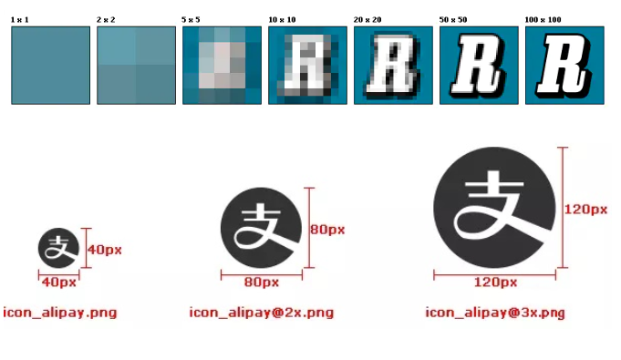
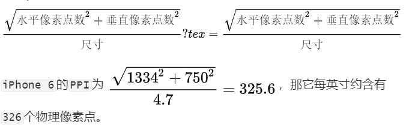
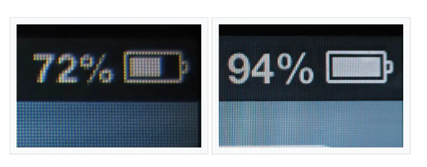
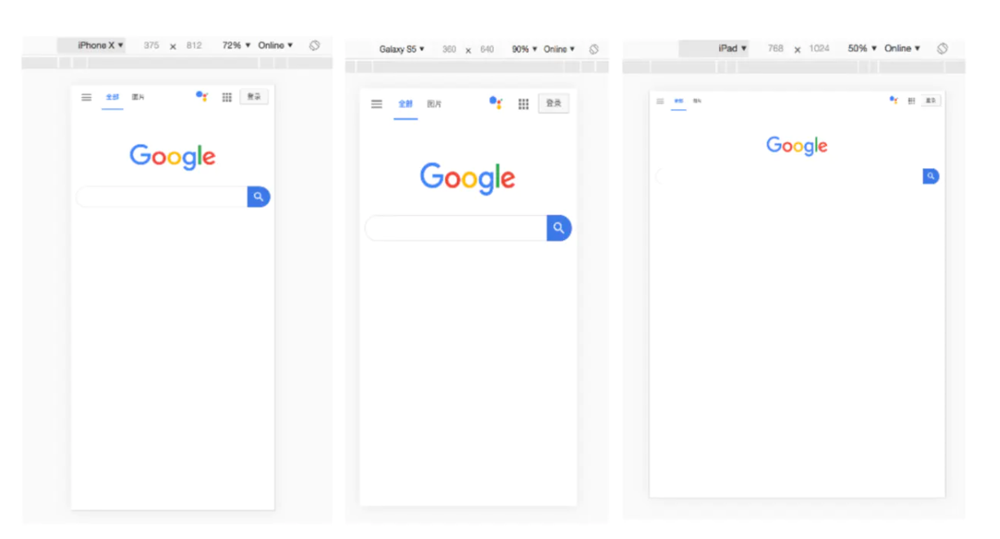
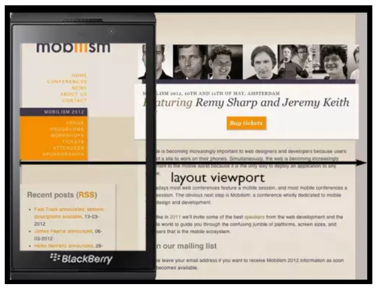
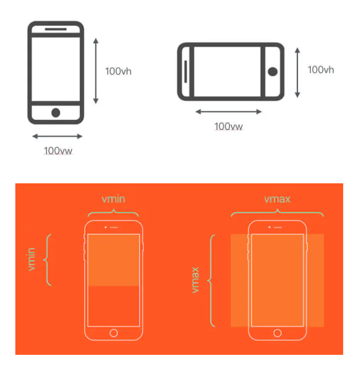
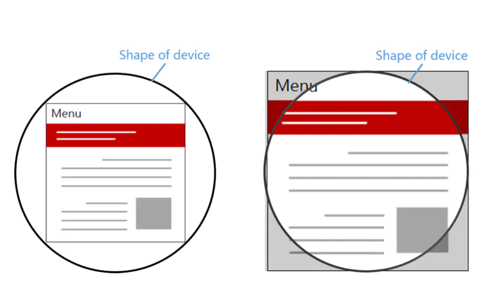
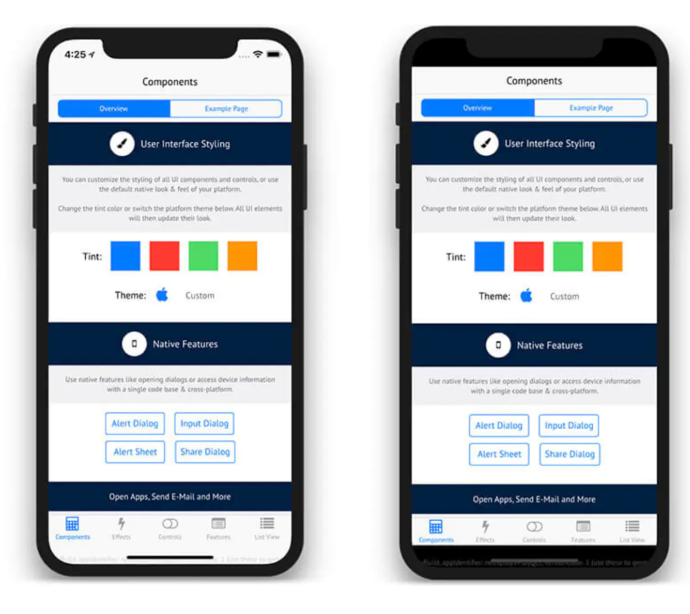

# H5移动端适配

> 移动端web页面的开发由于手机屏幕尺寸,分辨率不同,或者考虑横竖屏问题,为了使得web页面在不同移动设备上具有相适应的展示效果,需要在开发过程中使用合理的适配方案来解决这个问题.

## 尺寸

> 设备的物理尺寸单位为英寸,指屏幕对角线的长度.
>
> `一英寸=2.54厘米`

## 像素

> 分为`物理像素`和`逻辑像素`

### 物理像素

> 手机,电脑显示器,等物理设备上的像素点我们称为`物理像素`,每个像素点其实就是一个个发光元件,是出场就设计的好的,固定不变的.

### 逻辑像素

> 我们css的布局中使用的单位`px`就是`逻辑像素`,是一个相对单位.

## 分辨率

> 分辨率是指物理像素和逻辑像素的个数
>
> 像素有逻辑像素和物理像素之分,对应的分辨率也有`屏幕分辨率(物理)`和`图像分辨率(逻辑)`之分

### 屏幕分辨率

> 指的是一个屏幕具体由多少个`物理像素`点组成

如:某个手机的参数显示分辨率为`2640*1200`,那么这表示手机分别在垂直方向和水平方向所具有的像素点数为2640个和1200个.

### 图像分辨率

> 指图片含有的像素数,比如一张图片的分辨率是`800*400`,这表示分别在垂直和水平上所具有的像素点数为800和400.

同一尺寸的图片,分辨率越高,图片越清晰



## PPI

> Pixel Per Inch:每英寸包括的像素数,指对角线上每英寸有几个像素点

### 公式

> PPI的值越大说明屏幕越清晰



## DPI

> Dot Per Inch:即每英寸包括的点数
>
> 这里是一个抽象单位,它可以是屏幕像素点,图片像素点也可以是打印机的墨点.
>
> 就是说DPI越高打印的图像精度越高

## 设备独立像素DPI

> 实际上PPI和DPI都是描述的物理像素,即设备上的真实物理单元,要想了解什么是设别独立像素首先来了解一个问题

由于不同的手机分辨率是不同的,那么在`320*480`分辨率的手机中显示的图片在`640*980`分辨率的手机中显示时,便会缩小到1/4,那么随着科技的进步,手机的分辨率越来越高,如果是这样设置的话,后面出现的高分辨率手机页面的元素就会越来越小,因此乔布斯在`iphone4`的发布会上便提出的``视网膜屏幕``的概念,在该屏幕中将`2*2`个像素当作一个像素使用,这样使屏幕元素看起来更精致,同时元素的大小也并不会改变.如图分辨率不同的手机显示效果:元素大小相同,精度不同.



**设备独立像素就是指**:我们必须用同一个单位来告诉不同分辨率的手机,他们在界面上显示的元素的大小是多少,这个单位便是设备独立像素,如列表的宽度是300DIP,那么不同的分辨率的手机渲染出来的大小都是300DIP,只是精度不同,即渲染相同尺寸元素使用的像素点个数不同.

### 浏览器中

打开`chrome`的开发者工具，我们可以模拟各个手机型号的显示情况，每种型号上面会显示一个尺寸，比如`iPhone X`显示的尺寸是`375x812`，实际`iPhone X`的分辨率会比这高很多，这里显示的就是设备独立像素。



## 设备像素比DPR

> 即`物理像素`和`设备独立像素`的比值,描述不同分辨率的手机每一设备独立像素对应多少个物理像素

### js获取DPR

```
web中使用
window.devicePixelRatio; // iphoneX 的DPR是3 
css中可以使用媒体查询min-device-pixel-ratio
@media (-webkit-min-device-pixel-ratio: 2),(min-device-pixel-ratio: 2){ 
	/*适配IPhone 两倍屏*/
}
```

### 设计像素

> 若一手机的设备独立像素是`414*736`,设备像素比为3,则设计像素为`414*3*736*3`,开发过程便以这个设计像素为准.

## 移动端app开发下的单位(了解)

在`iOS`、`Android`开发中样式单位其实都使用的是设备独立像素。

`iOS`的尺寸单位为`pt`，`Android`的尺寸单位为`dp`

为了适配所有机型，我们在写样式时需要把物理像素转换为设备独立像素：例如：如果给定一个元素的高度为`200px`(这里的`px`指物理像素，非`CSS`像素)，`iphone6`的设备像素比为`2`，我们给定的`height`应为`200px/2=100dp`。

## web下的开发单位

> 在css中,px即`css像素`,当页面缩放比例为`100%`时,一个`css像素`等于一个设备独立像素.
>
> 当浏览器被放大时,`css像素`会被放大,这时`css像素`会跨越更多的物理像素
>
> `页面缩放系数` = `css像素`/`设备独立像素`

## 视口viewport

> 在pc端就是浏览器可视区域的大小
>
> 在app端绝大多数情况下 viewport 都大于浏览器可视区，保证 PC 页面在移动浏览器上面的可视性。为提升可视性体验，针对移动端有了对 viewport 的深入研究。

在移动端有三种类型的viewport:layoutviewport,visualviewport,idealviewport.具体解释如下:

- layoutviewport 布局视口:大于实际屏幕,元素的宽度继承于布局视口,用于保证网站的外观性与桌面浏览器一样,layoutviewport 到底多宽，每个浏览器不同。iPhone 的 safari 为 980px，通过 `document.documentElement.clientWidth` 获取。
- visualviewport视觉视口:当前显示在屏幕上的页面,即浏览器可视区域的宽度.
- idealviewport理想视口:为浏览器定义的完美适配移动端的理想视口,固定不变,可以认为是设备视口宽度,如iphone7为375px.

当三个视口值相同时,才可以准确开发

### 布局视口

> **元素宽度继承自布局视口**,最顶级元素继承布局视口的宽度,百分比也是根据布局视口来计算的
>
> 如图:为整个网页的宽度



在pc端:布局视口相当于当前浏览器的窗口大小(不包括`borders` 、`margins`、滚动条)

在移动端:布局视口被赋予一个默认值,大部分是`980px`,这保证`pc`的网页可以在手机浏览器上呈现,但是非常小,用户可以手动对网页进行放大.

#### 获取

```
我们可以通过调用`document.documentElement.clientWidth / clientHeight`来获取布局视口大小
```

### 视觉视口

> **用户通过屏幕真实看到的区域**


视觉视口默认为浏览器窗口的大小(包括滚动条宽度),

当用户对浏览器进行缩放时,不会改变`布局视口`的大小,所以页面布局是不会变的,但是缩放会改变`视觉视口`的大小例如:用户将浏览器窗口放大2倍,这是浏览器窗口中的`css像素`会随着`视觉视口`的放大而放大,这时一个`css像素会跨越更多的物理像素`

因此`布局视口`会限制你的css布局而`视觉视口`决定用户具体能看到什么.

#### 获取

```
window.innerWidth / innerHeight
来获取视觉视口大小。
```

### 理想视口

> 布局视口在移动端展示的效果并不理想,所以**理想视口**便诞生了:**网站页面在移动端展示的理想大小**

在浏览器调试移动端时页面上给定的像素大小就是理想视口大小,他的单位正是设备独立像素.

上面介绍的`css像素`时,`页面的缩放系数 = css像素 / 设备独立像素`实际上说`页面的缩放系数 = 理想视口宽度 / 视觉视口宽度`更为准确.

则当页面缩放比例为100%时,`css像素 = 设备独立像素`,`理想视口 = 视觉视口`

#### 获取

```
screen.width / height 来获取理想视口大小。
```

### 视口适配 meta viewport

> 移动端默认布局视口宽度为980px,
>
> `<meat>`元素表示那些不能由其他HTML相关元素表示的任何元数据信息,它可以告诉浏览器如何解析页面.
>
> 我们可以借助`<meta>`元素的viewport来帮助我们设置视口,缩放等,从而使移动端得到更好的展示效果.

```
<meta name="viewport" content="width=device-width, initial-scale=1, maximum-scale=1, minimum-scale=1, user-scalable=no">
name:说明该meta标签的作用
content:设置参数: 通过键=值;的形式配置,各个键值对之间用逗号隔开
    width: 正整数或者device-width,正整数以像素为单位,定义布局视口的宽度
    height: 正整数或device-height,正整数以像素为单位,定义布局视口的高度
    initial-scale:0.0-10.0定义页面初始缩放比率,
    minimum-scale: 0.0-10.0定义缩放的最小值
    maximum-scale:0.0-10.0d定义缩放的最大值
    user-scalable: yes/no,表示用户是否可以缩放网页.默认为yes
```


| `Value`         | 可能值                      | 描述                                                      |
| --------------- | --------------------------- | --------------------------------------------------------- |
| `width`         | 正整数或`device-width`      | 以`pixels`（像素）为单位， 定义布局视口的宽度。           |
| `height`        | 正整数或`device-height`     | 以`pixels`（像素）为单位， 定义布局视口的高度。           |
| `initial-scale` | `0.0 - 10.0`                | 定义页面初始缩放比率。                                    |
| `minimum-scale` | `0.0 - 10.0`                | 定义缩放的最小值；必须小于或等于`maximum-scale`的值。     |
| `maximum-scale` | `0.0 - 10.0`                | 定义缩放的最大值；必须大于或等于`minimum-scale`的值。     |
| `user-scalable` | 一个布尔值（`yes`或者`no`） | 如果设置为 `no`，用户将不能放大或缩小网页。默认值为 yes。 |

> `device-width`就等于理想视口的宽度,所以设置`width=device-width`
>
> 就是将布局视口等于理想视口
>
> 由于`initial-scale = 理想视口宽度 / 视觉视口宽度`,设置为1表示将视觉视口等于理想视口
>
> 这时,1个css像素就等于一个设备独立像素,而且我们也是基于理想视口来进行布局的,所以呈现出来的页面布局在各种设设备上都能大致相似

#### 缩放设置

上面提到`width`可以决定布局视口的宽度，实际上它并不是布局视口的唯一决定性因素，设置`initial-scale`也有可能影响到布局视口，因为布局视口宽度取的是`width`和视觉视口宽度的最大值。

例如：若手机的理想视口宽度为`400px`，设置`width=device-width`，`initial-scale=2`，此时`视觉视口宽度 = 理想视口宽度 / initial-scale`即`200px`，布局视口取两者最大值即`device-width` `400px`。

若设置`width=device-width`，`initial-scale=0.5`，此时`视觉视口宽度 = 理想视口宽度 / initial-scale`即`800px`，布局视口取两者最大值即`800px`。

### 获取窗口大小API

- `window.innerHeight`：获取浏览器视觉视口高度（包括垂直滚动条）。
- `window.outerHeight`：获取浏览器窗口外部的高度。表示整个浏览器窗口的高度，包括侧边栏、窗口镶边和调正窗口大小的边框。
- `window.screen.Height`：获取获屏幕取理想视口高度，这个数值是固定的，`设备的分辨率/设备像素比
- `window.screen.availHeight`：浏览器窗口可用的高度。
- `document.documentElement.clientHeight`：获取浏览器布局视口高度，包括内边距，但不包括垂直滚动条、边框和外边距。
- `document.documentElement.offsetHeight`：包括内边距、滚动条、边框和外边距。
- `document.documentElement.scrollHeight`：在不使用滚动条的情况下适合视口中的所有内容所需的最小宽度。测量方式与`clientHeight`相同：它包含元素的内边距，但不包括边框，外边距或垂直滚动条。

## 媒体查询

> 在css中使用,使用@media查询,你可以针对不同的媒体类型定义不同的样式

### 使用方式

```
@media mediatype and||not||only (media feature rule){
//指定条件下使用下方的样式
	div {
		css样式
	}
}
mediatype: 媒体类型,告诉浏览器这段代码使用在什么类型的媒体上的(如屏幕,打印机等)
and||not|only的含义:
    not：not 关键字反正整个媒体查询的含义。
    only：only 关键字可防止旧版浏览器应用指定的样式，这些浏览器不支持带媒体特性的媒体查询。它对现代浏览器没有影响。
    and：and 关键字将媒体特性与媒体类型或其他媒体特性组合在一起。
media feature rule: 媒体功能,即触发条件
```

### 媒体类型包括

| 值     | 描述                                 |
| :----- | :----------------------------------- |
| all    | 用于所有设备                         |
| print  | 用于打印机和打印预览                 |
| screen | 用于电脑屏幕，平板电脑，智能手机等。 |
| speech | 应用于屏幕阅读器等发声设备           |

### 媒体生效规则

| 值                             | 描述                                                         |
| :----------------------------- | :----------------------------------------------------------- |
| -webkit-min-device-pixel-ratio | 返回屏幕的DPR                                                |
| any-hover                      | 是否有任何可用的输入机制允许用户（将鼠标等）悬停在元素上？在 Media Queries Level 4 中被添加。 |
| any-pointer                    | 可用的输入机制中是否有任何指针设备，如果有，它的精度如何？在 Media Queries Level 4 中被添加。 |
| aspect-ratio                   | 视口（viewport）的宽高比。                                   |
| color                          | 输出设备每个像素的比特值，常见的有 8、16、32 位。如果设备不支持输出彩色，则该值为 0。 |
| color-gamut                    | 用户代理和输出设备大致程度上支持的色域。在 Media Queries Level 4 中被添加。 |
| color-index                    | 输出设备的颜色查询表（color lookup table）中的条目数量。如果设备不使用颜色查询表，则该值为 0。 |
| device-aspect-ratio            | 输出设备的宽高比。已在 Media Queries Level 4 中被弃用。      |
| device-height                  | 输出设备渲染表面（如屏幕）的高度。已在 Media Queries Level 4 中被弃用。 |
| device-width                   | 输出设备渲染表面（如屏幕）的宽度。已在 Media Queries Level 4 中被弃用。 |
| display-mode                   | 应用程序的显示模式，如 web app 的 manifest 中的 display 成员所指定在 Web App Manifest spec 被定义。 |
| forced-colors                  | 检测是用户代理否限制调色板。在 Media Queries Level 5 中被添加。 |
| grid                           | 输出设备使用网格屏幕还是点阵屏幕？                           |
| height                         | 视口（viewport）的高度。                                     |
| hover                          | 主输入机制是否允许用户将鼠标悬停在元素上？在 Media Queries Level 4 中被添加。 |
| inverted-colors                | 浏览器或者底层操作系统是否反转了颜色。在 Media Queries Level 5 中被添加。 |
| light-level                    | 当前环境光水平。在 Media Queries Level 5 中被添加。          |
| max-aspect-ratio               | 显示区域的宽度和高度之间的最大比例。                         |
| max-color                      | 输出设备每个颜色分量的最大位数。                             |
| max-color-index                | 设备可以显示的最大颜色数。                                   |
| max-height                     | 显示区域的最大高度，例如浏览器窗口。                         |
| max-monochrome                 | 单色（灰度）设备上每种“颜色”的最大位数。                     |
| max-resolution                 | 设备的最大分辨率，使用 dpi 或 dpcm。                         |
| max-width                      | 显示区域的最大宽度，例如浏览器窗口。                         |
| min-aspect-ratio               | 显示区域的宽度和高度之间的最小比例。                         |
| min-color                      | 输出设备每个颜色分量的最小位数。                             |
| min-color-index                | 设备可以显示的最小颜色数。                                   |
| min-height                     | 显示区域的最小高度，例如浏览器窗口。                         |
| min-monochrome                 | 单色（灰度）设备上每种“颜色”的最小位数。                     |
| min-resolution                 | 设备的最低分辨率，使用 dpi 或 dpcm。                         |
| min-width                      | 显示区域的最小宽度，例如浏览器窗口。                         |
| monochrome                     | 输出设备单色帧缓冲区中每个像素的位深度。如果设备并非黑白屏幕，则该值为 0。 |
| orientation                    | 视窗（viewport）的旋转方向（横屏还是竖屏模式）。             |
| overflow-block                 | 输出设备如何处理沿块轴溢出视口(viewport)的内容。在 Media Queries Level 4 中被添加。 |
| overflow-inline                | 沿内联轴溢出视口(viewport)的内容是否可以滚动？在 Media Queries Level 4 中被添加。 |
| pointer                        | 主要输入机制是一个指针设备吗？如果是，它的精度如何？在 Media Queries Level 4 中被添加。 |
| prefers-color-scheme           | 探测用户倾向于选择亮色还是暗色的配色方案。在 Media Queries Level 5 中被添加。 |
| prefers-contrast               | 探测用户是否有向系统要求提高或降低相近颜色之间的对比度。在 Media Queries Level 5 中被添加。 |
| prefers-reduced-motion         | 用户是否希望页面上出现更少的动态效果。在 Media Queries Level 5 中被添加。 |
| prefers-reduced-transparency   | 用户是否倾向于选择更低的透明度。在 Media Queries Level 5 中被添加。 |
| resolution                     | 输出设备的分辨率，使用 dpi 或 dpcm。                         |
| scan                           | 输出设备的扫描过程（适用于电视等）。                         |
| scripting                      | 探测脚本（例如 JavaScript）是否可用。在 Media Queries Level 5 中被添加。 |
| update                         | 输出设备更新内容的渲染结果的频率。在 Media Queries Level 4 中被添加。 |
| width                          | 视窗（viewport）的宽度。                                     |

## 移动端适配方案

> 当我们使用px在移动端布局的时候,由于px是固定单位,因此写出来的元素尺寸是固定的,导致相同的元素在不同分辨率的手机显示有的大有的小,而我们希望的是:**相同的元素在不同尺寸的手机上显示占比相同,**因此我们需要其他的单位来统一我们布局使用,她可以根据屏幕的不同来调整元素显示的大小使元素保持比例,不因为手机分辨率的不同而使布局混乱

### lexible rem方案

> `flexible`方案是阿里早期开源的一个移动端适配解决方案,引用`flexible`我们在页面的布局统一使用`rem`来布局

#### rem

> rem单位是一个相对单位,它是根据html标签下规定的字体大小为单位,如:

```
html {
	font-size: 37.5px;
}
则1rem = 37.5px
```

#### 核心原理

了解了什么是rem之后,我们就可以针对不同尺寸的手机使用JS动态修改1rem的大小,通过`document.documentElement.clientWidth`获取到手机视口宽度,然后通过`document.documentElement.style.fontSize`设置font-size为手机视口宽度的1/10或者1/100,那么每1rem就是视口宽度的十分之一或者百分之一,之后我们只需要将UI图中的元素大小除以fontSize转换成rem即可按照比例进行布局

#### 使用

例如: 布局视口是`375px`,则`1rem = 37.5px`,这时ui给定一个元素的宽为`75px(设备独立像素)`,我们只需要将他设计为`75 / 37.5 = 2rem`即可.

```
// set 1rem = viewWidth / 10
function setRemUnit () {
    var rem = docEl.clientWidth / 10
    docEl.style.fontSize = rem + 'px'
}
setRemUnit();
//当页面刷新,显示的时候自动触发
window.addEventListener('resize', setRemUnit);
window.addEventListener('pageshow', function (e) {
    if (e.persisted) {
      setRemUnit()
    }
})
```

快捷计算: 使用stylus的函数封装一个即可.

```stylus
//UI设计图总宽度750 理想视口375
fontSize: 37.5px //设置为理想视口的1/10
innerWidth: 750
rem(px)
    px / innerWidth * 10rem //封装转换函数
```

### vh,vw方案

> vh,vw单位也是一个相对单位,将屏幕的`window.innerWidth`和`window.innerHeight`,等分100份每一份即1vh或者1vw.

上面的`flxible`就是模拟的这种方案,因为早期的vw兼容还没有很全面.

#### vw,vh

- `vw(viewport的width)`: 1vw等于视觉视口宽度的`1%`
- `vh(viewport的height)`:1vh等于视觉视口高度的`1%`
- `vmin`:vw和vh中的较小值,处理手机横屏
- `vmax`:vw和vh中的较大值,处理手机横屏



#### 使用

如果视觉视口为375px,那么1vw就是3.75px,这时ui给定的元素宽度为`75px`我们只需要将他设置为`75/3.75 = 20vw`

```sass
// iPhone 6 尺寸作为设计稿基准
$vw_base: 375px;
@function vw($px) {
    @return ($px / $vw_base) * 100vw;
}
使用sass封装成函数
```

```
例子:
vw_desgin = 750 //定义变量,视口大小
vw(px) //封装函数,将ui尺寸转换为vw/vh
  px/vw_desgin*100vmin

*
  padding: 0
  margin: 0
.wj-header
  position: relative

.wj-header--backarrow
  position: absolute
  top: 0
  left: vw(30)
  line-height: vw(98)
  font-size: vw(36)
  color: #000
```

### vw,rem结合方案

> 问题:
>
> ​        极限条件下,当页面在移动设备上被放的很小或者很大时,页面元素也会随之变的很大或者缩的很小,移动端字体最小为8px,缩小的很多就会出现文字溢出的情况,而放大的很多就导致文字大的离谱.
>
> 解决方式:
>
> ​		给根元素中font-size设置随着视口变化的vw单位,这样便可以动态改变其大小
>
> ​		通过媒体查询限制元素字体的最大最小值,配合body加上最大宽度和最小宽度

```stylus
//UI设计图总宽度750 理想视口375
fontSize: 37.5px //设置为理想视口的1/10
innerWidth: 750
html
    font-size: fontSize / 375 * 100vw //将font-size转换成vw单位
    @media screen and (max-width: 320px){
        //当屏幕宽度小于320px时触发
        font-size: 64px;
    }
    @media screen and (min-width: 540px){
        //当屏幕宽度大于540px时触发
        font-size: 108px
    }
//body也增加最大最小宽度限制,避免默认100%宽度的块级元素过大或过小 
body
    max-width: 540px
    min-width: 320px
```

### 1px问题

> 为了适配各种屏幕我们一般使用设备独立像素进行布局,而设备独立像素比大于1的屏幕,1px实际上被多个物理像素渲染,这就会出现1px在有些屏幕上看起来很粗的现象

#### 伪类+transform

> 基于@media查询判断不同的像素比对线条进行缩放:

```sass
.border_1px:before{
    content: '';
    position: absolute;
    top: 0;
    height: 1px;
    width: 100%;
    background-color: #000;
    transform-origin: 50% 0%;
}
@media only screen and (-webkit-min-device-pixel-ratio:2){
    .border_1px:before{
        transform: scaleY(0.5);
    }
}
@media only screen and (-webkit-min-device-pixel-ratio:3){
    .border_1px:before{
        transform: scaleY(0.33);
    }
}
```

#### 设置viewport

> 通过设置缩放比例,让css像素等于真正的物理像素
>
> 这样虽然可以画出 一个很完美的`1px`线条,但页面其他元素的比例也会被缩小

例如: 当设备像素比为3时,我们将页面缩放`1/3`,这是1px就等于一个真正的屏幕像素

```
 const scale = 1 / window.devicePixelRatio; //获取缩放比
    const viewport = document.querySelector('meta[name="viewport"]');
    if (!viewport) { //若没有viewport标签,就创建一个
        viewport = document.createElement('meta');
        viewport.setAttribute('name', 'viewport');
        window.document.head.appendChild(viewport);
    }
    viewport.setAttribute('content', 'width=device-width,user-scalable=no,initial-scale=' + scale + ',maximum-scale=' + scale + ',minimum-scale=' + scale);//设置缩放比
```

### 图片模糊问题

#### 移动端图片适配:

> 一般在图片外加一层div,防止img加载慢时导致页面重绘问题,设置div的padding -top=imgWidth/imgHeight*divWidth

```
.mod_banner {
    position: relative;
    padding-top: percentage(100/700); // 使用padding-top
    height: 0;
    overflow: hidden;
    img {
        width: 100%;
        height: auto;
        position: absolute;
        left: 0;
        top: 0;
    }
```

#### 图片模糊问题处理

> 问题原因:
>
> 平常使用的图片大多属于位图(jpg,png...),位图由一个一个像素点构成,每个像素点有特定的位置和颜色.理论上位图的每个像素对应屏幕上每个物理像素点渲染时效果最好,而在`dpr>1`的多倍屏中,一个像素点可能对应多个物理像素点渲染,而这些物理像素点并不能被准确的分配上对应位图的颜色,只能取近似值,所以相同的图片在不同的倍屏上显示就会模糊

#### 解决方式

为了保证图片的质量,我们应该尽可能让一个屏幕像素来渲染一个图片像素,针对不同的`DPR`的屏幕,我们需要展示不同分辨率的图片,如在`DPR = 2`的屏幕中使用`@2x`的二倍图,在`DPR = 3`的屏幕使用`@3x`的三倍图

##### 第一种方式

> 通过媒体查询,查询出不同的屏幕使用不同精度的图片.
>
> **只适用于背景图**

```sass
div {
	background-image: url(conardLi_1x.png)
}
@media only screen and (-webkit-min-device-pixel-ratio:2){
	div{
		background-image: url(conardLi_2x.png)
	}
}
@media only screen and (-webkit-min-device-pixel-ratio:3){
	div {
		background-image: url(conardLi_3x.png)
	}
}
或
div {
	background-image: -webkit-image-set(conardLi_1x.png,conardLi_2x.png)
}
```

##### 第二种方式

> 使用img标签的srcset属性

```

//默认使用src,当屏幕是高倍屏时,浏览器会自动根据像素密度匹配最佳图片
```

### 终极高清适配方案

> 为了同时解决:
>
> 1. 1px高清线的问题,缩放viewport且其他元素尺寸正常显示
> 2. 图片高清问题,
> 3. 按照设计图尺寸进行逻辑像素px直接设置

```js
/**
 * @message: 
 * @param {window} win window对象
 * @return {*}
 * @since: 2022-06-30 18:55:05
 */
(function (win) {
  /**
   * @message: js根据屏幕DPR动态修改放大缩小比例,同时根据比率动态修改基础字体大小.rem方案,
   * @param {*} baseFontSize 基础字体大小,若理想视口为375,则基础字体为37.5,或3.75
   * @param {*} fontscale 字体放大比例,有的业务需要
   * @return {*}
   * @since: 2022-06-30 18:55:11
   */  
  win.flex = (baseFontSize, fontscale) => {
    const _baseFontSize = baseFontSize || 100;
    // const _fontscale = fontscale || 1;
    // 兼容处理
    const doc = win.document;
    const ua = navigator.userAgent;
    const matches = ua.match(/Android[\S\s]+AppleWebkit\/(\d{3})/i);
    const UCversion = ua.match(/U3\/((\d+|\.){5,})/i);
    const isUCHd = UCversion && parseInt(UCversion[1].split('.').join(''), 10) >= 80;
    const isIos = navigator.appVersion.match(/(iphone|ipad|ipod)/gi);
    //获取设备DPR 赋值给变量 dpr
    let dpr = win.devicePixelRatio || 1;
    if (!isIos && !(matches && matches[1] > 534) && !isUCHd) {
      // 如果非iOS, 非Android4.3以上, 非UC内核, 就不执行高清, dpr设为1;
      dpr = 1;
    }
    //根据dpr 反比设置scale  dpr越高 缩放比例 越小  2dpr => scale(.5) 3dpr=>scale(.33)
    const scale = 1 / dpr;
    //获取meta viewport标签
    let metaEl = doc.querySelector('meta[name="viewport"]');
    if (!metaEl) {
      //如果没有 创建一个
      metaEl = doc.createElement('meta');
      metaEl.setAttribute('name', 'viewport');
      doc.head.appendChild(metaEl);
    }

    // 设置meta viewport 属性 拼接缩放比例到 content值中
    metaEl.setAttribute('content', `width=device-width,user-scalable=no,initial-scale=${scale},maximum-scale=${scale},minimum-scale=${scale}`);
    //根据缩小倍率 反向 等比放大 html的font-size 保证实际效果一样
    doc.documentElement.style.fontSize = `${_baseFontSize  * dpr}px`; //也可以在css中,按比例设置为vw
    document.documentElement.setAttribute('data-dpr', dpr)
  };
})(window);
```

### 适配iPhoneX

`iPhoneX`的出现将手机的颜值带上了一个新的高度，它取消了物理按键，改成了底部的小黑条，但是这样的改动给开发者适配移动端又增加了难度。

####  安全区域`

在`iPhoneX`发布后，许多厂商相继推出了具有边缘屏幕的手机。

这些手机和普通手机在外观上无外乎做了三个改动：圆角（`corners`）、刘海（`sensor housing`）和小黑条（`Home Indicator`）。为了适配这些手机，安全区域这个概念变诞生了：安全区域就是一个不受上面三个效果的可视窗口范围。

为了保证页面的显示效果，我们必须把页面限制在安全范围内，但是不影响整体效果。

#### viewport-fit

`viewport-fit`是专门为了适配`iPhoneX`而诞生的一个属性，它用于限制网页如何在安全区域内进行展示。



`contain`: 可视窗口完全包含网页内容

`cover`：网页内容完全覆盖可视窗口

默认情况下或者设置为`auto`和`contain`效果相同。

#### env、constant



我们需要将顶部和底部合理的摆放在安全区域内，`iOS11`新增了两个`CSS`函数`env、constant`，用于设定安全区域与边界的距离。

函数内部可以是四个常量：

- `safe-area-inset-left`：安全区域距离左边边界距离
- `safe-area-inset-right`：安全区域距离右边边界距离
- `safe-area-inset-top`：安全区域距离顶部边界距离
- `safe-area-inset-bottom`：安全区域距离底部边界距离

注意：我们必须指定`viweport-fit`后才能使用这两个函数：

```html
<meta name="viewport" content="viewport-fit=cover">
```

`constant`在`iOS < 11.2`的版本中生效，`env`在`iOS >= 11.2`的版本中生效，这意味着我们往往要同时设置他们，将页面限制在安全区域内：

```css
body {
  padding-bottom: constant(safe-area-inset-bottom);
  padding-bottom: env(safe-area-inset-bottom);
}
```

当使用底部固定导航栏时，我们要为他们设置`padding`值：

```css
{
  padding-bottom: constant(safe-area-inset-bottom);
  padding-bottom: env(safe-area-inset-bottom);
}
```


### 细节适配

> 移动端浏览器厂商复杂 IOS版本 安卓内核版本参差不齐 还有微信浏览器 QQ浏览器这种魔改内核版本 我们需要对一些个性化进行适配处理

#### meta权限

设定禁止浏览器从本地机的缓存中调阅页面内容，设定后一旦离开网页就无法从Cache中再调出

```html
<meta http-equiv="Pragma" content="no-cache" >
```

禁止将页面中的一连串数字识别为电话号码/邮箱、并设置为手机可以拨打的一个连接。 telephone默认值为 yes

```html
<meta name="format-detection" content="telephone=no, email=no" >
```

  .iphone设备中的safari私有meta标签它表示：允许全屏模式浏览；用于删除默认的苹果工具栏和菜单栏

```html
<meta name="apple-mobile-web-app-capable" content="yes" >
```

content设置状态栏颜色,iphone的私有标签，它指定的iphone中safari顶端的状态条的样式；

```html
<meta name="apple-mobile-web-app-status-bar-style" content="black">
```

其他内核浏览器模式设置与权限配置

```html
<!-- 启用360浏览器的极速模式(webkit) -->
<meta name="renderer" content="webkit">
<!-- 避免IE使用兼容模式 -->
<meta http-equiv="X-UA-Compatible" content="IE=edge">
<!-- 针对手持设备优化，主要是针对一些老的不识别viewport的浏览器，比如黑莓 -->
<meta name="HandheldFriendly" content="true">
<!-- 微软的老式浏览器 -->
<meta name="MobileOptimized" content="320">
<!-- uc强制竖屏 -->
<meta name="screen-orientation" content="portrait">
<!-- QQ强制竖屏 -->
<meta name="x5-orientation" content="portrait">
<!-- UC强制全屏 -->
<meta name="full-screen" content="yes">
<!-- QQ强制全屏 -->
<meta name="x5-fullscreen" content="true">
<!-- UC应用模式 -->
<meta name="browsermode" content="application">
<!-- QQ应用模式 -->
<meta name="x5-page-mode" content="app">
<!-- windows phone 点击无高光 -->
<meta name="msapplication-tap-highlight" content="no">
```


#### 兼容优化

##### 滑动卡顿

```css
-webkit-overflow-scrolling: touch;
overflow-scrolling: touch;

touche://使用具有回弹效果的滚动, 当手指从触摸屏上移开，内容会继续保持一段时间的滚动效果。继续滚动的速度和持续的时间和滚动手势的强烈程度成正比。同时也会创建一个新的堆栈上下文。 同样可以解决overflow-x:auto在iOS的兼容问题

auto://使用普通滚动, 当手指从触摸屏上移开，滚动会立即停止。

```

##### IOS头部/底部的fixed定位导致输入框收回闪屏问题

```css
main{
    position:fixed;
    top:50px;
    bottom:50px;
    overflow:scroll;
}

//只需要在中间部分外层div添加css样式
```

##### iOS下取消input在输入的时候英文首字母的默认大写

```html
<input type="text" autocapitalize="none">
```

##### iOS系统中,中文输入法输入英文时,字母之间可能会出现一个六分之一空格的问题

```js
this.value = this.value.replace(/\u2006/g, '');
```

##### 某些情况下非可点击元素如(label,span)监听click事件,ios下不会触发

```css
cursor: pointer;

//针对此种情况只需对不触发click事件的元素添加一行css代码即可
```

##### 移动端元素:active伪类不生效 

```html
<body ontouchstart>
    <!-- 给body添加 ontouchstart 属性-->
</body>
```


##### html在移动端IOS点击闪屏问题

```css
html,body{
    -webkit-tap-highlight-color: rgba(0, 0, 0, 0); //或者 transparent
}
```

##### 打电话，发短信，写邮件

```html
打电话:
<a href="tel:10086">拨打10086</a>

发短信:
<a href="sms:10086">发短信给10086</a>  //winphone系统无效

发邮件：

//注：在添加这些功能时，第一个功能以"?"开头，后面的以"&"开头


//普通邮件
<a href="mailto:2971411050@qq.com">点击我发邮件</a>


//收件地址后添加?cc=开头，可添加抄送地址（Android存在兼容问题）
<a href="mailto:2971411050@qq.com?cc=2971411050@qq.com">点击我发邮件</a>
```

##### 阻止旋转屏幕时自动调整字体大小

```css
* {
	-webkit-text-size-adjust: none;
    -webkit-text-size-adjust: 100%;
    -ms-text-size-adjust: 100%;
    text-size-adjust: 100%;
}

//iOS浏览器横屏时会重置字体大小,设置text-size-adjust为none可以解决iOS上的问题,但桌面版Safari的字体缩放功能会失效,因此最佳方案是将text-size-adjust为100%
```

##### input的placeholder会出现文本位置偏上的情况

```css
input[type="text"] {
    line-height:normal;
}

//input 的placeholder会出现文本位置偏上的情况：PC端设置line-height等于height能够对齐，而移动端仍然是偏上，解决方案时是设置css
```


#### 移动端样式美化

```css
//去掉webkit的滚动条

::-webkit-scrollbar{ display：none; }

::-webkit-scrollba //滚动条整体部分  

::-webkit-scrollbar-thumb   //滚动条内的小方块  

::-webkit-scrollbar-track   //滚动条轨道  

::-webkit-scrollbar-button  //滚动条轨道两端按钮  

::-webkit-scrollbar-track-piece  //滚动条中间部分，内置轨道  

::-webkit-scrollbar-corner       //边角，两个滚动条交汇处  

::-webkit-resizer            //两个滚动条的交汇处上用于通过拖动调整元素大小的小控件   

// 禁止长按链接与图片弹出菜单  

a,img { -webkit-touch-callout: none }       

// 禁止ios和android用户选中文字  

html,body {
    -webkit-user-select:none;
    user-select: none; 
}    

// 改变输入框placeholder的颜色值  

::-webkit-input-placeholder { /* WebKit browsers */  
	color: #999; 
}  
:-moz-placeholder { /* Mozilla Firefox 4 to 18 */  
	color: #999; 
} 
::-moz-placeholder { /* Mozilla Firefox 19+ */ 
    color: #999; 
} 
:-ms-input-placeholder { /* Internet Explorer 10+ */ 
    color: #999; 
}  
input:focus::-webkit-input-placeholder{ 
    color:#999; 
}   

// android上去掉语音输入按钮  
input::-webkit-input-speech-button {
     display: none
} 
//去除input默认样式的方法
input {
     /*可同时屏蔽输入框怪异的内阴影,解决iOS下无法修改按钮样式,测试还发现,加了此属性后,iOS下默认还是有圆角的,不过可以用border-radius属性修改*/
    -webkit-appearance: none;
    border: 0;
}

```


#### 终端访问判断

```js
var browser= {
versions:function(){
var u = navigator.userAgent, app = navigator.appVersion;

return {
    trident: u.indexOf('Trident') > -1, //IE内核

    presto: u.indexOf('Presto') > -1, //opera内核

    webKit: u.indexOf('AppleWebKit') > -1, //苹果、谷歌内核

    gecko: u.indexOf('Gecko') > -1 && u.indexOf('KHTML') == -1,//火狐内核

    mobile: !!u.match(/AppleWebKit.*Mobile.*/), //是否为移动终端

    ios: !!u.match(/\(i[^;]+;( U;)? CPU.+Mac OS X/), //ios终端

    android: u.indexOf('Android') > -1 || u.indexOf('Adr') > -1, //android终端

    iPhone: u.indexOf('iPhone') > -1 , //是否为iPhone或者QQHD浏览器

    iPad: u.indexOf('iPad') > -1, //是否iPad

    webApp: u.indexOf('Safari') == -1, //是否web应该程序，没有头部与底部

    weixin: u.indexOf('MicroMessenger') > -1, //是否微信 （2015-01-22新增）

    qq: u.match(/\sQQ/i) == " qq" //是否QQ

};

}(),

language:(navigator.browserLanguage || navigator.language).toLowerCase()

}；
```


## 移动端事件

### touch事件组

> touch事件组最早出现于IOS safari中，为了向开发人员转达一些特殊的信息，所以新增了这些事件，随着Android中的webkit的加入，慢慢地这样的专有事件成了事实的标准，从而导致W3C开始指定Touch Event规范的内容。

- touchstart 手指触摸屏幕时触发，即使已经有手指在屏幕上也会触发。
- touchmove 手指在屏幕滑动时触发。
- touchend 手指从屏幕时移开时触发。

```js
  elem.addEventListener("touchstart",function(e){
      console.log('touch触屏触摸');
  });

  elem.addEventListener("touchmove",function(e){
      console.log('touch触屏移动');
  });

  elem.addEventListener("touchend",function(e){
      console.log('touch触屏抬起');
  });

  elem.addEventListener("touchcancel",function(e){
      console.log('系统取消触摸事件的时候触发');
  });

```

监听触摸后触摸事件会实现一个event对象，这个对象里面包括3个触摸对象列表。

```
touches   屏幕上所有手指列表 

targetTouches   在当前DOM标签上手指的列表

changedTouches   涉及当前事件的手指的列表 //当手指抬起时上面两个数组会直接清空,无法监视手指抬起,但在changedTouches中会有保存数据
```


event属性

```
clientX      触摸目标在浏览器中的x坐标 

clientY      触摸目标在浏览器中的y坐标

identifier    标识触摸的唯一ID。  从0开始给手指编号 ... 

pageX      触摸目标在当前DOM中的x坐标

pageY      触摸目标在当前DOM中的y坐标

screenX      触摸目标在屏幕中的x坐标

screenY      触摸目标在屏幕中的y坐标

target      触摸的DOM节点目标。
```

### click延迟

> 在早期的手机上，浏览器为了能够实现放大和缩放功能，采用双击的方式来达到这样的交互效果，为了实现这样的效果，浏览器需要判断用户在第一次触碰屏幕之后，是否在300ms之内再次点击，有则表明用户希望缩放和放大，所以click事件会推迟到300ms之后运行。


#### 解决方案: 


##### 使用FastClick库  

```html
<script src="https://cdn.bootcdn.net/ajax/libs/fastclick/0.1.0/fastclick.js"></script>
```

```js
// 使用了jquery的时候
$(function() {
    FastClick.attach(document.body);
});


// 没使用jquery的时候  
if ('addEventListener' in document) {
    document.addEventListener('DOMContentLoaded', function() {
        FastClick.attach(document.body);
    }, false);
}

//DOMContentLoaded dom内容加载完毕触发 load事件会在所有资源(图片 脚本等)加载完成后触发
//DOMContentLoaded 的触发不需要等待图片等其他资源加载完成。
```

##### 禁用缩放或设置理想视口

> 目前基本页面适配都是使用viewport标签适配 也都会锁定缩放和禁止用户缩放

```html
<meta name="viewport" content="user-scalable=no"> 
<meta name="viewport" content="width=device-width">
```

##### zepto tap事件

> **Zepto**是一个轻量级的**针对现代高级浏览器的JavaScript库，** 它与jquery**有着类似的api**。 如果你会用jquery，那么你也会用zepto。
> 相当于移动端的jquery


地址: 

https://www.html.cn/doc/zeptojs_api/#

https://github.com/madrobby/zepto

##### Touch events

地址:  https://github.com/madrobby/zepto/blob/master/src/touch.js#files

“touch”模块添加以下事件，可以使用 [on](https://www.html.cn/doc/zeptojs_api/#on) 和 [off](https://www.html.cn/doc/zeptojs_api/#off)。

- `tap` —元素tap的时候触发。
- `swipe`, `swipeLeft`, `swipeRight`, `swipeUp`, `swipeDown` — 当元素被划过时触发。(可选择给定的方向)
- `longTap` — 当一个元素被按住超过750ms触发。touchstart 开始750ms内没有触发touchmove touchend scroll
- `singleTap` and `doubleTap` — 这一对事件可以用来检测元素上的单击和双击。(如果你不需要检测单击、双击，使用 `tap` 代替)。

这些事件也是所有Zepto对象集合上的快捷方法。

```html
  <script src="js/zepto.min.js"></script>
  <script src="js/zepto-touch.js"></script>
  <script>
    const target = document.querySelector('#target');

    target.addEventListener('click', () => {
      console.time();
      console.log('click');
      console.timeEnd();
    })

    target.addEventListener('touchstart', () => {
      console.time();
      console.log('touchstart');
      console.timeEnd();
    })

    $(target).on('tap', function () {
      console.time();
      console.log('tap');
      console.timeEnd();
    })
<script>
```

### 移动端事件类库

#### 百度touchjs

基本事件：

touchstart  //手指刚接触屏幕时触发

touchmove  //手指在屏幕上移动时触发

touchend   //手指从屏幕上移开时触发

touchcancel //触摸过程被系统取消时触发（少用）


##### 事件绑定

touch.on( element, types, callback );

**功能描述**：事件绑定方法，根据参数区分事件绑定和事件代理。

**参数描述**：

| 参数     | 类型            | 描述                                                         |
| :------- | :-------------- | :----------------------------------------------------------- |
| element  | element或string | 元素对象、选择器                                             |
| types    | string          | 事件的类型（多为手势事件），可接受多个事件以空格分开；支持原生事件的透传 |
| callback | function        | 事件处理函数, 移除函数与绑定函数必须为同一引用;              |


##### 手势事件

| 分类        | 参数         | 描述         |
| :---------- | :----------- | :----------- |
| 缩放        | pinchstart   | 缩放手势起点 |
| pinchend    | 缩放手势终点 |              |
| pinch       | 缩放手势     |              |
| pinchin     | 收缩         |              |
| pinchout    | 放大         |              |
| 旋转        | rotateleft   | 向左旋转     |
| rotateright | 向右旋转     |              |
| rotate      | 旋转         |              |
| 滑动        | swipestart   | 滑动手势起点 |
| swiping     | 滑动中       |              |
| swipeend    | 滑动手势终点 |              |
| swipeleft   | 向左滑动     |              |
| swiperight  | 向右滑动     |              |
| swipeup     | 向上滑动     |              |
| swipedown   | 向下滑动     |              |
| swipe       | 滑动         |              |
| 拖动开始    | dragstart    | 拖动屏幕     |
| 拖动        | drag         | 拖动手势     |
| 拖动结束    | dragend      | 拖动屏幕     |
| 拖动        | drag         | 拖动手势     |
| 长按        | hold         | 长按屏幕     |
| 敲击        | tap          | 单击屏幕     |
| 双击屏幕    | doubletap    |              |


##### 事件处理函数回调event对象属性

| 属性         | 描述                                               |
| :----------- | :------------------------------------------------- |
| originEvent  | 触发某事件的原生对象                               |
| type         | 事件的名称                                         |
| rotation     | 旋转角度                                           |
| scale        | 缩放比例                                           |
| direction    | 操作的方向属性                                     |
| fingersCount | 操作的手势数量                                     |
| position     | 相关位置信息, 不同的操作产生不同的位置信息         |
| distance     | swipe类两点之间的位移                              |
| distanceX, x | 手势事件x方向的位移值, 向左移动时为负数            |
| distanceY, y | 手势事件y方向的位移值, 向上移动时为负数            |
| angle        | rotate事件触发时旋转的角度                         |
| duration     | touchstart 与 touchend之间的时间戳                 |
| factor       | swipe事件加速度因子                                |
| startRotate  | 启动单指旋转方法，在某个元素的touchstart触发时调用 |


#### iScroll

> iScroll是一个高性能，资源占用少，无依赖，多平台的javascript滚动插件。
>
> 它可以在桌面，移动设备和智能电视平台上工作。它一直在大力优化性能和文件大小以便在新旧设备上提供最顺畅的体验。
>
> iScroll不仅仅是 滚动。它可以处理任何需要与用户进行移动交互的元素。在你的项目中包含仅仅4kb大小的iScroll，你的项目便拥有了滚动，缩放，平移，无限滚动，视差滚动，旋转功能。给它一个扫帚它甚至能帮你打扫办公室。

##### 地址: 

https://github.com/cubiq/iscroll

http://caibaojian.com/iscroll-5/

文件地址: 

https://github.com/cubiq/iscroll/blob/master/build/iscroll.js

```html
<div id="wrapper">
    <ul>
        <li>...</li>
        <li>...</li>
        ...
    </ul>
</div>
<script type="text/javascript">
var myScroll = new IScroll('#wrapper');
</script>
```

