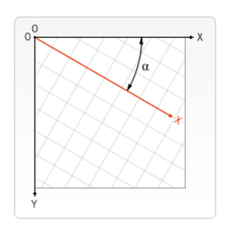

# HTML5

> HTML的第五次重大修改,增加了很多标签和API,目前Firefox,IE9及其更高版本,Chrome,safari,Opera等均支持

**目的**

> HTML5的设计目的是在移动设备上支持多媒体.引进新的语法特征来支持这一点如`video`,`audio`,`canvas`标记,还引进了新的功能,可以真正改变用户与文档的交互方式.

**优点**

> 1. 提高可用性和改进用户体验
> 2. 有几个新的标签,有助于开发人员定义重要内容
> 3. 可以给站点带来更多的多媒体元素
> 4. 可以很好的代替flash和silverlight
> 5. 当涉及到网站抓取和索引的时候对SEO很友好
>    - seo:集优算法,好的网页更好搜索,不好的网页更难搜索
>    - 什么是好的网页?1,网页是否符合w3c规范2,SEO友好度3,内容原创(语义化标签)

**缺点**

> 各个浏览器厂商在规则的实践上存在差异,兼容性需要控制

## 新增语义化标签

### 语义化结构标签

```
常用:
<header> 对应 .header 网页的头部标签
<nav>    对应 .nav    导航标签
<main>   对应 .main   主要内容
<section>对应 .content分块内容,每个大块
<article>对应 左边     大块中分区域的小块
<aside>  对应 右边     大块中分区域的小块
<footer> 对应 .footer 网页尾部
```

| ***\*标签\**** | ***\*描述\****                                               |
| -------------- | ------------------------------------------------------------ |
| <article>      | 定义页面的侧边栏内容                                         |
| <aside>        | 定义页面内容之外的内容。                                     |
| <bdi>          | 允许您设置一段文本，使其脱离其父元素的文本方向设置。         |
| <command>      | 定义命令按钮，比如单选按钮、复选框或按钮                     |
| <details>      | 用于描述文档或文档某个部分的细节                             |
| <dialog>       | 定义对话框，比如提示框                                       |
| <summary>      | 标签包含 details 元素的标题                                  |
| <figure>       | 规定独立的流内容（图像、图表、照片、代码等等）。             |
| <figcaption>   | 定义 <figure> 元素的标题                                     |
| <footer>       | 定义 section 或 document 的页脚。                            |
| <header>       | 定义了文档的头部区域                                         |
| <mark>         | 定义带有记号的文本。                                         |
| <meter>        | 定义度量衡。仅用于已知最大和最小值的度量。                   |
| <nav>          | 定义运行中的进度（进程）。                                   |
| <progress>     | 定义任何类型的任务的进度。                                   |
| <ruby>         | 定义 ruby 注释（中文注音或字符）。                           |
| <rt>           | 定义字符（中文注音或字符）的解释或发音。                     |
| <rp>           | 在 ruby 注释中使用，定义不支持 ruby 元素的浏览器所显示的内容。 |
| <section>      | 定义文档中的节（section、区段）。                            |
| <time>         | 定义日期或时间。                                             |
| <wbr>          | 规定在文本中的何处适合添加换行符。                           |

### canvas

> 标签定义图形,比如图表和其他图像,该标签基于Javascript的绘图API

### 多媒体

| 标签     | 描述                                                       |
| -------- | ---------------------------------------------------------- |
| <audio>  | 定义音频内容                                               |
| <video>  | 定义视频（video 或者 movie）                               |
| <source> | 定义多媒体资源 <video> 和 <audio> 字体                     |
| <embed>  | 定义嵌入的内容，比如插件。                                 |
| <track>  | 为诸如 <video> 和 <audio> 元素之类的媒介规定外部文本轨道。 |

### 表单

| 标签       | 描述                                                         |
| ---------- | ------------------------------------------------------------ |
| <datalist> | 定义选项列表。请与 input 元素配合使用该元素，来定义 input 可能的值。 |
| <keygen>   | 规定用于表单的密钥对生成器字段。                             |
| <output>   | 定义不同类型的输出，比如脚本的输出。                         |

### 元素分类

**根元素**

`html`  `:root`

**元数据元素**

`head、base、meta、title、link、style`

**分区元素**

`body、header、footer、aside、main、nav、section、article、h1~h6、hgroup、address`

**块元素**

`div、p、ol、ul、li、dd、dl、dt、hr、blockquote、figcaption、figure`

**内联文本元素**

`a、span、br、abbr、cite、code、small、time、bdi、bdo`

`data、dfn、kbd、mark、q、rb、rp、rt、rtc、ruby、samp、u、var、wbr`

**媒体元素**

`audio、img、video、map、track、area`

**内嵌元素**

`embed、iframe、object、param、picture、source`

**脚本元素**

`canvas、script、noscript `

**编辑标识元素**

`del、ins`

**表格元素**

`table、caption、thead、tbody、tfoot、tr、th、td、colgroup、col `

**表单元素**

`form、label、input、button、select、datalist、optgroup、option、textarea、fieldset、legend、meter、output、progress `

**交互元素**

`details、dialog、menu、summary `

**Web** 组件

`template、slot `

### 兼容处理

> 对于低版本浏览器不支持HTML新增标签,但**支持通过**`document.createElement('TagName')`创建的自定义标签,所以对于兼容问题:可以通过`document.createElement('TagName')`将所有标签创建一遍.

```
引入js文件
```

## HTML5新增全局属性

#### contenteditable

> 规定元素内容是否可编辑

#### data-*

> 存储页面或者应用程序的私有化数据

```
<p data-idx = '1'>
js中:
p.dataset 输出:{idx:1} 会将标签中data-后面的内容当作键,放在对象中
p.dataset.a = 2 会在p标签中添加data-a = '2'的属性
也可以在css中使用
p :after {
	content: attr(idx); 在伪元素的content属性中可以通过attr拿到值
}
```

#### 其他:

| 属性                | 描述                                                   |
| :------------------ | :----------------------------------------------------- |
| contenteditable     | 规定元素内容是否可编辑。                               |
| contextmenu(不兼容) | 规定元素的上下文菜单。上下文菜单在用户点击元素时显示。 |
| data-*              | 用于存储页面或应用程序的私有定制数据。                 |
| draggable           | 规定元素是否可拖动。                                   |
| dropzone            | 规定在拖动被拖动数据时是否进行复制、移动或链接。       |
| hidden              | 规定元素仍未或不再相关。                               |
| spellcheck          | 规定是否对元素进行拼写和语法检查。                     |
| translate           | 规定是否应该翻译元素内容。                             |

## HTML5中新增的功能标签

#### mark

> 突出显示部分文本：

```html
<p>我是一个小红帽, 我非常<mark>可爱</mark> .</p>
```

<p>我是一个小红帽, 我非常<mark>可爱</mark> .</p>

#### meter

> 使用 meter 元素来度量给定范围（gauge）内的数据：

```html
<meter value="3" min="0" max="10">十分之三</meter>

<meter value="0.6">60%</meter> 
```

<meter value="3" min="0" max="10">十分之三</meter>

<meter value="0.6">60%</meter> 

| 属性    | 值        | 描述                                    |
| :------ | :-------- | :-------------------------------------- |
| form    | *form_id* | 规定 <meter> 元素所属的一个或多个表单。 |
| high    | *number*  | 规定被视作高的值的范围。                |
| low     | *number*  | 规定被视作低的值的范围。                |
| max     | *number*  | 规定范围的最大值。                      |
| min     | *number*  | 规定范围的最小值。                      |
| optimum | *number*  | 规定度量的优化值。                      |
| value   | *number*  | 必需。规定度量的当前值。                |

#### output

> 显示输出结果(无法编辑)。

```html
<output>$100</output>
```

#### dataList

>定义下拉列表 datalist 元素规定输入域的选项列表。列表是通过 datalist 内的 option 元素创建的。如需把 datalist 绑定到输入域，请用输入域的 list 属性引用 datalist 的 id：

```html
网址: <input type="url" list="url_list" name="link" >
<datalist id="url_list">
<option label="Baidu" value="http://www.baidu.com" >
<option label="Google" value="http://www.google.com" >
<option label="Microsoft" value="http://www.microsoft.com" >
</datalist>
```

#### progress

> 进度条

```html
<progress value="22" max="100"></progress> 
```

<progress value="22" max="100"></progress> 

| 属性  | 值       | 描述                       |
| :---- | :------- | :------------------------- |
| max   | *number* | 规定任务一共需要多少工作。 |
| value | *number* | 规定已经完成多少任务。     |

#### ruby&rt&rp

> <rt> 标签定义字符（中文注音或字符）的解释或发音。
>
> ruby 注释是中文注音或字符。
>
> 在东亚使用，显示的是东亚字符的发音。
>
> 与 <ruby> 以及 <rt> 标签一同使用：
>
> ruby 元素由一个或多个字符（需要一个解释/发音）和一个提供该信息的 rt 元素组成，还包括可选的 rp 元素，定义当浏览器不支持 "ruby" 元素时显示的内容。

```html
<ruby>汉<rt>Hàn</rt><rp>han</rp></ruby>
```

汉Hànhan<ruby>汉<rt>Hàn</rt><rp>han</rp></ruby>

#### details&summary

> details 标签用于描述文档或文档某个部分的细节。 summary 标签包含 details 元素的标题，"details" 元素用于描述有关文档或文档片段的详细信息。

```html
<details>
<summary>HTML 5</summary>
HTML5是一个非常好的版本
</details>
```

<details>
<summary>HTML 5</summary>
HTML5是一个非常好的版本
</details>


#### time

> time 标签定义公历的时间（24 小时制）或日期，时间和时区偏移是可选的。
>
> 该元素能够以机器可读的方式对日期和时间进行编码，这样，举例说，用户代理能够把生日提醒或排定的事件添加到用户日程表中，搜索引擎也能够生成更智能的搜索结果。

```html
<p>我们在每天早上 <time>9:00</time> 开始营业。</p>

<p>我在 <time datetime="2008-02-14">情人节</time> 有个约会。</p>
```

<p>我们在每天早上 <time>9:00</time> 开始营业。</p>

<p>我在 <time datetime="2008-02-14">情人节</time> 有个约会。</p>

#### wbr

> Word Break Opportunity (wbr) 规定在文本中的何处适合添加换行符。
>
> 如果单词太长，或者您担心浏览器会在错误的位置换行，那么您可以使用 <wbr> 元素来添加 Word Break Opportunity（单词换行时机）。

```html
<p>如果想学习 AJAX，那么您必须熟悉 XML<wbr>Http<wbr>Request 对象。</p>
```

<p>如果想学习 AJAX，那么您必须熟悉 XML<wbr>Http<wbr>Request 对象。</p>


## 表单的输入类型

##### Input 类型: color

color 类型用在input字段主要用于选取颜色，如下所示：

##### Input 类型: date

date 类型允许你从一个日期选择器选择一个日期。

##### Input 类型: datetime

datetime 类型允许你选择一个日期（UTC 时间）。

##### Input 类型: datetime-local

datetime-local 类型允许你选择一个日期和时间 (无时区).

##### Input 类型: email

email 类型用于应该包含 e-mail 地址的输入域。

##### Input 类型: month

month 类型允许你选择一个月份。

##### Input 类型: number

number 类型用于应该包含数值的输入域。

| 属性      | 描述                       |
| :-------- | :------------------------- |
| disabled  | 规定输入字段是禁用的       |
| max       | 规定允许的最大值           |
| maxlength | 规定输入字段的最大字符长度 |
| min       | 规定允许的最小值           |
| pattern   | 规定用于验证输入字段的模式 |
| readonly  | 规定输入字段的值无法修改   |
| required  | 规定输入字段的值是必需的   |
| size      | 规定输入字段中的可见字符数 |
| step      | 规定输入字段的合法数字间隔 |
| value     | 规定输入字段的默认值       |

##### Input 类型: range

range 类型用于应该包含一定范围内数字值的输入域。

range 类型显示为滑动条。

请使用下面的属性来规定对数字类型的限定：

- max - 规定允许的最大值
- min - 规定允许的最小值
- step - 规定合法的数字间隔
- value - 规定默认值

##### Input 类型: search

search 类型用于搜索域，比如站点搜索或 Google 搜索。

##### Input 类型: tel

定义输入电话号码字段:

电话号码: <input type="tel" name="usrtel">

##### Input 类型: time

time 类型允许你选择一个时间。

##### Input 类型: url

url 类型用于应该包含 URL 地址的输入域。

在提交表单时，会自动验证 url 域的值。

##### Input 类型: week

week 类型允许你选择周和年。


## HTML5表单新增的属性

##### **placeholder**

>  占位符,输入框提示

##### **autofocus**

> 自动获取焦点

##### **multiple** 

> 文件上传多选或多个邮箱地址  

##### **autocomplete** 

> 自动完成，用于表单元素，也可用于表单自身

##### **form**

> 指定表单项属于哪个form，处理复杂表单时会需要

##### **novalidate** 

> 关闭验证，可用于<form>标签

##### **required** 

> 验证条件，必填项

##### **pattern** 

> 正则表达式 验证表单

```html
<form action="" autocomplete="on">
    autofocus定位文本框焦点：<input type="text" autofocus> <br>
    placeholder设置文本框默认提示：<input type="text" placeholder="请输入***"><br>
    email邮件类型自带验证和提示：<input type="email"> <br>
    required属性设置非空特性：<input type="tel" required><br>
    pattern设置验证规则：<input type="tel" name="tel" required pattern="^(\+86)?1[358]\d{5}$"><br>
    multiple多文件选择：<input type="file" multiple><br>
    <input type="submit" value="提交"/>
</form>
```

## 新增DOM操作API

#### classList

> 用于删除,添加,修改,验证类名

##### remove()

> ele.classLiast.remove('类名') 删除类名

##### add()

> ele.classList.add('类名') 添加类名

##### toggle()

> ele.classList.toggle('类名') 有就删除,没有则添加

##### contains()

> ele.contains('类名') 有类名返回true,没有返回false

#### after()

> ele.after(DOM) 再ele元素的后面插入DOM节点或元素,可以插入多个

#### before()

> ele.before(DOM) 再ele元素前面插入元素

#### remove()

> ele.remove() 删除ele元素

#### a.append(b)

> 在a元素的最后一个子元素后面添加b元素,若页面中存在b元素,会将b元素移动到a中

#### a.prepend(b)

> 在a元素的第一个子元素前插入b元素

#### a.replace(b)

> a元素替换成b元素

## 元素拖拽draggable

> 图片和连接默认开启拖拽属性`draggable='true'`,其他元素需要手动添加`draggable = 'true'`才可以监听到拖拽事件

```
<section class="start">
   <p draggable = "true">拖拽文字</p>
</section>
<section class="end"></section>
let oStart = document.querySelector('.start');
let oEnd = document.querySelector('.end');
let oP = document.querySelector('p');
```

#### 作用于拖拽元素

##### ondragstart事件

```
// 元素内的元素或本身发生拖拽时触发
oP.addEventListener('dragstart',function(e){
  e.dataTransfer.setData('text/html','o')
  console.log('dragstart',e.target);
},false)
```

##### ondrag事件

```
// 元素内的元素或本身发生拖拽时持续触发
oP.addEventListener('drag',function(e){
  // console.log('drag',e.clientX);
},false)
```

##### ondragend事件

```
// 元素内的元素或本身结束拖拽时触发
oP.addEventListener('dragend',function(e){
  console.log('dragend',e.clientX);
},false)
```

#### 作用于目标元素

##### ondragenter事件

```
// 元素内的元素或本身有拖拽元素进入时都会触发
oEnd.addEventListener('dragenter',function(e){
  console.log('dragenter',e.clientX);
},false)
```

##### ondragover事件

```
// 元素内的元素或本身有拖拽元素停留时每隔一段事件触发一次
oEnd.addEventListener('dragover',function(e){
  e.preventDefault()
  // console.log('dragover',e.clientX);
},false)
```

##### ondragleave事件

```
// 元素内的元素或本身有拖拽元素离开时都会触发
oEnd.addEventListener('dragleave',function(e){
  console.log('dragleave',e.clientX);
},false)
```

##### ondrop事件

```
// 元素本身中有拖拽元素被释放时触发,必须在对应的DOM元素的dragover中阻止默认事件次啊可以触发;
// 且e.dataTransfer.getData() 只能在该事件中拿到
oEnd.addEventListener('drop',function(e){
  console.log('drop',e.dataTransfer.getData('text/html'));
},false)
```

#### 禁用默认拖拽事件

> 在css中添加 user-drag: none;

#### DataTransfer

> 该对象用于保存元素拖动并放下过程中的数据

##### e.dataTransfer.setData('数据类型',数据)

> 设置数据,如果给定类型的数据不存在，则将其添加到拖动数据存储的末尾，使得 [`types`](https://developer.mozilla.org/zh-CN/docs/Web/API/DataTransfer/types) 列表中的最后一个项目将是新类型。
>
> 如果给定类型的数据已经存在，现有数据将被替换为相同的位置。也就是说，替换相同类型的数据时 [`types`](https://developer.mozilla.org/zh-CN/docs/Web/API/DataTransfer/types)列表的顺序不会更改。

```
e.dataTransfer("text/html",'o')
数据类型为: "text/plain" 和 "text/uri-list".
```

##### e.dataTransfer.getData('数据类型')

> 获取设置的数据 **注意**只有在drop中可以拿到

```
e.dataTransfer("text/html");
```

## video

> H5新增多媒体标签,视频标签

### 属性

| 属性                           | 值                             | 描述                                                         |
| :----------------------------- | :----------------------------- | :----------------------------------------------------------- |
| autoplay                       | autoplay                       | 如果出现该属性，则视频在就绪后马上播放。                     |
| controls                       | controls                       | 如果出现该属性，则向用户显示控件，比如播放按钮。             |
| height,width                   | *pixels*                       | 设置视频播放器的高度,宽度,但宽高比例不会受到影响             |
| loop                           | loop                           | 如果出现该属性，则当媒介文件完成播放后再次开始播放。         |
| muted                          | muted                          | 如果出现该属性，视频的音频输出为静音。                       |
| poster                         | *URL*                          | 规定视频正在下载时显示的图像，直到用户点击播放按钮。         |
| preload                        | auto metadata none             | 如果出现该属性，则视频在页面加载时进行加载，并预备播放。如果使用 "autoplay"，则忽略该属性。 |
| src                            | *URL*                          | 要播放的视频的 URL。                                         |
| playsinline/webkit-playsinline | playsinline/webkit-playsinline | Iphone ios/ 微信默认强制全屏,设置后默认小窗内播放,           |
| volume                         | double                         | 表示音频的音量。值从0.0（静音）到1.0（最大音量）。可读写     |
| paused                         | boolean                        | 是否已暂停.                                                  |
| muted                          | boolean                        | 设置或返回音频/视频是否静音.可读写                           |
| playbackRate                   | double                         | 音频/视频的当前播放速度。  1.0 正常速度 0.5 半速（更慢） 2.0 倍速（更快）,可读写 |
| duration                       | number                         | 数字值，表示音频/视频的长度，以秒计。视频加载完成才能获取    |
| readyState                     | boolean                        | 返回视频是否就绪,返回值0-4,0开始加载,4加载完成               |
| currentTime                    | s                              | 返回播放时长                                                 |

### 方法

> 可通过video.\_\_proto\_\_查看

| 方法           | 描述                                    |
| :------------- | :-------------------------------------- |
| addTextTrack() | 向音频/视频添加新的文本轨道             |
| canPlayType()  | 检测浏览器是否能播放指定的音频/视频类型 |
| load()         | 重新加载音频/视频元素                   |
| play()         | 开始播放音频/视频                       |
| pause()        | 暂停当前播放的音频/视频                 |

### 事件

| 事件名称            | 描述                                                         |
| :------------------ | :----------------------------------------------------------- |
| `abort`             | 在播放被终止时触发,例如, 当播放中的视频重新开始播放时会触发这个事件。 |
| `canplay`           | 在媒体数据已经有足够的数据（至少播放数帧）可供播放时触发。这个事件对应CAN_PLAY的readyState。 |
| `canplaythrough`    | 在媒体的readyState变为CAN_PLAY_THROUGH时触发，表明媒体可以在保持当前的下载速度的情况下不被中断地播放完毕。注意：手动设置currentTime会使得firefox触发一次canplaythrough事件，其他浏览器或许不会如此。 |
| `durationchange`    | 元信息已载入或已改变，表明媒体的长度发生了改变。例如，在媒体已被加载足够的长度从而得知总长度时会触发这个事件。 |
| `emptied`           | 媒体被清空（初始化）时触发。                                 |
| `ended`             | 播放结束时触发。                                             |
| `error`             | 在发生错误时触发。元素的error属性会包含更多信息。参阅 [HTMLMediaElement.error](https://developer.mozilla.org/en-US/docs/Web/API/HTMLMediaElement/error) 获得详细信息。 |
| `interruptbegin`    | 声音在Firefox OS设备中断时触发,可能是应用程序被切换至后台或者更高优先级的应用占用了音频通道。 相关信息请参考 [Using the AudioChannels API](https://developer.mozilla.org/en-US/docs/Web/API/AudioChannels_API/Using_the_AudioChannels_API) |
| `interruptend`      | 声音在Firefox OS设备中断后恢复播放时触发,应用程序被切换至前台或占用更高级音频通道的应用程序播放完毕后触发。相关信息请参考 [Using the AudioChannels API](https://developer.mozilla.org/en-US/docs/Web/API/AudioChannels_API/Using_the_AudioChannels_API) |
| `loadedmetadata`    | 媒体的元数据已经加载完毕，现在所有的属性包含了它们应有的有效信息。 |
| `loadstart`         | 在媒体开始加载时触发。                                       |
| `mozaudioavailable` | 当音频数据缓存并交给音频层处理时                             |
| `pause`             | 播放暂停时触发。                                             |
| `play`              | 在媒体回放被暂停后再次开始时触发。即，在一次暂停事件后恢复媒体回放。 |
| `playing`           | 在媒体开始播放时触发（不论是初次播放、在暂停后恢复、或是在结束后重新开始）。 |
| `progress`          | 告知媒体相关部分的下载进度时周期性地触发。有关媒体当前已下载总计的信息可以在元素的buffered属性中获取到。 |
| `ratechange`        | 在回放速率变化时触发。                                       |
| `seeked`            | 在跳跃操作完成时触发。                                       |
| `seeking`           | 在跳跃操作开始时触发。                                       |
| `stalled`           | 在尝试获取媒体数据，但数据不可用时触发。                     |
| `suspend`           | 在媒体资源加载终止时触发，这可能是因为下载已完成或因为其他原因暂停。 |
| `timeupdate`        | 元素的currentTime属性表示的时间已经改变。                    |
| `volumechange`      | 在音频音量改变时触发（既可以是volume属性改变，也可以是muted属性改变）.。 |
| `waiting`           | 在一个待执行的操作（如回放）因等待另一个操作（如跳跃或下载）被延迟时触发。 |

### source

> 配合video使用,浏览器支持的视频格式不尽相同,通过scorce指定不同的视频格式,浏览器会自动选择支持的格式

```html
<video> //此时video中src不能指定格式
	<source src='视频地址' type='video/mp4'></source>
    <source src='视频地址' type='video/wedm'></source>
</video>
```

## audio

> H5新增音频标签

### 属性

| audioTracks         | 返回表示可用音频轨道的 AudioTrackList 对象。        |
| ------------------- | --------------------------------------------------- |
| autoplay            | 设置或返回是否在就绪（加载完成）后随即播放音频。    |
| buffered            | 返回表示音频已缓冲部分的 TimeRanges 对象。          |
| controller          | 返回表示音频当前媒体控制器的 MediaController 对象。 |
| controls            | 设置或返回音频是否应该显示控件（比如播放/暂停等）。 |
| crossOrigin         | 设置或返回音频的 CORS 设置。                        |
| currentSrc          | 返回当前音频的 URL。                                |
| currentTime         | 设置或返回音频中的当前播放位置（以秒计）。          |
| defaultMuted        | 设置或返回音频默认是否静音。                        |
| defaultPlaybackRate | 设置或返回音频的默认播放速度。                      |
| duration            | 返回音频的长度（以秒计）。                          |
| ended               | 返回音频的播放是否已结束。                          |
| error               | 返回表示音频错误状态的 MediaError 对象。            |
| loop                | 设置或返回音频是否应在结束时再次播放。              |
| mediaGroup          | 设置或返回音频所属媒介组合的名称。                  |
| muted               | 设置或返回是否关闭声音。                            |
| networkState        | 返回音频的当前网络状态。                            |
| paused              | 设置或返回音频是否暂停。                            |
| playbackRate        | 设置或返回音频播放的速度。                          |
| played              | 返回表示音频已播放部分的 TimeRanges 对象。          |
| preload             | 设置或返回音频的 preload 属性的值。                 |
| readyState          | 返回音频当前的就绪状态。                            |
| seekable            | 返回表示音频可寻址部分的 TimeRanges 对象。          |
| seeking             | 返回用户当前是否正在音频中进行查找。                |
| src                 | 设置或返回音频的 src 属性的值。                     |
| textTracks          | 返回表示可用文本轨道的 TextTrackList 对象。         |
| volume              | 设置或返回音频的音量。                              |

### 方法

| 方法           | 描述                                   |
| :------------- | :------------------------------------- |
| addTextTrack() | 向音频添加新的文本轨道。               |
| canPlayType()  | 检查浏览器是否能够播放指定的音频类型。 |
| load()         | 重新加载音频元素。                     |
| play()         | 开始播放音频。                         |
| pause()        | 暂停当前播放的音频。                   |

### 事件

| 方法           | 描述                                      |
| :------------- | :---------------------------------------- |
| addTextTrack() | 向音频/视频添加新的文本轨道。             |
| canPlayType()  | 检测浏览器是否能播放指定的音频/视频类型。 |
| load()         | 重新加载音频/视频元素。                   |
| play()         | 开始播放音频/视频。                       |
| pause()        | 暂停当前播放的音频/视频。                 |

## fullScreen全屏

> fullScreen可以判断是否支持全屏,是否为全屏状态,开启某个元素全屏,退出全屏,

### 是否支持全屏

```javascript
兼容处理
document.fullscreenEnable || document.mozFullScreenEnable || document.webkitFullscreenEnable || document.msFullscreenEnable
```

### 是否全屏显示状态

```javascript
兼容处理
document.fullscreenElement || document.webkitFullscreenElement || document.mozFullScreenElement || document.msFullscreenElement
```

### 开启全屏

> 可指定DOM元素

```
兼容处理
element.requestFullscreen(); //默认标准
element.webkitRequestFullScreen(); //Safari chrome Edge
element.mozRequestFullScreen(); //Firefox
element.msRequestFullscreen(); //IE
```

### 关闭全屏

> 可指定DOM元素

```
document.exitFullscreen(); //默认标准
document.webkitCancelFullScreen();document.webkitExitFullscreen() //Safari chrome
document.mozCancelFullScreen(); //Firefox
document.msExitFullscreen(); //IE
```

## 会话存储session

> 不支持跨域,存储在缓存中当次会话关闭时失效,大小在5M左右

```
window.sessionStorage.setItem(key,value);设置session
window.sessionStorage.getItem(key);获取session,若不存在返回undefined
window.sessionStorage.removeStorage(key);移出session
window.sessionStorage.clear();清空session;
```

### 封装

## 本地存储localStorage

> 不支持跨域,存储在硬盘中可持续存储,大小在5M左右

```
window.localStorage.setItem(key,value);local
window.localStorage.getItem(key);local,若不存在返回undefined
window.localStorage.removeStorage(key);local
window.localStorage.clear();local;
```

### 封装

## 页面状态监听

### 页面生命周期

> 页面从加载到销毁经历的阶段

```
window.DOMContentLoaded(){}; l浏览器的DOM树构建完毕时触发,构建完毕不包括img link等异步资源的加载,重要
window.onload(){};页面加载完成时触发,所有的外部资源也加载完毕,重要
window.onpageshow(){};页面显示时触发
window.onpagehide(){};页面隐藏时触发
window.onbeforeunload(){};页面跳转前触发
window.onunload(){};用户完全离开页面时触发,重要
```

#### DOMContentLoaded

> DOM树构建完毕时触发,此时link,img,样式表之类的外部资源可能尚未加载完毕
>
> 此时可以查找DOM节点,并初始化接口

##### DOMContentLoaded与脚本

该事件的触发必须等待页面所有的脚本执行结束,才可以触发,因为脚本中可能涉及到DOM操作

**例外**

- 具有`async`属性的脚本不会阻塞DOMContentLoaded的执行
- 使用`document.createElement('script')`动态生成并添加到网页的脚本也不会阻塞DOMContentLoaded

##### DOMContentLoaded与样式

样式不会影响DOM因此DOMContentLoaded不会被阻塞,但是注意样式后面有js文件时css会阻塞js,js会阻塞DOMContentLoaded

#### onload

此时页面的完全加载完毕,所有的外部资源也加载完毕

#### onbeforeunload

用户触发了离开页面的导航或者试图关闭窗口之前触发,多用来做提醒保存的操作

#### onloaded

当访问者离开页面时触发

### 页面可见性

#### visibilityState属性

> H5新增,在手机中可能就不会触发上述事件,因为手机可以将一个进程进入后台直接杀死,因此在`document`对象上新增了一个`visibilityState`属性共有三个值:

```
hidden: 页面彻底不可见;
visible: 页面至少部分可见
prerender: 页面即将渲染或正在渲染处于不可见状态(只有预渲染浏览器有该值如:chrome)
下面四种情况会返回hidden:
浏览器最小化。
浏览器没有最小化，但是当前页面切换成了背景页。
浏览器将要卸载（unload）页面。
操作系统触发锁屏屏幕。
```

与visibilitychange事件配合使用

#### hidden属性

> 开发时未删除保留成正式属性,在document中,通过访问`document.hidden`获取页面状态,返回布尔值

与visibilitychange事件配合使用

#### visibilitychange事件

> 当页面的document.visibilityState属性,发生变化会触发该事件,

```
document.addEventListener('visibilitychange', function () {
    if (document.visibilityState == 'hidden') {
        document.title = '页面不可见';
    } else {
        document.title = '页面可见';
    }
});

document.addEventListener('visibilitychange', function() {
    if (document.hidden) {
        document.title = '页面不可见';
    }
    else {
        document.title = '页面可见';
    }
});
```

### 聚焦失焦

```
window.onblur = function () {
    document.title = "页面失去焦点";
}

window.onfocus = function () {
    document.title = "页面聚焦";
}
```

### 断网联网

#### online 联网

```js
window.addEventListener('online',function(){
	console.log('联网');
},false)
window.addEventListener('offline',function(){
	console.log('断网');
},false)
```

## fileReader

> FileReader对象允许Wed应用程序异步读取存储在用户计算机上的文件,使用File或Blob对象指定要读取的文件或者数据

### 使用

```javascript
<input type = 'file'>
js部分:
let oInput = $('input');
let fileReader = new FileReader();//实例化FileReader对象
oInput.addEventListener('change',function(){
    let file = oInput.files[0];//选取的文件会存放在files数组中
    //通过fileReader对文件进行操作
    fileReader.readAsDataURL(file);
    fileReader.onload = function(){
        fileReader.result;//异步读取.在这里拿结果
    }
})
```

### 属性

#### FileReader.erroe

> 只读属性,表示在读取文件过程中出现错误

#### FileReader.readyState

> 只读属性,表示读取状态,返回常量名值描述`EMPTY``0`还没有加载任何数据.`LOADING``1`数据正在被加载.`DONE``2`已完成全部的读取请求.

#### FileReader.result

> 文件内容,该属性在文件读取完成时才有效,数据格式取决于使用哪个方法读取文件

### 事件

#### fileReader.onabort

> 处理abort事件,在读取中断时触发

#### fileReader.onerror

> 该事件在读取出错时触发

#### fileReader.onload

> 该事件在读取完成时触发

#### fileReader.onloadstart

> 该事件在读取开始时触发

#### fileReader.onloadend

> 该事件在读取操作结束时触发

#### fileReader.onprogress

> 该事件在读取Blob时触发

### 方法

#### fileReader.abort()

> 终止读取操作,在返回时readyState属性为DONE

#### fileReader.readAsArrayBuffer(file)

> 开始读取指定的Blob中的内容,一旦完成result属性中保存的将是被读取文件的ArrayBuffer对象

#### fileReader.readAsBinaryString(file)

> 开始读取指定的BLOb中的内容,一旦完成`result`属性中保存的是被读取文件的原始二进制内容

#### fileReader.readAsDataURL(file)

> 开始读取指定的Blob中的内容,一旦完成`result`属性中保存的是被读取文件的Base64字符串以表示所读取的文件内容

#### fileReader.readAsText(file)

> 开始读取指定的Blob中的内容,一旦完成`result`中将包含一个字符串来表示所读取的文件的内容

### 开发时需注意

```
对文件的任何操作完成后清空files数据
input.files = null;
input.type = 'text';
input.type = 'file';
fileReader = null;
```

## Blob

`Blob` 对象表示一个不可变、原始数据的类文件对象。它的数据可以按文本或二进制的格式进行读取，也可以转换成 [`ReadableStream`](https://developer.mozilla.org/zh-CN/docs/Web/API/ReadableStream) 来用于数据操作。 

Blob 表示的不一定是JavaScript原生格式的数据。[`File`](https://developer.mozilla.org/zh-CN/docs/Web/API/File) 接口基于`Blob`，继承了 blob 的功能并将其扩展使其支持用户系统上的文件。

要从其他非blob对象和数据构造一个 `Blob`，请使用 [`Blob()`](https://developer.mozilla.org/zh-CN/docs/Web/API/Blob/Blob) 构造函数。要创建一个 blob 数据的子集 blob，请使用 [`slice()`](https://developer.mozilla.org/zh-CN/docs/Web/API/Blob/slice) 方法。要获取用户文件系统上的文件对应的 `Blob` 对象，请参阅 [`File`](https://developer.mozilla.org/zh-CN/docs/Web/API/File) 文档。

### 构造函数

- [`Blob(blobParts[, options\])`](https://developer.mozilla.org/zh-CN/docs/Web/API/Blob/Blob)

  返回一个新创建的 `Blob` 对象，其内容由参数中给定的数组串联组成。

### 属性

- [`Blob.size`](https://developer.mozilla.org/zh-CN/docs/Web/API/Blob/size) 只读

  `Blob` 对象中所包含数据的大小（字节）。

- [`Blob.type`](https://developer.mozilla.org/zh-CN/docs/Web/API/Blob/type) 只读

  一个字符串，表明该 `Blob` 对象所包含数据的 MIME 类型。如果类型未知，则该值为空字符串。

### 方法

- [`Blob.slice([start[, end[, contentType\]]])`](https://developer.mozilla.org/zh-CN/docs/Web/API/Blob/slice)

  返回一个新的 `Blob` 对象，包含了源 `Blob` 对象中指定范围内的数据。

- [`Blob.stream()`](https://developer.mozilla.org/zh-CN/docs/Web/API/Blob/stream)

  返回一个能读取blob内容的 [`ReadableStream`](https://developer.mozilla.org/zh-CN/docs/Web/API/ReadableStream)。

- [`Blob.text()`](https://developer.mozilla.org/zh-CN/docs/Web/API/Blob/text)

  返回一个promise且包含blob所有内容的UTF-8格式的 [`USVString`](https://developer.mozilla.org/zh-CN/docs/Web/API/USVString)。

- [`Blob.arrayBuffer()`](https://developer.mozilla.org/zh-CN/docs/Web/API/Blob/arrayBuffer)

  返回一个promise且包含blob所有内容的二进制格式的 [`ArrayBuffer`](https://developer.mozilla.org/zh-CN/docs/Web/API/ArrayBuffer) ;

### 使用

> 任何都可以转换成Blob对象,之后通过window.URL.createObjectURL(Blob),转换成地址 

## 地理信息

> h5提供了地理位置功能（Geolocation API),能确定用户位置，我们可以借助h5的该特性开发基于地理位置信息的应用，本文集合实力给大家分享下如何使用h5，借助百度，谷歌地图接口来获取用户准确的地理位置信息。

### 基础概念

#### **地理位置**

•   经度 :  南北极的连接线

•   纬度 :  东西连接的线

#### **位置信息从何而来**

•   IP地址

•   GPS全球定位系统

•   Wi-Fi无线网络

•   基站

### API方法

#### **地理位置对象**

##### **navigator.geolocation**

单次定位请求 ：getCurrentPosition(请求成功，请求失败，数据收集方式)

```js
if (window.navigator.geolocation) {
    navigator.geolocation.getCurrentPosition(successCallback, errorCallback, options);
} 
```

 **请求成功函数**  successCallback

```js
function successCallback(position) {
    var output = '';
    output += "您的位置已经确定下来\n\n";
    output += '经度：' + position.coords.longtitude + "\n\n";
    output += '纬度：' + position.coords.latitude + "\n\n";
    output += '精度：' + position.coords.accuracy + " 米\n";
    if (position.coords.altitudeAccuracy) {
        output += '海拔精度：' + position.coords.altitudeAccuracy + " 米\n";
    };
    if (position.coords.heading) {
        output += '速度：' + position.coords.Speed + "m/s\n";
    };
    output += '时间戳：' + position.timestamp;
    console.log(output);
}

```

经度 : coords.longitude

纬度 : coords.latitude

准确度 : coords.accuracy

海拔 : coords.altitude

海拔准确度 : coords.altitudeAcuracy

行进方向 : coords.heading

地面速度 : coords.speed

时间戳 : new Date(position.timestamp)

**请求失败函数** errorCallback

```js
function errorCallback(error) {
    console.log(error);
}

// GeolocationPositionError {code: 3, message: "Timeout expired"}

```

失败编号 ：code

0 : 不包括其他错误编号中的错误

1 : 用户拒绝浏览器获取位置信息

2 : 尝试获取用户信息，但失败了

3 :  设置了timeout值，获取位置超时了

**数据收集** : options  (json的形式)

```js
 const options = {
    enableHighAccuracy: true,
    maximumAge: 1000,
    timeout: 10000,
}
```

enableHighAcuracy : 更精确的查找，默认false

timeout : 获取位置允许最长时间，默认infinity

maximumAge : 位置可以缓存的最大时间，默认0

## 判断是否为IE8及以下

> H5所有新增都不支持IE8-,因此需针对ie浏览器版本的判断,IE8及以下对-[-1,]的结果是NAN,可以利用这个特点

```
let isIE = !-[-1,];
if(isIE){
	您的浏览器版本过低,请跟换浏览器版本!
}
```

## canvas画布

> 用于图形绘制,通过javsScript脚本语言操作API实现绘制

### 元素

> canvas标签有两个属性,width和height

```
<canvas id="myCanvas" width="200" height="100">
    您的浏览器不支持canvas画布 请使用ie9+版本浏览器
</canvas>
```

### 方法

#### getContext()

> 返回canvas的绘制上下文,通过上下文才可以进行绘制,非常重要;
>
> 参数有: 2d,WebGL(3D)

```
//canvas绘制必备
const canvas = document.querySelector('canvas');
const context = canvas.getContext('2d');
// 2d是canvas最常用的绘制环境
```

#### toBlob()

> 不常用
>
> toBlob()方法可以Canvas图像对应的Blob对象（binary large object）。此方法可以把Canvas图像缓存在磁盘上，或者存储在内存中，这个往往由浏览器决定。

```js
canvas.toBlob(callback, mimeType, quality);
```

**参数**

```html
callbackFunction
	toBlob()方法执行成功后的回调方法，支持一个参数，表示当前转换的Blob对象。

mimeType（可选）String
	mimeType表示需要转换的图像的mimeType类型。默认值是image/png，还可以是image/jpeg，甚至image/webp（前提浏览器支持）等。

quality（可选）Number
	quality表示转换的图片质量。范围是0到1。由于Canvas的toBlob()方法转PNG是无损的，因此，此参数默认是没有效的，除非，指定图片mimeType是image/jpeg或者image/webp，此时默认压缩值是0.92。
```

#### toDataURL()

> 不常用
>
> Canvas本质上就是一个位图图像，因此，浏览器提供了若干API可以将Canvas图像转换成可以作为IMG呈现的数据，其中最老牌的方法就是`HTMLCanvasElement.toDataURL()`，此方法可以返回Canvas图像对应的data URI，也就是平常我们所说的base64地址

```js
canvas.toDataURL(mimeType, quality);
```

**参数**

```html
mimeType（可选）String
mimeType表示需要转换的图像的mimeType类型。默认值是image/png，还可以是image/jpeg，甚至image/webp（前提浏览器支持）等。
quality（可选）Number
quality表示转换的图片质量。范围是0到1。此参数要想有效，图片的mimeType需要是image/jpeg或者image/webp，其他mimeType值无效。默认压缩质量是0.92。
根据自己的肉眼分辨，如果使用toDataURL()的quality参数对图片进行压缩，同样的压缩百分比呈现效果要比Adobe Photoshop差一些。
。
```

**返回值**

> 返回base64 data图片数 据

### Context2D上下文

> 通过canvas.getContext()获取上下文后,绘制主要通过上下文的API属性和方法进行绘制,方法主要集中在2D上下文中;

#### 属性

##### canvas

> `context.canvas;`获取上下文的canvas对象

##### fillStyle填充颜色

> `context.fillStyle;`设置**填充**样式;如字体颜色等使用该属性填充字体颜色

```
context.fillStyle = color; //使用纯色填充，支持RGB，HSL，RGBA，HSLA以及HEX色值。
context.fillStyle = gradient; //使用渐变填充，可以是线性渐变或者径向渐变。
context.fillStyle = pattern; //使用纹理填充。由于图片也能作为纹理，因此fillStyle也能填充普通的位图，可参见下面的案例。
```

###### 线性渐变对象

> fillStyle中可以使用渐变对象实现渐变效果

```
let gradient = context.createLinearGradient(sX,sY,eX,eY);起始坐标,终点坐标
gradient.addColorStop(0,'red')
gradient.addColorStop(1,'green')
从起始坐标到终点坐标画一条线,然后整个渐变色带与这条线垂直
```

```
示例:

var context = canvas.getContext('2d');
// 创建渐变
var gradient = context.createLinearGradient(0, 0, 300, 0);
gradient.addColorStop(0, 'red');
gradient.addColorStop(1, 'green');
// 设置填充样式为渐变
context.fillStyle = gradient;
// 左上角和右下角分别填充2个矩形
context.fillRect(10, 10, 160, 60);
context.fillRect(120, 80, 160, 60);
```


###### 纹理对象

> 使用方式与创建渐变对象相同

```
let pattern = createPattern(image,type)
image: imgDOM对象
type:repeat,repeat-x,repeat-y,no-repeat
```

##### stockStyle描边颜色

> `context.stockStyle;`设置**描边**样式,如线条,曲线都使用这个属性设置颜色

```
context.strokeStyle = 'red';
context.fillStyle = 'blue';
context.lineWidth = 10;
context.strokeRect(40, 20, 160, 80);
context.fillRect(40, 20, 160, 80);
```

##### font字体

> 设置canvas中文本的字体字号默认值: `10px sans-serif`;

```
context.font = '24px SimSun, Songti SC';//大小,样式不同字体样式用逗号隔开
```

##### textAlign文本对齐方式

> 设置字体对齐方式,`context.textAlign = value;`
>
> value的取值如下,与css相同,以`fillText()`方法设置的文字绘制起点为参照:
>
> - left
>
>   文本左对齐。也就是最终绘制的文本内容最左侧位置就是设定的`x`坐标值。
>
> - right
>
>   文本右对齐。也就是最终绘制的文本内容最右侧位置就是设定的`x`坐标值。
>
> - center
>
>   文本居中对齐。也就是最终绘制的文本内容的水平中心位置就是设定的`x`坐标值。
>
> - start
>
>   文本起始方位对齐。如果文本是从左往右排列的，则表示左对齐；如果文本是从右往左排列的（例如设置`context.direction`为`rtl`），则表示右对齐。
>
> - end
>
>   文本结束方位对齐。如果文本是从左往右排列的，则表示右对齐；如果文本是从右往左排列的（例如设置`context.direction`为`rtl`），则表示左对齐。

##### lineWidth线条粗细

> 设置绘制线条的粗细,默认值1.0

```
context.lineWidth = value; //value 表示线的宽度。数值类型，默认值是1.0。如果是负数，0，NaN，或者Infinity都会忽略。
```

##### shadowColor阴影颜色

> 阴影颜色 十六进制,RGB,RGBA

##### shadowBlur阴影模糊度

> 阴影模糊度,默认值为0 ,不模糊

##### shadowOffsetX/Y阴影偏移

> 阴影偏移,没有单位,shadowOffsetX = 5;x方向偏移5

##### globalCompositeOperation

> 混合模式  

```js
 ctx.globalCompositeOperation = model;
```

<a href="assets/globalCompositeOperation.html">模式详情</a>

#### 方法

##### breginPath()开启新路径

> 开启新的绘制路径,相当于下笔

##### closePath()闭合路径

> 闭合路径,连接起始点和结束点,使形成闭合区域

```
context.closePath();

// 绘制三角
context.beginPath();
context.moveTo(10, 10);
context.lineTo(140, 70);
context.lineTo(70, 140);
// 不执行闭合，直接描边
context.stroke();

// 绘制另外一个三角
context.beginPath();
context.moveTo(160, 10);
context.lineTo(290, 70);
context.lineTo(220, 140);
// 执行闭合，然后描边
context.closePath();
context.stroke();

```


##### moveTo(x,y)起点

> 绘制点移动到指定位置,相当于绘画起点

```
context.moveTo(x, y);
x Number 绘制的直线的落点的横坐标。
y Number 绘制的直线的落点的纵坐标。
```

##### lineTo(x,y)直线

> 直线连接当前最后子路径点与lineTo指定点

```
context.lineTo(x, y); 
x Number 绘制的直线的落点的横坐标。
y Number 绘制的直线的落点的纵坐标。
```

##### stroke()描边

> 对路径进行描边,相当于开始执行绘画动作

```
context.moveTo(50, 20); //其实位置
context.lineTo(200, 100); // 直线连接其实位置
context.stroke(); // 描边
```

##### arc()圆弧

> 绘制圆弧
>
> `context.arc(x,y,radius,satrtAngle,endAngle[,antickWise])`
>
> 参数: x,y绘制圆心位置,半径,起始弧度,结束弧度,true()逆时针绘制/false(顺时针绘制)

```
context.arc(x, y, radius, startAngle, endAngle [, anticlockwise]);

x  Number 圆弧对应的圆心横坐标。
y  Number圆弧对应的圆心纵坐标。
radius  Number圆弧的半径大小。
startAngle  Number圆弧开始的角度，单位是弧度。
endAngle  Number圆弧结束的角度，单位是弧度。
anticlockwise（可选）Boolean 弧度的开始到结束的绘制是按照顺时针来算，还是按时逆时针来算。如何设置为true，则表示按照逆时针方向从startAngle绘制到endAngle。

// 逆时针绘制0到1/4弧度圆弧
context.beginPath();
context.arc(150, 75, 50, 0, Math.PI / 2, true);
context.stroke();
```


##### arcTo()路径添加圆弧

> 给路径添加圆弧,需要指定控制点和半径

```
context.arcTo(x1, y1, x2, y2, radius);

x1 Number 第1个控制点的横坐标。
y1 Number 第1个控制点的纵坐标。
x2 Number 第2个控制点的横坐标。
y2 Number 第2个控制点的纵坐标。
radius Number 圆弧的半径大小。


context.beginPath();
context.moveTo(50, 50);
context.arcTo(150, 100, 200, 40, 40);
context.lineTo(200, 40);
context.stroke();
```


##### clearRect()擦除

> 擦除指定区域的内容

```
context.clearRect(x, y, width, height);
x Number 矩形左上角x坐标。
y Number 矩形左上角y坐标。
width Number 被清除的矩形区域的高度。
height Number 被清除的矩形区域的宽度度。
```

##### rect()矩形路径

> 绘制矩形路径

```
context.rect(x, y, width, height);

x Number 矩形路径的起点横坐标。
y Number 矩形路径的起点纵坐标。
width Number 矩形的宽度。
height Number 矩形的高度。
```

```
示例
context.rect(100, 25, 100, 100);
context.stroke();
```


##### fillRect()填充矩形

> 绘制填充矩形,其他图形没有现成填充方法

```
context.fillRect(x, y, width, height);

x Number 填充矩形的起点横坐标。
y Number 填充矩形的起点纵坐标。
width Number 填充矩形的宽度。
height Number 填充矩形的高度。
```

```
示例:
// 中心点坐标
let centerX = canvas.width / 2;
let centerY = canvas.height / 2;
// 矩形填充
context.fillRect(centerX - 30, centerY - 4, 60, 8);
context.fillRect(centerX - 4, centerY - 30, 8, 60);
```


##### strokeRect()描边矩形

> 矩形描边,其他图形没有现成的描边方法

```
context.strokeRect(x, y, width, height);

x Number 矩形路径的起点横坐标。
y Number 矩形路径的起点纵坐标。
width Number 矩形的宽度。
height Number 矩形的高度。
```

```
示例:
context.lineWidth = 2;
context.strokeRect(75, 25, 150, 100);
```


##### fillText()填充文字

> 填充文字,是Canvas绘制文本的主力方法

```
context.fillText(text, x, y [, maxWidth]);

text String 用来填充的文本信息。
x Number 填充文本的起点横坐标。
y Number 填充文本的起点纵坐标。
maxWidth（可选）Number 填充文本占据的最大宽度 超过此宽度的时候文本会压缩 不会换行

示例:
context.font = '24px STheiti, SimHei';
context.fillText('Canvas H5画布', 24, 56, 200);
```

##### measureText()测量文字

> 用来测量文本的一些数据，返回TextMetrics对象，包含字符宽度等信息。

```js
context.measureText(text);

text String 被测量的文本。
```

```js
// 设置字体字号
context.font = '24px STHeiTi, SimHei';
// 文本信息对象就有了
var textZh = context.measureText('帅');
var textEn = context.measureText('handsome');
// 文字绘制
context.fillText('帅', 60, 50);
context.fillText('handsome', 60, 90);
// 显示宽度
context.font = '12px Arial';
context.fillStyle = 'red';
context.fillText('宽' + textZh.width, 62 + textZh.width, 40);
context.fillText('宽' + textEn.width, 62 + textEn.width, 80);
```


##### drawImage()绘制图片

> 绘制图片 用于实现图像压缩 水印添加 合成图像等操作;

```js
context.drawImage(image, dx, dy);
context.drawImage(image, dx, dy, dWidth, dHeight);
context.drawImage(image, sx, sy, sWidth, sHeight, dx, dy, dWidth, dHeight);
九个参数: 图片DOM对象,图片截取开始坐标x,图片截取开始坐标y,截取宽度,截取高度,画布绘制起点x,画布起点y,绘制宽度,绘制高度)
```

```js
各个参数含义和作用如下：

image Object
绘制在Canvas上的元素，可以是各类Canvas图片资源（见CanvasImageSource），如图片，SVG图像，Canvas元素本身等。
dx Number
在Canvas画布上规划一片区域用来放置图片，dx就是这片区域的左上角横坐标。
dy Number
在Canvas画布上规划一片区域用来放置图片，dy就是这片区域的左上角纵坐标。
dWidth Number
在Canvas画布上规划一片区域用来放置图片，dWidth就是这片区域的宽度。
dHeight Number
在Canvas画布上规划一片区域用来放置图片，dHeight就是这片区域的高度。
sx Number
表示图片元素绘制在Canvas画布上起始横坐标。
sy Number
表示图片元素绘制在Canvas画布上起始纵坐标。
sWidth Number
表示图片元素从坐标点开始算，多大的宽度内容绘制Canvas画布上。
sHeight Number
表示图片元素从坐标点开始算，多大的高度内容绘制Canvas画布上。

```

1. 第1类 就是image，同上，没什么好说的；
2. 第2类 就是dx，dy，dWidth和dHeight，表示在Canvas画布上划出一片区域用来放置图片，dx，dy为canvas元素的左上角坐标，dWidth，dHeight指Canvas元素上用在显示图片的区域大小。如果没有指定dx，dy，dWidth和dHeight这4个参数，则图片会被拉伸或缩放在这片区域内。
3. 第3类 就是sx，sy，sWidth和sHeight，你可以理解为对原始图片的提前剪裁。sx，sy表示图片上sx，sy这个坐标作为剪裁的左上角，sWidth和sHeight尺寸范围是最终剪裁出来的图片尺寸。sx，sy，sWidth和sHeight这4个参数就可以得到一个剪裁好的新图，然后我们把这个新图放在dx，dy，dWidth和dHeight这个Canvas画布区域中，就是最终的效果。另外，此处的所有坐标和宽高值都是相对于图片的原始尺寸而言的。
   drawImage()方法有一个非常怪异的地方，大家一定要注意，那就是5参数和9参数用法的参数位置是不一样的，这个和一般的API有所不同。一般API可选参数是放在后面。但是，这里的drawImage()使用9个参数时候，可选参数sx，sy，sWidth和sHeight是在前面的。如果不注意这一点，有些表现会让你无法理解。

**拉伸图片同时保持图片比例**

```js
//如何填满Canvas画布，同时保持图片的原始比例呢？这个就需要用到sx，sy，sWidth和sHeight这几个参数，注意，这4个参数是要写在dx，dy，dWidth和dHeight前面的，和一般的API不一样。

context.drawImage(image, 0, 42, 500, 250, 0, 0, 300, 150);
```


##### createImageData()

> 方法可以创建一个全新的空的ImageData对象。该对象中的所有像素信息都是透明黑。

```js
context.createImageData(width, height); 
context.createImageData(imagedata);

返回值是ImageData对象，包含width，height和data这3个只读属性。参数具体含义如下：

width Number
ImageData对象包含的width值。如果ImageData对象转换成图像，则此width也是最终图像呈现的宽度。
height Number
ImageData对象包含的height值。如果ImageData对象转换成图像，则此height也是最终图像呈现的高度。
imagedata Object
一个存在的ImageData对象，只会使用该ImageData对象中的width和height值，包含的像素信息会全部转换为透明黑。
```

##### getImageDate()

> 方法根据参数获取画布上对应的位置图像对象,内部包含一个同质化数组,数组中存储该区域的每个像素点的rega的值,如[r1,g1,b1,a1,r2,g2,b2,a2........];
>
> 获得的数组在返回对象的data属性中,是同质化数组,因为同质化数组(每一项的数据类型相同)读写效率很高,而由像素点数据构成的数组都比较庞大.

```
ImageData = context.getImageData(sx,sy,sw,sh);
参数: sx,sy要被提取的图像左上角坐标
sw,sh要被提取的图像的宽度和高度
返回值
返回一个ImageData对象,包含Canvas给定的矩形图像数据
抛出错误
若高度或宽度为0则抛出错误
```

##### putImageData()

> 将数据从已有的ImageData对象绘制到位图的方法.

```
context.putImageData(imageData,dx,dy);
context.putImageData(image,dx,dy,dirtyX,dirtyY,dirtyWidth,dirtyHeight);
参数:
imageData:包含像素值的数组对象;
dx:源图像数据再目标画布中的位置偏移量(x方向);
dy:源图像数据再目标画布中的位置偏移量(y方向);
dirtyX:可选,在原图像数据中,矩形区域左上角的位置,默认是整个图像数据的左上角,x轴方向
dirtyY:可选,在原图像数据中,矩形区域左上角的位置,默认是整个图像数据的左上角,y轴方向
dirtyWidth:可选,在原图像数据中,矩形区域的宽度,默认是图像数据的宽度,
dirtyHeight:可选,在原图像数据中,矩形区域的高度,默认是图像数据的宽度
```

##### clip()裁剪

> 根据路径剪裁

```js
context.clip();
context.clip(fillRule);
context.clip(path, fillRule);

fillRule  String
填充规则。用来确定一个点实在路径内还是路径外。可选值包括：
nonzero：非零规则。此乃默认规则。
evenodd：奇偶规则。
关于'nonzero'和'evenodd'规则可参见这篇文章。

path  Object
指Path2D对象。
```

```js
var context = canvas.getContext('2d');
// 需要图片先加载完毕
var img = new Image();
img.onload = function () {
    // 剪裁路径是三角形
    context.beginPath();
    context.moveTo(20, 20);
    context.lineTo(200, 80);
    context.lineTo(110, 150);
    // 剪裁
    context.clip();
    // 填充图片
    context.drawImage(img, 0, 0, 250, 167);
};
img.src = './1.jpg';
```


##### fill()填充路径

> 填充路径

```js
context.fill();
context.fill(fillRule);
context.fill(path, fillRule);


fillRule String
填充规则。用来确定一个点实在路径内还是路径外。可选值包括：
nonzero：非零规则，此乃默认规则。
evenodd：奇偶规则。
关于'nonzero'和'evenodd'规则可参见这篇文章。

path Object
指Path2D对象。
```

```js
context.beginPath();
context.arc(60, 60, 40, 0, Math.PI * 2);
context.fillStyle = '#368';
context.fill();
```


##### save()&restore()保存状态&还原状态

> save存储状态  restore还原状态 
>
> save()保存当前Canvas画布状态并放在栈的最上面，可以使用restore()方法依次取出。 

```js
// 保存初始Canvas状态
context.save();
// 设置红色填充
context.fillStyle = 'red';
// 矩形填充
context.fillRect(20, 20, 100, 60);
// 还原在绘制
context.restore();
// 矩形填充again
context.fillRect(180, 60, 100, 60);
```


##### scale()

> 来缩放Canvas画布的坐标系，只是影响坐标系，之后的绘制会受此方法影响，但之前已经绘制好的效果不会有任何变化。

```js
context.scale(x, y);

x Number
Canvas坐标系水平缩放的比例。支持小数.
y Number
Canvas坐标系垂直缩放的比例。支持小数.
```

```js
// 显示绘制个正方形用来对比
context.fillRect(10, 10, 10, 10);
// 缩放
context.scale(10, 3);
// 再次绘制
context.fillRect(10, 10, 10, 10);

// 恢复坐标系
context.setTransform(1, 0, 0, 1, 0, 0);

```


```
// 记住Canvas状态
context.save();
// 来来来，垂直翻转下
context.scale(1, -1);
// 填充文字
context.font = '32px STHeiti, SimHei';
context.fillText('换个角度看世界', 36, -64);
// 恢复状态，不要影响接下来的绘制
context.restore();
```


##### rotate()

> 添加旋转 顺时针方向 单位弧度 
>
> 默认旋转中心点是Canvas的左上角(0, 0)坐标点，如果希望改变旋转中心点，例如以Canvas画布的中心旋转，需要先使用translate()位移旋转中心点。
>
> 角度转弧度计算公式是：radian = degree * Math.PI / 180。例如，旋转45°，旋转弧度就是45 * Math.PI / 180。

```js
context.rotate(angle);

angle Number
Canvas画布坐标系旋转的角度，单位是弧度。注意，此旋转和CSS3的旋转变换不一样，旋转的是坐标系，而非元素。因此，实际开发的时候，旋转完毕，需要将坐标系再还原。
```



```
// 旋转45度
context.rotate(45 * Math.PI / 180);
// 字体填充
context.font = '20px STHeiti, SimHei';
context.fillText('旋转，跳跃，我闭着眼', 60, -40, 188);
// 重置当前的变换矩阵为初始态
context.setTransform(1, 0, 0, 1, 0, 0);
```


##### transform()

> 方法对Canvas坐标系进行整体移动, 用于改变其他变化方式的变换中心

```js
context.translate(x, y);
x Number 坐标系水平位移的距离。
y Number 坐标系垂直位移的距离。
```


黑色为原始坐标系，红色为移动后的坐标系。

```
var img = new Image();
img.onload = function () {
    var context = canvas.getContext('2d');
    // 坐标位移
    context.translate(150, 100);
    // 旋转45度
    context.rotate(45 * Math.PI / 180);
    // 再位移回来
    context.translate(-150, -100);
    // 此时绘制图片就是中心旋转了
    context.drawImage(this, 0, 0, 300, 200);

    // 坐标系还原
    context.setTransform(1, 0, 0, 1, 0, 0);
};
img.src = './1.jpg';
```


##### setTransform()

> 方法通过矩阵变换重置当前坐标系
>
> 此方法和transform()方法的区别在于，后者不会完全重置已有的变换，而是累加。

```js
context.setTransform(a, b, c, d, e, f);

a Number 水平缩放。
b Number 水平斜切。
c Number 垂直斜切。
d Number 垂直缩放。
e Number 水平位移。
f Number 垂直位移。
```

```js
//还原坐标系

context.translate(150, 100);
// 旋转45度
context.rotate(45 * Math.PI / 180);
// 再位移回来
context.translate(-150, -100);
// 此时绘制图片就是中心旋转了
context.drawImage(this, 0, 0, 300, 200);

// 坐标系还原 100100
context.setTransform(1, 0, 0, 1, 0, 0);
```

### 使用流程

```
画线
<style>
//清理屏幕
    * {
      margin: 0;
      padding: 0;
    }

    html,
    body {
      overflow: hidden;
      width: 100%;
      height: 100%;
    }
 </style>
 <canvas></canvas>
 <script>
    const canvas = document.querySelector('canvas');
    const context = canvas.getContext('2d'); // 获取上下文
    window.addEventListener('resize', resize()); //保持canvas宽高为全屏,且自动执行一次
    //画一条线
    context.beginPath();//开启路径
    context.moveTo(x,y);//移动到x,y位置准备画
    context.lineTo(x,y);//直线连接两个坐标点
    context.stockStyle();//设置描边样式
    context.stroke(); //描边
    //接下来不想接着画,需要重新开启路径
    /**
     * @message:保持canvas全屏
     * @return {function} 返回该函数,供监听使用
     * @since: 2022-06-23 11:48:19
     */
    function resize () {
      canvas.width = window.innerWidth;
      canvas.height = window.innerHeight;
      return resize;
    }
 </script>
```


## requestAnimationFrame 帧动画

> 像setInterval一样的定时器,必须通过递归进行使用,每次触发时间固定16,17毫秒左右,也就是60fps.页面不可见时便进入睡眠状态,循环定时器则会持续执行.
>
> `requestAnimationFrame ()`告诉浏览器——你希望执行一个动画，并且要求浏览器在**下次重绘之前**调用指定的回调函数更新动画。该方法需要传入一个回调函数作为参数，该回调函数会在浏览器下一次重绘之前执行

```
示例:
function count(){
....
    //do somesthing
	requestAnimationFrame(count)
}
```

### 参数

> 下一次重绘之前更新动画帧所调用的函数(即上面所说的回调函数)。该回调函数会被传入[`DOMHighResTimeStamp`](https://developer.mozilla.org/zh-CN/docs/Web/API/DOMHighResTimeStamp)参数，该参数与[`performance.now()`](https://developer.mozilla.org/zh-CN/docs/Web/API/Performance/now)的返回值相同，它表示`requestAnimationFrame()` 开始去执行回调函数的时刻。

```
requestAnimationFrame(callback);
```

### 返回值

一个 `long` 整数，请求 ID ，是回调列表中唯一的标识。是个非零值，没别的意义。你可以传这个值给 [`window.cancelAnimationFrame()`](https://developer.mozilla.org/zh-CN/docs/Web/API/Window/cancelAnimationFrame) 以取消回调函数。

### 优势

- **CPU节能**：使用setTimeout实现的动画，当页面被隐藏或最小化时，setTimeout 仍然在后台执行动画任务，由于此时页面处于不可见或不可用状态，刷新动画是没有意义的，完全是浪费CPU资源。而requestAnimationFrame则完全不同，当页面处理未激活的状态下，该页面的屏幕刷新任务也会被系统暂停，因此跟着系统步伐走的requestAnimationFrame也会停止渲染，当页面被激活时，动画就从上次停留的地方继续执行，有效节省了CPU开销。

- **函数节流**：在高频率事件(resize,scroll等)中，为了防止在一个刷新间隔内发生多次函数执行，使用requestAnimationFrame可保证每个刷新间隔内，函数只被执行一次，这样既能保证流畅性，也能更好的节省函数执行的开销。一个刷新间隔内函数执行多次时没有意义的，因为显示器每16.7ms刷新一次，多次绘制并不会在屏幕上体现出来。

### 帧节流

```
var locked = false;
window.addEventListenser('scroll',function(){
    if(!locked){
        locked = true;
        window.requestAnimationFrame(fAnim);
    }
});

function fAnim(){
    locked = false;
    //code
}
```

### 兼容封装

```
if (!Date.now)

    Date.now = function() { return new Date().getTime(); };

(function() {

    'use strict';

    var vendors = ['webkit', 'moz'];

    for (var i = 0; i < vendors.length && !window.requestAnimationFrame; ++i) {

        var vp = vendors[i];

        window.requestAnimationFrame = window[vp+'RequestAnimationFrame'];

        window.cancelAnimationFrame = (window[vp+'CancelAnimationFrame']

                                   || window[vp+'CancelRequestAnimationFrame']);

    }

    if (/iP(ad|hone|od).*OS 6/.test(window.navigator.userAgent) // iOS6 is buggy

        || !window.requestAnimationFrame || !window.cancelAnimationFrame) {

        var lastTime = 0;

        window.requestAnimationFrame = function(callback) {

            var now = Date.now();

            var nextTime = Math.max(lastTime + 16, now);

            return setTimeout(function() { callback(lastTime = nextTime); },

                              nextTime - now);

        };
        window.cancelAnimationFrame = clearTimeout;
    }

}());
```

## worker子线程

> JavaScript语言采用的是单线程模型,所有任务都在一个线程上完成,当JS引擎遇到计算密集的高延迟任务,便会阻塞页面的渲染导致页面卡顿.且目前计算机多核CPU的出现导致单线程无法充分发挥计算机的计算能力.
>
> worker作用:为JS创建多线程环境,允许主线程创建worker线程,将任务分配给子线程运行,主线程运行的同时子线程在后台运行,两者互不干扰.
>
> worker子线程一旦被创建成功,就会始终运行不会被主线程上的活动(如提交按钮,提交表单)打断,这也造成了Worker比较耗费资源,而且一旦使用完毕,就立马关闭子线程;

### web worker限制

#### 同源限制

> 分配给worker线程运行的脚本文件,必须与主线程的脚本文件同源.

#### DOM限制

> worker线程所在的全局对象是自身`self`,不能使用`document`,`window`,`parent`这些对象,但是worker线程可以访问`navigator`和`location`.

#### 通信联系

> 子线程和主线程的通信必须通过消息`message`完成

#### 脚本限制

> worker线程不能执行`alert()`,`confirm()`方法但可以使用XMLHttpRequeat对象发送AJAX请求

#### 文件限制

> worker线程无法读取本地文件,也不能打开本机的文件系统,它所加载的脚本必须源自网络

### 创建子线程

> 根据参数不同有三种方式

#### 引入文件,常用

```
const worker = new Worker('文件路径',{name: 线程名});
第一个参数:子线程运行的js文件的路径;
第二个参数: 可选,设置线程名字;
```

#### 引用script标签

```
//这里的script标签中type属性必须是浏览器不认识的值
<script i = 'worker' type = 'app/worker'> 代码</script>
<script>
	//获取worker的js标签,将里面的innerHTMl转换成Blob对象,再将Blob对象通过window.URL.createObjectURL()创建成url,放进worker对象中
	let a = $('#worker');
	let b = new Blob(a.innerHTML);
	const url = window.URL.createObjectURL(b);
	const worker = new Worker(url)
</script>
```

#### 引用函数

```
//获取worker的js标签,将里面的innerHTMl转换成Blob对象,再将Blob对象通过window.URL.createObjectURL()创建成url,放进worker对象中
	const worker = creatWorker(fn)
</script>
```

### worker对象的方法

#### 发送和接收消息

```
主线程向子线程发送
worker.postMessage('字符串');传对象转成JSON更安全
主线程获取
worker.addEventListener('message',function(e){
	e.data存放数据
})
worker.onMessage = function(){}
```

#### 监听错误

```
Worker.onerror：指定 error 事件的监听函数。
Worker.onmessage：指定 message 事件的监听函数，发送过来的数据在Event.data属性中。
```

#### 终止线程

```
worker.treminate()
```

### worker文件中的方法

> worker文件中全局对象是`self`子线程自己,默认方法都是通过`self`调用,

#### 发送和接收消息

```
子线程向主线程发送
postMessage('字符串');传对象转成JSON更安全
子线程获取
addEventListener('message',function(e){
	e.data存放数据
})
```

#### 终止线程

```
colse()或treminate()
```

#### 加载外部文件

```
importScripts('js文件路径');//一次可以加载多个,路径间用逗号隔开
```

#### 监听错误

```
self.onmessage：指定`message`事件的监听函数。
self.onmessageerror：指定 messageerror 事件的监听函数。发送的数据无法序列化成字符串时，会触发这个事件
```

## Notifications系统通知

**通知**接口用于向用户配置和显示桌面通知。

```html
let notification = new Notification(title, options)
```

#### 参数

- `title`

  一定会被显示的通知标题

- `options` 可选

  一个被允许用来设置通知的对象。它包含以下属性：

  `dir` : 文字的方向；它的值可以是 `auto（自动）`, `ltr（从左到右）`, or `rtl`（从右到左）

  `lang`: 指定通知中所使用的语言。这个字符串必须在 [BCP 47 language tag](http://tools.ietf.org/html/bcp47) 文档中是有效的。

  `body`: 通知中额外显示的字符串`tag`: 赋予通知一个ID，以便在必要的时候对通知进行刷新、替换或移除。

  `icon`: 一个图片的URL，将被用于显示通知的图标。

#### 静态属性

这些属性仅在 `Notification` 对象上有效。

- [`Notification.permission`](https://developer.mozilla.org/zh-CN/docs/Web/API/Notification/permission) 只读

  一个用于表明当前通知显示授权状态的字符串。可能的值包括：`denied` (用户拒绝了通知的显示), `granted` (用户允许了通知的显示), 或 `default` (因为不知道用户的选择，所以浏览器的行为与 denied 时相同).

#### 方法

##### 静态方法

这些方法仅在 `Notification` 对象中有效。

- [`Notification.requestPermission()`](https://developer.mozilla.org/zh-CN/docs/Web/API/Notification/requestPermission)

  用于当前页面向用户申请显示通知的权限。这个方法只能被用户行为调用（比如：onclick 事件），并且不能被其他的方式调用。

##### 实例方法

这些方法仅在 `Notification` 实例或其 [`prototype`](https://developer.mozilla.org/en-US/docs/Web/JavaScript/Guide/Inheritance_and_the_prototype_chain) 中有效。

- [`Notification.close()`](https://developer.mozilla.org/zh-CN/docs/Web/API/Notification/close)

  用于关闭通知。

#### 案例

```js
  const request = document.querySelector('#request-role');
  const sendMsg = document.querySelector('#send-msg');

  request.onclick = function () {
      //发起通知权限请求
      Notification.requestPermission()
  }
  sendMsg.onclick = function () {
      let notif = new Notification('海牙的通知', { lan: 'zh-CN', body: '你好,我是海牙,你中了500w大奖,请来欢乐豆大厅兑换', icon: 'images/bird.png' });
      
      notif.onshow = function () {
        console.log('通知')
      }
      
      notif.onclick = function () {
        console.log('用户点击了通知');
      }

      notif.onclose = function () {
        console.log('用户关闭了通知')
      }

    }
```

## 响应式布局

> 传统的开发方式是PC端开发一套,手机端再开发一套,而响应式布局是指同一页面在不同屏幕尺寸下有不同的布局
>
> 优点: 一套页面多端设配.
>
> 缺点:css较重,pc端,移动端都放进一套中,维护麻烦,写法比较多,没有办法做大的改动,结构和样式耦合紧密,由于这些缺点中大型项目很少使用响应式媒体查询进行适配
>
> 响应式设计:对视口分辨率进行检测针对不同客户端在客户端做代码处理来展现不同的布局,
>
> 自适应设计: 自适应设计需要开发多套界面,通过对设备视口分辨率检测,请求对应分辨率的不同样式

### 媒体查询

> 响应式布局主要使用css3的`@midia`定义不同情况下的css样式,当浏览器窗口大小改变时,页面也会应用不同的样式

#### 语法

```
@media screen and (min-width: 800px){
	//表示视口宽度大于等于800px的时候,使用括号中的样式
}
screen: 媒体查询的类型
(min-width: 800px): 媒体查询的条件
and: 判断方式
```

##### 媒体查询类型

>  只有以下三个值时没有弃用的,基本只使用`screen`

| 值     | 描述                     |
| ------ | ------------------------ |
| all    | 用于所有设备             |
| screen | 用于电脑屏幕,平板,手机等 |
| speech | 应用于屏幕阅读器         |

##### 判断方式

| 值   | 描述 |
| ---- | ---- |
| and  | 且   |
| not  | 取反 |
| only | 只有 |

##### 判断条件

> **条件冒号后加空格**
>
> 最常用的有一下四个:
>
> `min-width`:**视口宽度**大于等于时,使用该媒体查询
>
> `max-width`:**视口宽度**小于等于时,使用该媒体查询
>
> `min-device-width`:**设备屏幕宽度**小于等于时,使用该媒体查询
>
> `max-device-width`:**设备屏幕宽度**大于等于时,使用该媒体查询

| 值                      | 描述                                                         |
| :---------------------- | :----------------------------------------------------------- |
| aspect-ratio            | 定义输出设备中的页面可见区域宽度与高度的比率                 |
| color                   | 定义输出设备每一组彩色原件的个数。如果不是彩色设备，则值等于0 |
| color-index             | 定义在输出设备的彩色查询表中的条目数。如果没有使用彩色查询表，则值等于0 |
| device-aspect-ratio     | 定义输出设备的屏幕可见宽度与高度的比率。                     |
| device-height           | 定义输出设备的屏幕可见高度。                                 |
| device-width            | 定义输出设备的屏幕可见宽度。                                 |
| grid                    | 用来查询输出设备是否使用栅格或点阵。                         |
| height                  | 定义输出设备中的页面可见区域高度。                           |
| max-aspect-ratio        | 定义输出设备的屏幕可见宽度与高度的最大比率。                 |
| max-color               | 定义输出设备每一组彩色原件的最大个数。                       |
| max-color-index         | 定义在输出设备的彩色查询表中的最大条目数。                   |
| max-device-aspect-ratio | 定义输出设备的屏幕可见宽度与高度的最大比率。                 |
| max-device-height       | 定义输出设备的屏幕可见的最大高度。                           |
| max-device-width        | 定义输出设备的屏幕最大可见宽度。                             |
| max-height              | 定义输出设备中的页面最大可见区域高度。                       |
| max-monochrome          | 定义在一个单色框架缓冲区中每像素包含的最大单色原件个数。     |
| max-resolution          | 定义设备的最大分辨率。                                       |
| max-width               | 定义输出设备中的页面最大可见区域宽度。                       |
| min-aspect-ratio        | 定义输出设备中的页面可见区域宽度与高度的最小比率。           |
| min-color               | 定义输出设备每一组彩色原件的最小个数。                       |
| min-color-index         | 定义在输出设备的彩色查询表中的最小条目数。                   |
| min-device-aspect-ratio | 定义输出设备的屏幕可见宽度与高度的最小比率。                 |
| min-device-width        | 定义输出设备的屏幕最小可见宽度。                             |
| min-device-height       | 定义输出设备的屏幕的最小可见高度。                           |
| min-height              | 定义输出设备中的页面最小可见区域高度。                       |
| min-monochrome          | 定义在一个单色框架缓冲区中每像素包含的最小单色原件个数       |
| min-resolution          | 定义设备的最小分辨率。                                       |
| min-width               | 定义输出设备中的页面最小可见区域宽度。                       |
| monochrome              | 定义在一个单色框架缓冲区中每像素包含的单色原件个数。如果不是单色设备，则值等于0 |
| orientation             | 定义输出设备中的页面可见区域高度是否大于或等于宽度。         |
| resolution              | 定义设备的分辨率。如：96dpi, 300dpi, 118dpcm                 |
| scan                    | 定义电视类设备的扫描工序。                                   |
| width                   | 定义输出设备中的页面可见区域宽度。                           |

#### link使用方式

> 除了在css中使用媒体查询,也可以直接将css分出多套,用`link`标签根据不同的查询条件决定该连接是否使用

```
<link rel="stylesheet" media="screen and (min-width: 800px) href="这是大于800px时使用的css样式路径">
<link rel="stylesheet" media="screen and (min-width: 600px) href="这是大于600px时使用的css样式路径">
<link rel="stylesheet" media="screen and (min-width: 1000px) href="这是大于1000px时使用的css样式路径">
```

使用media属性,查询不同的设备

#### 分割点的选择

> 下面是Bootstrap断点的界限,按照这个来就可以


#### 书写顺序

> 根据判断条件不同书写顺序不同: `min-width`从小到大写,`max-width`从大到小写

        1.向上兼容：在窄屏设置的样式。默认在大屏也会存在
        2.向下覆盖：宽屏的样式设置会覆盖窄屏的样式设置  
### 栅格化

> 将元素内部转换网格容器,有行有列,可以在单元格里添加元素,
>
> flex:根据轴线(主轴辅轴)来规划子元素相对于轴的位置进行布局
>
> gird: 直接划分行和列,产生单元格,指定item所在的单元格进行布局

#### 父元素

##### 开启栅格化

```
display: gird/inline-gird;
//开启栅格布局
gird: 内部子元素会块元素
inline-gird: 内部子元素会转换成行内块元素
子元素中设置: float,display: inline-block;vertical-align,column-*都是无效的
```

##### 划分行和列

`grid-template-colums`:指定容器每一列的宽度,有几个参数就分为几列

`grid-template-rows`:指定容器每一行的宽度,有几个参数表示分为几行

```
gird-template-columns: 100px,100px,100px;
gird-template-rows: 100px,100px,100px
//将容器分为三行三列,每一行每一列的宽度是100px
```

**取值**

- repeat(x,a b c...)

  > x:表示后面参数重复几次
  >
  > a b c....:表示宽度

  ```
  gird-template-columns: replate(3,100px); //将容器分为三列每一列宽度为100px
  等价于:
  gird-template-columns: 100px 100px 100px;
  
  gird-template-colums: repeat(3,100px 300px);
  等价于
  gird-template-colums: 100px 300px 100px 300px 100px 300px;//将容器分为六列
  
  repeat(auto-fill,100px)
  列数自动,每列100px宽度,根据父元素设置的宽度自己划分
  ```

- fr

  > 份数

  ```
  gird-template-columns: 100px 1fr 2fr 1fr;
  //将父元素分为四列,第一列定宽100px 第二列占剩余1/4,第三列占剩余1/2,第四列占剩余1/4
  ```

- %

  > 按照父元素宽度的百分比来进行划分

- auto

  > 自动,默认按照子元素内容宽度划分

- minmax()

  > 两个参数: 最小值和最大值,该列/行数值不能超过这个区间

##### 间距

- grid-template-gap: 行间距
- grid-template-gap: 列间距
- grid-gap: 列间距 行间距 //上述两个的缩写

##### 简化分隔

```
gird-template-areas: "a b c"
					 "a b c"
					 "a b c";
三行三列栅格化
使用矩阵字符串的形式快捷布局,其中的字母可以任意写,一般根据语义性进行书写
```

##### 自适应排列

```
grid-auto-flow: row或column或row dense或column dense
单元格默认排列方式
row: 默认横向
column: 默认竖向
row dense: 默认横向横向填补不满会局部竖向排列
column: 默认竖向排列,填补不满会局部横向排列
```

#### 子元素

##### 设置单元格位置

```
gird-column-start: number; //item元素左边靠着第几列分隔线
gird-column-end:number; //item元素右边靠着第几列分割线
gird-row-start:number; //item元素上边靠着第几列分隔线
gird-row-end:number; //item元素下边靠着第几列分割线

简写:
gird-column: start-line  endline;规定元素左边线和右边线与分割线的位置
gird-row: start-line  endline; 规定元素上边线与下边线与分隔线的位置

全部简写:
gird-area: row-start column-start row-end column-start;
规定元素右边 上边 左边 下边 与分隔线的位置
```

##### 设置单元格中元素位置

```
justify-self: start或end或center或stretch; //设置元素在单元格中水平的位置
start: 靠左
end: 靠右
center: 居中
stretch: 拉伸铺满
align-self: 取值与上述相同,设置元素在单元格中垂直方向的位置

简写:
place-self: <align-self> <justify-self>
```

### bootstrap栅格化

#### 基本点

1. `box-sizing: border-box`

   这是最基本的一点，将盒子模型设置成边框盒子.这样 `width` 属性指定的盒子宽度就包括 `border + padding + content`。只要 `width` 固定，指定 `padding` 和 `border` 将不会改变盒子的大小。

   ```scss
   *,
   *::before,
   *::after {
       box-size: border-box;
   }
   
   ```

2. 知识前置

   - sass 基础
   - bootstrap 栅格布局基本会使用
   - flex 布局基础

3. 本文栅格实现参考 bootstrap 源码实现

#### Container

一般来说作为应用最顶层的容器分为两种:

- 响应式容器
  - `.container`
  - `.container-sm`
  - `.container-md`
  - `.container-lg`
  - `.container-xl`
- 固定宽度容器( bootstrap 中叫做流体容器)
  - `.container-fluid`

响应式容器会根据屏幕宽度的不同，根据媒体查询使用 `max-width` 约束容器的宽度。因为 bootstrap 移动优先的原则，所以是先满足小屏幕的容器样式，然后再根据媒体查询扩展大屏幕的样式。

**container 基本数据**

|                  | xs  < 576px | sm  >= 576px | md  >=768px | lg  >=992px | xl  >=1200px |
| ---------------- | ----------- | ------------ | ----------- | ----------- | ------------ |
| .container       | 100%        | 540px        | 720px       | 960px       | 1140px       |
| .container-sm    | 100%        | 540px        | 720px       | 960px       | 1140px       |
| .container-md    | 100%        | 100%         | 720px       | 960px       | 1140px       |
| .container-lg    | 100%        | 100%         | 100%        | 960px       | 1140px       |
| .container-xl    | 100%        | 100%         | 100%        | 100%        | 1140px       |
| .container-fluid | 100%        | 100%         | 100%        | 100%        | 100%         |

断点:

```scss
$grid-breakpoints: (
    xs: 0,
    sm: 576px,
    md: 768px,
    lg: 992px,
    xl: 1200px
);

```

不同断点对应的容器宽度:

```scss
$container-max-widths: (
    sm: 540px, // min-width: 576px
    md: 720px, // min-width: 768px
    lg: 960px, // min-width: 992px
    xl: 1140px // min-width: 1200px
);

```

实际上断点到底取在哪里，可以随意自定义。这里只是引用的 bootstrap 的规范而已。

##### 固定容器实现

固定容器实现很简单。无非就是将容器的宽度设置为 `100%`， 水平居中而已。

```scss
/**
 * 基本容器的样式
 * 宽度 100%
 * 有半个槽宽的内边距
 * 水平居中
 * @param $gutter 槽宽, 如果只是想要一个普通的容器。可以将参数槽宽设置为 0
 *                默认值是 $gird-gutter-width
 */
@mixin make-container($gutter: $grid-gutter-width) {
    width: 100%;
    padding-right: $gutter / 2;
    padding-left: $gutter / 2;
    margin-right: auto;
    margin-left: auto;
}

```

当屏幕宽度小于 `576px` 的时候，所有的容器宽度都是 `100%`。即 `xs` 的情况下:

```scss
.container,
.container-sm,
.container-md,
.container-lg,
.container-xl,
.container-fluid {
    @include make-container();
}

```

##### 响应式容器实现

要实现响应式容器，就是要根据不同的断点分别给不同的容器设置媒体查询，以 `max-width` 约束容器的宽度。

根据规范所示:

- 当断点为 `sm` 时， `.container`, `.container-sm` 的 `max-width` 为 `540px`，其余容器为初始的 `100%`
- 当断点为 `md` 时， `.container`, `.container-sm, .container-md` 的 `max-width` 为 `720px`，其余容器为初始的 `100%`
- 当断点为 `lg` 时， `.container`, `.container-sm, .container-md, .container-lg` 的 `max-width` 为 `960px`，其余容器为初始的 `100%`
- 当断点为 `xl` 时， `.container`, `.container-sm, .container-md, .container-lg, .container-xl` 的 `max-width` 为 `1140px`，其余容器为初始的 `100%`

分析一下，就可以发现。每个断点处需要设置媒体查询的容器数刚好在 `.container-#{$breakpoint}` 处停止。

使用 sass 描述如下:

```scss
@each $breakpoint, $container-max-width in $container-max-widths {
    /**
    * .container
    * .container-sm
    * .container-md
    * .container-lg
    * .container-xl
    * 按照断点设置媒体查询
    * 其实就是通过 max-width 控制容器到底有多宽
    */
    @include media-breakpoint-up($breakpoint, $grid-breakpoints) {
        // 每个断点的屏幕最大 width
        %responsitive-#{$breakpoint} {
            max-width: $container-max-width;
        }

        // 用于确定哪些容器需要设置媒体查询的 flag
        $extend-breakpoint: true;

        @each $name, $width in $grid-breakpoints {
            @if $extend-breakpoint {
                .container#{breakpoint-infix($name)} {
                    @extend %responsitive-#{$breakpoint};
            	}
        	}

        	@if $name == $breakpoint {
            $extend-breakpoint: false;
        	}
    	}


	}

}

```

其中两个辅助函数 `breakpoint-min`, `breakpoint-infix`:

```scss
/**
 * 根据断点名称取得对应的断点 width.
 * 注意：如果是 xs 断点，返回的是 null
 * @param $name:  传入的 map key
 * @param $breakpoints-map: 断点 map
 * @return: 断点对应的 mind-width
 */
@function breakpoint-min($name, $breakpoints-map: $grid-breakpoints) {
    $min: map-get($map: $breakpoints-map, $key: $name);
    @return if($min != 0, $min, null);
}

/**
 * 根据断点名称作为 key 查询map
 * 若是 map 中 key对应的 value 不为 0 则生成后缀名
 * 否则返回空串
 *
 * @param $name:  传入的 map key
 * @param $breakpoints-map: 断点 map
 * @return: 断点对应的后缀名 格式 '-sm'
 */
@function breakpoint-infix($name, $breakpoints-map: $grid-breakpoints) {
    @return if(breakpoint-min($name) != null, '-#{$name}', '');
}

```

辅助 mixin `media-breakpoint-up`：

```scss
/**
 * 根据 $name 作为 key 查询 $breakpoints-map 中对应的断点值 
 * 如果断点值存在，则对相应内容设置媒体查询
 * 如果断点值不存在，则将混合的内容原样输出
 * 
 * @param $name 断点名称
 * @param $breakpoints-map 保存断点的 map
 */
@mixin media-breakpoint-up($name, $breakpoints-map: $grid-breakpoints) {
    $min: breakpoint-min($name, $breakpoints-map);

    @if $min {
        @media (min-width: $min) {
            @content;
        }
    }@else {
        @content;
    }
}

```

#### Row

栅格布局主要就是围绕 `row` 和 `column` 展开。行中放置列，列中放置应用内容，列中又可以嵌套行(子子孙孙无穷尽也(x))。

行其实就是一个固定的容器，所以样式也很简单。

```scss
/**
 * 行基础样式
 * 开启 flex 布局
 * 允许多行容器
 * 左右有半个槽宽的负外边距
 * 
 * @param $gutter 槽宽
 */
@mixin make-row($gutter: $grid-gutter-width) {
  display: flex;
  flex-wrap: wrap;
  margin-right: -$gutter / 2;
  margin-left: -$gutter / 2;
}

// 行
.row {
    @include make-row();
}

```

#### Column

column 是栅格布局中最重要的部分，同时也是最复杂的一部分。

有多种列可供使用:

- 等宽列 

  ```
  .col
  ```

  - 特点是 `.row` 中放置 n 个 `.col`， 那么一个 `.col` 的宽度就是 `.row` 的 n 分之一

- 比例列 

  ```
  .col-${i}
  ```

  - `$i 取值为 1- 12`. bootstrap 默认情况下一行可以分作12列。 `.col-{$i}` 所占的宽度就是 `row` 总宽度的 `$i / 12`。
  - 这里默认分成的列数对应变量是 `$grid-columns: 12 !default;`

- 可变宽度的弹性列 

  ```
  .col-auto
  ```

  - 其所占据的宽度由其内容宽度决定

如果是在小屏幕下，我们通常不会让一行有很多列，通常一行都只有一列。所以根据不同的屏幕断点，bootstrap 还提供了响应式列。

- 等宽列 `.col-#{$breakpoint}`
- 比例列 `.col-#{$breakpoint}-${i}`
- 可变宽度的弹性列 `.col-#{$breakpoint}-auto`

语义是，当屏幕大于等于断点对应宽度时，呈现列的语义形式。当小于断点宽度时，所有的列都退化成 `width: 100%;` 的形式。同样的，这也通过媒体查询实现.

##### 列基础样式

所有列的最基础的样式:

```scss
/**
* 列基础样式
* 开启相对定位，作为列中内容绝对定位的参考点
* width 为 100%
* 左右有半个槽宽的外边距
*/
%grid-column {
    position: relative;
    width: 100%;
    padding-left: $gutter / 2;
    padding-right: $gutter / 2;
}

```

这个样式用于当屏幕小于对应断点的时候，列的样式进行退化

##### 设置 .col, .col-${i}, .col-auto 的基础样式

```scss
$infix: breakpoint-infix($breakpoint, $breakpoints);

// .col-*-i 系列设置基础样式
@if $columns > 0 {
    @for $i from 1 through $columns {
        .col#{$infix}-#{$i} {
            @extend %grid-column;
    	}
	}
}

// .col-*, -col-*-auto 系列设置列基础样式
.col#{$infix},
.col#{$infix}-auto {
    @extend %grid-column;
}

```

我们这里以 `$breakpoint: sm` 为例，则 `$infix: '-sm'`。变量 `$colums: 12` 是默认的一行可以分为多少列.

执行完之后, `.col-sm, .col-sm-#{$i}(i 取值 1-12), .col-sm-auto` 它们的默认样式都设置成了 `%grid-column`。退化的基本样式就设置好了。

之后就开始设置媒体查询，以确定不同的列的样式。

**因为此时的例子 `$breakpoint: sm`， 所以接下来的内容都会被编译进 `@media(min-width: 576px)` 中:**

##### 列样式设置

1. 等宽列样式设置

   即 `flex:1 1 0; max-width: 100%`。列可以等比例放大等比例缩小。初始行可用空间计算值是整个 `main size`。（如果不理解，可以去搜索 flex-basis: 0 代表什么含义）。这样的话，无论 `.row` 下放置多少个 `.col-sm`，每个 `.col-sm` 的宽度都是相等的。（前提是列能容纳得了内容）

   ```scss
   .col-sm {
       flex-basis: 0;
       flex-grow: 1;
       max-width: 100%;
   }
   
   ```

2. `.row-cols#{$infix}-#{$i}`

   这个是 bootstrap 的特色类，这个类应用在 `row` 上。约束其下最多可以拥有多少个等宽列.这个类对于其他的列是不影响的，仅仅影响等宽列。(是通过选择器优先级实现的)

   ```scss
   // 设置 .row-cols-*-i 系列 的样式
   @if $grid-row-columns > 0 {
       @for $i from 1 through $grid-row-columns {
           .row-cols-sm-#{$i} {
               @include row-cols($i);
       	}
   	}
       
   }
   
   ```

   辅助 mixin `row-cols`

   ```scss
   /**
    * 设置 .row-col-*-i 系列下的列样式
    * flex: 0 0 100% / $count，即是一个不会放大不会缩小，永远按 i 的值等比例平分行的列
    * 
    * @param $count 要平分的列数
    */
   @mixin row-cols($count) {
       & > * {
           flex: 0 0 100% / $count;
           max-width: 100% / $count;
       }
           
   }
   
   ```

   即 `.row-cols-sm-1 > *` 的选择器特殊性和 `.col-sm` 相同。但是前者声明在后者后面，所以造成了样式覆盖。即 `.row-cols#{$infix}-#{$i}` 只对等宽列起效。

   严格的说，当使用对应断点的 `.row-cols-#{$breakpoint}-#{$i}` 之后，会对其下列中 `.col-#{$breakpoint}` 及断点之前的等宽列生效。即 `.row-cols-md-4` 会对 `.col, .col-sm, .col-md` 都生效。原因是因为整个循环顺序是从 `xs -> xl`。如果不明白，看一下编译输出的 CSS 就知道为什么了。

3. 可变宽度弹性列样式设置 `.col-sm-auto`

   ```scss
   // 设置 .col-*-auto 的样式
   .col-sm-auto {
       @include make-col-auto();
   }
   
   ```

   辅助 mixin `make-col-auto`

   ```scss
   /**
    * 设置 .col-*-auto 的样式
    * 默认情况下是一个不会放大不会缩小，宽度由 flex item 宽度决定的盒子
    */
   @mixin make-col-auto() {
       flex: 0 0 auto;
       width: auto;
       max-width: 100%;
   }
   
   ```

4. 设置比例列样式 `.col-sm-#{$i}`

   ```scss
   // 设置 .col-*-i 系列的样式
   @if $columns > 0 {
       @for $i from 1 through $columns {
           .col-sm-#{$i} {
               @include make-col($i, $columns);
       	}
   	}
   }
   
   ```

   辅助 mixin `make-col`

   ```scss
   /**
    * .col-*-i 的样式
    * 
    * @param $size 占据的列数
    * @param $columns: 总可用列数
    */
   @mixin make-col($size, $columns: $grid-columns) {
       flex: 0 0 percentage($size / $columns);
       max-width: percentage($size / $columns);
   }
   
   ```

   这里就是按比例分配，如果 `$i: 5`, 则 `.col-sm-5` 就占据整行宽度的 `5/12`。

5. flex 布局中使用 `order` 属性来视觉排序 flex item.所以 bootstrap 也提供了列排序的类

   ```scss
   // 列排序相关
   .order-sm-first {
       order: -1;
   }
       
   .order-sm-last {
       order: $columns + 1;
   }
       
   // 一行最多12列，也就是说从 -1 开始编号就可以安排完整行所有的列排列顺序
   @for $i from 0 through $columns {
       .order-sm-#{$i} {
           order: $i;
   	}
   }
   
   ```

   只要明白浏览器视觉排序是按照 `order` 数值从小到大排序就能了解这个是干嘛的了。

6. 列偏移

   实际需求中，总是会有列偏移的需求，这里是通过 `margin-left` 实现。

   ```scss
   // 设置列偏移
   @if $columns > 0 {
       @for $i from 0 through ($columns - 1) {
           @if not ($infix == '' and $i == 0) {
               .offset#{$infix}-#{$i} {
                   @include make-col-offset($i, $columns);
           	}
       	}
   	}
   }
   
   ```

   辅助 mixin `make-col-offset`:

   ```scss
   @mixin make-col-offset($size, $columns: $grid-columns) {
       $num: $size / $columns;
       margin-left: if($num == 0, 0, percentage($num));
   }
   
   ```

整个创建响应式列的流程就是这样，这里只是举了断点为 `sm` 的情况，其他断点也是这个流程。就不一一赘述了，实际上实现也是通过循环。如果不需要响应式，只是需要等宽列，可变宽度弹性列，比例列的话就更简单了，我相信如果能理解上面的内容的话以读者的聪明才智可以很容易自己写出来。

#### 槽

槽(gutter) 是两列之间的间距。槽的数量是列数量 - 1.

```
槽公式:
设栅格行宽度为 w, 列宽度为 c(这里的列宽指内容区域), 槽宽度为 g, 列数为 n
则 w = n * c + (n - 1) * g

```

bootstarp 的设计是这样的:


1. container

   container 上左右分别有 `1/2 gutter` 的 `padding`

2. row

   row 上设置了 `-1/2 gutter` 的左右外边距将容器的 `padding` 影响抹平

3. column

   colum 上设置了 `1/2 gutter` 的左右外边距使得内容距离容器的边界有了 `1/2 gutter` 的距离。使得内容不贴边。

   同时允许列嵌套行，因为行的负外边距会将列的左右 padding 影响清除，可以达到无限套娃的目的。

   总之这个 gutter 的 大小因不同的设计而异， bootstrap 的默认 gutter 宽度为 `30px`，读者可以根据自己的设计目的调整。


## 常用类库

> 类库可以帮助我们快速实现功能开发和业务实现,前端中的类库与框架都是由原生JavaScript编写的提供给开发者应用于某一业务环境或者需求.

### 分类

- #### ui库

  > 对css和HTML组合进行封装,能快速批量化实现页面布局和美化,如:eleUI,easyUI / layerUI / H5UI / weUI / mUI /bootstrap等;

- #### 工具库

  > 主要方法工具库和函数库,用于解决日常开发中的常见问题或者提供常见工具方法.如:underscore.js(函数库有很多写好的函数) / lodash.js /Colors.js / URI.js / Smoke.js /funclib.js / I18n.js / day.js / Brief Intro / validate.js 等

- #### DOM组件功能库

  > 主要用于提供封装好的功能性组件,特效组件和控制组件等.如:例如: select2 / swiper / echart / touch  / iscroll.js / layout /  等

### jQuery

> 一个快速简洁的JavaScript框架,为基础的DOM开发提供更多遍历方法,很多其他类库都是用jQuery开发的使用那些类库需要了解jQuery的用法.
>
> 常用1.12.1版本,因为1.x版本兼容到IE6,2.x版本兼容到ie8,初步涉及移动端,3.x抛弃IE8服务移动端

#### boot CDN

> 上托管一些常用工具,使用很快速和稳定如vue,jquery;可直接引入即可;

#### 主要包括

- 选择器
- 对属性的操作
- 对css样式的操作
- 事件操作
- DOM操作
- 特效动画
- Ajax交互

推荐文档地址:https://jquery.cuishifeng.cn/index.html

#### 选择器

> $ 符是jquery封装好的选择器,返回包装好的jquery对象构成的类数组(只有一个jquery对象也是类数组),相当于`document.querySelectorAll`,`$()`,括号内写css选择器,返回的类数组对象可以**直接调用jquery方法**,不用循环.相当于每一个对象都调用方法;
>
> jquery对象和DOM对象不同,不能使用DOM对象的方法,两者可以相互转换

```
$('.title')[0] 使用下标返回对应DOM对象
$(DOM) 将DOM对象放进$()中转换为jquery对象
```

```
节点查询:
let $wrap = $('.wrap'); //获取类名为wrap的jquery对象,内部支持所有css选择器包括符合选择器
$wrap.children('p'); //获取对应$对象所有节点的的所有子元素 传参 限制 类型String = 选择器

$lis.eq(0); //eq方法 参数 index 下标 {number} 返回一个新的 指定下标的 $DOM对象

$lis.get(0); //get方法 参数 index 下标 {number} 返回对应下标的 原生DOM节点对象

$lis.first(); //等同于 .eq(0)

$lis.last(); //等同于 .eq($lis.length - 1)

$lis.filter('.active');// 过滤并返回对应规则的$DOM

$lis.hasClass('active');// 判断$DOM对象是否包含某个类名 只要$DOM集合中有一个对象包含对应类名 就返回 true 一个都没有包含对应类名 返回false
$lis.eq(0).next('.active'); //返回对应$DOM对象的下一个$(节点对象) 参数 选择器条件 如果next()参数条件符合返回 如果下一个节点与参数条件不符合 返回空的$DOM对象

$lis.eq(1).nextAll(); //对应$DOM对象后续所有的兄弟节点对象

$lis.eq(4).prev(); //对应$DOM对象前面一个兄弟的节点对象

$lis.eq(4).prevAll(); //对应$DOM对象前面所有的兄弟节点对象

$lis.eq(2).siblings(); //获取除了自身之外的同层级同父元素的兄弟元素 

$text.parent('.active'); //返回每一个$DOM对象的父元素的$对象 参数 选择器用于筛选

$text.parents('ul'); //$text祖元素中复合参数条件的$DOM

$text.not('#not'); //返回$DOM对象集合中排除复合not条件参数的其他$DOM对象

$lis.length; //返回$DOM对象集合的数量

//jquery的所以对DOM操作获取的方法 都会给你返回一个$DOM对象
```

#### 属性操作

##### attr()系列

> 主要对自定义属性和非功能性文本属性(如: calss,id等)进行操作,

1. attr()

   ```
   $('input').attr('属性名') //获取属性值
   $('input').attr('属性名',值);//设置属性值
   $('input').attr({'属性名':值,'属性名':值}) //一次设置多个属性值
   ```

2. removeAttr()

   ```
   $('input').removeAttr('属性名') // 可删除任何属性(属性名+属性值一起删除);一般操作自定义属性和非功能性文本属性(如: calss,id等)
   ```

##### prop()系列

> 主要对功能性属性进行操作或默认属性如(checked,select等)和非自定义属性操作

1. prop()

   ```
   $('input').prop('属性名') //获取属性值
   $('input').prop('属性名',值);//设置属性值
   $('input').prop({'属性名':值,'属性名':值}) //一次设置多个属性值
   ```

2. removeProp()

   ```
   $('input').removeProp('属性名')
   ```

##### class系列

1. addClass()

   ```
   $('input').addClass('类名 类名 类名');//一次可添加多个类名,类名用空格隔开,已有不重复添加
   也可以传入函数,jquery对象添加类名时内部循环每循环一次执行一次函数
   ```

2. removeClass()

   ```
   $('input').addClass('类名');//删除类名,类名用空格隔开,已有不重复添加
   也可以传入函数,jquery对象添加类名时内部循环每循环一次执行一次函数
   ```

3. toggleClass()

   ```
   $('input').toogleClass('类名');//有就删除没就添加
   也可以传入函数,jquery对象添加类名时内部循环每循环一次执行一次函数
   ```

##### val()系列

> 对应属性为`.value`,

```
$('input').val('值');
//有参数为设置值
//无参数为获取值
```

##### text()系列 html()系列

> 同val()系列用法相同

#### 样式操作

##### css()

> 获取,设置css属性,属性值也可以是函数

```
$('input').css('属性名');//获取属性值
$('input').css('属性名','值'); //设置属性值
$('input').css({'属性名':'值','属性名':'值'}); //设置多个 
```

##### offset()

> 获取,设置元素相当于浏览器窗口左上角的位置,相当于getElePos()

```
$('input').offset();//获取元素距离窗口左上角的位置,返回一个对象包含left和top属性
$('input').offset({'left':'0','top':'0}); //设置元素距离窗口左上角的left和top
```

##### position()

> 获取,设置元素相当于定位父级左上角的位置,相当于offsetLeft/Top

```
$('input').position();//获取元素距离定位父级的位置,返回一个对象包含left和top属性
$('input').position({'left':'0','top':'0}); //设置元素距离定位父级左上角的left和top
```

##### scrollTop/Left()

> 获取滚动高度/横向

##### width/height()

> 获取,设置元素width/height(content区域)

```
$('input').width();
$('input').width('20px');
```

##### innerWidth/Height()

> 只读属性,返回元素的content+padding宽高

##### outerWidth/Height()

> 只读属性,返回元素的content+padding+border,参数为true时返回margin+border+padding+content,默认为false

#### 事件操作

##### 事件绑定click()

> 类似事件调用方法于cilck相同

```
$('input').click(function(e){
	e是包装后的事件对象,真正的事件对象放在e的属性中了
})
```

##### 事件监听on()

```
$('input').on('事件名',回调函数);
事件委托:
$('input').on('事件名','标签名',回调函数)
```

##### hover()

> 两个参数,第一个over事件的回调,第二个out事件的回调

```
$('input').hover('回调函数',回调函数);
鼠标进入时触发第一个函数,鼠标离开时触发第二个参数
```

##### 事件解除监听off()

> 直接在off()中写事件名即可

##### one()

> 只执行一次

```
$('input').one('click',function(){
	$('div').on('click',function(){
		//do something 
	})
});
点击input给div绑定监听,使用one只执行一次,不会每次点击都给div添加监听,防止事件闭包,
```

#### 动画特效

##### 滑动系列

> slideDown()下滑,slideUp()上滑,sildeToggle()如果是下滑状态,就切换成上划状态反之切换为下滑

```
sildeDown(s,e,fn)
s:下滑完成时间,slow,normal,fast或者时间毫秒为单位
e:可选,滑动效果默认为'swing'或'linear
fn: 可选回调函数,动画结束后触发;
其他的同上
```

##### 显示隐藏

> show()显示,hide()隐藏,toggle()若是显示状态就改成隐藏
>
> 相当于: display:none;width:0;height:0;转换为display: block;width: width;height: height;

```
show(s,e,fn)/参数与上方参数相同
```

##### 淡入淡出

> fadeIn()淡入,fadeOut()淡出,fadeTo()指定变化程度,fadeToggle(),若是淡出状态就转换成淡入状态;
>
> 相当于:opacity: 0转换为opacity:1;

```
fadeIn(e,s,fn)
除fadeTo()之外参数同上方参数
fadeTo(e,o,s,fn);
o:指定淡出效果透明度到几
```

##### 自定义

> animate(),自定义动画,stop()停止上一次动画,delay()延迟下一次动画

```
animate({'属性':'值'},s,e,fn)
第一个参数是需要变换的属性构成的对象,这里只支持css3以下,且值必须可以转换为数值
s:下滑完成时间,slow,normal,fast或者时间毫秒为单位
e:可选,滑动效果默认为'swing'或'linear
fn: 可选回调函数,动画结束后触发;
其他的同上
stop()
参数默认false;传true会立刻清空动画池中的动画,立马终止
delay()
参数时间,毫秒
设置延迟多长时间
```

##### jQuery练习

```
//手风琴
<!DOCTYPE html>
<html lang="zh-cn">
<head>
  <meta charset="UTF-8">
  <meta http-equiv="X-UA-Compatible" content="IE=edge">
  <meta name="viewport" content="width=device-width, initial-scale=1.0">
  <title>手风琴练习</title>
  <style>
    * {
      margin: 0;
      padding: 0;
    }
    ul {
      overflow: hidden;
      width: 580px;
      margin: 50px auto 0;
      list-style: none;
    }
    li {
      position: relative;
      float: left;
      width: 60px;
    }
    img {
      display: block;
      width: 400px;
      height: auto;
    }
    p {
      box-sizing: border-box;
      position: absolute;
      left: 0;
      top: 0;
      width: 60px;
      height: 100%;
      padding: 20px 14px;
      background-color: rgba(0,0,0,.3);
      color: #fff;
      user-select: none;
    }
    ul:after {
      content: '';
      display: block;
      clear: both;
      visibility: hidden;
    }
  </style>
</head>
<body>
  <div class="warp">
    <ul>
      <li>
        <p>one man</p>
        
      </li>
      <li>
        <p>one man</p>
        
      </li>
      <li>
        <p>one man</p>
        
      </li>
      <li>
        <p>one man</p>
        
      </li>
    </ul>
  </div>
  <script src="../tools/common.js"></script>
  <script src="https://cdn.bootcdn.net/ajax/libs/jquery/1.12.1/jquery.min.js"></script>
  <script>
    $('li').hover(function(){
      $(this).stop(true).animate({
        'width': '400px'
      },'300').siblings().stop(true).animate({'width': '60px'});
    })
  </script>
</body>
</html>
```

#### DOM操作

> 使用模板创建jquery对象$('模板字符串')

##### 内部插入

> 操作页面存在的元素会将该元素移动到操作位置

```
a.append(content|fn);//将content添加到a中最后一个位置
a.appendTo(content);//将a添加到content中最后一个位置
a.prepend(content|fn);//将content添加到a中第一个位置
a.prependTo(content);//将a添加到content中第一个位置
参数:
content:可以是模板字符串,可以是创建的jquery对象
fn: 接收两个参数index,html.index是对象在集合中的索引值,html为对象原先的html值.返回一个模板字符串
```

##### 外部插入

```
a.after(content|fn);//将content添加到a的后面
a.before(content|fn);//将content添加到a的前面
a.insertAfter(content);//将a添加到content的后面
a.insertBefore(content);//将a添加道content的前面
```

##### 包裹

```
wrap(html|ele|fn)
unwrap()
wrapAll(html|ele)
wrapInner(html|ele|fn)
```

##### 替换

```
replaceWith(content|fn);//将所有匹配的元素替换成指定的HTML或DOM元素。
content:用于将匹配元素替换掉的内容。如果这里传递一个函数进来的话，函数返回值必须是HTML字符串。
fn:返回HTML字符串，用来替换的内容。
replaceAll(selector);//用匹配的元素替换掉所有 selector匹配到的元素。
```

##### 删除

```
empty()//删除匹配的元素集合中所有的子节点。
remove([expr])//从DOM中删除所有匹配的元素。
这个方法不会把匹配的元素从jQuery对象中删除，因而可以在将来再使用这些匹配的元素。但除了这个元素本身得以保留之外，其他的比如绑定的事件，附加的数据等都会被移除。
detach([expr]);//从DOM中删除所有匹配的元素。
这个方法不会把匹配的元素从jQuery对象中删除，因而可以在将来再使用这些匹配的元素。与remove()不同的是，所有绑定的事件、附加的数据等都会保留下来。
```

##### 复制

```
clone([Even[,deepEven]])
参数: Boolean 
1:一个布尔值（true 或者 false）指示事件处理函数是否会被复制。
2:一个布尔值，指示是否对事件处理程序和克隆的元素的所有子元素的数据应该被复制。
```

### 原生实现模板引擎

>  模板引擎可以让（网站）程序实现界面与数据分离，业务代码与逻辑代码的分离，这就大大提升了开发效率，良好的设计也使得代码重用变得更加容易。

#### 常见模板工具

> jade.js doT.js tpl.js art-template.js handlebars,其中性能最好的是art-template

```js
<!DOCTYPE html>
<html lang="zh-cn">
<head>
  <meta charset="UTF-8">
  <meta http-equiv="X-UA-Compatible" content="IE=edge">
  <meta name="viewport" content="width=device-width, initial-scale=1.0">
  <title>原生实现模板引擎</title>
</head>
<body>
  <script type="text/template" id="temp">
    <h3><%= data.title%></h3>
    <ul>
      <% for(let i = 0;i < 3;i++) {%>
        <li idx=<%=i%>><%=data.list[i]%></li>
      <% } %>
    </ul>
  </script>
  <!-- 
    原生构造模板引擎: temp('模板',数据)
    1.通过new Function('参数',函数语句字符串);
    2.获取函数语句字符串:通过正则表达式替换模板语法
      <% %>:js语句 <%= >:值
      最后拼接成函数语句字符串,动态创建渲染函数
   -->
  <script>
    let rander = new Function('data',funcStr(getFuncStr(getTemText('temp'))));
    let data  = {title:'模板引擎',list:['qwee','qeq','asdaf','afasfsd']};
    document.body.innerHTML += rander(data)
    /**
     * @message: 对模板中代码和变量值进行替换操作,标签加上括号和变量值作为连接函数concat的参数
     * @param {String} tempText 模板字符串
     * @return {String} 构造好的模板
     * @since: 2022-06-27 18:32:30
     */    
    function getFuncStr(tempText){
      let jsReg = /<%(.+?)%>/g;
      let vReg = /<%=([\s\S]+?)%>/g;
      // 通过添加换行符和括号将变量,标签,js语句分离开来
      tempText = tempText.replace(vReg,'`)\nconcat($1)\nconcat(`').replace(jsReg,'`)\n$1\nconcat(`');
      return 'concat('+'`'+tempText+'`'+')';
    }
    /**
     * @message: 替换后的字符串模板
     * @param {String} str
     * @return {String} 渲染函数内部字符串
     * @since: 2022-06-27 18:30:59
     */    
    function funcStr(str){
      return `let html = '';
      function concat(temp){
         html += temp;
      }
      ${str}
      return html`
    }
    /**
     * @message: 获取模板内容
     * @param {String} id 模板标签id
     * @return {String} 返回模板innerText
     * @since: 2022-06-27 16:39:35
     */    
    function getTemText(id){
      let scriptStr = document.querySelector(`#${id}[type="text/template"]`);
      return scriptStr.innerText;
    }
  </script>
</body>
</html>
```

### CSS预处理器

> CSS预处理器是可以让开发者通过处理器独有的语法来生成CSS的程序,主要特性包括:变量,代码混合(mixin),嵌套,代码模块化(@import).

当前社区代表的预处理器有以下三种:

- [Sass](http://sass-lang.com/)：2007 年诞生，最早也是最成熟的 CSS 预处理器，拥有 Ruby 社区的支持和 Compass 这一最强大的 CSS 框架，目前受 LESS 影响，已经进化到了全面兼容 CSS 的 SCSS。
- [Less](http://lesscss.org/)：2009年出现，受 SASS 的影响较大，但又使用 CSS 的语法，让大部分开发者和设计师更容易上手，在 Ruby 社区之外支持者远超过 SASS，其缺点是比起 SASS 来，可编程功能不够，不过优点是简单和兼容 CSS，反过来也影响了 SASS 演变到了 SCSS 的时代，著名的 Twitter Bootstrap 就是采用 LESS 做底层语言的。
- [Stylus](http://stylus-lang.com/)：Stylus 是一个CSS的预处理框架，2010 年产生，来自 Node.js 社区，主要用来给 Node 项目进行 CSS 预处理支持，所以 Stylus 是一种新型语言，可以创建健壮的、动态的、富有表现力的 CSS。比较年轻，其本质上做的事情与 SASS/LESS 等类似.语法比较宽松,更推荐.

#### sass

##### vscode配置

> 可以在官网下载配置sass编译环境,不过vscode有便捷的方式:
>
> Sass,Easy Sass,

settings.json配置

```
"sass.andStared": [
    "active",
    "focus",
    "hover",
    "nth-child"
],
"easysass.compileAfterSave": true, //保存自动编译
  "easysass.excludeRegex": "",
  "easysass.formats": [
    //nested: 嵌套缩进的css代码
    //expanded: 没有缩进 扩展的css代码
    //compact: 简洁格式的css代码
    //compressed: 压缩后的css代码
    {
      "format": "expanded",
      "extension": ".css" //设置编译输出的文件后缀
    },
    {
      "format": "compressed",
      "extension": ".min.css" //设置编译输出的文件后缀
    }
  ],
  "easysass.targetDir": "./css/" //提供css输出路径的设置(可以绝对或者相对)
```

##### 语法

> 继承rudy语法,采用缩进语法,不支持花括号和分号,冒号后必须先写空格在写其他内容.

```sass
基础写法:
选择器  //不加花括号
 color: red //不加分号,注意缩进
例如:
header
	width: 100px
	.logo         //表示header下的.logo
		width: 50px
		span     //表示header下的.logo下的span
			color: red
sass使用缩进表示层级关系上面的代码编译后为:
header {
	width: 100px;
}
header .logo {
	width: 50px;
}
header .logo span{
	color: red;
}
```

###### 变量

> 声明变量用$开头: $变量名: 值 (注意空格)

```
$font-color: #333
header
	color: $font-color
$bgc: #fff,#eee,#rtt //用逗号隔开,表示数组
```

###### 缩进和返回上一层

> 缩进表示下一层,&表示上一层

```
header
	width: 100px
	.logo         //表示header下的.logo
		width: 50px
	&: hover      //&符表示上一级的选择器,只能返回一级,这里代表header,下面的代表.logo
		color: red
		&: hover
			color: red //这里的&代表的上一级 .logo
		span     //表示header下的.logo下的span
			color: red
sass使用缩进表示层级关系上面的代码编译后为:
header {
	width: 100px;
}
header .logo {
	width: 50px;
}
header .logo span{
	color: red;
}
header:hover {
	color: red;
}
header .logo:hover {
	color: red;
}
```

###### 数学运算

> 包含: +, - , * ,/,%.变量之间的运算至少一个带单位,

```
body 
    margin: (14px/2)
    top: 50px + 100px
    right: $var * 10%
```

###### 注释

> /* 多行注释,没有结束符 .//单行注释

###### 继承

> @extend 类名 .一个选择器继承另一个选择器的所有css属性设置

```
.box 
　　　border: 1px solid #ddd
.item
	@extend .box 
	font-color: 22px
	
编译后:
.box,item { //相当于做成了并集选择器
　border: 1px solid #ddd;
}
.item {
	　font-size: 22px;
}
```

###### 混入

> 声明一个混入:@mixin 名称 下方写css格式,其他选择器中使用@include 名称引入.混入的代码会添加到对应选择器中
>
> 可以写参数

```
定义mixin
@mixin w900
	width: 900px
header 
	@include w900
	color: red;
编译后:
header {
	width: 900px;
	color: red;
}
参数用法:
定义mixin
@mixin w($w:900px) //$w表示参数,后面跟默认值
	width: $w
header 
	@include w(1000px)
	color: red;
编译后:
header {
	width: 1000px;
	color: red;
}
```

##### 内置方法

```
lighten(#cc3, 10%) // 通过改变颜色的亮度值（0% - 100%），让颜色变亮，创建一个新的颜色。
darken(#cc3, 10%) // 通过改变颜色的亮度值（0% - 100%），让颜色变暗，创建一个新的颜色。
grayscale(#cc3) //  将一个颜色变成灰阶
complement(#cc3) // 返回一个补充色
index('item',数组) //返回下标
使用:
background-color: lighten(#ccs,10%)
```

##### 高级方法

###### 引入文件

> @import 文件路径

###### 条件语句

> @if 条件 ...  @else ...

```
$color: red
header 
	@if $color == red
        color: blue
    @else
    	color: red
```

###### 循环语句

```
for循环
@for $i from 1 to 10 { //表示从一循环到十
     li:nte-of-type(#{$1}) //使用$1,需要使用#{}包裹
     	height: #{$1}*10px
}
each循环
@each $member in a, b, c, d {
    .#{$member} {
        background-image: url("/image/#{$member}.jpg");
    }
}
$bgc: red,blue,black
@each $1 in $bgc { //
	c:index(#{$1},$bgc) //获取下标
    li:nte-of-type(c) //使用$1,需要使用#{}包裹
     	color: #{$1}
}
```

#### stylus

> 语法几乎与sass相似,更推荐使用,语法相对宽松简洁

##### vscode配置

> 插件: Live Stylus Compiler , language-stylus

```
settings.json:
  "stylusCompile.settings.formats": [
    {
      "extensionName": ".css",
      "savePath": "./css/"
    }
  ]
```

##### 官网

> http://stylus-lang.com/

##### 中文文档

> https://www.zhangxinxu.com/jq/stylus/
>
> https://stylus.bootcss.com/

##### 前缀空间

```stylus
body
  height 100px
 +prefix-classes('demo-') //下面的选择器都会加上demo-前缀,以项目名称来取名时使用前缀空间更简洁
    .calendar-item
      header
        margin-bottom 1rem
        display flex
        align-items center
        justify-content center
```

```css
编译后:
body {
  height: 100px;
}
.demo-calendar-item header {
  margin-bottom: 1rem;
  display: flex;
  align-items: center;
  justify-content: center;
}

```
