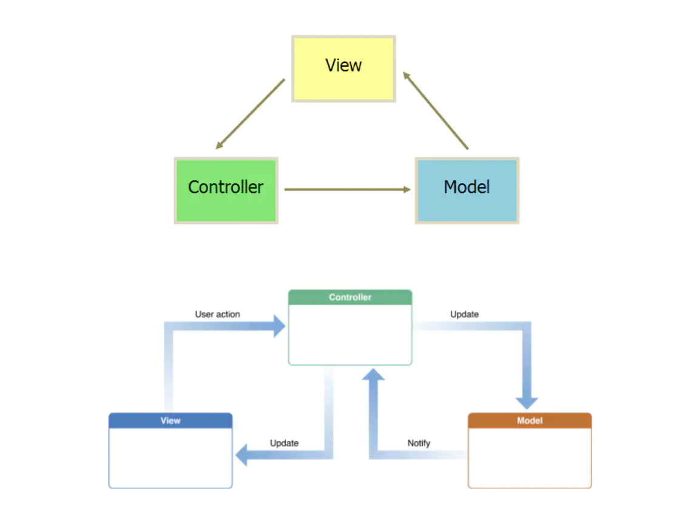
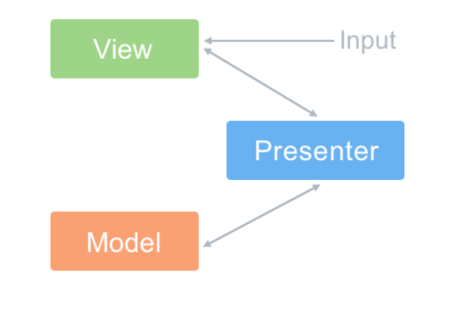
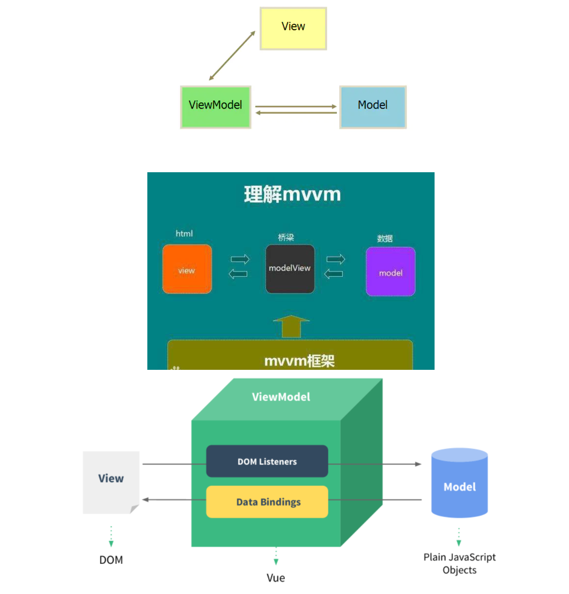
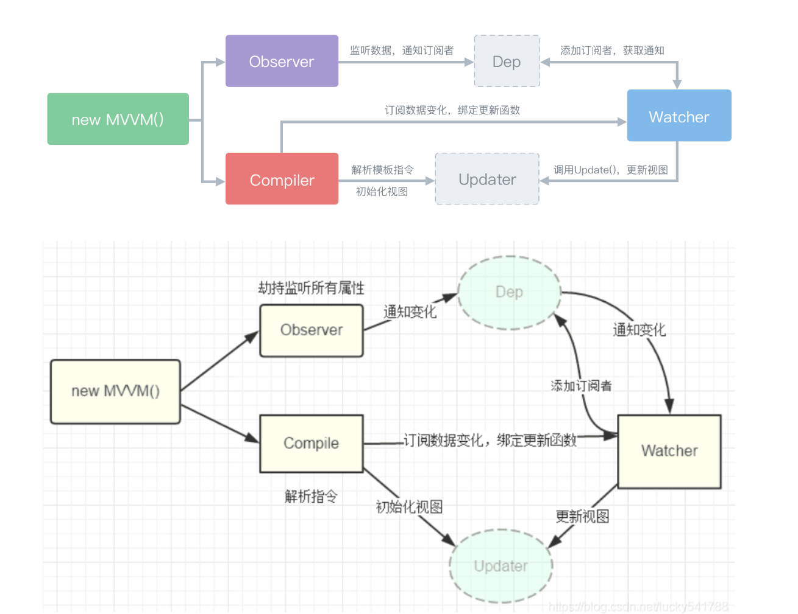
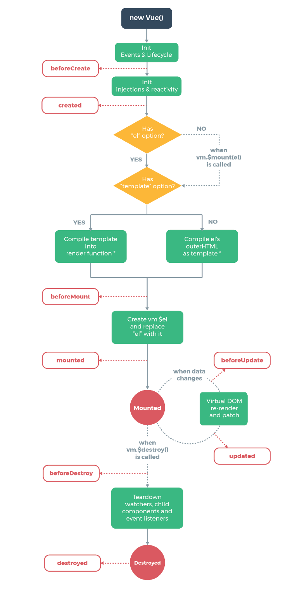
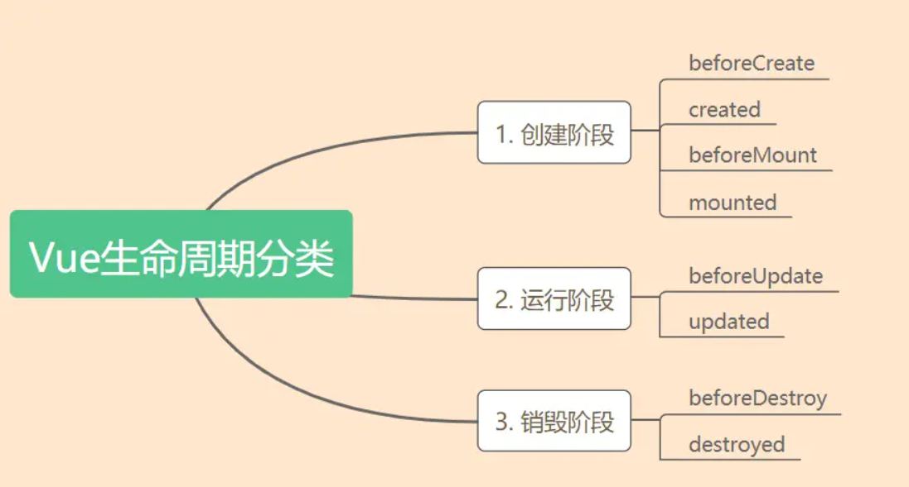
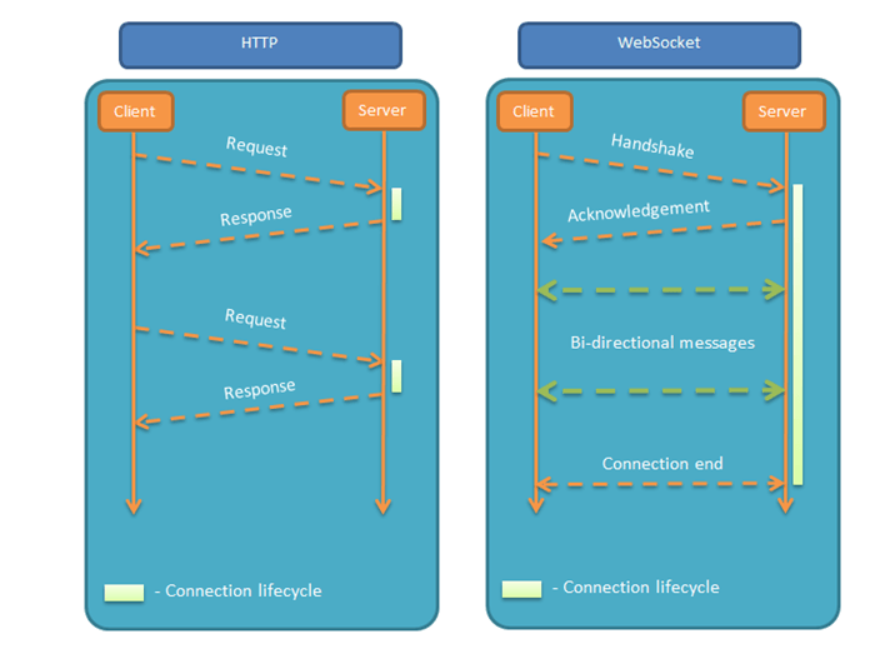
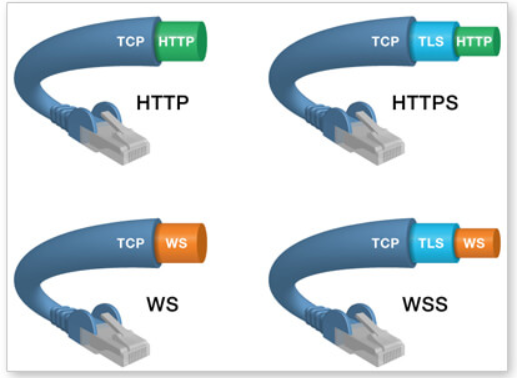

# Vue.js

> 渐进式javascript框架,读音类似view


## Vue.js是什么及特点

> vue是一个js库,并且不依赖别的js库

- 渐进式框架,采用自底向上增量式开发设计

  > 意思是在任何时机任何环境嵌入任何阶段的项目

- 双向绑定机制,MVVM设计模式

- 利用指令对DOM进行封装: v-model,v-if

- 组件化思想

## MVXX设计模式

> MV...系列的设计模式包括: MVC,MVP,MVVM

- M : 表示model,应用程序中处理数据逻辑的部分,如(加减乘除)
- V : 表示view 视图层,应用程序中负责渲染数据的部分
- C : 表示controller 控制器,应用程序中负责业务逻辑的部分,负责从视图读取数据,并向model层发送数据
- P :  表示Presenter 主持者,

### MVC设计模式

> 该设计模式将应用规划成三个部分: 数据层,视图层,用户交互层,其中的关系如下图:
>
> 处理事情的逻辑:
>
> 1. 用户和应用交互
> 2. 控制器的事件处理器被触发
> 3. 控制器从模型中请求数据给视图
> 4. 视图将数据呈现给用户



#### model模型

> 用来存放应用的所有数据对象,模型不必知道视图和控制器的细节,模型只需要包含数据和数据间的关系,任何事件处理代码,视图模板以及和模型无关的逻辑都应当隔离在模型之外
>
> 例如: 我们传火箭一个model对象,所有的数据都应该放在这个命名空间中

#### view视图

> 视图层是呈现给用户的,用户与之产生交互,在javascript中视图大都是由html、css和JavaScript模版组成的。除了模版中简单的条件语句之外，视图不应当包含任何其他逻辑。事实上和模型类似，视图也应该从应用的其他部分中解耦出来
>
> 视图是应用的接口，它为用户提供视觉呈现并与用户产生交互。在javaScript种，视图是无逻辑的HTML片段，又应用的控制器来管理，视图处理事件回调以及内嵌数据。简单来说就是在javaScript中写HTML代码，然后将HTML片段插入到HTML页面中

#### control控制器

> 控制器是模型和视图的纽带。控制器从视图获得事件和输入，对它们进行处理，并相应地更新视图。当页面加载时，控制器会给视图添加事件监听，比如监听表单提交和按钮单击。然后当用户和应用产生交互时，控制器中的事件触发器就开始工作。
>
> mvc中的控制器。当加载页面的时候，控制器将事件处理程序绑定在视图中，并适时地处理回调，以及和模型必要的对接 

### MVP设计模式

> **MVP与MVC有着一个重大的区别**：在MVP中View并不直接使用Model，它们之间的通信是通过Presenter (MVC中的Controller)来进行的，所有的交互都发生在Presenter内部，而在MVC中View会直接从Model中读取数据而不是通过 Controller。



MVP是一种用户界面体系结构模式，旨在促进自动化单元测试和改进显示逻辑中关注点的分离。

- model（模型）是定义要在用户界面中显示或以其他方式操作的数据的接口。
- view（视图）是一个被动界面，它显示数据（模型）并将用户命令（事件）路由给presenter，以便对该数据进行操作。
- presenter对模型和视图进行操作。它从存储库（模型）中检索数据，并格式化数据以便在视图中显示。


#### 模型(Model)

> Model层依然是主要与业务相关的数据和对应处理数据的方法。

#### 视图(view)

>  MVP定义了Presenter和View之间的接口，用户对View的操作都转移到了Presenter。比如这里的View暴露setter接口让Presenter调用，待Presenter通知Model更新后，Presenter调用View提供的接口更新视图。

#### 主持者(Presenter)

> Presenter作为View和Model之间的“中间人”，除了基本的业务逻辑外，还有大量代码需要对从View到Model和从Model到View的数据进行“手动同步”，这样Presenter显得很重，维护起来会比较困难。而且由于没有数据绑定，如果Presenter对视图渲染的需求增多，它不得不过多关注特定的视图，一旦视图需求发生改变，Presenter也需要改动。

### MVVM设计模式(重点)

> 即 Model-View-ViewModel的简写,他是MVC设计模式的一个子集,对视图和模型完全分离,强化了control
> 为什么不使用MVC设计模式?
>
> ​	在之前的MVC中我们提到一个控制器对应一个视图，控制器用状态机进行管理，这里就存在一个问题，如果项目足够大的时候，状态机的代码量就变得非常臃肿，难以维护
>
> ​	还有一个就是性能问题，在MVC中我们大量的操作了DOM，而大量操作DOM会让页面渲染性能降低，加载速度变慢，影响用户体验。

MVVM设计模式,个层级之间的关系:



#### Model模型

> Model层,对应的数据层的域模型,他主要做域模型的同步,通过 Ajax/fetch 等 API 完成客户端和服务端业务 Model 的同步。在层间关系里，它主要用于抽象出 ViewModel 中视图的 Model。

#### View视图

> view是视图模板,用于定义结构和布局,自己不处理数据,只是将ViewModel中的数据展现出来,
>
> 此外为了和ViewModel产生关联,那么还需要做的就是数据绑定的声明,指令的声明,事件的绑定

#### ViewMode

> 将Controller的数据和逻辑处理部分抽离出来,用一个专门的对象进行管理,这个对象就是ViewModel,从model获取数据传递到view,从view事件中操作model
>
> viewmodel通过数据双向绑定把view和Model层联系起来,而View和Model之间的同步工作是自动完成的,开发者只需要关注业务逻辑不需要手动操作DOM不需要关注数据状态的同步问题

### MVVM原生实现

#### 发布订阅设计模式

> 设想场景:
>
> ​	当你想买包子时,老板告诉你没有,然后你离开了,过一会你又来问有没有,老板还说没有,然后你离开了,....这样周而复始直到你买到豆沙馅的包子,
>
> 这样做明显非常繁琐且浪费事件
>
> 但是这样:
>
> ​	当你想买包子时,老板说没有,但是可以**记下你的电话号**当有的时候通知你,这样就不用来回跑,
>
> 这里的老板就相当于**发布者**,而你相当于**订阅者**,有包子时相当于**数据改变**,那么整体流程下来就是:
>
> **订阅者在发布者这里注册,注册好后,若数据发生改变,发布者就通知订阅者进行相应的动作**

##### 发布者

> 一个数据只有一个发布者,用来注册和通知订阅者

##### 订阅者

> 一个数据可以有多个订阅者,用来执行向相关的动作

#### 示例



```html
<body>
  <div id="app">
    <input type="text" v-model="num">
    {{ num }}
  </div>
  <script>
    // 1. 解析原始DOM,获取内容的插值标识,如v-model,和{{}}
          // 通过vue代码的表现可以看出来,页面上渲染的DOM是经过vue处理过的将v-model等标识处理后的结果
    // 2. 提取插值标识符,与vue进行绑定
          // 通过发布-订阅设计模式,对每一个数据配备一个发布者和若干个订阅者
    
    // 解析原始DOM: 先提取插值,再处理dom元素
    function compile(node,vm){
      let reg = /\{\{(.*)\}\}/
      if(node.nodeType === 1){
        // 如果节点是标签节点
        let atts = node.attributes
        Array.prototype.forEach.call(atts,function(item,index){
          if(item.nodeName === "v-model"){
            let name = item.nodeValue
            node.addEventListener("input",function(e){
              // 输入触发setter()
              vm[name] = e.target.value
            })
            node.removeAttribute("v-model")
            new Watcher(vm,node,name) //创建一个订阅者,订阅name属性的值,用来管理这个标签的数据更新
          }
        })
      }
      if(node.nodeType === 3){
        // 如果节点是文本节点
        if(reg.test(node.nodeValue)){
          let name = RegExp.$1
          name = name.trim()
          new Watcher(vm,node,name)
        }
      }
    }
    function nodeToFragment(app,vm){
      let fragment = document.createDocumentFragment()
      // 将app中所有子元素通过compile处理后转移到代码片段中,这里很巧妙的使用append操作DOM的特性: 添加页面存在的元素相当于移动DOM
      while(app.firstChild){
        compile(app.firstChild,vm)
        fragment.append(app.firstChild)
      }
      return fragment
    }

    // 对vue中数据进行defineProperty处理
    function defineReactive(obj,key,val){
      // 处理单个属性
      let dep = new Dep() //给每个属性添加发布者,用来管理这个属性的订阅者
      Object.defineProperty(obj,key,{
        get(){
          // 注册订阅者
          if(Dep.target){
            dep.addSub(Dep.target)
          }
          console.log("获取数据")
          return val
        },
        set(nVal){
          if(val === nVal){
            return
          }
          val = nVal
          dep.notify()//通知该属性所有的订阅者更新数据
          console.log("更新了数据",nVal)
        }
      })
    }
    function obServe(obj,vm){
      // 这里的obj是vue中data对象,对vue实例中data的每一个属性都进行definProperty处理,并将属性都挂载到vm上
      Object.entries(obj).map(([key,val]) => {
        defineReactive(vm,key,val)
      })
    }

    //发布订阅设计模式
    //分为发布者Dep和订阅者Watcher
    // 发布者: 每个发布者管理一个属性,对订阅者进行注册,当属性变化时通知订阅者进行相应动作
    // 订阅者: 一个属性可以有多个订阅者,他需要这个属性的值,当值变化的时候发布者通知订阅者自身进行相应动作
    // 发布者
    class Dep{
      constructor(){
        this.subs = []//存放订阅者
      }
      // 注册订阅者
      addSub(watcher){
        this.subs.push(watcher)
      }
      //通知订阅者
      notify(){
        this.subs.forEach(item =>{
          //item执行响应动作
          item.update()
        })
      }
    }
    //订阅者
    class Watcher{
      //参数: 订阅的谁的什么属性,对应的什么节点
      constructor(vm,node,name){
        this.vm = vm
        this.node = node
        this.name = name
        Dep.target = this // 给Dep挂this用来注册该订阅者
        this.init()
      }
      init(){
        this.update()// 先执行一遍将vue实例中data数据渲染出来
        Dep.target = null
      }
      update(){
        this.node.value = this.node.nodeValue = this.vm[this.name]
      }
    }

    class Vue{
      constructor({el,data}){
        this.data = data
        obServe(this.data,this)
        let ele = document.querySelector(el)
        let dom = nodeToFragment(ele,this)
        ele.append(dom)
      }
    }
    const app = new Vue({
      el:"#app",
      data:{
        num: 1
      }
    })


    //推理
    /*
      defineProperty处理Vue实例中data对象的所有数据,配备get和set,
      当数据set或者get触发时
      get: 此时若有订阅者订阅了该数据,发布者将该订阅者注册,
      set: 数据发生变化时通知该订阅者

      订阅者: 负责数据和对应的DOM更新,每个需要数据的DOM都应该创建对应的订阅者
      发布者: 一个数据对应一个发布者,当数据更新时,发布者遍历订阅者注册的数组并执行订阅者更新的方法,达到通知订阅者的目的
    */ 
  /*
   总体流程: 当vue实例中数据h被获取或变化时触发get,set: set中发布者通知订阅者更新视图,
            当视图的数据改变时,通过事件监听改变vue实例上的数据
  
  */  
  </script>
</body>
```

## Vue的三大特性

### 数据驱动

> 即双向绑定,所谓数据驱动就是当数据发生变化时,用户界面发生相应的变化,开发者不需要手动修改DOM

#### vue实现的数据驱动

> Vue实现数据双向绑定主要采用数据劫持(Object.definePerproty),配合发布者-订阅者模式来实现,通过`Object.defineProperty`劫持对象的各个属性的`setter`和`getter`在数据发生变化时发布消息给订阅者触发相应监听回调

#### getter和setter的理解

> 当打印出vue实例下的data对象里的属性，它的每个属性都有两个对应的get和set方法。顾名思义，get为取值方法，set为赋值方法。正常情况下，取值和赋值是用 obj.prop 的方式，但是这样做有一个问题，我们如何知道对象的值改变了？
>
> 我们可以把get和set理解为function，当我们调用对象的属性时，会进入到 get.属性(){...} 中，先判断对象是否有这个属性，如果没有，那么就添加一个name属性，并给它赋值；如果有name属性，那么就返回name属性。可以把get看成一个取值的函数，函数的返回值就是它拿到的值。
>
> 当给实例赋值时，会进入 set.属性(val){...} 中，形参val就是赋给属性的值，在这个函数里做了很多事情，比如双向绑定等等。因为这个值每次都要经过set，其他方式无法对该值做修改。在ES5中，对象原型有两个属性，`_defineGetter_` 和 `_defineSetter_` ，专门用来给对象绑定get和set。

### 虚拟DOM

> 问题:
>
> 当我们改变某个DOM的样式属性时,会引起浏览器的`重绘`和`重排`,有时我们修改一个DOM时浏览器可能重绘和重排了很多次,这是非常浪费性能的,
>
> 解决:
>
> Virtual DOM其实就是一颗以JavaScript对象作为基础的树,用对象属性来描述节点,是一层真实DOM的抽象,在DOM发生改变时,预先计算出最终结果,只将最终结果映射为真实DOM,
>
> 核心目的: 预计suanDOM操作,把最后一次的结果渲染出来(减少DOM渲染的次数)

#### 什么是虚拟DOM

> 可以把虚拟DOM理解为一个JS对象,并且最少包含标签名,标签属性,子元素这三个属性,他以js对象作为基础模拟真实的DOM的树形结构

#### 虚拟DOM的作用

> 虚拟DOM就是预先通过js进行各种计算,把最终的DOM操作计算出来并优化,由于这个DOM操作是预处理操作并没有操作真实的DOM元素,所以叫做虚拟DOM,最后计算完毕后才将DOM操作提交,将DOM操作变化反应到DOM树上

虚拟DOM的最终目标是将虚拟节点渲染到视图上。但是如果直接使用虚拟节点覆盖旧节点的话，会有很多不必要的DOM操作。例如，一个ul标签下有很多个li标签，其中只有一个li标签有变化，这种情况下如果使用新的ul去替代旧的ul，会因为这些不必要的DOM操作而造成性能上的浪费。

为了避免不必要的DOM操作，虚拟DOM在虚拟节点映射到视图的过程中，将虚拟节点与上一次渲染视图所使用的旧虚拟节点做对比，找出真正需要更新的节点来进行DOM操作，从而避免操作其他不需要改动的DOM元素。

**虚拟DOM在Vue.js中主要做了两件事情：**

- 提供与真实DOM节点所对应的虚拟节点VNode
- 将虚拟节点VNode和旧虚拟节点oldVNode进行对比，然后更新视图

#### 核心对比算法

> diff算法,就是对DOM进行different比较不同的一种算法

### 组件化

> 组件就是将一段UI样式和其对应的功能作为独立的整体去看待，无论这个整体放在哪里去使用，它都具有一样的功能和样式，从而实现复用，这种整体化的细想就是组件化

## Vue基础

### Vue示例的构成

```
创建一个实例:
 const vm = new Vue({
 	el: "#app",
 	data: {
 		数据
 	},
 	methods: {
 		方法
 	}
 })
```

#### #el

> - 类型: String || Element
> - 限制: 只在用new创建实例时生效
> - 作用: 提供一个页面上已存在的DOM元素,作为Vue实例挂载的目标,可以时css选择器,也可以是一个Element实例,在实例挂载之后,元素可以用`vm.$el访问`,如果实例化时存在这个选项,实例立即进入编译过程,否则需要显示调用`vm.$mount()`手动开启编译

#### #data

> - 类型: `Object`||`Function`
>
> - 限制: 组件中直接受`Function`
>
> - 作用: Vue实例的数据对象,Vue会递归data的属性并添加响应式(getter和setter),原型上的属性会被忽略
>
>   ​			创建实例之后可以通过`vm.$data`访问原始数据对象,vue实例也代理了data对象上的所有属性,因此访问`vm.a`与访问`vm.$data.a`是等价的
>
>   ​			组件中,data必须是一个返回初始数据对象的函数,因为组件可能创建多个实例,如果data还是一个纯粹的对象,则所有的实例将**共享引用**同一个数据对象,通过函数形式返回数据对象,在每次组件实例化的时候能够调用data函数从而返回一个初始数据对象的副本

#### #methods

> - 类型: {[key:string : Function]}
> - 作用: methods中定义方法,这些方法最终会被混入到Vue实例中,可以通过vm实例访问这些方法,方法中this自动绑定为vm实例,注意不能使用箭头函数来定义methods中的函数,因为箭头函数中this绑定的是父级作用域的上下文,并不指向vm,而是指向window

### 模板语法

>  `{{ //do something }}`称为Mustache语法

```
<div id="app">
  {{ message }}
</div>

<script>
    const app = new Vue({
        el: "#app",
        data: {
            message: '信息'
        }
    })
</script>
Mustache 标签将会被替代为对应数据对象上 `message` property 的值。无论何时，绑定的数据对象上 `message` property 发生了改变，插值处的内容都会更新。
```

#### 单次渲染

> v-once 指令可以执行一次性插值,但插值内容不会再根据数据的改变而改变
>
> 只渲染一次元素和组件,随后得重新渲染,会被视为静态内容直接跳过,对于不变得值,使用v-once可以节省性能

```
<span v-once>这个将不会改变: {{ message }}</span>
```

#### 文本渲染

> v-text 与插值语法一样将数据解析为纯文本,

```
 <p v-text="num"><span v-text="message"></span></p>
 <p>{{num}}<span>{{message}}</span></p>
```

与``{{}}``区别:

当加载速度慢时,`{{}}`语法会在页面显示出来,vue实例初始化完成才会显示数据,v-text不会显示出来,只有当vue实例初始化完成`v-text`才会生效,

`{{}}`在页面显示的解决办法: 

```
style{
	[v-locak] {
		display: none
	}
}
<div v-locak>{{num}}</div>
这样当vue实例未初始化时,display生效,初始化后v-locak会别删除,div就是显示出来了
```

#### HTML渲染

> v-html,可以输出HTML,注意这样容易引起`xss`注入攻击

```
<div id="app">
    <p>{{ html }}</p>
    <p v-html="html"></p>
</div>

<script>
const app = new Vue({
    el: "#app",
    data: {
    	html: `<span style="color:red">红色</span>`
    }
})
</script>
```

#### 属性绑定

> v-bind,可以给属性绑定变量的值

```
<div id="app">
    <p v-bind:class="bgc"> 文本内容 </p>
    <p :class="bgc"> 文本内容 </p>//缩写
</div>

<script>
    const app = new Vue({
      el: "#app",
      data: {
        bgc: 'red'
      }
    })
</script>
```

**注意**

当v-bind绑定的变量值为: null,undefined,false时,决定该属性不进行渲染

当v-bind绑定的变量值为: 0,'',NAN,时决定该属性渲染但值为空

当v-bind绑定的变量值为除上述之外的其他值时: 正常渲染该属性

##### 参数属性

> bind不仅可以绑定属性值,也可以绑定属性

```
<p :[参数1]="参数2"></p>
```

### 条件渲染

> v-if v-else-if v-else
>
> 若v-if后表达式的值为真,才会渲染这个元素,若为假,不会渲染这个DOM元素,这个元素不会出现在DOM树上,相当于删除

```
<div v-if="type === 'A'">
  A
</div>
<div v-else-if="type === 'B'">
  B
</div>
<div v-else-if="type === 'C'">
  C
</div>
<div v-else>
  Not A/B/C
</div>
```

### 列表渲染

> v-for 指令基于一个数组或者对象来渲染列表 ,语法: `v-for = "(item,index) in Arr/obj"`,其中可以使用`in`或`of`来循环,且必须指定key

**遍历数组**

```
<ul id="example-1">
  <li v-for="item in items" :key="item.message">
    {{ item.message }}
  </li>
</ul>
var example1 = new Vue({
  el: '#example-1',
  data: {
    items: [
      { message: 'Foo' },
      { message: 'Bar' }
    ]
  }
})
```

**遍历对象**

> 遍历对象时index会按照`Object.keys()`对对象进行遍历,但是不能保证他在不同的javascript引擎下保持一致

```
<div v-for="(value, name, index) in object :key="obj.name"">
  {{ name }}: {{ value }}
</div>
```

#### key

> key 必须是唯一,且不变的变量
>
> 标识了组件的唯一性,主要是方便diff算法更高效的更新虚拟DOM,维持组件状态

##### 为什么需要key

> 当我们渲染一个列表后,需要向列表中添加元素时,且添加的元素会影响已渲染列表中元素的顺序,如使用shift()方法
>
> 一般做法:
>
> ​	将DOM元素依次往后移动,重排和重绘列表中所有元素,这样做是非常消耗性能的
>
> vue的做法:
>
> ​	在列表末尾添加一个DOM元素,需要更换位置的DOm元素依次的将内容转换到另一个DOM上,只更换内容,不改变DOM的顺序,这样做不会对所有DOM元素进行重排,节省性能
>
> 引发的问题:
>
> ​	当涉及逆序操作时每一项的状态就无法确定,因为内容转换了,状态没有跟着改变,状态和内容就无法对应了,如刚才选中第二个,shift()之后还是选中第二个,实际应该选中第三个内容.key的主要作用就是维持状态的改变
>
> 有了key之后:
>
> - 若新的虚拟DOM中的内容没变,就直接使用之前的真实DOM
> - 若新的虚拟DOM内容变化,则生成新的真实DOM,随后替换掉页面中的对应的真是DOM
>
>  在用v-for更新已渲染的元素列表的时候，会使用就地复用的策略；这就是说列表数据修改的时候，他会根据key值去判断某个值是否修改，如果修改了就重新渲染，不然就复用之前的元素。

**key必须是唯一,且不变的**,不能使用,数组下标作为key的值,因为在操作数组中时,index会跟着改变

### 数组检测

> 在vue中对数组元素的增删改查操作**不能通过下标直接操作**,应该使用vue封装过的方法:
>
> - `push()`
> - `pop()`
> - `shift()`
> - `unshift()`
> - `splice()`
> - `sort()`
> - `reverse()`
>
> 原因: 直接通过下标修改数组元素,会绕过vue的数据劫持,无法给元素添加响应式

#### 替换数组

> 对数组元素操作后可以使用新数组直接替换老数组,因为老的数组是响应式的,替换是会触发setter,对新值都添加上响应式
>
> 常用: reduce, filter, map,concat,slice

### 事件处理

> v-on:事件名="方法",方法默认转递event事件对象不需要显示写

```
<div id="app">
    <p @click="show(item)" v-for="(item,idx) in list">
        {{item}}
    </p>
</div>

<script>
  // 创建 Vue 实例，得到 ViewModel
  var vm = new Vue({
    el: '#app',
    data: {
      list: ['张三', '李四']
    },
    methods: {
      show(val) {
        console.log(val)
      }
    }
  });
</script>
```

#### 事件修饰符

在事件处理程序中调用 `event.preventDefault()` 或 `event.stopPropagation()` 是非常常见的需求。尽管我们可以在方法中轻松实现这点，但更好的方式是：方法只有纯粹的数据逻辑，而不是去处理 DOM 事件细节。

为了解决这个问题，Vue.js 为 `v-on` 提供了**事件修饰符**。之前提过，修饰符是由点开头的指令后缀来表示的。

- `.stop`
- `.prevent`
- `.capture`
- `.self`
- `.once`
- `.passive`

```
<!-- 阻止单击事件继续传播 -->
<a v-on:click.stop="doThis"></a>

<!-- 提交事件不再重载页面 -->
<form v-on:submit.prevent="onSubmit"></form>

<!-- 修饰符可以串联 -->
<a v-on:click.stop.prevent="doThat"></a>

<!-- 只有修饰符 -->
<form v-on:submit.prevent></form>

<!-- 添加事件监听器时使用事件捕获模式 -->
<!-- 即内部元素触发的事件先在此处理，然后才交由内部元素进行处理 -->
<div v-on:click.capture="doThis">...</div>

<!-- 只当在 event.target 是当前元素自身时触发处理函数 -->
<!-- 即事件不是从内部元素触发的 -->
<div v-on:click.self="doThat">...</div>

<!-- 点击事件将只会触发一次 -->
<a v-on:click.once="doThis"></a>

<!-- 滚动事件的默认行为 (即滚动行为) 将会立即触发 -->
<!-- 而不会等待 `onScroll` 完成  -->
<!-- 这其中包含 `event.preventDefault()` 的情况 -->
<div v-on:scroll.passive="onScroll">...</div>
```

使用修饰符时，顺序很重要；相应的代码会以同样的顺序产生。因此，用 `v-on:click.prevent.self` 会阻止**所有的点击**，而 `v-on:click.self.prevent` 只会阻止对元素自身的点击。

#### 按键修饰符

> 详细查看官网

在监听键盘事件时，我们经常需要检查详细的按键。Vue 允许为 `v-on` 在监听键盘事件时添加按键修饰符：

```
<!-- 只有在 `key` 是 `Enter` 时调用 `vm.submit()` -->
<input v-on:keyup.enter="submit">
```

你可以直接将 [`KeyboardEvent.key`](https://developer.mozilla.org/en-US/docs/Web/API/KeyboardEvent/key/Key_Values) 暴露的任意有效按键名转换为 kebab-case 来作为修饰符。

```
<input v-on:keyup.page-down="onPageDown">
```

在上述示例中，处理函数只会在 `$event.key` 等于 `PageDown` 时被调用。

##### 按键码

为了在必要的情况下支持旧浏览器，Vue 提供了绝大多数常用的按键码的别名：

- `.enter`
- `.tab`
- `.delete` (捕获“删除”和“退格”键)
- `.esc`
- `.space`
- `.up`
- `.down`
- `.left`
- `.right`

你还可以通过全局 `config.keyCodes` 对象[自定义按键修饰符别名](https://cn.vuejs.org/v2/api/#keyCodes)：

```
// 可以使用 `v-on:keyup.f1`
Vue.config.keyCodes.f1 = 112
```

##### 系统修饰键

> 2.1.0 新增

可以用如下修饰符来实现仅在按下相应按键时才触发鼠标或键盘事件的监听器。

- `.ctrl`
- `.alt`
- `.shift`
- `.meta`

> 注意：在 Mac 系统键盘上，meta 对应 command 键 (⌘)。在 Windows 系统键盘 meta 对应 Windows 徽标键 (⊞)。在 Sun 操作系统键盘上，meta 对应实心宝石键 (◆)。在其他特定键盘上，尤其在 MIT 和 Lisp 机器的键盘、以及其后继产品，比如 Knight 键盘、space-cadet 键盘，meta 被标记为“META”。在 Symbolics 键盘上，meta 被标记为“META”或者“Meta”。

例如：

```
<!-- Alt + C -->
<input v-on:keyup.alt.67="clear">

<!-- Ctrl + Click -->
<div v-on:click.ctrl="doSomething">Do something</div>
```

请注意修饰键与常规按键不同，在和 `keyup` 事件一起用时，事件触发时修饰键必须处于按下状态。换句话说，只有在按住 `ctrl` 的情况下释放其它按键，才能触发 `keyup.ctrl`。而单单释放 `ctrl` 也不会触发事件。如果你想要这样的行为，请为 `ctrl` 换用 `keyCode`：`keyup.17`。

##### `.exact` 修饰符

> 2.5.0 新增

`.exact` 修饰符允许你控制由精确的系统修饰符组合触发的事件。

```
<!-- 即使 Alt 或 Shift 被一同按下时也会触发 -->
<button v-on:click.ctrl="onClick">A</button>

<!-- 有且只有 Ctrl 被按下的时候才触发 -->
<button v-on:click.ctrl.exact="onCtrlClick">A</button>

<!-- 没有任何系统修饰符被按下的时候才触发 -->
<button v-on:click.exact="onClick">A</button>
```

##### 鼠标按钮修饰符

> 2.2.0 新增

- `.left`
- `.right`
- `.middle`

这些修饰符会限制处理函数仅响应特定的鼠标按钮。

### Class绑定

#### 绑定对象

> 给class属性绑定一个对象, 对象的键是类名,键对应的值宝石是否渲染这个类名

```
<p :class={active: isActive,on: isOn}>
由isActive和isOn是true还是flase来确定这个类名是否渲染

也可以将绑定的对象写在数据对象中
<p :class="style">
data(){
    return{
        style: {
            active: isActive,on: isOn
        }
    }
}

对象的键也可以是变量,但是要在[]中书写
<p :class={[active]: isActive,[on]: isOn}>
data(){
    return{
        active: "active",
        on: "on"
    }
}
```

#### 绑定数组

> 给class属性绑定一个数组,数组中的值就是添加的类名

```
<p :class=[active,on]>

数组中元素也可以是一个对象
<p :class={{active: isActive},{on: isOn}}>
```

### Style样式绑定

>  `v-bind:style` 的对象语法十分直观——看着非常像 CSS，但其实是一个 JavaScript 对象。CSS property 名可以用驼峰式 (camelCase) 或短横线分隔 (kebab-case，记得用引号括起来) 来命名：

```
<div v-bind:style="{ color: activeColor, fontSize: fontSize + 'px' }"></div>
data: {
  activeColor: 'red',
  fontSize: 30
}
```

直接绑定到一个样式对象通常更好，这会让模板更清晰：

```
<div v-bind:style="styleObject"></div>
data: {
  styleObject: {
    color: 'red',
    fontSize: '13px'
  }
}
```

同样的，对象语法常常结合返回对象的计算属性使用。

#### 数组语法

`v-bind:style` 的数组语法可以将多个样式对象应用到同一个元素上：

```
<div v-bind:style="[baseStyles, overridingStyles]"></div>
```

#### 自动前缀

当 `v-bind:style` 使用需要添加[浏览器引擎前缀](https://developer.mozilla.org/zh-CN/docs/Glossary/Vendor_Prefix)的 CSS property 时，如 `transform`，Vue.js 会自动侦测并添加相应的前缀。

#### 多重值

从 2.3.0 起你可以为 `style` 绑定中的 property 提供一个包含多个值的数组，常用于提供多个带前缀的值，例如：

```
<div :style="{ display: ['-webkit-box', '-ms-flexbox', 'flex'] }"></div>
```

这样写只会渲染数组中最后一个被浏览器支持的值。在本例中，如果浏览器支持不带浏览器前缀的 flexbox，那么就只会渲染 `display: flex`。

### 计算属性

> 计算属性就是对现有的值,进行一些列操作而得到另一个值,
>
> **特点:**
>
> - 只有当依赖的数据发生变化时,才会自动重新计算
> - 若依赖数据没有发生改变时,访问计算属性会从缓存中直接返回值,而不会重新计算

#### 对象写法

```js
computed: {
        count: {
            get(){
               //获取计算属性时触发
                return this.a + this.b
            }
            set(nVal){
                //设置计算属性时触发
                this.c = nVal
            }
    }
}
其中: count就是计算属性,会挂载到vm实例上,这种形式相当于对计算属性进行代理
```

#### 函数写法

```js
computed: {
    count(){
        return this.a + this.b
    }
}
函数相当于只做了getter()
```

#### 计算属性和method中方法的区别

> 从上述代码中我们很容易想到,计算属性也可以通过在methods中定义方法实现,那么这两中方式有什么区别呢?

区别如下:

计算属性是基于他们响应式依赖进行缓存的,只有相关依赖数据发生变化时,才会重新计算,**这就意味着只要依赖数据没有发生改变,多次访问该计算属性会立即返回之前计算的结果,不必再执行函数**

### 监听器

> 监听数据变化,变化时执行相应代码,当数据变化时执行异步或者开销比较大时,这个方式时最有用的
>
> **注意只有新旧数据不同时,才会监听**

#### 函数式监听

```js
watch: {
    属性名称(newVal,oldVal){
        //当属性名称对应的属性变化时,执行内部代码
        //newVal变化后的值,oldVal变化前的值
    }
}
```

#### 对象式监听

```js
watch:{
    属性名称: {
        handler(newVal,oldVal){
            //当属性名称对应的属性变化时执行handler
        }
    }
}

属性名称是一个对象时:
obj:{
    handler(n,o){
        这样做obj属性的变化是无法监听的,想要监听对象属性的变化,需要加参数
    }
}
obj: {
    handler(n,o){
        //do something
    },
    deep: true,表示深度监听,可以同时监听的obj中任意属性的变化
    immediate: true 表示组件创建时是否自动执行一次
}

只监听对象的某个属性: 对于不需要监听obj所有属性时,采用下面的方式更加有效,节省性能
"obj.val": {
    handler(n,o){
        这里只监听obj的val属性变化,
    }
}
```

### 过滤器

> 类似于管道函数,对一些数据做处理如时间格式化,文本格式化,当作工具函数来用
>
> 过滤器可以用在两个地方:  **插值语法**和**v-bind表达式**,由管道符指示

#### 语法

```js
{{ message | capitlize}}

<div v-bond:id = "rawId | formatId"></div>

filters: {
	capitlize: function(val){
        if(!val) return ""
        val = val.toString()
        return val.chartAt(0),toUpperCase() + val.slice(1)
    }
}
```

或者在创建vue实例时定义全局过滤器,全局过滤器与局部过滤器重名时采用局部过滤器

```
Vue.filter('capitalize', function (value) {
  if (!value) return ''
  value = value.toString()
  return value.charAt(0).toUpperCase() + value.slice(1)
})

new Vue({
  // ...
})
```

#### 执行过程

> 过滤器函数总是接收上一步链式操作返回的值作为第一个参数,整个过滤返回最后一个过滤器return的结果
>
> **在filter中严格模式下this是undefined,非严格模式下this指向window**,因此filters不能对原始响应式数据进行更改,而只是改变其渲染结果,并返回过滤后的文本

```js
{{ mesage | filterA | filterB }}
在这个例子中 filterA被定义为接收单个参数的过滤器,表达式message的值将作为filterA的第一个参数,然后继续调用同样被定义为接收单个参数的过滤器函数filterB,将filterA的结果传递到filterB中
```

```js
{{ message | filterA("arg1",arg2)}}
这里filterA被定义为接收三个参数的过滤器函数,message的值作为第一个参数,普通字符串"arg1"作为第二个参数,表达式arg2的值作为第三个参数,
```

#### 常用filters

```
/*
 * Vue Filters
 * @see https://cn.vuejs.org/v2/guide/filters.html
 */

/**
 * 字符串重复
 * @param {String|Number} value
 * @param {Number} count
 */
export const repeat = (value, count) => value.toString().repeat(count)

/**
 * 字符串替换
 * @param {String|Number} value
 * @param {String} string
 * @param {String} replacement
 */
export const replace = (value, string, replacement) => value.toString().replace(new RegExp(string, 'g'), replacement)

/**
 * 手机号隐私保护
 * 13866668888 -> 138****8888
 * @param {String|Number} value
 */
export const secretPhone = (value) => value.toString().replace(/(\d{3})(\d{4})(\d{4})/, '$1****$3')

/**
 * 格式化手机号
 * 13866668888 -> "138-6666-8888"
 * @param {*} value
 */
export const formatPhone = (value) => value.toString().replace(/(^\d{3}|\d{4}\B)/g, '$1-')

/**
 * 字母大小写转换
 * type: 1-首字母大写 2-首页母小写 3-全部大写 4-全部小写 5-大小写转换
 * @param {String} value
 * @param {Number} type
 */
export const changeCase = (value, type) => {
  // 大小写转换
  const toggleCase = (value) => {
    let newValue = ''
    value.split('').forEach((item) => {
      if (/^([a-z]+)/.test(item)) {
        newValue += item.toUpperCase()
      } else if (/^([A-Z]+)/.test(item)) {
        newValue += item.toLowerCase()
      } else {
        newValue += item
      }
    })
    return newValue
  }

  switch (type) {
    case 1:
      return value.charAt(0).toUpperCase() + value.slice(1)
    case 2:
      return value.charAt(0).toLowerCase() + value.slice(1)
    case 3:
      return value.toUpperCase()
    case 4:
      return value.toLowerCase()
    case 5:
      return toggleCase(value)
    default:
      return value
  }
}

/**
 * 去除空格
 * type: 1-前后空格 2-前空格 3-后空格 4-所有空格
 * @param {String} value
 * @param {Number} type
 */
export const trim = (value, type) => {
  switch (type) {
    case 1:
      return value.replace(/(^\s*)|(\s*$)/g, '')
    case 2:
      return value.replace(/(^\s*)/g, '')
    case 3:
      return value.replace(/(\s*$)/g, '')
    case 4:
      return value.replace(/\s+/g, '')
    default:
      return value
  }
}

/**
 * 日期时间格式化
 * {{ Date() | formatDate }} -> 2020-09-28 15:54:52
 * {{ '2020/10/01 12:30:45' | formatDate('yyyy-MM-dd hh:mm:ss w') }} -> 2020-10-01 12:30:45 星期四
 * @param {Date} value 可以被 new Date(value) 解析的时间格式，如 Date()、2020/10/01、2020-10-01 12:00 等
 * @param {String} fmt 格式化模版
 */
export const formatDate = (value, fmt = 'yyyy-MM-dd hh:mm:ss') => {
  const date = new Date(value)
  const o = {
    'M+': date.getMonth() + 1, // 月份
    'd+': date.getDate(), // 日
    'h+': date.getHours(), // 小时
    'm+': date.getMinutes(), // 分
    's+': date.getSeconds(), // 秒
    'w+': date.getDay(), // 星期
    'q+': Math.floor((date.getMonth() + 3) / 3), // 季度
    S: date.getMilliseconds(), // 毫秒
  }
  const weeks = ['星期日','星期一','星期二','星期三','星期四','星期五','星期六']

  if (/(y+)/.test(fmt)) {
    fmt = fmt.replace(RegExp.$1, (date.getFullYear() + '').substr(4 - RegExp.$1.length))
  }

  for (var k in o) {
    if (k === 'w+') {
      let weekLetter = weeks[o['w+']]
  	  fmt = fmt.replace('w',weekLetter)
    } else if (new RegExp(`(${k})`).test(fmt)) {
      fmt = fmt.replace(
        RegExp.$1,
        RegExp.$1.length === 1 ? o[k] : ('00' + o[k]).substr(('' + o[k]).length),
      )
    }
  }

  return fmt
}

/**
 * 文件大小显示转换
 * 12         -> 12.0 B
 * 98223445   -> 93.7 MB
 * 9822344566 -> 9.15 GB
 * @param {String|Number} bytes
 */
export const bytesToSize = (bytes) => {
  bytes = bytes.toString()
  if (bytes == 0) return '0 B'
  const k = 1024
  const i = Math.floor(Math.log(bytes) / Math.log(k))
  const sizes = ['B', 'KB', 'MB', 'GB', 'TB', 'PB', 'EB', 'ZB', 'YB']
  return (bytes / Math.pow(k, i)).toPrecision(3) + ' ' + sizes[i]
}

/**
 * 千分位格式化
 * 1234567 -> 1,234,567
 * @param {String|Number} value
 */
export const thousands = (value, fractionDigits = 0) => {
  const regexp = /\d{1,3}(?=(\d{3})+(\.\d*)?$)/g
  return (Number(value).toFixed(fractionDigits) + '').replace(regexp, '$&,')
}

/**
 * 现金数字转大写
 * 1234.567 -> 壹仟贰佰叁拾肆元伍角陆分柒厘
 * @param {String|Number} value
 */
export const upDigit = (value) => {
  const digit = ['零', '壹', '贰', '叁', '肆', '伍', '陆', '柒', '捌', '玖']
  const fraction = ['角', '分', '厘']
  const unit = [
    ['元', '万', '亿'],
    ['', '拾', '佰', '仟'],
  ]
  let s = ''
  let head = value < 0 ? '欠' : ''
  value = Math.abs(value)

  for (let i = 0; i < fraction.length; i++) {
    s += (digit[Math.floor(value * 10 * Math.pow(10, i)) % 10] + fraction[i]).replace(/零./, '')
  }

  s = s || '整'
  value = Math.floor(value)

  for (let i = 0; i < unit[0].length && value > 0; i++) {
    let p = ''
    for (let j = 0; j < unit[1].length && value > 0; j++) {
      p = digit[value % 10] + unit[1][j] + p
      value = Math.floor(value / 10)
    }
    s = p.replace(/(零.)*零$/, '').replace(/^$/, '零') + unit[0][i] + s
  }

  return (
    head +
    s
      .replace(/(零.)*零元/, '元')
      .replace(/(零.)+/g, '零')
      .replace(/^整$/, '零元整')
  )
}
```

### methods|computed|watch|filters比较

#### methods

- this: 指向vm
- 异步: 支持异步
- 作用: 里面适合定义面向业务的方法,事件,业务函数

#### computed

- this: 指向vm
- 异步: 不支持异步
- 作用: 根据原始数据生成新的数据,依赖数据改变自动重新计算,计算后的属性后会挂载到vm上

#### watch

- this: 指向vm
- 异步: 支持异步
- 作用: 针对属性变化进行响应,注重响应

#### filters

- this: 非严格模式下指向window,严格模式下为undefined
- 异步: 不推荐写异步
- 作用: 里面适合写工具方法,类似通道函数,可以对数据一层层加工,纯函数如日期的格式化,等

### 表单

#### 表单输入绑定

> 你可以用 `v-model` 指令在表单 ``、`` 及 `` 元素上创建双向数据绑定。它会根据控件类型自动选取正确的方法来更新元素。尽管有些神奇，但 `v-model` 本质上不过是语法糖。它负责监听用户的输入事件以更新数据，并对一些极端场景进行一些特殊处理。

`v-model` 会忽略所有表单元素的 `value`、`checked`、`selected` attribute 的初始值而总是将 Vue 实例的数据作为数据来源。你应该通过 JavaScript 在组件的 `data` 选项中声明初始值。

`v-model` 在内部为不同的输入元素使用不同的 property 并抛出不同的事件：

- text 和 textarea 元素使用 `value` property 和 `input` 事件；
- checkbox 和 radio 使用 `checked` property 和 `change` 事件；
- select 字段将 `value` 作为 prop 并将 `change` 作为事件。

对于需要使用[输入法](https://zh.wikipedia.org/wiki/输入法) (如中文、日文、韩文等) 的语言，你会发现 `v-model` 不会在输入法组合文字过程中得到更新。如果你也想处理这个过程，请使用 `input` 事件。

##### 基础用法

###### 文本

```
<input v-model="message" placeholder="edit me">
<p>Message is: {{ message }}</p>
```

Message is:

###### 多行文本

```
<span>Multiline message is:</span>
<p style="white-space: pre-line;">{{ message }}</p>
<br>
<textarea v-model="message" placeholder="add multiple lines"></textarea>
```

Multiline message is:

在文本区域插值 (`{{text}}`) 并不会生效，应用 `v-model` 来代替。

###### 复选框

单个复选框，绑定到布尔值：

```
<input type="checkbox" id="checkbox" v-model="checked">
<label for="checkbox">{{ checked }}</label>
```

 false

多个复选框，绑定到同一个数组：

```
<input type="checkbox" id="jack" value="Jack" v-model="checkedNames">
<label for="jack">Jack</label>
<input type="checkbox" id="john" value="John" v-model="checkedNames">
<label for="john">John</label>
<input type="checkbox" id="mike" value="Mike" v-model="checkedNames">
<label for="mike">Mike</label>
<br>
<span>Checked names: {{ checkedNames }}</span>
new Vue({
  el: '...',
  data: {
    checkedNames: []
  }
})
```

 Jack John Mike
Checked names: []

###### 单选按钮

```
<div id="example-4">
  <input type="radio" id="one" value="One" v-model="picked">
  <label for="one">One</label>
  <br>
  <input type="radio" id="two" value="Two" v-model="picked">
  <label for="two">Two</label>
  <br>
  <span>Picked: {{ picked }}</span>
</div>
new Vue({
  el: '#example-4',
  data: {
    picked: ''
  }
})
```

 One
 Two
Picked:

###### 选择框

单选时：

```
<div id="example-5">
  <select v-model="selected">
    <option disabled value="">请选择</option>
    <option>A</option>
    <option>B</option>
    <option>C</option>
  </select>
  <span>Selected: {{ selected }}</span>
</div>
new Vue({
  el: '...',
  data: {
    selected: ''
  }
})
```

请选择 A B C Selected:

如果 `v-model` 表达式的初始值未能匹配任何选项，`` 元素将被渲染为“未选中”状态。在 iOS 中，这会使用户无法选择第一个选项。因为这样的情况下，iOS 不会触发 change 事件。因此，更推荐像上面这样提供一个值为空的禁用选项。

多选时 (绑定到一个数组)：

```
<div id="example-6">
  <select v-model="selected" multiple style="width: 50px;">
    <option>A</option>
    <option>B</option>
    <option>C</option>
  </select>
  <br>
  <span>Selected: {{ selected }}</span>
</div>
new Vue({
  el: '#example-6',
  data: {
    selected: []
  }
})
```

A B C
Selected: []

用 `v-for` 渲染的动态选项：

```
<select v-model="selected">
  <option v-for="option in options" v-bind:value="option.value">
    {{ option.text }}
  </option>
</select>
<span>Selected: {{ selected }}</span>
new Vue({
  el: '...',
  data: {
    selected: 'A',
    options: [
      { text: 'One', value: 'A' },
      { text: 'Two', value: 'B' },
      { text: 'Three', value: 'C' }
    ]
  }
})
```

​     One       Two       Three   Selected: A

##### 值绑定

对于单选按钮，复选框及选择框的选项，`v-model` 绑定的值通常是静态字符串 (对于复选框也可以是布尔值)：

```
<!-- 当选中时，`picked` 为字符串 "a" -->
<input type="radio" v-model="picked" value="a">

<!-- `toggle` 为 true 或 false -->
<input type="checkbox" v-model="toggle">

<!-- 当选中第一个选项时，`selected` 为字符串 "abc" -->
<select v-model="selected">
  <option value="abc">ABC</option>
</select>
```

但是有时我们可能想把值绑定到 Vue 实例的一个动态 property 上，这时可以用 `v-bind` 实现，并且这个 property 的值可以不是字符串。

###### 复选框

```
<input
  type="checkbox"
  v-model="toggle"
  true-value="yes"
  false-value="no"
>
// 当选中时
vm.toggle === 'yes'
// 当没有选中时
vm.toggle === 'no'
```

这里的 `true-value` 和 `false-value` attribute 并不会影响输入控件的 `value` attribute，因为浏览器在提交表单时并不会包含未被选中的复选框。如果要确保表单中这两个值中的一个能够被提交，(即“yes”或“no”)，请换用单选按钮。

###### 单选按钮

```
<input type="radio" v-model="pick" v-bind:value="a">
// 当选中时
vm.pick === vm.a
```

###### 选择框的选项

```
<select v-model="selected">
    <!-- 内联对象字面量 -->
  <option v-bind:value="{ number: 123 }">123</option>
</select>
// 当选中时
typeof vm.selected // => 'object'
vm.selected.number // => 123
```

#### 修饰符

##### `.lazy`

在默认情况下，`v-model` 在每次 `input` 事件触发后将输入框的值与数据进行同步 (除了[上述](https://cn.vuejs.org/v2/guide/forms.html#vmodel-ime-tip)输入法组合文字时)。你可以添加 `lazy` 修饰符，从而转为在 `change` 事件_之后_进行同步：

```
<!-- 在“change”时而非“input”时更新 -->
<input v-model.lazy="msg">
```

##### `.number`

如果想自动将用户的输入值转为数值类型，可以给 `v-model` 添加 `number` 修饰符：

```
<input v-model.number="age" type="number">
```

这通常很有用，因为即使在 `type="number"` 时，HTML 输入元素的值也总会返回字符串。如果这个值无法被 `parseFloat()` 解析，则会返回原始的值。

##### `.trim`

如果要自动过滤用户输入的首尾空白字符，可以给 `v-model` 添加 `trim` 修饰符：

```
<input v-model.trim="msg">
```

## 生命周期

> 又叫生命周期钩子,生命周期函数,生命周期事件
>
> 表示从Vue实例创建运行到销毁期间伴随的各种各样的事件,这些事件统称为生命周期,
>
> 在特定阶段执行的钩子

**钩子Hook和回调函数 callback**

> - Hook
>   - 通知 => 执行
> - callback
>   - 等待 => 执行
>
> ```js
> 借助事件绑定和事件监听来理解: hook和callback的关系像事件绑定与事件监听的关系,但实际上他们两个不是一个层面的东西,hook是一种机制
> dom.onClick = function(){} //接收到通知立即执行
> dom.addEventListener("click",function(){}) //等待事件触发,之后执行
> ```



### 声明周期分类



### 生命周期阶段详解

#### 创建阶段

##### new Vue() => beforeCreate()

> 在这个期间vue刚从内存中创建出来,开始对自身的一些属性,指令,渲染函数进行初始化
>
> 初始化完毕执行beforeCreate(),在钩子中此时初始化已经完成,还未开始对model层数据进行处理

```
源码:
.
.
initlifay(vm) //初始化一些vm的自身属性
initEvents(vm) //初始化指令
initRender(vm) //渲染初始化
callHook(vm,"beforeCreate")
```

##### beforeCreate() => Created()

> 在这个期间对data数据进行响应式处理,对methods方法进行处理,对状态进行处理 ,并全部混入到vm实例上
>
> 处理完成执行Created(),在这个钩子中数据和方法已经可以通过实例进行访问

```
源码:
...
beforeCreate()
initjections(vm) //数据处理
initstate(vm)  //状态初始化
initProvide(vm) //方法初始化
callHook(vm,'Created')
```

**到这里对model层的处理就结束了,下面开始处理view层**

##### Created() => beforeMount()

> 对模板进行编译,
>
> 编译完成执行beforeMount(),此时通过vm.$el虽然可以拿到Mounted()之后才能拿到的vm.$el是因为$el是一个对象,内存地址不变实际上这里拿的$el是之后才创建的

##### beforemount() => Mounted()

> 创建vm.$el并且替换掉el,就是将模板渲染到浏览器上,若实例中没有配置el则声明周期不会向下执行,直到挂载函数`vm.$mount(el)`触发才会继续执行声明周期
>
> 渲染完成执行Mounted(),此时vm实例已经挂载完毕

**到这里view层处理完毕,创建阶段结束**

#### 运行阶段

##### 数据更新时 => beforeUpdate()

> 数据发生更新时触发beforeUpdate(),这时页面Dom中的数据还是旧的,内部data的数据已经更新,页面中的data还没有同步

##### beforeUpdate() => Updated()

> 在这期间,首先根据更新的数据生成新的虚拟DOM,然后与旧的虚拟DOM对比,对比完成渲染对比后的虚拟DOM
>
> 理论上渲染完毕的时候执行Updated(),但实际上可能执行Updated()的时候页面还没有渲染完成: 原因:
>
> **浏览器有多个线程: js引擎线程(负责处理js脚本),GUI线程(负责页面渲染,DOm树构建等),事件触发线程(控制事件循环),定时器线程(处理定时器),异步http请求线程(XMLHttpRequest连接后新开的线程,处理请求)**
>
> **负责HTML DOM渲染的GUI线程和JS引擎线程是独立且互斥的,JS引擎线程会阻塞页面渲染例如:**
>
> ```
> dom.append(child)
> alert("弹窗")
> 上面的代码打开页面时,并不会看到子元素添加到了dom中,原因就是js引擎线程阻塞了GUI线程的渲染
> ```

#### 销毁阶段

##### 开始销毁 => beforeDestory()

> 在销毁之前触发beforeDestory(),此时vue已经从运行阶段进入销毁阶段,但没有进入销毁过程,实例上的data,methods,filters等都还可用,
>
> 在这个钩子中可以进行定时器清楚,解绑自定义事件,取消消息订阅等收尾工作

##### beforeDestory() => Destoryed()

> 销毁完毕执行Destoryed()

## Vue组件

> 把应用分成一个个独立可复用的部分,每个部分就是一个组件,任何一个应用都可以用组件化思想抽象成一个组件树
>
> 为什么使用组件化?
>
> ​	随着前端项目越来越庞大,传统开发就会出现问题
>
> - 代码量越来越大,很难hold住所有逻辑
> - 质量差不可控
> - 重复性劳动多,效率低
>
> 什么是组件化思想?
>
> - 高内聚,低耦合,组件的**粒度**尽量细,个体功能独立且完善,具备高复用度
> - 页面分解成不同的组件

### 组件分类

#### 页面级组件

> 页面级别的组件通常是pages目录下的.vue组件,是组成整个项目的一个大的页面,我们开发时主要编写这种组件

```
  pages
  ├─ About.vue
  └─ Home.vue
```

#### 业务上可复用的组件

> 这类组件通常是在业务中被各个页面复用的组件,这一类组件通常写在components目录下,然后import到各个页面中使用,

```
  components
  └─ Star.vue
```

#### 与业务无关的独立组件

> 这类组件通常是与业务功能无关的独立组件,目前市面上流行的ElementUI和iview中都是独立组件通常写在utils中

### 组件创建

#### 构造全局组件

> 使用`基础vue构造器`创建一个**子类**,参数是包含组件配置的对象,
>
> 注意: 模板中只能有一个根元素
>
> data必须是函数

```js
// 创建构造器
let Profile = Vue.extend(option)
参数: Object
{
    template: "<div>模板{{num}}</div>", //模板字符串,只能有一个根节点
    data(){
        return {
            num: 1
        }
    }, //数据对象,组件中必须是函数形式,防止实例化多个的时候变量污染
    metheds:{},
     等等其他Vue实例中的配置,都可以添加
}
//创建构造器的实例,并挂载到一个元素上
new Profile().$mount("#元素id")
```

#### 注册组件全局组件

> Vue.component(tagName,[definition])

参数:

- tagName:  String ,注册的组件使用时的tag名称
- definition: Function || Object, 设置参数对象,可以是构造器,也可以将组件配置直接以对象的形式传入

```
// 注册组件，传入一个扩展过的构造器
Vue.component('my-component', Vue.extend({ /* ... */ }))

// 注册组件，传入一个选项对象 (自动调用 Vue.extend)
Vue.component('my-component', { /* ... */ })

// 获取注册的组件 (始终返回构造器)
var MyComponent = Vue.component('my-component')
```

#### 组件名称命名格式

在模板中使用时: 使用**kebab-case**命名,以短横线连接单词

注册时使用: 帕斯卡命名 ,单词首字母全部大写,

> 因为在HTML中无法使用大写(直接自动转换为小写),所以使用组件时,命名格式不相同

#### 全局组件的使用

> 全局组件注册完毕后,就可以在实例中以组件名为自定义标签使用组件

```
<div id="app">
    <div id="components-demo">
      <button-counter></button-counter>
    </div>
  </div>
  <script src="https://cdn.jsdelivr.net/npm/vue/dist/vue.js"></script>
  <script>
    Vue.component('button-counter', {
      data: function () {
        return {
          count: 0
        }
      },
      template: '<button v-on:click="count++">You clicked me {{ count }} times.</button>'
    })
    new Vue({ el: '#components-demo' })

  </script>
```

### 局部组件

> 组件注册有两种类型,**全局注册**和**局部注册**,通过`Vue.component注册的组件都是全局注册的`可以在任意地方使用
>
> 下面我们介绍局部组件如何注册和使用: `在components`配置项中添加需要注册的局部组件

```
在Vue实例中注册局部组件: components是一个对象
new Vue({
      el: '#components-demo',
      components: {
        buttonCounter: {
          data: function () {
            return {
              count: 0
            }
          },
          template: '<button v-on:click="count++">You clicked me {{ count }} times.</button>'
        }
      }
})
或者:
// const buttonCounter = Vue.extend({
//   data: function () {
//     return {
//       count: 0
//     }
//   },
//   template: '<button v-on:click="count++">You clicked me {{ count }} times.</button>'
// })
// new Vue({
//   el: '#components-demo',
//   components: {
//     buttonCounter
//   }
// })
```

### 组件属性

> 所有vue实例中的属性都可以写:

- template
- data
- components
- 生命周期钩子
- methods
- watch
- computed
- filters
- props

### 父子组件

> 组件A在组件B中注册并使用,可以称为B为A的父组件,A为 B的子组件

#### 父向子组件通信

> 通过自定义属性和props通信,自定义属性遵循kabab-case命名规范

- 第一步:父组件在子组件上绑定自定义属性


- 第二步: 子组件在poprs配置属性中接收,便可以使用父组件中传递的值

```
父组件中:
<template>
	<子组件 :query="num"></子组件>
</template>
子组件中:
props: ["query"]
query属性就可以在组件的this上访问了
```

#### props

##### 类型: Array || Object

Array:

- 字符串数组,里面存放父组件传递过来的自定义属性名称

Object

- 对象形式允许配置该机选项
  - type: 规定接收数据的类型,支持String,Date,Boolean,Number,Function,Array,Symbol,可以是上述内容组成的数组
  - default: 为该参数指定默认值,若参数未传递,或未undefined采用这个默认值
  - require: Boolean,是否未必填
  - validator: Function,这个验证函数的参数就是传递的porps,若函数返回false则验证失败,控制台产生警告

```js
示例:
Array:
Vue.component('props-demo-simple', {
  props: ['size', 'myMessage']
})

// 对象语法，提供验证
Vue.component('props-demo-advanced', {
  props: {
    // 检测类型
    height: Number,
    // 检测类型 + 其他验证
    age: {
      type: Number,
      default: 0,
      required: true,
      validator: function (value) {
        return value >= 0
      }
    }
  }
})
```

##### 传递不同了类型的参数

**传递静态值**

> 传递数字,布尔值,数组,对象在子组件中接收的都是一个字符串例如:

```
<child child-num = "1"></child>
在子组件中 props: ["childName"] 是一个字符串1,
```

> 那么如何让Vue知道我们传递的值得类型呢,这时我们需要给自定义属性加上`v-bind`告诉vue我们传的是一个表达式,而不是普通字符串

```
<!-- 这是一个 JavaScript 表达式而不是一个字符串。-->
<blog-post v-bind:likes="42"></blog-post>
布尔
<!-- 包含该 prop 没有值的情况在内，都意味着 `true`。-->
<blog-post is-published></blog-post>
<!-- 即便 `false` 是静态的，我们仍然需要 `v-bind` 来告诉 Vue -->
<!-- 这是一个 JavaScript 表达式而不是一个字符串。-->
<blog-post v-bind:is-published="false"></blog-post>
数组
<!-- 即便数组是静态的，我们仍然需要 `v-bind` 来告诉 Vue -->
<!-- 这是一个 JavaScript 表达式而不是一个字符串。-->
<blog-post v-bind:comment-ids="[234, 266, 273]"></blog-post>
对象:
<!-- 即便对象是静态的，我们仍然需要 `v-bind` 来告诉 Vue -->
<!-- 这是一个 JavaScript 表达式而不是一个字符串。-->
<blog-post
  v-bind:author="{
    name: 'Veronica',
    company: 'Veridian Dynamics'
  }"
></blog-post>
```

**需要注意的是: js中的数组和对象是通过引用传入的,所以子组件中对porps的引用类型的改变,父组件也会改变,传递非引用类型的数据时传递的是具体的值**

##### props数据流向

> 子组件想要修改父组件传递的props值,应该采用下面的方法

**在所有的props中数据流都是单向下行的,父级的属性更新会流向下一级,而反过来不行,所以子组件不能更改父组件传递的值**因此当我们需要对porps中的数据进行变更时可以采用下面的方法:

```js
props传递初始值,接下来子组件想要将其作为本地的porps数据使用:
props: ['initialCounter'],
data: function () {
  return {
    counter: this.initialCounter
  }
}

props作为原始值传入且需要转换
props: ['size'],
computed: {
  normalizedSize: function () {
    return this.size.trim().toLowerCase()
  }
}
```

#### 子向父通信

> 通过自定义事件和$emit通信,事件名不需要遵从kabab-case规范,而是触发的事件名需要完全匹配监听的事件所用名称

- 第一步: 父组件在子组件标签上绑定自定义事件
- 第二步: 子组件通过`this.$emit()`触发自定义事件,并将数据通过参数传递到父组件中

```js
父组件中:
<子组件 @自定义事件="事件">
子组件中:
mounted(){
    this.$emit("自定义事件名",参数....)
}
```

### 自定义v-model

> 使用自定义的v-model可以实现父子组件中数据互传,相当于子组件和父组件双向的绑定某个数据

```js
父组件中:
	<子组件 v-model="父组件属性名">
子组件中:
	添加model配置:
model: {
    props: "父组件属性名", //将父组件属性名与事件绑定起来
    event: "事件名称A"  //设置事件名,表示触发这个事件,事件的参数会成为props的值
}
props: ["父组件属性名"] //这里接收父组件的v-model的参数 (父传子)
methods: {
    change(){
        this.$emit("事件名称A",参数) //这里的参数值会称为父组件属性名的值,(子传父)
    }
}
流程: 子组件添加v-model后,绑定的值会传递到子组件的props中,在子组件定义的model属性,其中prop表示父组件绑定过来的值(父组件属性名),event表示子组件触发哪个自定义事件时,将该事件的参数给"父组件属性名"

v-model其实是v-bind和v-on的语法糖,上面的代码等同于
父组件中:
	<子组件 :父组件属性名="父组件属性名" @事件名称A = "父组件属性名 = $event">
子组件中:
	添加model配置:
model: {
    props: "父组件属性名", //将父组件属性名与事件绑定起来
    event: "事件名称A"  //设置事件名,表示触发这个事件,事件的参数会成为props的值
}
props: ["父组件属性名"] //这里接收父组件的v-model的参数 (父传子)
methods: {
    change(){
        this.$emit("事件名称A",参数) //这里的参数值会称为父组件属性名的值,(子传父)
    }
}
```

#### 总结

1. v-model作为子组件指令的时候,绑定的是父组件的属性
2. v-model在响应的时候会修改父组件绑定的对应属性
3. 组件上v-model是被子组件的model.event定义的事件触发的
4. 将v-model的值修改为$emit触发的model.event事件的参数

### $parent

> $parent是组件实例上的属性,可以获取该组件的父组件的实例
>
> 拿到实例后我们可以获取到父组件上的数据
>
> **是一种父组件向子组件传值的一种方式**

```js
子组件中:
this.$parent.属性名,可以直接拿到值
```

### $children

> $children是组件实例上的属性,可以获取该组件的子组件实例构成的数组
>
> **是一种子组件向父组件通信的一种方式**,注意其并不是响应响应式的,也步不保证顺序

```js
父组件中:
this.$children 返回一个子组件实例构成的数组,
```

#### 注意

**什么时候可以获取子组件实例?**

> 只有在父组件的mounted()钩子执行完毕后才可以拿到子组件的实例

**原因:**

组件渲染顺序是: 父组件在`beforCreate()~Created()`期间处理model层数据如:计算属性,监视,data数据对象等,在`beforeMount()~Mounrted()`之间处理view层,这时若有子组件便开始进行子组件的处理`子组件beforeCreate()~mounted()`都处理完毕后,父组件的view层才能继续处理,处理完毕触发`父组件mounted()`钩子,这时才能通过`$children`拿到子组件的实例

为什么会先处理子组件呢,因为子组件是父组件view层的一部分,子组件不处理那么父组件的view层永远也处理步了

**通过实例拿的值是响应式么?**

> 通过实例拿的值都不是响应式的,若向响应式的拿到值,需要直接拿到实例的引用,通过实例的引用再使用实例上的数据

```
like this:
data(){
    return {
      childesData: {} //预存实例的变量
    }
  },
  mounted(){
    this.childesData = this.$children[0] // 将实例的引用获取到,由于是同一个内存地址当子组件的数据发生变化,this.childesData也会跟着变化
  },
```

### $refs

> $refs是组件实例上的属性,可以通过$refs获取该组件上的添加了ref属性的组件实例
>
> **可以用作兄弟组件传值等等**

```
父组件中: 

<子组件 ref="childName"></子组件> //添加了ref属性,该组件会被注册到父组件的$refs对象上,如果是普通DOM元素拿到的就是DOM元素,如果是组件拿到的就是组件实例

methods: {
	getMag(){
		let child = this.$refs.childName //获取到ref属性为childName的子组件实例,拿到实例就可以做很多事情触发事件,获取属性值等等
	}
}
```

### $root

> 是组件实例的属性,可以获取组件树上的根节点,就是Vue实例
>
> **通过$root可以跨级别通信**

### $attrs和$listeners

> 这两个属性可以实现attritbute和事件的向下穿透,主要用来开发高级组件
>
> **实现跨级别相互传值**

#### $attrs

> $attrs可以接收组件中未被`props接收的自定义属性`,并且可以通过`v-bind="$attrs"`传入下级组件,需要注意的是这种方式获取的值并**不是响应式**的,可以通过引用数据类型来变成响应式
>
> **高级别组件传递数据给低级别组件**

```
<组件1 :数据1="数据" :数据2="数据"></组件1>
组件1中: 
	若没有使用props接收数据1,数据2,那么this.$attrs对象就会接收到组件1上绑定的数据
	<组件1子组件 v-bind="$attrs"></组件1子组件>
	同时组件1可以通过v-bind="$attrs"将数据传递到下一级,v-bind="$attrs" 相当于 :$attrs="$attrs"
```

#### $listeners

> $listebers可以获取到组件中通过`v-on`绑定的所有事件监听器,同时可以通过`v-on="$listeners"`将事件监听传递到下级组件
>
> **低级组件通过触发事件将数据传递到高级别组件中**

```
<child @change="change"></child>
child中:
通过this.$listeners,可以获取child组件绑定的所有事件
在child中给其其组件加v-on="$liateners",将上级绑定的事件监听器传递给Son组件
<div><son v-bind="$attrs" v-on="$listeners"></son></div>
saon组件中可以通过this.$listebers获取到上级穿透过来的事件
```

### provide/inject

> 这是组件的两个属性,这两个选项要一起使用,注意**provide注入的基础类型的值并非响应式的,只有引用类型的是响应式**
>
> provied: 注入
>
> inject: 承接
>
> **可以实现组件跨级别通信**

#### provide

> 可以向下注入函数或者属性

**类型**: Object || () => Object(对象或者可以返回一个对象的函数)

**作用**: 对象的属性和属性值就是想要传递给子孙的数据,不论层次有多深,配置了provide的组件所有下级组件都可以获取到,*就像往楼下泼水,下面的所有楼层都可以接到*

```js
父组件中:
provice :() => { //推荐使用函数方式
    return {
        数据1: "1",
        数据2 : "2"
    }
}
虽然直接传静态之无法响应式,可以通过函数形式和监听来实现 不推荐
provide: {
    loding: ()=> this.loading
}
子组件中
inject: ["loding"]
computed: {
    computedLoad(){
        return this.loading()
    }
}
watch: {
    computedLoad(n){
        console.log("loading变化")
    }
}
```

#### inject

**类型**: Array,字符串数组 || Object (数组和对象都类似props,为对象时可以通过`from和default设置默认信息`)

**作用**: 接收上面`provide`注入的数据,承接后可以把通过组件实例进行访问

```
与上面的例子对应
子组件中:
inject: ["数据1","数据2"]
承接后可以通过this进行访问
```

### EventBus 总线

> 通过注册一个新的Vue实例,并挂载到当前vue实例的$bus属性上,然后通过$bus(新实例)的$emit和$on来监听和触发这个实例上的事件,从而进行全局通信

#### $on/$emit/$off

- $on

  > 给组件实例添加自定义事件监听器

  ```
  this.$on("事件名",函数)
  ```

- $emit

  > 触发组件上的自定义事件

  ```js
  this.$emit("事件名",参数)
  ```

- $off

  > 解除组件添加的事件监听器

  ```
  this.$off("事件名")
  若没有传递参数则解除所有$on绑定的事件监听器
  ```

#### 实现数据总线

```js
1.因为所有的组件都继承自Vue构造函数,因此任何组件都可以访问Vue的prototype
2.给Vue构造函数上挂载一个属性:eventBus并赋值为vue实例,
3.通过在这个属性上绑定和触发事件进行参数传递
Vue.prototype.$eventBus = new Vue()
使用:组件A的值传递到组件B中
组件A:
this.$eventBus.$on("事件1",函数)
组件B:
this.$eventBus.$emit("事件1",参数)
```

**注意**

组件绑定的自定义监听器,在beforeDestory()钩子中解绑,防止组件多次监听事件

#### 原生实现EventBus

```js
eventBus.js:
export default class{
  constructor(){
      this.event = {}
  }
  $on(name,handler){
      if(!this.event[name]){
          this.event[name] = []
      }
      this.event[name].push(handler)
  }
  $emit(name,args){
      this.event[name] && this.event[name].forEach(item => {
          item(args)
      })
  }
  $off(name){
      if(name){
         this.event[name] && this.event[name].splice()
          return 
      }
      this.event = null
  }
  $once(name,handler){
      let handlerWrap = (...args) => {
          handler(...args)
          this.$off(name)
      }
      this.$on(name,handlerWrap)
  }
}
main.js中:
import EventBus from "./core/eventBus.js"

Vue.prototype.$Bus = new EventBus()
```

### solt插槽

> 父组件在使用子组件时,在子组件标签内插入内容
>
> **父级模板里的所有内容都是在父级作用域中编译的；子模板里的所有内容都是在子作用域中编译的。**

```
父组件中:
<div>
    <子组件>{{这是父组件插入的内容}}</子组件>
</div>
子组件中模板中通过<solt></solt>标签来只当父组件插入内容的位置:
<div>
	这时子组件内容,下面是父组件使用插槽时,插入的内容
	<solt></solt>
</div>
```

#### 备用内容

```
子组件中模板中通过<solt></solt>标签来只当父组件插入内容的位置:
<div>
	这时子组件内容,下面是父组件使用插槽时,插入的内容
	<solt>这是备用内容,如果父组件未传递,则渲染备用内容</solt>
</div>
```

#### 具名插槽

```
子组件中 <solt name="插槽1"></solt>
父组件中 <子组件><template v-solt:"插槽1">这是插入插槽1的内容</template></子组件>
```

#### 作用域插槽

有时让插槽内容能够访问子组件中才有的数据是很有用的。所以提供了作用域插槽

```
<span>
  <slot v-bind:user="user">
    {{ user.lastName }}
  </slot>
</span>

```

绑定在  元素上的 attribute 被称为插槽 prop。现在在父级作用域中，我们可以使用带值的 v-slot 来定义我们提供的插槽 prop 的名字：

```
<current-user>
  <template v-slot:default="slotProps">
    {{ slotProps.user.firstName }}
  </template>
</current-user>

```

总结一点就是可以在父组件访问到子组件的数据,相当于函数传参。

注意

- 注意默认插槽的缩写语法不能和具名插槽混用，因为它会导致作用域不明确：
- 只要出现多个插槽，请始终为所有的插槽使用完整的语法

```
<todo-list v-bind:todos="todos">
  <template v-slot:todo="{ todo }">
    <span v-if="todo.isComplete">✓</span>
    {{ todo.text }}
  </template>
</todo-list>
```

### 动态组件

> 动态组件，就是实现动态切换的组件 记住以下三点，就能掌握动态组件

1. 利用 `component元素的 `is 属性

2. `is` 属性应该用 `v-bind` 修饰（可以简写为 `:` ）

3. `is`属性应该传入注册的组件名

是的，就是这么简单的...

```
<div id="app">
  <component :is="showComp" />
  <button @click="switchComp">切换组件B</button>
</div>
<template id="AComp">
  <div>
    组件A
  </div>
</template>

<template id="BComp">
  <div>
    组件B
  </div>
</template>
<script>
const AComp = {
 	template:"#AComp"
}
const BComp = {
 	template:"#BComp"
}
new Vue({
  components: { // 组件注册
    AComp,
    BComp
  },
  data () {
    return { // showComp 指向 A组件
      showComp: 'AComp'
    }
  },
  methods: {
    switchComp () { // 点击按钮变为 B组件
      this.showComp = 'BComp'
    }
  }
})
</script>
```

#### v-bind:is用法

通过使用保留的 <component> 元素，动态地绑定到它的 is 特性，我们让多个组件可以使用同一个挂载点，并动态切换。根据 v-bind:is="组件名" 中的组件名去自动匹配组件，如果匹配不到则不显示。改变挂载的组件，只需要修改is指令的值即可。

#### keep-alive

> 我们已经实现通过绑定is来切换不同的组件，被切换掉的组件(非当前显示组件)，是直接被移除了。假如需要子组件在切换后，依然保留在内存中，保留它的状态或避免下次出现的时候重新渲染。那么就应该使用<keep-alive>包裹组件，<keep-alive>是一个抽象组件，它自身不会渲染一个DOM元素，也不会出现在父组件链中，当<keep-alive>包裹组件时，会缓存不活动的组件实例，而不是销毁它们。

基础用法

```
 组件属性值: 
 	includes: string || RegExp || Array只有匹配的组件才会缓存
 	exclude: string || RegExp || Array 只有匹配的组件才不会缓存
 	max: number 最多可以缓存多少组件实例
 <div id="example">
    <button @click="change">切换页面</button>
    <keep-alive>
      <component :is="currentView"></component>
    </keep-alive>
  </div>
```

##### 条件判断

如果有多个条件性的子组件，``<keep-alive> 要求同时只有一个子组件被渲染

```
  <div id="example">
    <button @click="change">切换页面</button>
    <keep-alive>
      <Home v-if="index==0" />
      <Detail v-else-if="index==1" />
      <Archive v-else />
    </keep-alive>
  </div>
```

##### activated 和 deactivated

在 2.2.0 及其更高版本中，``activated 和 ``deactivated 将会在<keep-alive> 树内的所有嵌套组件中触发。

当组件在<keep-alive>  内被切换，它的 activated 和 deactivated 这两个生命周期钩子函数将会被对应执行。

##### props

> ① include: 字符串或正则表达式，只有名称匹配的组件会被缓存。
>
> ② exclude: 字符串或正则表达式，任何名称匹配的组件都不会被缓存。
>
> ③ max: 数字，最多可以缓存多少组件实例。

include和 exclude 允许组件有条件地缓存。二者都可以用逗号分隔字符串、正则表达式或一个数组来表示。

匹配首先检查组件自身的 name 选项，如果 name 选项不可用，则匹配它的局部注册名称 (父组件 components 选项的键值)。匿名组件不能被匹配。

```
<!-- 逗号分隔字符串 -->
<keep-alive include="a,b">
  <component :is="view"></component>
</keep-alive>

<!-- 正则表达式 (使用 `v-bind`) -->
<keep-alive :include="/a|b/">
  <component :is="view"></component>
</keep-alive>

<!-- 数组 (使用 `v-bind`) -->
<keep-alive :include="['a', 'b']">
  <component :is="view"></component>
</keep-alive>
```

max 最多可以缓存多少组件实例。一旦这个数字达到了，在新实例被创建之前，已缓存组件中最久没有被访问的实例会被销毁掉。

```
<keep-alive :max="10">
  <component :is="view"></component>
</keep-alive>
```

##### 注意

<keep-alive> 不会在函数式组件中正常工作，因为它们没有缓存实例。

#### name(options)

- **类型：**`string`

- **限制：**只有作为组件选项时起作用。

- **详细：**

  允许组件模板递归地调用自身。注意，组件在全局用 `Vue.component()` 注册时，全局 ID 自动作为组件的 name。

  指定 `name` 选项的另一个好处是便于调试。有名字的组件有更友好的警告信息。另外，当在有 [vue-devtools](https://github.com/vuejs/vue-devtools), 未命名组件将显示成 `AnonymousComponent`, 这很没有语义。通过提供 `name` 选项，可以获得更有语义信息的组件树。

### vue-cli

> vue-cli是vue的脚手架工具,可以快速生成项目模板

**安装并创建项目**

```
安装: npm i -g @vue/cli
创建项目: vue create 项目名
```

#### vue-cli的三大特点

##### 快速原型开发

> 可以将任何一个单文件组件拿来运行,不需要比那一整个项目

```
npm i @vue/cli-service-global -g
```

在组件所在目录执行:

```
vue serve 组件名
可添加命令: 
-o :打开浏览器
-c :将本块url复制到剪贴板
-h :帮助
```

##### 可视化管理项目

执行下面命令,即可进入可视化界面对项目进行管理

```
vue ui
```

#### webpack和vue-cli 

> vue-cli内部继承了webpack并配置了基本的打包规则

##### 查看默认webpack配置

运行

```
vue inspect > output.js
将webpack的配置输出到根目录下output.js,没有该文件会自动创建
```

##### 添加stylus预处理

> 只需要直接安装加载器即可,vue内部在webpack中预先对stylus进行了配置 

##### 添加自定义webpack配置

> 当我们想添加自己的webpack配置时,需要新建`vue.config.js`文件,在该文件中添加自定义配置,vue会将该文件混入内置的webpack配置中,相当于`merge`插件做的事情,新建了一个webpack配置文件,最后会混入总的配置文件

```js
module.exports = {
    //在configureWebpack添加自定义webpack配置
    configureWebpack: {
        entry: "./src/index.js"//重置入口文件
    }
}
```

### VueX

> VueX是专门为vue.js应用程序开发的状态管理模式,它采用集中式存储管理应用的所有组件的状态,并以相应的规则保证状态以一种可预测的方式发生

#### 安装

```
npm i vuex --save
```

#### 挂载

```
Vuex.js:
import Vue from "vue"
import VueX from "./core/Vuex.js"
Vue.use(Vuex)
export default new Vue.Store({
	state: {},
	mutations: {}
	....
})
在模块化中,必须显示的通过Vue.use(),来讲Vuex安装到Vue构造函数上
import Vue from "vue"
import Store from "./core/Vuex.js"


new Vue({
	render: h = h(App),
	store
})
之后便可以通过this.$store对vuex进行访问
```

#### Vuex核心概念

- **store**

  > Vuex使用store对象管理应用的状态一个Store包括State.Getter,Mutation,Action属性

- **State**

  >  State意思是状态,是vuex的状态管理的数据源

- **Getter**

  > Getter的作用和计算属性类似,对State中数据进行衍生

- **Mutation**

  > Mutation是Vuex中改变State中数据源的唯一途径,并且只能进行同步操作,

- **Action**

  > 一些对State的异步操作可以放在Action中,并且通过Action来提交Mutation变更状态

- **Module**

  > 当Store过于庞大的时候,可以根据具体的业务需求分多个Module

#### State

> vueX采用单一状态树,用一个对象就包含了全部应用层级的状态.
>
> 以对象的形式声明数据

**组件中如何获得Vuex的状态**

> 使用计算属性来返回某个状态

```js
computed: {
    count(){
        return this.$store.state.count
    }
}
这里就是获取了vuex中state的count状态值
```

#### mapState辅助函数

> 当一个组件需要多个状态的时候,都将这些状态在计算属性中声明会显得重复且冗余,我们可以通过辅助函数`mapState`来帮住我们一习性生成多个计算属性
>
> **使用时先引入mapState**

```js
mapState: 根据参数返回对象
import {mapState} from "vuex"
computed :{
    参数是数组形式: 适用于更改属性名的操作
    ...mapState(["属性1","属性2","属性3"]) // 需要使用的属性放在数组中,辅助函数会根据数组元素生成对象并返回,然后进行解构并混入到计算属性中
    参数是对象形式: 适用于更改属性名的操作
    1.简洁函数
    ...mapState({
        totalB : state => state.total
    })
    2.键值对形式
    ...mapState({
        totalA: "total"传入字符串
    })
    3.函数形式
    ..mapState({
        toatlC(){
            return `价格是${this.$atore.state.pirce}`
        }
    })
}
```

#### Mutations

> 更改Vuex中store中状态的唯一方法是提交mutation(只使用mutation中的函数进行数据修改),Mutation的使用非常类似事件: 每个mutation都有一个字符串类型的"事件类型名"和回调函数,通过事件类型名触发回调,在回调中修改数据

```js
定义:
const STORE = new Vue.Store({
    state: {
        count: 1
    },
    mutations: {
        increment(state){
            state.count++
        }
    }
})
使用
组件中: 
change(){
    this.$store.commit("increment")
}
```

**注意点: state中的数据是实时更新的,mutations中无法进行异步操作,而如果直接使用异步操作修改state那么此时其他地方对数据进行修改的话就会引发问题**

##### 载荷payload

> 可以通过`store.commit()`传入额外的参数,即mutations的**载荷**

```js
接收参数
const store = new Vue.Store({
    mutation : {
        increment(state,payload){
            console.log(payload)
        }
    }
})

传递参数:
this.$store.commit("increment",{参数1: "",参数2: ""})
```

##### 不同提交风格

```
对象: 包含type(事件类型)
store.commit({
    type:"increment",
    amount: 10
})
此时整个对象都作为载荷传递给了mutations函数
```

##### 注意事项

- 遵循vue的响应式规则,当需要需给对象添加属性时:

  ```js
  使用this.$set给对象添加属性
  this.$set("obj","属性名","属性值")
  更推荐:
  state.obj = {...state.obj,新属性:值},直接重写该对象,通过混入将以前的对象混入进来
  ```

- mutation中必须时同步函数

#### mapMutations辅助函数

> 通过辅助函数将method映射为mutations
>
> **使用时先引入mapMutations**

```js
methods: {
    ...mapMutations(["increment","incrementBy"])
    //将 "this.$store.commit("increment",payload) 映射为 "this.increment(payload)"
}
```

#### Getters

> 对现有的源数据进行引申,从state中派生一些状态,相当于vuex的计算属性,与计算属性相同getters会根据依赖被缓存起来,且只有依赖发生改变时才会重新计算

```js
const store = new Vue.Store({
    state: {
        count: 0,
        count1: 9
    },
    getters:{
        pirce(state,getters){
            return "这是最终的价格",state.count + state.count1
        }
        //也可以接收其他getters作为第二个参数
    }
})
```

##### 访问

**通过`this.$store.getters访问`**

```
this,$store.getters.pirce
```

**返回一个函数**,**重点**

> 可以通过getters返回一个函数实现给getters传递vuex外部参数

```
const store = new Vue.Store({
    state: {
        count: 0,
        count1: 9
    },
    getters:{
        pirce(state,getters){
            return function(外部参数){
            	return state.count + 外部参数
            }
        }
    }
})
使用: 
this.$store.getters.pirce(90)
```

**注意通过方法访问getters时每次都会重新计算不会进行缓存**

#### mapGetters辅助函数

> mapGetters仅仅是将store中getters映射到局部计算属性中,
>
> **使用前需要先引入**

```js
computed: {
   //使用方式与maoState的使用方式相同 
    ...mapGetters(["geetters1","getters2"])
}
```

#### Actions

> actions类似于mutations,不同在于:
>
> - Actions可以提交mutations
> - Actions可以进行异步操作

```js
注册简actions
new Vuex.Store({
    actions: {
        操作1(context,payload){
            context.commit("mutation中的操作",payload)//调用mutations中的操作,并且将参数传递
        },
        操作2(context){ //支持异步
            setTimeout(() => {
              commit('increment')
            }, 1000)
        }
    }
})
```

组件外部派发actions

```
this.$store.dispatch("操作1",{参数:"",参数:""})

对象形式:
store.dispatch({
  type: 'incrementAsync',
  amount: 10
}
```

##### 组合Actions

> Actions通常处理异步,那么如何知道他什么时候结束呢?并且组合多个actions来处理更复杂的操作呢?
>
> **首先要明白this.$store.dispatch()可以处理被触发的函数并且返回一个promise**
>
> **同样也可以使用async和awite进行异步处理**

```
actions: {
  actionA ({ commit }) {
    return new Promise((resolve, reject) => {
      setTimeout(() => {
        commit('someMutation')
        resolve()
      }, 1000)
    })
  }
}
现在:
store.dispatch('actionA').then(() => {
  // ...
})
组合多个actions
actions: {
  // ...
  actionB ({ dispatch, commit }) {
    return dispatch('actionA').then(() => {
      commit('someOtherMutation')
    })
  }
}
或者使用await
// 假设 getData() 和 getOtherData() 返回的是 Promise
actions: {
  async actionA ({ commit }) {
    commit('gotData', await getData())
  },
  async actionB ({ dispatch, commit }) {
    await dispatch('actionA') // 等待 actionA 完成
    commit('gotOtherData', await getOtherData())
  }
}
```

#### mapActions辅助函数

> 类似上面的辅助函数,可以节省操作将actions映射到methods中

```]
import { mapActions } from 'vuex'
methods: {
	...mapActions(["操作1","操作2"]) //使用数组映射
	...mapActions({ //使用对象映射
		add: "操作1"
	})
}
```

#### Modules

> 由于使用单一状态树,应用所有状态都集中在一个比较大的对象里,随着应用的复杂程度提高,store的复杂程度也变得越来越大,难以管理,
>
> 因此我们可以通过`Module`分割成**模块**,每个模块都拥有自己state,mutations,actions,getters

```
const moduleA = {
  state: () => ({ ... }),
  mutations: { ... },
  actions: { ... },
  getters: { ... }
}

const moduleB = {
  state: () => ({ ... }),
  mutations: { ... },
  actions: { ... }
}

const store = new Vuex.Store({
    state: {},
    mutations: {},
    actions: {},
  modules: { 通过Modules将模块放进store中
    a: moduleA, 
    b: moduleB
  }
})
```

##### 命名空间

> 每个模块内都有一个`namespaced`属性,他的值是Boolean值,true表示开启命名空间,
>
> 默认情况下,模块颞部的action,mutations,actions是注册在全局命名空间的,多个模块能够对同一mutation或者actions操作,因此模块中的命名不能重复
>
> 开启命名空间,模块会自动根据路径进行调整,不用担心命名问题

##### 组件中使用模块

```js
state;: this.$store.state["导入名/属性值"]
mapState: mapState("导入名",["属性值1","属性值2","属性值3"])
mutation: this.$store.mutations["导入名/方法名"]
mapMutations: mapMutation("导入名",["方法1","方法2"])
actions: this.$store.dispatch("导入名/方法名")
mapActions: mapActions("导入名",["方法1","方法2"])
getters: this.$store.getters["导入名/方法名"]
这里的导入名是模块使用modules导入的名称
```

## Vue-Router

> Vue-router是vue.js官方的路由管理器,用于设定路径将路径和组件映射起来

### 安装

#### npm

```
npm inatall vue-router

import Vue from "vue"
import VueRouter from "vue-router"

Vue.use(VueRouter)

```

#### vue-cli

> 在vue-cli中可以直接添加`vue-router`,会覆盖你的**App.vue**文件

```
vue add router  //vue2
```

### 基础使用

**main.js**

```js
安装引入使用,并将vueRouter模块注入Vue实例
import Vue from "vue"
import VueRouter from "VueRouter" //引入
Vue.use(VueRouter) //使用
import router from "./router.js"

new Vue({
    render: h => h(App),
    router
})
```

**router.js**

```js
import VueRouter from "vue-router"
import 组件1 from "组件1"
import 组件2 from "组件2"

export default new VueRouter({
    routes:[//配置路由表 所有路由都放在这个routes数组中,每一个对象都是一个路由
        {
            path: "/路径",
            component: 组件1
        },
        {
            path: "/路径2",
            component: 组件2
        }
    ]
})
```

**组件中**

```html
声明式导航 : router-link导航组件中指定该组件跳转路径
<router-link to="/路径">路径1</router-link>
<router-link to="/路径2">路径2</router-link>
router-view式当前跳转目标的渲染容器
<router-view></router-view>
```

### 编程式路由导航

#### $router和$route

- $router表示router实例,实力上有很多个方法可以使用,只有这一个router实例
- $route表示当前组件的路由实例,包含了当前组件路由信息,如`params,query等`

#### $router实现编程式导航

##### $router.push()

> 像history中添加一条记录

```
// 字符串
this.$router.push('home')

// 对象
this.$router.push({ path: 'home' })

// 命名的路由
this.$router.push({ name: 'user', params: { userId: '123' }})

// 带查询参数，变成 /register?plan=private
this.$router.push({ path: 'register', query: { plan: 'private' }})
```

##### $router.replace()

> 与push很像,唯一不同的是跳转时会替换掉当前history记录

```
与push使用方式相同
```

##### $router.go()

> 指定前进后退几步

```
// 在浏览器记录中前进一步，等同于 history.forward()
router.go(1)

// 后退一步记录，等同于 history.back()
router.go(-1)

// 前进 3 步记录
router.go(3)

// 如果 history 记录不够用，那就默默地失败呗
router.go(-100)
router.go(100)
```

### 动态路由

> 我们经常需要把某种模式匹配到搜友的路由,如我们有一个`user`组件对所有id不同的用户都需要这个组件来渲染这时我们需要根据不同的id渲染不同的信息,这是我们可以使用动态路由参数来达到这个效果
>
> **路由传参的一种方式**

```
定义router映射表
import user from './components/user'
export default new VueRouter({
    routes:[
        {
            path: "/user:id",//使用冒号:标记表示这是动态路由
            component: user,
            name: "user"//router-link中to使用对象中使用了name时,这里必须加上name属性成为命名路由
        }
    ]
})
```

```
使用路由:
声明式路由跳转
<router-link :to='{name: "user",params: {id: user.id}}'></router-link>
<router-link :to='{path:"/user/${user.id}"}'></router-link>//使用path时params会被忽略
编程式路由跳转:
const userId = '123'
router.push({ name: 'user', params: { userId }}) // -> /user/123
router.push({ path: `/user/${userId}` }) // -> /user/123
// 这里的 params 不生效
router.push({ path: '/user', params: { userId }}) // -> /user

跳转到路由组件中时获取动态路由参数:
this.$route.params.id
```

### 路由兜底

> 路由跳转时会根据路由表书写顺序进行匹配,先匹配到的就直接进入,因此我们可以在最后面定义一个兜底的404页面路由,但用户访问的路由不存在时显示

```
export default new VueRouter({
    routes:[
        {
            path: "/路径",
            component: 组件1
        },
        {
            path: "/路径2",
            component: 组件2
        },
        ....,
        {
            path: "*", //*代表匹配所有路由,当前面的路由都没有匹配到时,就会匹配这个
            component: NotFound
        }
    ]
})
```

### 监视路由变化

> 在watch侦听器中设置对路由跳转的监听

```
组件中:
watch: {
	$router(to,from){
		to:表示去哪
		from:表示从哪来
	}
}
```

### 命名路由

>  有时候，通过一个名称来标识一个路由显得更方便一些，特别是在链接一个路由，或者是执行一些跳转的时候。你可以在创建 Router 实例的时候，在 `routes` 配置中给某个路由设置名称。

```js
const router = new VueRouter({
  routes: [
    {
      path: '/user/:userId',
      name: 'user',
      component: User
    }
  ]
})
```

要链接到一个命名路由，可以给 `router-link` 的 `to` 属性传一个对象：

```html
<router-link :to="{ name: 'user', params: { userId: 123 }}">User</router-link>
```

这跟代码调用 `router.push()` 是一回事：

```js
router.push({ name: 'user', params: { userId: 123 }})
```

这两种方式都会把路由导航到 `/user/123` 路径。

### 嵌套路由

> 声明路由时给路由添加`children属性`,即可在children数组中添加子路由

```
const router = new VueRouter({
  routes: [
    {
      path: '/user/:id', 
      component: User,
      children: [
        // 当 /user/:id/name 匹配成功，
        // UserHome 会被渲染在 User 的 <router-view> 中
        { 
            path: 'name', //子路由不加反斜杠,他匹配/user/:id/name的路由
            component: UserHome 
        },
      ]
    }
  ]
})
```

### 路由传参

#### params

>  在动态路由章节已经叙述过了,可以前往查看
>
>  params传递的参数不会拼接到地址栏,但使用动态路由的时候就会显示

#### query

> query传参会拼接到地址栏
>
> 配合name,path都可以使用

```
声明式:
<router-link :to={name:"user",query: {name:"zhengsan",age: 17}}
编程式:
this.$router.push({
	name: "user",
	query: {
		name: "zhangsan",
		age: 17
	}
})
```

```
获取query
this.$route.query
```

#### props

> props是在声明路由表时添加的属性,有三种取值方式

##### Boolean

```js
new VueRouter = {
	routes: [
		{
            path: "/user:id",
            componebt: User,
            props: true
        },
	]
}
将props值设置为true时,动态路由参数会添加到组建的props属性中,可直接接收,若组件未 接收就方剂$attrs中
```

##### Object

```
new VueRouter = {
	routes: [
		{
            path: "/user:id",
            componebt: User,
            props: {
            	id: "12345"
            }
        },
	]
}
props对象的属性树添加到组件props属性中们可以直接接收使用,一般这种方式传递的都是静态值
```

##### Function

````
new VueRouter = {
	routes: [
		{
            path: "/user:id",
            componebt: User,
            props: (route) => {
                return {}
            }
        },
	]
}
函数返回的对象的属性会添加到组件的props属性中,函数有一个参数是route可以通过route将params和query都混入对象中如:
props: (route) => {
    return {...route.params,...route.query}
}
````

### 命名视图

> 将组件渲染到指定的`router-view`中

```html
<router-view name="A"></router-view>//给router-view添加name属性,只回渲染name属性对应的组件,name的默认值为default
<router-view name="B"></router-view>

routes中:
{
	path: "user",
	components: { //这里需要使用components,而不是component
        default: 组件B,
		A: 组件A,
		B: 组件B
    }
}
```

### 重定向

> routes中路由对象添加`redirect`属性

```js
{
    path: "",
    redirect: "/home"//进入该路由就会重定向到home路由
}
```

### 路由别名

> routes中路由对象添加`alias`属性

```
{
    path: "index",
    alias: "/home"//通过别名也可以访问这个路由
}
```

### \<router-link>标签属性总结

#### to: String || Object

> 当路由标签被点击,内部会将to的值立刻传递给`$router.push()`,

```
string: "/home"
object: {path: "home"} || {name: "命名路由名",params: {},query:{}}
```

#### replace ? : Boolean

> 添加该标签属性表示将`$router.push()`换成`$router.replace()`

#### append? : Boolean

> 在当前路径上追加路径

#### tag? : String

> 将`<router-link>`渲染成指定的标签

**以上四个是最常用的**

### \<router-view>标签属性总结

#### name?: string

> name的值对应的是路由命名视图名,默认值是`default`

```js
{path: "home",components:{
    default: 组件1,
    A: 组件1, /对应A这个名字
    B: 组件2
}}
```

### Router构建参数

```
routes数组元素可添加的配置项:
interface RouteConfig = {
  path: string,
  component?: Component,
  name?: string, // 命名路由
  components?: { [name: string]: Component }, // 命名视图组件
  redirect?: string | Location | Function,//重定向
  props?: boolean | Object | Function, //路由传参中详细解释
  alias?: string | Array<string>, //别名
  children?: Array<RouteConfig>, // 嵌套路由
  beforeEnter?: (to: Route, from: Route, next: Function) => void, //独享前置路由守卫
  meta?: any, //路由元信息

  // 2.6.0+
  caseSensitive?: boolean, // 匹配规则是否大小写敏感？(默认值：false)
  pathToRegexpOptions?: Object // 编译正则的选项
}
```

### 全局路由守卫

> 若设置所有路由都会经过全局路由守卫

#### 全局前置路由守卫

> 给整个router实例设置前置守卫,在进入任何路由之前都会先经过这个前置路由守卫,
>
> 三个参数: to(包含去往的路由信息),from(包含来自路由的信息),next()调用下一个钩子,类似node中间件

```
const router = new VueRouter({})
router.beforeEach((to,from,next) => {
	if(to.name === "home"){
        next()
	}
})表示如果是去home路由就放行
```

#### next参数

- `无参数`:  放行
- `next(false)`: 中断当前导航
- `next("/")或者next({path:"/"})`: 跳转到另一个地址
- `next(error)`: 传入err实例,导航会终止,并将该错误传递到`router.onError()`

**注意:next()函数在任何给定的导航守卫中都被严格调用一次。它可以出现多于一次，但是只能在所有的逻辑路径都不重叠的情况下，否则钩子永远都不会被解析或报错**

#### 全局解析路由守卫

> 在 2.5.0+ 你可以用 `router.beforeResolve` 注册一个全局守卫。这和 `router.beforeEach` 类似，区别是在导航被确认之前，**同时在所有组件内守卫和异步路由组件被解析之后**，解析守卫就被调用

#### 全局后置路由守卫

> 在跳转后触发,没有next参数

```
router.afterEach((to, from) => {
  // ...
})
```

### 独享路由守卫

> 在路由对象中配置,只对当前路由对象有效

```js
{
    path: "/home",
    component: Home,
    beforeEnter(to,from,next){
        next()
    }
}
```

### 组件内路由守卫

> 定义在组件中的路由守卫钩子

#### 组件前置路由守卫

> 在渲染该组件的的对应路由被confirm前调用
>
> 此时不能获取组件实例`this`,在守卫执行前组件还未被创建

```
与生命周期函数一样直接在组件中写
beforeRouteEnter(to, from, next) {
    // 在渲染该组件的对应路由被 confirm 前调用
    // 不！能！获取组件实例 `this`
    // 因为当守卫执行前，组件实例还没被创建
  },
  在created执行前被调用
```

#### 组件更新路由守卫

>  // 在当前路由改变，但是该组件被复用时调用
>     // 举例来说，对于一个带有动态参数的路径 /foo/:id，在 /foo/1 和 /foo/2 之间跳转的时候，
>     // 由于会渲染同样的 Foo 组件，因此组件实例会被复用。而这个钩子就会在这个情况下被调用。
>     // 可以访问组件实例 `this`

```
beforeRouteUpdate(to, from, next) {
    // 在当前路由改变，但是该组件被复用时调用
    // 举例来说，对于一个带有动态参数的路径 /foo/:id，在 /foo/1 和 /foo/2 之间跳转的时候，
    // 由于会渲染同样的 Foo 组件，因此组件实例会被复用。而这个钩子就会在这个情况下被调用。
    // 可以访问组件实例 `this`
  },
```

#### 组件后置路由守卫

>   导航离开该组件的对应路由时调用
>    可以访问组件实例 `this`

```
beforeRouteLeave(to, from, next) {
   
  }
在beforeDestory()执行前调用
```

### 路由守卫执行顺序

1. **导航被触发**
2. **在失活的组件中调用`beforeRouteLeave守卫`**
3. **调用全局前置守卫`beforeEach`**
4. **在重用的组件中调用`beforeRouteUptate`守卫**
5. **在路由配置里调用`beforeEnter`独享前置路由守卫**
6. **解析异步路由组件**
7. **在被激活的组件中调用`beforeRouterEnter`组件前置路由守卫**
8. **调用`beforeResolve`全局解析守卫**
9. **导航被确认**
10. **调用`afterEach`全局后置路由守卫**
11. **触发DOM更新**
12. **调用beforeRouterEnter守卫中传给next的回调函数,创建好的组件会作为回调函数的参数传入**

### 路由元信息

>  定义路由的时候可以配置 `meta` 字段：存放一些路由标志信息

```js
const router = new VueRouter({
  routes: [
    {
      path: '/foo',
      component: Foo,
      children: [
        {
          path: 'bar',
          component: Bar,
          // a meta field
          meta: { requiresAuth: true }
        }
      ]
    }
  ]
})
```

那么如何访问这个 `meta` 字段呢？

首先，我们称呼 `routes` 配置中的每个路由对象为 **路由记录**。路由记录可以是嵌套的，因此，当一个路由匹配成功后，他可能匹配多个路由记录

例如，根据上面的路由配置，`/foo/bar` 这个 URL 将会匹配父路由记录以及子路由记录。

一个路由匹配到的所有路由记录会暴露为 `$route` 对象 (还有在导航守卫中的路由对象) 的 `$route.matched` 数组。因此，我们需要遍历 `$route.matched` 来检查路由记录中的 `meta` 字段。

下面例子展示在全局导航守卫中检查元字段：

```js
router.beforeEach((to, from, next) => {
  if (to.matched.some(record => record.meta.requiresAuth)) {
    // this route requires auth, check if logged in
    // if not, redirect to login page.
    if (!auth.loggedIn()) {
      next({
        path: '/login',
        query: { redirect: to.fullPath }
      })
    } else {
      next()
    }
  } else {
    next() // 确保一定要调用 next()
  }
})
```

#### 利用meta 缓存组件

```
{
    path:"/test",
    name:"test",
    component:()=>import("@/components/test"),
    meta:{
        title:"测试页面", //配置title
        keepAlive: true //是否缓存
    }
}
```

```
//main.js中的代码
router.beforeEach((to,from,next)=>{
    if(to.meta.title){
        document.title=to.meta.title
    }
    next()
})
```

```
<!-- app.vue中的代码 -->
<!-- 需要被缓存的路由入口 -->
<keep-alive>  
    <router-view v-if="$route.meta.keepAlive"></router-view>
</keep-alive>

<!-- 不需要被缓存的路由入口 -->
<router-view v-if="!$route.meta.keepAlive"></router-view>
```

#### 利用meta实现面包屑导航

```
<!-- BaseBreadcrumb.vue中的代码 -->
<template>
  <div class="comp-breadcrumb">
    当前位置: <router-link v-for="item in breadcrumb"
                 :key="item.name"
                 :to="item.path">{{item.name}}</router-link>
  </div>
</template>

<script>
export default {
  name: 'BaseBreadcrumb',
  data () {
    return {
    };
  },
  computed: {
    breadcrumb () {
      return this.$route.meta.breadcrumb;
    }
  },
};
</script>
```

```
<!-- app.vue中的代码 -->     
<BaseBreadcrumb v-if="$route.meta.breadcrumb" />
```

```
//router属性 routes对应route 内

 meta: {
 		title: '用户签名',
        breadcrumb: [
            {
                name: '主页',
                path: '/'
            },
            {
                name: '用户',
                path: '/user'
             }
         ]
       }
   }
```

## Vue过渡与动画

> vue提供了`transition`组件,在下列情形下可以给任何元素和组件添加过渡/动画效果

- 条件渲染`v-if`
- 条件展示`v-show`
- 动态组件`<component :is="">`
- 组件根节点

### 单元素组件

#### 过渡

> 使用`<transition>`组件包含需要过渡的组件,给`<transition name="test">`定义name属性值,在css根据那么的值定义6个类名,灭个类名分别代表不同时机需要渲染的css属性

```html
效果: p标签展示时是平移展示
<transition name="test">
   <p v-if="show" class="show">
</transition>
css:
test-enter {
	transform: translateX(0px)
}
test-enter-active {
	transition: 1s
}
test-enter-to {
	transform: translateX(100px)
}
test {
	transform: translateX(100px)
}
test-leave {
	transform: translateX(100px)
}
test-leave-active {
	transition: 1s
}
test-leave-to {
	transition: 1s
}
```

#### 六个类名

> 在进入离开过渡中会有六个类名来进行切换

**v-enter**

> 定义进入过渡的开始状态,在元素被插入之前生效,在元素被插入之后下一帧删除

**v-enter-active**

> 定义进入过渡生效时的状态,整个过渡过程都应用,在元素被插入之前生效,在元素过渡完成后溢出

**v-enter-to**

> 定义进入过渡的结束状态,在元素插入后的下一帧生效与此同时`v-enter`被移除,在动画执行完毕后移除
>
> **一般不使用这个类来定义元素进入过渡的结束状态,而是使用一般的类名来定义,因为其只在整个过渡阶段生效,过渡阶段结束就移除了**

**v-leave**

> 定义离开过渡的开始状态,在离开过渡被触发的那一刻生效,下一帧被删除

**v-leave-active**

> 定义元素离开过渡生效时的状态,在整个离开过渡的阶段中应用，在离开过渡被触发时立刻生效，在过渡/动画完成之后移除

**v-leave-to**

> 定义离开过渡的结束状态。在离开过渡被触发之后下一帧生效 (与此同时 `v-leave` 被删除)，在过渡/动画完成之后移除。
>
> **一般不使用这个类来定义元素进入过渡的结束状态,而是使用一般的类名来定义,因为其只在整个过渡阶段生效,过渡阶段结束就移除了**

**对于有name属性的transition组件,定义类名时需要将name属性值替换掉`v`,v是默认值**

#### vue执行过渡的步骤

1. 自动嗅探目标元素是否应用了 CSS 过渡或动画，如果是，在恰当的时机添加/删除 CSS 类名。
2. 如果过渡组件提供了 [JavaScript 钩子函数](https://cn.vuejs.org/v2/guide/transitions.html#JavaScript-钩子)，这些钩子函数将在恰当的时机被调用。
3. 如果没有找到 JavaScript 钩子并且也没有检测到 CSS 过渡/动画，DOM 操作 (插入/删除) 在下一帧中立即执行。(注意：此指浏览器逐帧动画机制，和 Vue 的 `nextTick` 概念不同)

#### 动画

> 通过在进入和离开的`active`类名中使用`animation`属性来指定定义的动画

```html
<div id="example-2">
  <button @click="show = !show">Toggle show</button>
  <transition name="bounce">
    <p v-if="show">这是 P</p>
  </transition>
</div>
new Vue({
  el: '#example-2',
  data: {
    show: true
  }
})
.bounce-enter-active {
  animation: bounce-in .5s;
}
.bounce-leave-active {
  animation: bounce-in .5s reverse;
}
@keyframes bounce-in {
  0% {
    transform: scale(0);
  }
  50% {
    transform: scale(1.5);
  }
  100% {
    transform: scale(1);
  }
}
```

#### 动画库和自定义过渡类名

> animate.css库,使用:
>
> 1. imoport 引入
> 2. use 使用
> 3. 官网复制效果类名
> 4. 插图对应的自定义类名中**第一个类名必须是 animate_animated**才生效
>
> 自定义类名包括:
>
> - `enter-class`
> - `enter-active-class`
> - `enter-to-class` (2.1.8+)
> - `leave-class`
> - `leave-active-class`
> - `leave-to-class` (2.1.8+)
>
> 他们的优先级高于普通类名

```html
<div id="example-3">
  <button @click="show = !show">
    Toggle render
  </button>
  <transition
    name="custom-classes-transition"
    enter-active-class="animated tada" //使用自定义类名
    leave-active-class="animated bounceOutRight" //使用自定义类名
  >
    <p v-if="show">hello</p>
  </transition>
</div>
```

#### transition标签的属性

##### type

> string: "animation" || "transition",同时使用动画和过渡时以谁为准,一般以时间短的为准

##### duration

> 设置过渡持续时间,单位ms

```
<transition :duration="1000">...</transition>
```

```
<transition :duration="{ enter: 500, leave: 800 }">...</transition>
```

##### 动画钩子

```
<transition
  v-on:before-enter="beforeEnter"
  v-on:enter="enter"
  v-on:after-enter="afterEnter"
  v-on:enter-cancelled="enterCancelled"

  v-on:before-leave="beforeLeave"
  v-on:leave="leave"
  v-on:after-leave="afterLeave"
  v-on:leave-cancelled="leaveCancelled"
>
  <!-- ... -->
</transition>
// ...
methods: {
  // --------
  // 进入中
  // --------

  beforeEnter: function (el) {
    // ...
  },
  // 当与 CSS 结合使用时
  // 回调函数 done 是可选的
  enter: function (el, done) {
    // ...
    done()
  },
  afterEnter: function (el) {
    // ...
  },
  enterCancelled: function (el) {
    // ...
  },

  // --------
  // 离开时
  // --------

  beforeLeave: function (el) {
    // ...
  },
  // 当与 CSS 结合使用时
  // 回调函数 done 是可选的
  leave: function (el, done) {
    // ...
    done()
  },
  afterLeave: function (el) {
    // ...
  },
  // leaveCancelled 只用于 v-show 中
  leaveCancelled: function (el) {
    // ...
  }
}
```

### 多元素过渡

#### 列表过渡

> 相同标签过渡时,由于vue的虚拟DOM算法,切换元素时实际DOM元素没有改变,只是内容改变,因此无法触发动画,
>
> 需要在标签上添加`key`属性来表示给元素彻底替换,动画才生效

```html
<transition>
  <button v-if="isEditing" key="save">
    Save
  </button>
  <button v-else key="edit">
    Edit
  </button>
</transition>
//在一些场景中，也可以通过给同一个元素的 `key` attribute 设置不同的状态来代替 `v-if` 和 `v-else`，上面的例子可以重写为
<transition>
  <button v-bind:key="isEditing">
    {{ isEditing ? 'Save' : 'Edit' }}
  </button>
</transition>
//使用多个 `v-if` 的多个元素的过渡可以重写为绑定了动态 property 的单个元素过渡
<transition>
  <button v-if="docState === 'saved'" key="saved">
    Edit
  </button>
  <button v-if="docState === 'edited'" key="edited">
    Save
  </button>
  <button v-if="docState === 'editing'" key="editing">
    Cancel
  </button>
</transition>

<transition>
  <button v-bind:key="docState">
    {{ buttonMessage }}
  </button>
</transition>
// ...
computed: {
  buttonMessage: function () {
    switch (this.docState) {
      case 'saved': return 'Edit'
      case 'edited': return 'Save'
      case 'editing': return 'Cancel'
    }
  }
}
```

#### 模式

> 同时生效的进入和离开的过渡可能产生一个还未离开一个已经来了,不能满足所有要求，所以 Vue 提供了**过渡模式**
>
> - `in-out`：新元素先进行过渡，完成之后当前元素过渡离开。
> - `out-in`：当前元素先进行过渡，完成之后新元素过渡进入。

### 状态过渡

> 使用状态过渡库: gsap

## devServer解决跨域

> 原理: 跨域是因为浏览器的同源策略限制,客户端向服务端发送请求时必须遵守同源策略即,同协议,同域名,同端口号
>
> 而服务端和服务端发送的请求是不需要遵守同源策略的
>
> 在Vue中配置代理服务器,客户端想向同源的代理服务器发送请求,代理服务器向真正的服务器发送请求

```js
在vue.config.js的configureWedpack中添加devSever配置
export defalute {
    configureWedpack: {
        devServe : {
            proxy: {                               //proxy对象式写法
                "/api/": {                         //配置别名,表示所有带/api/的请求都会被代理
                    target: "http:127.0.0.1: 3000",//目标地址
                    pathWeWrite: {
                        "^/api" : ""               //将地址中的/api替换为空
                    },
                    changeOrigin: true             //是否开启跨域
                }
            },
            proxy: {
                {
                    context: ["/api","/name"] //配置多个别名
                    target: "http:127.0.0.1: 3000" //目标地址
                }
            }
        }
    }
}
```

更多配置查看地址: https://github.com/chimurai/http-proxy-middleware#options

## nextTick

> 属于一个hook方法,类似生命周期钩子,一个延迟回调在下一次DOM渲染结束后触发

```js
this.$nextTick(function(){}) 
```

```js
//使用场景
当在一个函数中既要修改数据,又要获取数据对应修改后DOM元素中的数据时
tickHandler(){
    this.title = "你好啊"
    console.log(this.$refs.title.value)//打印出来并不是你好啊,而是旧数据
}
原因: 当DOM需要修改的时候,vue内部的diff算法会进行比较,将最后一次比较的结果渲染到真实DOM上,也就是说修改DOM的函数进栈后虽然数据更改了,但是此时DOM还没有渲染,只有当函数全部出栈后才会将最后一次更改结果渲染到真实DOM上因此在上述打印的时候DOM并未改变,还是旧的DOM
改进:
tickHandler(){
    this.title = "你好啊"
    this.$nextTick(() => {// 当DOM渲染结束后再执行下面的函数
        console.log(this.$refs.title.value)
    })
}
```

## forceUpdate

> 强制组件重新渲染,只会渲染组件本身和插入插槽内的子组件并不是所有子组件
>
> **鸡肋的禁术**

## Vue项目工具

### postcss

> PostCSS 是一个允许使用 JS 插件转换样式的工具。 这些插件可以检查（lint）你的 CSS，支持 CSS Variables 和 Mixins， 编译尚未被浏览器广泛支持的先进的 CSS 语法，内联图片，以及其它很多优秀的功能。
>
> PostCSS 在工业界被广泛地应用，其中不乏很多有名的行业领导者，如：维基百科，Twitter，阿里巴巴， JetBrains。PostCSS 的 [Autoprefixer](https://github.com/postcss/autoprefixer) 插件是最流行的 CSS 处理工具之一。
>
> PostCSS 接收一个 CSS 文件并提供了一个 API 来分析、修改它的规则（通过把 CSS 规则转换成一个[抽象语法树](https://zh.wikipedia.org/wiki/抽象語法樹)的方式）。在这之后，这个 API 便可被许多[插件](https://github.com/postcss/postcss/blob/main/README-cn.md#插件)利用来做有用的事情，比如寻错或自动添加 CSS vendor 前缀。

https://www.postcss.com.cn/

- 它能够为 CSS 提供额外的功能；
- 通过在 PostCSS 这个`平台`上，我们能够开发一些插件，来处理我们的CSS，比如热门的：autoprefixer
- 我们能够使用JavaScript来开发插件

#### cli

Vue CLI 内部使用了 PostCSS。

你可以通过 `.postcssrc` 或任何 [postcss-load-config](https://github.com/michael-ciniawsky/postcss-load-config) 支持的配置源来配置 PostCSS。也可以通过 `vue.config.js` 中的 `css.loaderOptions.postcss` 配置 [postcss-loader](https://github.com/postcss/postcss-loader)。

我们默认开启了 [autoprefixer](https://github.com/postcss/autoprefixer)。如果要配置目标浏览器，可使用 `package.json` 的 [browserslist](https://cli.vuejs.org/zh/guide/browser-compatibility.html#browserslist) 字段。

### CLI中使用配置的变量

> 有时我们需要全局配置一些的变量如: 请求的root等,可以通过添加`.env`文件来添加变量,通过`process.env.变量名来在任何地方使用获取`,不必像模块化一样每次使用都引入

```
.env.development 在开发环境下使用的变量
.env.production 在生产环境下使用的变量

会根据项目启动命令不同而使用不同的文件
npm run serve  : .env.development
npm run bulid : .env.production
```

### Vue移动适配

>  vue-cli创建完项目之后安装amfe-flexible和postcss-pxtorem

```
npm i amfe-flexible -S
npm i postcss-pxtorem -D 
```

amfe-flexible来根据屏幕动态改变根元素font-size，postcss-pxtorem把代码中px转为rem;在项目根目录建vue.config.js 或者 .postcssrc.js

```
//vue.config.js
module.exports = {
  css: {
    loaderOptions: {
      postcss: {
        plugins: [
          require("autoprefixer")({
            // 配置使用 autoprefixer
            overrideBrowserslist: ["last 15 versions"] 
          }),
          require("postcss-pxtorem")({
            rootValue: 75, // 换算的基数
            // 忽略转换正则匹配项。插件会转化所有的样式的px。比如引入了三方UI，也会被转化。目前我使用 selectorBlackList字段，来过滤
            //如果个别地方不想转化px。可以简单的使用大写的 PX 或 Px 。
            selectorBlackList: ["ig"],
            propList: ["*"],
            exclude: /node_modules/
          })
        ]
      }
    }
  }
};
```

```
//.postcssrc.js
module.exports = {
	plugins: {
    	'autoprefixer': {
      		browsers: ['Android >= 4.0', 'iOS >= 7']
    	},
    	'postcss-pxtorem': {
      		rootValue: 75,
      		propList: ['*'], //属性的选择器，*表示通用
      		selectorBlackList:[]    //忽略的选择器   .ig-  表示 .ig- 开头的都不会转换
    	}
  }
}
```

### Vue axios

> 新建一个文件夹api专门用来存放接口相关的文件和配置

```sh
src
├── ...
├── main.js
├── App.vue
├── api
    ├── unsplash
        ├── index.js
        └── urls.js
    ├── apiList.js
    ├── axios.js
    ├── index.js
    └── install.js
└── common    #工具文件夹
    ├── utils.js
    └── browser.js
```

axios封装

```
import axios from 'axios'
import browser from '../common/browser'

// 创建 axios 实例
let http = axios.create({
  // headers: {'Content-Type': 'application/json'},
  timeout: 60000
})

// 设置 post、put 默认 Content-Type
http.defaults.headers.post['Content-Type'] = 'application/json'
http.defaults.headers.put['Content-Type'] = 'application/json'

// 添加请求拦截器
http.interceptors.request.use(config => {
  if (config.method === 'post' || config.method === 'put') {
    // post、put 提交时，将对象转换为string, 为处理Java后台解析问题
    config.data = JSON.stringify(config.data)
  } else if (config.method === 'get' && browser.isIE) {
    // 给GET 请求后追加时间戳， 解决IE GET 请求缓存问题
    let symbol = config.url.indexOf('?') >= 0 ? '&' : '?'
    config.url += symbol + '_=' + Date.now()
  }
  // 请求发送前进行处理
  return config
}, error => {
  // 请求错误处理
  return Promise.reject(error)
})

// 添加响应拦截器
http.interceptors.response.use(response => {
  let {data} = response
  return data
}, error => {
  let info = {}
  let {status, statusText, data} = error.response
  if (!error.response) {
    info = {
      code: 5000,
      msg: 'Network Error'
    }
  } else {
    // 此处整理错误信息格式
    info = {
      code: status,
      data: data,
      msg: statusText
    }
  }
  return Promise.reject(info)
})

/**
 * 创建统一封装过的 axios 实例
 * @return {AxiosInstance}
 */
export default function () {
  return http
}
```

挂载Vue原型 src/api/install.js

```
// 导入模块
import apiList from './apiList'

const install = function (Vue) {
  if (install.installed) return
  install.installed = true
  Object.defineProperties(Vue.prototype, {
    $api: {
      get () {
        return apiList
      },
      enumerable: false, // 不可枚举
      configurable: false // 不可重写
    }
  })
}

export default {
  install
}
```

引入main 使用

```
import Vue from 'vue'
import api from './api/install'
import App from './App'
import router from './router'
import store from './store'

Vue.use(api)
/* eslint-disable no-new */
new Vue({
  el: '#app',
  router,
  store,
  template: '<App/>',
  components: { App }
})
```

#### Vue-axios

> vue-axios是将axios集成到Vue.js的小包装器，可以像插件一样进行安装

```
npm install --save axios vue-axios
```

 main.js

```
import Vue from 'vue'
import axios from 'axios'
import VueAxios from 'vue-axios'

Vue.use(VueAxios, axios)
```

使用

```
Vue.axios.get(api).then((response) => {
  console.log(response.data)
})

this.axios.get(api).then((response) => {
  console.log(response.data)
})

this.$http.get(api).then((response) => {
  console.log(response.data)
})
```

### ElementUI

> 一套为开发者、设计师和产品经理准备的基于 Vue 2.0 的桌面端组件库

https://element.eleme.io/#/

## WebSocket

websocket是一种网络通信协议

### 为什么使用websocket

> 我们已经有HTTP协议了,为什么还要使用websocket协议呢

#### HTTP协议的缺陷

HTTP协议**只能由客户端向服务端发起**,建立连接后连接是**非持续性的单次连接**

> 为了解决这个问题,就有了websocket协议,他最大的特点就是服务端可以主动向客户端推送消息,客户端也可以主动向服务器发送消息,属于服务器推送技术的一种

### websocket简介

> websocket协议在2008年诞生,2011年成为国际标准,所有浏览器都已经支持了
>
> 它是服务器推送技术的一种,**最大的特点就是可实现服务端与客户端双向主动通信**,用来处理消息推送,聊天室等业务环境

HTTP协议与websocket协议图示:



**其他特点**

1. 建立在TCP连接之上,服务端比较容易实现

2. 与HTTP协议有着良好的兼容性,默认端口也是80和443,并且**握手阶段采用HTTP协议**,因此握手不容易被屏蔽,能通过各种HTTP代理服务器

3. 没有同源限制,客户端可以与任意服务器通信

4. 数据格式比较轻量,性能开销小,通信高效

5. 可以发送文本,也可以发送二进制数据

6. 协议标识符是`ws`如果加密是`wss`,服务器网址就是URL

   ```
   ws://域名:端口号/资源路径
   ```

   

### websocket客户端

实例:

```js
this.ws = new WebSocket("ws://127.0.0.1:3000") //创建连接
this.ws.addEventListener("open",() => {
    console.log('监听开启socket连接')
})
this.ws.onmessage = (e) => {
    console.log(e.data) //监听客户端发送的消息
}
this.ws.onclose = () => {
    监听连接断开
}
this.ws.send(msg) //向服务端发送消息
```

#### 客户端API

##### websocket构造函数

> websocket对象作为一个构造函数,用于创建websocket实例

```js
const ws = new WedSocket("ws:127.0.0.1:3000")
执行上面的语句客户端就会与服务端进行连接
```

##### readyState连接状态

> readyState属性返回实例对象的当前状态,共四种

- CONNECTING : 值为0 ,表示正在连接
- OPEN: 值为1,表示连接成功,可以通信了
- CLOSING: 值为2,表示连接正在关闭
- CLOSED: 值为3,表示已经关闭,或者打开失败

##### onopen

实例对象的`onopen`属性,指定连接成功的回调

```js
指定单个回调
ws.onopen = function () {
ws.send('Hello Server!');
}
指定多个回调
ws.addEventListener('open', function (event) {
ws.send('Hello Server!');
});
```

##### onclose

实例对象的`onclose`,用于指定关闭连接时的回调函数

```
ws.onclose = function(event) {
var code = event.code;
var reason = event.reason;
var wasClean = event.wasClean;
// handle close event
};

ws.addEventListener("close", function(event) {
var code = event.code;
var reason = event.reason;
var wasClean = event.wasClean;
// handle close event
});
```

##### onmessage

实例对象的`onmessage`属性,用于指定收到服务器数据后的回调

```
ws.onmessage = function(event) {
var data = event.data;
// 处理数据
};

ws.addEventListener("message", function(event) {
var data = event.data;
// 处理数据
});
```

注意，服务器数据可能是文本，也可能是二进制数据（`blob`对象或`Arraybuffer`对象）。

> ```javascript
> ws.onmessage = function(event){
> if(typeof event.data === String) {
>  console.log("Received data string");
> }
> 
> if(event.data instanceof ArrayBuffer){
>  var buffer = event.data;
>  console.log("Received arraybuffer");
> }
> }
> ```

除了动态判断收到的数据类型，也可以使用`binaryType`属性，显式指定收到的二进制数据类型。

> ```javascript
> // 收到的是 blob 数据
> ws.binaryType = "blob";
> ws.onmessage = function(e) {
> console.log(e.data.size);
> };
> 
> // 收到的是 ArrayBuffer 数据
> ws.binaryType = "arraybuffer";
> ws.onmessage = function(e) {
> console.log(e.data.byteLength);
> };
> ```

##### send

实例对象的`send()`方法用于向服务器发送数据

发送文本的例子。

> ```javascript
> ws.send('your message');
> ```

发送 Blob 对象的例子。

> ```javascript
> var file = document
> .querySelector('input[type="file"]')
> .files[0];
> ws.send(file);
> ```

发送 ArrayBuffer 对象的例子。

> ```javascript
> // Sending canvas ImageData as ArrayBuffer
> var img = canvas_context.getImageData(0, 0, 400, 320);
> var binary = new Uint8Array(img.data.length);
> for (var i = 0; i < img.data.length; i++) {
> binary[i] = img.data[i];
> }
> ws.send(binary.buffer);
> ```

##### webSocket.bufferedAmount

实例对象的`bufferedAmount`属性，表示还有多少字节的二进制数据没有发送出去。它可以用来判断发送是否结束。

> ```javascript
> var data = new ArrayBuffer(10000000);
> socket.send(data);
> 
> if (socket.bufferedAmount === 0) {
> // 发送完毕
> } else {
> // 发送还没结束
> }
> ```

##### webSocket.onerror

实例对象的`onerror`属性，用于指定报错时的回调函数。

> ```javascript
> socket.onerror = function(event) {
> // handle error event
> };
> 
> socket.addEventListener("error", function(event) {
> // handle error event
> });
> ```

### websocket服务端

实例:

```js
//npm i ws -S
const webSocketServer = require("ws").Server //创建服务
const ws = new wedSocketServer({port: 3000}) //设置端口号
ws.on("connection",function(e){ //监听客户端连接
    console.log("socket 连接") 
    ws.on("message",(e) => {
       console.log(e.toString('utf-8'))
        ws.send("收到信息") // 向客户端发送消息
    })
})
```


