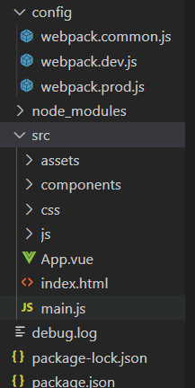

### babel

> 是一个通用型js编译器,可以将以最新标准编写的js代码编译成向下兼容各种浏览器的版本

#### 安装

> Babel安装需要安装core核心preset-env预设,如果需要在webpack中使用需要安装babel-loader

```
npm install @babel/core @babel/preset-env babel-loader -D
```

#### 配置

babel.congig.json

```
{
  "presets": [
    "@babel/preset-env" //使用预设环境
  ]
}
```

webpack.config.json

```
module: {
    rules: [
      {
        test: /\.m?js$/,
        exclude: /node_modules/,
        use: {
          loader: "babel-loader",
          options: {
            presets: ['@babel/preset-env']
          }
        }
      }
    ]
  }
```

## vue工程化

### 文件目录:



- config: 存放webpack配置文件,common通用,dev开发环境,prod生产环境
- src-assets: 存放打包好的文件
- src-components: 存放组件

### package.json

```
{
  "name": "webpack-vue",
  "version": "1.0.0",
  "description": "",
  "main": "index.js",
  "scripts": {
    "test": "echo \"Error: no test specified\" && exit 1",
    "start": "webpack serve --config ./config/webpack.dev.js",
    "build": "npx webpack --config/webpack.prod.js"
  },
  "keywords": [],
  "author": "kyogre",
  "license": "ISC",
  "devDependencies": {
    "clean-webpack-plugin": "^3.0.0",
    "css-loader": "^5.0.1",
    "file-loader": "^6.2.0",
    "handlebars": "^4.7.6",
    "handlebars-loader": "^1.7.1",
    "html-webpack-plugin": "^4.5.0",
    "iscroll": "^5.2.0",
    "less": "^4.1.0",
    "less-loader": "^7.2.1",
    "postcss-loader": "^4.1.0",
    "precss": "^4.0.0",
    "style-loader": "^2.0.0",
    "stylus": "^0.54.8",
    "stylus-loader": "^4.3.2",
    "uglifyjs-webpack-plugin": "^2.2.0",
    "vue-loader": "^15.9.6", /vue加载器
    "vue-style-loader": "^4.1.2", //vue中style标签的中样式加载器
    "vue-template-compiler": "^2.6.12", //vue模板加载器,必须与vue版本一致
    "webpack": "^5.13.0",
    "webpack-bundle-analyzer": "^4.2.0",
    "webpack-cli": "^4.3.1",
    "webpack-dev-server": "^3.11.0",
    "webpack-merge": "^5.4.0"
  },
  "dependencies": {
    "vue": "^2.6.12"
  }
}
```

### webpack.common.js

```
const path = require('path');
const HtmlWebpackPlugin = require('html-webpack-plugin')
//webpack 查看打包模块依赖关系以及size 插件
const VueLoaderPlugin = require('vue-loader/lib/plugin')

console.log()
module.exports = {
  //指定入口
  entry: {
    main: './src/main.js'
  },
  plugins: [

    new HtmlWebpackPlugin({
      title: "html plugn page",
      template: './src/index.html'
    }),
    new VueLoaderPlugin()
  ],
  output: {
    //输出文件名称
    filename: '[name].build.js',
    //输出文件路径
    path: path.resolve(__dirname, '../dist'),
  },
  module: {
    rules: [
      {
        test: /\.css$/,
        use: [
          'vue-style-loader', //解析vue文件中的style标签
          'style-loader',
          'css-loader',
          'stylus-loader',
          'postcss-loader'
        ]
      },
      {
        test: /\.styl(us)?$/,//识别styl后缀的文件,或者lang属性为stylus的css块
        use: [
          'vue-style-loader',
          'style-loader',// 插入css到模板的haed标签中
          'css-loader',
          'stylus-loader'
        ]
      },
      {
        test: /\.vue$/,
        loader: 'vue-loader'
      }
    ]
  },
  //解析
  resolve: {
    alias: {
      'vue$': 'vue/dist/vue.esm.js'
    },
    //解析 模块后缀默认 ext
    extensions: ['.js', '.json', '.vue'],
  }
};
```

### webpack.dev.js

```
const { merge } = require('webpack-merge');
const path = require('path')
const common = require('./webpack.common.js');

module.exports = merge(common, {
  //devtoll 生产打包模式 inline-source-map
  mode: "development",
  devtool: 'eval',
  devServer: {
    //服务器 生成文件的 临时根目录
    inline: true,
    host: 'localhost',
    port: 8080,
    open: true,
    // hot: true
  },
});
```

### webpack.prod.js

```
const common = require('./webpack.common');
const { merge } = require('webpack-merge');
const UglifyjsWebpackPlugin = require('uglifyjs-webpack-plugin')

// 压缩打包生成文件
// const UglifyjsWebpackPlugin = require('uglifyjs-webpack-plugin');


module.exports = merge(common, {
  mode: "production", //development|production
  output: {
    filename: '[name].[hash:7].js'
  },
  plugins: [
    // new UglifyjsWebpackPlugin()
  ],
  //排除 例外规则 指定某些模块不打包
  externals: {
    jquery: 'jQuery',
    axios: 'axios',
    wangeditor: 'wangEditor'
  },
  // 提取多入口模块中的第三方库 单独整合打包
  optimization: {
    splitChunks: {
      cacheGroups: {
        commons: {
          test: /[\\/]node_modules[\\/]/,
          name: "vendors",
          chunks: "all",
        }
      }
    }
  }
})
```

