# Node服务端

> 主要学习内容:
>
> 1. 服务端开发基础,(iO,file模块等)
> 2. 数据前后端交互,(Ajax)
> 3. 代码与项目管理,(git)
> 4. 数据库基础,(mongoDB)
> 5. 生产与部署
> 6. 工程化工具,(提高效率)
> 7. 包管理工具,(提高效率)

## 认识Web体系

### 服务端

> 为客户端提供服务,如向用户提供资源,保存客户端数据等

### 客户端

> 常见的客户端有: DNS客户端,Web客户端,游戏客户端,移动客户端
>
> Wed客户端主要指浏览器,主要功能是将用户向服务器请求的资源呈现出来显示在浏览器窗口

### Web服务器

> Web服务器一般指网站服务器,是驻留在Internet上某种类型的**计算机的程序**,可以放置数据文件,让全世界浏览和下载,目前最主流的三个Wed服务器是Apache,Nginx,IIS,通俗理解为:

- Web服务器存放一些资源文件,可以通过互联网的形式进行访问,资源的展现形式是web Server内部展现好的
- Wed服务器维持可通达性,即通过IP和端口可以访问到web服务器,并获取到Web Server中的资源

### HTTP

> http是一个简单的请求响应协议,它通常运行在TCP之上,指定了客户端可能发送给服务器什么样的消息以及服务器怎么响应
>
> HTTP是基于客户/服务器模式,且是面向连接的,典型的HTTP事务处理有如下的过程
>
> 1. 客户端与服务器建立连接
> 2. 客户端向服务器发送请求
> 3. 服务器接收请求并根据请求响应数据
> 4. 客户端与服务器关闭连接

## 认识NodeJs

### 什么是Nodejs?

> 不是一门语言,不是单纯的Web服务器(如 apache Nginx),也不是一个库或者框架
>
> 而是: **一个JS运行环境,是一个脱离浏览器的JS语言解释器**,js在node环境时与浏览器中不一样,node环境下js有文件读写的权限和能力

#### 来源

> Node.js 是2009的时候由大神 Ryan Dahl 开发的。Ryan 的本职工作是用 C++ 写服务器，后来他总结出一个经验，一个高性能服务器应该是满足“事件驱动，非阻塞 I/O”模型的。C++ 开发起来比较麻烦，于是 Ryan 就想找一种更高级的语言，以便快速开发。
>
> 
>
> 可以说有两点促成了 Nodejs 的诞生。首先第一点，Ryan 发现 JS 语言本身的特点就是事件驱动并且是非阻塞 I/O 的，跟他的思路正是绝配。第二点，Chrome 的 JS 引擎，也就是 V8 引擎是开源的，而且性能特别棒。于是 Ryan 就基于 V8 开发了 Node.js ，注意 Node.js 听名字好像是个 JS 库，其实不是的，Node.js 是 C++ 开发的

#### 服务端的特点对比

> **apache** 请求 多进程，多线程，，每个进程达到线程上线，会开辟新的进程。线程是阻塞的，一个线程处理结束（请求数据库等等）才会回收，不然新的请求只能开辟新的线程。
>
> **nginx** 请求 ，为异步非阻塞，抗并发，适合做负载分发请求。
>
> **nodejs** 单线程、非阻塞，抗并发请求能力大，转发给低层C++ 处理。适合**大并发、静态文件请求密集**、i/o密集、**聊天室**、blog、(cpu密集、解压缩、模板渲染加密、解密等,不适合nodejs）等。
>
> **Tomcat**是应用（Java）服务器，它只是一个Servlet(JSP也翻译成Servlet)容器，可以认为是Apache的扩展，但是可以独立于Apache运行。

## Node安装和配置

### 下载

> Node.js中文网:http://nodejs.cn/
>
> **注意**: 
>
> - `.msi文件`:安装版,下载后直接安装即可
> - `.zip`:解压即用版,不用安装,可直接用

### CMD常用命令

```
'盘符:'
	直接进入该盘
'cd'
	'cd \'进入根目录
	'cd..'返回上一级
	'cd 文件路径'进入某个文件夹
'dir'
	返回当前路径文件夹信息
'notopad 文件名'
	创建文件,该命令是打开的意思没有文件是会提示创建,创建后会直接打开该文件,此方法更加方便
'move 文件名 文件夹名'
	文件夹名不是当前路径下时需要完整路径
'md 文件夹/mkdir 文件夹'
	创建文件夹,make dir的简写
'del 文件名'
	删除文件
'ipconfig'
	展示当前TCP/IP协议设置值 主要用来查看IP地址 子网掩码 网关
```

## NPM

> 是nodejs内置的包管理工具,

### 配置npm环境变量

查看npm安装信息与默认下载路径

```shell
npm config ls
```

查看全局默认目录

```shell
npm root -g
```

1. 修改全局与缓存地址

在D盘nodejs目录下创建两个目录，分别是node_cache和node_global，这是用来放安装过程的缓存文件以及最终的模块配置位置。配置完成后，cmd中执行下面这两个命令：

```
npm config set prefix "D:\Program Files\nodejs\node_global"
npm config set cache "D:\Program Files\nodejs\node_cache"
```

2. 修改环境变量

   配置npm的环境变量和nodejs的环境变量。在计算机图标上点右键，选属性，然后点击高级系统配置，弹出来的新窗口右下角有个环境路径，点击去，就能看到环境路径的配置界面，我们点击新建。然后在弹出来的窗口里，变量名填：NODE_PATH

   获取

   变量值填：D:\Program Files\nodejs\node_modules\
   点击确定

   编辑Path变量

   找到npm项修改为D:\Program Files\nodejs\node_global\

3. 修改仓库地址

   命令:

   ```shell
   npm install -g cnpm --registry=https://registry.npm.taobao.org
   
   //或者
   npm config set registry https://registry.npm.taobao.org
   /*
   registry_url指的是国内提供的一些npm仓库地址，常用的有：
   
   https://registry.npm.taobao.org
   
   http://r.cnpmjs.org/
   */
   ```


### npm常用命令

```
安装第三方包,没有版本号会安装最新版本 npm install -g 包名称(全局安装带-g,本地安装不带-g) 
卸载包 npm uninstall -g 包名称
更新包 npm update -g 包名称
查看全局安装的包 npm list -g
查看所有依赖的Node版本 npm view 包名称 engines

安装时后缀的区别:
无后缀: npm install xxx 安装到项目目录的node_modules文件夹下,但是不会将该依赖添加到package.json中
-g   : npm install xxx -g 安装到npm的磁盘目录下,任何项目都可以用
--save: npm insall xxx --save 安装到项目目录的node_modules文件夹下,并在package.json的dependencies中写入该依赖,简写为-S(从开发到上线都用的包)
--save-dev: npm install xxx --save-dev 安装到项目目录的node_modules文件夹下,并在package.json的devDependencies中写入该依赖,简写为-D(上线时不需要的包)
```

#### 后缀区别

| 后缀                       | 描述                                                         |
| -------------------------- | ------------------------------------------------------------ |
| 无后缀  npm install xxx    | 安装到项目目录的node_modules文件夹下,但是不会将该依赖添加到package.json中 |
| npm install xxx -g         | 安装到npm的磁盘目录下,任何项目都可以用                       |
| npm insall xxx --save      | 安装到项目目录的node_modules文件夹下,并在package.json的dependencies中写入该依赖,简写为-S(从开发到上线都用的包) |
| npm install xxx --save-dev | 安装到项目目录的node_modules文件夹下,并在package.json的devDependencies中写入该依赖,简写为-D(上线时不需要的包) |

### npm初始化项目

> 以安装sass为例

1. 首先`npm i sass -g`

   > 全局安装sass,方便在所有项目中使用

2. 然后在项目文件夹中打开cmd,执行命令初始化一个简单的package.json文件

   > `npm init`执行  后会询问name,version,description,entry point(入口文件)等

   ```
   { 
     "name": "nodetest", 文件名
     "version": "1.0.0", 版本号
     "description": "This is node test", 描述
     "main": "app.js",入口文件
     "scripts": { 自定义命令
       "test": "echo \"Error: no test specified\" && exit 1"
     },
     "author": "",作者
     "license": "ISC"
   }
   ```

3. 设置sass保存自动编译

   > sass编译命令: 
   >
   > ​	sass 文件1.sass 文件2.css =>将文件1编译成文件2
   >
   > ​	sass 文件1.sass 文件2.css --watch =>将文件1编译成文件2,并监视文件1的保存,保存即编译
   >
   > **简便监视(自定义命令)**: 
   >
   > 在上述package.json的script中我们可以自定义cmd命令如: 'sass-watch': 'sass 文件1.sass 文件2.css --watch ',之后运行`npm run sass-watch即可

## JS模块化

> 为什么需要模块化:
>
> ​	常规开发时引入多个js文件时存在两个问题:
>
> 1. js文件间加载顺序与文件间相互依赖顺序必须一致
> 2. js文件间很容易出现命名冲突的情况
>
> **目前模块化使用:CommonJS或者ES6的模块化方法**

### 对象式模块化开发

> 每个文件做成一个对象,
>
> 特点: 
>
> 1. 独立命名空间,命名不会冲突
> 2. 外部可以访问内部的属性
> 3. 但外部可以修改内部属性,容易造成变量污染

```
a.js:
let a = {
	index: 2,
	fn(){
		return this.index++
	}
}
b.js:
let b = {
	index: 2,
	fn(){
		return this.index++
	}
}
主文件中:
引入a.js和b.js文件后即可使用其中的方法,
```

### IIFE模式化开发

> 通过自执行函数创建命名空间,最后将函数挂载到window上
>
> 特点:
>
> 1. 变量名不会冲突
> 2. 但外部访问不到内部的变量

```
a.js:
(fucntion(win){
	function fn(){
		//do something
	}
	win.fn = fn
})(window)
```

### 闭包模式化开发

> 通过闭包函数将需要提供给外部访问的变量封装进去
>
> 特点:
>
> 1. 变量名不会全局冲突
> 2. 可以访问内部变量
> 3. 可以修改内部变量,但不会造成变量污染

```
A.js:私有变量数组,提供获取和修改数组的方法
let A_module = (function(){
  let arr = [1,2,3,4,5];
  return {
    get (){
      return arr
    },
    set(newArr){
      arr = newArr
    }
  }
})()
B.js:提供数组修改方法,暴露给外部使用
let B_module = (function(){
  function myReduce(arr,callback,acc){
    let i = acc? 0 : 1
    acc = acc ?? arr[0]
    for(; i < arr.length; i++){
      acc = callback(acc,arr[i],i,arr)
    }
    return acc
  }
  function myMap(arr,callback){
    let newArr = []
    for(let i = 0; i < arr.length;i++){
      newArr.push(callback(arr[i],i,arr))
    }
    return newArr
  }
  return {
    myReduce,myMap
  }
})()
C.js:使用模块A的数据,使用模块b的方法对其数据进行修改
let C_module = (function(){
  let arr = A_module.get()
  let arrObj = B_module.myReduce(arr,function(acc,curr){
    if(curr in acc){
      acc[curr] = acc[curr]++
    }else{
      acc[curr] = 1
    }
    return acc
  },{})
  console.log(arrObj)
  let newArr = B_module.myMap(arr,function(item){
    return ++item
  })
  A_module.set(newArr)
  console.log(A_module.get())
})()
html:
<body>
  <script src="./js/B.js"></script>
  <script src="./js/A.js"></script>//A,B文件不需要控制顺序
  <script src="./js/C.js"></script>
</body>
```

### AMD和CMD

> 两个都是用来处理模块化的第三方库官网如下:
>
> amd:https://requirejs.org/
>
> cmd:https://www.zhangxinxu.com/sp/seajs/docs/zh-cn/cheatsheet.html

CommonJS和ES6模块化出现后就不使用上面的方法了,详情看课件笔记

### CommonJS模块化

> CommonJS规范加载模块是同步的,主要分为三个部分:`module(模块标识)`,`require(模块引用)`,`export(模块定义)`
>
> **在node模块章节会详细讲解**

#### module.exports属性

> 用于模块中的变量导出
>
> node为每一个模块都提供了一个export变量指向module.exports,这相当于每个模块都有这样一句命令`var exports = module.exports`,因此不能直接给exports赋值否则就覆盖掉了原来的指令,切断了exports与module.exports的联系

```
a.js(a模块):
let a = 10;
let b = 20;
let c = 20
整体导出:
module.exports = { //a,b导出,module.exports属性相当于对外导出的接口,其他模块引入实际就是读取module.exports属性值
	a,
	b
}
也可以一个一个导出:
exports.a = a;
exports.b = b;
module.exports.c = c
但之后不能使用第一种导出方法,这样会覆盖掉原来导出的值,相当于重写的exports,因为exports指向module.exports
```

#### require方法

> 用于模块的导入

```
如导入上述a模块
const a = require('./a')
console.log(a) => {a=10,b=10}
```

### ES6模块化

> ES6汲取了上面几中模块化方式的优点,新增了两个关键字来进行模块化:`export`,`import`
>
> export用于将模块中的东西暴露出来
>
> import用于将模块中暴露的东西引入

#### export

```
a模块:
let a = 10;
let b = 10;
let c = 10;
export {
	a,b,c
}
或者
export a;
export b;
export c;
还有另一中默认导出
export default a
注意,一个文件只能有一个默认导出,所以export default只能使用一次
```

#### export default

> 默认导出,可以不写名字,一个文件只能默认导出一个,导入时名字任意写

```
export default function(){
	console.log("默认导出~")
}
```

#### import

> html中引入的js使用了`import`时该标签必须添加`type="module"`属性

```
从a模块中导入
import {a,b,c} form './a'
可以直接使用解构的方式也可以不使用解构
```

#### 页面引入

> 引入的`script`中一定要写module属性

```
<script src="模块路径" type="modile"></script>
```

## JS事件队列

> EventLoop
>
> 我们都知道js是单线程的,代码从上到下依次执行,且一次只能处理一个任务,那么就会存在一个问题:
>
> 阻塞: 当遇到比较耗时的任务,就会阻塞下面的代码执行,只有任务完成时才会继续执行下面的任务,在此期间代码一直处于等待执行状态,非常耗费资源和影响用户体验
>
> 为了解决这个问题: JS来将耗时的任务变成异步任务,通过事件队列来控制任务执行顺序

### Event Loop

> Event Loop是一个程序结构,用于等待和发送消息和事件,简单说就是程序设置了两个线程,`主线程`,`Event Loop线程`,主线程用来负责程序本身的运行,Event Loop线程负责主线程与其他进程的通信
>
> **不同的地方对Event Loop模型的实现不同,浏览器和Node基于自己的技术实现了各自的Event Loop**

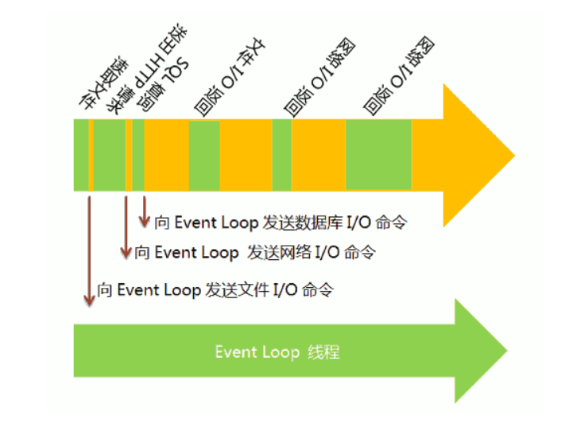

### 同步任务与异步任务

> 同步任务是指立即执行的任务代码,不需要等待,直接执行
>
> 异步任务是指需要等待的任务,等待特定时机才能执行如定时器,Promise等

### 宏队列与微队列

> 宏队列中对应的任务是宏任务,微队列中对应的任务是微任务,两者执行的优先级不同

#### 宏对列

> macrotask 也叫tasks,一些异步任务的回调函数会依次进入宏队列等待执行,这些任务包括:
>
> 在微任务之后执行

1. setTimeout
2. setInterval
3. setImmediate(Node独有)
4. requestAnimationFrame (浏览器独有)
5. Ajax(属于I/O)
6. DOM操作(属于I/O)
7. UI rendering (浏览器独有)

#### 微对列

> microtask，也叫jobs,另一些异步任务的回调函数会依次进入微任务队列等待执行,这些任务包括:
>
> 再宏任务之前执行

1. process.nextTick(Node独有)
2. Promise.then的then
3. Object.observe
4. MutationObserver

### 浏览器的Event Loop

> 了解了什么是宏任务和微任务以及同步异步任务后,下面是浏览器执行js代码时任务处理方式
>
> 共有三个队列: 主队列,微任务队列,宏任务队列
>
> 主队列: 用于控制代码执行(先将同步代码执行完毕)
>
> 微任务队列: 依次存放微任务的回调函数
>
> 宏任务队列: 依次存放宏任务的回调函数
>
> 通过事件轮询来控制各个任务的执行:**每次都是先判断主队列再判断微任务队列再判断宏任务队列**

1. 执行全局script代码
   - 遇到同步代码直接放进主任务队列执行
   - 遇到异步代码,交给第三方模块执行,主队列继续执行其他同步代码
2. 第三方模块执行完毕
   - 若是微任务回调依次放进微任务队列等待执行
   - 若是宏任务回调依次放进红任务队列等待执行
3. 主队列执行完毕为空时,去**检测微任务队列**,若微任务队列中有可执行任务,取出**第一个放进主队列执行**,执行完毕,继续**检测微任务队列**是否有任务,若有继续上述步骤,若没有则**检测宏任务对列**是否有可执行任务,若有取出**第一个任务放进主队列**执行,执行完毕**检测微任务队列**是否有任务可执行,若没有继续检测宏任务队列是否有任务可执行,....依次循环检测直到所有的任务队列清空

**若微任务中有宏任务或微任务,则插入到对应队列的末尾等待轮询**,记住两点:

- 微任务队列中所有微任务执行完毕才会执行宏任务队列中的宏任务
- 每执行一个宏任务都会检测微任务队列中是否有微任务

以上循环检测机制又叫事件轮询

### Node11之前的EventLoop机制

> 与现在新版本的node机制不同,但也主要分为主队列,宏队列,微队列

#### Node11的队列

##### 宏队列

> node11中的宏队列有多个(因为包括I/O权限),主要有四个

- Timers Queue
- IO Callbacks Queue
- Check Queue
- Close Callbacks Queue

在浏览器中可以认为只有一个宏队列,但在node中不同的宏任务会放进不同的宏队列

**6个阶段,每个阶段对应一个队列**

>  NodeJS的Event Loop中，执行宏队列的回调任务有**6个阶段**各个阶段执行的任务如下：

- **timers阶段**：定时器阶段,这个阶段执行setTimeout和setInterval预定的callback
- **pending callbacks阶段**：系统回调阶段,执行除了close事件的callbacks、被timers设定的callbacks、setImmediate()设定的callbacks这些之外的callbacks
- **idle, prepare阶段**：空闲准备阶段,仅node内部使用,无需关注
- **poll阶段**:，I/O事件阶段,等待I/O事件,执行I/O事件的回调函数,适当的条件下node将阻塞在这里
- **check阶段**：检查阶段,执行setImmediate()设定的callbacks
- **close callbacks阶段**：关闭回调阶段,执行socket.on('close', ....)这些callbacks

##### 微队列

> 主要有两个

- Next Tick Queue: 是放置process.nextTick(callback)的回调任务(优先级高)
- Other Micro Queue: 放置其他微任务如Promise.

在浏览器中也可以认为只有一个微队列,所有的微任务都会被加到这个微队列中,但是Node中不同的微任务会放进不同的微队列

#### 执行流程

1. 执行全局的同步代码
2. 检测执行微队列的Next Tick队列的所有微任务,再检测执行Other 队列的所有微任务
3. 开始执行宏任务,共六个阶段,从第一个阶段开始执行每一个宏队列的**所有任务**(并不是取出一个),执行完毕后重复步骤2检测并执行微任务,所有微任务执行完毕之后执行下一个阶段宏队列的所有宏任务,执行完毕重复步骤2,以此类推直到所有任务执行完毕.

### Node11之后EventLoop机制

> 新增了check阶段,用来处理setImmediate

### Node任务队列方法

> process.nextTick 和 setImmediate

#### NextTick

> process.nextTick方法可以在当前"执行栈"的尾部----下一次Event Loop（主线程读取"任务队列"）之前----触发回调函数。也就是说，它指定的任务总是发生在所有异步任务之前。
>
> 在所有异步代码之前触发

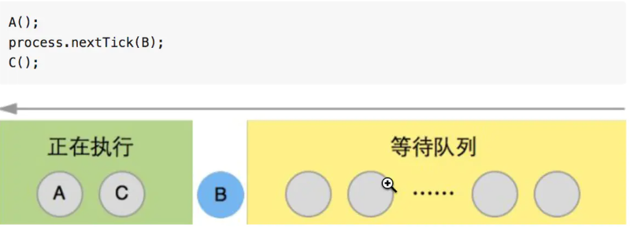

#### SetImmediate

> setImmediate方法则是在当前"执行栈"的尾部添加事件,即在当前事件循环结束时触发

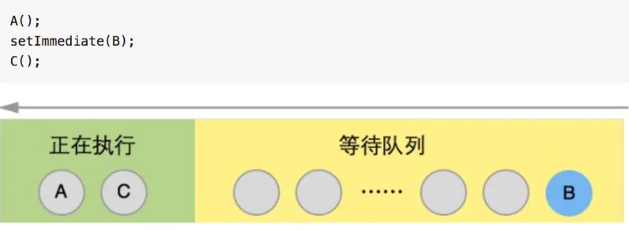

## Node模块

> 为了让Node.js的文件可以相互调用,Node.js采用CommonJS规范提供了一个简单的模块系统
>
> 在node中模块是应用程序的基本组成部分,一个文件就是一个模块

### 模块引入(require对象)

> 一个模块可以通过require('文件路径')方法导入另一个模块导出的内容

#### 导入规则

- `以'/','./','../'开头的路径如require('./foo')`:

  1. 根据相对路径寻找foo.js文件,
  2. 若文件不存在,根据相对路径寻找到foo文件夹,以文件夹中`package.json`文件中`main`属性指定的文件作为导入文件,
  3. 若`pakage.json或main`属性不存在,默认以foo下的`index.js`作为导入文件

- 不以`'/','./','../'开头的路径`:

  1. 判断是否为核心模块如`fs模块`,若是就导入

  2. 若不是核心模块,会从当前模块的文件目录开始从他的`node_module`文件夹下查找

  3. 若还没有找到,会移动到上一层父级目录的`node_module`查找,直到找到根目录

     - 例如:如果在 `'/home/ry/projects/foo.js'` 文件里调用了 `require('bar.js')`，则 Node.js 会按以下顺序查找：

       - `/home/ry/projects/node_modules/bar.js`
       - `/home/ry/node_modules/bar.js`
       - `/home/node_modules/bar.js`
       - `/node_modules/bar.js`

       这使得程序本地化它们的依赖，避免它们产生冲突。

#### require对象

##### require的main属性

> 每个文件中都有一个modlue对象,当使用node直接运行文件时,会将require的main属性设置为自身的module,
>
> 即`module === require.main`,之后无论在哪个模块访问require.main属性都返回的是主文件module对象
>
> 由此可知若模块中module === require.main 返回true则表示该模块是主模块,

##### require.cache

被引入的模块将被缓存在这个对象中。 从此对象中删除键值对将会导致下一次 `require` 重新加载被删除的模块。 这不适用于原生插件，因为它们的重载将会导致错误。

可以添加或替换入口。 在加载原生模块之前会检查此缓存，如果将与原生模块匹配的名称添加到缓存中，则引入调用将不再获取原生模块。 谨慎使用！

##### require.resolve(request[, options])

```
request <string> 需要解析的模块路径。
options <Object>
paths <string[]> 从中解析模块位置的路径。 如果存在，则使用这些路径而不是默认的解析路径，但 GLOBAL_FOLDERS 除外，例如 $HOME/.node_modules，它们总是包含在内。 这些路径中的每一个都用作模块解析算法的起点，这意味着从该位置开始检查 node_modules 层次结构。
返回: <string>
使用内部的 require() 机制查询模块的位置，此操作只返回解析后的文件名，不会加载该模块。

如果找不到模块，则会抛出 MODULE_NOT_FOUND 错误。
```

##### require.resolve.paths(request)

```
request <string> 被查询解析路径的模块的路径。
返回: <string[]> | <null>
返回一个数组，其中包含解析 request 过程中被查询的路径，如果 request 字符串指向核心模块（例如 http 或 fs）则返回 null。
```

### 模块导出(module.exports)

> 一个模块可以通过向`moudle.exports`属性上挂载内容,来表示将该内容导出

#### 导出规则

1. 直接向`module.exports`上挂载:

   ```
   let a = 10
   let b = 20
   module.exports.a = a
   moudle.export.b = b
   或者:
   moudle.exports = {
   	a,b
   }
   文件被导入后获得到一个对象
   {
    a:10,
    b:20
   }
   ```

2. 通过在`exports`对象上挂载:

   ```
   let a = 10
   let b = 20
   exports.a = a
   exports.b = b
   文件被导入后获得一个对象
   {
   	a:10,
   	b:20
   }
   原因: node在文件中隐式添加了一行代码exports = module.exports,将exports指向moudle.exports因此实际上还是挂载到了module.exports上
   注意: 不能再给exports赋值,因为会改变exports对moudle.exports的引用
   ```

### 模块作用域

#### module对象

> 每个模块都有一个moudle对象,表示对当前模块的引用

```
console.log(module);
输出模块对象:
{
	id:'模块的标识符。 通常是完全解析后的文件名',
    filename:'模块的完全解析后的文件名',
    loaded:'模块是否已经加载完成，或正在加载中',
    path:'模块的目录名称',
    paths:'模块的搜索路径',
    exports:'导出的模块内容'
}
```

#### \_\_dirname

> 当前模块的目录名,不包含文件名

示例，从 `/Users/mjr` 运行 `node example.js

```
console.log(__dirname);
// 打印: /Users/mjr
console.log(path.dirname(__filename));
// 打印: /Users/mjr
```

#### \_\_filename

> 当前文件的绝对路径,包含文件名,相当于module.filename

从 `/Users/mjr` 运行 `node example.js`：

```
console.log(__filename);
// 打印: /Users/mjr/example.js
console.log(__dirname);
// 打印: /Users/mjr
```

### 缓存

模块在第一次加载后会被缓存。 这也意味着（类似其他缓存机制）如果每次调用 `require('foo')` 都解析到同一文件，则返回相同的对象。

**多次调用 `require(foo)` 不会导致模块的代码被执行多次**。 这是一个重要的特性。 借助它, 可以返回“部分完成”的对象，从而允许加载依赖的依赖, 即使它们会导致循环依赖。

如果想要多次执行一个模块，可以导出一个函数，然后调用该函数。

#### 模块缓存的注意事项

模块是基于其解析的文件名进行缓存的。 由于调用模块的位置的不同，模块可能被解析成不同的文件名（比如从 `node_modules` 目录加载），这样就不能保证 `require('foo')` 总能返回完全相同的对象。

此外，在不区分大小写的文件系统或操作系统中，被解析成不同的文件名可以指向同一文件，但缓存仍然会将它们视为不同的模块，并多次重新加载。 例如， `require('./foo')` 和 `require('./FOO')` 返回两个不同的对象，而不会管 `./foo` 和 `./FOO` 是否是相同的文件。

### 核心模块

Node.js 有些模块会被编译成二进制。 这些模块别的地方有更详细的描述。

核心模块定义在 Node.js 源代码的 `lib/` 目录下。

`require()` 总是会优先加载核心模块。 例如， `require('http')` 始终返回内置的 HTTP 模块，即使有同名文件。

## events模块

> 自定义事件模块,可以通过events可以自定义事件和触发事件
>
> 该模块提供了一个`EventEmitter`类,用于事件处理,可以在回调函数中触发自定义事件,进行业务处理,更加方便管理方法

```
初始化:
const EventEmitter = require("events")
const events = new EventEmitter()
```

### 方法

> 提供了声明自定义事件的方法`on`,自定义事件触发的方法`emit`,自定义事件解除绑定的方法`off`

#### on

> 绑定自定义事件,接受两个参数

```
events.on('自定义事件名',回调函数)
```

一个自定义事件可以绑定多个函数,触发时函数依次执行

#### once

> 绑定只执行依次自定义事件,当事件触发时监听器会被注销然后再调用

```
events.once('自定义事件名')
```

#### emit

> 触发自定义事件,至少一个参数

```
events.emit('自定义事件名',参数2,参数3,....)
除了第一个参数之后的参数都会作为自定义事件回调函数的参数
```

当事件被触发时,绑定的回调函数内部this会指向监听器绑定的对象events,若绑定时使用的是箭头函数,则绑定的回调函数内部this不会指向events实例

#### off()

> 解除自定义事件的绑定,接收两个参数

```
function  fn(){}
//添加自定义事件
events.on('点击',fn)
//解除自定义事件的绑定
events.off('点击',fn) 解除绑定时要将绑定的函数一起作为参数传递
```

#### removeAllListeners()

> 移出所有自定义事件

### 错误事件

当 `EventEmitter` 实例出错时，应该触发 `'error'` 事件。 这些在 Node.js 中被视为特殊情况。

如果没有为 `'error'` 事件注册监听器，则当 `'error'` 事件触发时，会抛出错误、打印堆栈跟踪、并退出 Node.js 进程。

```js
const myEmitter = new MyEmitter();
myEmitter.emit('error', new Error('错误信息'));
// 抛出错误并使 Node.js 崩溃。
```

为了防止崩溃 Node.js 进程，可以使用 `domain` 模块。 （但请注意，不推荐使用 `domain` 模块。）

作为最佳实践，应该始终为 `'error'` 事件注册监听器。

```js
const myEmitter = new MyEmitter();
myEmitter.on('error', (err) => {
  console.error('错误信息');
});
myEmitter.emit('error', new Error('错误'));
// 打印: 错误信息
```

## path模块

> 文件路径处理模块,内部封装了很多与路径处理有关的方法

```
初始化:
const path = require("path")
```

### window路径和posix路径

> 两种风格不同的路径规范
>
> window下的路径: 使用反斜杠进行分隔
>
> posix下的路径: 使用斜杠来分隔(开发时使用的路径风格就是这种)

因此，使用 `path.basename()` 可能会在 POSIX 和 Windows 上产生不同的结果：

在 POSIX 上:

```js
path.basename('C:\\temp\\myfile.html');
// 返回: 'C:\\temp\\myfile.html'
```

在 Windows 上:

```js
path.basename('C:\\temp\\myfile.html');
// 返回: 'myfile.html'
```

如果要在任意操作系统上使用 Windows 文件路径时获得一致的结果，则使用 [`path.win32`](http://nodejs.cn/s/eH3AFM)：

在 POSIX 和 Windows 上:

```js
path.win32.basename('C:\\temp\\myfile.html');
// 返回: 'myfile.html'
```

如果要在任意操作系统上使用 POSIX 文件路径时获得一致的结果，则使用 [`path.posix`](http://nodejs.cn/s/c8hd35)：

在 POSIX 和 Windows 上:

```js
path.posix.basename('/tmp/myfile.html');
// 返回: 'myfile.html'
```

在 Windows 上，Node.js 遵循独立驱动器工作目录的概念。 当使用没有反斜杠的驱动器路径时，可以观察到此行为。 例如， `path.resolve('C:\\')` 可能会返回与 `path.resolve('C:')` 不同的结果。 详见[此 MSDN 页面](http://nodejs.cn/s/qMc4eE)。

### 方法

#### path.basename(path[,ext])

> 获取路径中文件名称,

```
path.basename('文件路径','.后缀名')
文件路径: 必传
.后缀名: 不是必须,传递后缀名后会只返回文件名不加后缀,若不传递返回文件名+后缀
例子:
path.basename('/foo/bar/quux.html'); // 返回：‘quux.html’
path.basename('/foo/bar/quux.html', '.html'); // 返回：‘quux’
```

#### path.dirname(path)

> 返回路径中目录路径,不带文件名

```
path.dirname('文件路径')
返回除文件名的目录
例子:
path.dirname('/foo/bar/baz/asdf/quux');
// 返回：‘/foo/bar/baz/asdf’
```

#### path.extname(path)

> 获取路径中的后缀名,即从`path`的最后一部分中的最后一个`.`字符到字符串结束,如果路径中最后一部分没有`.`或者`path`的文件名的第一个字符是`.`则返回一个空的字符串

```
path.extname(path)
//如果path不是一个字符串,则抛出TypeError
例子:
path.extname('index.html'); // 返回：‘.html’
path.extname('index.coffee.md'); // 返回：‘.md’
path.extname('index.'); // 返回： ‘.’
path.extname('index'); // 返回：‘’
path.extname('.index'); // 返回：‘’
```

#### path.parse(path)

> 把路径解构成对象

```
path.parse('/home/user/dir/file.txt')
返回:
{
   root : "/", //根目录
   dir : "/home/user/dir",文件路径
   base : "file.txt",文件名
   ext : ".txt", 文件后缀
   name : "file"文件名不加后缀
}
```

#### path.format(pathObj)

> 将路径对象组合成路径

```
path.format(pathObj)
pathObj: {
	root: 根路径,
	dir: 文件路径不加文件名,
	base: 文件名+后缀,
	ext: 文件后缀,
	name: 文件名不加后缀
}
注意: 若dir存在会忽略root的值,若base存在会忽略ext和name的值
例子:
// 如果提供了'dir'、'root'和'base',则返回'${dir}$(path.sep)${base}'。
// 'root'会被忽略
path.format({
  root: '/ignored',
  dir: '/home/user/dir',
  base: 'file.txt'
});
// 返回：'/home/user/dir/file.txt'

// 如果没有指定'dir',则'root'会被使用。
// 如果只提供了'root'或'dir'等于'root',则平台的分隔符不会被包含。
// 'ext'会被忽略
path.format({
  root: '/',
  name: 'file',
  ext: '.txt' 
})
// 返回：'/file.txt'
```

#### path.isAbsolute(path)

> 判断path是否是绝对路径,返回布尔值

```
`path.isAbsolute()`方法会判定`path`是否为一个绝对路径。
如果给定的`path`是一个长度为零的字符串，则返回`false`。
path.isAbsolute('/foo/bar'); // true
path.isAbsolute('/baz/..'); // true
path.isAbsolute('qux/'); // false
path.isAbsolute('.'); // false
```

#### path.join([...path])重点

> 使用特定平台的分隔符把全部给点给的path片段连接起来,并规范化生成的路径,
>
> 长度为'0'的path片段会被忽略,如果连接后的字符串长度为0的字符串则返回`'.'`表示当前工作目录
>
> 如果任一路径片段不是一个字符串，则抛出 TypeError。

```
path.join('/foo', 'bar', 'baz/asdf', 'quux', '..')
// 返回: '/foo/bar/baz/asdf'

path.join('foo', {}, 'bar')
// 抛出 TypeError: path.join 的参数必须为字符串
```

#### path.normalize(path)重点

> 将path规范化处理,
>
> 当发现多个连续的路径分隔符时他们会被单一的路径分隔符所代替.末尾的多个分隔符会被保留,
>
> 如果path是一个长度为0的字符串则返回`'.'`表示当前工作目录
>
> 如果 path不是一个字符串，则抛出 TypeError。
>

```
在posix上
path.normalize('/foo/bar//baz/asdf/quux/..')
// 返回: '/foo/bar/baz/asdf'
在window上
path.normalize('C:\\temp\\\\foo\\bar\\..\\');
// 返回: 'C:\\temp\\foo\\'
```

#### path.relative(from,to)重点

> 返回从from到to的相对路径
>
> 如果 from 或 to 传入了一个长度为零的字符串，则当前工作目录会被用于代替长度为零的字符串。
>
> 如果 from 或 to 不是一个字符串，则抛出 TypeError

```
在posix上
path.relative('/data/orandea/test/aaa', '/data/orandea/impl/bbb')
// 返回: '../../impl/bbb'
在window上
path.relative('C:\\orandea\\test\\aaa', 'C:\\orandea\\impl\\bbb')
// 返回: '..\\..\\impl\\bbb'
```

#### path.resolve([...paths])重点

> 把路径或者路径片段序列化解析为一个绝对路径
>
> 给定的路径的序列是从右往左被处理的，后面每个 path 被依次解析，直到构造完成一个绝对路径。 例如，给定的路径片段的序列为：/foo、/bar、baz，则调用 path.resolve('/foo', '/bar', 'baz') 会返回 /bar/baz。
>
> 如果处理完全部给定的 path 片段后还未生成一个绝对路径，**则当前工作目录会被用上**。
>
> 生成的路径是规范化后的，且末尾的斜杠会被删除，除非路径被解析为根目录。
>
> 长度为零的 path 片段会被忽略。
>
> 如果没有传入 path 片段，则 path.resolve() 会返回当前工作目录的绝对路径。

```
path.resolve('/foo/bar', './baz')
// 返回: '/foo/bar/baz'

path.resolve('/foo/bar', '/tmp/file/')
// 返回: '/tmp/file'

path.resolve('wwwroot', 'static_files/png/', '../gif/image.gif')
// 如果当前工作目录为 /home/myself/node，
// 则返回 '/home/myself/node/wwwroot/static_files/gif/image.gif'
```

### 属性

#### path.sep

> 返回特地给平台的路径分隔符 ,window: `\`,posix: `/`

```
在posix上
'foo/bar/baz'.split(path.sep)
// 返回: ['foo', 'bar', 'baz']
在window上
'foo\\bar\\baz'.split(path.sep)
// 返回: ['foo', 'bar', 'baz']
```

#### path.delimiter

> 返回环境变量的分隔符 ,window: `;`,posix:`:`

## Buffer缓冲区

> JS语言本身只有字符串数据类型,没有二进制数据类型,但在处理TCP流或文件流的时候必须使用二进制数据,'
>
> 因此定义另一个Buffer类该类用来创建一个专门存放二进制数据的数据缓冲区,在内存上开辟空间速度更快,
>
> Buffer类是Node的一个核心库,类似于整数数组,但他对应的是V8引擎堆内存之外的一块原始内存,Buffer对内存操作的权限比较大,可以直接捕获一些敏感信息

### Buffer与字符编码

> 通过显式的字符编码就可以在Buffer实例与普通的javascript字符串之间相互转换
>
> 字符编码比如:UTF-8,UCS-2,Base64,十六进制数据
>
> 每个汉字占三位

Node.js目前支持的字符集编码包括:

- **ascii**:仅支持7位ASCII数据,如果设置去掉最高位的话这种编码式非常快的
- **utf-8**:多字节编码的Unicode字符,许多网页和其他文档格式都用的式utf-8
- **utf16le**:2或4个字节,小字节编码的Unicode字符,支持代理对(U+10000至U+10FFFF)
- **ucs2**:**utf16le**的别名
- **base64**:Base64编码
- **latin1**:一种把Buffer编码转换成一字节编码的字符串方式
- **binary**:**Latin1的别名**
- **hex**:将每个字节编码为两个十六进制的字符

### 创建Buffer类

#### Buffer.alloc()

> 返回一个指定大小的Buffer实例,如果没有设置fill则默认填满0

```
参数:Buffer.alloc(size[,fill[,encoding]])
size: 创建的Buffer长度
fill: 用什么填充Buffer,会转换成十六进制,若没有fill参数默认用0填满
例如:
// 创建一个长度为 10、且用 0 填充的 Buffer。
const buf1 = Buffer.alloc(10);
// 创建一个长度为 10、且用 0x1 填充的 Buffer。 
const buf2 = Buffer.alloc(10, 1);
```

#### Buffer.allocUnsafe(size)

> 返回一个指定长度的Buffer实例,但是不会被初始化,所以可能包含敏感数据

```
参数:
size: Buffer实例的长度
例如:
// 创建一个长度为 10、且未初始化的 Buffer。
// 这个方法比调用 Buffer.alloc() 更快，
// 但返回的 Buffer 实例可能包含旧数据，
// 因此需要使用 fill() 或 write() 重写。
const buf3 = Buffer.allocUnsafe(10);
```

#### Buffer.allocUnsafeSlow(size)

> 暂无解释

#### Buffer.from(array)

> 返回一个被array初始化的心新的Buffer实例(传入的Array的元素只能是数字,不然会被自动覆盖为0)

```
参数:
array: 只包含数字的数组
例如:
// 创建一个包含 [0x1, 0x2, 0x3] 的 Buffer。
const buf4 = Buffer.from([1, 2, 3]);
```

#### Buffer.from(arrayBuffer[,byteOffste[,length]])

> 返回一个新建的与给定Buffer共享同一内存的Buffer

```
参数:
arrayBuffer:一个Buffer实例
```

#### Buffer.from(buffer)

> 复制传入的Buffer实例,并返回一个新的Buffer实例

```
参数:
buffer:buffer实例
```

#### Buffer.from(string[,encoding])

> 返回一个被string的值初始化的新的Buffer实例,
>
> **一个汉字在Buffer中占三位字节**

```
参数:
string: 初始化字符串
encoding: 非必选,传入字符集,以什么字符编码格式初始化Buffer
例如:
// 创建一个包含 UTF-8 字节 [0x74, 0xc3, 0xa9, 0x73, 0x74] 的 Buffer。
const buf5 = Buffer.from('tést');
// 创建一个包含 Latin-1 字节 [0x74, 0xe9, 0x73, 0x74] 的 Buffer。
const buf6 = Buffer.from('tést', 'latin1');
```

### 写入缓冲区

#### 语法

```
buf.write(string[,offset[,length[,encoding]]])
参数:
string:写入缓冲区的字符串
offset: 缓冲区开始写入的索引值,默认为0
length: 写入的字节数,默认为buffer.length
encoding:使用的编码集,默认为'utf-8'

根据encoding的字符编码将string写入到buf中offset位置,length参数是写入的字节数,如果buf没有足够的空间保存整个字符串,则只会写入string的一部分
返回值:
返回实际写入的大小,如果buffer空间不足则只会写入一部分字符串
例如:
buf = Buffer.alloc(256);
len = buf.write("www.runoob.com");

console.log("写入字节数 : "+  len);
输入: 写入字节数 : 14
```

### 读取数据

#### 语法

```
buf.toString([encoding[,start[,end]]])
参数:
enciding:使用的编码,默认为'utf-8'
start: 指定读取的索引位置,默认为0
end: 结束位置,默认缓冲区的末尾
包含start不包含end
返回值:
解码缓冲区域数据并使用指定的编码返回字符串
实例:
buf = Buffer.alloc(26);
for (var i = 0 ; i < 26 ; i++) {
  buf[i] = i + 97;
}

console.log( buf.toString('ascii'));       // 输出: abcdefghijklmnopqrstuvwxyz
console.log( buf.toString('ascii',0,5));   //使用 'ascii' 编码, 并输出: abcde
console.log( buf.toString('utf8',0,5));    // 使用 'utf8' 编码, 并输出: abcde
console.log( buf.toString(undefined,0,5)); // 使用默认的 'utf8' 编码, 并输出: abcde
```

### 将Buffer转换为JSON对象

#### 语法

```
buf.toJSON()
当字符串化一个Buffer实例时,JSON.stringfiy会隐式的调用该toJSON()
返回值:
返回一个标准的JSON对象
实例:
const buf = Buffer.from([0x1, 0x2, 0x3, 0x4, 0x5]);
const json = JSON.stringify(buf);

// 输出: 
{
	"type":"Buffer",
	"data":[1,2,3,4,5]
}
console.log(json);

const copy = JSON.parse(json, (key, value) => {
  return value && value.type === 'Buffer' ?
    Buffer.from(value.data) :
    value;
});

// 输出: <Buffer 01 02 03 04 05>
console.log(copy);
```

### 缓冲区合并

#### 语法

```
Buffer.concat(list[,totalLength])
参数:
list: 用于合并的Buffer对象数组列表
totalLength: 指定合并后Buffer对象的长度
返回值:
一个或多个成员合并的新对象
实例:
var buffer1 = Buffer.from(('菜鸟教程'));
var buffer2 = Buffer.from(('www.runoob.com'));
var buffer3 = Buffer.concat([buffer1,buffer2]);
console.log("buffer3 内容: " + buffer3.toString());
输出:buffer3 内容: 菜鸟教程www.runoob.com
```

### 缓冲区比较

#### 语法

```
buf.compare(otherBuffer)
参数:
与buf对象比较的领一个Buffer对象
返回值
一个数字:
0 表示两个Buffer相同
1 表示buf在otherBuffer之前
-1 表示buf在otherbuffer之后

实例:
var buffer1 = Buffer.from('ABC');
var buffer2 = Buffer.from('ABCD');
var result = buffer1.compare(buffer2);

if(result < 0) {
   console.log(buffer1 + " 在 " + buffer2 + "之前");
}else if(result == 0){
   console.log(buffer1 + " 与 " + buffer2 + "相同");
}else {
   console.log(buffer1 + " 在 " + buffer2 + "之后");
}
```

### 拷贝缓冲区

#### 语法

```
buf.copy(targetBuffer[,targetSart[,sourceStartp[,sourceEnd]]])
参数:
targetBuffer: 要拷贝的Buffer对象
targetStart: 数字,可选默认为0
sourceStart: 数字,默认为0
sourceEnd: 数字,默认为buffer.length
返回值: 无
实例:
var buf1 = Buffer.from('abcdefghijkl');
var buf2 = Buffer.from('RUNOOB');

//将 buf2 插入到 buf1 指定位置上
buf2.copy(buf1, 2);

console.log(buf1.toString());
输出: abRUNOOBijkl
```

### 缓冲区裁剪

#### 语法

```
buf.slice([start[,end]])
参数: 
start: 数字可选默认0
end: 数字可选默认0
返回值:
返回一个新的缓冲区,他和就得缓冲区指向同一块内存,但从索引start到end的位置剪切
实例:
var buffer1 = Buffer.from('runoob');
// 剪切缓冲区
var buffer2 = buffer1.slice(0,2);
console.log("buffer2 content: " + buffer2.toString());
输出: buffer2 content: ru
```

### 缓冲区长度

#### 语法

```
buf.length
返回值:
返回Buffer对象所占据的内存长度
实例:
var buffer = Buffer.from('www.runoob.com');
//  缓冲区长度
console.log("buffer length: " + buffer.length);
buffer length: 14
```

## fs模块

> nodeJs中使用`fs`模块来实现所有有关文件及目录的创建,写入删除操作,其实内部就是对shell命令简单的封装
>
> 在`fs`模块中所有方法都分为同步和异步实现,具有`sync`后缀的方法为同步方法

```
const fs = require('fs')
```

### flag

> 文件操作说明

| 符号 | 含义                                     |
| ---- | ---------------------------------------- |
| r    | 读文件，文件不存在报错                   |
| r+   | 读取并写入，文件不存在报错               |
| rs   | 同步读取文件并忽略缓存                   |
| w    | 写入文件，不存在则创建，存在则清空       |
| wx   | 排它写入文件                             |
| w+   | 读取并写入文件，不存在则创建，存在则清空 |
| wx+  | 和w+类似，排他方式打开                   |
| a    | 追加写入                                 |
| ax   | 与a类似，排他方式写入                    |
| a+   | 读取并追加写入，不存在则创建             |
| ax+  | 作用与a+类似，但是以排他方式打开文件     |

### 文件方法

#### fs.stat(path,callback)

> 判断path是文件还是文件夹

```
回调函数中第二个参数stats是一个对象,他的原型上有两个方法,isFile(),isDirectory()用来判断path是什么类型
fs.stat('路径',(err,stats)=>{
	stats.isFile() //返回true表示是文件
	stats.isDirectory() //返回true表示是文件夹
})

Stats {
    dev: 2114, //设备的数字标识符
    ino: 48064969, //文件系统特定的文件索引节点编号
    mode: 33188, //描述文件类型和模式的位字段
    nlink: 1, //文件存在的硬链接数
    uid: 85, //拥有该文件（POSIX）的用户的数字型用户标识符
    gid: 100, //拥有该文件（POSIX）的群组的数字型群组标识符
    rdev: 0, //如果文件被视为特殊文件，则此值为数字型设备标识符
    size: 527, //文件的大小（以字节为单位）
    blksize: 4096, //用于 I/O 操作的文件系统块的大小
    blocks: 8, //为此文件分配的块数
    atimeMs: 1318289051000.1, //访问此文件的时间戳
    mtimeMs: 1318289051000.1, //修改此文件的时间戳
    ctimeMs: 1318289051000.1, //更改此文件的时间戳
    birthtimeMs: 1318289051000.1, //创建时间的时间戳
    atime: 'Mon, 10 Oct 2020 23:24:11 GMT', //文件数据最近被访问的时间。
    mtime: 'Mon, 10 Oct 2020 23:24:11 GMT', //文件数据最近被修改的时间。
    ctime: 'Mon, 10 Oct 2020 23:24:11 GMT', //文件状态最近被改变的时间（修改索引节点数据）。
    birthtime: 'Mon, 10 Oct 2020 23: 24: 11 GMT' //文件创建的时间。
}
```

#### fs.writeFile(path,data[,option],callback)

> 异步写入文件,若文件不存在会先创建再写入
>
> 若文件存在则会覆盖掉

```
fs.writeFile(path,data,option,callback)
参数:
path:文件路径
data:写入内容
option: 一个对象,非必须参数
		{
		encoding: 字符集,默认为utf-8
		flag: 操作描述,默认为w,意思是若文件存在会覆盖原内容详情参考上面的flag表
		mode: 读写权限,默认为0666
		}
callback: 回调函数,只有一个err参数
```

#### fs.writeFileSync(path,data[,option])

> 同步写入

#### fs.appendFile(path,data[,option],callback)

> 异步追加,参数与异步写入相同,会在指定文件后追加内容

#### fs.unlink(path,callback)

> 异步删除文件

#### fs.readFile(path,chartSet,callback)

> 异步读取文件

```
fs.readFile(path,chartset,callback)
参数:
path: 文件路径
chartset: 字符集,表示以什么字符集读文件
callback: 两个参数,err,data 数据保存再data中
```

#### fs.readFileSync(path,chartSet)

> 同步读取文件

#### fs.rename(oldPath,newPath,callback)

> 修改**文件名**或者**文件夹名称**

```
也可以移动文件:
fs.rename('c.js','js/c.js',callback)
c.js文件存在时会将c.js文件移动到js文件夹下
```

#### fs.ftruncate(fd[, len], callback)

> 截断文件

```
const fd = fs.openSync('temp.txt', 'r+');
// 截断文件至前4个字节
fs.ftruncate(fd, 4, (err) => {
  console.log(fs.readFileSync('temp.txt', 'utf8'));
});
```

### 目录方法

#### fs.mkdir(path,[,mode],callback)

> 创建文件夹,父目录必须存在

```
参数:
path: 目录路径
mdoe: 权限
callback:回调函数,参数: err
```

#### fs.access(path[,mode],callback)

> 判断一个文件是否有访问权限

```
 fs.access('/etc/passwd', fs.constants.R_OK | fs.constants.W_OK, (err) => {
   console.log(err ? 'no access!' : 'can read/write');
 });
```

#### fs.rmdir(path,callback)

> 删除文件夹

#### fs.readdir(path[,option],callback)

> 读取目录下所有文件或者文件夹,返回一个数组

### 文件原始操作

> 上述的方法内部其实都对原始操作进行了封装,原始文件操作的流程是:
>
> 打开文件,读文件/写文件,同步文件缓存,关闭文件

#### fs.open(path,flag,mode,callback)

> 打开文件,原始操作必须先打开文件才可以继续对文件进行操作

```
参数:
path: 文件路径
flag: 文件操作类型,w/a等
mode: 文件操作权限 如0777表示任何用户都可以读写文件 非必须
callback: 有两个参数,err,fd,fd是一个数字类似文件ID,是一个整数
```

#### fs.read(fd,buffer,offset,length,position,callback)

> 读取文件

```
参数:
/**
 * fd, 使用fs.open打开成功后返回的文件描述符
 * buffer, 一个Buffer对象，v8引擎分配的一段内存
 * offset, 整数，向缓存区中写入时的初始位置，以字节为单位
 * length, 整数，读取文件的长度
 * position, 整数，读取文件初始位置；文件大小以字节为单位
 * callback(err, bytesRead, buffer), 读取执行完成后回调函数，bytesRead实际读取字节数，被读取的缓存区对象
 */
 例如:
 const fs=require('fs');
const path=require('path');
fs.open(path.join(__dirname,'1.txt'),'r',0o666,function (err,fd) {
    console.log(err);
    let buf = Buffer.alloc(6);
     fs.read(fd,buf,0,6,3,function(err, bytesRead, buffer){
       console.log(bytesRead);//6
       console.log(buffer===buf);//true
       console.log(buf.toString());
     })
})
```

#### fs.write(fd,buffer,offset,length,position,callback)

> 写入文件

```
参数:

/**
 * fd, 使用fs.open打开成功后返回的文件描述符
 * buffer, 一个Buffer对象，v8引擎分配的一段内存
 * offset, 整数，从缓存区中读取时的初始位置，以字节为单位 非必须
 * length, 整数，从缓存区中读取数据的字节数 非必须
 * position, 整数，写入文件初始位置； 非必须
 * callback(err, written, buffer), 写入操作执行完成后回调函数，written实际写入字节数，buffer被读取的缓存区对象
 */
 例如:
 const fs=require('fs');
const path=require('path');
fs.open(path.join(__dirname,'1.txt'),'w',0o666,function (err,fd) {
    console.log(err);
    let buf=Buffer.from('你好成都');
     fs.write(fd,buf,3,6,0,function(err, bytesWritten, buffer){
       console.log(bytesWritten);//6
       console.log(buffer===buf);//true
       console.log(buf.toString());//你好成都
     })
})
```

#### 同步磁盘缓存

> fs.fsync(fd,callback)
>
> fs.write写入文件时,操作系统将数据读到内存中,再把数据写入文件中,当数据读完时并不代表数据已经写完,因为有一部分还可能在内存的缓冲区中,fs.fsync会将内存中数据写入文件:--刷新内存缓冲区

```
参数:
fd:使用fs.open打开成功时返回的文件描述
callback:[callback(err, written, buffer)], 写入操作执行完成后回调函数，written实际写入字节数，buffer被读取的缓存区对象
例如:
fs.open(__dirname + '/test.txt', 'a', function (err, fd) {
  if(err)
    throw err;
  var buffer = new Buffer('你好,我是海牙');
  fs.write(fd, buffer, 0, 9, 0, function (err, written, buffer) {
    console.log(written.toString());
    fs.write(fd, buffer, 9, buffer.length - 9, null, function (err, written) {
      console.log(written.toString());
      fs.fsync(fd); //
      fs.close(fd);
    })
  });
})
```

#### fs.close(fd,[callback])

> 关闭打开的文件,文件必须关闭

```
let buf = Buffer.from('你好,同学');
fs.open('./2.txt', 'w', function (err, fd) {
  fs.write(fd, buf, 3, 6, 0, function (err, written, buffer) {
    console.log(written);
    fs.fsync(fd, function (err) {
      fs.close(fd, function (err) {
          console.log('写入完毕!')
        }
      );
    });
  })
});
```

### fs的promise

> fs内部封装好的promise组,只需要引入即可使用

```
const fs = require('fs').promises
let data = fs.readFile(path,'charset').then(data => {}).catch(err => {})
```

### 文件监视

> 监视文件变化,变化时触发函数

```
fs.watchFile(path,(curr,prev)=> {
 curr表示文件当前内容
 prev表示文件之前内容
})
```

## URL模块

> URL模块提供了三个方法对url进行处理

```
const url = require('url')
```

### 方法

#### url.parse(urlStr[,boolean],[boolean])

> 解析url地址,返回参数构成的对象,适用于GET请求,因为GET请求的参数在url上

```
参数:
urlStr: url地址字符串
Boolean: 默认false,如果是true时返回的url对象中query属性是一个对象
Boolean: 默认false,如果是true时,之后至下一个之前的字符串会解析作为host,例如//foo/bar会解析为{host:'foo',pathname:'/bar'}而不是{pathname:'//foo/bar'}
示例:
let parseUrl = "https://www.google.com?q=node.js";
let urlObj = url.parse(parseUrl,true);
console.log(urlObj);
返回值:
Url {
  protocol: 'https:',协议头
  slashes: true,是否是斜杠
  auth: null, 作者
  host: 'www.google.com',主机地址
  port: null, 端口号
  hostname: 'www.google.com',主机名
  hash: null,哈希
  search: '?q=node.js', 查询
  query: [Object: null prototype] { q: 'node.js' }, 查询条件
  pathname: '/', 资源路径,这里直接跟的是查询'?''所以只是/
  path: '/?q=node.js',  所有路径,包含查询
  href: 'https://www.google.com/?q=node.js' 整体
  }
```

#### url.format(urlObj)

> 接受一个url对象返回转换后的url字符串

```
参数:上述urlObj对象
let urlObj = {
    protocol: 'https:',
    slashes: true,
    auth: null,
    host: 'www.google.com',
    port: null,
    hostname: 'www.google.com',
    hash: null,
    search: '?q=node.js',
    query: '?q=node.js',
    pathname: '/',
    path: '/?q=node.js',
};
let objFormatUrl = url.format(urlObj);
console.log(objFormatUrl);
输出:
https://www.google.com/?q=node.js
```

#### url.resolve(from,to)

> 拼接字符串网址

```
参数:
from: 拼接时相对的基本URL路径,
to: 要拼接的另一个URL
示例:
let urlAddress = url.resolve("https://www.google.com","image");
console.log(urlAddress);
输出:
https://www.google.com/image
```

## querystring模块

> node内置模块,使用时引入即可,特提供了解析和格式化查询字符串的实用工具
>
> 这里只讲述两种常用方法

```
const querystring = require('querystring')
```

### 方法

#### querystring.parse(str[,sep[,eq[,options]]])

> 将网址查询字符串格式化为键值对的集合

```
参数:
str: 网址查询字符串
sep: 查询字符串中键值对的分隔符默认为&
eq: 查询字符串中分隔键和值的子字符串,默认为=
option:
	decodeURIComponent <Function> 当对查询字符串中的百分比编码字符进行解码时使用的函数。 默认值: querystring.unescape()。
	maxKeys <number> 指定要解析的最大键数。 指定 0 以删除键的计数限制。 默认值: 1000
示例:
querystring.parse("https://www.baidu.com/?name=哈哈&password=12345")
输出:
{
name: 哈哈,
password: 12345
}
```

#### querystring.stringify(obj[,seo[,eq[,options]]])

> 将网址查询字符串的对象序列化为字符串

```
参数:
obj: 上述通过parse转换的对象
sep:用于查询字符串中分隔键值对的分隔符
eq: 用于分隔键和值的分隔符
option: 
	encodeURIComponent <Function> 当将网址不安全的字符转换为查询字符串中的百分比编码时使用的函数。 默认值: querystring.escape()
示例:
querystring.stringify({ foo: 'bar', baz: ['qux', 'quux'], corge: '' });
// 返回 'foo=bar&baz=qux&baz=quux&corge='
```

## HTTP

> HTTP全称是超文本传输协议,构建于TCP之上,属于应用层协议,所有www文件都必须遵守这个标准
>
> HTTP是一个基于TCP/IP通信协议来传递数据(HTML文件,图片文件,查询结果等)

### 基础原理

> web内容都是存储在Web服务器上的,web服务器使用的是HTTP协议,因此经常会称为HTTP服务器
>
> 这些HTTP服务器存储了因特网中的数据,如果HTTP客户端发送请求的话,他们会提供数据.客户端向服务器发送HTTP请求,服务器会在HTTP响应中返回所请求的数据,HTTP客户端与HTTP服务器共同构成万维网的基本组件

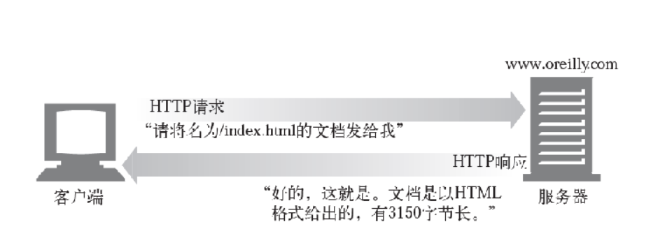

### 通信分层管理

1. 第一层: 应用层 协议: HTTP(web交互协议),DNS(域名解析协议),FTP(文件传输协议)

   > 如: 浏览器

2. 第二层: 传输层 协议: TCP /UDP

   > 相对于应用层提供处于网络连接中的两个计算机的数据传输

3. 第三层: 网络层 IP/HRP*-

   > 处理网络上流动的数据包

4. 链路层

   > 用于处理网络连接中的硬件部分,以太网协议(entenet)

#### 前后端数据交互宏观流程

> 以浏览器发送请求到浏览器接收到请求为例子

**首先:**应用层(浏览器)通过HTTP协议对请求进行封装打包,分类,分组等一系列格式化操作,将数据包传递给网络层

**其次:**传输拿到数据包后通过TCP协议包装并传递给网络层

**再次:**网络层拿到数据包后,通过IP协议识别数据包中的IP地址,通过地址找到相应的计算机

**最后:**链路层将数据包以二进制流的形式发送

服务端接收到数据后按照上面的逆序对数据包进行解析,解析完毕,通过同样的流程响应数据

### get与post请求误区

- GET请求不能提交body主体

  > 可以但是RFS规范不建议get请求携带主题,
  >
  > get用来请求已被URL识别的资源,获取指定地址西资源的方法

- GET没有POST安全

  > 因为get请求的主体也可以设置主体,因此和post请求没有区别
  >
  > 安全与否在于协议和加密手段

- get请求字节限制

  > 在以前的IE有程度限制
  
- get 有缓存,post没有

  > get默认开启缓存,所以地址栏输入的时候会自动提示,而post没有

- get请求和post请求的数据包

  > get请求会发送一个数据包
  >
  > post会发送两个数据包分两次发送第一次响应100,表示继续发送,再发送请求响应200l

### MIME

> MIME(Multipurpose Internet Mail Extension)多用途因特网邮件扩展.
>
> MIME类型是一种文本标记,表示一种主要的对象类型和一个特定的子类型,中间一条横杠表示分隔
>
> 说人话就是:** 用来标记文本的类型**: 如图片文件,音频文件,text文件等

MDN查询地址:https://developer.mozilla.org/zh-CN/docs/Web/HTTP/Basics_of_HTTP/MIME_types/Common_types

```
因特网上有数千种不同的数据类型，HTTP 仔细地给每种要通过Web 传输的对象都打上了名为MIME 类型（MIME type） 的数据格式标签。最初设计MIME（Multipurpose Internet Mail Extension，多用途因特网邮件扩展）是为了解决在不同的电子邮件系统之间搬移报文时存在的问题。MIME 在电子邮件系统中工作得非常好，因此HTTP 也采纳了它，用它来描述并标记多媒体内容。

MIME类型只需了解即可无需记忆
文档: https://developer.mozilla.org/zh-CN/docs/Web/HTTP/Basics_of_HTTP/MIME_types/Complete_list_of_MIME_types
常用MIME类型:
{
  "css": "text/css",
  "gif": "image/gif",
  "html": "text/html",
  "ico": "image/x-icon",
  "jpeg": "image/jpeg",
  "jpg": "image/jpeg",
  "js": "text/javascript",
  "json": "application/json",
  "pdf": "application/pdf",
  "png": "image/png",
  "svg": "image/svg+xml",
  "swf": "application/x-shockwave-flash",
  "tiff": "image/tiff",
  "txt": "text/plain",
  "wav": "audio/x-wav",
  "wma": "audio/x-ms-wma",
  "wmv": "video/x-ms-wmv",
  "xml": "text/xml"
}
```

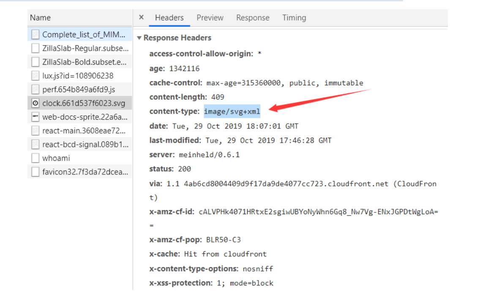

### URI网络地址

> 每个Web服务器资源都有一个名字,称为统一资源表示符(URI Uniform  Resource Identifier),就像因特网上的邮政地址一样,在设计分为内唯一标识定位信息资源

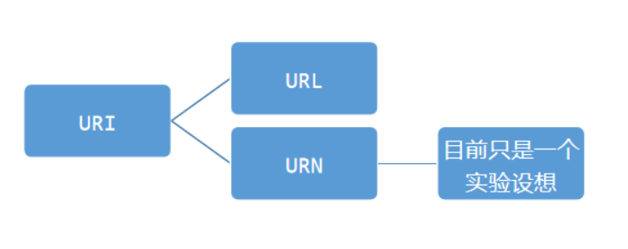

#### URL

> 统一资源定位符,是URI的一种实现,描述了一台特定服务器上某个资源的特定位置

##### 格式

```
大部分URL都遵循一种标准格式,这种格式包含三个部分
1.第一部分被称为方案(scheme),说明访问资源所使用的协议类型,通常就是HTTP协议(http://)\
2.第二部分给出服务器在因特网上的地址(ip) host主机地址
3.其余部分指定Web服务器上的某个资源 资源路径
```

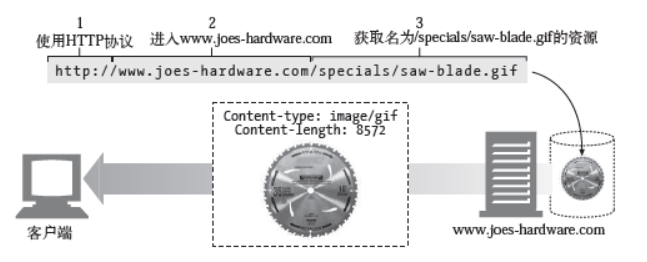

### HTTP请求事务的逻辑

> 一条HTTP事务由一条请求命令和一个响应结果组成,这种通信是通过名为HTTP报文的格式化数据块进行的(就是HTTP报文)

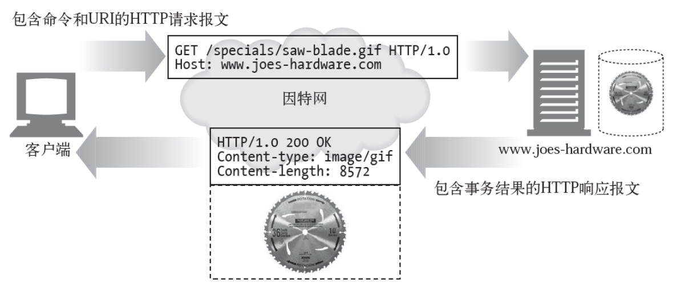

#### HTTP报文

> HTTP报文是由一行行的简单字符组成,HTTP报文是纯文本,不是二进制代码所以人们可以很方便的对其读写
>
> 分为请求报文和响应报文两种 :请求报文,响应报文,根据请求方式不同请求报文有的有报文主体(post)有的没有(get)

##### 报文请求方法

> methed请求方式,最常用的是GET,POST方式,GET只通过请求的参数传递数据,POST通过报文主体传递数据

| 方法    | 描述                                             | 是否包含主体 |
| ------- | ------------------------------------------------ | ------------ |
| GET     | 从服务器获取一份文档                             | 否           |
| POST    | 向服务器发送需要处理的数据                       | 是           |
| HEAD    | 只从服务器获取文档头部                           | 否           |
| PUT     | 将请求的主体部分存储在服务器上                   | 是           |
| TRACE   | 对可能经过代理服务器传送到服务器上的数据进行追踪 | 否           |
| OPTIONS | 决定可以在服务器上执行那些方法                   | 否           |
| DELETE  | 从服务器删除一份文档                             | 否           |

##### 报文结构

> 所有的http报文分为两类:
>
> - 请求报文
> - 响应报文
>
> 两者格式基本相同
>
> 所有的HTTP报文都是一个起始行作为开始,请求报文问说明了要做什么,响应报文说明发生了什么

请求报文格式

```
<methed><request-url><version> //起始行
<header>请求头
<entity-body> 请求主体
```

响应报文格式

```
<version><status><reason-phrase>//起始行
<header> //响应头
<entity-body> //响应主体
```


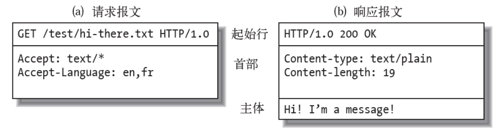

- 起始行

  > 简明扼要的说明请求信息,如资源路径,请求方式,协议以及协议版本,
  >
  > 在请求报文中表示要做什么,在响应报文中说明出现了什么情况

- 首部字段

  > 对资源的详细补充,如资源类型,自身信息,
  >
  > 在起始行后面由0个或者多个首部字段,每个首部字段都包含一个名字和值,以便于解析,以键值对的方式表明,
  >
  > 首部以一个空行表示结束,

- 主体

  > 具体文件,
  >
  > 请求主体中包括要发送给Web服务器的数据
  >
  > 响应主体中装载了要返回给客户端的数据
  >
  > 起始行和首部都是以文本形式结构化的而主体不同,主体中可以包含任意二进制数据(图片,视频,音轨,软件程序,文本等)

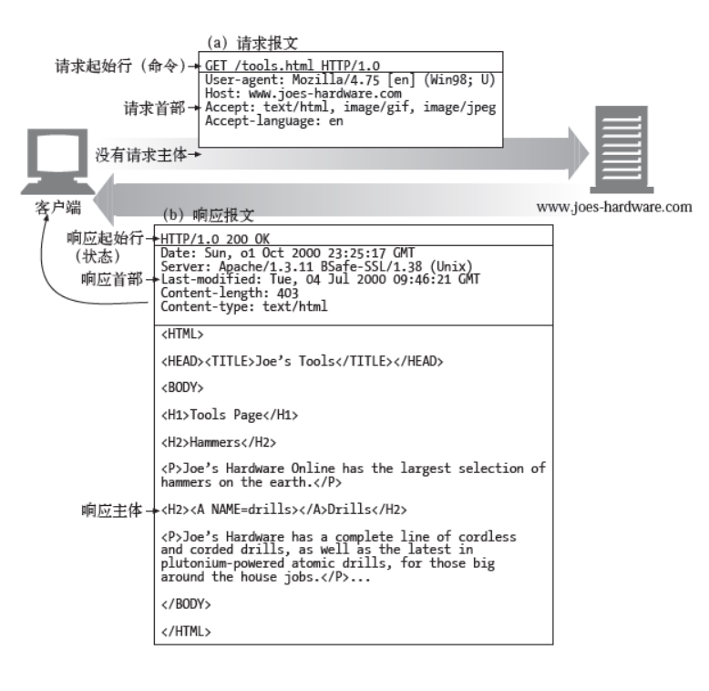

##### 报文解析

> method: 说明请求方法,GET,POST等
>
> request-url: 说明请求的服务器地址,
>
> version: 说明http版本号
>
> status-code:状态码这三位数字描述请求过程中发生的情况,每个状态码的第一位数字描述这次请求的状态(错误,重定向,成功)
>
> header:首部,可以有0个或多个首部,每个首部都包含一个名字后面跟着一个冒号,接着是一个值，最后是一个CRLF。首部是由一个空行（CRLF）结束的，表示了首部列表的结束和实体主体部分的开始。有些HTTP 版本，比如HTTP/1.1，要求有效的请求或响应报文中必须包含特定的首部
>
> entity-body:主体,包含任意由数据组成的模块,并不是所有报文都包含主体部分,有时报文只是以一个CRLF(回车)结束

##### 报文状态码

> 报文状态码描述返回的请求结果

```
状态码分类:
100-199: 表示信息提示
200-299: 表示成功
300-399: 表示资源已被移走,需重定向
400-499: 表示客户端请求出错
500-599: 表示服务端出错
```

常见状态码:

| 状态码 | 原因短语             | 含义                                                     |
| ------ | -------------------- | -------------------------------------------------------- |
| 200    | OK                   | 成功,请求的数据在响应报文主体中                          |
| 204    | No Content           | 响应报文中没有主体内容                                   |
| 301    | 永久性重定向         | 表示资源永久的重定向                                     |
| 302    | 临时重定向           | 表示现在暂时没有资源                                     |
| 303    | 同一资源多个地址     |                                                          |
| 304    | 强制使用缓存         | 请求带有附加条件,但是资源没有符合条件,直接使用客户端缓存 |
| 400    | 改正请求             | 请求语法有错误                                           |
| 401    | Unauthorized(未授权) | 需要用户名和密码                                         |
| 404    | Not Found(未找到)    | 服务器无法找到所请求的资源                               |
| 500    | 服务器错误           | 有BUG,服务器宕机了                                       |
| 503    | 正在维护             | 服务器正在维护或正在超负荷运作                           |

### 首部

> 报文首部字段可以向报文中添加一些附加信息,本质上来说就是一些名/值对的列表,主要分为以下几类:

```
通用首部:
即可以出现在请求报文中,也可以出现在响应报文中
请求首部:
提供更多有关请求的信息,包含字段值只在请求首部中有效
响应首部:
提供更多有关响应的信息,包含的字段值只在请求中有效
实体首部:
描述实体的长度和内容或者资源本身
扩展首部:
规范中没有定义的首部,每个HTTP首部都有一种简单的语法:名字后面跟着冒号,然后跟上可选空格,在跟上字段值,最后是一个回车符
```

#### 通用首部

> 这些首部提供了报文的相关的基本信息

| 首部       | 描述                                              |
| ---------- | ------------------------------------------------- |
| conection  | 允许客户端和服务端指定于请求/响应连接的有关的选项 |
| host       | 给出接收请求的服务器主机地址和端口号              |
| Referer    | 转发地址                                          |
| Date       | 提供日期和时间标志,说明报文是什么时候创建的       |
| Origin     | 请求源地址                                        |
| Via        | 显示报文经过的中间节点                            |
| From       | 提供客户端用户的E-mail地址                        |
| UA-color   | 客户端显示器的显示颜色相关的信息                  |
| UA-os      | 客户端机器操作系统的名称及版本                    |
| UA-CPU     | 客户端cpu的类型和制造商                           |
| User-Agent | 将发起请求的应用程序名称告知服务器                |
| UA-Disp    | 客户端显示器能力相关信息                          |

#### Accept首部

>  告知服务器客户端想要什么和不想要什么

| 首部            | 描述                                         |
| --------------- | -------------------------------------------- |
| Accept          | 告知服务端可以发送什么类型的文件             |
| Accept-encoding | 告知服务器可以发送哪些编码方式的文件如zip... |
| Accept-charset  | 告知服务器能够发送哪些字符集                 |
| Accept-Language | 告知服务端能够发送哪些语言                   |
| TE              | f告诉服务器可以使用哪些扩展传输编码          |

#### 条件首部

> 有时客户端希望为请求加上一些限制,比如如果客户端已经有了一份文档副本,就希望只在服务器上的文档于客户端缓存副本不同时再传输这个文档,通过条件请求首部,客户端就可以为请求加上这中限制,要求服务器再对请求进行响应之前,确保某个条件为真

| 首部                  | 描述                                                      |
| --------------------- | --------------------------------------------------------- |
| Expect                | 允许客户端列出某个请求所要求的服务器行为                  |
| If-Match              | 如果实体标记与文档当前实体标记相匹配,就获取这份文档       |
| **If-Modified-Since** | 除非在某个指定的日期之后资源被修改过,否则就限制这个请求   |
| If-None-Match         | 如果提供的尸体标记与当前文档的实体标记不符,就获取文档     |
| If-Range              | 允许对文档的某个范围进行条件请求                          |
| If-Unmodified-Since   | 除非在某个指定日期之后资源没有被修改过,否则就限制这个请求 |
| Range                 | 如果服务器支持范围请求,就请求资源的指定范围               |

#### 认证首部

> HTTP本身就支持一种简单的机制,可以对请求进行质询和响应认证,这种机制要求客户端在获取特定的资源之前,先对自身进行认证,这样就可以使事务稍微安全一些

| 首部          | 描述                                                         |
| ------------- | ------------------------------------------------------------ |
| Authorization | 包含客户端提供给服务器,以便对齐自身进行认证数的据            |
| Cookie        | 客户端用它向服务器传送一个令牌,他并不是正真的安全首部,但确实隐含了安全功能 |
| Cookie2       | 用来说明请求端的支持的我cookie版本                           |

#### 内容首部Content

> 提供一些关于实体内容的有关信息,由实体内容的报文设置才有效

| 首部             | 描述                                                    |
| ---------------- | ------------------------------------------------------- |
| Content-Base     | 解析主体中的相对URL时使用的基础URL                      |
| Content-Encoding | 对主体执行的任意编码方式                                |
| Content-Language | 理解主体时最适宜使用的语言                              |
| content-length   | 主体中内容总长度                                        |
| Conyent-Location | 资源实际所处位置                                        |
| Content-type     | 内容格式如表单默认是: application/x-www-from-urlencoded |
| Conntent-Range   | 整个资源中此主体表示的字节范围                          |

##### Content-Type

> 规定主体内容的数据类型,一般设置请求头(包含主体的请求如post)或者响应头都需要设置,其他取值详见上述MIME

| 取值                              | 描述                                                         |
| --------------------------------- | ------------------------------------------------------------ |
| application/x-www-form-urlencoded | form表单默认编码格式,表示以"key=value&key1=value1"格式传递数据 |
| multipart/form-data               | form表单中带有文件时,使用这种格式表示表单中带有文件,以文件流的方式 |
| text/plain                        | text,基础文本                                                |
| application/json                  | 表明这是JSON格式的数据                                       |

### 端口

> 端口两种含义: 
>
> 物理含义: 接口插口,
>
> 逻辑端口:一般指TCP/IP协议中的端口,端口号范围是0-65535,比如用于浏览网页服务的80端口,用于FTP的21端口

#### 按照端口范围分类

> cmd查询本机端口使用情况:
>
> `NetStat -a`

1. 公认端口

   > 公认端口包括端口号范围是0-1023,它们紧密绑定于一些服务。通常，这些端口的通信明确表明了某种服务的协议，比如 80 端口分配给 HTTP 服务，21 端口分配给FTP 服务等。

2. 注册端口

   > 注册端口,端口号为1024-49151,它们松散地绑定于一些服务。也就是说，有许多服务绑定于这些端口，这些端口同样用于许多其他目的，比如许多系统处理动态端口从 1024 左右开始。

3. 动态和私有端口

   > 动态和/或私有端口的端口号为 49 152～65 535。理论上，不应为服务分配这些端口。但是一些木马和病毒就比较喜欢这样的端口，因为这些端口不易引起人们的注意，从而很容易屏蔽。

| 端口号    | 服务                  |
| --------- | --------------------- |
| 21        | FTP 文件传输服务      |
| 23        | Tenlet 远程登录       |
| 25        | SMTP 简单邮件         |
| 53        | DNS 域名解析服务      |
| 80        | HTTP 超文本传输协议   |
| 110       | POP3 邮件             |
| 161       | SNMP 简单网络管理协议 |
| 135       | RPC  远程过程调用     |
| 139/445   | NetBIOS               |
| 1521/1526 | ORACLE 数据库         |
| 3306      | MySQL 数据库          |
| 3389      | MSSQL 数据库          |
| 8080      | www代理服务 网页浏览  |

## HTTP模块

> HTTP全称是超文本传输协议,构建在TCP之上,属于应用层协议

### 创建HTTP服务

```
let server = http.createServer(function(resquest,response)_{
	接收到请求后执行回调
	request.on('data',(chunk)=>{
		监听数据传输,以流的方式传输,chunk是一个Buffer
	})
	request.on('end',(err)=>{
		监听数据传输完毕,与上述data事件是一对,必须有
	})
})
回调参数:
request: 客户端请求对象,包含一些客户端信息和内置方法
response: 服务器响应对象,包含响应信息和内置方法
```

### 启动HTTP服务

```
server.listen(port[,host[,backlog[,callback]]])
参数:
port:监听端口号
host:监听的地址
backlog: 指定位于等待队列中的客户端连接数
```

### 关闭HTTP服务

```
server.close()
server.on('colse',callback)//监听服务的关闭
```

### 监听服务器错误

```
server.on('error',(e)=>{
if(e.code == 'EADDRINUSE'){
console.log("端口号已经被占用")
}
})
```

### 监听客户端连接

```
let server = http.createServer(function(req,res){
});
server.on('connection',function(){
    console.log(客户端连接已经建立);
});

```

### 设置超时连接

```
server.setTimeout(msecs,callback);
server.on('timeout',function(){
    console.log('连接已经超时');
});
```

### request对象

> request对象包含了很多客户端请求的信息

#### 属性

##### method

> 请求的方法

##### url

> 请求的URL路径

##### headers

> 请求的请求头对象

##### httpVersion

> 客户端的http版本

##### socket

> 监听客户端请求的socket对象

### response对象

> 通过response对像我们可以设置响应的数据,响应头等

#### 方法和事件 

##### writeHead

> 设置响应头,包括: 内容类型,状态码等

- content-type: 内容类型
- location:将客户端重定向到另外一个URL地址
- content-length: 服务器响应内容的字节数
- set-cookie: 在客户端创建Cookie
- content-encoding: 指定服务器响应内容的编码方式
- cache-cache: 开启缓存机制
- expires:用于只当缓存过期时间
- etag:指定当服务器响应内容没有变化下重新加载数据

```
response.writeHead(statusCode,[reasonPhrase],[headers]);
```

##### header

> 设置获取删除header

```
response.setHeader('Content-Type','text/html;charset=utf-8');
response.getHeader('Content-Type');
response.removeHeader('Content-Type');
response.headersSent 判断响应头是否已经发送返回boolean值
```

##### sendDate

> 不发送Daye

```
res.sendDate = false;
```

##### write/end

> 可以使用write方法发送响应的内容,
>
> **注意**:响应表单时,先在响应头中指定响应数据的MIMEl类型

```
response.write(chunk,[encoding]);
response.end([chunk],[encoding]);

```

##### timeout

> 设置响应时间,若指定时间没有响应,则触发timeout事件

```
response.setTimeout(msecs,[callback]);
response.on('timeout',callback);
```

##### close

> 在响应方法end被调用之前,如果连接中断,触发res对象的close事件

```
response.on('close',callback);
```

##### parser

> 获取地址信息

```
Url {
  protocol: 'http:',
  slashes: true,
  auth: null,
  host: 'www.baidu.com',
  port: null,
  hostname: 'www.baidu.com',
  hash: null,
  search: null,
  query: null,
  pathname: '/',
  path: '/',
  href: 'http://www.baidu.com/' }
```

## 前后端数据交互

### 表单提交

> 主要是表单提交的注意事项,包括有文件或没有文件两种情况

```
基础示例:
<form action="http://localhost:3000/upload" method="post" enctype="multipart/form-data">
    <input type="file" name="img">
    <input type="text" name="user">
    <input type="submit">
 </form>
```

#### form标签的属性

##### action

> 表单提交地址在`form`标签的`action`属性中设置,注意: 必须写上协议,后面跟上host地址,端口号以及请求路径

##### method

> 设置表单的提交方式,有`get(默认值)`和`post`两种
>
> 区别: get: 请求的内容会以查询的方式拼接到url上,并且是明文,标签属性enctype取默认即可
>
> ​		post: 请求的内容在请求主体中,以流的方式发送到后端,node监听`data`事件接收Buffer,enctype属性取下述第二个
>
> ​					且文件的内容较大,不能拼接到url中,直接放进报文主体

##### enctype

> 规定在发送表单之前如何对表单内容进行编码,取值:
>
> 就是设置请求头中的Content-type属性的值,get没有报文主体所以没有Content-type属性

##### name

>   规定表单的名称

##### target

>   规定在何处打开action的url,与a连接的target属性一样

#### FormData()对象

> FormData对象用于将数据编译成键值对,以便于`XMLHyypRequest`来发送数据,其主要用于发送表单数据也可以独立于表单使用
>
> 使用fromData不需要设置`Content-Type`请求头,浏览器会自动将文件头添加到`Content-Type`中

MDN:https://developer.mozilla.org/zh-CN/docs/Web/API/FormData/Using_FormData_Objects 其他方法查询MDN即可

##### 创建FormData对象

```
let form = new FormData()
form.append("key","value") //值为数字会立即转换成字符串
form.append("key2","value2")// 可多次向form实例添加数据
form.append("userfile", fileInputElement.files[0])//添加文件
 之后将form发送给后端处理即可
```

##### 通过表单直接创建FormData对象

> 仅对设置了`name`属性的form对象有效

```
var formElement = document.querySelector("form");
....
request.send(new FormData(formElement));
```

#### Node处理表单数据

> 根据请求方式不同,分为两种处理方式,get,post

##### get请求

> 当表单中没有文件时,使用get请求

###### 获取表单内容

> get请求表单数据以查询的方式连接在url中,操作步骤:
>
> 1. 使用URL.parse(),将url转换为对象,
> 2. 使用querystring模块的parse方法将上述对象中query属性转换成对象

##### post请求

> 当表单中有文件时,使用post请求

###### 获取表单内容

> 使用第三方模块`multiparty`,

```
示例:
let form = new multiparty.Form({
      uploadDir:"./data"
    })
form.parse(req,function(err,fields,file){})
//先实例化Form对象,参数是配置项; uploadDir:上传的文件,上传后存储位置
//通过form实例对表单进行操作
参数:
req:请求request对象
callback: fields: 除文件外其他表单字段,file上传的文件信息
```

> 也可以通过监听`data`事件来获取流数据

### Ajax

> 在用表单提交数据时,若后端代码执行阻塞,就会导致前端页面一直卡顿,用户什么都不能做只能等待,很不友好,
>
> Ajax的出现可以使页面异步刷新,不需要重载,用户发送请求后不用等待服务器响应,可以继续做别的事情,不会造成卡顿

#### XMLHttpRequest

> XMLHttpRequest对象用于与服务器交互,简称XHR,通过XMLHttpRequest可以在不刷新页面的情况下请求特定的URL,获取数据,这允许网页在不影响用户操作的情况下,更新页面的布局内容

```
使用示例:
let xhr = new XMLHttpRequest() //实例化xhr对象
xhr.open(method,url,Boolean) //开始准备发送请求,参数:method: 请求方式,url:请求地址,Boolean: 默认true表示以异步的方式请求数据,false使用同步方式
xhr.setRequestHeader('Content-Type':'applaction/json;chartset=utf8') //设置请求头,只能在open和send之间
xhr.onreadystatechange = function(){监视xhr状态的改变,下面会详细讲
	if(xhr.readyState === XMLHttpRequest.DONE && xhr.status === 200) {
        console.log(xhr.responseText)
      }
}

xhr.send('格式化后的数据') //发送请求
```

#### 传送数据的要求

> 根据请求头`Content-Type`的值不同所发送的数据格式也不同
>
> 当设置的值为汉字的时候需要通过`encodeURIComPonent()`转换成URI编码,因为HTTP协议无法转换非ASCII编码的数据,会出现乱码

| Content-Type值                      | 对应send的数据格式          |
| ----------------------------------- | --------------------------- |
| 'text/plain;chartset=utf8'          | "key=value&key1=value1"     |
| 'applicaltion/json;chartset=utf8    | "{key: value,key1: value1}" |
| 'application/x-www-form-urlencoded' | form表单                    |
| 浏览器自动添加                      | 文件                        |

##### 为什么不能传递对象等其他格式

> 在数据通讯时,http协议是不能正常解析某种语言的某个数据结构的(每种语言都有自己的数据格式)只能解析通用的数据类型,如字符串和数字,当使用对象传递数据时若不转换成JSON字符串格式,http内部会自动转换,使用`toString()`方法转换成`[object object]`字符串,

#### 属性

##### readyState

> 只读,返回一个无符号整型的数字(0-4),代表xhr代理当前所处的状态,:

| 值   | 状态             | 描述                                               |
| ---- | ---------------- | -------------------------------------------------- |
| 0    | UNSENT           | 代理被创建,但尚未调用open()方法                    |
| 1    | OPENED           | open()方法已经调用                                 |
| 2    | HEADERS_RECEIVED | send()方法已经调用,并且头部和状态已经获得认可      |
| 3    | LOADING          | 下载中: responseText属性已经包含部分数据           |
| 4    | DONE             | 下载操作完成,只有当状态为4的时候响应数据才时完整的 |

##### response

> 只读,返回一个`ArrayBuffer,Blob,Document,DOMstring`,具体值取决于`XMLHttpRequest.responseType`的值,其中包含响应的整个实体,

##### responseText

> 返回一个`DOMstring`,该DOMstring包含对请求的响应,如果请求未发送成功或尚未发送,则返回`null`

##### responeType

> 一个定义响应类型的枚举值,预先设置响应内容类型

- `""`

  `responseType` 为空字符串时，采用默认类型 [`DOMString`](https://developer.mozilla.org/zh-CN/docs/Web/API/DOMString)，与设置为 `text` 相同。

- `arraybuffer`

  [`response`](https://developer.mozilla.org/zh-CN/docs/Web/API/XMLHttpRequest/response) 是一个包含二进制数据的 JavaScript [`ArrayBuffer`](https://developer.mozilla.org/zh-CN/docs/Web/JavaScript/Reference/Global_Objects/ArrayBuffer)。

- `blob`

  `response` 是一个包含二进制数据的 [`Blob`](https://developer.mozilla.org/zh-CN/docs/Web/API/Blob) 对象 。

- `document`

  `response` 是一个 [HTML](https://developer.mozilla.org/zh-CN/docs/Glossary/HTML) [`Document`](https://developer.mozilla.org/zh-CN/docs/Web/API/Document) 或 [XML](https://developer.mozilla.org/zh-CN/docs/Glossary/XML) [`XMLDocument`](https://developer.mozilla.org/zh-CN/docs/Web/API/XMLDocument)，这取决于接收到的数据的 MIME 类型。请参阅 [XMLHttpRequest 中的 HTML](https://developer.mozilla.org/zh-CN/docs/Web/API/XMLHttpRequest/HTML_in_XMLHttpRequest) 以了解使用 XHR 获取 HTML 内容的更多信息。

- `json`

  `response` 是一个 JavaScript 对象。这个对象是通过将接收到的数据类型视为 [JSON](https://developer.mozilla.org/zh-CN/docs/Glossary/JSON) 解析得到的。

- `text`

  `response` 是一个以 [`DOMString`](https://developer.mozilla.org/zh-CN/docs/Web/API/DOMString) 对象表示的文本。

- `ms-stream` 

  `response` 是下载流的一部分；此响应类型仅允许下载请求，并且仅受 Internet Explorer 支持。

##### status

> 只读,服务端响应状态码,具体含义查看HTTP章节,请求状态码小节

##### statusText

> 返回一个 [`DOMString`](https://developer.mozilla.org/zh-CN/docs/Web/API/DOMString)，其中包含 HTTP 服务器返回的响应状态。与 [`XMLHTTPRequest.status`](https://developer.mozilla.org/zh-CN/docs/Web/API/XMLHTTPRequest/status) 不同的是，它包含完整的响应状态文本（例如，"`200 OK`"）。**注意：**根据 HTTP/2 规范（[8.1.2.4](https://http2.github.io/http2-spec/#rfc.section.8.1.2.4) [Response Pseudo-Header Fields](https://http2.github.io/http2-spec/#HttpResponse)，响应伪标头字段），HTTP/2 没有定义任何用于携带 HTTP/1.1 状态行中包含的版本（version）或者原因短语（reason phrase）的方法。

##### timeout

> 可写,一个无符号长整型（`unsigned long`）数字，表示该请求的最大请求时间（毫秒），若超出该时间，请求会自动终止。

##### withCredentials

> 一个[`布尔值`](https://developer.mozilla.org/zh-CN/docs/Web/API/Boolean)，用来指定跨域 `Access-Control` 请求是否应当带有授权信息，如 cookie 或授权 header 头。
>
>  属性是一个[`Boolean`](https://developer.mozilla.org/zh-CN/docs/Web/JavaScript/Reference/Boolean)类型，它指示了是否该使用类似cookies,authorization headers(头部授权)或者TLS客户端证书这一类资格证书来创建一个跨站点访问控制（cross-site `Access-Control`）请求。在同一个站点下使用`withCredentials属性是无效的。`
>
> `此外，这个指示`也会被用做`响应中`cookies 被忽视的标示。默认值是false。
>
> 如果在发送来自其他域的XMLHttpRequest请求之前，未设置`withCredentials` 为true，那么就不能为它自己的域设置cookie值。而通过设置`withCredentials` 为true获得的第三方cookies，将会依旧享受同源策略，因此不能被通过[document.cookie](https://developer.mozilla.org/en-US/docs/Web/API/Document/cookie)或者从头部相应请求的脚本等访问。

#### Ajax携带cookie(重点)

> CORS跨域默认不发送Cookie和HTTP认证信息,如果要把Cookie发送到服务器一方面要服务器同意(请求头设置Access-Control-Allow-Credentials设置为true),另一方面开发者需要在Ajax中开启`withCredentials`属性
>
> 以form标签发送的请求,浏览器会自动设置cookie,而通过Ajax发送的请求无法自动设置cookie, 需要手动配置

##### 服务端

###### Access-Control-Allow-Credentials属性

> 响应报头指示的请求的响应是否可以暴露于该页面。当true值返回时它可以被暴露。
>
>  凭证是 Cookie ，授权标头或 TLS 客户端证书。
>
>  当作为对预检请求的响应的一部分使用时，它指示是否可以使用凭证进行实际请求。请注意，简单的GET请求不是预检的，所以如果请求使用凭证的资源，如果此资源不与资源一起返回，浏览器将忽略该响应，并且不会返回到 Web 内容。

###### SameSite属性

> Chrome51开始,浏览器的cookie新增了一个SameSite属性,用来限制第三方获取cookie,主要用来防止CSRF(恶意网站设法伪造带有正确Cookie的HTTP请求)攻击,有以下三个取值:

- Strict

  > 严格,完全禁止第三方获取cookie,跨站点的时候都不会发送cookie,只有当前网页的URL与请求目标一致才会带上cookie

- Lax

  > 默认值,大多数下禁止获取cookie

  | 请求类型 | 示例                               | 正常情况   | Lax        |
  | -------- | ---------------------------------- | ---------- | ---------- |
  | 链接     | <a href="..."></a>                 | 发送cookie | 发送cookie |
  | 预加载   | <link rel="prerender" href="..."/> | 发送cookie | 发送cookie |
  | GET表单  | <form method="GET" action="...">   | 发送cookie | 发送cookie |
  | POST表单 | <form method="POST" action="...">  | 发送cookie | 不发送     |
  | iframe   | <iframe src="..."></iframe>        | 发送cookie | 不发送     |
  | AJAX     | $.get("...")                       | 发送cookie | 不发送     |
  | Image    |                     | 发送cookie | 不发送     |

- None

  > 没有限制,**但必须同时设置`Secure`属性才可以,**当协议不是https是在客户端是看不到的,但是都无端可以设置,客户端也可以携带

```
res.setHeader('Access-Control-Allow-Credentials',true) //设置改请求头后,允许在客户端设置cookie
必须设置响应头的该属性为true
```

##### 客户端

```
xhr.withCredentials = true
必须设置改属性为true
```

##### 注意

需要注意的是，如果要发送Cookie，`Access-Control-Allow-Origin`就不能设为星号(可以使用orgin来代替当前发送请求的客户端)，必须指定明确的、与请求网页一致的域名。*同时，Cookie依然遵循同源政策，只有用服务器域名设置的Cookie才会上传，其他域名的Cookie并不会上传，且（跨源）原网页代码中的`document.cookie`也无法读取服务器域名下的Cookie。

### Ajax封装

> 要求: 传入一个参数,{method,url,reqData,responseType,con,success,error},{请求方式,请求路径,携带数据,预设响应数据类型,请求数据类型,去请求成功的回调,请求失败的回调}
>
> 封装思路:
>
> 根据请求方式的不同,携带参数的方式不同,
>
> - get: repData要转换成query,拼接到url上然后send的数据置为null即可
> - post: 根据请求数据类型`content-type`不同,对reqData的处理也不同
>   - 传文件`不需要指定Content-Type类型`:直接send
>   - 传json`applicaltion/json;charset=utf8`,将reqData,JSON字符串化后send
>   - 传表单数据`application/x-www-form-urlencoded取默认值`拼接成querystring然后send
>   - 传文本`text/plain;charset=utf8`直接send
> - 需要携带cookie: 将xhr.withCredentials设置为true,表示允许携带cookie,且允许服务端设置cookie
> - 设置自定义响应头: 根据传入的对象,循环设置,可以通过响应头向后端传递信息

```js
/*
使用示例:
myAjax({
  method: "post",
  url: "http://localhost:3000/",
  reqData: form,
  con: "file",
  dataType: "json",
  withCredentials: true,
  timeout: 1000,
  reqHeaders: {
    "sa-mm":"自定义请求头",
    "sa-nn":"自定义请求头"
  }
  success: function (data) {
    console.log(data)
  },
  error: function (data) {
    console.log(data)
  }
})
*/
/**
   * @message:  封装Ajax
   * @param {*} method 请求方式
   * @param {*} url 求情地址
   * @param {Object} reqData 请求参数
   * @param {String} con 请求主体类型,根据reqdata类型不同取值为: form表达数据,jsonJSON字符串,file文件,text文本
   * @param {String} dataType 预设响应数据类型: JSON,Buffer,Blob,text
   * @param {Boolean} withCredentials 是否允许服务器设置cookie,或者说是否语序浏览器发送cookie
   * @param {Number} timeout 设置响应超时时间,ms为单位
   * @param {Object} reqHeaders 设置自定义响应头
   * @param {Function} success 成功响应的回调
   * @param {Function} error 失败响应的回调
   * @return {*} 挂载到window对象的_myAjax上
   * @since: 2022-07-21 19:21:58
   */  
(function (win) {
  function myAjax({ method, url, reqData, con, dataType,withCredentials=false,timeout=1000, reqHeaders, success, error }) {
    if(dataType === "jsonp"){
      createJsonp({url,data,success})
      return false
    }
    const conMap = {
      json: 'applicaltion/json;chartset=utf8',
      text: 'text/plain;chartset=utf8',
      form: 'application/x-www-form-urlencoded',
    };
    method = method.toUpperCase();
    if (method === 'GET') {
      url = url + '?' + objToQueryStr(reqData);
      reqData = null;
    }
    if (con === 'json') {
      reqData = JSON.stringify(reqData);
    }
    if (con === 'form') {
      reqData = objToQueryStr(reqData);
    }
    // 判断IE8及以下
    let xhr = new XMLHttpRequest();
    if(!-[-1,]){
      console.log('ppp')
      xhr = new window.ActiveXObject("Microsoft.XMLHTTP")
    }
    
    
    if (dataType) {
      xhr.responseType = dataType;
    }
    xhr.open(method, url, true);
    if (con !== 'file') {
      xhr.setRequestHeader('Content-Type', conMap[con]);
    }
    // 是否允许携带cookie,服务端响应头对应的:res.setHeader('Access-Control-Allow-Credentials', "true") //设置改请求头后,允许在客户端设置cookie,才可以配合相互传递cookie
    xhr.withCredentials = withCredentials
    // 设置自定义请求头,服务端需要允许设置这些请求头
    Object.entries(reqHeaders).forEach(([key,value])=>{
      xhr.setRequestHeader(key,value)
    })
    //timeout 值单位 ms
    if (timeout !== 0) {
      let time = setTimeout(function () {
        //中断请求
        xhr.abort()
        clearTimeout(time)
      }, timeout)
    }
    xhr.onreadystatechange = function () {
      if (xhr.status >= 200 && xhr.status <= 299 && xhr.readyState === 4) {
        let resData = xhr.response;
        if (xhr.responseType === 'json' && isJSON(resData)) {
          resData = JSON.parse(resData);
        }
        success(resData);
      }
    };
    xhr.onerror = function (err) {
      error(err);
    };
    xhr.send(reqData);
  }
  /* 封装:
     want:1.动态创建script,以及回调函数,用完就删除掉
          2.参数传一个对象,对象包含host地址,data请求参数,获取数据回调,
      createJsonp({
        url: http://localhost:3000/,
        data:{
          user: ,
          pwq:
        },
        success: function(data){
          console.log(data)
        }
      })
    */
      function createJsonp({url,data,success}){
        let callbackName  = `fn${new Date().valueOf()}`
        let script = document.createElement("script")
        script.src = url + '?' + objToQueryStr(data) + `&callback=${callbackName}`
        window[callbackName] = function(resdata){
          if(isJSON(resdata)){
            resdata = JSON.parse(resdata)
          }
          success(resdata)
          script.remove()
          delete window[callbackName]
        }
        document.querySelector("head").append(script)
       }

  /**
   * @message: 将对象格式化为query字符串
   * @param {对象} dataObj
   * @return {String} query字符串
   * @since: 2022-07-18 00:39:40
   */
  function objToQueryStr(dataObj) {
    if (Object.entries(dataObj).length === 0) {
      return '';
    }
    return Object.entries(dataObj)
      .map(([key, value]) => {
        return `${key}=${value}`;
      })
      .join('&');
  }
  /**
   * @message: 验证字符串是否是JSON数据
   * @param {String} json
   * @return {Boolean} true : 是,false : 不是
   * @since: 2022-07-18 00:41:23
   */
  function isJSON(json) {
    try {
      JSON.parse(json);
      return true;
    } catch (err) {
      return false;
    }
  }
  win['_myAjax'] = myAjax
})(window);
```

### 数据交互的方式

> 包括:
>
> 1.  前端发送JSON数据
> 2. 前端AJAX发送form表单带文件
> 3. Node接收JSON数据并响应
> 4. Node接收文件
> 5. Node响应流数据,前端如何显示

#### 前后端互传JSON数据

```js
<script>
    let xhr = new XMLHttpRequest()
    let datastring = JSON.stringify({"name":"liaofei"})
    xhr.open("POST","http://localhost:3000/json") 
    //设置请求头
    xhr.setRequestHeader("Content-Type","application/json;charset=utf8")
    xhr.onreadystatechange = function(){
      if(xhr.status === 200 && xhr.readyState === 4){
        if(isJSON(xhr.responseText)){
          console.log(xhr.responseText)
        }else {
          console.log("响应数据非JSON")
        }
      }
    }
    xhr.send(datastring)
    /**
     * @message: 利用try catch检查数据是否是json格式
     * @param {JSONstring} json
     * @return {Boolean} true 表示是,false表示否
     * @since: 2022-07-17 10:37:41
     */    
    function isJSON(json){
      try{
        JSON.parse(json)
        return true
      }catch(err){
        return false
      }
    }
  </script>
node:
let method = req.method
  let pathname = URL.parse(req.url).pathname
  let contentType = req.headers["content-type"]
  // 设置CORS跨域
  res.setHeader("Access-Control-Allow-Origin","*") //设置允许跨域的域名,*号表示允许任何域名跨域访问
  res.setHeader("Access-Control-Allow-Headers","X-request-with,Authorization,token,content-type") //设置允许设置的header中出现的属性
  res.setHeader("Access-Control-Allow-Methods","PUT,POST,GET,DELETE,OPTIONS,PATCH") //设置跨域允许的请求方式
  res.setHeader("Access-Control-Max-Age",1728000) //设置预验请求有效时间,这里设置为20天,表示20天内不需要验证,就可以访问
  res.writeHeader(200,{"Content-Type":"application/json;charset=utf8"})
  if(method === "OPTIONS"){
    console.log("这是预检查请求");
    res.end()
    return false
  }
  if(method !== "POST"){
    res.end("只接受GET请求")
    return false
  }
  if(pathname !== "/json"){
    res.end("只接受json路由")
    return false
  }
  if(contentMap(contentType) !== "json"){
    res.end("直接受json数据")
    return false
  }
  req.on("data",function(chunk){
    console.log(chunk.toString("utf8"))
    res.end(JSON.stringify({'name':'hahha'})) //响应数据
  })
  req.on("end",function(err){
    if(err){
      throw err
    }
    console.log("参数接收完成")
  })
```

#### 前后端互传文件

> 前端上传文件借用`FormData对象`,后端接收文件通过`multiparty`模块
>
> 后端响应文件,直接以流的方式响应,前端预设置响应为Blob,之后通过Blob,创建一临时url地址

```js
前端传文件:
<body>
  用户名:<input type="text" name="user" id="user">
  <input type="file" name="file" id="input">
  <button>提交</button>
  <script>
    let oUser = document.querySelector("#user")
    let oFile = document.querySelector("#input")
    let oBtn = document.querySelector("button")
    oBtn.addEventListener("click",function(){
      console.log('ppp')
      if(oFile.files.length < 0){
        console.log("未选择文件")
        return false
      }
      console.log(oFile.files[0])
      let form = new FormData()
      form.append("user",oUser.value)
      form.append("file",oFile.files[0])
      let xhr = new XMLHttpRequest()
      xhr.open("POST", "http://localhost:3000/form", true)
      xhr.onreadystatechange = function () {
        if (xhr.status === 200 && xhr.readyState === 4) {
          console.log(xhr.responseText)
        }
      }
      xhr.send(form)
    })
  </script>
</body>
前端接收文件
<body>
  文件名:<input type="text" name="pic" id="pic" value="bg-md.jpg">
  <button>提交</button>
  
  <script>
    let oPic = document.querySelector("#pic")
    let oBtn = document.querySelector("button")
    let oImg = document.querySelector("img")
    oBtn.addEventListener("click",function(){
      let xhr = new XMLHttpRequest()
      let data = JSON.stringify({filename: oPic.value})
      xhr.open("POST", "http://localhost:3001/stream", true)
        //预设响应为一个Blob对象
      xhr.responseType = "blob" //预设响应值为Blob对象
      xhr.setRequestHeader("Content-Type","application/json;chartset=utf8")
      xhr.onreadystatechange = function () {
        if (xhr.status === 200 && xhr.readyState === 4) {
          // 创建图片Blob链接
          let src = URL.createObjectURL(xhr.response)
          oImg.src = src
        }
        
      }
      xhr.send(JSON.stringify({filename: oPic.value}))
    })
  </script>
</body>
后端接收文件:
...开启同源策略,等之后使用multioarty模块接收文件
let form = new multiparty.Form({
    uploadDir:"./upload"
  })
  form.parse(req,function(err,fields,file){
    if(err){
      throw err
    }
    console.log(fields,file)
    res.end("文件上传成功!")
    return false
  })
....
后端返回文件:
 res.writeHeader(200,{"Content-Type":"image/jpeg"}) //设置响应文件类型
req.on("data",function(chunk){
    let dirPath = path.join(__dirname,'upload',JSON.parse(chunk.toString("utf8")).filename)
    fs.readFile(dirPath,function(err,data){
      if(err){
        throw err
      }
      res.end(data)//直接将文件流返回
    })
  })
  req.on("end",function(err){
    if(err){
      throw err
    }
    console.log("参数接收完成")
  })
```

### try catch

> try cath用来抛出错误,在js中程序运行错误的时候会终止此程序运行,又是我们不需要终止程序运行,可以使用try cath捕获错误

```
使用方式:
try {
 代码
 return true
}cach (err){
	return false
}
//若程序运行错误,会执行cach中的语句,可以通过判断返回值来判断程序是否运行出错
```


## 同源策略(跨域)

> 在以前网页中存在一个很严重的安全问题:
>
> 假如玩我们正在玩一款游戏,那么坏人就可以通过链接点击的方式让用户登录模拟的假游戏登陆界面,从而盗取用户的账号和密码,
>
> 为了防止这种问题的出现,浏览器使用同源策略来进行限制,
>
> **目前所有浏览器都支持这个政策**, 前端页面发起的请求如果想要正常的访问服务器,必须遵守同源策略

### 内容

> 同源的意思是指三个相同:
>
> - 协议相同
> - 域名相同
> - 端口号相同
>
> 目的: 为了保护用户信息的安全,防止恶意网站窃取数据

### 限制范围

> 随着互联网的发展,`同源策略`越来越严格,目前,如果非同源共受三种行为的限制

- Cookie操作,LocalStorage和IndexDB无法读取
- DOM无法获得
- AJAX请求无法发送

### 解决方案

> 虽然这些限制是必要的,但是有时候很不方便,合理的请求方式也受到了影响
>
> 下面讲解两种解决跨域的方案,这两种方案都需要服务端处理

#### CORS跨域处理

> CORS需要浏览器和服务器的共同支持,只要服务器实现了CORS接口就可以实现跨源通信,
>
> 浏览器将CORS请求分为两中请求:**简单请求**(主要针对from表单)和**非简单请求**
>
> **注意CORS请求默认不设置cookie**,:
>
> ​	服务器指定了`Access-Control-Allow-Credentials: true`
>
> ​	请求中设置: `xhr.withCredentials: true`
>
> ​	服务器中`Access-Control-Allow-Origin`不能设置为*号

##### 简单请求

> 主要针对form表单请求,只要满足以下条件就是简单请求,简单请求可以直接发送

- 请求方法是以下方法
  - POST
  - GET
  - HEAD
- HTTP头信息不超出以下字段
  - Accept
  - Accept-Language
  - Content-Language
  - Last-Event-ID
  - Content-Type:只限于三个值:`applicaltion/x-www-form-urlencoded`,`multipart/form-data`,`text/plain`

凡是不满足上面两种条件的就是非简单请求

###### 简单请求请求流程

对于简单请求，浏览器直接发出CORS请求。具体来说，就是在头信息之中，增加一个`Origin`字段。

下面是一个例子，浏览器发现这次跨源AJAX请求是简单请求，就自动在头信息之中，添加一个`Origin`字段。

> ```http
> GET /cors HTTP/1.1
> Origin: http://api.bob.com
> Host: api.alice.com
> Accept-Language: en-US
> Connection: keep-alive
> User-Agent: Mozilla/5.0...
> ```

上面的头信息中，`Origin`字段用来说明，本次请求来自哪个源（协议 + 域名 + 端口）。服务器根据这个值，决定是否同意这次请求。

如果`Origin`指定的源，不在许可范围内，服务器会返回一个正常的HTTP回应。浏览器发现，这个回应的头信息没有包含`Access-Control-Allow-Origin`字段（详见下文），就知道出错了，从而抛出一个错误，被`XMLHttpRequest`的`onerror`回调函数捕获。注意，这种错误无法通过状态码识别，因为HTTP回应的状态码有可能是200。

如果`Origin`指定的域名在许可范围内，服务器返回的响应，会多出几个头信息字段。

> ```http
> Access-Control-Allow-Origin: http://api.bob.com
> Access-Control-Allow-Credentials: true
> Access-Control-Expose-Headers: FooBar
> Content-Type: text/html; charset=utf-8
> ```

上面的头信息之中，有三个与CORS请求相关的字段，都以`Access-Control-`开头。

**（1）Access-Control-Allow-Origin**

该字段是必须的。它的值要么是请求时`Origin`字段的值，要么是一个`*`，表示接受任意域名的请求。

**（2）Access-Control-Allow-Credentials**

该字段可选。它的值是一个布尔值，表示是否允许发送Cookie。默认情况下，Cookie不包括在CORS请求之中。设为`true`，即表示服务器明确许可，Cookie可以包含在请求中，一起发给服务器。这个值也只能设为`true`，如果服务器不要浏览器发送Cookie，删除该字段即可。

**（3）Access-Control-Expose-Headers**

该字段可选。CORS请求时，`XMLHttpRequest`对象的`getResponseHeader()`方法只能拿到6个基本字段：`Cache-Control`、`Content-Language`、`Content-Type`、`Expires`、`Last-Modified`、`Pragma`。如果想拿到其他字段，就必须在`Access-Control-Expose-Headers`里面指定。上面的例子指定，`getResponseHeader('FooBar')`可以返回`FooBar`字段的值。

 **withCredentials 属性**

上面说到，CORS请求默认不发送Cookie和HTTP认证信息。如果要把Cookie发到服务器，一方面要服务器同意，指定`Access-Control-Allow-Credentials`字段。

> ```http
> Access-Control-Allow-Credentials: true
> ```

另一方面，开发者必须在AJAX请求中打开`withCredentials`属性。

> ```javascript
> var xhr = new XMLHttpRequest();
> xhr.withCredentials = true;
> ```

否则，即使服务器同意发送Cookie，浏览器也不会发送。或者，服务器要求设置Cookie，浏览器也不会处理。

但是，如果省略`withCredentials`设置，有的浏览器还是会一起发送Cookie。这时，可以显式关闭`withCredentials`。

> ```javascript
> xhr.withCredentials = false;
> ```

需要注意的是，如果要发送Cookie，`Access-Control-Allow-Origin`就不能设为星号，必须指定明确的、与请求网页一致的域名。同时，Cookie依然遵循同源政策，只有用服务器域名设置的Cookie才会上传，其他域名的Cookie并不会上传，且（跨源）原网页代码中的`document.cookie`也无法读取服务器域名下的Cookie。

##### 非简单请求

> 不满足以上条件的都是非简单请求,非简单请求的CORS请求会在正式通信之前,增加HTTP查询请求,叫做预检请求,主要目的是:
>
> 浏览器先问服务器,当前网页所在的域名是否在服务器许可名单中,以及可以使用哪些HTTP动词和头部字段,只有得到肯定的回答浏览器才会正式发出`XMLHttpRequest`请求,否则直接报错

###### 预检

> 当浏览器发现请求时非简单请求的时候会自动发起一个预检请求,预检查请求的HTTP头部信息如下:
>
> ```
> OPTIONS /cors HTTP/1.1
> Origin: http://api.bob.com
> Access-Control-Request-Method: PUT
> Access-Control-Request-Headers: X-Custom-Header
> Host: api.alice.com
> Accept-Language: en-US
> Connection: keep-alive
> User-Agent: Mozilla/5.0...
> ```
>
> 预检请求的请方式是**OPTIONS**,表示这个请求是用来询问的,头信息里面关键字段是`Origin`表示请求的是哪个源,
>
> 后端可以判断请求方式来判断是否是预检请求

###### 服务端设置允许跨域

> 主要包含以下字段:

```
res.setHeader("Access-Control-Allow-Origin","*") //设置允许跨域的域名,*号表示允许任何域名跨域访问
res.setHeader("Access-Control-Allow-Headers","X-request-with,Authorization,token,content-type") //设置允许设置的header中出现的属性
res.setHeader("Access-Control-Allow-Methods","PUT,POST,GET,DELETE,OPTIONS,PATCH") //设置跨域允许的请求方式
res.setHeader("Access-Control-Max-Age",1728000) //设置预验请求有效时间,这里设置为20天,表示20天内不需要验证,就可以访问
```

#### JSONP跨域处理

> 平常开发网页的时候如果要使用外部的js,css等资源我们会直接将资源链接放进一个`script`标签中,就可以请求到相应的资源,那么这时我们会发现,无论请求的资源链接时候是否遵循`同源策略`都可以请求到文件,jsonp就是利用这个特性来实现跨域请求的.

##### 原理

> 实际上使用`script`标签请求外部资源的时候,也会触发同源策略,只是同源策略不会完全限制该请求.并且`script`标签请求会来的数据会直接放进`script`标签中执行
>
> 同源策略的小漏洞:
>
> - 不可以跨域使用js脚本进行数据请求,
> - 但是可以通过资源引入的方式引入和客户端页面不同源的资源文件,

##### 具体机制

- 浏览器的同源策略无法完全限制`img`,`script`,`link`的资源请求
- 对于服务器而言一个资源请求就是一个`GET`请求
- 前端准备好接收数据的回调函数,将回调函数名以`queryStr`的方式拼接到url上,并传递给后端
- 后端拿到回调函数名后,将数据和回调函数拼接成`callback(data)`形式,响应给前端,便于前端执行
- 前端拿到响应的字符串后,会当作js脚本直接自动执行,那么响应的数据就传递到准备好的回调函数中

##### 封装

> **注意回调函数的名字应该与后端开发人员协商好**,

```
前端:
<body>
  用户名:<input type="text" name="user" class="user" value="admin">
  密码:<input type="password" name="pwq" class="pwq" value="12345">
  <button>提交</button>
  <script>
    const oBtn = document.querySelector("button")
    const oUser = document.querySelector(".user")
    const oPwq = document.querySelector(".pwq")
    oBtn.onclick = function(){
      createJsonp({
        url: "http://localhost:3000/",
        data:{
          name: oUser.value,
          pwq: oPwq.value 
        },
        success: function(resdata){
          console.log("jsonp跨域获取的数据",resdata)
        }
      })
    }
    /* 封装:
     want:1.动态创建script,以及回调函数,用完就删除掉
          2.参数传一个对象,对象包含host地址,data请求参数,获取数据回调,
      createJsonp({
        url: http://localhost:3000/,
        data:{
          user: ,
          pwq:
        },
        success: function(data){
          console.log(data)
        }
      })
    */
   function createJsonp({url,data,success}){
    let callbackName  = `fn${new Date().valueOf()}`
    let script = document.createElement("script")
    script.src = url + '?' + objToQueryStr(data) + `&callback=${callbackName}`
    window[callbackName] = function(resdata){
      if(isJSON(resdata)){
        resdata = JSON.parse(resdata)
      }
      success(resdata)
      script.remove()
      delete window[callbackName]
    }
    document.querySelector("head").append(script)
   }
   /**
    * @message: 将对象格式化为query字符串
    * @param {对象} dataObj
    * @return {String} query字符串
    * @since: 2022-07-18 00:39:40
    */   
   function objToQueryStr(dataObj){
    if(Object.entries(dataObj).length === 0){
      return ''
    }
    return Object.entries(dataObj).map(([key,value])=>{
      return `${key}=${value}`
    }).join("&")
   }
   /**
    * @message: 验证字符串是否是JSON数据
    * @param {String} json
    * @return {Boolean} true : 是,false : 不是
    * @since: 2022-07-18 00:41:23
    */   
   function isJSON(json){
    try {
      JSON.parse(json)
      return true
    } catch(err){
      return false
    }
   }
  </script>
</body>
后端:
const {http,path,URL,querystring,multiparty} = require('../require.js')
let server = http.createServer(function(req,res){
  let data = querystring.parse(URL.parse(req.url).query)
  res.setHeader("Content-Type","text/plain;charset=utrf8")
  let resData = {
    name: 'hahah',
    pwq: '12345'
  }
  console.log(data)
  res.end(`window['${data.callback}'](${JSON.stringify(resData)})`) //注意回调函数的名称作为query值.其键名要与前端商量好
})
server.listen(3000,function(){
  console.log("jspon runing 3000") 
})
```

## Cookie验证

> 这里是js中的cookie扩展,在前后端数据通信中cookie的应用

### 什么是cookie

> 结合js笔记中cookie的特点进行补充:
>
> **cookie是一个请求首部,其中包含先前由服务器通过`Set-Cookie`首部设置并存储在客户端的cookie值**
>
> 就是说cookie服务端和浏览器端都可以进行设置

### cookie验证机制

> 这里主要实现一定时间内用户免验证登录的功能,因为HTTP是无连接的,请求结束后就中断连接,为了使客户端和服务端建立长久的联系,可以采用cookie的方式,来判断用户是否登录过, 

- 当浏览器访问服务器的时候,服务器会响应一个带有cookie标识(通常叫token)的响应头
- 浏览器通过响应头将该cookie设置到cookie中存储起来
- 下次再访问该服务器时,浏览器在请求的上行报文中携带这个cookie
- 服务器接收到后,验证cookie说明这个用户已经登录过了,不需要再登录

### 服务端设置和获取cookie

#### 设置

```
res.setHeader("Set-Cookie","token=随机字符;Expires=${date.toUTCString()};HttpOnly")
//设置值,过期时间,不允许js修改和访问
```

#### 获取

```
let cookie = req.header.cookie //获取请求头中的cooike,是一个键值对字符串,键值对用;分隔
querystring.parse(cookie,";")
```

### cookie属性

> 使用`;`分隔每个属性

#### name

> 键值对的key

#### value

> 键值对的value

#### Domain

> 可以访问该`cookie`的域名,如果设置为`.google.com`则所有以`google.com`结尾的域名都可以访问该`cookie`,第一个字符必须是`.`

#### path

> 指定可可以访问`cookie`的目录,例如`userId=30;patn=/shop`就表示当前cookie只能在`shop`目录下使用

#### Expires/Max-Age

> 指定过期时间,其中`GMT_String`是以`GMT`格式表示的时间,超过这个时间cookie就会无效

#### HttpOnly

> 如果一个cookie出现这个属性,那么不允许`js脚本访问和设置该cookie`,主要是防止`xss攻击`,由微软对`cookie`z做的扩张
>
> 如果没有设置该属性,那么该cookie验证可以随意的被js脚本读取和设置,换言之任何人只要知道你cookie对应的网站都可以登录你的账户,毫无安全性可言
>
> xss攻击: 页面嵌入恶意代码,当用户访问该页面时,js代码会盗取用户的cookie信息,或者替用户发一些请求,设置了HttpOnly就可以防止cookie信息被盗取

#### Secure

> 该cookie是否仅被使用安全协议传输,安全协议有`HTTP`,`SSL`等,在网络上传输数据之前先将数据加密,默认为`false`

#### SameSite

> 用来防止CSRF攻击和用户追踪 

### Ajax的cookie验证

> 详情在前后端数据交互的Aiax部分,

## 预存懒加载

### 常见加载方式

- 分段加载

  > 每x条数据为一段,一段一段的加载

- 按需加载

  > 用户需要往后浏览数据,再加载的方式比如: 懒加载

- 预先加载

  > 首屏加载数据=>用户触发事件=>请求下一段数据(同时显示loding让用户等待)=>加载完成进行渲染..... 

- 缓存加载

  > 首屏加载数据-> 渲染-> 渲染完成加载下一段数据->放入缓存-> 用户触发事件-> 从缓存加载数据-> 渲染完毕-> 请求后一段数据-> 放入缓存.....

### 缓存懒加载瀑布流的实现

> 瀑布流思路: 每次都找高度最短的列,再他的后面放元素,就会形成全压交错的排列
>
> 本例子思路:
>
> 1. 渲染函数:
>    1. 分列: 根据窗口计算卡片列数
>    2. 分组: 根据列数,初始化两个位置数组:`colHeightArr`存放每一列的高度,`rewLeftArr`存放每一列距离窗口左边的距离
>    3. createDiv函数:
>       1. 创建卡片容器div,将模板引擎渲染好的字符串添加进去
>       2. 将div添加到页面上
>       3. 监听图片加载完成,设置定时器,找出`colHeightArr`中最短的一列下标,将div的l`left`和`top`设置成数组对应值,由于DOM渲染是异步的,因此在定时器中设置高度,否则敢赌设置好了,元素还没渲染好,导致渲染不上
> 2. 根据数据递归调用createDiv,使用递归的原因: 同样是因为DOM渲染是异步的,使用循环的话,循环一瞬间就结束了,此时第一个可能还没有渲染好
> 3. 懒加载
>    1. 获取滚动高度和窗口高度,求出其与最后一个卡片在文档中的高度的差值
>    2. 若差值小于一定值,说明将要滚动到末尾了,开始加载下一段数据
> 4. 预存
>    1. 第一次加载时,在获取数据的函数中放入一个回调函数,将响应数据放入`cache属性中`,同时执行回调函数,这里的回调函数用来坐渲染
>    2. 当递归渲染完成时,加载下一段数据放入缓存
>    3. 懒加载触发时直接从缓存中读取数据

```js
const oWarp = document.querySelector(".warp")
    class Lazyloading {
      constructor({ oWarp, address = "http://127.0.0.1:3000/dbmovie", width = 200, space = 20}) {
        this.oWarp = oWarp
        this.address = address
        this.width = width //卡片宽度
        this.space = 20 //列间距
        this.colHeightArr = [] //每列的高度
        this.rowWidthArr = [] //每列电影卡片的距离左边的位置
        this.start = 0 //下次请求的起始位置
        this.lastItem = null //最后一个元素
        this.lock = false //锁
        this.count = 20 //数据长度
        this.cache = null //缓存
        this.init()
      }
      /**
       * @method:初始化列数,记录每一列的高度,开启懒加载
       * @since: 2022-07-23 12:16:29
       */      
      init () {
        let column = ~~(window.innerWidth / (this.width + this.space))
        let bothSidesSpace = (window.innerWidth - this.width*column - this.space * (column-1))/2
        // 初始化高度数组,记录每一列的当前高度
        // 初始化横向宽度数组,记录每一列距离左边的宽度
        for (let i = 0; i < column; i++) {
          this.colHeightArr.push(0)
          this.rowWidthArr.push((this.width + this.space) * i + bothSidesSpace)
        }
        this.LazyLoad()
        this.getData(() => {
          this.render(this.cache)
        })
      }
      /**
       * @method: 根据数据递归创建item,等待图片加载完成后根据位置数组设置位置,并更新位置数组高度数据,递归结束缓存下一组数据
       * @param {Array} 电影数据
       * @since: 2022-07-23 12:17:56
       */      
      render (data) {
        let length = data.length
        this.lock = false
        let index = 0
        let recur = () => {
          let temStr = template("temp", { data:Lazyloading.format(data[index])})
          let item = document.createElement("div")
          item.classList.add("item")
          item.innerHTML = temStr
          // 查找最矮的列的下标
          let minColIdx = this.colHeightArr.indexOf(Math.min(...this.colHeightArr))
          let timer
          oWarp.append(item) //先添加,后移动位置,就有发牌的效果
          item.querySelector("img").onload = () => {
            clearTimeout(timer)
            timer = setTimeout(() => {
              item.style.top = this.colHeightArr[minColIdx] + "px"
              item.style.left = this.rowWidthArr[minColIdx] + "px"
              this.colHeightArr[minColIdx] += item.offsetHeight + 2 * this.space
              index++
              index === length && (this.lastItem = item,this.lock = true,this.getData())
              index < length && recur()
            }, 30)
          }
        }
        recur()
      }
      /**
       * @method: 获取数据,存入缓存,回调函数用来执行首次渲染
       * @param {*} callback
       * @since: 2022-07-23 12:20:26
       */      
      getData (callback) {
        axios.post(this.address,{
          start: this.start,
          count: 20
        }).then(res => {
          this.cache = res.data
          this.start += 20
          callback && callback()
        }).catch(err => {
          console.log(err)
        })
      }
      /**
       * @method:当用户将页面滚动到最后一个电影图片100px左右的高度时,从缓存中加载下一组数据 
       * @since: 2022-07-23 12:22:10
       */      
      LazyLoad(){
        window.addEventListener("scroll",()=>{
          let surplusHeight = this.lastItem.offsetTop-  (document.bodyscrollTop || document.documentElement.scrollTop) - window.innerHeight
          if(surplusHeight < -100 && this.lock){
            this.render(this.cache)
          }
        })
      }
      /**
       * @static: 提取数据,将需要的属性提取出来 
       * @param {Object} data
       * @return {Object} 提取后的数据
       * @since: 2022-07-23 12:23:45
       */      
      static format (data) {
        return {
          layer: data.images.layer,
          year: data.year,
          originalTitle: data.original_title,
          title: data.title,
          average: data.rating.average
        }
      }
    }
    new Lazyloading({ oWarp: oWarp})
```

## 浏览器文件缓存机制

> 浏览器请求资源后,为提升用户体验节省请求响应时间,会将资源文件缓存在本地,下次请求只用对比资源文件是否修改,来决定是重新请求资源还是直接从缓存加载资源

#### 流程

- 第一次请求资源: 服务器响应200,并返回资源文件
- 第二次请求该资源:携带上本地缓存资源的修改时间,与服务器中资源文件的修改时间
  - 若修改时间小于服务器资源文件修改文件,则重新返回文件
  - 若修改时间等于服务器资源文件最新修改时间,则返回304重定向,告诉浏览器资源为改变从缓存中获取

## 子进程

> Node.js是以单线程的模式运行的,但是它使用的是事件驱动来处理并发,这样有助于我们在多核CPU上创建多个子进程,从而提高性能
>
> 每个子进程总是带有三个流对象,c`hild.stdin, child.stdout 和child.stderr`,他们可能会共享父进程的stdio流,或者也可以是独立的被倒流的流对象
>
> 创建子线程的方式有一下几种: 这里只讲述exec,其他将来讲述

### exec()

> 使用子进程执行shell,cmd命令,缓存子进程的输出,并经子进程的输出以回调函数参数形式返回.

```
const { exec } = require('child_process')
exec(command[,option,]callback)
参数:
command: 字符串,将要运行的命令,参数使用空格隔开
option: 对象:可以是
	cwd ，字符串，子进程的当前工作目录
    env，对象 环境变量键值对
    encoding ，字符串，字符编码（默认： 'utf8'）
    shell ，字符串，将要执行命令的 Shell（默认: 在 UNIX 中为/bin/sh， 在 Windows 中为cmd.exe， Shell 应当能识别 -c开关            在 UNIX 中，或 /s /c 在 Windows 中。 在Windows 中，命令行解析应当能兼容cmd.exe）
    timeout，数字，超时时间（默认： 0）
    maxBuffer，数字， 在 stdout 或 stderr 中允许存在的最大缓冲（二进制），如果超出那么子进程将会被杀死 （默认: 200*1024）
    killSignal ，字符串，结束信号（默认：'SIGTERM'）
    uid，数字，设置用户进程的 ID
    gid，数字，设置进程组的 ID
callback():回调函数包含三个参数`err,stdout,stderr`

实例:
const fs = require('fs');
const child_process = require('child_process');
 
for(var i=0; i<3; i++) {
    var workerProcess = child_process.exec('node support.js '+i, function (error, stdout, stderr) {
        if (error) {
            console.log(error.stack);
            console.log('Error code: '+error.code);
            console.log('Signal received: '+error.signal);
        }
        console.log('stdout: ' + stdout);
        console.log('stderr: ' + stderr);
    });
 
    workerProcess.on('exit', function (code) {
        console.log('子进程已退出，退出码 '+code);
    });
}
输出:
$ node master.js 
子进程已退出，退出码 0
stdout: 进程 1 执行。

stderr: 
子进程已退出，退出码 0
stdout: 进程 0 执行。

stderr: 
子进程已退出，退出码 0
stdout: 进程 2 执行。

stderr: 
```


# express框架

>  express与node类似于jquery与javascript,该框架并没有对node已有的特性进行二次抽象,只是对底层接口进行封装.不仅如此Expree的扩展性也很强

## 使用

**官网地址**: https://www.expressjs.com.cn/starter/installing.html

**安装**:`npm i express -D`本地安装即可

## 使用脚手架初始化项目

### 安装脚手架(cli)

``` js
$ npm i express-generator -g
创建项目:
$ express 项目名称  一切都是默认
或者 
$ express --view=hbs 项目名 指定项目所用的模板引擎
运行项目:
$ node ./bin/www  //看`package.json`文件中的script中查找
```

> 主要做的事情:
>
> 1. 帮我们创建一个项目文件夹,(以运行命令的文件夹为根目录)
> 2. 将默认的`pachage.json`写进去(因此需要手动`npm i`一下)
> 3. 资源文件夹,路由文件夹等等,

### 目录解释

- bin: 一般放置初始化运行脚本或者文件,在这里放的是入口文件
- public: 静态资源文件夹
- routers: 路由文件夹,建议每个路由都写成一个文件单独处理
- view: 模板文件,页面存放的地方
- app.js: 主要文件

## request常用属性和方法

> express中的req对象是原生req对象的增强版

### baseUrl

> 请求资源路径,pathname

```
app.use("/user/get",function(req,res,next){
	console.log(req.baseUrl) //打印user
})
```

### path

> 返回请求中路径部分

```
// example.com/users?sort=desc
console.dir(req.path)
// => '/users'
```

### body

> post请求的请求主体,需要使用中间件来解析

### params

> 模糊匹配的二级路由,返回一个对象,params中存放匹配结果

```
请求: /user/get or /user/name
服务端: 
app.use("/user/:自定义名称",function(req,res,next){
	console.log(req.params) //{"自定义名称":"get"}or {"自定义名称":"name"}
})
```

### cookies

> 获取客户端携带的cookie,需要使用中间件`Cookie-parse`,返回一个对象

```
// Cookie: name=tj
console.dir(req.cookies.name)
// => 'tj'
```

### hostname

> 请求主机名称

```
// Host: "example.com:3000"
console.dir(req.hostname)
// => 'example.com'
```

### query

> get请求的参数解析成JSON对象

### get()

> 获取请求头中指定属性值

```
req.get("content-type")
```

## response常用属性和方法

### senFile

> sendFile((filePath[,option[,fn]]))
>
> 直接响应文件,会自动根据文件类型设置响应头`content-type`属性

```
参数:
filepath:文件路径,必须是绝对路径
```

### json

> res.json(Obj)
>
> 返回一个json对象

### send

> 动态根据send参数设置响应头并响应

### jsonp

> 自动将参数和jsonp跨域传递的回调函数名拼接好并返回

```
请求: /user?callback=foo
响应: ews.jsonp({p:1})
客户端接收: typeof foo && foo({"p":"1"})
```

### sendFile()

> 响应文件

```
res.sendFile('path',[option].[fn])参数:
	path: 文件地址,绝对路径
	option: 
		maxAhe: 文件缓存过期最大时间,单位ms,当文件缓存时间超过时,不管服务器文件有没有缓存都重新请求
		root: 配置文件的root地址,一般直接在第一个参数中写好的绝对路径
	fn: 响应完成后的回调

```

### render()

> 使用模板引擎渲染页面并响应渲染好的字符串

```
res.render(view,[local],callback)参数:
view: 模板文件名称
local: 模板使用的数据对象
		其中有一个"layout"属性可以指定layout文件
		layout: 自定义layout文件名称
callback: 渲染完成的回调


自己使用时需要设置两个变量`views`和`view engine`,以下是express cli中配置好的,可以参考
app.set("views",path.join(__dirname,"views"))
app.set("view engine","hbs")
express中的解析流程:
1,首先通过模板文件名称,结合view engine变量设别模板文件类型
2,通过views变量获取模板文件夹所在目录
3,读取模板文件内容
4,hbs模块渲染模板,并返回渲染好的模板字符串
5,内部使用send响应上述字符串
6,若模板文件夹存在layout.hbs文件,那么渲染好的字符串会作为layout的body变量传递给layout.hbs之后返回layout页面
```


### append()

> 向响应头中添加信息

```
append("key": "value")
```

## 中间件

> 中间件是一个函数,它可以访问请求对象,响应对象和web应用中处于请求-响应循环流程中的next的变量

```
const express = require('express');
const app = express();

const fn = (req, res, next) => {
  console.log("hello,world");
};
app.use(fn) //这里的fn就是一个中间件,使用app.use()就是运行这个这个中间件
const port = 3000;
app.listen(port,() => {
    console.log(`应用运行在${port}端口`);
})
```

由上面的示例可以看出,当我们访问该服务器的时候会执行函数中的代码,这**fn就是中间件**

### 功能

```
const express = require('express');
const app = express();
// 第一个中间件
app.use((req, res, next) => {
  console.log("中间件1");
  next();// 如果没有next则会被挂起,不再执行后面的中间件
})
// 第二个中间件
app.use((req, res, next) => {
  console.log("中间件2");   //继续执行第二个中间件
  next();
})
// 第三个中间件
app.use((req, res, next) => {
  console.log("中间件3");
  res.send('hello');       // 终结请求-响应循环
})
// 第四个中间件
app.use((req, res, next) => {
  console.log("中间件4");   // 终结后的中间件不再执行
});
const port = 3000;
app.listen(port,() => {
    console.log(`应用运行在${port}端口`);
})

访问后输出结果为:
中间件1,中间件2,中间件3
```

> 看上述结果可知:
>
> - 在没有终结`请求-响应循环(send)`之前,使用next()会依次执行后面的中间件
> - 没有next(),只会执行当前中间件,执行完毕若没有`send`程序挂起
> - 终结`请求-响应循环`后之后的中间件不在执行

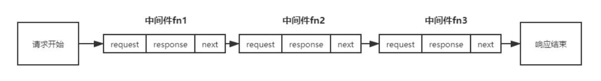

从上面的编程模型可以看出**中间件**就是插入在**请求开始到响应结束中间**的东西,这也是中间件名字的由来

### 中间件分类

#### 应用级中间件

> **没有直接用来处理路由请求的中间件**,通常使用`app.use(fn)`来调用

#### 路由级中间件

> 通过`app.get`,`app.post`,`app.put`,`app.delete`以及use调用中间件时传入路径参数等等,**用来处理路径的中间件叫做路由及中间件**

#### 错误处理中间件

> 类似应用级中间件,但是中间件的第一个参数是err

```js
app.use(function(req,res,next){
	next(err)
})
app.use(function(err,req,res,next){
    res.end(err)
})
```

Node中有一个专门处理错误的类:`let err = nre Error("错误信息")`实例化后有两个属性,分别是`stack,message``stack`表示错误的追踪信息,哪里出错,`message`表示错误的具体信息

### 中间件next()时代码执行顺序

> 洋葱模型:针穿过洋葱时接触到的层级先后顺序,
>
> 上一个中间件中调用下一个中间件next()时,相当于将下一个中间件拿到next()位置执行,当next()后没有中间件时,开始回返,执行刚才没有执行的代码

```js
app.use(function(req,res,next){
    console.log("1")
    next()
    console.log("2")
})
app.use(function(req,res,next){
    console.log("3")
    next()
    console.log("4")
})
app.use(function(req,res,next){
    console.log("5")
    next()
    console.log("6")
})
app.use(function(req,res,next){
    console.log("7")
    console.log("8")
})
//打印顺序:
1,3,5,7,8,6,4,2
```

### 文件处理中间件multer

> 安装引入后使用步骤分为以下三步:

1. 生成storage: 预先设定文件存储位置和文件名

   ```
   let storage = multer.diskStorage(destinationl(req,file,cd){},filename(req,file,cd){})
   参数: 一个用来预设文件路径,以用来预设文件名
   destination(req,file,cd) //根据req,file提供的信息动态声明文件存储路径
   参数: req: request对象
   	 file: 上传的文件对象,包含文件信息,如文件名,等
   	 cd(this,文件路径): this=> 指定this指向,一般置为null,文件路径:文件存储路径
   filename(req,file.cd)
   参数:与上方参数相同
        cd(this,文件名): 文件名: 预先设置的文件名
   ```

2. 实例化`multer`中间件

   ```
   let upload = multer({storage}) //将上方设置好的storage放入
   ```

3. 监听文件上传的接口

   ```
   app.use('路由',upload.single("name"),后续中间件)
   upload.single("name"): 就是上方设置好的中间件,name参数表示上传文件的form表单名,或者输入框的name属性
   ```

### get和set

```js
app.set("key","value")//向express中设置值
app.get("key")//向express中获取指定值
```

### enable和disable

```
app.enable("key")//将key的值设置为true
app.disable("key")//将key的值设置为false
```

### configure()

> 区分不同的环境,进行不同的配置

```js
app.configure(function(){
    app.set("all","所有环境的值")
}) //用于所有环境
app.configure("development",function(){
    app.set("dev","环境是开发环境时,才设置值")
}) //用户开发环境
```

### param()

> 当监听到路由符合时,会在use之前调用

```js
app.use("/user/:name".function(){
        console.log("1")
})
app.param("name".function(){
     console.log("2")
})
//上述代码表示: 当监听到路由模糊匹配到符合条件时,会先执行param中的函数
因此打印: 2之后打印1
```

### Router

> router,可以看作是express的子应用,app对象所具有的功能基本都可以使用,包括router.all()类似于app.all()

```
const express = require("express")
const router = express.Router()

router.get("路由",function(req,res,next){
	do something
})
module.exports = router
主文件:
引入路由后:
app.use("path",router),//使用router
如果提供path参数,router中的路由就是过滤掉path路由后的二级或者三级路由
```

### 内置中间件

#### json(option)

> `express.json(option)`,处理请求中json数据格式的请求内容,以对象形式挂载到`req.body`中

```
参数属性:
limit: 设置最大请求主体大小,默认1000kb
infate: boolean 启用或者禁用处理压缩后的请求,请求被拒绝,默认false,一般采取默认值
strict: Boolean 启用或者禁用只接受数组和对象,禁用时将接受JSON.parse接收的任何内容,默认为true
type: 指定中间件用于解析的contype,默认为`application/json`,
```

#### urlencoded(options)

> `express.urlencoded()`,用于处理contype为`x-www-form-urlencoded`类型的请求参数并且解析后挂载到`req.body`上\

```
参数属性:
extended: boolean,设定解析库,true: qs解析库,false: 默认查询字符串库
inflate: 启用或禁用处理压缩后的请求,请求被拒绝,默认true
limit: 设置最大请求主体大小,默认1000kb
parameterLimitL: 该选项控制URL编码数据中允许的最大参数数量。如果请求包含的参数多于此值，则会引发错误。 Number 1000\
type: 指定中间件用于解析的contype,默认为`application/x-www-form-urlencoded`,
```

#### static(root,option)

> `express.static(root,option)`处理静态资源请求,根据`req.url`和`root`来查询文件,如果查询不到不返回`404`,而是调用下一个中间件(next()),允许堆叠和回退

```
参数:
root: 静态资源文件夹路径,绝对路径
option:
	dotfiles:确定如何处理以“.”开头的文件或目录 默认ignore
	etag: 启用或禁用etag生成,默认true
	extensions: 如果找不到文件，会搜索具有指定扩展名的文件并返回找到的第一个文件，例如：'html'，'htm'。默认false
	fallthrough:让客户端错误作为未处理的请求发生，否则转发客户端错误。请参阅下面的下文。 默认: true
	index: 设置目录的index文件,默认index.html
	redirect: 当路径名称是目录时，重定向到尾随“/”。默认true
	
	dotfiles
    此选项的可能值为：
    - “allow” - 没有针对dotfiles的特殊处理。
    - “deny” - 拒绝一个点文件的请求，回应403，然后调用next()。
    - “ignore” - 像dotfile不存在一样，使用404，然后调用next()。 注意：使用默认值，它不会忽略以点开头的目录中的文件。

    fallthrough
    如果选择此选项true，客户端错误的请求或对不存在的文件的请求将导致中间件调用next()进入下一个中间件。
    如果为false，则会调用这些错误（即使是404）next(err)。
    设置此选项为true，以便您可以将多个物理目录映射到相同的Web地址或路径以填充不存在的文件（多个static组合）。
    如果您已经将该中间件安装在严格意义上为单个文件系统目录的路径中，则可以使用false路径，从而可以短接404s以减少压力。这个中间件     也会回复所有的方法。
```

### 第三方中间件

#### http-errors

> 错误处理中间件,封装了不同状态码对应的错误信息

```
用法:
const httpError = require("http-errors")
当发生错误时:
let err = httpError("错误状态码或者其他错误参数")
next(err)//将错误传递给错误中间件进行处理
app.use(function(err,req,res,next)=>{
	res.status(err.status)
	res.send(err.message)
})
其中的err包含根据传递的参数封装的对应信息
```

#### morgan

> 接管日志,可以配合fs写入流,将日志写入文件

```
使用: 
const morgan = require("morgan")
app.use(morgan('short')) // 参数: 日志格式,最常用的是combined/short,前者是详细格式,后者是简短
配合fs stream流写入文件
let logStream = fs.createWirteStream(path.join(process.cwd(),'日志文件路径'),{flages:"a"})
app.use("short",{stream : logStream})
```

#### cors

> 跨域中间件

```js
使用: 
const cors = require("cors")
app.use(cors({
    "origin": "*", //为true时表示设置为req.headers.origin
    "methed": "GET,HEAD.....",//允许的请求方式
    "credentials":true, //是否携带cookie
    "marAge": 172800,//设置预检有效时间
    "preflightContinue": false,//是否通过next()传递预检请求
    "optionssuccessStatus": 200
}))
//上述是常用配置
```

#### cookie-parser

> 解析请求头中携带的cookie,以键值对的方式放在`req.cookie`中,

```
使用:
const cookieParse = require("cookie-parser")
app.use(cookirParse())//之后在req.cookie中就可以拿到cookie的值了
```


## 模板引擎

> 这里使用的模板引擎为handlebars,地址为: https://handlebarsjs.com/zh/guide/#%E4%BB%80%E4%B9%88%E6%98%AF-handlebars
>
> 配合`res.render()`响应,用法详见`response常用属性和方法章节`

### 语法

> 这里只介绍循环,判断,其他语法看文档

#### 循环

```js
{{#each list}}
循环数组:{{this}}当前项{{@index}}下标
循环对象: {{@key}}: {{this}}
循环中使用外部变量: ../msg,./表示当前'作用域'下,../表示上层'作用域'
{{/each}}
```

#### 判断

```
{{#if 变量}}
//变量可以是@first 与循环配合使用第一个是true,其他为false,@last表示最后一个为true
{{/if}}
```

## 交互通信安全

> 前后端分离的开发方式,我们以接口为标准来进行业务推动,数据的安全性非常重要,稍有不慎就会被不法分子盗用,这种接口对于爬虫工程师而言抓取数据轻而易举,

### 如何保证交互通信数据的安全性

1. 通信使用https

   > https协议将报文加密

2. 请求签名,防止参数被篡改

3. 身份确认机制,每次请求都要验证是否合法

4. 对所有请求和响应都进行加密解密操作

### Confidentiality 保密

#### MD5和SHA1

MD5是一种常用的哈希算法，用于给任意数据一个“签名”。这个签名通常用一个十六进制的字符串表示：

```
const crypto = require('crypto');

const hash = crypto.createHash('md5');

// 可任意多次调用update():
hash.update('Hello, world!');
hash.update('Hello, nodejs!');

console.log(hash.digest('hex')); // 7e1977739c748beac0c0fd14fd26a544
```

`update()`方法默认字符串编码为`UTF-8`，也可以传入Buffer。

如果要计算SHA1，只需要把`'md5'`改成`'sha1'`，就可以得到SHA1的结果`1f32b9c9932c02227819a4151feed43e131aca40`。

还可以使用更安全的`sha256`和`sha512`。

#### AES对称加密

AES是一种常用的对称加密算法，加解密都用同一个密钥。crypto模块提供了AES支持，但是需要自己封装好函数，便于使用：

```
const crypto = require('crypto');

function aesEncrypt(data, key) {
    const cipher = crypto.createCipher('aes192', key);
    var crypted = cipher.update(data, 'utf8', 'hex');
    crypted += cipher.final('hex');
    return crypted;
}

function aesDecrypt(encrypted, key) {
    const decipher = crypto.createDecipher('aes192', key);
    var decrypted = decipher.update(encrypted, 'hex', 'utf8');
    decrypted += decipher.final('utf8');
    return decrypted;
}

var data = 'Hello, this is a secret message!';
var key = 'Password!';
var encrypted = aesEncrypt(data, key);
var decrypted = aesDecrypt(encrypted, key);

console.log('Plain text: ' + data);
console.log('Encrypted text: ' + encrypted);
console.log('Decrypted text: ' + decrypted);
```

运行结果如下：

```
Plain text: Hello, this is a secret message!
Encrypted text: 8a944d97bdabc157a5b7a40cb180e7...
Decrypted text: Hello, this is a secret message!
```

可以看出，加密后的字符串通过解密又得到了原始内容。

注意到AES有很多不同的算法，如`aes192`，`aes-128-ecb`，`aes-256-cbc`等，AES除了密钥外还可以指定IV（Initial Vector），不同的系统只要IV不同，用相同的密钥加密相同的数据得到的加密结果也是不同的。加密结果通常有两种表示方法：hex和base64，这些功能Nodejs全部都支持，但是在应用中要注意，如果加解密双方一方用Nodejs，另一方用Java、PHP等其它语言，需要仔细测试。如果无法正确解密，要确认双方是否遵循同样的AES算法，字符串密钥和IV是否相同，加密后的数据是否统一为hex或base64格式。


#### RSA 不对称加密

**RSA加密简介**

　　RSA加密是一种非对称加密。可以在不直接传递密钥的情况下，完成解密。这能够确保信息的安全性，避免了直接传递密钥所造成的被破解的风险。是由一对密钥来进行加解密的过程，分别称为公钥和私钥。两者之间有数学相关，该加密算法的原理就是对一极大整数做因数分解的困难性来保证安全性。通常个人保存私钥，公钥是公开的（可能同时多人持有）。

**RSA加密、签名区别**

　　加密和签名都是为了安全性考虑，但略有不同。常有人问加密和签名是用私钥还是公钥？其实都是对加密和签名的作用有所混淆。简单的说，加密是为了防止信息被泄露，而签名是为了防止信息被篡改。这里举2个例子说明。

**第一个场景**：战场上，B要给A传递一条消息，内容为某一指令。

RSA的加密过程如下：

（1）A生成一对密钥（公钥和私钥），私钥不公开，A自己保留。公钥为公开的，任何人可以获取。

（2）A传递自己的公钥给B，B用A的公钥对消息进行加密。

（3）A接收到B加密的消息，利用A自己的私钥对消息进行解密。

　　在这个过程中，只有2次传递过程，第一次是A传递公钥给B，第二次是B传递加密消息给A，即使都被敌方截获，也没有危险性，因为只有A的私钥才能对消息进行解密，防止了消息内容的泄露。

**RSA**工作流程：

1. 前端拿到服务器给出的公钥
2. 前端使用公钥对密码明文进行加密得到密文
3. 发送密文到服务器
4. 服务器用私钥对其进行解密，就能得到密码的明文

### RSA加密的实现

> 上述所说的RSA加密,流程就是,生成公钥和私钥,公钥对外公开,私钥不对外公开,使用公钥加密的密码只能使用私钥解密,后端将公钥传递给前端,前端使用公钥将数据加密,传输给后端,后端使用自己的私钥进行解密,只要私钥不泄露,理论上加密的数据是无法破解的
>
> **公钥加密的话就用私钥解密,私钥加密的后就用公钥解密**
>
> **同一明文和同一密钥加密结果是不同的**

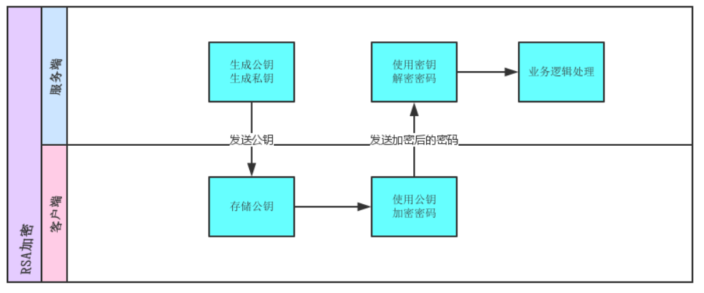

#### 服务端实现流程:

- 安装`node-rsa`模块
- 实例化密钥生成公钥和私钥保存在文件中
- 封装解密和加密方法
- 导出供其他模块使用

```
// 安装两个模块: crypto node-rsa 
const fs = require("fs")
const path = require("path")
const NodeRSA = require("node-rsa")
const cerPath = path.join(process.cwd(),"./auth") //存储公钥和私钥的文件夹


//创建密钥 一般没有特殊情况只用创建一次
function generateKeys() {
  // 实例化 密钥 参数: 密钥位数:bit 2^n次方
  const newKey = new NodeRSA({bb:1024})
  newKey.setOptions({encryptionScheme: "pkcs1"}) //因为jsenctypt自身使用的是pkcs1加密方案,只能从后台改
  let public_key = newKey.exportKey("pkcs8-public") //公钥
  let private_key = newKey.exportKey("pkcs8-private") //私钥
  //将私钥和公钥写入文件,以便保存
  fs.writeFileSync(path.join(cerPath,"private.cer"),private_key)
  fs.writeFileSync(path.join(cerPath,"public.cer"),public_key)
}
//加密,读出公钥和公钥,对plain加密后返回
function encrypt (plain) {
  let public_key = fs.readFileSync(path.join(cerPath, 'public.cer'), 'utf8');
  private_key = fs.readFileSync(path.join(cerPath, 'private.cer'), 'utf8'); //私钥
  const nodersa = new NodeRSA(public_key);
  nodersa.setOptions({ encryptionScheme: 'pkcs1' });
  const encrypted = nodersa.encrypt(plain, 'base64');
  return encrypted;
}
//解密 读出私钥和公钥,对cipher解密,解密后返回utf8序列化后的数据
function decrypt (cipher) {
  let public_key = fs.readFileSync(path.join(cerPath, 'public.cer'), 'utf8');
  private_key = fs.readFileSync(path.join(cerPath, 'private.cer'), 'utf8'); //私钥
  let pubkey = new NodeRSA(public_key),
  prikey = new NodeRSA(private_key);
  pubkey.setOptions({ encryptionScheme: 'pkcs1' });
  prikey.setOptions({ encryptionScheme: 'pkcs1' });
  return prikey.decrypt(cipher, 'utf8')
}

module.exports = {
  generateKeys,
  encrypt,
  decrypt
}
```

#### 前端加密流程:

- 先请求公钥,保存在localStorage中
- 引入`jsencrypt`模块,该模块可以对文件加密,亦可以使用bootCDN直接引入
- 封装加密方法
- 通过请求发送

```
<script src="https://cdn.bootcdn.net/ajax/libs/jsencrypt/3.2.1/jsencrypt.min.js"></script>
  
// 加密
function encrypt(publicKey, value) {
  let encrypt = new JSEncrypt();
  encrypt.setPublicKey(publicKey);
  return encrypt.encrypt(value)
}
```

### 认证授权Authenticity

> 上述加密很大程度上确保了我们数据的安全性,那么认证授权有什么作用呢?
>
> 登录:
>
> - 让系统认识你,记录之前的你操作
>
> - 防止其他人冒充,确保真的是你
>
> 授权:
>
> - 赋予权限,不同用户权限不同,如博客博主,普通用户

#### session认证授权

> 这里的session不是浏览器的session存储,是验证授权的一种方式

##### 工作原理

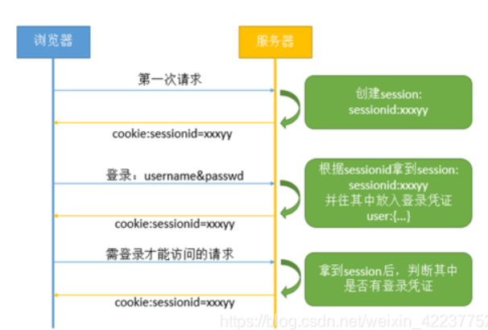

1. 服务端session是用户第一次访问应用时,服务器就会创建的对象,代表用户的一次会话过程,可以用来存放数据.服务器为每一个session都分配一个唯一的sessionID,以保证不同的用户都有一个不同的session对象
2. 服务端在创建完session后,把sessionID通过cookie的方式存储在用户浏览器中,这样当用户再次请求服务器时,就会通过cookie,将sessionID回传给服务器,服务器便可以通过sessionID找到session对应的session对象,若sessionID没有说明该用户没有权限
3. session通常有失效时间的设定,比如2小时,超过失效时间,服务器就销毁之前的session并创建新的session返回用户,但是用户在失效时间内再次请求,通常服务器会把session失效时间完后延长2个小时,来保证登录状态
4. session在一开始并不具备会话管理的作用,他只有在用户登录认证成功之后,并且session对象里面放入了用户登录成功的凭证,才能用来管理会话.管理会话的逻辑也很简单:只要拿到用户的session对象,看他里面有没有登录成功的凭证,就能判断这个用户是否已经登录.当用户主动退出的时候会把他的session对象里的登录凭证清理掉,所以在用户登录前或者退出后或者session对象失效时,肯定都是拿不到需要的登录凭证的

##### 缺点

> 当用户量很庞大的时候,有时需要多台服务器来支持服务,每台服务器中存储的session不同,服务端在认证sessionID时,该session可能并不存在该服务器上,而存在与其他服务器上,这就需要:
>
> 1. 额外的构建服务器间的通信逻辑,但是这样服务器压力较大
> 2. 分布式架构下专门搭建单独session服务器,所需资源更多,且专门的session服务器一旦宕机,所有用户都将无法认证

#### session认证授权的实现

- 安装`express-session`并配置session中间件
- 用户账号密码验证成功,设置该用户的sessionID`req.session.userName = user`
- 下次请求,会自动携带上用户的sessionID,比较sessionID是否存在判断用户权限`req.session.userName === "admin"`
- `req.session.destroy`,用户退出,清楚服务端的session

```
const session = require("express-session")
const express = require("express")
const router = express.Router()

//使用中间件,对请求设置session对象
router.use(session({
  secret: "balabalabala",//签名,表示这个session是本服务器奇签发的,防止用户伪造
  resave: false,//是否重新保存,重新请求后生成新的session覆盖旧的session
  saveUninitialized: true,//强制未初始化的session存储
  name: "userName",//设置cookie上的key
  cookie: {
    maxAge: 127000 //设置签名有效期
  },
  roolling: true //每次请求都重置cookie过期时间
}))

router.post("/login",function(req,res,next){
  let {user,password} = req.body
  // 验证账号密码
  if(user === "admin" && password === "123456"){
    // 验证成功,
    req.session.userName = user
  }
  res.send(200,{msg: "ok"})
})
// 验证session
router.post('/getAvatar',function(req,res,next){
  console.log(req.session.userName) //登录过的用户携带的着sessionID,通过比较sessionID是否存在来判断用户的登录状态
  if(req.session.userName === "admin"){
    res.send(200,{status: "200",msg: "已经登录"})
    return false
  }
  res.send(200,{status:"304",msg:"没有登录,需要重新登录"})
})
//退出登录
router.post('/logout',function(req,res,next){
  req.session.destroy(function(){
    console.log(" session已经清除")
  })
  res.send(200,{msg:"session已经清除,用户退出"})
})

module.exports = router
```

#### token认证授权


##### 实现原理

- 服务端收到请求,验证用户名和密码
- 验证成功,服务端签发一个Token,再把这个Token发送给客户端
- 客户端收到token ,存储在Cookie中或者localStorage中
- 客户端每次向服务器请求资源的时候都需要带着服务端签发的token
- 服务端再次收到请求,然后去验证请求携带的token,如果验证成功,就向客户端返回数据

##### token令牌构造

> JWT:主流token规范,指出token包含三个部分,`Header`,`Payload`,`密钥`

1. **Header**

   > 头部,通常头部由两部分信息;
   >
   > - 声明类型: 一般是JWT,主流规范
   > - 加密算法: RS256 表示长度为256位的RSA加密算法

2. **Payload**

   > 荷载,包含各种有效数据
   >
   > - 用户身份信息(这里使用base64加密,可解密不要存放敏感信息)
   > - 注册声明:如token签发时间,过期时间,签发人,也是base64加密
   >
   > 官方规定了七个字段供选用JSON对象格式:
   >
   > 1. iss(issuer): 签发人
   > 2. exp(expiration time): 过期时间
   > 3. sub: 主题
   > 4. aud:受众
   > 5. nbf:生效时间
   > 6. iat: 签发时间,是unix下的时间戳,单位s
   > 7. jti(JWT,ID): 编号
   >
   > 除了官方字段,你还可以在这个部分定义私有字段:
   >
   > ```
   >  {
   >    "sub": "133212312",
   >    "name": "Joker chen",
   >    "admin": true
   >  }
   > ```
   >
   > **注意**:JWT默认是不加密的,任何人都可以读到,因此不要存放私密信息
   >
   > 这个JSON对象也要使用Base64URL算法转化成字符串

3. Signature

   > 签名,是整个数据的认证信息,可以说是RSA密钥的公钥和私钥
   >
   > 通过base64对头和载荷进行编码，一般根据前两步的数据，再加上服务的的密钥（secret）（不要泄漏，最好周期性更换），通过加密算法生成（RSA算法进行加密，无法进行篡改）。用于验证整个数据完整和可靠性

##### 优缺点

缺点:

- 由于服务器不保存session状态,因此无法在使用过程中废止某个token,或者更改token的权限,也就是token一旦签发在到期之前就会始终有效,除非服务器部署额外逻辑
- jwt在不加密的情况下,不能将私密信息写入JWT

优点:

- 可以用于认证,也可以用于交换信息,有效使用可以降低服务器的查询数据库次数
- 服务器压力小,只要拿到token解密就可以啦

特点;

为了减少盗用，JWT 不应该使用 HTTP 协议明码传输，要使用 HTTPS 协议传输。

JWT 默认是不加密，但也是可以加密的。生成原始 Token 以后，可以用密钥再加密一次

JWT 本身包含了认证信息，一旦泄露，任何人都可以获得该令牌的所有权限。为了减少盗用，JWT 的有效期应该设置得比较短。对于一些比较重要的权限，使用时应该再次对用户进行认证。

### token认证授权的实现

> 需要安装一个第三方包(0创建token),和一个第三方中间件(验证token)

```js
//服务端
const express = require("express")
const fs = require("fs")
const jwt = require("jsonwebtoken")//生成token
const expressJwt = require("express-jwt")//验证token中间件
const router = express.Router()

//下面是上述RSA加密部分生成的密钥
var privateKey = fs.readFileSync('./auth/private.cer', 'utf8'); //rsa加密私钥 
var publicKey = fs.readFileSync('./auth/public.cer', 'utf8'); //rsa加密公钥

// 用户登录,并生成token
router.post("/login",function(req,res,next){
  let { user,password} = req.body
  //登陆成功,签发令牌
  let token = jwt.sign({
    user,
    exp:~~((Date.now() / 1000) + 3600) //过期时间
  },
  privateKey,//加密的密钥
  {algorithm: "RS256"}//加密方式
  )
  res.send(200,{msg: "ok",token})
})
// 验证token
router.get("/getAvatar",expressJwt({
  secret: publicKey, //解密密钥,这里加密使用的是私钥,所及解密使用公钥
  algorithms:["RS256"], //说明解密算法,中间件版本6.0.0以上必须设置
  getToken: function fromHeaderOrQuerystring(req){
    //获取token的方法,默认下面这种
    if (req.headers.authorization && req.headers.authorization.split(' ')[0] === 'Bearer') {
      return req.headers.authorization.split(' ')[1];
    } else if (req.query && req.query.token) {
      return req.query.token;
    }
    return null;
  },
  //在下面的回调中,就可以获取token中第二部分的信息
  isRevoked: function(req,payload,next){
    //获取需要的信息,挂载到req上,next到下一个中间件进行验证
    let {user} = payload
    req.tokenID = user
    next()
  }
}),(req,res,next)=>{
  // 如果不是admin用户就给权限
  if(req.tokenID === "admin"){
    res.send(200,{
      statusCode: 200,
      msg: "有权限"
    })
    return 
  }
  res.send(200,{
    statusCode: 403,
    msg: "没有权限"
  })
})

module.exports = router

前端:
async function login(){
      try{
        let res = await axios.post("http://127.0.0.1:3000/token/login",{
          user: oUser.value,
          password: oPwd.value
        },{withCredentials: true})
        localStorage.setItem("token",res.data.token)
        token = res.data.token
        console.log(res.data.msg)
      }catch(err){
        console.log(err)
      }
    }

    async function avatar(){
      try{
        let res = await axios.get("http://127.0.0.1:3000/token/getAvatar",{
          headers: {
            "Authorization": `Bearer ${token}` //设置请求头,给token加上Bearer
          },
        })
        console.log(res.data)
      }catch(err){
        console.log(err)
      }
    }
```


# async/await

> JS新特性,本质是promise的进阶语法糖,他建立在promise的基础上,并且与现有的基于Promise的API兼容

## async

> async函数可以看作多个异步操作包装成一个promise对象

- 声明一个异步函数,并且将异步函数转换成promise,函数内return的值会作为这个promise的resolve参数,返回值也是promise

  ```js
  let a = async function(){
      return 1
  }
  a.then(data => console.log(data)) //输出值为1
  这里,a是async声明函数后返回的值,是一个promise
  函数内部return的值,默认作为.then的参数,也就是只会转换为`resolve`状态
  ```

- 只有async函数内部的异步操作完成,才会执行then方法指定的回调函数

- 异步函数内部可以使用await

## await

> await命名就是内部的then命令的语法糖,他等待返回的是一个表达式,不管是不是`promise`都西昂都可以,区别在于promise对象执行的状态不一样而已,

- 放置在Promise调用之前,await强制其他代码等待,直到promise返回结果,后续任务才会入栈出栈
- 只能和Promise一起使用,不适合回调函数
- 只能在async声明的函数内部使用

**在await后直接放promise对象**

> 只要出现`reject`状态,整个async函数都会中断掉,如果状态是resolve,那么await后的值就是resolve的值

**在await等来的是promise对象时:**

> 阻塞后面的代码,等待promise对象执行完毕,如果promise没有`resolve或者reject`那么后面的代码永远都不会执行,因为一直在等待promise状态改变

**在await后等来的不是promise对象时:**

> 和正常执行代码一样,返回值就是值本身

## 错误处理

> 上面提到async声明的函数return值会作为函数.then中的参数
>
> 那么就会有一个问题,如果async内部发生错误怎么办?
>     当内部任务可能出现错误时,使用try catch处理,若发生错误就会走a的`catch`,若没有发生错误就走a的`then`
> 同时由于a是一个promise,因此想要拿到async中的结果,一定是在then中

```
使用try catch捕获
function fn() {
   return Promise.reject('error')
}

async function asyncFn() {
    try {
    	await fn()
        console.log(1) // 如果上一行出错将直接跳到catch，不会执行到这里
    } catch(e) {
    	console.log(e) // error
    }
}
```

## Promise的两个静态方法

### Promise.all()

> 返回一个新的promise对象,且按照参数数组顺序批量执行promise,,在新的promise对象`.then回调中`参数就是每个promise执行结果组成的数组
>
> **注意:**
>
> 新生成的promise对象状态:
> 数组中所有的promise状态都转换成reslove,才会进入.then回调,任意一个状态为reject都会直接走catch函数,有点类似every()函数

```
参数:
promise对象构成的数组,若数组元素不是promise,会通过`Promise.resolve()`进行转换
```

#### 使用场景

> 需要多个请求结果合并

### Promise.race()

> 返回一个新的promise对象,参数与Promise.all()相同,但是只要参数数组中任意一个转换成`resolve或者reject`,就忽略掉其他promise直接走`.then()或者.catch()`

#### 使用场景

> 非A即B,竞速调用
>
> 如: 三个接口,谁先请求完毕使用谁的请求结果

# Router路由

> 路由就是随着浏览器地址栏中URL的变化,展示给用户的页面页不相同,又或者从原理解释说: 路由就是URL到函数的映射
>
> 发展: 后端路由到前端路由

## 后端路由

> 有称为服务端路由,当接受到客户端发的HTTP请求,就会根据所请求的URL,来找对应的映射函数,并执行该函数,将执行结果返回给客户端,前端值用来展示即可.这种模式在早期前端开发中非常普遍

### 优缺点

> 安全性好,SEO好
>
> 加大了服务器的压力,不利于用户体验,代码冗余

## 前端路由

> 对于前端路由来说,路由的映射函数通常进行一些DOM操作来控制组件的显示于隐藏,当访问不同路径的时候会显示不同的组件页面
>
> 即单页面应用SPA: 应用只有一个主页,通过动态替换DOM内容,并同步修改url地址来模拟多页面效果,切换页面的功能由前台脚本完成,而不是后端渲染完毕后前端展示
>
> 主要有两种实现方式:`history`,`hash`

### 优缺点

> 服务器压力小,用户体验好,
>
> 不利于SEO

### hash

> hash符: #.请求的URL中带井号,井号后面的叫做hash内容,地址栏中hash内容的改变不会向服务端发送请求

#### 实现原理

> 通过`location.hash`来实现的,`location.hash`就是URL中`#`后面的内容
>
> 根据hash路由的原理:
>
> - hash内容改变不会向服务器发送请求,使用hash发送请求时hash不会发送到服务端
> - hash内容改变会触发`window.onhashchange`事件
> - hash内容改变会向浏览器历史记录添加一个记录,前进后退按钮可以控制

##### hash值获取

```
location.hash = "#index" //设置
location.hash //获取
window.addEventlistener("hashchange",function(){
	//监听hash值的改变
})
```

#### 特点

- 实现简单,兼容性好,
- 对于部分重定向操作,后端无法获取到hash内容,地址栏带有#不是很美观

### history

> 通过H5 新增的History API来实现URL的变化,该对象用来管理浏览器的状态,浏览历史
>
> 主要使用两个API`History.pushState()`和`History.replaceState()`,这两个API可以在不刷新的情况下操作浏览器浏览记录

#### 属性

> History接口不继承于任何属性

##### length

> 只读属性,返回一个整数,表示会话历史中元素的数目,包括当前记载页,就是浏览记录

##### state

> 返回一个表示历史堆栈顶部的状态值,这是一种可以不必等待`poptstate`事件而查看状态的方式.就是查看当前history状态

##### scrollRestoration

> 允许Web应用程序在历史导航上显式地设置默认滚动恢复行为。此属性可以是自动的（auto）或者手动的（manual

#### 方法

##### back()

> 在浏览器历史记录中前往上一个历史记录

##### forward()

> 在浏览器历史记录中前往下一个历史记录

##### go(num)

> num大于0,直接前往num步,num小于0后退num步

##### pushState()

> 将指定名称和URL,push进会话栈

```js
History.pushSate(state,title[,url])
参数:
state:
{
    任何序列化对象,触发popSate事件后,该事件事件属性会包含这个序列化对象的副本,且这个对象一般存放在sessionStorage
}
tilte: 标题
url: 添加到历史栈的url
```

##### replaceState()

> 修改当前历史记录

```
History.replaceState(state,title[,url])
state: 与pushState参数相同
title
url:历史记录实体的 URL. 新的 URL 跟当前的 URL 必须是同源; 否则 replaceState 抛出一个异常。
```

#### 事件

> history中历史记录的改变可以触发`popState`事件

```
window.addEventlistener("popState",function(e){
	e.preventDefalut() //一定先阻止默认行为
	e.state//可以拿到state
})
```

#### 特点

- 重定向的时候url的参数不会丢失
- 不如hash兼容好

# webpack

> 功能:
>
> -  制作网页时需要一个web服务器实时浏览制作的页面和测试代码,并且可以热更新.
> - 部署网站时需要对应用程序进行压缩优化文件大小
> - 如果功能较复杂还需按照模块拆分,实现按需动态加载
>
> 简言之: 支持编译所有文件类型, 不仅可以压缩优化文件,还可以帮你管理项目文件间的依赖关系

**安装**

```
npm i webpack webpack-cli webpack-dev-server -D
//webpack4.0以上版本安装时需要安装cli以用来使用全部功能,
//建议本地安装,
```

## webpack配置文件

> webpack配置文件可以对webpack打包时相关项进行配置,文件名`webpack.config.js`

```
//webpack.config.js

cost path = require("path")
 module.exports = {
 	配置项
 }
```

为什么内部使用的是commond语法规范?

> 思考: webpack本质上是对文件进行操作,而脚本语言是没有这样的权限的,想要对文件进行操作只能是非脚本语言,因此webpack是依赖node环境进行文件操作的,这也就是为什么配置文件中使用node中模块导入导出的语法.

## webpack运行

> 由于我们的webpack是本地安装,因此想要运行本地安装的第三方包自带的命令应该使用**npx**开头

```
npx webpack //默认部根据配置文件打包
npx webpack --config "./webpack.config.js" //根据配置文件进行打包
```

打包后引入打包成功的js文件即可

### 添加自定义命令

> 为了运行方便,我们可以在package.json中script项中自定义运行命令

```
"script" : {
	"bulid": "npx webpack --config ./webpack.config.js"
}
模块化webpack:
"script" : {
	"bulid": "npx webpack --config ./config/webpack.prod.js", //生产环境下的配置文件
	"dev" : "npx webpack --config ./config/webpack.dev.js",   //开发环境下的配置文件
	"start": "webpack serve --config ./config/webpack.dev.js" //开发环境下的配置文件且带服务器
}
下方会详细讲解为什么模块化,以及怎么模块化
```

## webpack配置文件中基础概念

> 详情其他配置查看Node40天课程 

- 入口entry
- 输出output
- 加载器loader
- 插件 plugins

### 入口entry

> 即设置整个项目的入口文件,指定webpack构建内部依赖图时应该从哪个文件开始,最后将依赖项生成至bundles文件中

```js
const path = require("path")
module.exports = {
    entry: "入口文件路径,默认是src文件夹下的index.js"
}
```

#### 多入口

```
const path = require("path")
module.exports = {
    entry: {
    	main: "./src/main.js",
    	util: "./src/util.js"
    },
    output: {
        filenmae:[name].bulid.js,
        path: path.resolve(__dirname,"dist")
    }
}
生成两个文件: main.bulid.js 和util.bulid.js两个,name实际是上面两个文件的引用
```

### 输出output

> 该属性可以告诉webpack在哪里输出所创建的bundles,,基本上整个应用程序结构都会被编译到指定的输出路径文件夹中,这便是打包好的生产所用的项目文件

```js
const path = require("path")
module.exports = {
    entry: "./src/index.js",
    output: {
        filename: "输出后文件名",
        path: path.resolve(__dirname,"dist") //文件生成路径,编译到dist文件夹中
    }
}
```

### 加载器

> 类似中间件,通过配置test和use,使webpack可以解析并打包除js文件之外的文件,
>
> 在module.rules数组中,每个配置对象都有两个属性``test正则指定文件类型``,``use指定这种类型使用什么加载器加载``

```js
const path = require("path")
module.exports = {
    entry: "./src/index.js",
    output: {
        filename: "main.js"
        path: path.resolve(__dirname,"dist")
    },
    module: {
        rules:[
            {
                test: /\.css$/, //正则表达式,匹配以.css结尾.用于标识文件类型
                use: ["style-loader","css-loader"] //转换上述类型文件时,应该使用哪些加载器,这些加载器都是已经安装好在本地的,npm使用的加载器之后再配置
            },
            {
                test: /\.styl$/, //编译styl文件的固定写法,
                use:[
                    "style-loader",
                    {
                        loader:"css-loader"
                    },
                    {
                        loader:"stulus-loader"
                    }
                ]
            },
            {
                test: /\.hbs/,
                use: "handlebars-loader"
            },
            {
                test: /\.(png|jpg|svg|gif)$/i, //编译图片
                use: [
                    "file-loader"
                ]
            },
            {
                test: /\.(woff|woff2|eot|ttf|otf)$/i,//编译字体资源
                use: [
                    "file-loader"
                ]
            }
        ]
    }
}
```

#### 使用

> 在入口文件中引入文件,加载器配置好以后,即可使用

- css/stylus:只需要引入即可生效
- hbs: 引入名会被编译称模板函数,可以直接拿着引入名传递模板数据进行使用

### plugins插件

> loader用来处理特殊文件的加载,而插件可以用来处理更广泛的业务
>
> 想要使用一个插件,必须先require引入该插件,然后再plugins数组项中添加,添加时添加的时插件new出来的实例

```js
例如: 想要再dist文件夹中自动生成index.html文件,而不是我们去创建
	 或者,每次我们修改代码之后,都会重新编译项目到dist文件夹,有时上次编译的文件还留存在dist中,不能能自动清空
	
const HtmlWebpackPlugin = require("html-webpack-plugin")
const { CleanWebpackPlugin } = require('clean-webpack-plugin') //dist文件夹清洁插件
const path = require("path")
module.exports = {
    entry: "./src/index.js",
    output: {
        filename: "main.js",
        path: path.resolve(__dirname,"dist")
    },
    module: {
        rules :[
            {}
        ]
    },
    plugins:[
        new HtmlWebpackPlugin({
            title: 网页title,
            template: "./index.html" //指定生成的html是根据哪个html文件作为模板
        }),
        new CleanWebpackPlugin()
    ]
}
```

### 加载器和插件的区别

1. 加载器用于将不同类型的文件进行转换,webpack本身只支持js的处理,常用loder: babel-loader,css-loder,style-loder,stylus-loder,postcss-loder,sass-loder,ts-loder,eslint-loder
2. 插件用来扩展webpack的功能,webpack执行过程中会触发不同的事件,插件可以监听这些事件,并进行一些自定义操作,如再dist中自动生成index.html,打包时自动清空上一次打包的dist文件夹

### 模式

> mode: 有两个取值:`development`和`production`,启用不同环境下的webpack内置优化,默认`development`

```
module.exports = {
    mode: "production" //指定 按照生产环境启用内置优化
}
```


## 开发/生产环境模块化

> 问题:
>
> 编译后的代码运行出错时,是很难在压缩中的代码找到错误原因的,而开发环境需要这种压缩后的代码
> 开发时不需要每次都只当出入口编译项目,只需要使用webpack的配置指定的加载器即可,而生产环境需要出入口
> 开发时有时需要临时服务器,而生产环境不需要
>
> 由于上述问题,我们不能每次都手动更改webpack.config.js文件吧,这样不仅繁琐,而且很LOW,这时我们就可以借用模块化,将开发时配置项放在开发环境配置文件中,将生产时需要的匹配项放在生产环境配置文件中,将通用配置项放进通用配置文件中,运行时按照环境不同运行不同的配置文件
>
> **like this**
>
> config文件夹
>
> ​	webpack.common.js 通用配置文件
>
> ​	webpack.dev.js           开发环境配置文件
>
> ​	webpack.prod.js         生产环境配置文件

首先要安装一个库: npm i -D webpack-merge,他是用来将配置文件整合到一起的,相当于Object.assign(),运行方式参照webpack运行章节

### 开发环境配置文件

```js
//webpack.dev.js 只在开发环境需要的配置
const {merge} = require("webpack-merge")//合并文件的第三方库
const path = require("path")
const common = require("./webpack.common.js") //引入通用配置文件

module.exports = merge(common,{
    devtool: "inline-source-map",//编译后保持源文件形式,方便Debug
    devServer : {//开发环境的临时服务器设置,//webpack serve 命令启动该服务器
       可能不使用了 //contentBase: path.join(__dirname, 'dist'), // 服务器监听的文件夹路径,绝对路径
        可能不使用了//inline: true,//是否在线
        host: 'localhost',
        port: 8080,
        open: true //是否自动打开浏览器
    }
})
```

### 生产环境配置文件

```
//webpack.prod.js 只在生产环境需要的配置
const common = require('./webpack.common');
const { merge } = require('webpack-merge');
const UglifyjsWebpackPlugin = require('uglifyjs-webpack-plugin');

module.exports = merge(common, {
  mode: "production", //development|production 声明使用环境,默认是development开发环境,所以上述配置文件不用写
  output: {
    filename: '[name].[hash:7].js'
  },
  plugins: [
    new UglifyjsWebpackPlugin()
  ]
})
```

### 通用环境配置文件

```
//webpack.common.js 无论什么环境都需要的配置
const path = require('path');
const { CleanWebpackPlugin } = require('clean-webpack-plugin')
const HtmlWebpackPlugin = require('html-webpack-plugin')

module.exports = {
  //指定入口
  entry: {
    main: './src/index.js',
    util: './src/app/util.js'
  },
  plugins: [
    new HtmlWebpackPlugin({
      title: "html plugn page",
      template: './index.html'
    }),
    // new CleanWebpackPlugin()
  ],
  output: {
    //输出文件名称
    filename: '[name].build.js',
    //输出文件路径
    path: path.resolve(__dirname, 'dist')
  },
  module: {
    rules: [
      {
        test: /\.css$/,
        use: [
          'style-loader',
          'css-loader'
        ]
      },
      {
        test: /\.hbs$/,
        loader: "handlebars-loader"
      },
      {
        test: /\.styl$/i,
        use: [
          "style-loader",
          {
            loader: "css-loader",

          },
          {
            loader: "stylus-loader",
          },
        ],
      },
    ]
  }
};
```

## 压缩代码

```
npm i uglifyjs-webpack-plugin@1 -D

// webpack.config.js
const UglifyJSPlugin = require('uglifyjs-webpack-plugin');

module.exports = {
    ... //其他配置项省略
    plugins:[
		new UglifyjsWebpackPlugin()
    ]
}
```

## 查看依赖大小

```
const { BundleAnalyzerPlugin } = require('webpack-bundle-analyzer')
plugins: [
    new BundleAnalyzerPlugin()
  ],
```


## 选择性打包

```
添加配置
mudle:{
	externals: {
		jquery: "jQuery" 后面驼峰,前面使用引入的包名
	}
}
```

## 单独整合打包

```
// 提取多入口模块中的第三方库 单独整合打包
  optimization: {
    splitChunks: {
      cacheGroups: {
        commons: {
          test: /[\\/]node_modules[\\/]/,
          name: "vendors",
          chunks: "all",
        }
      }
    }
  }
```

# RESTful API 

RESTful架构，就是目前最流行的一种互联网软件架构。它结构清晰、符合标准、易于理解、扩展方便，所以正得到越来越多网站的采用。

[RESTful](http://www.ruanyifeng.com/blog/2011/09/restful.html) 是目前最流行的 API 设计规范，用于 Web 数据接口的设计。

它的大原则容易把握，但是细节不容易做对。本文总结 RESTful 的设计细节，介绍如何设计出易于理解和使用的 API。

REST: Representational State Transfer（表现层状态转移）

## 一、URL 设计

**REST 是面向资源的，这个概念非常重要，而资源是通过 URI 进行暴露。**

```
GET /getUserInforById?userId=100011

POST /postUserInforById

POST /removeUserInforById

POST /updateUserInforById

GET /getUserInforByUsername

GET /getUserInforByUUID

4201
4202
4299


UserInfo

BEM restFul

//获取用户信息
GET /api/rest/users?&id="00012"

// 新增用户
POST /api/rest/users?username="kyogre"&password="12312312"&user_avatar="fdsffdsfs"

// 修改用户名称 更新
PUT /api/rest/users?userId="000011"&beforeUsername="kkkkk"&afterUsername="fdfsdfds"
PATCH /api/rest/users?userId="000011"&beforeUsername="kkkkk"&afterUsername="fdfsdfds"

// 删除用户
DELETE /api/rest/users?userId="0000011"&password="342134213412"

//查询文章
GET /api/rest/users/2019091991/article/2010011

response StatusCode
	让客户端能够清楚直观了解 请求的结果


根据ID获取用户信息?条件

动词+名词+修饰?(条件)

```


### 1.1 动词 + 宾语

RESTful 的核心思想就是，客户端发出的数据操作指令都是"动词 + 宾语"的结构。比如，`GET /articles`这个命令，`GET`是动词，`/articles`是宾语。

动词通常就是五种 HTTP 方法，对应 CRUD 操作。

> - GET：读取（Read）
> - POST：新建（Create）
> - PUT：更新（Update）
> - PATCH：更新（Update），通常是部分更新
> - DELETE：删除（Delete）

根据 HTTP 规范，动词一律大写。

### 1.2 动词的覆盖

有些客户端只能使用`GET`和`POST`这两种方法。服务器必须接受`POST`模拟其他三个方法（`PUT`、`PATCH`、`DELETE`）。

这时，客户端发出的 HTTP 请求，要加上`X-HTTP-Method-Override`属性，告诉服务器应该使用哪一个动词，覆盖`POST`方法。

> ```http
> POST /api/Person/4 HTTP/1.1  
> X-HTTP-Method-Override: PUT
> ```

上面代码中，`X-HTTP-Method-Override`指定本次请求的方法是`PUT`，而不是`POST`。

### 1.3 宾语必须是名词

宾语就是 API 的 URL，是 HTTP 动词作用的对象。它应该是名词，不能是动词。比如，`/articles`这个 URL 就是正确的，而下面的 URL 不是名词，所以都是错误的。

> - /getAllCars
> - /createNewCar
> - /deleteAllRedCars

### 1.4 复数 URL

既然 URL 是名词，那么应该使用复数，还是单数？

这没有统一的规定，但是常见的操作是读取一个集合，比如`GET /articles`（读取所有文章），这里明显应该是复数。

为了统一起见，建议都使用复数 URL，比如`GET /articles/2`要好于`GET /article/2`。

### 1.5 避免多级 URL

常见的情况是，资源需要多级分类，因此很容易写出多级的 URL，比如获取某个作者的某一类文章。

> ```http
> GET /authors/12/categories/2
> ```

这种 URL 不利于扩展，语义也不明确，往往要想一会，才能明白含义。

更好的做法是，除了第一级，其他级别都用查询字符串表达。

> ```http
> GET /authors/12?categories=2
> ```

下面是另一个例子，查询已发布的文章。你可能会设计成下面的 URL。

> ```http
> GET /articles/published
> ```

查询字符串的写法明显更好。

> ```http
> GET /articles?published=true
> ```

## 二、状态码

### 2.1 状态码必须精确

客户端的每一次请求，服务器都必须给出回应。回应包括 HTTP 状态码和数据两部分。

HTTP 状态码就是一个三位数，分成五个类别。

> - `1xx`：相关信息
> - `2xx`：操作成功
> - `3xx`：重定向
> - `4xx`：客户端错误
> - `5xx`：服务器错误

这五大类总共包含[100多种](https://en.wikipedia.org/wiki/List_of_HTTP_status_codes)状态码，覆盖了绝大部分可能遇到的情况。每一种状态码都有标准的（或者约定的）解释，客户端只需查看状态码，就可以判断出发生了什么情况，所以服务器应该返回尽可能精确的状态码。

API 不需要`1xx`状态码，下面介绍其他四类状态码的精确含义。

### 2.2 2xx 状态码

`200`状态码表示操作成功，但是不同的方法可以返回更精确的状态码。

> - GET: 200 OK
> - POST: 201 Created
> - PUT: 200 OK
> - PATCH: 200 OK
> - DELETE: 204 No Content

上面代码中，`POST`返回`201`状态码，表示生成了新的资源；`DELETE`返回`204`状态码，表示资源已经不存在。

此外，`202 Accepted`状态码表示服务器已经收到请求，但还未进行处理，会在未来再处理，通常用于异步操作。下面是一个例子。

> ```http
> HTTP/1.1 202 Accepted
> 
> {
> "task": {
>  "href": "/api/company/job-management/jobs/2130040",
>  "id": "2130040"
> }
> }
> ```

### 2.3 3xx 状态码

API 用不到`301`状态码（永久重定向）和`302`状态码（暂时重定向，`307`也是这个含义），因为它们可以由应用级别返回，浏览器会直接跳转，API 级别可以不考虑这两种情况。

API 用到的`3xx`状态码，主要是`303 See Other`，表示参考另一个 URL。它与`302`和`307`的含义一样，也是"暂时重定向"，区别在于`302`和`307`用于`GET`请求，而`303`用于`POST`、`PUT`和`DELETE`请求。收到`303`以后，浏览器不会自动跳转，而会让用户自己决定下一步怎么办。下面是一个例子。

> ```http
> HTTP/1.1 303 See Other
> Location: /api/orders/12345
> ```

### 2.4 4xx 状态码

`4xx`状态码表示客户端错误，主要有下面几种。

`400 Bad Request`：服务器不理解客户端的请求，未做任何处理。

`401 Unauthorized`：用户未提供身份验证凭据，或者没有通过身份验证。

`403 Forbidden`：用户通过了身份验证，但是不具有访问资源所需的权限。

`404 Not Found`：所请求的资源不存在，或不可用。

`405 Method Not Allowed`：用户已经通过身份验证，但是所用的 HTTP 方法不在他的权限之内。

`410 Gone`：所请求的资源已从这个地址转移，不再可用。

`415 Unsupported Media Type`：客户端要求的返回格式不支持。比如，API 只能返回 JSON 格式，但是客户端要求返回 XML 格式。

`422 Unprocessable Entity` ：客户端上传的附件无法处理，导致请求失败。

`429 Too Many Requests`：客户端的请求次数超过限额。

### 2.5 5xx 状态码

`5xx`状态码表示服务端错误。一般来说，API 不会向用户透露服务器的详细信息，所以只要两个状态码就够了。

`500 Internal Server Error`：客户端请求有效，服务器处理时发生了意外。

`503 Service Unavailable`：服务器无法处理请求，一般用于网站维护状态。

## 三、服务器回应

### 3.1 不要返回纯本文

API 返回的数据格式，不应该是纯文本，而应该是一个 JSON 对象，因为这样才能返回标准的结构化数据。所以，服务器回应的 HTTP 头的`Content-Type`属性要设为`application/json`。

客户端请求时，也要明确告诉服务器，可以接受 JSON 格式，即请求的 HTTP 头的`ACCEPT`属性也要设成`application/json`。下面是一个例子。

> ```http
> GET /orders/2 HTTP/1.1 
> Accept: application/json
> ```

### 3.2 发生错误时，不要返回 200 状态码

有一种不恰当的做法是，即使发生错误，也返回`200`状态码，把错误信息放在数据体里面，就像下面这样。

> ```http
> HTTP/1.1 200 OK
> Content-Type: application/json
> 
> {
> "status": "failure",
> "data": {
>  "error": "Expected at least two items in list."
> }
> }
> ```

上面代码中，解析数据体以后，才能得知操作失败。

这张做法实际上取消了状态码，这是完全不可取的。正确的做法是，状态码反映发生的错误，具体的错误信息放在数据体里面返回。下面是一个例子。

> ```http
> HTTP/1.1 400 Bad Request
> Content-Type: application/json
> 
> {
> "error": "Invalid payoad.",
> "detail": {
>   "surname": "This field is required."
> }
> }
> ```

### 3.3 提供链接

API 的使用者未必知道，URL 是怎么设计的。一个解决方法就是，在回应中，给出相关链接，便于下一步操作。这样的话，用户只要记住一个 URL，就可以发现其他的 URL。这种方法叫做 HATEOAS。

举例来说，GitHub 的 API 都在 [api.github.com](https://api.github.com/) 这个域名。访问它，就可以得到其他 URL。

> ```http
> {
> ...
> "feeds_url": "https://api.github.com/feeds",
> "followers_url": "https://api.github.com/user/followers",
> "following_url": "https://api.github.com/user/following{/target}",
> "gists_url": "https://api.github.com/gists{/gist_id}",
> "hub_url": "https://api.github.com/hub",
> ...
> }
> ```

上面的回应中，挑一个 URL 访问，又可以得到别的 URL。对于用户来说，不需要记住 URL 设计，只要从 api.github.com 一步步查找就可以了。

HATEOAS 的格式没有统一规定，上面例子中，GitHub 将它们与其他属性放在一起。更好的做法应该是，将相关链接与其他属性分开。

> ```http
> HTTP/1.1 200 OK
> Content-Type: application/json
> 
> {
> "status": "In progress",
> "links": {[
>  { "rel":"cancel", "method": "delete", "href":"/api/status/12345" } ,
>  { "rel":"edit", "method": "put", "href":"/api/status/12345" }
> ]}
> }
> ```

# vscode创建代码片段

>  首选项=>配置代码片段=>可配置`javascript.json,css.json,html.json`文件

```
以javascript为例子:
{
  "Print to console": { 片段类名
		"prefix": "log", //快捷输入代码,输入代码后按tab键自动生成下面body中的内容
		"body": [       //body中的内容,每一句用,引号包裹,用逗号分隔
			"console.log('$1');",
			"$2"
		],
		"description": "Log output to console"
	}
}
```

