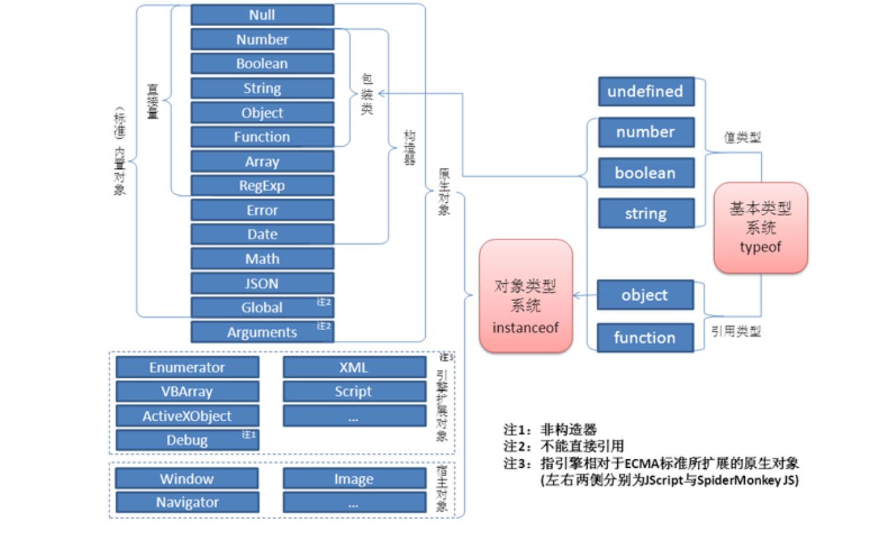
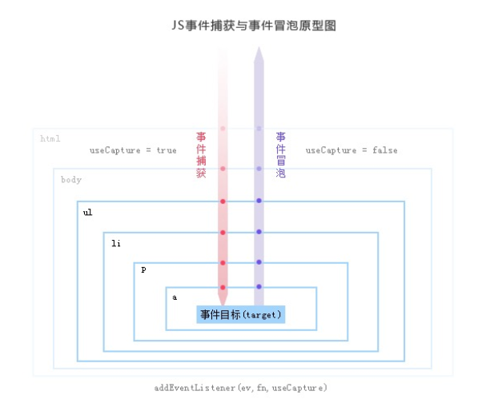

# JavaScript

## 前言


> JavaScript之父 Brendan Eich（布兰登·艾奇）

在JavaScript诞生的前几年，有人说: 

JavaScript是一门四不像的语言;JavaScript是一门没有规范的语言;JavaScript是一门兼容糟糕的语言;JavaScript是一门不精准的语言;JavaScript是一个半成品语言;JavaScript是一门糟糕的语言;JavaScript只是一个玩具胶水语言;

这些声音从JavaScript面世之初就一直伴随着她，声音的主人不乏已掌握多门语言的coding老兵，每一条负面都事实支撑。就连JavaScript之父也曾经说过:

```
"与其说我爱Javascript，不如说我恨它。它是C语言和Self语言一夜情的产物。十八世纪英国文学家约翰逊博士说得好：'它的优秀之处并非原创，它的原创之处并不优秀。'（the part that is good is not original, and the part that is original is not good.）"
```


Ruby的设计者——松本行弘为此感叹：

> “这样的出身，得到这样的成功，还真让人出乎意料，……”，“但由于开发周期短，确实也存在着不足……”。


Douglas Crockford写了一本《JavaScript：The Good Parts》，在书中他这样写到：

> JavaScript建立在一些非常好的想法和少数非常坏的想法之上。
>
> 那些非常好的想法包括函数、弱类型、动态对象和一个富有表现力的对象字面量表示法，而那些坏的想法包括基于全局变量的编程模型、缺乏块作用域、“保留”了一堆根本没用到的保留字，不支持真正的数组（它所提供的类数组对象性能不好）等等。
>
> 还有一些是“鸡肋”，比如with语句，原始类型的包装对象，new,void等等


但如今，JavaScript已经成为大部分全球开发者与编程爱好者最常用/最喜欢的语言之一。


> [github Octoverse 调查报告][ https://octoverse.github.com/] 合作开发中应用最多的语言排行


> [stackoverflow 2019年度调查报告][https://insights.stackoverflow.com/survey/2019#developer-profile-developer-roles-all-respondent ] 最受欢迎的语言排行


这中间到底发生了什么，为什么会导致如此大的变化，让我们一起与JavaScript相关的历史年表；


| 时间   | 事件                                                         |
| ------ | ------------------------------------------------------------ |
| 1990年 | 万维网诞生                                                   |
| 1992年 | 第一个浏览器诞生                                             |
| 1994年 | Netscape（网景）成立开发第一代Netscape Navigator浏览器       |
| 1995年 | Mocha诞生，之后改为LiveScript,最后与sun公司达成协议改为javascript |
| 1996年 | 微软开发JScript,Netscape公司将JavaScript提交给国际标准化组织ECMA |
| 1997年 | ECMAscript1.0版发布  JavaScript进入标准化时代 ECMA-262发布   |
| 1998年 | ECMAScript 2.0版发布。                                       |
| 1999年 | ECMAScript 3.0版发布，成为JavaScript的通行标准，得到了广泛支持。 |
| 2004年 | Gmail发布 Dojo诞生                                           |
| 2005年 | Ajax 即“ **A**synchronous **J**avascript **A**nd **X**ML” AJAX 推广  CouchDB基于json格式的数据库 |
| 2006年 | XMLHttpRequest被w3c纳入正式标准 同年 jQuery发布              |
| 2008年 | V8引擎发布                                                   |
| 2009年 | ECMAScript 5.0发布 &  node.js诞生                            |
| 2010年 | Express 发布 &  angular发布 NPM、BackboneJS和RequireJS 诞生  |
| 2011年 | React原型成立                                                |
| 2012年 | Webpack诞生                                                  |
| 2013年 | mongodb 2.4* 开始支持JavaScript ELECTRON诞生 HTML5.1 发布    |
| 2014年 | Vue.js 发布                                                  |
| 2015年 | ECMAScript 6正式发布，并且更名为 ECMAScript 2015 ，iotjs 发布 |
| 2016年 | ECMAScript 2016发布                                          |
| 2017   | ECMAScript 2017发布  主流浏览器全面支持 WebAssembly          |


```
个人观点: 真香
JavaScript的起步非常糟糕, 有着这样那样的问题让人诟病 , 但是他的灵魂足够有趣; 让人们乐于为他添砖加瓦,修枝剪叶,每一步都恰巧踩在了时代的脉搏上; The lucky JavaScript  
```


JavaScript 的基本语法和对象体系，是模仿 Java 而设计的。但是，JavaScript 没有采用 Java 的静态类型。正是因为 JavaScript 与 Java 有很大的相似性，所以这门语言才从一开始的 LiveScript 改名为 JavaScript。基本上，JavaScript 这个名字的原意是“很像Java的脚本语言”。

JavaScript 语言的函数是一种独立的数据类型，以及采用基于原型对象（prototype）的继承链。这是它与 Java 语法最大的两点区别。JavaScript 语法要比 Java 自由得多。

另外，Java 语言需要编译，而 JavaScript 语言则是运行时由解释器直接执行。

总之，JavaScript 的原始设计目标是一种小型的、简单的动态语言，与 Java 有足够的相似性，使得使用者（尤其是 Java 程序员）可以快速上手。


## 什么是JavaScript?

> JavaScript 是一门弱类型的动态脚本语言,支持多种编程范式,包括面向对象编程和函数式编程,被广发应用于Web开发
>
> JavaScript 是一门基于原型的动态解释性脚本语言

一般来说javaScript包括以下三个部分

> - ECMAscript,描述了该语言的语法和基本对象
> - 文档对象模型(DOM),描述处理网页内容的接口(操作页面元素)
> - 浏览器对象模型(BOM),描述与浏览器进行交互的方法和接口(操作浏览器交互)

它的基本特点如下:

> 1. 是一种解释性脚本语言
> 2. 主要用来向页面添加交互行为
> 3. 可以直接嵌入页面(不过写成单独的js文件更有利于结构分离)

JavaScript常用来完成以下任务：

> - 嵌入动态文本于HTML页面
> - 对浏览器事件作出响应
> - 读写HTML元素
> - 在数据被提交到服务器之前验证数据
> - 检测访客的浏览器信息

### BOM

> 一套操作浏览器功能的API
>
> 通过DOM可以操作浏览器窗口比如: 弹出框,控制浏览器跳转,获取分辨率等

### DOM

> 一套操作页面元素的API
>
> DOM可以把HTML看作是文档树,通过DOM提供的API可以对树上的节点进行操作

## JavaScript能做什么?

> 任何能够用JavaScript实现的应用系统，最终都必将用JavaScript实现     ---Atwood定律


### 前端领域

ajax出现之后 JavaScript有了在WEB领域立足的土壤和根基，时至今日。JavaScript已经是WEB前端领域最重要的基石，一切现代化的WEB项目都离不开JavaScript。

- 数据交互
- UI管理
- 用户行为交互
- 数据校验
- 工程化/模块化
- MVVM

### 后端领域

V8 JIT NodeJS 让JavaScript可以在服务端崭露头角 打破了JavaScript只能寄生在浏览器上的魔咒

CouchDB mongodb等基于JSON格式的NoSQL类型的数据库诞生 让JavaScript也可以在DB操作上大展身手

- WEB服务框架: express/KOA
- NoSQL 数据库: mongodb CouchDB 
- 博客系统 : Ghost/hexo
- 自动化构建领域: Gulp/Grunt

### APP

> 目前来说主流的App开发方式有三种：Native App 、Web App、Hybird App，而3种方式下又分别有众多的框架可供选择。JavaScript 可以介入开发的有下面三种：

- Web App HTML5 APP 框架开发模式
- Hybrid App 混合模式移动应用
- PWA  Progressive Web App **渐进式网页应用**

### **桌面应用**

> JavaScript还可以介入的桌面应用开发，主流有 electron  Node-webkit  hex  React Navite

**electron代表作: **

- vscode
- atom

**Node-webkit代表作: **

- teambition

**hex代表作**

- 有道词典


### 图形/游戏

> 世界上最流行的 2D 游戏引擎之一  Cocos2d 和最流行的 3D 游戏引擎之一 Unity3D 均支持 JS 开发游戏。
>
> 以及 Cocos2d-js 轻量型跨平台Web游戏引擎


### **嵌入式与IOT开发** 

> JavaScript 不只是 Web 时代的通用语言，如今还延伸到了使人难以置信的其它地方: 物联网;
>
> [JavaScript for Microcontrollers and IoT](https://dzone.com/articles/javascript-for-microcontrollers-and-iot-part-1)

## JavaScript基础

## JS基础名词概念

### 语句

> JavaScript语句为由上至下单行执行,每一行都是一条语句,以;结尾.

### 表达式

> 为了得到返回值的计算表达式,必然会返回一个结果

### 变量

> var num  = 10;
>
> 变量就是一个容器,用来存放各种各样的值,上述num就是一个变量,它存放的值为10 

#### 变量声明 赋值 调用

> var num = 10;
>
> console.log(num);
>
> 上述语句中,我们将值10**赋值**给了用**var**关键字**声明**的变量num,num所指向的内存地址中存储的值就是10,随后使用console.log()方法调用了该变量
>
> 其中var num为**声明**,num = 10 为**赋值** console.log(num)为**调用**,num为**标识符**

#### 变量命名规则规范

> **规则:**
>
> 1. 由字母,数字,下划线,$组成,且不能是除下划线,$的其他字符开头或包含其他符号.
> 2. 不能是关键字
>
> **规范**
>
> 1. 命名对大小写敏感,不使用无意义的命名规则
> 2. 多个单词使用驼峰命名法,
> 3. 使用名词,或**形容词+名词**,函数命名使用**动词+名词**

#### 变量规则

##### 未声明的变量直接使用

> console.log(a);
>
> 报错: XXX is not defined.说明这个值没有声明

##### 未声明直接赋值

> a = 10;
>
> 在JS中省掉关键字直接赋值时,解释器会隐示声明变量,var a;此时a未undefined.(不要这样做)

##### 重复声明或赋值

> **声明**:只有第一次声明有效
>
> **赋值**:后面的赋值会覆盖掉前面的赋值

##### 批量声明

```javascript
var a,b,c,d = 10;
解释为:
var a;显式
var b;显式
var c;显式
var d;隐式
d = 10;
```

> 从右到左执行,先变量提升,之后d为隐示声明,再将10赋值给d

批量声明和赋值

```javascript
var a=b=c=d = 10;
解释为:
var d;隐式
var c;隐式
var b;隐式
var a;显式
d = 10;
c = d;
b = c;
a = b;
```

> 从右到左执行先是d = 10,发现没有d,便隐式声明......

##### 变量提升

> **JS执行过程**:**先声明,后执行**

```javascript
console.log(a);
var a = 10 ;
输出: undefined
```

> 上面代码我们书写的顺序是:
>
> 调用a并打印
>
> 声明 a 并赋值
>
> 实际执行顺序是:

```javascript
var a;//变量提升
console.log(a);//undefined
a = 10
```

> 按照JS执行顺序先声明后执行
>
> 先声明a这一称为**变量提升**,再调用console进行打印,这是由于还没有给a赋值,所以a的值为**初始值undefined**,之后给a赋值为10.

## 数据类型

> 共有七种:
>
> 1. Number 数值
> 2. String 字符串
> 3. Boolean 布尔值(前三种也叫原始数据类型)
> 4. Undefined 表示没有值
> 5. Null 表示值为空
> 6. Object 对象,各种值得集合
> 7. Symbol 唯一标识符

```
通常，数值、字符串、布尔值这三种类型，合称为原始类型（primitive type）的值，即它们是最基本的数据类型，不能再细分了。对象则称为合成类型（complex type）的值，因为一个对象往往是多个原始类型的值的合成，可以看作是一个存放各种值的容器。至于undefined和null，一般将它们看成两个特殊值。
```

### 类型分类

> **基础类型**:Number String Boolean Undefined null symbol.存储在栈内存中,
>
> **引用类型**:Object.栈内存中存放指针,指向堆内存中的内容.function,object,array,set,map


### Number 类型

- 数值字面量: 数值的固定表示方法.

  > 110 1024 60.5,所有数都是Number不区分什么整数类型,浮点数类型.

- 进制

  > 十进制:
  >
  > ​				var num = 9;
  >
  > ​				进行数值计算时,八进制与十六进制表示的数值最终都会转换成十进制.
  >
  > 十六进制: 
  >
  > ​				var num = 0xA;
  >
  > ​				数字序列范围: 0~9以及A-F
  >
  > 八进制:
  >
  > ​			var num1 = 07;  // 对应十进制的7
  >
  > ​			var num2 = 019; //对应十进制的19
  >
  > ​			var num3 = 08; //对应十进制的8
  >
  > ​			数字序列范围: 0-7;
  >
  > ​            如果字面值中的数值超过了范围,那么前导零将被忽略,后面的数值将被当作十进制

- 浮点数

  - 浮点数精度问题

    > 浮点数
    >
    > ​			var n = 5e-324 //科学计数法 5乘以10的-324次方
    >
    > 浮点数值的最高精度为**17**位,但在进行算术运算时其准确度远远不如整数.
    >
    > ​			var result = 0.1 + 0.2; // 结果不是0.3 而是: 0.30000000000000004
    >
    > ​			不要判断俩个浮点数是否相等

- 数值范围

  > 最大值: Number.MAX_VALUE,这个值为: 5e-423
  >
  > 最小值: Number.MIN_VALUE,这个值为: 1.7976931348623157e+308
  >
  > 无穷大: Infinity   //任何数与它相比较都小
  >
  > 无穷小: -Infinity

- 数值判断

  > NaN: not a number;
  >
  > ​		用来表示与数字有关的非法运算得到的结果,主要出现将字符串解析成数字出错的场合如 :进行数学运算但无法得到一个数值那么得到的就是NaN,如:10-'f'
  >
  > **NaN与任何值都不相等,包括它本身**, 也只能通过**isNaN()**函数来判断是否为NaN.用typeof判断类型为Number
  >
  > 任何数与NaN做数学运算得到的值都是NaN
  >
  > **isNaN()**: 在实际开发中先判断其类型是否为数字,否则将无意义.typeof x === Number && isNaN(x)
  >
  > ES6,新增方法,Object.is(NaN,变量),来判断是不是NaN,同时这个方法也可以用来判断-0和+0
  
- 数字分隔符规范

  > 1_000_000 === 1000000返回true,这是数字分隔符规范,适用于所有数字,可以任意分割,提高数字可读性

### String  类型

- 字面量:

  > 用引号包裹

- 长度属性:

  > var str = '12345';console.log(str.length);//5

- 按下标取值

  > str[0],取字符串中str首个字符.为只读属性,不能通过下标赋值

- 转义符:

  - | 值           | 意义                                    |
    | ------------ | --------------------------------------- |
    | \n           | 换行                                    |
    | \t           | 制表                                    |
    | \b           | 空格                                    |
    | \ '          | 引号,一般直接双引与单引结合使用实现效果 |
    | \unicode编码 | 根据编码显示对应内容                    |

### Boolean 布尔值

> true 表示真 转换为数字表示1
>
> false 表示假 转换为数字表示0
>
> 具体后面结合其他类型详细说明

null和undefined

> 在javascript设计初期 `null`就像在 Java 里一样，被当成一个对象。初像 Java 一样，只设置了`null`表示"无"。根据 C 语言的传统，`null`可以自动转为`0`。 但是javascript并没有完整的ERROR机制 `null`可以转换为0 对于javascript这种弱类型的语言来说 不利于发现bug 所以设计了 `undefined `  变量默认值也就成为了 `undefined`  
>
> 所以在学习javascript的过程中 不能用java等编程语言的`null`来理解javascript中的`null`  
>
> 在javascript中 null是 对象的延伸 是一个 '空' 对象。`var str = '';`  中 `''` 不能用null判断 他是有值的 内存中分配了空间来存储 `''` 一个空字符串值。`null`在javascript中常见于释放内存空间 `var str = null;` 	 
>

- **null:**

  > 1. 设为null,相当于有地址但没有内存空间
  > 2. 开发中一般顶替无法传递的参数或用来释放内存
  > 3. 一般只能手动设置

- **undefined**:

  > 表示一个声明了但未赋值的变量,分配了内存空间但内存空间中的值为undefined

### 类型判断

#### typeof

是一个一元运算符,并不是函数,因此可以省略括号

> typeof null => object 早期设计js时参考其它语言的null的特点(用null来表示空对象的指示),所以类型判断为object
>
> typeof NaN => number 
>
> typeof x => undefined 判断未声明和赋值的变量结果未undefined,不会报错

#### isFinite

判断是否未正常的数值,返回一个布尔值.

除了Infinity -Infinity NaN undefined这四个值外,其他数值均为true

> isFinite(Infinity/null/-i]Infinity/undefined)  => false

#### isNaN

判断一个值是否为NaN,但是只对数值有效,如果传入其他值,会被先转换为数值,比如传入字符串会先被转化为NaN,所以最后返回true.

#### Object.prototype.toString方法

> 后面讲

### 运算符

#### 算术运算符

- **加法运算符**：`x + y`

- **减法运算符**： `x - y`

- **乘法运算符**： `x * y`

- **除法运算符**：`x / y`

- **指数运算符**：`x ** y`

- **余数运算符**：`x % y`

- **自增运算符**：`++x` 或者 `x++`**自减运算符**：`--x` 或者 `x--`

  > 符号在前:先运算再调用
  >
  > 符号在后: 先调用再运算

- **数值运算符**： `+x`**负数值运算符**：`-x`

  - > var x = -10; x= +x;console.log(x);此时x仍为-10,相当于+-10=-10
    >
    > 任何数除以+0,值为Infinity,除以-0值为-inFinity

#### 逻辑运算符

> && 与: 两边为真返回真,有一假返回假 (短路与:左边为真返回右边,左边为假返回左边)
>
> || 或: 两边都为假返回假,一边为真返回真(短路或:左边为真返回左边,左边为假返回右边)
>
> ! 非: 取反

#### 关系比较运算符

> < ,>, <=,>=, ==, !=,!==,===
>
> == 和===: 双等于只判断值是否相等,不判断类型,三等于(全等于)判断类型和值都相等才返回true.
>
> 如; 2 == '2' =>true 2 === '2' => false

#### 赋值运算符

> =,+=,-=,*=,/=,%=
>
> x += 1 => x=x+1

#### 二进制运算符

> javascript 支持二进制运算   ~ | & >> << >>>  ^

```
异或运算 ^ 
异或运算（^）在两个二进制位不同时返回1，相同时返回0。

一般可以用来做开关或者倒值
var a = 33;
var b = 66;

a ^= b, b ^= a, a ^= b;

a // 66
b // 33
```

```
否运算符 ~

一般用于 取整 双否 
~~ 13.33    // 13
~~'鸡腿'    //对于不能转换为数字的值,会变成0
```

#### 运算符的优先级

```
优先级从高到底
	1. ()  优先级最高
	2. 一元运算符  ++   --   !
	3. 算数运算符  先*  /  %   后 +   -
	4. 关系运算符  >   >=   <   <=
	5. 相等运算符   ==   !=    ===    !==
	**6**. 逻辑运算符 先&&   后||
	7. 赋值运算符
	8. 默认从左至右 除了 赋值运算 = 三目运算 ?: 指数运算 **
```

### 数据类型的转换

> 原始数据类型 Number String Boolean.在一定条件下可以转换为包装对象

#### 转换为字符串

1. .toString()方法

   > 具有包装对象的数据类型可以使用这个方法,像null undefined 没有包装对象,使用时会报错

2. String() 包装对象强制转换

   > 通过包装对象实现转换,任何类型的值都可以转换为字符串类型

3. 加号运算符

   > 任何类型的数值与字符串相加都会转换为字符串: num = num + ''

使用优先级: String 加号运算 toString()方法

#### 转换为数值类型

1. Number() 包装对象强制转换

   > 对于不能转换的值如'13u.22,undefined',会转换为NaN.

2. parseInt()

   > 任何类型的值都会转化为**整数**或NaN,
   >
   > 字符串从左到右识别有效数字,遇到无法识别的值,便返回已识别的结果.
   >
   > 若值不能识别返回NaN
   >
   > 有两个参数,第二个参数表示要使用数字系统的数字(2到36)

3. parseFloat()

   > 与parseInt()的区别是: 可以保留小数,但只能识别一个小数点,过多会报错

4. 正号,负号,乘号运算符

   > +'500' => 500,-'500'=500,'500'*1 => 500
   >
   > 否运算符:~~'500'=> 500常用于取整

使用优先级: Number() 运算符 parseFloat和parseInt

#### 转换为布尔类型

1. Boolean()包装对象强制转换

   > 除了空字符串,NaN,undefined,0,null,false其他都会转换为true

2. 取反 !

   > 通过双取反,第一次取反自动转换为布尔值后取反,第二次取反奖布尔值转换为正确的布尔值

### 隐式转换

#### 递增递减运算符中的隐式转换

1. 包含有效数值字符串或有效浮点数的字符串,会转换成数字后进行加减操作,返回值为Number类型
2. 不包含有效数字的字符串,转换为NaN,返回NaN类型为number类型
3. 如果是boolean类型,则会把true转换为1,false转换为0
4. 如果是null转换为0
5. 如果是undefined,转换为NaN
6. 如果是对象,则先会通过对象的valueOf()方法进行转换,如果返回NaN,调用toString()方法再进行前面的操作,返回值的类型为number

#### 逻辑操作符中的隐式转换

> 转换为布尔时只有undefined 0 null 空字符串 NaN会转换为false,其余都是true

1. 逻辑非(!),先将值转换为布尔值再取反
2. 逻辑或(||),先转换为布尔值,再进行短路或
3. 逻辑与(&&),先转换为布尔值,再进行短路与

#### 关系操作符中的隐式转换

1. 都是数值: 直接比较
2. 都是字符串: 转换为unicode编码后再进行比较
3. 有一个是数字: 转换为数字后比较
4. 有一个是对象: 调用对象的valueOf()的toString()方法,然后再进行比较
5. 如果一个值是布尔值,将布尔值转换为数字后,再按照上述比较

> **NaN与任何数值比较都是false**

#### 相等操作符中的隐式转换

> 相等操作符与关系操作符不是一个类别,关系运算符再设计上总是需要运算元转换为一个Number,而相等运算符在设计上没有这方面的考虑
>
> 最重要的一点, 不要把 拿 a > b , a == b 的结果 想当然的去和 a >= b 建立联系. 正确的符合最初设计思想的关系是 a > b 与 a >= b是一组 . a == b 和其他相等运算符才是一组. 比如 a === b , a != b, a !== b .
>
> 特殊的:
>
> 1. null == 0 返回值为false,这是js设计的问题
> 2. null == undefined 返回值为true
> 3. undefined == 0 返回值为false
> 4. false == undefined 返回false
> 5. false == null 返回false
> 6. null === undefined 返回false

1. 布尔值,字符串和数值比较时,先转换为数值,因为这样效率最快(存在个例如上述1)
2. NaN与任何值都不相等,包括其本身

#### 隐式转换注意点

1. 转换为布尔值时的规则 undefined null NaN 0 空字符转换为false,其他的转换为true
2. 特别关注NaN,NaN与任何值都不相等包括其本身,与任何值比较都返回false
3. 转换优先级基本可以遵从向数字转换的原则
4. 也要注意undefined null这两个特殊值,null转数字为0,undefined转数字为NaN

## 流程控制语句

### 交互与写入

1. **alert() 提示框**

   ```javascript
   alert("Hello");
   ```

   弹出的这个带有信息的小窗口被称为 **模态窗**。“modal” 意味着用户不能与页面的其他部分（例如点击其他按钮等）进行交互，直到他们处理完窗口。在上面示例这种情况下 —— 直到用户点击“确定”按钮。

2. **prompt() 输入框**

   pormpt有文本消息的模态窗口，还有 input 框和确定/取消按钮。

   ```javascript
   result = prompt(title, [default]);
   ```

   浏览器会显示一个带有文本消息的模态窗口，还有 input 框和确定/取消按钮。

   - `title`

     显示给用户的文本

   - `default`

     可选的第二个参数，指定 input 框的初始值

   **语法中的方括号 `[...]`**

   上述语法中 `default` 周围的方括号表示该参数是可选的，不是必需的。

   访问者可以在提示输入栏中输入一些内容，然后按“确定”键。然后我们在 `result` 中获取该文本。或者他们可以按取消键或按 Esc 键取消输入，然后我们得到 `null` 作为 `result`。

   `prompt` 将返回用户在 `input` 框内输入的文本，如果用户取消了输入，则返回 `null`。

   举个例子：

   ```javascript
   var age = prompt('How old are you?', 100);
   
   alert("You are" + age +"ars old!"); 
   ```

   **IE 浏览器会提供默认值**

   第二个参数是可选的。但是如果我们不提供的话，Internet Explorer 会把 `"undefined"` 插入到 prompt。

   我们可以在 Internet Explorer 中运行下面这行代码来看看效果：

   ```javascript
   var test = prompt("Test");
   ```

   所以，为了 prompt 在 IE 中有好的效果，我们建议始终提供第二个参数：

   ```javascript
   var test = prompt("Test", ''); // <-- 用于 IE 浏览器
   ```

3. **confirm 询问框**

   `confirm` 函数显示一个带有 `question` 以及确定和取消两个按钮的模态窗口。

   点击确定返回 `true`，点击取消返回 `false`。

   例如：

   ```javascript
   var isBoss = confirm("Are you the boss?");
   
   alert( isBoss ); // 如果“确定”按钮被按下，则显示 true
   ```


### 顺序结构

>  从上到下执行的代码就是顺序结构,程序默认就是由上到下顺序执行的

### 分支结构	

>  根据不同的情况，执行对应代码

1. **if else /else if** 判断

   ```
   if (/* 条件表达式 */) {
     // 执行语句
   }
   
   if (/* 条件表达式 */){
     // 成立执行语句
   } else {
     // 否则执行语句
   }
   
   if (/* 条件1 */){
     // 成立执行语句
   } else if (/* 条件2 */){
     // 成立执行语句
   } else if (/* 条件3 */){
     // 成立执行语句
   } else {
     // 最后默认执行语句
   }
   ```

2. **三元运算符**

   ```
   表达式1 ? 表达式2 : 表达式3
   是对if……else语句的一种简化写法
   ```

   表达式1为true返回表达式2的结果,否则返回表达式三的结果

3. **switch**

   > break 结束程序执行,其中break可以省略,代码会继续执行下一个case
   >
   > switch 语句在比较值的时候使用的是全等操作符,不存在类型转换.

   ```
   switch (expression) {
     case 常量1:
       语句;
       break;
     case 常量2:
       语句;
       break;
     case 常量3:
       语句;
       break;
     …
     case 常量n:
       语句;
       break;
     default:
       语句;
       break;
   }
   ```

### 循环结构

>  循环结构：重复做一件事情
>
> 在javascript中，循环语句有三种，while、do..while、for循环。

1. **while**

   ```
   基本语法
   // 当循环条件为true时，执行循环体，
   // 当循环条件为false时，结束循环。
   while (循环条件) {
     //循环体
   }
   ```

2. **do... while**

   > do..while循环和while循环非常像，二者经常可以相互替代，但是do..while的特点是不管条件成不成立，都会执行一次。

   ```
   基础语法
   do {
     // 循环体;
   } while (循环条件);
   ```

3. **for**

   > while和do...while一般用来解决无法确认次数的循环。for循环一般在循环次数确定的时候比较方便

   ```
   基础语法
   // for循环的表达式之间用的是;号分隔的，千万不要写成,
   for (初始化表达式1; 判断表达式2; 自增or自减表达式3) {
     // 循环体4
   }
   执行顺序：1243  ----  243   -----243(直到循环条件变成false)
   1. 初始化表达式
   2. 判断表达式
   3. 自增表达式
   4. 循环体
   ```

4. **continue和break**

   > break: 结束循环
   >
   > continue: 结束本次循环,进入下次循环

### debug 调试

**断点调试**

> 打开控制台=>Sources=>找到源文件=>点击某一行后,代码执行到该行会自动停止

- watch: 可以监视文件中的变量,不要监视表达式
- F8 跳到下一个断点
- F10 分步执行代码语句
- 左键选中代码.移入鼠标可显示代码的值

## 数组

> 就是将多个元素按照一定顺序排列到一个集合中,元素可以是任何类型.

### 创建

1. 实例化: 

   ```
   var arr = new Array(3);
   表示创建一个长度为3的数组
   var arr = new Array(1,2,3);
   表示创建一个包含1,2,3元素的数组
   ```

2. 字面量

   ```
   var arr = [];
   ```

### 属性

1. length属性

   > arr.length返回数组长度,
   >
   > arr.length = 3;修改数组长度,保留前三个

2. 下标属性

   > arr[1] => 取数组中第二个元素
   >
   > arr[0] = 2; =>将数组第一个元素设置为2,以此种方式设置数组元素的值时,当下标超过数组长度,数组中间缺失的会以**empty**的形式填补.如:
   >
   > ```
   > var arr = [1,2,3,4]
   > undefined
   > arr[7] = 19 => [1,2,3,4,empty x 3,19]
   > ```

### 遍历数组

> 遍历所有,对数组的每一个元素都访问一遍叫遍历

数组遍历的基本语法:

```
for(var i=0;i<=arr.length;i++){
	arr[i]相关操作
}
循环时,判断条件i<= arr.length在每次循环时都要进行比较,arr.length每次访问都需要底层计数器重新数数组元素个数,比较耗费性能
当不需要条件变化时为节省性能可以这样写
for(var i=0,len = arr.length;i<=len;i++){
	arr[i]相关操作
}
```

1. for...in(不推荐)

   ```
   语法:
   for(var index in arr){
       console.log(key,arr[index]);  //index 为下标 arr[index]为对应key下标的值
   }
   ```

   > 遍历数组时遍历的是下标,且下标是字符串类型,不能进行几何运算
   >
   > 遍历结果可能乱序
   >
   > 会遍历数组的所有可枚举属性,包括原型中.例如上例的原型方法method和name属性都会被遍历出来，通常需要配合hasOwnProperty()方法判断某个属性是否该对象的实例属性，来将原型对象从循环中剔除。

2. for...of

   ```
   语法:
   for(var key of arr){
       console.log(key); 
   }
   相比 for-in 不会出现顺序错乱的问题 也不会遍历出所有可枚举属性 
   ```

   > 直接遍历出的是值

### 数组类型判断

1. typeof

   > 该种方法只能大致判断,不能具体判断,
   >
   > typeof arr; => object

2. Object.prototype.toString.call

   > 也适用其他类型的判断
   >
   > Object.prototype.toString.call(arr) => "[object Array]"

3. Array.isArray(强烈推荐)

   > Array.isArray(arr),专门用来判断一个值是否是数组,是返回true,不是返回false
   
4. instanceof

   > 用来检测构造函数的prototype属性是否出现在某个实例对象的原型链上
   >
   > ```
   > arr instanceof Array
   > 判断arr的原型是否存在在Array上.
   > ```

### 数组的隐式转换

```
var arr = [1,2,3,4]

Number(arr) => NaN

String(arr) => '1,2,3,4'

Boolean(arr) => true 不管arr中是否有元素转换为布尔都是true

[] == [] => false 两个对象比较永远不相等,数组中存储的是元素的指针,指针是唯一的,两个数组比较相当于两组指针在比较,所以不相等.而基本类型的元素比较时是用通过指针直接找到对应得元素值进行比较

arr + '字符串' => '1,2,3,4字符串'

[] + [] => ''

arr + [] => '1,2,3,4'

arr + arr => '1,2,3,4,1,2,3,4'

数组转换为数字:
1.当数组中只有一个元素,且该元素是有效数字字符串或数字时,可正常进行计算
	如: [2] - 1 => 1  -['2'] => -2
2.有多个元素时,转化为NaN
特殊: []-1 => -1
```

### 作业

```
// var arr = ['鸡腿',101,'3','奥利奥',9,false,'33a',1.333,'巧克力'];
// 求数组中所有类型为number的整数之和
 var arr2 = ['鸡腿',101,'3','奥利奥',9,false,'33a',1.333,'巧克力'];
    var result = 0;
    for(var i of arr2) {
      if(~~i === i){//~~双否运算符常用来取整,若值不能转换为数字,返回numberl类型的0,若可以返回整数,在这里不仅可以判断数值是否为整数,也可以过滤掉不是number的值
        result += i;
      }
    }
 console.log(result);
 ===================================================================================================
 //打印0-20,要求1-9前添加0使数字个位数与十位数可以对齐
 for(var i = 0); i <= 20;i++) {
 	console.log(String(i)[1] && String(i) || '0'+i)
 }
 // 个位数前补0,通过字符串取值的方法判断是否为个位数,字符串通过下标取不到值时返回undefined,如果为undefined,则String(i)[1] && String(i)为false,整体返回'0'+i
=====================================================================================================
for循环遍历数组时,若不需要数组长度变化,将数组长度赋值为定值,不用每次判断条件的时底层在再进行计数器数元素个数,详情见上述遍历数组部分
```

### 数组方法

#### 增

##### push()

> 将一个或多个元素在数组末尾插入,并返回新数组长度

**参数**

> push(element1,element2...)
>
> var animals = ['猪', '狗', '牛'];
>
> var count = animals.push('大象'); => 4

##### unshift()

>  将一个或多个元素在数组首部插入并返回新数组长度

**参数**

> unshift(elelment1,element2....)

#### 删

##### pop()

> 删除数组最后一个元素,无参数,返回删除的元素
>
> **数组为空时返回undefined**

##### shift()

> 删除数组首部的元素,并返回删除的值,**数组为空时返回undefined**

#### 改

##### splice()

> 按照给定的下标开始删除或替换元素,会改变原数组

**参数**

```javascript
splice(start,[,num,[,item1,item2....])
start: 下标,删除起始位置,包括改下标
num: 向后删除的个数
item: 在下标处插入的元素
//使用splice数组去除所有指定元素
var arr = [2,4,5,6,7,3,4,5,6,7,1,2];
for(var i = 0;i < arr.length;i++){
    if(arr[1] === 2){
        arr.splice(i,1)
    }
}
上述写法误区: 每次去除一个元素,去除后第i个元素就变成了下一个元素,接下来i+1就会导致该元素没有参与比较
优雅解决:
for(var i = arr.length;i > 0;i--){
    if(arr[1] === 2){
        arr.splice(i,1)
    }
}
改变遍历顺序,即使去除指定元素后前面未检测的元素下标也不会改变
```

#### 迭代

##### forEach()

> 遍历数组,对数组的每个元素执行一次给定的函数,返回值为undefined

**参数**

```javascript
var arr = [1,2,3,4];
var obj = {
    name: 'hhh'
}
arr.forEach(function(item index arr){
    console.log(item,index,arr)
    console.log(this.name)  => 指定过this的值后就可以访问指定this中的值
},obj(thisArg))
item: 当前正在处理的数组元素
index: 元素下标
arr: 当前数组
thisArg(可选): 给回调函数指定this的值
```

##### some() every()

> some():判断数组中是否存在至少一个满足回调函数检测的元素,存在返回true

> every(): 判断数组中的元素是否都符合回调函数的检测,都满足返回true

**参数**

```
arr.some(function(item,index,arr){
	return ......
},thisArg)
```

#### 搜索

##### indexOf()

> 查找元素是否在数组中,若在返回元素的下标,若不在返回-1
>
> 	第二个参数: 设置查找开始位置下标值 fromIndex 可选
>
> 开始查找的位置。如果该索引值大于或等于数组长度，意味着不会在数组里查找，返回-1。如果参数中提供的索引值是一个负值，则将其作为数组末尾的一个抵消，即-1表示从最后一个元素开始查找，-2表示从倒数第二个元素开始查找 ，以此类推。 注意：如果参数中提供的索引值是一个负值，并不改变其查找顺序，查找顺序仍然是从前向后查询数组。如果抵消后的索引值仍小于0，则整个数组都将会被查询。其默认值为0.

**数组去重**

```
// 基本类型数据数组
var newArr = []
arr.forEach(function(item,index){
	if(newArr.indexOf(item) === -1){
		newArr.push(item)
	}
})
// 基本数据类型和复杂数据类型数组
var newArr = [];
var tempArr = [];//存放序列化后的复杂数据类型字符串
arr.forEach(function(item,index){
	if(newArr.indexOf(item) === -1){
		if(tempArr.indexOf(JSON.stringify(item)) === -1)
			tempArr.push(JSON.stringify(item))
			newArr.push(item)
		}
	}
})
```

##### find()

> 对数组中每一个元素执行一次函数,若为true,返回数组中**第一个**通过测试的元素值,不改变原数组,不对空数组执行

**参数**

```js
let a = arr.find(function(item,index){
    return item.name === "xiaowang"
})
查找数组中元素名是小王的元素,并返回
找到: 返回该元素
未找到: 返回undefined
```

##### includes()

> 判断数组中是否含有某元素,

**参数**

```
includes(value,fromIndex)
value: 要查找的值
fromIndex: 要查找的起始位置
```

**返回值**

> Boolean true或false

##### lastIndexOf

> **`lastIndexOf()`** 方法返回指定元素（也即有效的 JavaScript 值或变量）在数组中的最后一个的索引，如果不存在则返回 -1。从数组的后面向前查找，从 `fromIndex` 处开始

##### findIndex

> findIndex()方法返回数组中满足提供的测试函数的第一个元素的索引。若没有找到对应元素则返回 -1。

##### findLast

> **`findLast()`** 方法返回数组中满足提供的测试函数条件的最后一个元素的值。如果没有找到对应元素，则返回 [`undefined`](https://developer.mozilla.org/zh-CN/docs/Web/JavaScript/Reference/Global_Objects/undefined)。

##### at

> 接收一个整数值并返回该索引对应的元素,允许整数和复数,负数从数组中最后后一个元素开始倒数

```js
let arr = [1,2,3,4,5]
arr.at(-1)//5
```


#### join()

> 数组每个元素连接成字符串,并返回
>
> **遇到undefined,null转换为空字符串**

**参数**

> arr.join(标记),可以是任何符号,包括空字符

**返回值**

> 数组元素通过用标记连接成的字符串,不改变原数组

#### concat()

> 链接两个数组成新数组并返回,不改变原数组

**参数**

> arr1.concat(arr2)
>
> 合并方法用于合并两个或多个数组。此方法不会更改现有数组，而是返回一个新数组。
>
> 参数也可以是单个元素,此时相当于push()
>
> 浅拷贝用法:
>
> ​	var a = [1,2,3];
>
> ​	var b = a.concat()

#### slice()

> 切割方法返回一个新数组,实际是对数组对象从start到end(不包括end)的**浅拷贝**,原数组不会改变
>
> 多用于浅拷贝

**参数**

> slice(start,end)
>
> ​	没有参数: 浅拷贝整个数组
>
> ​	start: 提取起始处的索引,从该索引提取元素,如果为负值表示从数组倒数第几个开始往后提取
>
> ​	end: 提取终止索引,在该索引处结束提取(不包括该索引的值)slice(-2,-1) 表示抽取了原数组中的倒数第二个元素到最后一个元素（不包含最后一个元素，也就是只有倒数第二个元素）。

#### sort()

> 对数组进行排序,并返回排序后的数组,会改变原数组

**参数**

```
arr.sort(function(a,b){
	return a-b/升序,b-a/降序
})
a为下一项
b为当前项
当没有参数时:
默认排序顺序是在将元素转换为字符串，然后比较它们的UTF-16代码单元值序列时构建的.数字数组只会按照第一位大小排列
有排序函数时
返回a-b 为升序排列
返回b-a 是降序排列
如果没有指明 排序函数 ，那么元素会按照转换为的字符串的诸个字符的Unicode位点进行排序。例如 "Banana" 会被排列到 "cherry" 之前。当数字按由小到大排序时，9 出现在 80 之前，但因为（没有指明 排序函数），比较的数字会先被转换为字符串，所以在Unicode顺序上 "80" 要比 "9" 要靠前。
```

> 

#### 手写实现forEach map filter reduce

```javascript
var Myarr = function(arr){
    this.arr = arr;
    //  手写forEach
    this.forEach = function(callback){
      for(var i = 0, len = this.arr.length; i < len; i++){
        callback(this.arr[i],i,this.arr)
      }
    },
  // 手写map
    this.map = function(callback){
      var newArr = [];
      for(var i = 0, len = this.arr.length; i < len; i++){
        newArr.push(callback(this.arr[i],i,this.arr))
      }
      return newArr;
    }
  // 手写filter
    this.filter = function(callback){
      var newArr = [];
      for(var i = 0, len = this.arr.length; i < len; i++){
        if(callback(this.arr[i],i,this.arr)){
          newArr.push(this.arr[i])
        }
      }
      return newArr;
    }
  // 手写reduce
    this.reduce = function(callback,intValue){
      var acc = intValue || this.arr[0];
      var i = intValue ? 0 : 1;
      for(len = this.arr.length; i < len; i++){
        acc = callback(acc,this.arr[i],i,arr)
      }
      return acc;
    }
  }
  var myArr = new Myarr([1,2,3,4,5]);
  // myArr.forEach(function(item,index,arr){
  //   console.log(item,index,arr);
  // });

  // console.log(myArr.map(function(item,index,arr){
  //   return item + index;
  // }))

  // console.log(  var sum = myArr.reduce(function(acc,curr,index,arr){
  //   return acc + curr
  // },10))

  // console.log(myArr.filter(function(item,index,arr){
  //   return item > 3;
  // }))
```

#### lastIndexOf()

> 与indexof方向相反,从数组最后一个元素向前查找是否存在给定值,存在返回下标,不存在返回-1

**参数**

```javascript
arr.lastIndexof(值)
常与indexOf配合用于数组查重
for(var i = 0,len = arr.length; i < len;i++){
    if(indexOf(arr[i]) === lastIndexOf(arr[i])){
       //如果从前查找和从后查找的值不同,说明有多个元素的值都为arr[i]
    }
}
```

#### reverse()

> 数组反转,会修改原数组并返回修改后的数组

**参数**

```
无
var arr = [1,2,3,4,5];
arr.reverse()
console.log(arr) => [5,4,3,2,1] 
```

**返回值**

> 修改后的数组

#### flat()

> 数组降维,按照给定深度值递归遍历数组,并将所有元素遍历和子数组中的元素合并为一个新数组返回.不改变原数组

**参数**

```javascript
arr.flat(num)
num: 降多少维,默认为1
//不用api的方式进行数组降维
arr.reduce(function(acc,curr,index,arr){
	return acc.concat(curr)//concat()参数为单独元素时,相当于push
},[])
function flatArr(arr){
    return [].concat(...arr)
}
```

**返回值**

> 一个包含将数组与子数组中所有元素的新数组

#### toString()

> 将Array,Object,Number,Function,Boolean类型的值转换为字符串

**参数**

```
obj.toString()
```

**返回值**

> 返回转换好的字符串

#### valueOf()

> 将本来的值展示出来

**参数**

```
var str = new String('12345');
str.valueOf() => 12345
```

**返回值**

> 返回元素的真实值

#### from

>  `Array.from()`将两类对象转化成数组:类数组对象,和可遍历对象(包括Set和Map)

```
function b(){
console.log(Array.from(arguments))
}
b(1,2,3,4,5)

//输出: [1,2,3,4,5]
```

### 排序

1. 冒泡排序(升序)

   > 将数组中的值按顺序每两个两个的进行比较,若前一个大于后一个通过中间变量调换两个元素的值,在继续向下比较,直到所有元素都比较完毕,,第二趟比较时即可比上一次少比较一次,依次类推

   

   代码实现:

   ```
   var arr = [4,6,3,2,7,9,11,1];
   var length = arr.length;
   var temp; 
   
   for(var i = 0; i < length; i++) {
       for(var j = 0; j< length - i - 1; j++) {
           if (arr[j] > arr[j + 1]) {
               temp = arr[j];
               arr[j] = arr[j + 1];
               arr[j + 1] = temp;
           }
       }
   }
   ```

2. 选择排序(升序)

   > 从第一个元素开始与后面逐一比较,比较出两者最小的后将相对小的下标保存在变量中,全部比较完成后变量中保存的就是最小元素的下标,然后根据下标互换第一个元素与最小元素的值,
   >
   > 从第二个元素开始重复上述步骤

   

   代码表现

   ```
   var arr = [4,6,3,2,7,9,11,1];
   var length = arr.length;
   var minIndex, temp; 
   for (var i = 0; i < length - 1; i++) {
       minIndex = i;
       for (var j = i + 1; j < length; j++) {
         if (arr[j] < arr[minIndex]) { 
             minIndex = j; 
         }
       }
       temp = arr[i];
       arr[i] = arr[minIndex];
       arr[minIndex] = temp;
   }
   ```

3. 插入排序

   > 从第二个元素开始,与前面的元素进行比较,若比前面的元素小就互换位置
   >
   > 下次从第三个元素开始与前面的所有元素进行比较,重复上述步骤

   

   代码表现

   ```
   var arr = [4,6,3,2,7,9,11,1];
   var length = arr.length;
   for (var i = 1; i < length; i++) {
       var key = arr[i], j = i - 1;
       while (arr[j] > key) {
         arr[j + 1] = arr[j];
         j--;
       }
       arr[j + 1] = key;
     }
   ```

### 引用类型引用规则

#### 基本数据类型引用规则

> 传值

基本数据类型存储在栈内存中

```
var str = '你好';
var str1 = str;
str = 'hello'
```

以上代码执行顺序,为

1. 占内存中开辟空间,存储索引str和值
2. 将str索引的值找到并复制存储在str1索引中 **传值**
3. 删除掉原来str索引的值,存入新值


#### 引用数据类型引用规则

> 传址

引用数据类型在栈内存中存储指针,在堆内存中存储内容

```
var arr = [1,2,3];
var arr1 = arr;
arr[2] = 5;
arr => [1,2,5]
arr1 => [1,2,5]
```

以上代码执行顺序:

1. 栈中创建空间,存放索引arr和堆内存中存储对象内容的地址0Xa0001f,
2. 栈中创建空间存放索引arr1,将栈中arr的值即地址复制给arr1
3. 此时arr,arr1实际指向的堆内存地址是同一地址,因此通过任何一个修改数组内容,另一个也会修改


为了切断这层传址关系,我们可以通过slice或concat方法浅拷贝数组(只能拷贝基本数据类型)的方式.

## 字符串

### 字符串基本方法

#### **charAt()**

> 从一个字符串中返回指定下标的字符,若下标超出字符串范围返回undefined

```
var str ='你好,我是海牙老师';
console.log(str.charAt(3)); 
//返回了 str[3]的值
```

#### **indexOf()**

> 返回字符在字符串中首次出现位置,若不存在返回-1,第二个参数指定从那个下标开始查找
>
> **注意**:没有参数时,默认为查找undefined,因此'undefined'.indexOf() => 0

#### **split()**

> 返回一个将字符串以指定字符分隔成的数组,第二个参数限制数组长度,参数可以是正则表达式实现复杂分隔.

```
var str ='你好,我是海牙老师';
var arr = str.split(',');
console.log(arr); 
// ['你好','我是海牙老师']

var str ='你好,我是海牙老师';
var arr = str.split('');
console.log(arr); 
// ["你", "好", ",", "我", "是", "海", "牙", "老", "师"]

var str ='你好,我是海牙老师';
var arr = str.split();
console.log(arr); 
//["你好,我是海牙老师"]

var str ='你好,我,是海,牙老,师';
var arr = str.split(',',3);
console.log(arr); 
// ["你好", "我", "是海"]
```

#### **slice()**

> 与数组slice方法相同.

#### **trim()**

> 去除字符串两端的空白字符
>
> 在这个上下文中的空白字符是所有的空白字符 (space, tab, no-break space 等) 以及所有行终止符字符（如 LF，CR等）

#### replace()

> 将字符串中指定字符替换成其他字符

**参数**

```javascript
str.replace(v1,v2);
将字符串中第一个v1替换成v2
替换全部
str.replace(/v1/g,v2)
//可以是正则表达式,通过正则表达式进行匹配,v2可以是$1XXXX,$1就是匹配到的项拼接后替换到对应位置
```

#### charCodeAt()

> 返回字符串中指定下标字符的UTF-16编码, `0` 到 `65535` 之间的整数，表示给定索引处的 UTF-16 代码单元

```
var str = '如果';
var u16 = str.charCodeAt(0);
console.log(u16); //22914

console.log(u16.toString(16)); //5982

UTF-16 编码单元匹配能用一个 UTF-16 编码单元表示的 Unicode 码点。如果 Unicode 码点不能用一个 UTF-16 编码单元表示（因为它的值大于0xFFFF），则所返回的编码单元会是这个码点代理对的第一个编码单元) 。如果你想要整个码点的值，使用 codePointAt()。
```

#### subString()和substr()

> 都是截取字符串,均不改变原字符串

**参数**

```
subString(start,end) //返回从start开始到end之间的字符,不包括end
substr(start,num) // 返回从start 开始后num个字符
```

#### 转化大小写

> to(Local)UpperCase(), 全部转换为大写
>
> to(Local)LowerCase() 全部转换为小写

## 函数

> 编程范式分: 编程分为函数式编程,指令式编程,逻辑式编程
>
> 工程学角度分: 面向对象编程,面向过程编程
>
> **定义**
>
> ​	是被设计为执行特定任务的代码块,会在某代码调用它时被执行

**想让函数足够好,就一个函数只做一件事**

### 创建

> 函数结构包括: 函数名,形参,主体结构,返回值

1. 函数声明

   ```
   function 函数名(形参){
   	代码块;
   	return 值;
   }
   ```

2. 函数表达式

   ```
   var 变量名 = function (形参){
   	代码块;
   	return 值;
   }
   ```

> 函数命名: 使用驼峰命名法 动词+形容词

### 调用

> 函数名加括号()

### 函数的数据类型

> 函数拥有自己的数据类型 在某些老版本浏览器中会辨识为object,需要用Object.prototype.toString.call()来判断

```
typeOf 函数 => function
```

### 参数

> 参数分为形参和实参
>
> 形参:
>
> 1.  封装函数时使用的参数为形参,将来会被实参代替.
> 2. 个数任意
> 3. 默认值为undefined
> 4. 形参会在函数内隐式声明为局部变量
>
> 实参: 
>
> 1. 调用函数时使用的是实参,他会代替函数中形参的使用

**注意**

1. **函数执行时,会将参数作为局部变量隐式声明**
2. 如果函数调用时没有传递实参,对应形参默认为undefined
3. JavaScript 参数通过值传递：**函数只知道值，而不是参数的位置**。
4. 如果函数改变了参数的值，它不会改变参数的原始值。
5. 参数的改变在函数之外是不可见的

### return

> 函数执行后必有一个返回值,默认为undefined
>
> return作用:
>
> 1. 设置函数返回值
> 2. 执行到return时,终止函数执行

### arguments

> 不定参列表,由函数调用时传入的参数组成
>
> 1. 是类数组,有length属性,可遍历,不能使用数组的方法

### 函数分类

> javascript非常适合函数式编程,这里简单介绍几种基础函数式编程的概念

1. **纯函数**

   > pure function
   >
   > - 如果一个函数有参数对应的返回值,,它不依赖于函数外部状态的变化,只依赖于参数
   > - 该函数不会产生任何可观察的副总用,如:打印等可以影响到外界的操作

2. **函数副作用(非纯函数)**

   > 与不满足纯函数的就是非纯函数

3. **匿名函数**

   > 没有名字的函数,如函数声明时采用表达式声明时的函数

4. **自调用函数**

   > 匿名函数(IIFE)不能通过直接调用来执行,因此可以通过匿名函数的自调用方式来执行,一般有两种方式

   ```
   1.(函数)():
   (function(){
   	console.log("kkk")
   })()
   2.(函数()):
   (function(){
   	console.log('lll')
   }())
   一般用作防止变量污染
   ```

5. **柯里化函数**

   > 可以用来做返回值
   >
   > 函数柯里化允许和鼓励你分隔复杂功能变成更小更容易分析的部分。这些小的逻辑单元显然是更容易理解和测试的，然后你的应用就会变成干净而整洁的组合，由一些小单元组成的组合。

   ```js
   //纯函数
   function add(x, y) {
       return x + y;
   }
   console.log(add(1, 2)); // 3
   
   //柯理化
   function curryingOfAdd(x) {
       return function (y) {
           return x + y;
       }
   }
   
   console.log(curryingOfAdd(1)(2)); // 3
   
   var tranCurry = add(3);
   tranCurry(2); //5
   tranCurry(8); //11
   封装柯里化函数:
   let curry = function(fn){
       let f = fn
       return function curried(...args){
           f = f.bind(f,..args)
           if(f.length === 0){
               return f()
           }
           return curried
       }
   }
   ```
   
6. **闭包**

   > 一个函数return一个函数,提供访问私有变量的方法,防止私有变量被垃圾GC机制回收,只有闭包函数被持有的时候私有变量此不会回收

   ```
   function m(){
   	let num = 0;
   	return function(n){ //创建一个闭包函数
   		num += n
   	}
   }
    
   例一:
   let tn = m()
   console.log(tn(10)) =>10
   console.log(tn(10)) => 20
   console.log(tn(10)) =>30
   累加原因:
   垃圾GC机制是在变量不在被期望需要时才会收该变量
   let tn = m() 此时tn是m函数返回的闭包函数,并未执行,因此m私有变量一直被tn期望需要,则num就永远不会别被回收,因此会出现上述累加的情况,也称为外部持有
   例二: 
   console.log(m()(10)) =>10
   console.log(m()(10)) =>10
   console.log(m()(10)) =>10
   未累加原因:
   第一次m()(10)时,返回的闭包函数立刻被执行没有被持有,这次的m()的私有变量不再被期望需要,立刻被回收机制回收
   第二次m()(10)时,同样返回的闭包函数立刻被执行没有被持有,私有变量在闭包函数执行完毕后立刻被回收,
   ```

还有其他类型的函数如: 回调函数,偏函数,递归函数,深度柯里化函数,高阶函数等.

### 函数注释

> 好的注释可以使自己的代码更易懂,方便团队合作和自己后期维护
>
> vscode使用插件: koroFileHeader

### 作用域

> 即 变量可以起作用的范围.由变量定义的时候决定
>
> JS的作用域分为:
>
> 1. 全局作用域,script标签内
> 2. 局部作用域.函数{}内
> 3. 块级作用域,任何一对花括号中的语句集都属于一个块,在这之中定义的所有变量在代码块之外是不可见的,(ES5之前没有块级作用域的概念只有函数作用域的概念),if for这些流程控制语句不构成作用域

#### 作用域规则

> 1. 私有变量: 在当前局部作用域下声明的变量
> 2. 在调用变量时,js引擎会在当前作用域查找该变量是否声明,若未声明会向上一级作用域查找声明,直到查找到全局作用域
> 3. 变量的访问优先从当前作用域开始,找不到声明才会向外寻找
> 4. 作用域的访问是单向的,即内部作用域可以访问外部作用域的变量,外部作用域不能访问内部作用域变量
> 5. 如果一个变量在局部作用域直接使用,但没有声明直到找到全局作用域也没找到声明时,JS引擎会在全局作用域中隐式声明

#### 作用域链

> 变量的链式查找规则,形成从函数内指向函数外逐层查找的链式结构
>
> **注意: JS的作用域是静态作用域,作用域的位置关系只看声明的地方不看执行的地方**
>
> ```
> function fn1(){};
> function fn2(){
> 	fn1()
> }
> //此处fn1和fn2的外层作用域都是全局作用域,fn2并不在fn1中,向外查找变量都是在全局作用域中
> //因此是作用域链在声明的时候就确定好了作用域链的结构
> 经典题型:
> function fn1(){
>       var arr = [];
>       for(var i = 0 ;i < 10;i++){
>         arr.push(function (){
>           return i
>         })
>       }
>       return arr;
>     }
>     console.log(fn1()[3]()) // i 调用数组中的函数时此刻i已经是10了
> ```


### 预解析

> js代码在执行前引擎会将代码预解析一下,规则如下:
>
> 1. 寻找所有var 和function声明.并提升到当前作用域的最上面
> 2. 按顺序执行所有的执行语句(赋值调用等)
> 3. **变量声明先于函数声明,先提升变量后提升函数**
> 4. 对应函数作用域会在函数执行时才解析
>
> 一层层解析,先解析全局作用域再解析局部作用域

#### 变量提升

> - 变量提升
>
>   定义变量的时候，变量的声明会被提升到作用域的最上面，变量的赋值不会提升。
>
> - 函数提升
>
>   JavaScript解析器首先会把当前作用域的函数声明提前到整个作用域的最前面,但不解析里边的内容,
>
> 先提升变量再提升函数

## Object 对象

> javascript是一门基于对象的语言
>
> javascript中我们称object为对象,对象的概念也分为广义和狭义:广义上javascript中处处是对象,狭义上指的是我们通过字面量{}创建的对象

### 字面量

> 字面量是用于表达源代码中一个固定值的表示方法
>
> 几乎所有计算机编程语言都具有对基本值的字面量表示,如整数,浮点数以及字符串,而很多也对布尔类型和字符类型得值也支持字面量表示,还有一些甚至对枚举类型的元素以及像数字,记录和对象等复合类型的值也支持字面量表示法
>
> 字面量,直接赋予变量具体的值,当需要使用值得时候才会根据值的类型和内容进行包装解析,先存储后解析
>
> **重点:**
>
> **字面量直接书写的是"值",存储的时候不考虑他的构造对象**
>
> **使用的时候,会通过包装对象进行包装,使用后 销毁包装对象**
>
> **例**:
>
> ```
> var str = '字符串';
> console.log(str.length)
> //思考 明明是基本类型为什么可以通过对象中点的方式访问属性
> 上述代码执行时做了隐式操作
> var str = '字符串';
> //当使用字面量的时候js会,包装调用
> var strObj = new String("字符串");//通过内置对象实例化一个字符串对象
> strObj.length //调用对象的方法
> strObj = null // 调用结束销毁掉该对象
> 
> var str = '字符串';
> str.b = 4;
> console.log(str.b) // undefined
> // 没有打印4的原因就是字面量的包装调用,每次调用都会包装,调用完毕销毁,下次重新包装
> ```

1. 字符串字面量: 

   ```
   var str = '张晓华'; //张晓华 就是字符串字面量
   ```

2. 数组字面量: 

   ```
   var arr = [1,2,3,4,5]; //[1,2,3,4,5] 就是数组字面量
   ```

3. 对象字面量

   ```
   var obj = {
       name:'橘子',
       age: 1,
       favorite: '小鱼干'
   }
   /*
   {
       name:'橘子',
       age: 1,
       favorite: '小鱼干'
   }
   就是对象字面量
   */
   ```

4. 函数字面量

   ```
   var fn = function(){
       alert('你好');
   }
   /*
    function(){
       alert('你好');
   }
   就是函数字面量
   */
   ```

### javascript中的内置对象

> Javascript中的对象分为三种: 内置对象,浏览器对象,自定义对象
>
> javascript是基于对象的语言,javascript不可以自己创建一个原生对象,只能访问内置对象的属性和调用已有的内置对象的方法.但可以通过基于Obiect创建狭义概念上的对象



**javascript中内置对象包括**

```
Number //数字
Array  //数组
Boolean//布尔
String //字符串
object //对象
Function//函数
Date    //时间
Math    //数学
Null    //空
RegExp  //正则
```

### 创建对象的四种种方式

> 字面量创建,原生对象实例化创建,自定义构造函数创建,工厂函数创建

1. 字面量创建

   ```
   var obj = {
   	name = "zhangsan",
   	age = "13" //为了兼容IE8及以下对象最后一个属性不写逗号
   }
   ```

2. 原生对象实例化

   ```
   var obj = new Obiect();
   obj.name = '橘子';
   obj.color = 'orange';
   obj.age = 1;
   obj.favorite = '小鱼干';
   obj.speak = function(){
       console.log('喵~~喵~喵~~~');
   }
   ```

3. 自定义构造函数

   ```
   function obj(name,age,color){
   	this.name = name;
   	this.age = age;
   	this.color = color;
   	this.speak = function(){
   		console.log('kkkkk');
   	}
   }
   ```

4. 工厂函数创建

   ```
   function createCat(name,age,color){
       var cat = new Object();
       cat.name = name;
       cat.color = color;
       cat.age = age;
       cat.favorite = '小鱼干';
       cat.speak = function(){
           console.log('喵~~喵~喵~~~');
       }
       return cat;
   }
   
   var myCat = createCat('橘子',1,'orange');
   ```

### 属性和方法

> 如果一个变量属于一个对象所有，那么该变量就可以称之为该对象的一个属性，属性一般是名词，用来描述事物的特征
> 如果一个函数属于一个对象所有，那么该函数就可以称之为该对象的一个方法，方法是动词，描述事物的行为和功能

### instanceof

在Javascript中,判断一个变量的类型常常会用typeof运算符,在使用typeof运算符时采用引用类型存储值会出现一个问题,无论引用什么类型的对象,它都返回"object".ECMAscript引入了另一个Java运算符instanceof来解决这个问题.instanceof运算符与typeof运算符相似,用于识别正在处理的对象的类型,与typeof方法不同的是,instanceof方法要求开发者明确的确认对象为某特定类型:如

```
var oStringObject = new String("hello world");
console.log(oStringObject instanceof String);      // 输出 "true"
```

> typeof判断值的时候根据值转化为二进制后的前缀来判断,如object的前缀是000,而null的值为全零所以判断为object.而instanceof是通过计算得来的.
>
> 一句话描述: 判断构造函数的prototype属性是否出现在某个实例对象的原型链上.

#### 注意点

```
    var a = 9;
    var b = 'pppp';
    var k = true;
    console.log(a instanceof Number) //false
    console.log(b instanceof String) //false
    console.log(k instanceof Boolean) //flase
    /////////////////////////////////////////
    var a = new Number(9);
    var b = new String(pppp);
    var k = new Boolean(true);
    console.log(a instanceof Number) //true
    console.log(b instanceof String) //true
    console.log(k instanceof Boolean) //true
```

> 上述代码产生的原因:
>
> 通过字面量创建的变量实际存储的时候不考虑构造对象

### 构造函数

> js本身没有类的概念,其面向对象是基于构造函数(constructor)和原型链(prototype)来实现的
>
> js中使用构造函数(constructor)作为对象的模板,所谓构造函数就是提供生成对象的模板,并描述对象的基本结构的函数.

1. 函数名首字母大写,且用名词命名

2. 函数体内this,代表将要生成的实例

   > 1. 函数定义的时候this不能确定,只有调用的时候才可以确定
   > 2. 一般函数执行时,内部this指向全局window(因为是window调用的函数)
   > 3. 函数作为一个对象的方法,被该对象调用,那么this的指向是该对象
   > 4. 构造函数中的this其实是一个隐式对象,类似一个初始化模型,所有方法和属性都挂载到了这个隐式对象身上,后续通过new关键字来调用,从而实现实例化
   > 5. **谁调用我this指向谁,当没有指明谁调用时默认为Window对象**

3. 生成对象的时候必须使用new关键字

   > new关键字做的四件事
   >
   > 1. 创建一个空对象,作为要返回的对象的实例
   > 2. 将空对象的原型指向了构造函数的prototype属性
   > 3. 将空对象赋值给构造函数内部的this关键字
   > 4. 开始执行构造函数内部的代码,进行构造

### 对象属性取值赋值

> 有点方式和中括号方式

- 点方式

  > 对象.属性(方法): 这种方式会将点后面的值直接当作对象的属性

- 中括号

  > 对象["属性"]:这种方式中括号中可以是变量,它是将变量的值当作对象的属性名

**对象属性不存在时,通过点的方式访问属性或方法返回undefined而不是报错:属性 is not defined**

### 对象遍历

1. for in (推荐使用for in 遍历对象for of遍历数组)

   ```
   for(var key in obj){
   	console.log(key,obj[key])
   }
   ```

### 删除属性

> 语法: delete obj.属性

### Object常用方法

#### Object.is()

> 方法判断两个值是否为同一个值,不改变原值

```
与 == 不同,双等于在判断的时候存在隐式转换('' == false => true),而Object.is()不会进行强制类型转换
与全等于 === 也不相同, ===将+0与-0 , NaN与NaN 判断为false,而Object.is()为true
满足以下条件判断为相等
都是undefined
都是null
都是 NaN
都是true或false
都是+0 或 -0
都是相同对象的引用
都是相同长度字符顺序相同的字符串
```

**参数**:

> Obiect.is(value1,value2)
>
> value1 第一个比较的值
>
> value2第二个比较的值

**返回值**

> 返回布尔值

#### Object.freeze()

> 冻结对象,冻结后不允许修改对象中的值
>
> 方法可以**冻结**一个对象。一个被冻结的对象再也不能被修改；冻结了一个对象则不能向这个对象添加新的属性，不能删除已有属性，不能修改该对象已有属性的可枚举性、可配置性、可写性，以及不能修改已有属性的值。此外，冻结一个对象后该对象的原型也不能被修改。`freeze()` 返回和传入的参数相同的对象。

**参数**

> Object.freeze(obj)

**返回值**

> 返回被冻结的对象

#### Object.assign()

> 将两个对象组合起来,将一个或多个源对象的所有可枚举属性复制到目标对象中,并返回目标对象

**参数**

> Object.assign(目标对象,......源对象)
>
> 如果目标对象和源对象的属性重复,源对象的属性会覆盖目标对象的属性

**返回值**

> 返回组合后的目标对象,会修改原目标对象的属性

#### Object.key()

> 将参数对象中所有可枚举属性的键名组成数组并返回,如果参数数组将返回数组的下标组成的数组

**参数**

> 对象

**返回值**

> 可枚举属性键名组成的字符串数组

### JSON格式对象

> 全称: JavaScript Object Notation 一种轻量级数据交换格式

**语法**

> 1. 数据使用"键名":值的形式,键名必须是字符串,键值可以是: Number Boolean String Array Object
> 2. 数据之间用逗号间隔
> 3. 使用大括号保存对象,使用中括号保存数组

#### **两个API**

##### **JSON.stringify()**:

> 序列化,将对象转换成字符串,方便数据传输

**参数**

```javascript
JSON.stringify(value[, replacer [, space]])

value
将要序列化成 一个 JSON 字符串的值。
replacer 可选
如果该参数是一个函数，则在序列化过程中，被序列化的值的每个属性都会经过该函数的转换和处理；如果该参数是一个数组，则只有包含在这个数组中的属性名才会被序列化到最终的 JSON 字符串中；如果该参数为 null 或者未提供，则对象所有的属性都会被序列化。
space 可选
指定缩进用的空白字符串，用于美化输出（pretty-print）；如果参数是个数字，它代表有多少的空格；上限为10。该值若小于1，则意味着没有空格；如果该参数为字符串（当字符串长度超过10个字母，取其前10个字母），该字符串将被作为空格；如果该参数没有提供（或者为 null），将没有空格。
```

**返回值**

Object 类型, 对应给定 JSON 文本的对象/值。

**异常**

```
若传入的字符串不符合 JSON 规范，则会抛出 SyntaxError 异常
```

##### **JSON.parse()**

> 反序列化,将序列化的JSON字符串,转化成对象

**参数**

```javascript
JSON.parse(text[, reviver])

text
要被解析成 JavaScript 值的字符串
reviver 可选
转换器, 如果传入该参数(函数)，可以用来修改解析生成的原始值，调用时机在 parse 函数返回之前。
```

**返回值**

```javascript
一个表示给定值的JSON字符串。
```

**异常**

```
当发现循环引用时，抛出类型错误TypeError(“循环对象值”)异常。
当试图将BigInt (BigInt 为javascript中Number能表示的最大数 2^53 - 1 )值字符串化时，会抛出类型错误 TypeError(“BigInt值不能在JSON中序列化”)。
```

## 执行上下文

> 即对javascript代码被解析和执行时所在环境的抽象概念,js中运行任何代码都是在执行上下文中运行的

### 执行上下文类型

> 共三种类型: 全局执行上下文 函数执行上下文 Eval函数执行上下文

1. **全局执行上下文**

   > 是js默认,最基础的上下文,任何不在函数执行上下文中的代码都位于全局执行上下文中.它做了两件事:
   >
   > - 创建一个全局对象,在浏览器中这个全局对象就是window对象
   > - 将this指针指向这个全局对象,一个程序中只存在一个全局执行上下文

2. **函数执行上下文**

   > 每个函数都拥有自己的函数执行上下文,但只有在函数每次**调用时才会创建**对应的函数执行上下文,调用结束上下文便被回收
   >
   > 一个程序可以有任何数量的函数执行上下文,
   >
   > 一个函数上下文被创建后会按照特定的顺序执行一系列步骤(下文详细说明)

3. Eval()函数执行上下文

   > 运行在Eval函数中的代码也会获得自己的执行上下文.了解即可,任何情况下都不要使用

### 执行上下文的生命周期

> 执行上下文的生命周期包括三个阶段: **创建阶段** → **执行阶段** → **回收阶段**

#### 创建阶段

> 当函数被调用后,但未执行其内部任何代码之前,创建函数执行上下文包括以下三件事:

1. 创建变量对象: 首先初始化函数的参数arguments,提升函数声明和变量声明.
2. 创建作用域链: 作用域链本身包含变量对象.作用域链用于查找变量,当函数调用某个变量时,js先在当前作用域找,找不到会去父级作用域找
3. 确定this指向: **谁调用我this指向谁,默认指向window对象**;

在一段js脚本执行前,要先解析代码,解析过程中会先创建一个全局执行上下文环境,先把代码中声明的变量,函数拿出来,变量暂时赋值未undefined,函数先声明好不使用,之后才正式按照顺序执行程序

另外在函数执行前也会创建一个函数执行上下文环境,其与全局上下文环境差不多,不过函数执行上下文中有argument,this和函数的参数

#### 执行阶段

> 将可执行代码进行执行

#### 回收阶段

> js垃圾回收机制也叫垃圾GC机制
>
> 函数开始执行的时候会解析内部代码,根据解析内容,进行变量声明赋予空间,函数执行完毕后要将分配的空间释放掉,以节省资源.
>
> 回收条件: 内部私有变量在没有期望需要(持有)的时候就会被释放掉

```
    function fn(){
      let a = 10;
      return function(){
        a++;
        console.log(a)
      }
    }
    let x = fn() //将返回的函数赋值给x,由于函数未执行,x对内部变量a一直是持有状态,a就不会被回收
    x(); //11 //执行完毕也不会回收,因为变量x始终持有a, 
    x();//12
    x();//13
    // 若:
    fn()(); //此时两个函数都执行完毕,没有谁持有a,则a进入回收
    let y=fn()
    x(); //14
    y(); //11 y()并不是15说明每次持有都是创建的一个副本
    
    闭包能不用就不用,影响性能,容易出现问题
```

**闭包能不用就不用,每次都创建副本影响性能,容易出现问题**

### 执行上下文栈

函数多了,就有多个函数执行上下文,每次调用函数都会创建一个新的执行上下文,那么如何管理创建的函数执行上下文呢?

javascript引擎创建了上下文栈来管理执行上下文.

> **可以把执行上下文栈理解成一个存储函数调用的栈结构,遵循先进后出的原则,来控制函数的调用**


从上面的流程图,我们需要记住以下关键几点:

1. javascript执行是单线程上,所有的代码都是排队执行
2. 一开始浏览器执行全局代码时,首先创建全局执行上下文,压入执行栈的顶部
3. 每当调用一个函数的执行就会创建函数执行上下文,并且把它压入执行栈的顶部.当前函数执行完毕后,当前函数执行上下文出栈,并等待垃圾回收机制回收.
4. 浏览器的JS执行引擎总是访问栈顶的上下文
5. 全局上下文只有唯一一个,它在浏览器关闭时出栈.

例子:

```
var color = "blue";
function changeColor() {
    var anotherColor = "red";
    function swapColors() {
        var tempColor = anotherColor;
        anotherColor = color;
        color = tempColor;
    }
    swapColors();
}
changeColor();
```

上述代码运行按照如下步骤：

- 当上述代码在浏览器中加载时，JavaScript 引擎会创建一个全局执行上下文并且将它推入当前的执行栈
- 调用 changeColor 函数时，此时 changeColor 函数内部代码还未执行，js 执行引擎立即创建一个 changeColor 的执行上下文（简称 EC），然后把这执行上下文压入到执行栈（简称 ECStack）中。
- 执行 changeColor 函数过程中，调用 swapColors 函数，同样地，swapColors 函数执行之前也创建了一个 swapColors 的执行上下文，并压入到执行栈中。
- swapColors 函数执行完成，swapColors 函数的执行上下文出栈，并且被销毁。
- changeColor 函数执行完成，changeColor 函数的执行上下文出栈，并且被销毁。


## Math对象方法

> Math对象不是构造函数,它具有数学常数和函数的属性和方法,都是以静态成员的方式提供的
>
> 跟数学相关的运算就可以查找Math中的唱成员

### Math静态属性

> 可直接访问的数值

```
Math.E  //属性表示自然对数的底数（或称为基数），e，约等于 2.718。
Math.LN10 //属性表示 10 的自然对数，约为 2.302：
Math.LN2 // 属性表示 2 的自然对数，约为 0.693：
Math.LOG10E //属性表示以 10 为底数，e 的对数，约为 0.434：
Math.LOG2E //属性表示以 2 为底数，e 的对数，约为 1.442：
Math.PI //表示一个圆的周长与直径的比例，约为 3.14159：
Math.SQRT1_2 // 属性表示 1/2 的平方根，约为 0.707：
Math.SQRT2 //属性表示 2 的平方根，约为 1.414：
```

### Math.abs()

> 求绝对值

```
Math.abs(x);  //x为数值参数
//传入一个非数字形式的字符串或者 undefined/empty 变量，将返回 NaN。传入 null 将返回 0。


Math.abs('-1');     // 1
Math.abs(-2);       // 2
Math.abs(null);     // 0
Math.abs("string"); // NaN
Math.abs();         // NaN
```

### Math.cos()

> 返回一个数值的余弦值

```
x
一个以弧度为单位的数值。


cos 方法返回一个 -1 到 1 之间的数值，表示角度（单位：弧度）的余弦值。

由于 cos 是 Math 的静态方法，所以应该像这样使用：Math.cos()，而不是作为你创建的 Math 实例的方法。


Math.cos(0);           // 1
Math.cos(1);           // 0.5403023058681398

Math.cos(Math.PI);     // -1
Math.cos(2 * Math.PI); // 1
```

### Math.sin()

> 返回函数的正弦值

```
x
一个数值（以弧度为单位）。
sin 方法返回一个 -1 到 1 之间的数值，表示给定角度（单位：弧度）的正弦值。

由于 sin 是 Math 的静态方法，所以应该像这样使用：Math.sin()，而不是作为你创建的 Math 实例的方法。

Math.sin(0);           // 0
Math.sin(1);           // 0.8414709848078965

Math.sin(Math.PI / 2); // 1
```

### Math.tan()

> 返回一个数值的正切值

```
Math.tan(x);
x
一个数值，表示一个角（单位：弧度）。
tan 方法返回一个数值，表示一个角的正切值。

由于 tan 是 Math 的静态方法，所以应该像这样使用 Math.tan()，而不是作为你创建的 Math 实例的方法。

Math.tan(1); 				 //1.5574077246549023
```

### Math.max()/min()

> 返回一组数中的最大值,可用来限制上限和下限

```
console.log(Math.max(1, 3, 2));
// expected output: 3

console.log(Math.max(-1, -3, -2));
// expected output: -1

console.log(Math.min(1, 3, 2));
// expected output: 1

console.log(Math.min(-1, -3, -2));
// expected output: -3

Math.max(value1[,value2, ...]) 

参数
value1, value2, ...
一组数值
```

**返回值**

> 返回给定的一组数字中的最大值。如果给定的参数中至少有一个参数无法被转换成数字，则会返回 NaN。

### Math.pow()

> 函数返回基数（`base`）的指数（`exponent`）次幂，即 `baseexponent`。

```
console.log(Math.pow(7, 3));
// expected output: 343


Math.pow(base, exponent) 

base
基数
exponent
指数
```

### Math.random()

> 函数返回一个浮点,  伪随机数在范围从**0到**小于**1**，也就是说，从0（包括0）往上，但是不包括1（排除1），然后您可以缩放到所需的范围。实现将初始种子选择到随机数生成算法;它不能被用户选择或重置。

```javascript
function getRandomInt(max) {
  return Math.floor(Math.random() * Math.floor(max));
}

console.log(getRandomInt(3));
// expected output: 0, 1 or 2

console.log(getRandomInt(1));
// expected output: 0

console.log(Math.random());
// expected output: a number between 0 and 1


Math.random()
```

**返回值**

```javascript
一个浮点型伪随机数字，在0（包括0）和1（不包括）之间。
```

### Math.round()

> 函数返回一个数字四舍五入后最接近的整数

```javascript
Math.round(20.49) //20
Math.round(20.5) //21
Math.round(-20.5) //-20
Math.round(-20.51) //-21

```

**返回值**

```javascript
四舍五入后的值
```

### Math.floor()

> 返回小于或等于一个给定数字的最大整数 : 向下取整

```javascript
Math.floor(x);

Math.floor( 45.95); 
// 45 
Math.floor( 45.05); 
// 45 
Math.floor( 4 ); 
// 4 
Math.floor(-45.05); 
// -46 
Math.floor(-45.95); 
// -46


/* 与 ~~ 去除小数位有区别 */
~~(-45.95) //-45 

```

**返回值**

```javascript
一个表示小于或等于指定数字的最大整数的数字。
```

### Math.ceil()

> 函数返回大于或等于一个给定数字的最小整数 

```javascript
Math.ceil(x);
console.log(Math.ceil(.95));
//  1

console.log(Math.ceil(4));
//  4

console.log(Math.ceil(7.004));
//  8

console.log(Math.ceil(-7.004));
//  -7


```

**返回值**

```javascript
大于或等于给定数字的最小整数。
```

### 方法汇总

```
Math.PI						// 圆周率
Math.random()				// 生成随机数
Math.floor()/Math.ceil()	 // 向下取整/向上取整
Math.round()				// 取整，四舍五入
Math.abs()					// 绝对值
Math.max()/Math.min()		 // 求最大和最小值

Math.sin()/Math.cos()		 // 正弦/余弦
Math.power()/Math.sqrt()	 // 求指数次幂/求平方根
```

## Date对象方法

> 创建 `Date` 实例用来处理日期和时间。Date 对象基于1970年1月1日（世界标准时间）起的毫秒数。

~~~javascript
// 获取当前时间，UTC世界时间，距1970年1月1日（世界标准时间）起的毫秒数
var now = new Date();
console.log(now.valueOf());	// 获取距1970年1月1日（世界标准时间）起的毫秒数

Date构造函数的参数
1. 毫秒数 1498099000356		new Date(1498099000356)
2. 日期格式字符串  '2015-5-1'	 new Date('2015-5-1')
3. 年、月、日……				  new Date(2015, 4, 1)   // 月份从0开始
~~~

### 获取日期的毫秒形式

```javascript
var now = new Date();
// valueOf用于获取对象的原始值
console.log(date.valueOf())	

// HTML5中提供的方法，有兼容性问题
var now = Date.now();	

// 不支持HTML5的浏览器，可以用下面这种方式
var now = + new Date();			// 调用 Date对象的valueOf() 
```

### 日期格式化方法

```javascript
toString()		// 转换成字符串
valueOf()		// 获取毫秒值
// 下面格式化日期的方法，在不同浏览器可能表现不一致，一般不用
toDateString()
toTimeString()
```

### 获取日期指定部分

```javascript
getTime()  	  // 返回毫秒数和valueOf()结果一样，valueOf()内部调用的getTime()
getMilliseconds() 
getSeconds()  // 返回0-59
getMinutes()  // 返回0-59
getHours()    // 返回0-23
getDay()      // 返回星期几 0周日   6周6
getDate()     // 返回当前月的第几天
getMonth()    // 返回月份，***从0开始***
getFullYear() //返回4位的年份  如 2016
```

| 方法                                                         | 描述                                            |
| ------------------------------------------------------------ | ----------------------------------------------- |
| [getDate()](https://www.runoob.com/jsref/jsref-getdate.html) | 从 Date 对象返回一个月中的某一天 (1 ~ 31)。     |
| [getDay()](https://www.runoob.com/jsref/jsref-getday.html)   | 从 Date 对象返回一周中的某一天 (0 ~ 6)。        |
| [getFullYear()](https://www.runoob.com/jsref/jsref-getfullyear.html) | 从 Date 对象以四位数字返回年份。                |
| [getHours()](https://www.runoob.com/jsref/jsref-gethours.html) | 返回 Date 对象的小时 (0 ~ 23)。                 |
| [getMilliseconds()](https://www.runoob.com/jsref/jsref-getmilliseconds.html) | 返回 Date 对象的毫秒(0 ~ 999)。                 |
| [getMinutes()](https://www.runoob.com/jsref/jsref-getminutes.html) | 返回 Date 对象的分钟 (0 ~ 59)。                 |
| [getMonth()](https://www.runoob.com/jsref/jsref-getmonth.html) | 从 Date 对象返回月份 (0 ~ 11)。                 |
| [getSeconds()](https://www.runoob.com/jsref/jsref-getseconds.html) | 返回 Date 对象的秒数 (0 ~ 59)。                 |
| [getTime()](https://www.runoob.com/jsref/jsref-gettime.html) | 返回 1970 年 1 月 1 日至今的毫秒数。            |
| [getTimezoneOffset()](https://www.runoob.com/jsref/jsref-gettimezoneoffset.html) | 返回本地时间与格林威治标准时间 (GMT) 的分钟差。 |
| [getUTCDate()](https://www.runoob.com/jsref/jsref-getutcdate.html) | 根据世界时从 Date 对象返回月中的一天 (1 ~ 31)。 |
| [getUTCDay()](https://www.runoob.com/jsref/jsref-getutcday.html) | 根据世界时从 Date 对象返回周中的一天 (0 ~ 6)。  |
| [getUTCFullYear()](https://www.runoob.com/jsref/jsref-getutcfullyear.html) | 根据世界时从 Date 对象返回四位数的年份。        |
| [getUTCHours()](https://www.runoob.com/jsref/jsref-getutchours.html) | 根据世界时返回 Date 对象的小时 (0 ~ 23)。       |
| [getUTCMilliseconds()](https://www.runoob.com/jsref/jsref-getutcmilliseconds.html) | 根据世界时返回 Date 对象的毫秒(0 ~ 999)。       |
| [getUTCMinutes()](https://www.runoob.com/jsref/jsref-getutcminutes.html) | 根据世界时返回 Date 对象的分钟 (0 ~ 59)。       |
| [getUTCMonth()](https://www.runoob.com/jsref/jsref-getutcmonth.html) | 根据世界时从 Date 对象返回月份 (0 ~ 11)。       |
| [getUTCSeconds()](https://www.runoob.com/jsref/jsref-getutcseconds.html) | 根据世界时返回 Date 对象的秒钟 (0 ~ 59)。       |

### 设置日期指定部分

| 方法                                                         | 描述                                                         |
| ------------------------------------------------------------ | ------------------------------------------------------------ |
| [parse()](https://www.runoob.com/jsref/jsref-parse.html)     | 返回1970年1月1日午夜到指定日期（字符串）的毫秒数。           |
| [setDate()](https://www.runoob.com/jsref/jsref-setdate.html) | 设置 Date 对象中月的某一天 (1 ~ 31)。                        |
| [setFullYear()](https://www.runoob.com/jsref/jsref-setfullyear.html) | 设置 Date 对象中的年份（四位数字）。                         |
| [setHours()](https://www.runoob.com/jsref/jsref-sethours.html) | 设置 Date 对象中的小时 (0 ~ 23)。                            |
| [setMilliseconds()](https://www.runoob.com/jsref/jsref-setmilliseconds.html) | 设置 Date 对象中的毫秒 (0 ~ 999)。                           |
| [setMinutes()](https://www.runoob.com/jsref/jsref-setminutes.html) | 设置 Date 对象中的分钟 (0 ~ 59)。                            |
| [setMonth()](https://www.runoob.com/jsref/jsref-setmonth.html) | 设置 Date 对象中月份 (0 ~ 11)。                              |
| [setSeconds()](https://www.runoob.com/jsref/jsref-setseconds.html) | 设置 Date 对象中的秒钟 (0 ~ 59)。                            |
| [setTime()](https://www.runoob.com/jsref/jsref-settime.html) | setTime() 方法以毫秒设置 Date 对象。                         |
| [setUTCDate()](https://www.runoob.com/jsref/jsref-setutcdate.html) | 根据世界时设置 Date 对象中月份的一天 (1 ~ 31)。              |
| [setUTCFullYear()](https://www.runoob.com/jsref/jsref-setutcfullyear.html) | 根据世界时设置 Date 对象中的年份（四位数字）。               |
| [setUTCHours()](https://www.runoob.com/jsref/jsref-setutchours.html) | 根据世界时设置 Date 对象中的小时 (0 ~ 23)。                  |
| [setUTCMilliseconds()](https://www.runoob.com/jsref/jsref-setutcmilliseconds.html) | 根据世界时设置 Date 对象中的毫秒 (0 ~ 999)。                 |
| [setUTCMinutes()](https://www.runoob.com/jsref/jsref-setutcminutes.html) | 根据世界时设置 Date 对象中的分钟 (0 ~ 59)。                  |
| [setUTCMonth()](https://www.runoob.com/jsref/jsref-setutcmonth.html) | 根据世界时设置 Date 对象中的月份 (0 ~ 11)。                  |
| [setUTCSeconds()](https://www.runoob.com/jsref/jsref-setutcseconds.html) | setUTCSeconds() 方法用于根据世界时 (UTC) 设置指定时间的秒字段。 |
| setYear()                                                    | 已废弃。请使用 setFullYear() 方法代替。                      |

### 日期转换方法

| [toDateString()](https://www.runoob.com/jsref/jsref-todatestring.html) | 把 Date 对象的日期部分转换为字符串。                         |
| ------------------------------------------------------------ | ------------------------------------------------------------ |
| toGMTString()                                                | 已废弃。请使用 toUTCString() 方法代替。                      |
| [toISOString()](https://www.runoob.com/jsref/jsref-toisostring.html) | 使用 ISO 标准返回字符串的日期格式。                          |
| [toJSON()](https://www.runoob.com/jsref/jsref-tojson.html)   | 以 JSON 数据格式返回日期字符串。                             |
| [toLocaleDateString()](https://www.runoob.com/jsref/jsref-tolocaledatestring.html) | 根据本地时间格式，把 Date 对象的日期部分转换为字符串。       |
| [toLocaleTimeString()](https://www.runoob.com/jsref/jsref-tolocaletimestring.html) | 根据本地时间格式，把 Date 对象的时间部分转换为字符串。       |
| [toLocaleString()](https://www.runoob.com/jsref/jsref-tolocalestring.html) | 根据本地时间格式，把 Date 对象转换为字符串。                 |
| [toString()](https://www.runoob.com/jsref/jsref-tostring-date.html) | 把 Date 对象转换为字符串。                                   |
| [toTimeString()](https://www.runoob.com/jsref/jsref-totimestring.html) | 把 Date 对象的时间部分转换为字符串。                         |
| [toUTCString()](https://www.runoob.com/jsref/jsref-toutcstring.html) | 根据世界时，把 Date 对象转换为字符串。实例：`var today = new Date(); var UTCstring = today.toUTCString();` |
| [UTC()](https://www.runoob.com/jsref/jsref-utc.html)         | 根据世界时返回 1970 年 1 月 1 日 到指定日期的毫秒数。        |
| [valueOf()](https://www.runoob.com/jsref/jsref-valueof-date.html) | 返回 Date 对象的原始值                                       |

### 案例

- 写一个函数，格式化日期对象，返回yyyy-MM-dd HH:mm:ss的形式

```javascript
function formatDate(d) {
    //如果date不是日期对象，返回
    if (!date instanceof Date) {
        return;
    }
    var year = d.getFullYear(),
        month = d.getMonth() + 1,
        date = d.getDate(),
        hour = d.getHours(),
        minute = d.getMinutes(),
        second = d.getSeconds(),
        week = ['日', '一', '二', '三', '四', '五', '六'][d.getDay()]; // 1234560 => 一 二 三 四 五 六 七
    return year + '年' + padLeft(month) + '月' + padLeft(date) + '日 ' + padLeft(hour) + ':' + padLeft(minute) + ':' + padLeft(second) + ' 星期' + week;
}

function padLeft(num){
    return String(num)[1] && String(num) || '0' + num;
}
```

- 计算时间差，返回相差的天/时/分/秒

```javascript
function getInterval(start, end) {
  var day, hour, minute, second, interval;
  interval = end - start;
  interval /= 1000;
  day = ~~(interval / 60 /60 / 24);
  hour = ~~(interval / 60 /60 % 24);
  minute = ~~(interval / 60 % 60);
  second = ~~(interval % 60);
  return {
    day: day,
    hour: hour,
    minute: minute,
    second: second
  }
}
```

## 正则RegExp对象

> 正则表达式是描述字符模式的对象。
>
> - 正则表达式用于对字符串模式匹配及检索替换，是对`字符串`执行模式匹配的强大工具。
> - 而`String`和`RegExp`都定义了使用正则表达式进行强大的模式匹配和文本检索与替换的函数。
> - 正则表达式主要用来验证客户端的输入数据。可以节约大量的服务器端的系统资源，并且提供更好的用户体验。
>

### 创建正则表达式

> pattern: 模板,模式   modifiers: 修饰符

1. **直接量方式**

   > 语法: var reg = / 正则元字符,字符簇,子组等(pattern)/修饰符(modifiers),必须写在//之间

2. **实例化对象方式**

   > 语法 var reg = new RegExp(pattern,modifiers)
   >
   > **注意**:其中的pattern为元字符时要加\转义后使用,因为直接写的是字符串的格式

### Patter

#### 基本匹配

> xxx ------------匹配xxx字符

```
var reg = /abc/ 匹配abc
```

> x|y|z---------匹配x或y或z字符

```
var reg = |x|y|z/ 匹配x或y或z
```

#### []

> [abc] ------------- 匹配abc中任意字符
>
> [^abc] ------------匹配非a非b非c的字符
>
> [0-9],[a-z],[A-Z]-匹配0-9小写a-z,大写A-Z;
>
> 匹配中文 `[\u4e00-\u9fa5]

#### 元字符

```
`.` —————————————–匹配`单个字符`，除了换行和行结束符
`\w`—————————————匹配`单词字符`,`数字`,`_`(下划线)
`\W`—————————————匹配`非`（`单词字符`和`_`(下划线)）
`\d` —————————————匹配`数字`
`\D` —————————————匹配`非数字`
`\s` —————————————匹配空白字符（`空格`）
`\S` —————————————匹配`非空格`字符
`\b` —————————————匹配`单词边界` ( 除了 （字)字母 数字_ 都算单词边界)
`\B` —————————————匹配`非单词边界`
`\n` —————————————匹配`换行符
```

**特殊转义符**

```
var reg = /\./;//匹配.
var reg = /\\/;//匹配\
var reg = /\//;//匹配/
```

#### 量词

`n?`———————————匹配`0个或一个`n的字符串
`n*`———————————匹配`0个或多个`字符串(`任意个`)
`n+`———————————匹配`至少一个`n字符串
`n{X}`——————————匹配包含`X个n`的序列的字符串
`n{X,Y}`————————–匹配包含`至少X或至多Y个`n的序列的字符串
`n{x,}`—————————-匹配`至少X个`n的序列字符串

`^n`———————————匹配`以n开头`的字符串
`n$`———————————匹配`以n结尾`的字符串

#### 贪婪惰性

> **贪婪**: `尽可能多`的匹配
> **惰性**: `尽可能少`的匹配
> 前提条件都是要匹配到内容

| —— 贪 婪 —— | —— 惰 性 —— |
| ----------- | ----------- |
| `+`         | +`?`        |
| `?`         | ?`?`        |
| `*`         | *`?`        |
| {`n`}       | {n}`?`      |
| {`n`,`m`}   | {n,m}`?`    |
| {`n,`}      | {n,}`?`     |

#### 断言

> 预言模式: 假设条件成立才算匹配成功

1. 先行断言

   > x(?=y) x的后面是y才匹配该x

2. 后行断言

   > (?<=y)x x的前面是y才匹配该x

3. 正向否定查找

   > x(?!y) 当x后不是y时匹配该x

4. 反向否定查找

   > (?<!y)x 当x前不是y时匹配该x

#### 子组

子组:使用`()`小括号,指定一个子表达式后,称之为分组

- `捕获型`
- `非捕获型`

**捕获型**

```javascript
var str = 'abcdefg';
var reg = /(abc)d/;//匹配abcd
var val = reg.exec( str);
console.log( val );   //["abcd", "abc", index: 0, input: "abcdefg"]

var reg = /(abc)(?:\d+)/ 匹配abc后跟了一个或对个数字的abc,后面的子组为非捕获,只匹配条件不捕获
'abc1addabc'.match(reg)输出:[abc,abc] 第一个为整体第二个为捕获的第一个子组
```

索引0 为匹配的结果 
索引1 为第一个子表达式 匹配结果
index :首次匹配成功的索引值，
input: **匹配目标**

------

| —— 字符 ——  |                                                           | 引用   |
| ----------- | --------------------------------------------------------- | ------ |
| `(pattern)` | 匹配pattern并`捕获结果`，`自动设置组号`,是从1开始的正整数 | `\num` |

引用是`值的引用，匹配结果的引用`不是匹配形式引用

**非捕获型**

- `(？:pattern)`
- `(?=pattern)` 零宽度正向预言

```javascript
Windows (?=2000) //匹配windows且后面跟2000
```

匹配 “Windows2000” 中的 “Windows”
不匹配 “Windows3.1” 中的 “Windows”。

- `(?!pattern)` 零宽度负向预言

```javascript
 Windows (?!2000)//匹配windows且后面非2000
```

匹配 “Windows3.1” 中的 “Windows”
不匹配 “Windows2000” 中的 “Windows”。

### string中正则表达式的方法

| 方法                     | 描述                                           |
| ------------------------ | ---------------------------------------------- |
| `match(`Reg`)`           | 返回RegExp匹配的包含全部`字符串`的数组或`null` |
| `search(`Reg`)`          | 返回RegExp匹配字符串首次出现的`位置`           |
| `replace(`Reg，newStr`)` | 用`newStr`替换RegExp匹配结果，并返回新字符串   |
| `split(`Reg`)`           | 返回字符串按指定RegExp拆分的数组               |

```
var str = 'hello';
var Reg = /e/i;
str.match(Reg);
```

### regExp对象的方法

**方 法**

| 方法       | 描述                                            |
| ---------- | ----------------------------------------------- |
| `exec（）` | 在字符串中执行匹配搜索，返回首次匹配结果`数组`, |
| `test（）` | 在字符串中测试模式匹配，返回`true`或`false`     |

**使用**

```javascript
    var pattern = new RegExp(“box”,”gi”);
    pattern.test(str);
    pattern.exec(str);
```

------

> 注意区别正则方法和字符串方法使用避免混淆

正则方法：pattern.`test(`str`)`; 方法的主体是`正则表达式`
字符串方法：str.`match(`pattern`)`;方法的主体是`字符串`

### 修饰符

> 修饰符用于`执行区分大小写`和`全局`匹配:

- `i` `忽略大小`写匹配
- `g` `全局匹配`，默认只匹配第一个元素，就不在进行匹配
- `m` 执行`多行匹配`

```
    var patt =  /pattern/i;         //忽略大小写匹配
    var patt =  /pattern/g;         //全局匹配
    var patt =  /pattern/m;         //执行多行匹配
```

### lastIndex陷阱

```
var arr = ['1.jpg','2.jpg','3.jpg'];
var reg = /\b+\.ipg/g //全局匹配时
arr.forEach(function(item,index){
	reg.test(item)输出: true false true
})
```

> 原因:全局匹配,对数组进行循环匹配时,若匹配到第一次输出true,下次匹配会从匹配字符的最后一位的下标开始,导致下次匹配直接从5开始,匹配不到(第二次输出false)时下标又恢复为0第三次输出true
>
> 该下标有点像indexof的第二个参数,会自动设置

### 常用正则

#### 火车车次

```
/^[GCDZTSPKXLY1-9]\d{1,4}$/
```

#### 手机机身码(IMEI)

```
/^\d{15,17}$/
```

#### 必须带端口号的网址(或ip)

```
/^((ht|f)tps?:\/\/)?[\w-]+(\.[\w-]+)+:\d{1,5}\/?$/
```

#### 网址(url,支持端口和"?+参数"和"#+参数)

```
/^(((ht|f)tps?):\/\/)?[\w-]+(\.[\w-]+)+([\w.,@?^=%&:/~+#-]*[\w@?^=%&/~+#-])?$/
```

#### 统一社会信用代码

```
/^[0-9A-HJ-NPQRTUWXY]{2}\d{6}[0-9A-HJ-NPQRTUWXY]{10}$/
```

#### 迅雷链接

```
/^thunderx?:\/\/[a-zA-Z\d]+=$/
```

#### ed2k链接(宽松匹配)

```
/^ed2k:\/\/\|file\|.+\|\/$/
```

#### 磁力链接(宽松匹配)

```
/^magnet:\?xt=urn:btih:[0-9a-fA-F]{40,}.*$/
```

#### 子网掩码

```
/^(?:\d{1,2}|1\d\d|2[0-4]\d|25[0-5])(?:\.(?:\d{1,2}|1\d\d|2[0-4]\d|25[0-5])){3}$/
```

#### linux"隐藏文件"路径

```
/^\/(?:[^/]+\/)*\.[^/]*/
```

#### linux文件夹路径

```
/^\/(?:[^/]+\/)*$/
```

#### linux文件路径

```
/^\/(?:[^/]+\/)*[^/]+$/
```

#### window"文件夹"路径

```
/^[a-zA-Z]:\\(?:\w+\\?)*$/
```

#### window下"文件"路径

```
/^[a-zA-Z]:\\(?:\w+\\)*\w+\.\w+$/
```

#### 股票代码(A股)

```
/^(s[hz]|S[HZ])(000[\d]{3}|002[\d]{3}|300[\d]{3}|600[\d]{3}|60[\d]{4})$/
```

#### 大于等于0, 小于等于150, 支持小数位出现5, 如145.5, 用于判断考卷分数

```
/^150$|^(?:\d|[1-9]\d|1[0-4]\d)(?:.5)?$/
```

#### html注释

```
/^<!--[\s\S]*?-->$/
```

#### md5格式(32位)

```
/^([a-f\d]{32}|[A-F\d]{32})$/
```

#### 版本号(version)格式必须为X.Y.Z

```
/^\d+(?:\.\d+){2}$/
```

#### 视频(video)链接地址（视频格式可按需增删）

```
/^https?:\/\/(.+\/)+.+(\.(swf|avi|flv|mpg|rm|mov|wav|asf|3gp|mkv|rmvb|mp4))$/i
```

#### 图片(image)链接地址（图片格式可按需增删）

```
/^https?:\/\/(.+\/)+.+(\.(gif|png|jpg|jpeg|webp|svg|psd|bmp|tif))$/i
```

#### 24小时制时间（HH:mm:ss）

```
/^(?:[01]\d|2[0-3]):[0-5]\d:[0-5]\d$/
```

#### 12小时制时间（hh:mm:ss）

```
/^(?:1[0-2]|0?[1-9]):[0-5]\d:[0-5]\d$/
```

#### base64格式

```
/^\s*data:(?:[a-z]+\/[a-z0-9-+.]+(?:;[a-z-]+=[a-z0-9-]+)?)?(?:;base64)?,([a-z0-9!$&',()*+;=\-._~:@/?%\s]*?)\s*$/i
```

#### 数字/货币金额（支持负数、千分位分隔符）

```
/^-?\d+(,\d{3})*(\.\d{1,2})?$/
```

#### 数字/货币金额 (只支持正数、不支持校验千分位分隔符)

```
/(?:^[1-9]([0-9]+)?(?:\.[0-9]{1,2})?$)|(?:^(?:0){1}$)|(?:^[0-9]\.[0-9](?:[0-9])?$)/
```

#### 银行卡号（10到30位, 覆盖对公/私账户, 参考[微信支付](https://pay.weixin.qq.com/wiki/doc/api/xiaowei.php?chapter=22_1)）

```
/^[1-9]\d{9,29}$/
```

#### 中文姓名

```
/^(?:[\u4e00-\u9fa5·]{2,16})$/
```

#### 英文姓名

```
/(^[a-zA-Z]{1}[a-zA-Z\s]{0,20}[a-zA-Z]{1}$)/
```

#### 车牌号(新能源)

```
/[京津沪渝冀豫云辽黑湘皖鲁新苏浙赣鄂桂甘晋蒙陕吉闽贵粤青藏川宁琼使领 A-Z]{1}[A-HJ-NP-Z]{1}(([0-9]{5}[DF])|([DF][A-HJ-NP-Z0-9][0-9]{4}))$/
```

#### 车牌号(非新能源)

```
/^[京津沪渝冀豫云辽黑湘皖鲁新苏浙赣鄂桂甘晋蒙陕吉闽贵粤青藏川宁琼使领 A-Z]{1}[A-HJ-NP-Z]{1}[A-Z0-9]{4}[A-Z0-9挂学警港澳]{1}$/
```

#### 车牌号(新能源+非新能源)

```
/^(?:[京津沪渝冀豫云辽黑湘皖鲁新苏浙赣鄂桂甘晋蒙陕吉闽贵粤青藏川宁琼使领 A-Z]{1}[A-HJ-NP-Z]{1}(?:(?:[0-9]{5}[DF])|(?:[DF](?:[A-HJ-NP-Z0-9])[0-9]{4})))|(?:[京津沪渝冀豫云辽黑湘皖鲁新苏浙赣鄂桂甘晋蒙陕吉闽贵粤青藏川宁琼使领 A-Z]{1}[A-Z]{1}[A-HJ-NP-Z0-9]{4}[A-HJ-NP-Z0-9 挂学警港澳]{1})$/
```

#### 手机号(mobile phone)中国(严谨), 根据工信部2019年最新公布的手机号段

```
/^(?:(?:\+|00)86)?1(?:(?:3[\d])|(?:4[5-7|9])|(?:5[0-3|5-9])|(?:6[5-7])|(?:7[0-8])|(?:8[\d])|(?:9[1|8|9]))\d{8}$/
```

#### 手机号(mobile phone)中国(宽松), 只要是13,14,15,16,17,18,19开头即可

```
/^(?:(?:\+|00)86)?1[3-9]\d{9}$/
```

#### 手机号(mobile phone)中国(最宽松), 只要是1开头即可, 如果你的手机号是用来接收短信, 优先建议选择这一条

```
/^(?:(?:\+|00)86)?1\d{10}$/
```

#### date(日期)

```
/^\d{4}(-)(1[0-2]|0?\d)\1([0-2]\d|\d|30|31)$/
```

#### email(邮箱)

```
/^(([^<>()\[\]\\.,;:\s@"]+(\.[^<>()\[\]\\.,;:\s@"]+)*)|(".+"))@((\[[0-9]{1,3}\.[0-9]{1,3}\.[0-9]{1,3}\.[0-9]{1,3}\])|(([a-zA-Z\-0-9]+\.)+[a-zA-Z]{2,}))$/
```

#### 座机(tel phone)电话(国内),如: 0341-86091234

```
/^\d{3}-\d{8}$|^\d{4}-\d{7,8}$/
```

#### 身份证号(1代,15位数字)

```
/^[1-9]\d{7}(?:0\d|10|11|12)(?:0[1-9]|[1-2][\d]|30|31)\d{3}$/ 
```

#### 身份证号(2代,18位数字),最后一位是校验位,可能为数字或字符X

```
/^[1-9]\d{5}(?:18|19|20)\d{2}(?:0[1-9]|10|11|12)(?:0[1-9]|[1-2]\d|30|31)\d{3}[\dXx]$/
```

#### 身份证号, 支持1/2代(15位/18位数字)

```
/(^\d{8}(0\d|10|11|12)([0-2]\d|30|31)\d{3}$)|(^\d{6}(18|19|20)\d{2}(0[1-9]|10|11|12)([0-2]\d|30|31)\d{3}(\d|X|x)$)/
 
```

#### 护照（包含香港、澳门）

```
/(^[EeKkGgDdSsPpHh]\d{8}$)|(^(([Ee][a-fA-F])|([DdSsPp][Ee])|([Kk][Jj])|([Mm][Aa])|(1[45]))\d{7}$)/
 
```

#### 帐号是否合法(字母开头，允许5-16字节，允许字母数字下划线组合

```
/^[a-zA-Z]\w{4,15}$/
 
```

#### 中文/汉字

```
/^(?:[\u3400-\u4DB5\u4E00-\u9FEA\uFA0E\uFA0F\uFA11\uFA13\uFA14\uFA1F\uFA21\uFA23\uFA24\uFA27-\uFA29]|[\uD840-\uD868\uD86A-\uD86C\uD86F-\uD872\uD874-\uD879][\uDC00-\uDFFF]|\uD869[\uDC00-\uDED6\uDF00-\uDFFF]|\uD86D[\uDC00-\uDF34\uDF40-\uDFFF]|\uD86E[\uDC00-\uDC1D\uDC20-\uDFFF]|\uD873[\uDC00-\uDEA1\uDEB0-\uDFFF]|\uD87A[\uDC00-\uDFE0])+$/
 
```

#### 小数

```
/^\d+\.\d+$/
```

#### 数字

```
/^\d{1,}$/
 
```

#### html标签(宽松匹配)

```
/<(\w+)[^>]*>(.*?<\/\1>)?/
 
```

#### qq号格式正确

```
/^[1-9][0-9]{4,10}$/
```

#### 数字和字母组成

```
/^[A-Za-z0-9]+$/
```

#### 英文字母

```
/^[a-zA-Z]+$/
```

#### 小写英文字母组成

```
/^[a-z]+$/
```

#### 大写英文字母

```
/^[A-Z]+$/
```

#### 密码强度校验，最少6位，包括至少1个大写字母，1个小写字母，1个数字，1个特殊字符

```
/^\S*(?=\S{6,})(?=\S*\d)(?=\S*[A-Z])(?=\S*[a-z])(?=\S*[!@#$%^&*? ])\S*$/
```

#### 用户名校验，4到16位（字母，数字，下划线，减号）

```
/^[a-zA-Z0-9_-]{4,16}$/
```

#### ip-v4

```
/^(?:(?:25[0-5]|2[0-4][0-9]|[01]?[0-9][0-9]?)\.){3}(?:25[0-5]|2[0-4][0-9]|[01]?[0-9][0-9]?)$/
```

#### ip-v6

```
/^((([0-9A-Fa-f]{1,4}:){7}[0-9A-Fa-f]{1,4})|(([0-9A-Fa-f]{1,4}:){6}:[0-9A-Fa-f]{1,4})|(([0-9A-Fa-f]{1,4}:){5}:([0-9A-Fa-f]{1,4}:)?[0-9A-Fa-f]{1,4})|(([0-9A-Fa-f]{1,4}:){4}:([0-9A-Fa-f]{1,4}:){0,2}[0-9A-Fa-f]{1,4})|(([0-9A-Fa-f]{1,4}:){3}:([0-9A-Fa-f]{1,4}:){0,3}[0-9A-Fa-f]{1,4})|(([0-9A-Fa-f]{1,4}:){2}:([0-9A-Fa-f]{1,4}:){0,4}[0-9A-Fa-f]{1,4})|(([0-9A-Fa-f]{1,4}:){6}((\b((25[0-5])|(1\d{2})|(2[0-4]\d)|(\d{1,2}))\b)\.){3}(\b((25[0-5])|(1\d{2})|(2[0-4]\d)|(\d{1,2}))\b))|(([0-9A-Fa-f]{1,4}:){0,5}:((\b((25[0-5])|(1\d{2})|(2[0-4]\d)|(\d{1,2}))\b)\.){3}(\b((25[0-5])|(1\d{2})|(2[0-4]\d)|(\d{1,2}))\b))|(::([0-9A-Fa-f]{1,4}:){0,5}((\b((25[0-5])|(1\d{2})|(2[0-4]\d)|(\d{1,2}))\b)\.){3}(\b((25[0-5])|(1\d{2})|(2[0-4]\d)|(\d{1,2}))\b))|([0-9A-Fa-f]{1,4}::([0-9A-Fa-f]{1,4}:){0,5}[0-9A-Fa-f]{1,4})|(::([0-9A-Fa-f]{1,4}:){0,6}[0-9A-Fa-f]{1,4})|(([0-9A-Fa-f]{1,4}:){1,7}:))$/i
```

#### 16进制颜色

```
/^#?([a-fA-F0-9]{6}|[a-fA-F0-9]{3})$/
```

#### 微信号(wx)，6至20位，以字母开头，字母，数字，减号，下划线

```
/^[a-zA-Z][-_a-zA-Z0-9]{5,19}$/
```

#### 邮政编码(中国)

```
/^(0[1-7]|1[0-356]|2[0-7]|3[0-6]|4[0-7]|5[1-7]|6[1-7]|7[0-5]|8[013-6])\d{4}$/
```

#### 中文和数字

```
/^((?:[\u3400-\u4DB5\u4E00-\u9FEA\uFA0E\uFA0F\uFA11\uFA13\uFA14\uFA1F\uFA21\uFA23\uFA24\uFA27-\uFA29]|[\uD840-\uD868\uD86A-\uD86C\uD86F-\uD872\uD874-\uD879][\uDC00-\uDFFF]|\uD869[\uDC00-\uDED6\uDF00-\uDFFF]|\uD86D[\uDC00-\uDF34\uDF40-\uDFFF]|\uD86E[\uDC00-\uDC1D\uDC20-\uDFFF]|\uD873[\uDC00-\uDEA1\uDEB0-\uDFFF]|\uD87A[\uDC00-\uDFE0])|(\d))+$/
```

#### 不能包含字母

```
/^[^A-Za-z]*$/
```

#### java包名

```
/^([a-zA-Z_][a-zA-Z0-9_]*)+([.][a-zA-Z_][a-zA-Z0-9_]*)+$/
```

#### mac地址

```
/^((([a-f0-9]{2}:){5})|(([a-f0-9]{2}-){5}))[a-f0-9]{2}$/i
```

#### 匹配连续重复的字符

```
/(.)\1+/
```

## DOM BOM

## web API

> API 应用编程接口(Application Programming Interface)是一些预定义的函数,有输入输出,无需访问源码直接调用
>
> Web API 浏览器提供的一套操作浏览器功能和页面元素的API(BOM和DOM),此处特指浏览器提供的API方法,在以后有特殊的定义

### JS组成


### ECMAscript

> Javascript的核心,定义了javascript的语法规范
>
> 描述了语言的基本语法和数据类型，ECMAScript是一套标准，定义了一种语言的标准与具体实现无关

### BOM

> 浏览器对象模型(Borowser Object Model),一套操作浏览器窗口的API
>
> 如弹出框,控制浏览器跳转

### DOM

> 文档对象模型(Document Object Model),一套操作页面元素的API
>
> DOM可以把HTML文档看作文档树,通过DOM提供的API可以操作树上的节点

## DOM

> HTML文档被构造为对象的树称为DOM树

```
<!DOCTYPE html>
<html>
<head>
  <title>My title</title>
</head>
<body>
  <a href="">My link</a>
  <h1>My header</h1>
</body>
</html>
```


**DOM学习主要依据以下几个方面**

```
DOM的属性 节点名称 节点类型 节点
对元素对象的 增 删 改 查
对元素属性的 增 删 改 查
对元素位置的获取
键盘事件与鼠标事件  事件监听 事件方法 事件对象  [点击,滚动,移入,移出,输入,键入]
```

### DOM基础名词

- 文档: 一个网页可以称为一个文档
- 节点: 网页中所有内容都是节点(标签,属性,文本,注释等)
- 元素: 网页中的标签
- 属性: 标签的属性

### DOM节点分类

> DOM1级定义了一个Node接口，该接口由DOM中所有节点类型实现。这个Node接口在JS中是作为Node类型实现的。在IE9以下版本无法访问到这个类型，JS中所有节点都继承自Node类型，都共享着相同的基本属性和方法。
> Node有一个属性nodeType表示Node的类型，它是一个整数，其数值分别表示相应的Node类型，具体如下：

> 获取节点类型: document.nodeType => 9

```
常用的是前三个后五个
Node.ELEMENT_NODE:1 //标签 *
Node.ATTRIBUTE_NODE:2 //属性 *
Node.TEXT_NODE:3 //文本 *
Node.CDATA_SECTION_NODE:4 //子节点一定为TextNode
Node.ENTITY_REFERENCE_NODE:5
Node.ENTITY_NODE:6
Node.PROCESSING_INSTRUCTION_NODE:7 //命令节点
Node.COMMENT_NODE:8  //注释
Node.DOCUMENT_NODE:9  //最外层的Root element,包括所有其它节点 *
Node.DOCUMENT_TYPE_NODE:10  // DTD，<!DOCTYPE………..>
Node.DOCUMENT_FRAGMENT_NODE:11 //文档片段节点 
Node.NOTATION_NODE:12 //DTD中的Nation定义
```

#### Element类型

Element提供了对元素标签名，子节点和特性的访问，我们常用HTML元素比如div，span，a等标签就是element中的一种。Element有下面几条特性：
（1）nodeType为1
（2）nodeName为元素标签名，tagName也是返回标签名
（3）nodeValue为null
（4）parentNode可能是Document或Element
（5）子节点可能是Element，Text，Comment，Processing_Instruction，CDATASection或EntityReference

#### Text类型

Text表示文本节点，它包含的是纯文本内容，不能包含html代码，但可以包含转义后的html代码。Text有下面的特性：
（1）nodeType为3
（2）nodeName为#text
（3）nodeValue为文本内容
（4）parentNode是一个Element
（5）没有子节点

#### Attr类型

Attr类型表示元素的特性，相当于元素的attributes属性中的节点，它有下面的特性：
（1）nodeType值为2
（2）nodeName是特性的名称
（3）nodeValue是属性的值
（4）parentNode为null

#### Comment类型

Comment表示HTML文档中的注释，它有下面的几种特征：
（1）nodeType为8
（2）nodeName为#comment
（3）nodeValue为注释的内容
（4）parentNode可能是Document或Element
（5）没有子节点

#### Document

Document表示文档，在浏览器中，document对象是HTMLDocument的一个实例，表示整个页面，它同时也是window对象的一个属性。Document有下面的特性：
（1）nodeType为9
（2）nodeName为#document
（3）nodeValue为null
（4）parentNode为null
（5）子节点可能是一个DocumentType或Element


#### DocumntType

DocumentType表示文档的DTD声明,用于确定文档版本,确定对应的API集与属性解析规则：
（1）nodeType为10
（2）nodeName为#document-fragment
（3）nodeValue为null
（4）parentNode为null


#### DocumentFragment类型

DocumentFragment是所有节点中唯一一个没有对应标记的类型，它表示一种轻量级的文档，可能当作一个临时的仓库用来保存可能会添加到文档中的节点。DocumentFragment有下面的特性：
（1）nodeType为11
（2）nodeName为#document-fragment
（3）nodeValue为null
（4）parentNode为null

### 节点对象选择器

> 获取节点对象的五种方式

- document.getElementById(ID名)

  > 通过ID属性值获取元素,返回符合指定id的第一个元素

- document.getElementsByTagName(标签名)

  > 通过标签名获取元素,返回符合标签名的元素的**类数组**

- document.getElementsByClassName(类名)

  > 通过类名获取元素,返回符合类名的元素的**类数组**

- document.querySelector(css选择器)

  > 返回css选择器选中的第一个元素,
  >
  > H5新增,伪元素不可用
  >
  > 在chrom控制台可以直接$来代替

- document.querySelectorAll(css选择器)

  > 返回css选择器选中的所有元素组成的**类数组**
  >
  > H5新增,伪元素不可用 
  >
  > 在chrom控制台可以直接$$来代替

- **部分节点支持直接获取**

  > document.body => body标签构成的节点对象

```
以上方法可以使用其他节点来调用来查找指定节点的后代以缩小查找范围
拓展:
以前也有直接通过id拿到唯一的dom元素:console.log(id);这种方式会造成变量污染和变量冲突问题,所以不推荐这样使用
```

**元素命名**

> 获取元素后需要一个变量来承接,变量的命名规则为: **前缀+标签名**
>
> 前缀: 
>
> ​	o:only只有一个,如使用getElementById(ID名),querySelector(css选择器)获取的元素
>
> ​	a:all,多个,如使用querySelectorAll(css选择器),getElementsByClassName(类名),getElementsByTagName(标签名)获取的类数组

### 属性获取

> 属性分为**节点对象的属性**和**标签属性**
>
> 节点对象属性: 通过选择器选择到的节点对象所包含的属性.选择到节点后通过构造函数对其加工成DOM对象,构造函数只初始化自有的属性,不会初始化自定义属性,且标签属性值也会通过处理如: 1px => 1等
>
> 标签属性:是开发者在标签中设置的文本,设置的任何属性都可以拿到原本的样子

#### 获取节点对象属性

> 直接使用点运算,获取的是实际的计算后的值

```
elelment.title //设置或返回元素的title属性值

elelment.textContent //设置或返回节点的文本内容

elelment.innerText //设置或返回节点的所有文本内容(文本内容和子标签内的文本内容)

elelment.innerHTML //设置或返回节点的所有内容(文本内容和子标签内的文本内容以及内部子标签)

elelment.tagName //作为一个字符串返回某个元素的标签名(大写)

elelment.className //设置或返回节点的class属性值

elelment.length //返回节点列表的节点数目

特殊:
elelment.style // 返回节点对象的**CSSOM**对象,内部包括所有该标签的css属性(包括没有值的),只包含行内样式
elelment.style.height // 设置或返回节点对象行内css样式指定值
elelment.style.cssText //设置或返回节点行内css样式内容
//获取实际计算后样式值,即获取内联样式表的属性值和行内样式计算后的值
window.getComputedStyle(oImg, null) => 返回一个节点cssOM对象
console.log(window.getComputedStyle(oImg, null)['border']); //主流浏览器
console.log(oImg.currentStyle['border']); //老版本IE
//兼容函数写法
function getStyle(obj, attr) {
    return obj.currentStyle ? obj.currentStyle[attr] : getComputedStyle(obj, false)[attr];
}
```

#### 获取标签属性

> 文档中标签属性写的文本

- element.attributes
- element.getAttribute('属性名') 获取
- element.setAttribute('属性名',属性值)设置
- elelment.hasAttribute('属性名') 判断

```
通过attributes 标签属性对象

console.log(oH1.attributes) => 打印出标签属性对象,拥有长度属性

oH1.getAttribute('style') => h1标签中实际书写的文本内容:font-weight: 200; line-height: 1000px

oH1.style.cssText => 经过处理的属性内容:font-weight: 200; line-height: 1000px; //原文中没有引号,若font-weight内容设置为200px,则该属性不会打印: line-height: 1000px;,上面的方法style中写什么打印什么

console.log(aImg.hasAttribute('src')); // 判断节点对象是否含有 某个属性
```

### 自定义属性获取

> H5之后标签中以data-开头的自定义属性,会保存在事件对象的dataset谁能中,
>
> 如: 若在标签中定义data-reg
>
> ​	js获取: e.target.dataset.reg

### 节点相关节点选择器

> 可以选择指定节点的相关节点

- 获取元素子元素/节点

  > ele.children 获取子元素 只有标签
  >
  > ele.childrenNodes 获取子节点 包括文本节点和标签节点(文本节点中换行符也会称为节点,多个连续换行符只会有一个)

- 获取第一个子元素/节点

  > ele.firstElementChild 获取第一个子元素
  >
  > ele.firstChild 获取第一个子节点

- 获取父元素/节点

  > ele.parentElement 获取父元素
  >
  > ele.parentNode 获取父节点

- 获取最后一个子元素/子节点

  > ele.lastElementChild 获取最后一个子元素
  >
  > ele.lastChild 获取最后一个节点

- 获取下一个兄弟元素/节点

  > ele.nextElementSibling 下一个兄弟元素
  >
  > ele.nextSibiling 下一个兄弟节点

- 获取上一个兄弟元素/节点

  > ele.previousElementSibiling 上一个兄弟元素
  >
  > ele.previousSibiling 下一个兄弟节点
  
- 获取本节点内部内容和本身标签

  > ele.outerHTML
  >
  > ele.outerText

- 获取本节点内不内容

  > ele.innerHTML
  >
  > ele.innerText

### 元素创建和添加

#### **createElement**

`var oH1 = ele.createElement(标签名)`创建标签节点

`ele.createTextNode('你好')`创建文本节

#### **append()/appendChild()**

`ele.appendChild(oH1)`创建的节点会被添加到ele元素的末尾

`ele.append(oH1)` H5新增

#### **insertBefore()**

> parent.insertBefore(B,A)
>
> 在parent的子节点A前插入子节点B

**innerHTML**

> 适合批量添加
>
> 缺点: 更改已有元素的内容时,是对元素内容的擦除,再通过获取到节点对象设置演示是不能生效的,因为原来的内容不存在了

`ele.innerHTML('<div class="fz28"><p>哈哈</p></div>')`

会直接将ele的内容更改为字符串内容

### 节点替换和拷贝

#### 拷贝

> ele.cloneNode(true) 返回拷贝的ele节点

**参数**

```
ele.cloneNode(true)
默认参数为false 表示只拷贝元素本身不拷贝后代元素
true: 表示拷贝元素本身和后代元素
```

#### 替换

> parent.replaceChild(ele1,ele2) 用ele1节点替换掉parent下的ele2节点

**参数**

```
parent.replaceChild(ele1,ele2)
ele1替换ele2,
若ele是当前页面存在的元素,则会将ele1剪切到ele2
```

### 删除节点

> parent.removeChild(ele) 删除父元素下的ele节点

> ele.remove() 删除ele节点,H5新增

### has节点检查

```
document.hasFocus(); //返回布尔值，检测文档或元素是否获取焦点
element.hasChildNodes(); //返回布尔值,检测节点对象是否包含任何子节点
element.isEqualNode(element2); //返回布尔值,判断element与element2是否是同一个节点
element.hasAttributes(); //返回布尔值,判断当前节点对象是否包含属性
element.hasAttribute(property); //返回布尔值, 判断该节点是否拥有指定的 property 属性
```

### 回流重绘优化

> 场景: 向页面持续添加DOM元素的时候,会引发重绘和回流问题,浪费渲染性能,如:

```
var ele = document.createElement('div');
for(var i = 0; i < 300; i++){
  document.body.append(ele);
}
容易引起重绘和回流的操作
append appendChild innerHTML replaceChild remove removeChild insertBefore
```

**优化**

使用`document.createDocumentFragment()`文档片段先将创建的元素添加进容器中,再统一放进页面.

```
var ele = document.createElement('div');
var fragment = document.createDocumentFragment();
for(var i = 0; i < 300; i++){
  fragement.append(ele);
}
document.append(fragment);
```

### 基础事件

> 事件包括: 鼠标事件,键盘事件,和其他事件

- 鼠标事件

  > 例: onclick onblur onfouse

- 键盘事件

  > 例: onkeydown 键盘按下

- 其他事件

  > 例: 加载事件三件套: onload 加载完成;onabort 加载中断;onerror 加载错误

#### 事件三要素

1. 事件源: 触发事件的元素
2. 事件类型: 事件的触发方式(如点击,按下键盘)
3. 事件处理程序: 事件触发后需要执行的代码

#### 语法

```javascript
ele.onclick = function(event){
    //事件处理程序
    console.log(this);
    //这里的this是触发事件的对象
}
event 默认就有的参数 是一个对象包含了当前这一次行为所有的事件信息

也可以在标签中以属性的形式绑定事件但是不推荐,这样的话导致标签与事件不分离,不好管理
<div onclick = "show()"></div>
<script>
	function show(){
        cosnsole.log('jhh')
    }    
</script>
```

#### 事件句柄

| 属性        | 此事件发生在何时...                  |
| :---------- | :----------------------------------- |
| onabort     | 图像的加载被中断。                   |
| onblur      | 元素失去焦点。                       |
| onchange    | 域的内容被改变。                     |
| onclick     | 当用户点击某个对象时调用的事件句柄。 |
| ondblclick  | 当用户双击某个对象时调用的事件句柄。 |
| onerror     | 在加载文档或图像时发生错误。         |
| onfocus     | 元素获得焦点。                       |
| onkeydown   | 某个键盘按键被按下。                 |
| onkeypress  | 某个键盘按键被按下并松开。           |
| onkeyup     | 某个键盘按键被松开。                 |
| onload      | 一张页面或一幅图像完成加载。         |
| onmousedown | 鼠标按钮被按下。                     |
| onmousemove | 鼠标被移动。                         |
| onmouseout  | 鼠标从某元素移开。                   |
| onmouseover | 鼠标移到某元素之上。                 |
| onmouseup   | 鼠标按键被松开。                     |
| onreset     | 重置按钮被点击。                     |
| onresize    | 窗口或框架被重新调整大小。           |
| onselect    | 文本被选中。                         |
| onsubmit    | 确认按钮被点击。                     |
| onunload    | 用户退出页面。                       |

#### 事件阶段

> 事件触发分为三个阶段
>
> 1. 捕获阶段
> 2. 当前目标阶段
> 3. 冒泡阶段
>
> 触发的顺序为 捕获阶段 => 当前目标阶段 => 冒泡阶段

**捕获阶段**

> 事件由外到内进行捕获传递,范围从大到精确

**冒泡阶段**

> 事件从内到外,逐层向外传递,范围逐渐增大

**绑定的事件默认的执行事件就是在冒泡阶段,而非在捕获阶段**



**事件触发阶段的判断方法**:

> 通过event事件属性的**eventPhase()**方法返回指定阶段对应的数字

**阻止事件冒泡**

> event.stopPropagation()
>
> 执行上述代码就可以阻止事件冒泡

**阻止默认事件**

1. 第一种

   > event.preventDefault()

2. 第二种

   > return false
   >
   > 有三个作用:阻止事件捕获,阻止默认事件,返回false

3. 第三种

   > a标签阻止默认事件  src="javascript:;"

#### 事件注销

> ele.onclick = null;

#### 事件委托

> 当需要对多个子元素循环绑定事件的时候,可以将事件委托至父级元素,通过event对象的属性来进行筛选和操作,节省资源

```
// 使用事件委托 就不用给每一个元素绑定点击事件
    // 点击切换
    aNav.onclick = function(e) {
      if(e.target.tagName.toLowerCase() === 'span') {
        oPic.src = `images/p${e.target.innerText}.jpg`;
        aNav.children[index].style.backgroundColor = '#368';
        index = Number(e.target.innerText)-1
        e.target.style.backgroundColor = 'orange'
      }
    }
```

#### 事件对象的属性和方法

- event.type 获取事件类型 
- clientX/clientY     所有浏览器都支持，窗口位置
- pageX/pageY       IE8以前不支持，页面位置
- event.target || event.srcElement 用于获取触发事件的元素
- event.preventDefault() 取消默认行为

#### event对象属性

| 属性          | 描述                                               |
| :------------ | :------------------------------------------------- |
| altKey        | 返回当事件被触发时，"ALT" 是否被按下。             |
| shiftKey      | 返回当事件被触发时，"SHIFT" 键是否被按下。         |
| ctrlKey       | 返回当事件被触发时，"CTRL" 键是否被按下。          |
| metaKey       | 返回当事件被触发时，"meta" 键是否被按下。          |
| button        | 返回当事件被触发时，哪个鼠标按钮被点击。           |
| clientX       | 返回当事件被触发时，鼠标指针的水平坐标。           |
| clientY       | 返回当事件被触发时，鼠标指针的垂直坐标。           |
| keyCode       | 表示非字符按键的unicode值。                        |
| isChar        | 布尔值，表示当前按下的键是否表示一个字符           |
| screenX       | 返回当某个事件被触发时，鼠标指针的水平坐标。       |
| screenY       | 返回当某个事件被触发时，鼠标指针的垂直坐标。       |
| pageX         | 事件发生时相对于页面（如viewport区域）的水平坐标。 |
| pageY         | 事件发生时相对于页面（如viewport区域）的垂直坐标。 |
| currentTarget | 事件冒泡阶段所在的当前DOM元素                      |
| target        | 返回触发此事件的元素（事件的目标节点）。           |
| eventPhase    | 返回事件传播的当前阶段。                           |
| cancelable    | 返回布尔值，指示事件是否可拥可取消的默认动作。     |
| type          | 返回当前 Event 对象表示的事件的名称。              |
| timeStamp     | 返回事件生成的日期和时间。                         |

### 事件绑定

> 使用DOM.事件句柄 = 函数名的方式

```
ele.onclick = function(){
	// do someting
}
```

**解绑**

> 将元素对应的事件设置为null

```
ele.onclick = null
```

**事件绑定的特点**

1. 绑定的事件都是在冒泡阶段执行的
2. 绑定的on事件会被后面的事件覆盖

### 事件监听

> 使用addEventListener()方法对DOM元素的事件进行监听,当事件触发时执行指定的函数

```
ele.addEventListener('事件名不加on',(匿名)函数,Boolean)
第一个参数: 事件名, 不加on
第二个参数: 指定的函数,可以是匿名函数
第三个参数: 布尔类型,默认为false在冒泡阶段执行函数,true表示在捕获阶段执行函数
```

**解绑**

> 调用对应的方法 removeEventListener()

```
ele.removeEventListener('事件名',函数名)
注意: 监听是匿名函数是无法解绑的
```

**特点**

1. 可对同一个DOM的同一事件添加多个监听函数
2. 可指定函数执行的阶段,默认是在冒泡阶段执行的
3. 事件名前面不加on

**IE兼容问题**

> IE8及以前版本不支持上述两个方法,IE8及以前版本遵从的是IE的规范,其中没有上述两种的方法,上述两个中方法属于W3C规范

sttachEvent和detachEvent

> IE老版本的监听和解除监听的方法

```
ele.sttachEvent('on+事件名',函数)
ele.detachEvent('on+事件名',函数)
```

**兼容处理**

```
/**
 * @message: 监听事件兼容版
 * @param {*} ele 被监听事件的DOM元素
 * @param {*} type 被监听的事件类型
 * @param {*} fn 事件触发执行的函数
 * @param {*} status 设置在哪个阶段执行函数
 * @return {*} 返回一个包含remove属性的对象,用于解绑监听
 * @since: 2022-05-02 09:51:02
 */
function eventListener(ele,type,fn,status) {
  if(ele.addEventListener){
    status = status || false;
    ele.addEventListener(type,fn,status)
  }else {
    ele.attachEvent('on'+type,fn)
  }
  return {
    'remove': function(){
      if(ele.removeEventListener){
        ele.removeEventListener(type,fn,status)
      }else {
        ele.detachEvent('on'+type,fn)
      }
    }
  }
}
```

### classList

> classList Dom元素的classList属性返回由当前元素的类名组成的列表
>
> 通过下述方法对classList的操作可以方便的操作元素的类名

#### add

> ele.classList.add('类名') 将类名添加到类名列表,已存在的类名不会重复添加

#### remove

> ele.classList.remove('类名') 将指定类名从类名列表移除

#### toggle

> ele.classList.toggle('类名') 相当于短路 若类名存在则从类名列表移除,若类名不存在则从类名列表添加

#### replace

> ele.classList.replace(类名A,类名B) 若类名A存在则将类名A替换为类名B

#### contains

> ele.classList.contains(类名) 判断元素是否拥有该类名

### Map映射

> 对于多个if 条件判断 可将条件对应的函数映射成对象的键值对形式: 条件: 代码 ,让JS通过不同条件值自动执行指定属性的方法
>
> 避免大量的if判断,优化代码
>
> 在练习中有体现

### 轮播图练习

```html
<!DOCTYPE html>
<html lang="zh-cn">

<head>
  <meta charset="UTF-8">
  <meta http-equiv="X-UA-Compatible" content="IE=edge">
  <meta name="viewport" content="width=device-width, initial-scale=1.0">
  <title>Document</title>
  <style>
    html,
    body {
      width: 100%;
    }
    .banner {
      position: fixed;
      top: 50%;
      left: 50%;
      width: 500px;
      height: 375px;
      transform: translate(-50%, -50%);
    }
    .pic-list li {
      display: none;
      position: absolute;
      top: 0;
      left: 0;
      list-style: none;
    }
    .nav {
      display: flex;
      justify-content: space-around;
      align-items: center;
      position: absolute;
      bottom: 20px;
      width: 100%;
    }
    .nav span {
      width: 50px;
      height: 50px;
      background-color: #368;
      text-align: center;
      line-height: 50px;
      border-radius: 50%;
      user-select: none;
    }
    .btn span {
      position: absolute;
      top: 50%;
      width: 50px;
      height: 50px;
      background-color: rgba(0, 0, 0, .5);
      border-radius: 50%;
      text-align: center;
      line-height: 50px;
      color: #fff;
      font-size: 28px;
      cursor: pointer;
    }
    .btn span:hover {
      background-color: rgba(0, 0, 0, .8);
    }
    .prev {
      left: -60px;
    }
    .next {
      right: -60px;
    }
    .nav .on {
      background-color: pink;
    }
    .pic-list .active {
      display: block;
    }
  </style>
</head>

<body>
  <div class="banner">
    <ul class="pic-list">
      <li></li>
      <li></li>
      <li></li>
      <li></li>
    </ul>
    <div class="nav">

    </div>
    <div class="btn">
      <span class="prev">&lt;</span>
      <span class="next">&gt;</span>
    </div>
  </div>
  <script src="../../tools/common.js"></script>
  <script>
    // 轮播图基础版本
    /*
    轮播流程: 根据图片列表长度动态添加下方小圆点个数,
              修改index的值控制显示图片列表的图片
    1.需要的元素: ul.children  nav .btn.children
    2.功能函数: 生成小圆点,获取li下标
    2.需要干的事情
      根据图片列表生成小圆点
      根据index的值给小圆点和对应li删除类名(classList)
      用户点击左右按钮移入移出小圆点时修改index的值
      根据index的值给小圆点和对应li添加类名(classList)
    */
    //  动态生成小圆点
    var aPic = $$('.pic-list li');
    var oNav = $('.nav');
    var oBtn = $('.btn');
    var fragment = document.createDocumentFragment();
    var index = 0;
    var len = aPic.length;
    // 根据index修改类名
    function changeSty (callback) {
      console.log(aPic[index].classList)
      aPic[index].classList.toggle('active');
      oNav.children[index].classList.toggle('on');
      callback && callback();
      aPic[index].classList.toggle('active');
      oNav.children[index].classList.toggle('on');
    }
    // 动态添加小圆点
    function createSlider () {
      for (var i = 0; i < len; i++) {
        var vDom = document.createElement('span');
        vDom.innerText = i + 1
        fragment.append(vDom)
      }
      oNav.append(fragment)
    }
    // 移入小圆点修改index的值
    oNav.addEventListener('mouseover', function (e) {
      if (e.target.tagName.toLowerCase() === 'span') {
        changeSty(function () {
          index = getEleIdx(e.target)
        })
      }
    })
    // 点击左右按钮修改indexd的值
    // 映射地图 将不同的情况解决方法映射到对象的属性,让JS根据不同的情况值自动执行指定属性的方法
    var btnTypeMap = {
      prev: function(){
        changeSty(function () {
              index = (len + --index) % len
            })
      },
      next: function(){
        changeSty(function () {
              index = ++index % len
            })
      }
    }
    oBtn.addEventListener('click', function (e) {
      btnTypeMap[e.target.className] && btnTypeMap[e.target.className]()
    })
    createSlider()
    aPic[0].className = 'active';
    oNav.children[0].className = 'on';
  </script>
</body>

</html>
```


### 定时器

> **使用定时器时,先清除一下定时器,使只有一个定时器存在**

#### 循环定时器

> setInterval(function(){},间隔) 返回定时器序号用于清除定时器

```
setInterval(function(){},间隔)
间隔单位ms,H5规范规定最小延迟时间为4ms,小于4ms会被当作4毫秒来处理
```

**清除定时器**

```
clearInterval(序号);
var a = setInterval(function(){},1000);
clearInterval(a);
```

#### 倒计时定时器

> setTimeout(function(){},间隔) 返回定时器序号

```
setTimeout(function(){},间隔)
```

**清除定时器**

> clearTimeout()与循环定时器相同

#### 循环定时器问题及解决

> 由于js是单线程的  异步代码会交给相应模块处理,处理完成后将代码再插入任务队列进行执行,若外部阻塞或内部代码阻塞就会导致定时器时间不准,实际的时间间隔包括代码执行时间和阻塞时间

**解决**

> 通过倒计时定时器自调用来模拟循环计时器,可将误差缩小到稳定状态

```javascript
function interVal(fn,s){
    function timeOut(fn,s){
        setTimeout(function(){
            fn();
            timeOut(fn,s);
        },s);
    }
    timeOut(fn,s)
}
```

### 鼠标位置

> 通过event对象的属性获得client offset page screenx系列的下x,y坐标

#### clientX/clientY

> 相对于window view左上角为原点

#### offsetX/offsetY

> 相对于当前目标的content区域为原点,即padding左上角

#### pageX/pageY

> 相对于文档左上角为原点

#### 不常用

> 1. screenX/screenY:相对于计算机屏幕的左上角为原点
> 2. layerX/layerY: 相对于定位父级的左上角为原点,如果没有就是本身的左上角为原点


#### 兼容


### 视窗位置和尺寸

#### 获取视口宽高

> 包括滚动条的宽高,不支持IE8

```
window.innerHeight
window.innerWidth
```

#### 页面滚动位置

> 返回整个页面的滚动位置,pageYOffset/pageXOffset 与 scrollY/scrollX 返回的值一致，前者是后者的别名，建议使用前者，不支持 IE8
>
> 推荐使用pageYOffset

```
兼容写法:
window.pageYOffset || document.documentElement.scrollTop || document.body.scrollTop
window.pageXOffset || document.documentElement.scrollLeft || document.body.scrollLeft
```

#### 窗口在显示器的位置

>    标准浏览器使用的是 screenX/screenY，IE 中使用的是 screenLeft/screenTop

```javascript
window.screenLeft || window.screenX
window.screenTop || window.screenY
```

### 元素尺寸和位置

#### getBoundingClientRect

> IE 只返回 top right bottom left 四个值，如果需要 width height 则需要计算：

```
function getBoundingClientRect(elem) {
    let rect = elem.getBoundingClientRect()
    return {
        top: rect.top,
        right: rect.right,
        bottom: rect.bottom,
        left: rect.left,
        width: rect.width || rect.right - rect.left,
        height: rect.height || rect.bottom - rect.top
    }
}
```

#### 内容宽高

> padding+ width

```
clientWidth clientHeight
```

- 如果是 document.documentElement，那么返回的是不包含滚动条的视口尺寸
- 如果是 document.body，并且是在混杂模式下，那么返回的是不包含滚动条的视口尺寸

#### 实际宽高

> width+padding+border

```
offsetWidth offsetHeight
```

#### offsetLeft/offsetTop

> 子元素相对于定位父级的位置,若未设置偏移值则是子元素在标准流中下个对于帝国为父级的位置,设置的偏移值就是偏移值

**通过该属性计算元素在window view中的位置**

```
function getElementPosition(e) {
    var x = 0, y = 0;
    while (e != null) {
        x += e.offsetLeft;
        y += e.offsetTop;
        e = e.offsetParent; // 获取最近的祖先定位元素
    }
    return {
        x: x,
        y: y
    };
}
```

#### 元素内容的宽高和滚动距离

**scrollWidth/scrollHeight**

这个方法返回元素内容区域的宽高 + padding + 溢出内容尺寸

```javascript
document.documentElement.scrollWidth || document.body.scrollWidth
document.documentElement.scrollHeight || document.body.scrollHeight

```

- 如果元素是 document.documentElement，返回的是视口滚动区域宽度和视口宽度中较大的那个
- 如果元素是 document.body，并且是在混杂模式下，那么返回的是视口滚动区域宽度和视口宽度中较大的那个

**scrollLeft/scrollTop**

这个方法返回元素滚动条的位置

- 如果元素是根元素，那么返回 window.scrollY 的值
- 如果元素是 body，并且在混杂模式下，那么返回的是 window.scrollY 的值

> 因此可用于处理页面滚动的距离的兼容

#### 偏移量

- offsetParent用于获取定位的父级元素
- offsetParent和parentNode的区别

```javascript
var box = document.getElementById('box');
console.log(box.offsetParent);
console.log(box.offsetLeft);
console.log(box.offsetTop);
console.log(box.offsetWidth);
console.log(box.offsetHeight);
```


#### 内容区域大小

```javascript
var box = document.getElementById('box');
console.log(box.clientLeft);
console.log(box.clientTop);
console.log(box.clientWidth);
console.log(box.clientHeight);
```


#### 滚动偏移

```javascript
var box = document.getElementById('box');
console.log(box.scrollLeft)
console.log(box.scrollTop)
console.log(box.scrollWidth)
console.log(box.scrollHeight)
```


#### 汇总

```
offset系列:获取元素的宽,高,left,top, offsetParent
offsetWidth:元素的宽,有边框
offsetHeight:元素的高,有边框
offsetLeft:元素距离左边位置的值
offsetTop:元素距离上面位置的值

scroll系列:卷曲出去的值
scrollLeft:向左卷曲出去的距离
scrollTop:向上卷曲出去的距离
scrollWidth:元素中内容的实际的宽(如果内容很少或者没有内容, 元素自身的宽),没有边框
scrollHeight:元素中内容的实际的高(如果内容很少或者没有内容,元素自身的高),没有边框

client系列:可视区域
clientWidth:可视区域的宽(没有边框),边框内部的宽度
clientHeight:可视区域的高(没有边框),边框内部的高度
clientLeft:左边边框的宽度
clientTop :上面的边框的宽度
```

### 拖拽碰撞检测案例

> 实现拖拽换位后元素流动效果,源码在js第三十天

1. 第一步: 元素拖拽实现

   > 鼠标点击元素:通过event事件对象获取鼠标相对视口位置,
   >
   > 鼠标移动时,获取当前鼠标位置,计算鼠标偏移量,将点击元素的top值left值与鼠标偏移量相加并加上元素初始位置值

   ```javascript
   使用event对象获取相关位置信息
   使用开关表示是否可以移动
   oMask.addEventListener("mousedown",function(e){
       switchDown = true;
       startX = e.clientX;
       startY = e.clientY;
       initPosX = oMask.offsetLeft;
       initPosY = oMask.offsetTop;
      })
      window.addEventListener("mousemove",function(e){
        if(switchDown) { //判断鼠标是否按下,按下才允许移动
         //  用Math函数限制左右距离最大最小值 下划线开头命名表示差值
         var _left = initPosX + e.clientX - startX
         var _top = initPosY + e.clientY - startY;
         _left = Math.max(0,_left);
         _left = Math.min(window.innerWidth - oMask.offsetWidth,_left);
         _top = Math.max(0,_top);
         _top = Math.min(window.innerHeight - oMask.offsetHeight,_top)
         oMask.style.left =  _left + "px";
         oMask.style.top = _top + "px";
        }
      })
   ```

2. 第二步: 碰撞检测

   > 判断两个元素是否相交:
   >
   > 通过两个元素的每个边的距离大小判断:
   >
   > ​			E1左边的left > E2右边的Left
   >
   > ​            E1右边的left < E2左边的Left
   >
   > ​            E1上边的Top > E2下边的Top
   >
   > ​            E1下边的Top < E2上边的Top
   >
   > ​         满足任意一种都不会发生碰撞,反之发生碰撞
   >
   > 可能判断出多个元素相交,此时需要判断**最近相交元素**,计算元素之间左上角原点的距离,勾股定理

   ```
   /**
        * @message: 检测两个元素是否发生碰撞
        * @param {*} ele1 移动的元素
        * @param {*} ele2 固定的元素
        * @return {*} 碰撞返回true 未碰撞返回false
        * @since: 2022-05-03 20:41:49
        */ 
       function detector(ele1,ele2) {
         var L1 = ele1.offsetLeft;
         var R1 = ele1.offsetLeft + ele1.offsetWidth;
         var T1 = ele1.offsetTop;
         var B1 = ele1.offsetTop + ele1.offsetHeight;
   
         var L2 = ele2.offsetLeft;
         var R2 = ele2.offsetLeft + ele2.offsetWidth;
         var T2 = ele2.offsetTop;
         var B2 = ele2.offsetTop + ele2.offsetHeight;
         if(L1 > R2 || R1 < L2 || T1 > B2 || B1 < T2){
           return false;
         }
         return true;
       }
       
       判断最近相交元素
        /**
        * @message: 比较最近相交元素 方法 相交元素左上角据移动元素左上角的距离 三角函数
        * @param {*} arr 相交元素构成的数组
        * @param {*} ele 被拖拽元素
        * @return {*}
        * @since: 2022-05-05 19:39:30
        */    
       function screenNearestEle(arr,ele) {
         return arr.map(function(item){
           return {
             element: item,
             distance: Math.sqrt((ele.offsetLeft-item.offsetLft)**2 + (ele.offsetTop-item.offsetTop)**2)
           }
         }).reduce(function(acc,curr){
           if(acc.distance >= curr.distance){
             acc = curr;
           }
           return acc;
         }).element;
       }
   ```

   > 介入检测,判断鼠标是否移入另一个元素

   ```
   /**
        * @message: 介入检测,判断鼠标是否移动到元素范围内部来检测碰撞
        * @param {*} e 事件对象,获取当前鼠标位置
        * @param {*} ele 其他元素,用来获取对应元素范围
        * @return {*} 碰撞返回true
        * @since: 2022-05-04 19:16:48
        */    
       function detector(e,ele) {
         if(e.clientX > getElePos(ele).x &&
          e.clientY > getElePos(ele).y && 
          e.clientX < (getElePos(ele).x + ele.offsetWidth) && 
          e.clientY < (getElePos(ele).y + ele.offsetHeight)){
            return true
          }
          return false
       }
   ```

3. 第三步: 事件分流

   > 将事件和用到的变量通过映射的方式,以e.type(事件类型为属性),映射到一个对象中,通过对象属性调用方法,方便变量管理和函数管理.使用时需要注意this指向.使用统一的函数drage来调用

   ```javascript
    // 使用Map映射来管理变量和函数 通过e.type
       var targetTypeMap = {
         startX : 0,
         startY : 0,
         picPos : {
           left: 0,
           top: 0,
         },
         switchDown: false,
         targetEle : null,
         oConChildLen : oCon.children.length,
         mousedown : function(e){执行方法},
         mousemove : function(e){执行方法},
         mouseup : function(){执行方法}
           
       }
       oCon.addEventListener("mousedown",drage)
       document.addEventListener("mousemove",drage)
       document.addEventListener("mouseup",drage)
       /**
        * @message: 处理映射防止函数调用出错
        * @param {*} e 目标事件对象
        * @return {*} 无
        * @since: 2022-05-03 21:37:12
        */    
       function drage(e){
         if(targetTypeMap[e.type] && targetTypeMap[e.type] instanceof Function ){
           targetTypeMap[e.type](e)
         }
       }
   ```

4. 第四步: 位置初始化,将flex布局的元素转换成一摸一样的定位布局,

   > 需要注意DOM异步修改的问题,获取初始位置数组和设置元素position属性不能在一起执行

   ```
   function initDOM() {
         for(var i =0; i < targetTypeMap.oConChildLen; i++) {
           targetTypeMap.vDomArr.push(oCon.children[i]); // 虚拟DOM数组
           targetTypeMap.elePosArr.push({                // 先获取初始位置
             left : oCon.children[i].offsetLeft,
             top : oCon.children[i].offsetTop,
           })
         }
         targetTypeMap.elePosArr.forEach(function(item,index){// 在进行初始化
           oCon.children[index].style.position = "absolute";
           oCon.children[index].style.left = item.left + "px";
           oCon.children[index].style.top = item.top + "px";
         })
       }
   ```

5. 第五步: 位置交换: 将拖拽元素和碰撞元素,通过数组映射元素拖拽后的位置,再统一对元素位置进行设置

   > 初始化时存储元素位置数组,和虚拟DOM数组.元素的拖拽,相当于虚拟DOM数组中元素位置的变换,通过splice实现,在将修改后的数组按照初始位置数组进行移动即可,注意移动时使用节流对函数运行次数限制,等元素移动完毕才允许下次移动

   ```javascript
    mousemove : function(e){
           if(this.switchDown){
             this.collisionEle = null;
             var _left =  this.picPos.left + e.clientX -  this.startX;
             var _top =  this.picPos.top + e.clientY -  this.startY;
             _left = Math.max(0,_left);
             _left = Math.min(oCon.offsetWidth -  this.targetEle.offsetWidth,_left)
             _top = Math.max(0,_top);
             _top = Math.min(oCon.offsetHeight -  this.targetEle.offsetHeight,_top)
             this.targetEle.style.left = _left + "px";
             this.targetEle.style.top = _top +"px";
             // 循环检测是否与其他元素碰撞
             for(var i = 0; i < this.oConChildLen; i++) {
               if(oCon.children[i] !== this.targetEle){ 
                 // 如果相交将相交的元素放进数组进行之后比较最近相交元素
                 if(detector(e,oCon.children[i])) {
                   this.collisionEle = oCon.children[i];
                 }
               }
             }
             // 比较最近相交元素
             if(this.collisionEle){
               if(this.isMove) {
                 targetTypeMap.isMove = false;
                 this.targetIdx = this.vDomArr.indexOf(this.targetEle);
                 this.collisionIdx = this.vDomArr.indexOf(this.collisionEle);
                 this.vDomArr.splice(this.targetIdx,1);
                 this.vDomArr.splice(this.collisionIdx, 0 ,this.targetEle);
                 // 进行移动
                 translate(this.vDomArr, this.elePosArr,this.targetEle);
               }
             }
           }
         },
             
         /**
        * @message: 根据flex布局中元素的位置使用定位属性初始化元素,使元素可以移动 
        * 防止DOM异步造成位置获取失败的问题先获取位置,再统一设置  
        * @param {*}
        * @return {*}
        * @since: 2022-05-03 22:08:13
        */    
       function initDOM() {
         for(var i =0; i < targetTypeMap.oConChildLen; i++) {
           targetTypeMap.vDomArr.push(oCon.children[i]);
           targetTypeMap.elePosArr.push({
             left : oCon.children[i].offsetLeft,
             top : oCon.children[i].offsetTop,
           })
         }
         targetTypeMap.elePosArr.forEach(function(item,index){
           oCon.children[index].style.position = "absolute";
           oCon.children[index].style.left = item.left + "px";
           oCon.children[index].style.top = item.top + "px";
         })
       }
   /**
        * @message: 根据VDomArr对元素进行位置位置调整
        * @param {*} vDomArr 虚拟DOM元素数组,内部顺序对应拖拽后元素的顺序
        * @param {*} elePosArr 初始化时元素位置数组
        * @param {*} targetEle 当前拖拽的目标
        * @return {*} 无
        * @since: 2022-05-05 19:21:51
        */    
       function translate(vDomArr,elePosArr,targetEle) {
         vDomArr.forEach(function(item,index) {
           if(item !== targetEle){
             item.style.left = elePosArr[index].left + "px";
             item.style.top = elePosArr[index].top + "px";
           }
         })
         setTimeout(function(){
           targetTypeMap.isMove = true;
         },400)
       }
   ```

### 事件分流

> 事件名: 方法 通过映射为对象键值对的方式对事件进行统一管理,使代码结构清晰,减少if的使用,更优雅

**详情参考上方案例**

### 节流

> 对于频发触发的事件,通过节流限制触发次数,在固定周期内著出发一次

#### 时间戳版

> 记录本次代码执行的时间戳,通过比较当前时间戳与记录的时间戳差值判断是否再执行代码

```javascript
var time = 0;
oOne.addEventListener("mousemove",function(){
  if(Date.now() - time < 1000){
    return;
  }
  a++
  oOne.innerText = a;
  time  = Date.now();
},false)
```

#### 定时器版本

> 设置开关,事件触发时判断开关状态决定是否执行代码,每次执行完关闭开关,并设置开关过一定间隔打开

```
var switchDow = true;
oOne.addEventListener("mousemove",function(){
  if(!switchDow) {
    return 
  }
  switchDow = false;
    a++;
  oOne.innerText = a;
  setTimeout(function(){
    switchDow = true;
  },1000)
},false)
```

#### 束流版

> 限制事件每触发多少次才执行一次代码

```
var b = 0;
oOne.addEventListener("mousemove",function(){
  if(b % 2000 === 0){
    a++;
    oOne.innerText = a;
  }
  b++
},false)
```

### 防抖

> 事件触发指定间隔后执行代码,若间隔内持续再次触发事件则刷新间隔.事件持续触发时,不执行代码,间隔过完执行代码
>
> 原理: 通过定时器,触发时设置定时器,再次触发时将刚才的定时器清除重新设置

```
oTwo.addEventListener('input',function(){
  // console.log(oTwo.innerText)
  clearTimeout(time);
  time = setTimeout(function(){
    console.log(oTwo.innerText)
  },1000)
},false)
```

### mousewheel事件

> 当用户通过鼠标滚轮与页面交互、在垂直方向上滚动页面时，就会触发mousewheel事件，这个事件就是实现全屏切换效果需要用到的。在IE6, IE7, IE8, Opera 10+, Safari 5+中，都提供了 “mousewheel” 事件，而 Firefox 3.5+ 中提供了一个等同的事件：”DOMMouseScroll”。与mousewheel事件对应的event对象中我们还会用到另一个特殊属性—wheelDelta属性。
>
> 1. “mousewheel” 事件中的 **“event.wheelDelta"**属性值：返回的值，如果是正值说明滚轮是向上滚动，如果是负值说明滚轮是向下滚动；返回的值，均为 120 的倍数，即：幅度大小 = 返回的值 / 120。
> 2. “DOMMouseScroll” 事件中的 “**event.detail**” 属性值：返回的值，如果是负值说明滚轮是向上滚动（与 “event.wheelDelta” 正好相反），如果是正值说明滚轮是向下滚动；返回的值，均为 3 的倍数，即：幅度大小 = 返回的值 / 3。
>

**封装**

```javascript
function mousewheel(obj,fn){

    obj.onmousewheel===null ? obj.onmousewheel=fun : obj.addEventListener('DOMMouseScroll',fun,false);

    function fun(e){
        var e=e || event,
            num=0;

        if(e.wheelDelta){
            num=e.wheelDelta>0?1:-1;
        }else{
            num=e.detail<0?1:-1;
        }
        fn(num);

        if(e.preventDefault)e.preventDefault();
        return false;
    }
}

//调用
var oDiv=document.getElementById('div');

mousewheel(oDiv,function(dir){
    if(dir>0) alert('向上滚动');
    if(dir<0) alert('往下滚动');
});
```

### 运动框架

> 通过js操作DOm元素的样式,使DOM元素的形状,大小位置发生变化,且变化过程使过渡的

#### transition版本

```
/**
 * @message: transition版本运动框架封装
 * @param {*} ele 目标元素
 * @param {*} styleJson 变换样式对应的样式对象
 * @param {*} time 过渡时间
 * @param {*} speed 速度
 * @param {*} callback 回调函数
 * @return {*}
 * @since: 2022-05-07 18:40:36
 */
function animateTrans(ele,styleJson, time ,speed, callback) {
  time = time || .3;
  speed = speed || "linear";
  ele.style.transition = `${time}s ${speed}`;
  setStyle(ele,styleJson);
  ele.addEventListener("transitionend",fn,false);
  function fn(){
    console.log(666)
    callback && callback();
    ele.removeEventListener("transitionend",fn);
    ele.style.transition = '0';
  }
}
```

#### 定时器版本

> 若属性是不能渐变的就直接设置上

```
/**
 * @message: 定时器版本运动框架
 * @param {*} ele 目标元素
 * @param {*} styleJson 变换样式对应的样式对象
 * @param {*} callback 回调函数
 * @return {*}
 * @since: 2022-05-07 21:42:48
 */
function animateInterval(ele,styleJson,callback) {
  clearInterval(ele.time);
  var toggle = false;
  var screeningUnitArr = ['width','height','top','left','bottom','right','marginTop','marginLeft','marginRight','marginBottom','paddingTop','paddingLeft','paddingRight','paddingBottom','fontSize','borderWidth'];
  ele.time = setInterval(function(){
    toggle = true;
    for(var key in styleJson) {
      if(!screeningUnitArr.includes(key)){
        ele.style[key] = styleJson[key];
        continue;
      }
      var target = parseInt(styleJson[key]);
      curr = parseInt(getStyle(ele, key));
      speed = (target - curr) / 20;
      speed = speed > 0 ? Math.ceil(speed) : Math.floor(speed); // 保证speed为负值时取整相同
      ele.style[key] = curr + speed + 'px';
      if(curr !== target){
        // 只要有一个属性的值未达到指定值,不允许清除该定时器
        toggle = false;
      } 
    }
    if(toggle) {
      clearInterval(ele.time);
      callback && callback()
    }
  },1000/60)
}
```

### 无缝轮播

> 轮播的原理: ul图片列表通过marginLeft每次移动一个图片的距离,通过index * 图片宽度 控制平移距离,点击上一张index+ul长度对ul长度取余并赋值给index,点击下一张直接求余并赋值为index.之后根据index计算ul移动的距离
>
> 无缝轮播: 复制第一个图片元素到ul的末尾,当移动到最后一张图片(clone的元素)时点击下一张,先瞬间移动到第一张,再继续往下轮播,图片是第一张是点击上一张,先瞬间移动到最后一张,再往上轮播一次.

```
	var oList = $(".pic-list"); //ul
    var oNav = $(".nav"); // 下方小圆点的父元素
    var oBtn = $(".btn");//左右按钮的父元素
    var obanner = $(".banner");
    var len = oList.children.length+1;
    var index = 0;
    var time;
    // 映射处理两个按钮
    var tapMap = {
      'prev': function(){
        move(function(){
          if(index === 0) {
            index = len - 1;
            oList.style.marginLeft = -index * 500 + "px";
          } 
          index = (len + --index) % len;
        })
      },
      'next':function(){
        move(function(){
          if(index === 4) {
            index = 0;
            oList.style.marginLeft = -index * 500 + "px";
          } 
          index = ++index % len;
        })
      }
    }
    init();
    autoMove();
    //鼠标移动到小圆点
    oNav.addEventListener("mouseover",function(e){
      if(e.target.tagName.toLowerCase() === "span"){
        move(function(){
          index = getEleIdx(e.target);
        })
      }
    })
    oBtn.addEventListener("click",function(e){
      if(e.target.tagName.toLowerCase() === "span") {
        if(tapMap[e.target.className] && typeof tapMap[e.target.className] === "function"){
          tapMap[e.target.className]()
        }
      }
    })
    obanner.addEventListener("mouseover",function(){
      clearInterval(time);
    })
    obanner.addEventListener("mouseout",function(){
      autoMove();
    })

    // 移动函数
    function move(callback) {
      oNav.children[index % (len-1)].classList.remove("on");
      callback && callback();
      animateInterval(oList,{
        marginLeft : -index * 500 + "px"
      });
      oNav.children[index % (len-1)].classList.add("on");
    }
    function autoMove() {
      clearInterval(time);
      time = setInterval(function(){
        move(function(){
          tapMap.next()
        });
      },1000)
    }
    //初始化 动态生成小圆点,clone列表第一个子元素并添加到列表末尾
    function init() {
      var spanStr = '';
      oList.style.width = `${len * 100}%`;
      for(var i = 0; i < len-1; i++){
        spanStr += `<span>${i + 1}</span>`;
      }
      oNav.innerHTML = spanStr;
      oNav.children[0].className = 'on';
      oList.append(oList.children[0].cloneNode(true))
    }
```

### 标签属性问题

#### 开关标签

> 如 disable checked readonly等
>
> 设置值时ele.checked = "false",不生效,会自动进行隐式转换,将字符串转换为true,因此设置值时应为Boolean类型,
>
> 通过ele.setAttribute("checked",false)也不会生效,因为setAttribute默认设置的是字符串类型的值

#### 阻止默认行为

> ele.preventDefault()后单选框表面无法选中,但其checked的值已经变化为true

#### textarea

> 获取值时通过value属性获取,不能通过innerHTML和innerText

### scrollIntoView() 

> ele.`scrollIntoView()` 让元素滚动到可视区域（HTML5标准),参数 `true` 与浏览器对齐，`false`元素在窗口居中显示

### ?.运算符

> 链判断运算符
>
> 左侧对象是否为null或者undefined,如果是就不再往下运算

### ??运算符 ( 试验中的 运算符 ) (了解)

> ECMA 2021新增的试验 运算符 null值判断运算符只有左侧值为null或undefined时才返回右侧
>
> 用来替代 || 在参数初始化等场景的使用 , 因为  `变量 = 对象.属性 || "默认值"`在参数初始化时开发者本意是若对象的属性值为null或undefined时采用默认值,但值为0,false,空字符串,NaN时也会隐式转换为false而采用了默认值.
>
> '' 0 false NaN null 等隐式转换中 会默认转换为 false的实参生效 导致实参被修改 无法准确达到 使用|| 做参数初始化的目的 (用户如果没有传入对应实参 参数设置为 xxx)
>
> **注意事项**: ?? 不能和 || 或者 && 在同一行使用 如果非要在同一行代码使用 需要用 ( ) 严格括起来所有的运算短语

```
param = param || 0; 

param = param ?? 0; 

(param && slid) ?? (x || 0)
```

### DOM思维导图


## BOM

> 浏览器对象模型 Browser Object Model DOM由W3c制定标准,BOM没有相关标准,由浏览器厂家约定俗成. 
>
> BOM的核心是window对象,window对象既是js访问浏览器窗口的接口,也是全局对象(Global),这意味着网页中定义的任何对象,变量函数都是window对象的属性

**BOM对象包括**

- Window对象: 浏览器中打开的窗口,顶级对象
- Navigator对象: 浏览器相关信息
- Screen对象: 客户端显示的屏幕信息
- History对象: 用户在浏览器中访问过的URL
- Location对象: 当前的URL信息

> 其中Window对象包含对BOM其他四个对象的只读和引用以及对Document对象的只读和引用

### document对象

> document对象实际是Window对象的属性
>
> document == window.document返回true,是唯一一个即属于BOM又属于DOM的DOM对象

#### **document.lastModified**

> 获取最后一次修改页面的日期的字符串

#### **document.referrer**

> 用于跟踪用户从哪里链接过来的

#### **document.title**

> 获取当前页面的标题,可读写

#### **document.URL**

> 获取当前页面的URL,可读写

#### **document.anchors[0] / document.anchors["anchName"] **

> 获取页面的所有锚点

#### **document.forms[0] / document.forms["formName"] **

> 获取页面中所有表单

#### document.images[0] / document.images["imgName"] 

> 获取页面中所有图像

#### document.links [0] / document.links["linkName"] 

> 获取页面中所有链接

#### document.applets [0] / document.applets["appletName"] 

> 访问页面中所有的Applet

#### document.embeds [0] / document.embeds["embedName"]

> 访问页面中所有嵌入式对象

#### document.write(); / document.writeln(); 

> 将字符串插入到调用他们的位置

### Location对象

> 表示载入窗口的URL,也可以用Window.location引用它
>
> url: 请求头(http/https)://域名:端口号//资源路径
>
> url中文转码的两个方法: encodeURL(),转换为URL的uri编码,decodeURL(),uri编码转换成正常字符

#### location.href

> 当前页面的完整url

#### location.protocol

> url中使用的协议

#### location.host

> url中主机ip地址和端口号

#### location.port

> 端口号

#### location.pathname

> url中资源地址,域名/端口号后面的所有

#### location.assgin("网址路径")

> 将本页面的网址后拼接指定的字符,会替换掉路径.新路径会被加到历史栈中

#### location.replace()

> 替换,同assgin(),替换的路径不会加到历史栈中

#### location.reload(true/false)

> 重新加载页面,为true时资源从新从服务器请求,不从缓存中加载,默认为flase

### navgiator对象

> 包含大量关于浏览器的相关信息,在检测操作系统和浏览器时非常有用

##### navigator.appCodeName

> 浏览器代码名的字符串表示 (一般都是Mozilla)

#####  navigator.appName 

> 官方浏览器名的字符串表示 一般都是 Netscape(网景)

##### navigator.appVersion 

> 浏览器版本信息的字符串表示

##### navigator.cookieEnabled 

> 如果启用cookie返回true，否则返回false

##### navigator.javaEnabled 

>如果启用java返回true，否则返回false 

##### navigator.platform 

> 浏览器所在计算机平台的字符串表示 

##### navigator.plugins

> 安装在浏览器中的插件数组

##### navigator.taintEnabled 

> 如果启用了数据污点返回true，否则返回false 

##### navigator.userAgent 

>  用户代理头的字符串表示

### screen对象

> screen对象：用于获取某些关于用户屏幕的信息，也可用window.screen引用它 

##### screen.width/height

> 屏幕的宽度与高度，以像素计 ,比较重要

##### screen.availWidth/availHeight 

> 窗口可以使用的屏幕的宽度和高度，以像素计 

##### screen.colorDepth

> 用户表示颜色的位数，大多数系统采用32位

#####  window.moveTo(0, 0); window.resizeTo(screen.availWidth, screen.availHeight); 

> 填充用户的屏幕 (失效 : 用户安全和隐私协议)

### history对象

> 包含用户访问过的URL,length返回浏览器历史列表的URL数量

#### 方法

**back()**

> history列表中后退一次

**forward()**

> history列表中前进一次

**go()**

> 前进到history列表中任意一个位置
>
> 参数: 正负整数

### BOM浏览器方法表

> moveBy() moveTo() resizeBy() resizeTo()方法由于用户安全协议已经停止使用


### BOM思维导图


## cookie

> 存储数据在用户的浏览器中
>
> 1. 不同的浏览器存放的cookie位置不一样,也不是通用的
> 2. cookie的存储是以域名的形式区分的 
> 3. cookie的数据可以设置名字
> 4. 一个域名下存放的cookie数量是有限的,不同浏览器存放的个数不同
> 5. 每个cookie存放的内容也是有限制的,不同的浏览器存放的大小不同

### 浏览器中查看cookie

> cookie表头: cookie名 值 所属域名 路径 过期时间 大小等

### cookie存储形式

> 我们可以通过window.document.cookie来获取当前网站的cookie,得到的是字符串形式的值,包含了当前网站的所有cookie,他会把所有的cookie通过一个分号+空格的形式串联起来.

```
document.cookie
```

### 设置cookie过期时间

> cookie默认是临时存储的,当浏览器关闭进程的时候自动销毁,也可以指定cookie过期时间,延迟销毁
>
> **过期时间必须是一个日期对象转成的字符串(时间戳.toGMTString())**

```
语法格式:
document.cookie = "cookie名" = 值;expires = 过期时间"
```

### 设置cookie封装

```
普通方式:
document.cookie = " 名 = 值;expires=过期时间"
```

**封装**

```
/**
     * @message: 设置cookie
     * @param {Object} cookie对象
     * @param {number} 过期间隔 单位s
     * @return {*} 无
     * @since: 2022-05-19 10:58:49
     */    
    function setCookie(cJson,t){
      var date = new Date();
      date.setTime(date.getTime() + t*1000);
      date = date.toGMTString();
      if(t === Infinity){
        date = "Fri, 31 Dec 9999 13:32:02 GMT"
      }
      for(var key in cJson){
        document.cookie = `${key}=${cJson[key]};expires =${date} `
      }
    }
```

### 查找cookie

```
普通方式: document.cookie拿到cookie字符串后进行加工
```

**封装**

```
    /**
 * @message: 获取指定名cookie的值
 * @param {String} cookie名称,可传入任意个
 * @return {Object} cookie名称为属性,对应cookie值为属性值,只包含存在的cookie
 * @since: 2022-05-19 11:40:59
 */
function getCookie (ss) {
  var cookieStr = document.cookie;
  var arr = []
  for (var key of arguments) {
    arr.push(key)
  }
  return cookieStr.split('; ').reduce(function (acc, curr) {
    if (arr.includes(curr.split('=')[0])) {
      acc[curr.split('=')[0]] = curr.split('=')[1];
    }
    return acc;
  }, {})
}
```

### 删除cookie

**封装**

```
/**
 * @message: 删除cookie,实际就是重新设置cookie过期为0时间,
 * @param undefined
 * @return {*}
 * @since: 2022-05-19 16:14:12
 */
 function removeCookie(nameStr) {
  var obj = {};
  obj[nameStr] = null;
  setCookie(obj,-1);
}
```

##  Map

> 由ES6提供,一个对象,Map对象保存键值对,并且能够记住原始的插入顺序,任何值都可以作为一个键或者值
>
> **具有极快的查找速度**

```
使用方式:
//创建,两种方式: new Map()创建一个空Map
let map = new Map() 
或者 传入一个二维数组,数组中每一个数组有两个元素,第一个键名,第二个值(jiushi Object.entries()转换obj之后的返回值)
let map = new Map([[key1: value1],[kay2: value2],[key3: value3]])
//添加和删除数据
map.set(key1,value2)//添加
map.get(key1)//获取
map.delete(key2,value2) //删除
重新设置一个键的值会覆盖掉原来的值 //修改
```


### 属性

- **size**

  > 返回map对象的键值对个数

### 类型判断

`Object.prototype.toString.call(map)`返回`'[object Map]'`

### 方法

#### clear()

`map.prototype.clear()`方法会移除Map对象中所有的元素,

**返回值**

返回`undefined`

#### delete()

`Map.prototype.delete(键名)`,

**返回值**

> 若元素存在并已被移除,返回`true`,若元素不存在则返回false

#### entries()

`Map.prototype.entries()`返回一个新的迭代器对象,其中包含`Map`对象按照插入顺序排列的每一个元素的`[key,value]`,且这个迭代器也是一个可迭代对象可以使用`for of`循环

```
const myMap = new Map();
myMap.set("0", "foo");
myMap.set(1, "bar");
myMap.set({}, "baz");

const mapIter = myMap.entries();

console.log(mapIter.next().value); // ["0", "foo"]
console.log(mapIter.next().value); // [1, "bar"]
console.log(mapIter.next().value); // [Object, "baz"]
```

#### forEach

`Map.prototype.forEach(function(value,key,map){})`

按照元素插入顺序一次对元素执行给定的函数

```
let map = new Map([['foo', 3], ['bar', {}], ['baz', undefined]])
map.forEach(function(value,key,map){})
参数: 
value;:当前遍历元素的键
key: 当前遍历元素的值
map:当前迭代的map对象
```

#### get

`Map.prototype.get(键名)`

获取指定键名的值,若键名不存在获取的是`undefined`

#### set

`Map.prototype.set(key,value)`

向map中添加或者更新一个指定的键值对

**并返回当前的map对象**因此可以链式的调用set()

```
myMap.set('bar', 'foo')
  .set(1, 'foobar')
  .set(2, 'baz');
```

#### has

`Map.prototype.has(键名)`

判断指定键的元素是否存在,返回false或者true

#### keys

`Map.prototype.keys()`

返回包含所有键名的迭代器对象,

```
const myMap = new Map();
myMap.set("0", "foo");
myMap.set(1, "bar");
myMap.set({}, "baz");

const mapIter = myMap.keys();

console.log(mapIter.next().value); // "0"
console.log(mapIter.next().value); // 1
console.log(mapIter.next().value); // Object
```

#### values

`Map.prototype.values()`

返回一个包含按照顺序插入map对象中的每一个元素的value迭代器

```
const myMap = new Map();
myMap.set('0', 'foo');
myMap.set(1, 'bar');
myMap.set({}, 'baz');

const mapIter = myMap.values();

console.log(mapIter.next().value); // "foo"
console.log(mapIter.next().value); // "bar"
console.log(mapIter.next().value); // "baz"
```

### 与Object比较

|                  | Map                                                          | Object                                                       |
| ---------------- | ------------------------------------------------------------ | ------------------------------------------------------------ |
| 意外的键         | Map默认不包含任何的键,只包含显式插入的键                     | 一个对象有一个原型,原型链上的键名有可能和自定义键名产生冲突  |
| 键的类型         | 一个Map对象的键可以是任意类型的                              | object的键必须是字符串或者Symbol                             |
| size             | map可直接通过`size`属性获取键值对的个数                      | object只能手动计算键值对个数                                 |
| 迭代             | map是一个可迭代对象,可以直接别迭代                           | object没有迭代协议,不然能通过for of直接迭代,需要通过Object.keys/entries,或者for in |
| 性能             | 在频繁增删键值对的场景下,表现更好                            | 未作优化                                                     |
| JSON序列化和解析 | 没有序列化的解析的支持,但是你可以使用携带 *replacer* 参数的 [`JSON.stringify()`](https://developer.mozilla.org/zh-CN/docs/Web/JavaScript/Reference/Global_Objects/JSON/stringify) 创建一个自己的对 `Map` 的序列化和解析支持 | 原生的由 [`Object`](https://developer.mozilla.org/zh-CN/docs/Web/JavaScript/Reference/Global_Objects/Object) 到 JSON 的序列化支持，使用 [`JSON.stringify()`](https://developer.mozilla.org/zh-CN/docs/Web/JavaScript/Reference/Global_Objects/JSON/stringify)。 |

## Set

> 由ES6提供,一个集合,Set对象允许存储任何类型的值,且可以按照插入顺序进行迭代,set中的元素只会出现一次(唯一的)

```
//创建
let mySet = new Set();
//通过数组创建
let set = new Set([1,2,3,4,5])
//通过字符串创建
let a = "indai"
let set = new Set(a)
输出set: Set {'I', 'n', 'd', 'i', 'a'}
```

### 属性

`Set.prototype.size`

返回set中元素个数

### 方法

##### [`Set.prototype.add(*value*)`](https://developer.mozilla.org/zh-CN/docs/Web/JavaScript/Reference/Global_Objects/Set/add)

在`Set`对象尾部添加一个元素。返回该 `Set` 对象。

##### [`Set.prototype.clear()`](https://developer.mozilla.org/zh-CN/docs/Web/JavaScript/Reference/Global_Objects/Set/clear)

移除`Set`对象内的所有元素。

##### [`Set.prototype.delete(*value*)`](https://developer.mozilla.org/zh-CN/docs/Web/JavaScript/Reference/Global_Objects/Set/delete)

移除值为 `value` 的元素，并返回一个布尔值来表示是否移除成功。`Set.prototype.has(value)` 会在此之后返回 `false`。

##### [`Set.prototype.entries()`](https://developer.mozilla.org/zh-CN/docs/Web/JavaScript/Reference/Global_Objects/Set/entries)

返回一个新的迭代器对象，该对象包含 `Set` 对象中的按插入顺序排列的所有元素的值的 `[value, value]` 数组。为了使这个方法和 `Map` 对象保持相似， 每个值的键和值相等。

##### `Set.prototype.forEach`

按照插入顺序，为 Set 对象中的每一个值调用一次 callBackFn。如果提供了`thisArg`参数，回调中的 `this` 会是这个参数。

##### [`Set.prototype.has(*value*)`](https://developer.mozilla.org/zh-CN/docs/Web/JavaScript/Reference/Global_Objects/Set/has)

返回一个布尔值，表示该值在 `Set` 中存在与否。

##### [`Set.prototype.keys()`](https://developer.mozilla.org/zh-CN/docs/Web/JavaScript/Reference/Global_Objects/Set/keys)

与 **`values()`** 方法相同，返回一个新的迭代器对象，该对象包含 `Set` 对象中的按插入顺序排列的所有元素的值。

##### [`Set.prototype.values()`](https://developer.mozilla.org/zh-CN/docs/Web/JavaScript/Reference/Global_Objects/Set/values)

返回一个新的迭代器对象，该对象包含 `Set` 对象中的按插入顺序排列的所有元素的值。

##### [`Set.prototype[@@iterator]()`](https://developer.mozilla.org/zh-CN/docs/Web/JavaScript/Reference/Global_Objects/Set/@@iterator)

返回一个新的迭代器对象，该对象包含 `Set` 对象中的按插入顺序排列的所有元素的值。

### 特点

- 值是唯一的

  > 利用这一点可以实现数组去重`[...new Set(数组)]`

- NaN虽然本身不相等,在set中认为NaN和NaN是一个值,所以只能存储一个NaN