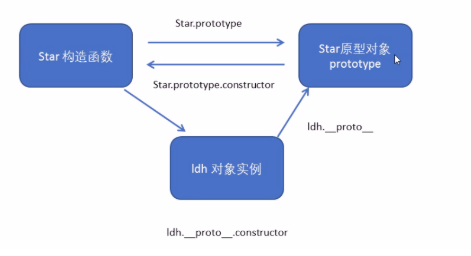
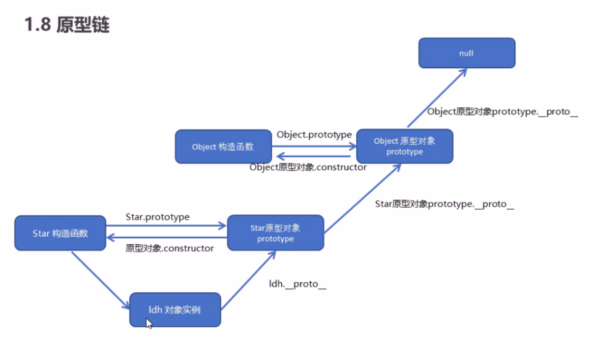

# JavaScript高级

## Function的原型方法和函数式编程

### call

> 替换方法的调用对象,函数主动执行的时候替换

```
语法:
方法.call(Obj,[arg1,[arg2,[arg2]]]),如果Obj为null,则不替换原方法调用对象
常用方式:
类数组使用数组方法:[].forEach.call(arguments,function(item,index){});
注意: DOM元素选择器获取的DOM列表只能使用不改变原数组的数组方法
借助Object原型上的toString方法判断object是否为数组:Object.prototype.toString.call(object) === ['object Array']
```

### apply

> 与call作用相同,只是参数应是数组的形式,函数主动执行的时候替换

```
语法:
方法.apply(obj,[arg1,arg2,arg3,....]);
arr = [1,2,3,4]
arr.push.apply(arr,[6,7,8]); => [1,2,3,4,6,7,8]//与直接push不同,相当于concat
```

### bind()

> 创建一个新函数,在**bind()被调用**的时候这个新函数的`this`被指定到`bind`的第一个参数,而其余参数将作为新函数的参数供调用时使用.
>
> 作用与call和apply相同,不同之处在于bind是在声明的时候指定替换对象,指定后替换对象不能通过call或apply更改,

```
语法:
方法.bind(thisArg,arg1,arh2,...)
返回值: 原函数的拷贝,只是内部this指向thisArg
用法:
function fn(ad){
	setTimeout(ad.bind(this),100)
} // 在定时器中改变函数的指向,因为call和apply是主动执行时改变this指向,所以使用call和apply相当于直接执行了该函数,因此使用bind,将改变this指向后的函数放在这里
```

### 柯里化函数

> 将一个多参数函数转换成多个单参数函数

```javascript
function currying(fn){
    const args = [].slice.call(arguments,1);
    const inlay = function() {
        if(arguments.length === 0){
            return fn.apply(this,args);//若参数为空时调用函数
        }
        if(arguments.length > 0){
            Array.prototype.push.apply(args,arguments) //参数长度不为0,拼接args和arguments
            return inlay
        }
    }
    return inlay;
}
//封装后就可以随便调用随便传参数
  function add() {
      const vals = Array.prototype.slice.call(arguments);
      return vals.reduce((pre, val) => {
        return pre + val;
      });
    }

    let newAdd = currying(add, 1, 2, 3);
    newAdd(4, 5);
    newAdd(6, 7)(6)(2, 3);
    console.log(newAdd()); //39
```

### 偏函数

> 固定一些函数参数,然后产生另一个更小元的函数(元便是参数的个数),将函数的数据与逻辑分离,使函数处理问题更加多样化
>
> bind的另一个常用方法是: 给函数预设初始参数,只要将这些参数作为bind()的参数写在`thisArg`之后,当绑定函数调用这些参数会被插入目标函数的参数列表的开始位置作为固定的初始值

```
function fn(){
	console.log([].slice.call(arguments)) //打印参数
}
做成偏函数
const AFN  = fn.bind(null,1,2,4);
AFN(4,5,6) => [1,2,4,4,5,6] //预设的参数已经传递进去
```

## 两大编程思想

1. 面向过程编程pop

   > 将问题按照步骤一步一步解决,像是一个士兵自己去做每一件事
   >
   > 前面我们处理事务的思想就是面向过程编程的思想

2. 面向对象编程oop

   > 将问题分解成一个一个对象让对象自己解决问题,像是将军根据不同需要创造不同的士兵
   >
   > 面向对象不是面向过程的替代而是面向过程的封装

## 面向对象编程OOP

> 任何一个具体到一个的事务都可以是对象
>
> js通过原型来模拟类的实现,本身是没有类这个概念的

#### 三大特性

1. 封装性

   > 把客观事务封装成抽象的类,并且类可以将属性和方法提供给另一个可信的类或对象进行操作

2. 继承性

   > 利用原型使一个引用类型继承另一个引用类型的属性和方法

3. 多态性

   > 基于对象所属的类不同,外部对同一个方法的调用实际执行的逻辑也不同

#### 函数的prototype

> 构造函数再实例化对象时会将函数中的方法也复制一份给实例对象,当实例化多个对象时会造成内存空间的浪费(大量空间存储相同的函数),为解决这一问题,使用另一个对象`prototype`来统一存储这些方法,并将构造函数的prototype属性指向该对象

- 构造函数的缺点:内存浪费的问题

  - 在实例化对象的时候,每实例化一个对象,都会开辟一个地址来存储,而构造函数中的方法属于复杂类型会专门在开辟一个地方存储,实例化多少个对象就会产生同样多个内存来存放同一个方法

    ```javascript
    function Star(name){
        this.name = name;
        this.sing = function(){
        console.log("唱歌")    
        }
    }
    let a = new Star("lo")
    let b - new Star("ll")
    console.log(a.sing === b.sing)//比较同一个构造函数的不同实例中同一个方法的内存地址,输出为false,说明这个方法存储在不同的内存空间
    ```

- prototype属性

  - 为了解决上述问题,js规定,每一个构造函数都有一个prototype属性,指向另一个对象(prototype对象),我们可以将一些不变的方法直接定义在prototype对象上,这样所有对象的实例就可以共享这些方法了.

    ```javascript
    Star.prototype.song = function (){//在原型对象上添加一些不变的公共的方法
        console.log("这是原型对象上的方法")
    }
    ```

  - 若一次添加多个方法:

    ```javascript
    不推荐使用
    Star.prototype = {
        方法一,
        方法二,
        方法三,
        .
        .
        .
        constructor:this//以对象的形式赋值,会覆盖掉原来的prototype所以要将constructor指回Star构造函数
    }
    ```

- prototype的contructor属性

  > 原型对象中的contructor属性会指回构造函数,以表明这是哪个函数的prototype属性

#### 对象的\_\_proto\_\_

> 当构造函数中的方法放进了prototype中时,实例化后的对象怎么访问这些方法呢?
>
> js在实例化对象的时候会隐式添加一个\_\_proto\_\_属性,它指向构造函数的prototype对象,便可以访问构造函数定义在prototype的方法了



就形成了上面的闭环,构造函数实例化出对象,对象的\_\_proto\_\_指向构造函数的prototype对象,

#### 原型链

> 即对象的成员查找规则: 当访问对象的某个属性/方法时,对象先在自身查找是否有该方法,若没有则通过\_\_proto\__向构造函数的prototype对象中访问,若还是没有,构造函数的prototype对象也是对象也有自己的\_\_proto\_\_属性指向上一级的构造函数的prototype对象,便向该对象中查找,直到找不到上一级原型对象prototype返回undefined



#### Function和Object的原型关系

> js中所有的对象都是Object的实例,所有的函数都是Function的实例

1. Object.\_\_proto\_\_ === Function.prototype

   ```
   let obj = new Object()
   ```

   > 如上当使用Object实例化一个对象时,这里的Object相当于构造函数
   >
   > 那么在这方面看Object就是Function实例化出的对象,则Object.\_\_proto\_\_指向Function的prototype对象,
   >
   > 因此返回true

2. Function.prototype.\_\_proto\_\_ === Object.prototype

   > Function作为构造函数其有prototype属性
   >
   > 因为prototype也是一个对象,那么他就是Object的实例,则实例的\_\_proto\_\_指向的是其构造函数的prototype
   >
   > 因此返回true

#### 原生继承方式

##### 1. 原型链继承

> 基本思想: 利用原型让一个引用类型继承另一个引用类型的属性和方法


**核心**：原型链对象 变成 父类实例，子类就可以调用父类方法和属性。


```js
function Parent() {
}
Parent.prototype.age = 18
Parent.prototype.getName = function () {
    return this.name
}

function Child(name) {
    this.name = name
}
Child.prototype = new Parent()

var child = new Child('leo')
// 这样子类就可以调用父类的属性和方法
console.log(child.getName())    // leo
console.log(child.age)          // 18

```

优点：**实现简单**

**缺点**：

1. 引用类型值的原型属性会被所有实例共享。
2. 不能向父类传递参数。


```js
function Parent() {
    this.likeFood = ['水果', '鸡', '烤肉']
}
Parent.prototype.age = 18
Parent.prototype.getName = function () {
    return this.name
}

function Child(name) {
    this.name = name
}
Child.prototype = new Parent()

var chongqiChild = new Child('重庆孩子')
var guangdongChild = new Child('广东孩子')

// 重庆孩子还喜欢吃花椒。。。
chongqiChild.likeFood.push('花椒')
console.log(chongqiChild.likeFood)      // ["水果", "鸡", "烤肉", "花椒"]
console.log(guangdongChild.likeFood)    // ["水果", "鸡", "烤肉", "花椒"]

```

这时，会发现明明只是 **重庆孩子** 爱吃花椒，**广东孩子** 莫名奇妙得也变得爱吃了？？？？这个共享是存在问题的，不科学的。（可能重庆孩子和广东孩子一起黑脸问号。。。）

至于第二个问题，其实也显而易见了，没有传递参数的途径。因此，第二种继承方式出来啦。


##### 2. 构造函数继承

**遗留问题**：

1. 父类引用属性共享。
2. 不能传参数到父类。

**核心**：子类构造函数内部调用父类构造函数，并传入 this指针。

```js
// 2. 借用构造函数
function Parent(name) {
    this.name = name
    this.likeFood = ["水果", "鸡", "烤肉"]
}
function Child(name) {
    Parent.call(this, name)
}
Parent.prototype.getName = function() {
    return this.name
}
var chongqingChild = new Child('重庆孩子')
var guangdongChild = new Child('广东孩子')
chongqingChild.likeFood.push('花椒')

console.log(chongqingChild.likeFood)    //  ["水果", "鸡", "烤肉", "花椒"]
console.log(guangdongChild.likeFood)    //  ["水果", "鸡", "烤肉"]
console.log(chongqingChild.name)        //  "重庆孩子"
console.log(chongqingChild.getName())   //  Uncaught TypeError: chongqingChild.getName is not a function

```

值得庆幸的是，这次只有我们 **重庆孩子** 喜欢吃花椒，**广东孩子** 没被标记爱吃花椒啦。并且，我们通过 call 方法将我们的参数也传入到了父类，解决了之前的遗留问题啦。

但是，**原型链继承** 是可以调用父类方法的，但是**借用构造函数**却不可以了，这是因为 当前子类的原型链并不指向父类了。因此，结合 第一，第二种继承方式，第三种继承方式应运而生啦。


##### 3. 组合继承

**核心：** 前两者结合，进化更高级。

```js
function Parent(name) {
    this.name = name
    this.likeFood = ["水果", "鸡", "烤肉"]
}
function Child(name, age) {
    Parent.call(this, name)
    this.age = age
}
Parent.prototype.getName = function() {
    return this.name
}
Child.prototype = new Parent()
Child.prototype.constructor = Child
Child.prototype.getAge = function() {
    return this.age
}

var chongqingChild = new Child('重庆孩子', 18)
var guangdongChild = new Child('广东孩子', 19)
chongqingChild.likeFood.push('花椒')

console.log(chongqingChild.likeFood)    // ["水果", "鸡", "烤肉", "花椒"]
console.log(guangdongChild.likeFood)    // ["水果", "鸡", "烤肉"]
console.log(chongqingChild.name)        // "重庆孩子"
console.log(chongqingChild.getName())   // "重庆孩子"
console.log(chongqingChild.getAge())    // 18

```

这样：

1. 原型引用类型传参共享问题
2. 传参问题
3. 调用父类问题都解决啦。

- Javascript 的经典继承。
- 但是有一个小缺点：在给 Child 原型赋值会执行一次Parent构造函数。所以，无论什么情况下都会调用两次父类构造函数


##### 4. 原型式继承

这是在2006年一个叫 道格拉斯·克罗克福德 的人，介绍的一种方法，**这种方法并没有使用严格意义上的构造函数**。

他的想法是 **借助原型可以基于已有的对象创建新对象，同时还不必因此创建自定义类型**。

这之前的三种继承方式，我们都需要自己写自定义函数(例如，Parent和Child)。假如，现在已经有一个对象了，并且，我也只是想用你的属性，不想搞得那么麻烦的自定义很多函数。那怎么办呢？

**核心**： 我们需要创建一个临时的构造函数，并将作为父类的对象作为构造函数的原型，并返回一个新对象。

```js
/*
    @function 实现继承 函数
    @param parent 充当父类的对象
*/
function realizeInheritance(parent) {
    // 临时函数
    function tempFunc() {}
    tempFunc.prototype = parent
    return new tempFunc()
}

```

核心点说了，我们来尝试一下。

```js
// 这个就是已有的对象
var baba = {
    name: "爸爸",
    likeFoods: ["水果", "鸡", "烤肉"]
}
/*
    var newChild = {} <==> baba  这两个对象建立关系就是这种继承的核心了。
*/
var child1 = realizeInheritance(baba)
var child2 = realizeInheritance(baba)
child1.likeFoods.push('花椒')
console.log(child1.likeFoods) //    ["水果", "鸡", "烤肉", "花椒"]
console.log(child2.likeFoods) //    ["水果", "鸡", "烤肉", "花椒"]

```

**我们可以发现，父类的属性对于子类来说都是共享的。所以，如果我们只是想一个对象和另一个对象保持一致，这将是不二之选。**


 ES5 新增了个 Object.create(parentObject) 函数来更加便捷的实现上述继承

```js
var baba = {
    name: "爸爸",
    likeFoods: ["水果", "鸡", "烤肉"]
}
var child1 = Object.create(baba)
var child2 = Object.create(baba)
child1.likeFoods.push('花椒')
console.log(child1.likeFoods) //    ["水果", "鸡", "烤肉", "花椒"]
console.log(child2.likeFoods) //    ["水果", "鸡", "烤肉", "花椒"]

```

效果和上面相同~


##### 5. 寄生式继承

这种继承是基于**原型式继承**，是同一个人想出来的，作者觉得，这样不能有子类的特有方法，似乎不妥。就用来一个种工厂模式的方式来给予子类一些独特的属性。


```js
function realizeInheritance(parent) {
    // 临时函数
    function tempFunc() {}
    tempFunc.prototype = parent
    return new tempFunc()
}
// Parasitic: 寄生的    inheritance： 继承    一个最简单的工厂函数。
function parasiticInheritance(object) {
    var clone = realizeInheritance(object)  // 这是用了原型式继承，但是只要是任何可以返回对象的方法都可以。
    clone.sayName = function() {
        console.log('我是'+this.name)
    }
    return clone
}
var baba = {
    name: "爸爸",
    likeFoods: ["水果", "鸡", "烤肉"]
}
var child = parasiticInheritance(baba)
child.name = '儿子'
child.sayName() // 我是儿子

```

缺点：使用寄生式继承来为对象添加函数，会由于不能做到函数复用而降低效率（每一个函数都是新的）；这一点与构造函数继承类似。


##### 6.寄生组合式继承

我们先回顾之前的 **组合继承**

```js
function Parent(name) {
    this.name = name
    this.likeFood = ["水果", "鸡", "烤肉"]
}
function Child(name, age) {
    Parent.call(this, name)         // 第二次调用
    this.age = age
}
Parent.prototype.getName = function() {
    return this.name
}
Child.prototype = new Parent()      // 第一次调用
Child.prototype.constructor = Child
Child.prototype.getAge = function() {
    return this.age
}

```

这个两次调用的问题之前有提及过。过程大致：

- 第一次调用，Child 的原型被赋值了 name  和 likeFood 属性
- 第二次调用，注入this，会在Child 的实例对象上注入 name 和 likeFood 属性，这样就屏蔽了原型上的属性。

知道了问题，我们就来解决这个问题~

```js
function Parent(name) {
    this.name = name
    this.likeFood = ["水果", "鸡", "烤肉"]
}
function Child(name, age) {
    Parent.call(this, name)
    this.age = age
}
Parent.prototype.getName = function() {
    return this.name
}

// Child.prototype = new Parent()  使用新方法解决
// Child.prototype.constructor = Child
inheritPrototype(Child, Parent)
function inheritPrototype(childFunc, parentFunc) {
    var prototype = realizeInheritance(parentFunc.prototype)   //创建对象,我们继续是用原型式继承的创建
    prototype.constructor = childFunc              //增强对象
    childFunc.prototype = prototype                //指定对象
}
function realizeInheritance(parent) {
    // 临时函数
    function tempFunc() {}
    tempFunc.prototype = parent
    return new tempFunc()
}

Child.prototype.getAge = function() {
    return this.age
}

var chongqingChild = new Child('重庆孩子', 18)
var guangdongChild = new Child('广东孩子', 19)
chongqingChild.likeFood.push('花椒')

console.log(chongqingChild.likeFood)    // ["水果", "鸡", "烤肉", "花椒"]
console.log(guangdongChild.likeFood)    // ["水果", "鸡", "烤肉"]
console.log(chongqingChild.name)        // "重庆孩子"
console.log(chongqingChild.getName())   // "重庆孩子"
console.log(chongqingChild.getAge())    // 18
```

这种方法的核心思想：

- 首先，用一个空对象建立和父类关系。
- 然后，再用这个空对象作为子类的原型对象。

这样，中间的对象就不存在new 构造函数的情况(这个对象本来就没有自定义的函数)，这样就避免了执行构造函数，这就是高效率的体现。并且，在中间对象继承过程中，父类构造器也没有执行。所以，没有在子类原型上绑定属性。

这种继承方式也被开发人员普遍认为是引用类型最理想的继承范式。

##### 总结

- 模式(简述)：
  - 工厂模式：创建中间对象，给中间对象赋添加属性和方法，再返回出去。
  - 构造函数模式：就是自定义函数，并用过 new 关键子创建实例对象。缺点也就是无法复用。
  - 原型模式： 使用 prototype 来规定哪一些属性和方法能被共享。
- 继承
  - 原型链继承:
    - 优点：只调用一次父类构造函数，能复用原型链属性
    - 缺点：部分不想共享属性也被共享，无法传参。
  - 构造函数继承：
    - 优点：可以传参，同属性可以不被共享。
    - 缺点：无法使用原型链上的属性
  - 组合继承
    - 优点：可以传参，同属性可以不被共享，能使用原型链上的属性。
    - 缺点：父类构造函数被调用2次，子类原型有冗余属性。
  - 原型式继承：(用于对象与对象之间)
    - 优点：在对象与对象之间无需给每个对象单独创建自定义函数即可实现对象与对象的继承，无需调用构造函数。
    - 缺点：父类属性被完全共享。
  - 寄生式继承：
    - 优点：基于原型式继承仅仅可以为子类单独提供一些功能(属性)，无需调用构造函数。
    - 缺点：父类属性被完全共享。
  - 寄生组合继承：
    - 优点：组合继承+寄生式继承，组合继承缺点在于调用两次父类构造函数，子类原型有冗余属性，寄生式继承的特性规避了这类情况，集寄生式继承和组合继承的优点与一身，是实现基于类型继承的最有效方式。

#### 原型的判断

> 在之前\_\_proto\_\_是非标准属性,我们无法使用,一般采用下面的方法判断一个实例的原型对象是谁

##### isPrototypeOf()

> 判断实例对象的_\_proto\_\_是否指向构造函数的prototype,
>
> 只要而调用者存在传入参数的原型链上都会返回true

```
Array.isPrototypeOf(arr) => true
```

##### Object.getPrototypeOf()

> 返回一个实例的_\_proto\_\_,

```
Object.getPrototypeOf(arr) === Array.prototype
```

### hasOwnProperty()

> 判断对象某属性是自身属性还是原型上的属性,若是自身属性则返回true

```
let P = {
	a:1,
	b:2
}
P.prototype.c = 4
let p1 = new P()
p1.hasOwnProperty(a) 输出true
p1.hasOwnProperty(c) 输出false,c是原型上定义的属性
```

### in

> 判断某个属性是否在对象上无论自身还是原型上只要存在就返回true

```
以前判断属性是否存在 !!p[key]
当p对象的中key属性的值可以隐式转换为false是这种判断方法是不准确的
以后可以使用in来判断一个属性是否在对象上
```

## Object高级方法

> Object对象的属性有两种:
>
> - 可枚举
>   - 如正常创建对象时添加的属性
> - 不可枚举
>   - 如数组的length属性和\_\_proto\_\_属性
>
> 对象的属性都有一个描述对象,用来控制该属性的行为

#### Object.getOwnPropertyNames()

> 返回一个由指定对象的所有自身属性的属性名构成的数组,包括不可枚举属性但不包括Symbol值作为名称的属性

#### Object.getPrototypeOf(obj)

> 返回指定对象的原型(内部[[prototype]]的值)

#### Object.isPrototypeOf(obj)

> 判断一个对象是否在另一个对象的原型链上,以前_\_proto__不支持访问的时候用该方法来判断,一个对象是否是另一个对象的实例

#### Object.getOwnPropertyDescriptor()

> 获取某对象的指定属性的描述对象

```
Object.getOwnPropertyDescriptor(obj,name)
```

#### Object.getOwnPropertyDesxriptors(obj)

> 返回对象所有自身属性的描述符

#### Object.create(obj)

> 创建一个新对象使用现有的对象来提供新对象的\_\_prort\_\_,

#### Object.freeze(obj)

> 冻结指定对象,被冻结后该对象只能被访问,其他修改添加删除属性都不能做

#### Object.isFrozen(obj)

> 判断一个对象是否被冻结

#### Object.isSealed(obj)

> 判断一个对象是否被密封

#### Object.defineProperty()

> 在一个对象上定义或修改一个属性的描述对象,get,set.

```
let emp = 0;
Object.defineProperty(obj,name,{
	configurable:true, //是否可配置,默认false
	enumerable: true,//是否可枚举,默认false
	value: 值,//可选属性,设置对象的属性值,默认undefined
	writable: true// 可选属性,是否可写,默认false
	set(newValue){
		emp = newValue
		//修改该属性的时候会触发set,在这里不能直接修改该属性的值,应在外定义一个变量,修改变量的值否则会循环出发set
	},
	get(){
		return emp
		//属性被访问时触发,return值便是函数值
	}
	注意:get,set和value,writable这两个属性不能同时存在
})
```

##### 封装

```
function define(obj,key,value){
  Object.defineProperty(obj,key,{
    get() {
      return value
    },
    set(newValue) {
      value = newValue
    }
  })
}
```

#### Object.definePropertys()

> 一次设置多条属性值

```
var obj = {};
Object.defineProperties(obj, {
  'property1': {
    value: true,
    writable: true
  },
  'property2': {
    value: 'Hello',
    writable: false
  }
  // etc. etc.
});
```

#### Object.entries()

> 将对象转化为数组

```
let obj = {
	a:1,
	b:2
}
Object,entries(obj) ==>输出:[[a,1],[b,2]]
实例2:
for (const [key, value] of Object.entries(object1)) {
  console.log(`${key}: ${value}`);
}
```

#### Object.fromEntries()

> 将数组转化为对象,与上一个相呼应

```
const map = new Map([ ['foo', 'bar'], ['baz', 42] ]);
const obj = Object.fromEntries(map);
console.log(obj); // { foo: "bar", baz: 42 }
```

#### Object.preventExtensions()

> 使对象变得不可扩展,也就是永远不能再添加新的属性,只能修改属性值和删除属性

#### Object.isExtensible()

> 判断是否可扩展若不可扩展,返回false

### 深/浅拷贝

> 在引用类型的复制时,默认是传址,无法与原来的值切断联系,我们想复制出两个毫无关系的引用数据类型的数据是需要通过一些特殊方法

#### 浅拷贝

```
Object.assign({},o) 浅拷贝
直接=
```

#### 深拷贝

```
第一种:不能拷贝函数,因为函数不能转换为JSON对象
JSON.parse(JSON.stringify(obj))
第二种:递归
function deepCopy(obj){
  if(Array.isArray(obj)){
    return newArr = obj.map(item => deepCopy(item))
  }
  if(typeof obj === "object" && obj !== null){
    return Object.entries(obj).reduce((acc,[key,value]) => (acc[key] = deepCopy(value),acc),{})
  }
  return obj;
}
```

### 链式判断运算符

> 问号前面的存在才执行后面的语句,用于变量属性的访问,函数的执行

```
obj?.name obj存在才访问name的属性值
fn?.()    fn函数存在才执行该函数
```

