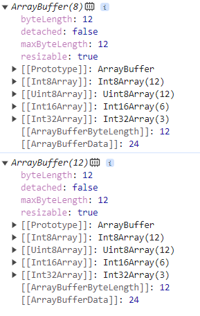

通过JavaScript高级程序设计这本书,回归js

## 语言基础

### 严格模式

在ECMA5新增了严格模式的概念,是一种不同的JavaScript解析和执行模型,ECMA3中的不规范写法会进行处理,对于不安全的绘画会话将抛出错误

启用严格模式

- 整个脚本: 

  ```js
  在整个脚本第一行添加: 
  "use strict"
  ```

- 单个函数

  ```js
  在函数内部第一行添加: 
  "use strict"
  整个函数就会按照严格模式进行解析和处理
  ```

#### 严格模式的注意点

- this

  this默认执只指向undefined,而不是window

- [八进制](####Number类型)

### 变量

#### 变量声明

变量声明分为三个阶段: 

1. 创建:在内存中开辟空间
2. 初始化: 将变量初始化为undefined
3. 赋值: 真正的赋值

#### var

- 作用域: var声明的作用域范围为函数作用域
- 变量提升: var声明的变量存在变量提升(声明语句默认提升至作用域顶部)
  - 准确的说var声明的变量**创建**,**初始化**两个阶段被提升了

#### let

- 作用域: let声明的变量作用域为块级作用域(一对花括号)
- 变量提升: let声明的变量不会在作用域中提升
  - 准确的说let声明的变量**创建**阶段被提升了,但初始化没有提升,由于暂时性死区的存在我们无法直观的感受到变量提升的效果
- 同一个作用域不能重复声明

#### const

- 和let类似唯一不同是: const声明时必须赋值,且赋值之后不能修改
  - const实际上保证的是变量的引用地址不变,因此const声明的引用数据类型是可以修改变量的属性或元素的

#### 声明的最佳实践

const一把梭,梭不下去了,回头改成let,绝不用var

### 数据类型

#### Null类型

null值表示的是一个空对象的指针,这也是为什么`typeof null`返回`object`的原因,在`你不知道的javascript`一书中是这样解释的: 不同的对象在底层都表示为二进制,在javascript中二进制的前三位都为0的就会判断为`object`,`null`的二进制表示全是0因此`typeof null `返回`object`

#### Number类型

js使用IEEE 745格式表示整数和浮点数,证实使用了这种格式才会出现`0.1+0.2 !== 0.3`的情况,所有使用这种格式的语言都存在这个问题

- 十进制
- 十六进制
- 八进制: 开头必须是0,严格模式下,前缀0被识别为语法错误,后面的数值超过应用的范围会以十进制进行识别,es6中八进制通过0o前缀进行识别

##### 浮点数:

- 由于浮点数使用的内存空间是整数的两倍,js在存储浮点数时总是优先转换成整数进行存储
  - 1.0 => 小数点后面没有数字,当成1来处理
  - 10.0 => 同上当作10来处理

- 浮点数精度最高17位,远不如整数精确
- 科学计数法使用`e`来表示,前面是数值,后面是次幂: `let floatNum = 3.12e10`3.12乘以10的10次方

##### 值的范围

- 最大值: Infinity
- 最小值: -Infinity
- 要确定一个数字是不是有限大可以使用**isFinite()**,超出范围返回`false`

##### 类型转换

> 使用Number(),parseInt(),parseFloat()将非Number类型转换为Number

- Number()转换规则

  - 布尔: true转换为1,false转换为0
  - 数值: 直接返回
  - undefined: 返回NaN
  - null: 返回0
  - 字符转
    - 如果是包含有效的数值字符的字符串(包含前面的正负号),忽略前面的0转换成十进制
    - 如果是包含有效的十六进制格式的字符,转换成16进制对应的十进制
    - 空字符: 返回0
    - 如果包含上述情况之外的字符,返回NaN
  - 对象: 先调用valueOf()方法,并按照上述规则进行转换,若转化结果为NaN,则调用toString()方法再将结果按照上述规则转换并返回

- parseInt()转换规则

  > parseInt转换规则更专注于字符串是否包含数值模式,同时会忽略前面的空格,从第一个非空字符按照下面的规则开始转换

  - 若不是数值,正好,负号,返回NaN

  - 若是数值,则继续转换第二个字符,知道遇到非数值或者转换完毕,返回转换好的整数

  - 同时parseInt()接受第二个参数来指定进制数(大于1小于36),会按照进制数进行转换,默认为十进制,超过范围返回NaN

    - ```js
      经典面试题: 
      [1,2,3].map(parseInt) 输出 [1, NaN, NaN]
      过程如下: 
      实际上parseInt的参数是这样的: 
       [1, 0, Array(3)]
       [2, 1, Array(3)]
       [3, 2, Array(3)]
      执行情况是这样: 
      parseInt(1,0) 进制数为0,十进制,返回1
      parseInt(2,1)进制数为1,不在范围,返回NaN
      parseInt(3,2)进制数为2,但3不是二进制数字,无法转换返回NaN
      ```

- parseFloat()转换规则

  > 与parseInt()转换规则相似,但是其没有第二个参数

#### String类型

ECMAScript中的字符串是不可以改变的,一旦创建,后续修改的时候必须先销毁原始字符串,然后将新值保存到变量中,这也是早期(IE6)浏览器处理字符串拼接慢的原因

##### 转换字符转

- toString()方法

  - 几乎所有的值都有这个方法,null和undefined除外,其作用就是返回当前值的字符串等价物
  - 在对数值掉调用这个方法的时候,可以接受一个底数作为参数: 表示以什么底数输出数值的字符串表示,2进制?十进制? 八进制?等,m默认是十进制

- String()

  > 转换规则如下

  - 如果值有toString方法,则调用该方法并返回结果
  - 如果是null,返回'null'
  - 如果是undefined,返回'undefined'

##### 模板字符串

- 标签函数

  > 模板字符串的高级用法,将一个普通函数以前缀在模板字符串之前的方式,来执行自定义的插值行为,
  >
  > 标签函数接收的第一个参数是原始字符串数组(插值为空字符串),其余参数是对每个插值表达式的求值结果

  ```js
  const simpleTag = (strs, ...arr) => {
    console.log('arr:', arr);
    console.log('strs:', strs);
    return 'hello'	
  };
  
  const result = simpleTag`${1}${2}+${3}`;
  //输出
  //arr: [ 1, 2, 3 ]
  //strs: [ '', '', '+', '' ]
  console.log(result);
  //输出
  // hello
  
  //封装使其生成原有的表达式
  const simpleTag = (strs, ...arr) => arr.reduce((acc,curr,i) => acc + curr + strs[i+1],strs[0])
  ```

  - 使用场景: 

    1. xss防护

       ```js
       const againstXss = (strings, ...arr) =>
         arr.reduce(
           (acc, curr, i) =>
             acc + curr?.replace(/</g, '&lt;').replace(/>/, '&gt;') + strings[i + 1],//replqace more
           strings[0]
         );
       ```

    2. 文本高亮等

- 获取原始字符串

  > 使用默认的String.raw标签函数可以获取到原始模板字面量的内容,而非转换后的

  ```js
  console.log(`one\ntwo`)
  //one
  //two
  console.log(String.raw`one\ntwo`)
  //one\ntwo
  ```

  也可使用标签函数第一个参数,即字符串数组的`.raw`属性,获取到数组元素的原始内容

  ```js
  const simpleTag = (strs, ...arr) => {
    strs.raw.map((item) => console.log(item));
  };
  ```

#### Symbol类型

符号,基本数据类型,唯一不可变,主要用途是确保对象属性使用唯一的标识符,使用`Symbol()`函数来进行初始化,函数接收一个字符串作为参数叫做符号描述,该参数只是方便开发人员辨认,与符号定义无关

```js
const sym1 = Symbol()
const sym2 = Symbol()
sym1 === sym2 //false
//带有符号描述的符号
const sym3 = Symbol("描述")
```

##### 全局符号注册表

当需要共享使用同一个符号时,可以通过`Symbol.for()`方法以一个字符串作为键,在全局符号注册表中创建并重用符号

```js
const sym1 = Symbol.for("one")
const sym2 = Symbol.for("one")
console.log(typeof sym1) //Symbol
console.log(sym2 === sym1); //true
```

上述sym1与sym2输出为true的原理是: Symbol.for()对每个字符串执行幂等操作,同一个字符串无论执行多少次都和执行一次结果相同.第一次执行时,Symbol.for()会先检查全局运行时注册表,发现不存在这个符号就创建并添加到注册表中,否则就返回存在的

使用`Symbol.keyFor()`查询全局注册表,改方法接收符号返回对应的字符串键,若查询的不是全局符号返回`undefined`,若传递的不是符号会抛出错误:

```js
const sym1 = Symbol.for('one');
const sym2 = Symbol.for('one');

console.log(Symbol.keyFor(sym1)); //one
```

##### 使用符号作为属性

凡是字符串,数字可以作为属性的地方,都可以使用符号作为属性,对象字面量只能使用计算属性语法将符号作为属性

```js
const sym1 = Symbol('one');
const obj1 = {
  [sym1]: 1,
};
console.log('obj1:', obj1);
//obj1: { [Symbol(one)]: 1 }

const sym2 = Symbol('two');
const obj1 = {
  sym2: 1,
};
console.log('obj2:', obj2);
//obj2: { sym2: 2 }
```

##### 与符号相关的其他方法

- Object.getOwnPropertySymbols(),获取对象实例自身的符号属性数组
- Object.getOwnPropertyDescriptors(),获取自身包含常规属性和符号属性描述符的对象
- Reflect.ownKeys(),获取自身对象实例两种类型的键

```js
const sym1 = Symbol('one');
const sym2 = Symbol('two');

const obj1 = {
  [sym1]: 1,
  [sym2]: 2,
  a: 3,
};
obj1.__proto__.f = () => {
  console.log(1);
};

console.log(Object.getOwnPropertySymbols(obj1));
console.log(Object.getOwnPropertyDescriptors(obj1));
console.log(Reflect.ownKeys(obj1));

//[ Symbol(one), Symbol(two) ]
//{
//  a: { value: 3, writable: true, enumerable: true, configurable: true },
//  [Symbol(one)]: { value: 1, writable: true, enumerable: true, configurable: true },
//  [Symbol(two)]: { value: 2, writable: true, enumerable: true, configurable: true }
//}
//[ 'a', Symbol(one), Symbol(two) ]
并不会获取原型上的属性
```

##### JavaScript内置的符号属性

> 这些内置的符号属性用于暴露语言内部的行为,每个内置符号属性对应都有内置方法(如Symbol.hasInstance属性对应的就是instaceof方法).开发者可以直接访问,覆盖,模拟这些方法,注意**这些内置符号属性是不可写,不可枚举,不可配置的**
>
> ```js
> Function.prototype[Symbol.hasInstance] = () => {
>   return false;
> }; 重写不会生效
> ```
>
> **内置属性最重要的用途就是重新定义他们**,经典面试题:如何使用for-of遍历对象,就可以在自定义对象上实现`Symbol.iterator`的值,来改变for-of迭代对象时的行为

- Symbol.asyncIterator

  在ECMAscript规范中,这个符号属性表示一个方法: 返回对象默认的AsyncIterator对象,由for-await-of循环使用.`Array,Map,Set,String`默认实现该接口

  asyncItreator是js的一个接口,用于支持异步迭代操作,该接口由`[Symbol.asyncIterator]`符号进行标识,由通过`async function*(){}`语法定义的异步生成器函数实现,异步生成器函数内部可以使用`yield`关键字来产生值,这些值会逐一返回给迭代器的调用方.

  - 异步生成器函数的默认返回值是生成器实例,循环时js内部会自动调用这个函数来获取生成器实例然后进行迭代,生成器函数详解请参阅Symbol.iterator内置属性部分

  ```js
  要创建一个支持asyncIterator的对象,需要为这个对象定义[Symbol.asyncIterator]属性,并将该属性赋值为一个异步生成器函数,在该函数中通过yield产生值,并将值返回给迭代器的调用方.
  
  const asyncIteratorObj = {
    [Symbol.asyncIterator]: async function* () {
      yield 'hello';
      yield 'async';
      yield 'iterator';
    },
  };
  实现了这个接口就可以通过异步迭代器迭代该对象
  const autoIteration = async (obj) => {
    for await (const item of obj) {
      console.log(item);
    }
    //下面的循环与上面的循环是等价的
    //const iterator = asyncIteratorObj1[Symbol.asyncIterator]();
    //for await (const a of iterator) {
      //console.log(a);
    //}
  };
  autoIteration(asyncIteratorObj); //依次输出hello,async,iterator
  //修改以下生成器,让他每次产生的值为一个异步
  const asyncIteratorObj1 = {
    [Symbol.asyncIterator]: async function* () {
      yield new Promise((resolve) => setTimeout(() => resolve(1), 1000));
      yield new Promise((resolve) => setTimeout(() => resolve(2), 2000));
      yield new Promise((resolve) => setTimeout(() => resolve(3), 3000));
      yield new Promise((resolve) => setTimeout(() => resolve(4), 4000));
    },
  };
  autoIteration(asyncIteratorObj1);
  //1s后打印 1
  //打印1后,2s后打印2 依次类推
  由此可见我们通过定义[Symbol.asyncIterator]属性,实现了异步迭代一个对象
  ```

  - next()方法: 上述代码中通过异步迭代器我们实现了自动异步迭代,那如何手动进行异步迭代呢?`asyncIterator`接口提供了`next()`方法以便于我们可以手动获取下一次异步迭代的值,调用`next`方法返回的是一个`Promise`该`Promise`会在就绪时返回一个对象`{value: 值,done:是否迭代已经完成}`

    ```js
    const asyncIteratorObj = {
      [Symbol.asyncIterator]: async function* () {
        yield new Promise((resolve) => setTimeout(() => resolve(1), 1000));
        yield new Promise((resolve) => setTimeout(() => resolve(2), 2000));
        yield new Promise((resolve) => setTimeout(() => resolve(3), 3000));
        yield new Promise((resolve) => setTimeout(() => resolve(4), 4000));
      },
    };
    const manualIteration = async () => {
      const iterator = asyncIteratorObj[Symbol.asyncIterator]();//通过异步生成器本身获取到异步生成器实例
      iterator.next().then((data) => console.log(data));
      const res = await iterator.next();
      console.log('res:', res);
    };
    manualIteration();
    //{ value: 1, done: false }
    //res: { value: 2, done: false } 若done属性为true,标识对象已经迭代完毕,这里我们只迭代到2,还未迭代完成所以是false
    ```

- Symbol.hasInstance

  根据ECMAScript规范,这个符号作为一个属性表示: 一个方法,该方法决定一个构造器对象是否认可一个对象是它的实例,由`instanceof`操作符使用.这个属性定义在`Function`原型上,因此所有的函数和类都可以调用,`instanceof`操作符可以用来确定一个对象实例的原型链上是否有原型.

  ```js
  class A {}
  const a = new A();
  //下面的使用方式是等价的
  console.log(a instanceof A); //true
  console.log(A[Symbol.hasInstance](a)); //true
  
  //根据原型链的特性,可以在构造函数中重覆盖[Symbol.hasInstance]方法,实现自定义的instanceof行为
  class B {
    static [Symbol.hasInstance]() {
      return false;
    }
  }
  const b = new B();
  console.log(b instanceof B); //false
  console.log(B[Symbol.hasInstance](b));//fasle
  ```

- Symbol.isConcatSpreadable

  该内置属性为一个布尔值,用以配置一个对象被用作`Array.prototype.concat()`的参数时是否展开其元素.

  - 对于数组对象作为该参数时,默认按照数组元素展开然后进行连接.
  - 对于类数组对象作为该参数时,默认该对象整体作为新数组元素进行连接

  通过修改内置属性可以修改`concat`的行为

  ```js
  const arr1 = [1, 2, 3];
  const arr2 = [5, 6, 7, 8];
  console.log(arr1.concat(arr2)); //[1, 2, 3, 5,6, 7, 8]
  arr2[Symbol.isConcatSpreadable] = true;
  console.log(arr1.concat(arr2)); //[1, 2, 3, 5,6, 7, 8]
  arr2[Symbol.isConcatSpreadable] = false;
  console.log(arr1.concat(arr2)); //[ 1, 2, 3, [ 5, 6, 7, 8, [Symbol(Symbol.isConcatSpreadable)]: false ] ]
  
  const obj1 = {
    a: 1,
    b: 2,
  };
  console.log(arr1.concat(obj1)); //[ 1, 2, 3, { a: 1, b: 2 } ]
  obj1[Symbol.isConcatSpreadable] = false;
  console.log(arr1.concat(obj1)); //[ 1, 2, 3, { a: 1, b: 2, [Symbol(Symbol.isConcatSpreadable)]: false } ]
  obj1[Symbol.isConcatSpreadable] = true;
  console.log(arr1.concat(obj1)); //[ 1, 2, 3 ]
  ```

- Symbol.iterator

  该内置属性表示: 一个方法,方法返回对象默认的迭代器,由`for-of`语句使用.值为一个生成器函数.一些数据类型用于默认的迭代器行为,可以直接使用`for of`进行迭代: `Array,String,Map,Set`,其他的类型则没有: `Object`

  -  生成器函数

    - 生成器函数由`function*`语法定义,包含`yeild关键字`用于指定函数的暂停点,第一次调用生成器函数时不会执行函数的任何代码,而是返回一个称为`Generator `的迭代器,该迭代器通过`next()`方法来控制生成器函数的执行,
    - yeild:该关键字只能在生成器函数中使用,当生成器函数执行到`yeild`时,会暂停生成器函数的执行,并将`yeild`后面表达式的值作为生成器函数的当前暂停状态,返回给`next()`函数
    - next(): 是`Generator `迭代器的方法用于控制生成器函数的执行,迭代器调用`next()`时,生成器函数会执行,直到遇到`yeild`关键字,然后暂停,并把`yeild`生成的值进行返回,返回值固定为两个属性`{value,done}`,`vaule`的值是`yeild返回的值`,`done`表示迭代是否完毕`ture`表示迭代完毕.`next()`方法可以接受一个参数，该参数会成为生成器函数中上一个 `yield` 表达式的返回值。

  - 实现可迭代对象

    ```js
    let obj2 = {
      name: 'qqq',
      age: 12,
      sex: '男',
    };
    obj2[Symbol.iterator] = function* () {
      let index = 0;
      let arr = Object.keys(obj2);
      while (index < arr.length) {
        yield arr[index];
        index++;
      }
    };
    for (const key of obj2) {
      console.log(key);
    }
    ```
    

- Symbol.match

  这个符号作为属性表示: 一个正则表达式方法,该方法用正则表达式去匹配字符串,由`String.prototype.match()`方法使用.`String.prototype.match()`会使用以`[Symbol.match]`为键的函数来对正则表达式求值,正则表达式的原型上默认有这个函数的定义,因此所有正则表达式实例默认是这个`String`方法的有效参数.

  ```js
  RegExp.prototype[Symbol.match] //f[Symbol.match](){[native code]}
  实际上string.match()求值的时候就是调用的而正则表达式原型上的[Symbol.match]方法
  ```

  该方法接收一个正则表达式为参数,若传递的式非正则表达式会导致该值转换成正则表达式再求值.可以通过重新定义`Symbol.match`以取代默认的行为,使match()方法使用非正则表达式实例

  ```js
  class Test {
    static [Symbol.match](target) {
      return target.includes('regex');
    }
  }
  
  console.log('this is regex'.match(Test)); //true
  ```

- Symbol.replace ,Symbol.search,Symbol.split与Symbol.match相同,正则表达式的原型上默认有这个些函数,调用`replace,search,split`方法时,实际上调用的是正则表达式原型上对应的内置属性的方法

- Symbol.species

  表示一个函数值,该函数作为派生对象时的构造函数,主要用于控制派生对象的构造,在进行构造函数的操作时(如map ,filter)会触发该函数,确保派生对象的类型与原始对象的类型一致,,静态获取器(getter): 当访问属性时会自动调用调用该函数来返回值.用`Symbol.species`定义静态的获取器(getter)方法,当访问`Symbol.species`属性时,自动调用getter方法返回对象类型,确保类型一致性

  ```js
  class B extends Array {
    static get [Symbol.species]() {
      return Array;
    }
  }
  const b = new B();
  console.log(b instanceof Array);//true
  console.log(b instanceof B); //true
  const newB = b.map(() => 1); //进行一下操作
  console.log(newB instanceof Array); //true
  console.log(newB instanceof B); //false
  ```

- Symbol.toPrimitive

  该内置属性是一个方法用于控制自定义对象转换为原始值时的行为,许多内置操作都会尝试将对象转换成原始值(数字,字符串以及未指定的类型),该方法接收一个字符串参数,可以是`string`,`number`,`default`即对象转换的目标类型

  ```js
  const obj1 = {
    [Symbol.toPrimitive](target) {
      if (target === 'string') {
        return 'string';
      }
      if (target === 'number') {
        return 1;
      }
      return 'default';
    },
  };
  const obj2 = {};
  
  console.log(Number(obj1)); //1
  console.log(Number(obj2)); //NaN
  
  console.log(String(obj1)); //string
  console.log(String(obj2)); //[object object]
  
  console.log(3 + obj1); //3default
  console.log(3 + obj2); //3[object object]
  ```

- Symbol.toStringTag

  该内置属性的值是一个字符串,作为对象的默认字符串描述,由`Object.prototype.toString()`使用,通过`toString()`方法获取对象标识的时候,会检索该属性的值,默认为`object`

  ```js
  const obj = {
    [Symbol.toStringTag]: '啥也不是',
  };
  console.log(obj.toString()); //[object 啥也不是]
  ```

- Symbol.unscopables

  该属性值是一个对象,该对象的属性都会从关联对象的`with`环境中排除,设置这个符号并将其映射对应的属性的键值为`true`,就能阻止该属性出现在`with`环境中了,

  ```js
  const obj = {foo: 'bar'}
  with(obj){
      console.log(foo) //bar
  }
  obj[Symbol.unscopables] = {
      foo: true
  }
  with(obj){
      console.log(foo) //ReferenceError
  }
  ```

  - with简介

    ```js
    `with` 是 JavaScript 中的一个语句，用于创建一个临时的作用域，以便在其中访问指定对象的属性，而不必使用该对象的名称前缀。尽管 `with` 在某些情况下可能方便，但它已被视为不推荐使用，并且在严格模式下是禁止的。
    `with` 语句的基本语法如下：
    with (object) {
      // 在这个作用域内可以直接访问 object 的属性
      // 不需要使用对象名称前缀
      // 例如，可以直接访问 object.property
    }
    在 `with` 语句的作用域中，你可以直接访问指定对象的属性，而不必在每次访问时重复指定对象的名称。这可以使代码更简洁，但也引入了一些潜在的问题，因此 `with` 被视为不安全和难以调试。
    潜在问题包括：
    1. 作用域歧义：`with` 可能会引入变量名冲突，因为在 `with` 语句块中的标识符会首先在指定对象的属性中查找，然后才在外部作用域中查找。这可能导致意外的行为。
    2. 性能问题：`with` 语句可能会导致 JavaScript 引擎在执行时难以优化代码，因此可能会导致性能下降。
    3. 调试困难：在使用 `with` 时，调试器可能无法正确显示变量的值，因为作用域被改变了。
    由于这些问题，通常不推荐使用 `with` 语句，而应该使用明确的对象引用来访问属性，以使代码更可读、可维护和可预测。在严格模式下，`with` 语句是禁用的，无法使用。
    ```

### 语句

#### 标签语句

标签语句用于给代码块添加标签,方便代码跳转和控制循环

语法:

```js
标签: js代码

start: const num = 0
```

- 使用标签语句结合break跳出双层循环

```js
let num = 0;
start: for (let a = 0; a <= 10; a++) {
  for (let b = 0; b <= 10; b++) {
    if (a === 0 && b === 10) {
      break start; //break只能跳转到封闭语句的标签,如for,while,do..while等
    }
    num++;
  }
}
console.log(num); //10,如果没有使用标签语句直接break,会输出120
```

## 变量,作用域和内存

### 原始值和引用值

原始值: `Undefined,String,NUmber,Boolean,Null,Symbol`,保存在栈内存中.按值访问,变量存储的是值

引用值: `Object`,保存在堆内存中,按引用访问,变量存储的是对象在堆内存的地址,

#### 复制

原始值: 复制是深拷贝,会在栈内存中重新开辟一个空间

引用值:复制是浅拷贝,会在栈内存中重新开辟空间来存放指针,指向的还是堆内存中原来的变量

#### 作为参数

ECMAscript中所有函数的参数都是**按值传递**,如果是原始值那么就跟原始值的复制一样,如果是引用值就和引用值的复制一样

#### 执行上下文和作用域

- **执行上下文用于确定变量什么时候释放内存**,执行上下文有三种: 全局执行上下文,函数执行上下文和块级上下执行上下文,它决定了变量和函数可以访问哪些数据,每个上下文都有一个`变量对象`,这个对象包含了这个上下文中定义的所有变量和函数,全局执行上下文是最外层上下文,在浏览器中`window`对象就是全局上下文,因此所有通过`var`定义的变量和函数都会成为`window`上的属性

  ```js
  function showContext(){
      cosnt a = 1;
      const b = 2
  }
  上述函数的上下文中的变量对象大概是这样: 
  变量对象: {
      a:1,
      b:2,
  }
  
  ```

- 执行上下文栈: 当代码执行的时候由上下文栈控制代码执行流:程序由上至下,执行上下文依次入栈,执行完毕后出栈并销毁,直到最后全局执行上下文出栈,程序执行完毕

- 存储变量,查找变量的规则就是作用域,**作用域链用来搜索变量和函数**,作用域链: 上下文中的代码执行的时候会根据变量对象创建作用域链,他决定着各级上下文中代码在访问变量和函数时的顺序,其会沿着作用域链逐级搜索标识符,搜索过程始终从当前作用域**开始逐级向外查找**,若没找到通常会报错.**作用域链是单项向静态的,只跟代码定义的地方有关**

  ```js
  var a =1;
  function fn1(){
      const b = 2
      function fn2(){
          const b = 2
          const c = 3
      }
      fn2()
  }
  fn1()
  上述作用域链可以这样理解: 
  {
      window变量对象: {
          a:1
          fn1变量对象: {
              b: 2,
              fn2变量对象: {
                  b:2
                  c:3
              }
          }
      }
  }
  变量查找是单向的只能由内向外查找
  ```

### 垃圾回收

在js中开发者不需要跟踪内存,由js来负责代码执行时的内内存管理,通过自动内存管理实现内存的分配和闲置资源所占内存的回收.基本思路: 确定哪个变量不会再使用,然后释放它占用的内存,周期性的执行上述步骤.

有两个关键点: 哪些变量可以回收?什么时候进行回收?

#### 哪些变量可以回收

最常用的回收策略是**标记清理**

##### 引用计数算法

这是最初的垃圾收集算法,此算法将`对象是否不再需要`简化定义为`对象有没有其他对象引用到它`,每一个值都记录它的引用次数,A对象被B变量引用,那么A对象的计数器就+1,如果A对象又被C对象引用,那么A对象的计数器就是2,同样如果C变量的值被其他对象覆盖,相应的A对象的计数器就-1,依次类推,当一个对象的计数器是0时,在下次垃圾回收周期就会被释放掉

这种算法思路简单但存在两个很大的问题: 

- 计数器消耗过大: 每个对象都需要一个计数器,而且也不知道计数器的引用上限是多大,导致计数器需要占很大的内存
- 循环引用: 这是最致命的,当两个对象相互引用的时候,这两个对象的计数器永远不会是0,就导致这两个对象永远无法回收

这种算法已经被淘汰了

##### 标记清理算法

这种方式是目前最常用的方式,这种算法把`对象是否不再需要`简化定义为`对象是否可以获得`,其主要思路是: 

1. 垃圾回收程序运行时,会将所有变量打上标记,
2. 从根对象(包括window,document但不限于)对上下文中的变量,以及变量引用的变量的标记去掉,表示不能回收,
3. 清理所有带标记的,然后将所有的变量重新打上标记,
4. 等待下一轮的回收

###### 内存碎片问题

使用标记清理算法,最大的弊端就是会产生`内存碎片`,即内存不再连续,内存上一段有值,一段没值,且每一段空闲碎片的大小不一.这就导致下次存储变量时需要遍历找到大小合适的内存碎片进行存储,有三种算法来找到这合适的空闲内存碎片:

- First-fit: 找到大小合适的碎片立即返回
- Best-fit: 遍历所有内存碎片,返回大于等于所需空间的最小内存
- Worst-fit: 遍历所有内存碎片,找到最大的,切成两部分: `所需空间`和`剩余空间`,并将这两部分返回

这三种算法中,考虑到分配速度和效率第一种算法是最明智的选择

##### 标记整理算法

是对标记清理算法的优化,主要解决`内存碎片`的问题,其查找过程和`标记清理算法`一致,不同的是在清理的时候,标记整理算法会先将`需要的对象`统一移动到相连的内存地址,然后将不需要的对象清理掉.这样就不会产生`内存碎片`了

#### 什么时候进行回收

现在的垃圾回收程序会基于javascript运行时环境的探测来决定如何运行,探测机制因引擎而异,但基本上都是根据已分配的对象大小和数量来判断的,例如早期的IE会有一个阈值: 分配了256个变量,4096个对象,64KB字符串等,一旦达到其中的某个条件就会运行垃圾回收程序,不过这个问题在于运行有多个全局变量的脚本时.,这些全局变量会频繁运行,导致性能下降,针对这点后来IE7做了优化,垃圾回收程序被调优为动态分配阈值,如果垃圾回收程序回收的内存不到分配的15%,这些阈值就会翻倍,若超过85%,这些阈值会重置为默认值

#### 如何做好内存管理

将内存保持在较小的占用量,可以让页面的性能更好,优化内存最好的手段就是保证执行代码时只保存必要的数据,

1. 解除引用: 如果数据不在需要,将其置为null,从而释放其引用,让其能在下次GC时回收,特别是全局对象

2. 通过const,let: 不仅可以改善代码风格,当块级作用域比函数作用域更早中止的情况下,能让变量更早的进行回收

3. 隐藏类: 针对V8引擎,V8引擎在将解释后的代码编译为实际的机器码时会利用**隐藏类**,V8会将创建的对象和隐藏类关联起来,以追踪他们的属性特征,如果对代码的性能非常注重,那么**尽量少的创建隐藏类有助于提升性能**,

   ```js
   function A(){
       this.title = "test"
   }
   const a1 = new A()
   const a2 = newA()
   ```

   V8的后台会进行配置,让两个类的实例共享相同的隐藏类,因为这两个实例基本一样,然而有两种情况会让其对应两个隐藏类: **先创建后补充,delete操作**

   -  避免动态式的属性赋值,创建时最好一次性声明所有属性

     ```js
     function A(){
         this.title = "test"
     }
     const a1 = new A()
     const a2 = newA()
     a2.author = '灭霸'
     动态给a2赋值新属性之后,a1,a2就不共享一个隐藏类了,而是分别对应不同的隐藏类
     ```

   - 避免delete操作,赋值为null替换delete操作

     ```js
     function A(){
         this.title = "test"
     }
     const a1 = new A()
     const a2 = newA()
     delete a2.title
     同样分别对应不同的隐藏类
     ```

4. 内存泄漏

   导致内存泄漏大部分是不合理的引用导致的,引用一直存在导致变量永远无法回收,

   - 意外声明: 没用关键字声明变量直接使用
   - 定时器: 循环定时器内部一直引用着外部变量
   - 闭包

5. 静态分配和对象池

   这是很极端的优化手段,很难有使用场景,它的核心思想是减少对象频繁创建和销毁,从而减少垃圾回收机制的频繁运行

#### V8的优化

大多数浏览器都是基于标记清理算法实现垃圾回收的,同时也对这个算法进行了优化,下面是v8引擎的优化方式

##### 分代式垃圾回收

上述的垃圾回收机制,对于内存中的对象一视同仁,对于存活时间长,占用内存大的对象和存活时间短,占用内存小的对象采用同一频率进行清理 

那么可以优化的点就来了,对于存活时间长的对象和存活时间短的对象采用不同的回收频率,根据对象的存活收起V8将堆内存分成两个区域: 新生代和老生代,对不同的区域使用不同的回收优化机制.推荐这位老哥的文章讲述的非常详细: [GC](https://juejin.cn/post/6981588276356317214?searchId=2023103021562611393BEC4ABB6B26D231#heading-4)

## 基本引用类型

引用值是某个**引用类型**的实例.在ECMAScript中引用类型是把数据和功能组织到一起的结构,经常被人错误的认为是**类**,虽然从技术上讲JavaScript是一门面向对象的语言,但ECMAScript缺少传统面向对象编程语言的某些基本结构,包括类和接口.

引用值通过`new`操作符后面跟上构造函数(用来创建新对象的函数)进行创建.ECMAScript提供了很多原生的引用类型.

### Date

Data类型将日期保存为`自协调世界时(UTC,Universal Time Coordinated)`时间1970年1月1日零时至今的毫秒数,使用这种格式Data类型可以精确表示1970年1月1日零时之后285616年的所有日期.

**先提前介绍以下日期格式标准:**

- UTC(Universal Time Coordinated): 协调世界时,现世界标准时间,由国际原子能机构维护,是基于原子钟的国际时间标准.以原子钟所定义秒长,UTC时间认为一天总是恒定的86400秒,其计算方式考虑了地球自转的不规则性要比GMT时间更为精确.协调世界时不与任何地区位置相关，也不代表此刻某地的时间，所以在说明某地时间时要加上时区

- GMT(Greenwich Mean Time): 格林威治平时,规定太阳每天经过位于英国伦敦郊区的皇家格林威治天文台的时间为中午12点。UTC之前的世界标准时间

- ISO 8601: ISO 8601 是由国际标准化组织（ISO）定义的日期和时间的表示法标准.其目的是提供一种统一的方式来表示日期和时间，以便于数据交换和解释。其有固定的时间格式:

  ```js
  YYYY-MM-DD T HH:mm:ss.sss Z
  T 为日期和时间的分隔符
  Z表示时区
  ```

- 时区:根据圆周 360° 将地球划分为 24 个时区，每个时区占 15°，以中央经线左右 7.5° 划分为一个时区。以本初子午线做为中（零）时区的**中央经线**，依次向东西划分。比如图中东八区，边界的正中间就是东八区的中央经线。我国横跨了东时区 `四、五、六、七、八、九` 六个时区.相邻的时区相差一个小时

通过Date构造函数创建日期:

`const now = new Date()`

- 不传参,创建的对象将保存当前的日期和时间
- 传递参数,必须是毫秒,创建的对象保存基于参数的日期和时间

只能接收毫秒这个参数很不方便,ECMAScript为此提供了两个方法`Date.parse()和Date.UTC()`,可以将固定时间格式转换成毫秒数.在`new Date()`传递参数时,Date会在后台自动调用这两个方法.传入字符串时调用`Date.parse()`,传入数字时调用`Date.UTC()`

#### Date.parse()

参数: 一个表示日期的字符串,尝试将这个字符串转换为表示该日期的毫秒.如果传递的字符串不表示日期,则该方法会返回NaN.

- 月/日/年: "5/23/2023"
- 月名 日,年: "May 23,2023"
- 周几 月名 日 年 时:分:秒 时区: "Tuy May 23 3023 00:00:00 GMT-0700"
- ISO 8601扩展格式: "YYYY-MM-DDTHH:mm:ss.sssZ",如2019-05-23T00:00:00

#### Date.UTC()

参数格式为: 年,零点起月数(0-11),日(1-31),时(0-23),分,秒,毫秒.前两个年和月是必须的,如果不提供后面的参数会使用默认每个单位的最小值

```js
const date = new Date(2023,4,5,17,55,55)
```

#### Date.now

获取执行时日期和时间的毫秒数

#### 继承的方法

Dare类型重写了`toLocaleString,toString,valueOf`方法,

- toLocaleString(): 返回与浏览器运行的本地环境一致的日期和时间,包含`AM和PM`但不包含时区信息,这与浏览器不同而不同

  ```js
  const date = new Date(2023, 4, 5, 17, 55, 55);
  console.log(date.toLocaleString()); //2023/5/5 17:55:55
  ```

- toString(): 返回24小时制,带有时区的日期和时间

  ```js
  const date = new Date(2023, 4, 5, 17, 55, 55);
  console.log(date.toString()); //Fri May 05 2023 17:55:55 GMT+0800 (中国标准时间)
  ```

- valueOf(): 该方法重写后返回的是日期的毫秒表示,操作符可以直接使用它的返回值

  ```js
  const date = new Date(2023, 4, 5, 17, 55, 55);
  console.log(date.valueOf()); //1683280555000
  ```

#### 日期实例方法

[MDN/Date](https://developer.mozilla.org/zh-CN/docs/Web/JavaScript/Reference/Global_Objects/Date)

### RegExp

创建:

- 使用RegExp构造函数: `const regx = new RegExp(pattern,[flags])`
- 使用字面量: `const regx = /pattern/flags`

pattern: 模式正则表达式的主要内容

flags: 标记.可有传递多个,可选值有:

- g:全局模式,表示查找字符串的全部内容,而不是找到第一个匹配的就结束
- i:不区分大小写
- m: 多行模式,查找到一行文本结尾后继续查找
- y: 黏附模式,只查找`lastIndex`开始及之后的字符串
- u: Unicode模式,启用Unicode匹配
- s:dotAll模式,表示元字符`.`匹配任何字符

#### RegExp实例属性

- global: 布尔值,表示是否设置了`g`标记
- ignoreCase: 布尔值,表示是否设置了`i`标记
- uncode: 布尔值,表示是否设置了`u`标记
- sticky: 布尔值,表示是否设置了`y`标记
- lastIndex: 整数,表示源字符串中下次搜索的开始位置,始终从0开始
- multiline: 布尔值,表示是否设置了`m`标记
- dotAll: 布尔值,表示是否设置了`s`标记
- source: 正则表达式字面量字符串
- flags: 正则表达式标记字符串

### 原始包装类型

为了便于操作原始值(可以直接调用对应引用类型的方法),ECMAScript提供了三种特殊的引用类型: `Boolean,Number,String`.当访问某个原始值的方法时,后台后创建一个对应的原始包装类型的对象,从而暴露出各种方法.

上例子:

```js
let str = "text";
console.log(str.substring(2)); //"xt"
```

上述创建了一个基本类型的变量,虽然是基本类型,但却可以直接点出方法进行使用,逻辑上基本类型不是对象,是无法点出方法的,其实对于`Boolean,String,Number`类型的值,在以RHS访问时,都会经历以下三步:当程序执行到`str.substring(2)`时:

1. 根据原始值创建对应的原始包装类型的实例
2. 调用实例的方法
3. 销毁实例

原始包装类型和不同的引用类型的主要区别: 生命周期不同.引用类型通过new实例化后,直到实例离开作用域时才被销毁.原始包装类型的实例,**从访问原始值属性时创建,访问完毕就会销毁**

再看一个例子:

```js
let str = 'text';
str.a = "我是a属性";
console.log(str.a) //undefined
```

上述代码的执行过程如下: 从第二行开始

1. 创建String类型的实例,添加属性`a`并赋值为`我是属性a`
2. 第二行执行完毕,销毁上个步骤的创建的String实例
3. 执行第三行,创建新的String实例,访问新实例的`a`属性,发现没有,返回undefined

#### Boolean

布尔值的引用类型,创建`Boolean`对象:

```js
const boolean = new Boolean(true)
```

其重写的valueOf()和toString()方法:

```js
boolean.valueOf() //true
boolean.toString() //"true"
```

#### Number

创建:

```js
const numObject = new Number(0)
```

格式化数字:

- toString([基数])

  返回基于基数形式的字符串,没有穿基数,默认十进制

- toFixed(num)

  返回包含指定位小数点的数值字符串,数字超出指定位数,四舍五入,未超出补零

- toExponential(num)

  返回以科学计数法表示的数值字符串,参数和toFixed的参数相同

#### String

##### 编码

JavaScript字符串是基于`Unicode`编码的,并使用`UTF-16`的编码方式,属于可变长度的编码,每个字符占用2字节或4字节.2字节用来表示`U+0000~U+FFFF`范围内的字符,超过这个范围会使用4字节进行标识,叫**代理对**,为了表示更多的字符,Unicode采用一个策略,即每个字符使用另外16位去选择一个**增补平面**

##### length属性

JavaScript字符串由**16位码元**组成,每个字符由16位码元组成.每个字符串都有一个`length`属性,表示该字符穿串由多少个16位码元组成.

```js
const msg = 'abcde';
console.log(msg.length);//5
```

##### chatAt方法

参数: 整数,索引值

返回字符串给定索引位置的字符,该方法查找指定位置的16位码元,并返回码元对应的字符

```js
console.log(msg.cahrAt(2)) // 'c'
```

##### charCodeAt方法

参数: 整数,索引值

该方法返回指定索引位置的码元值(十进制)

```js
console.log(msg.charCodeAt(2));//99 =>转换为十六进制 0x63
```

##### fromCharCodeAt方法

参数:多个UTF-16码元值

接收任意多个码元值,并将码元值对应的字符拼接成字符串返回.

```js
String.fromCharCode(87,97,107) //Wak
```

`fromCharCode`是根据码元值进行转换的,而且浏览器可以正确的解析`代理对`,因此无论是2字节还是4字节都能正确显示

##### 分割

**对于2字节的编码字符**,**以上方法都能如期工作**,对于超过两字节范围的字符,如表情符号等,JS使用**代理对**(详情看编码一节),每个字符使用两个16位码元表示,上面的方法就会出现问题:

```js
const str = '😊';
console.log(str.length); // 2
console.log(str.charAt(0));//� 打印字符的第一个16位码元
console.log(str.charAt(1));//� 打印字符的第二个16位码元
console.log(str.charCodeAt(0));//55357
console.log(str.charCodeAt(1)); //56842
console.log(str.fromCharCode(97, 98, 55357, 56842, 100,101)) //ab😊de
```

除了`fromCharCode`正常返回之外为此js提供了下面这些方法:

##### codePointAt方法

可以用于替代`charCodeAt`方法

参数: 索引值

接收索引值并返回该索引位置上的**码点**,**码点**是指字符集中每个字符对应的唯一数值标识,码点从0X0000到0x10FFFFF,要注意的是如果传递的索引是**代理对的结尾编码**(如下所示)就会返回错误的码点值,解决办法就是从左到右完整的遍历字符串

```js
const str = '😊';
console.log(str.codePointAt(0)); //128522 将代理对的开头传递给该方法返回正确的码点
console.log(str.codePointAt(1)); //56842  将代理对的结尾传递给该方法返回的错误的码点,其实返回的是该位置码元的字符编码
```

##### fromCodePoint方法

对应`fromcharCode`方法,接收任意数量的码点值,并返回对应的字符串

```js
console.log(String.fromCodePoint(128522)); // 😊
```

##### normalize方法

由于有些字符既可以通过`BMP`表示(2字节),又可以用`代理对`表示(4字节),因此可能出现用不同编码方式表示的同一个字符的变量比较起来并不相等

```js
console.log(String.fromCharCode(0x00c5)); //Å
console.log(String.fromCharCode(0x0041, 0x030a)); //Å
上述两个编码都表示Å
const char1 = String.fromCharCode(0x00c5);
const char2 = String.fromCharCode(0x0041, 0x030a);

char1 === char2 //false
两个相同的字符比较起来却不相等
```

为了解决这个问题,Unicode提供了4种规范化形式,可以将上面的字符规范成一致的格式: NFD,NFC,NFKD,NFCK;调用`normalize`

方法时传入指定格式名称,可以规范成该格式

```js
console.log(char1.normalize('NFC') === char2.normalize('NFC')); //true
```

##### 字符串操作方法

1. concat

   参数任意个,连接两多个字符串并返回新的字符串

2. slice(start,end)

   获取字符串子串,子串从start开始到end之前结束,范围:[start,end),

   如果有负值参数,将所有负值参数都当成字符串长度加上负值参数

3. substr(start,num)

   获取字符串子串,从start开始到start+num位置结束,num表示获取start之后的多少位,

   如果有负值参数,第一个负值参数当成字符串长度加上负值参数,第二个负值参数转换成0,

4. substring(start,end)

   获取字符串子串,子串从start开始到end之前结束,范围:[start,end),

   如果有负值参数,会将所有负值参数转换成0
   

substr,substring,slice不传递第二个参数,都默认获取到字符串结尾

##### 字符串位置方法

1. indexOf(char,[index])

   参数: char:需要查找的字符,index:开始查找的位置

   从第一个字符串开始搜索char在字符串中出现的第一个位置,并返回对应索引,如果没有返回`-1`,传递第二个参数会从第二个参数开始向**后**查找

2. lastIndexOf(char,[index])

   参数: 参数: char:需要查找的字符,index:开始查找的位置

   从最后一个字符开始搜索char在字符串中出现的第一个位置,并返回对应索引如果没有返回`-1`,传递第二个参数会从第二个参数开始向**前**查找

##### 字符串包含方法

ES6增加了三种判断字符串中是否包含另一个字符串的方法

1. startWith(str,[index])

   是否以str开头,返回`Boolean`值.如果有第二个参数,表示从第二个参数之后进行搜索

2. endWith(str,[index])

   是否以str结尾,返回`Boolean`值.如果有第二个参数,表示从第二个参数之前进行搜索

3. includes(str,[index])

   是否以包含str,返回`Boolean`值.如果有第二个参数,表示从第二个参数之前进行搜索

##### trim()方法

创建字符串副本,删除前后的空格,并返回这个副本

- trimLeft和trimRight分别用于只删除左或右的空格

##### repeat方法

接收一个整数参数,表示将字符串复制多少次,然后返回拼接所有副本后的结果

##### padStart和padEnd方法

参数: 1.Number,表示长度.2.String,表示填充字符串

复制字符串,如果小于指定长度,会用填充字符串进行补充

##### 字符串模式匹配方法

1. match

   1. 接收一个参数,可以是正则表达式,或者RegExp对象.返回一个数组,数组第一个元素是与整个模式匹配的字符串,其余元素则是与表达式中捕获组匹配的字符串

2. search

   1. 接收一个与`match`相同的参数,返回模式第一个匹配的索引,如果没找到返回`-1`

3. replace

   1. 接收两个参数,第一个参数可以是正则或者字符串,用于匹配.第二个参数可以是字符串或函数,用于替换

      1. 第一个参数是字符串: 只会替换第一个匹配的子串

      2. 第一个参数是正则: 带上全局标记`g`可以替换所有匹配的子串,没有带全局标记只会替换第一个匹配的字符串

      3. 第二个参数是字符串: 用于替换

      4. 第二个参数是函数: 只有一个匹配项时函数收到三个参数

         1. 与整个模式匹配的子串
         2. 匹配项在字符串开始的位置
         3. 整个字符串

         多个捕获组时,其他捕获组也会传递给函数,只是最后两个参数用元素是上述后两个参数

4. htmlEscape

   1. 将HTML字符中4个字符替换成对应的实体:小于号,大于号,和号,双引号

5. split

   1. 接收一个参数作为分隔符,默认是空,将字符串以参数为分隔符分割成数组

##### localeCompare()

整个方法用于比较字符串返回值有以下三个:

- 如果按照字母表顺序,字符串应该排在字符串参数之前,则返回负值,通常是`-1`
- 如果字符串与字符串参数相等,则返回`0`
- 如果按照字母表顺序,字符串排在字符串参数之后,则返回正值,通常是`1`

```js
//相同字符串
const str1 = 'abc';
const str2 = 'abc';
console.log(str1.localeCompare(str2)); //0

const str1 = 'abc';
const str2 = 'bcd';
console.log(str1.localeCompare(str2)); //-1 str1与str2等长
const str1 = 'abc';
const str2 = 'abcd';
console.log(str1.localeCompare(str2)); //-1 str1与str2前半部分相同,但str2长于str1
const str1 = 'abcd';
const str2 = 'abc';
console.log(str1.localeCompare(str2)); //1 str1与str2前半部分相同,但str2短于str1
const str1 = 'aacd';
const str2 = 'abcd';
console.log(str1.localeCompare(str2)); //-1 str1于str2前缀相同,且等长.从不相同的地方开始比较
```

### 单例内置对象

ECMAScript将内置对象定义为:`任何由ECMAScript提供,与宿主环境无关,并在ECMAScript程序开始执行时就已经存在的对象`,包括:`Object,Array,String`等,但我们无法显示的访问这个对象,下面介绍两个单例内置对象`Global和Math`.

#### Global

`Global`**对象是一种兜底对象,他针对的是不属于任何对象的属性和方法,事实上,不存在全局变量或全局函数这种东西.在全局作用域中定义的变量和函数都会称为`Global`对象的属性**,去多函数都是`Global`对象上的方法:`isNaN,isFinite`等,下面介绍以下其他属性:

##### URL编码和解码

**编码:**

在根据用户输入动态构建URL的时候,为了包保证URl的合法性,需要对用户输入的内容做编码,这样浏览器才能正确识别,(如URI中不允许有空格等)

- encodeURI()

  将特殊字符进行编码如空格,但不会对原本属于URL组件的特殊字符编码如: 冒号,斜杠,问号,井号,等

  ```js
  const url = 'http://test.com/this is example';
  console.log(encodeURI(url)); //http://test.com/this%20is%20example
  
  只对空格进行了编码,将空格转换成了%20
  ```

- encodeURIComponent(),比encodeURI更常用

  将所有特殊字符进行编码,包括属于URL组件的特殊字符

  ```js
  const url = 'http://test.com/this is example';
  console.log(encodeURIComponent(url)); //http%3A%2F%2Ftest.com%2Fthis%20is%20example
  
  将所有特殊字符进行了编码
  ```

**解码:**

将编码后的URl恢复

- decodeURI

  与`encodeURI`对应,只对使用`encodeURI`编码的字符进行解码

- decodeURIComponent

  与`encodeURIComponent`对应,只对使用`encodeURIComponent`编码的字符进行解码

##### eval()

不推荐使用这个方法,具体原因可以查看这篇文章性能问题一节讲述了`eval`影响性能的原因: [《You Dont Know JS上卷》(二) ---词法作用域](https://juejin.cn/post/7299663440704094258)

##### window对象

虽然ECMAScript-262没有规定直接访问`Global`对象的方式,但浏览器将我`window`对象实现为了`Golbal`对象的代理,因此全局作用域中声明的函数和变量都变成了`window`对象的属性

window对象将在后面单独章节进行介绍,

还有一种获取`Global`对象的形式:

```js
const global = function(){
    return this
}()
```

使用立即调用函数返回this的值,当一个函数没有明确指定this的时候,this值等于`Global`对象

##### Global对象属性

`Global`对象的属性包含各种特殊值和原生引用类型的构造函数

| 属性           | 说明            |
| -------------- | --------------- |
| undefined      | 特殊值undefined |
| NaN            | 特殊值NaN       |
| Infinity       | 特殊值Infinity  |
| Object         | 构造函数        |
| Array          | 构造函数        |
| Function       | 构造函数        |
| Boolean        | 构造函数        |
| String         | 构造函数        |
| Number         | 构造函数        |
| Date           | 构造函数        |
| RegExp         | 构造函数        |
| Symbol         | 构造函数        |
| Error          | 构造函数        |
| EvalError      | 构造函数        |
| RangeError     | 构造函数        |
| ReferenceError | 构造函数        |
| SyntaxError    | 构造函数        |
| TypeError      | 构造函数        |
| URIError       | 构造函数        |

#### Math

Math对象提供数学相关的计算,他的速度比js实现计算的速度快的多,但其精度会因为浏览器,操作系统,指令集,和硬件而异

##### min()和max()

任意多个参数,返回这些参数中最小/最大的值

##### 舍入方法

- Math.celi(num)

  始终向上舍入(进)为最近的整数

- Math.floor(num)

  始终向下舍入(入)为最近的整数

- Math.round(num)

  执行四舍五入

- Math.fround(num)

  返回数值最接近的单精度32位浮点值的表示

##### random()

返回0~1范围内的随机数,包含0但不包含1,想从`n`的范围内随机返回一个值可以这样写:

```js
const getRandom = (n) => {
    return Math.floor(Math.random() * n + 1);
}
如果想返回m~n之内的随机整数,可以这样写:
const getRandom = (m,n) => {
    const choices = n - m + 1;
    return Math.floor(Math.random() * choices + m);
}
```

上面的写法对一般的需求是没有问题的,但如果为了加密需要较高的随机性,建议使用`window.crypto.getRandomValues()`,该方法接收一个类型化数组作为参数,并将随机数填充到该数组中。常见的类型化数组包括 `Uint8Array`、`Uint16Array`、`Uint32Array` 等

## 集合引用类型

### Object

对象可以通过`Object`构造函数声明,也可以通过对象字面量来声明:

```js
let obj = {}
let obj = new Object()
使用字面量声明对象和使用Object构造函数声明变量是有区别的: 使用字面量定义对象时,并不会实际调用Object构造函数
```

- 表达式上下文: 指期待返回值的上下文,对象字面量左边花括号`{`出现在赋值操作符之后,赋值操作表示期待后面有一个值,,因此左括号表示一个表达式的开始
- 语句上下文: 出现在`if`等语句后面的`{`叫语句上下文,表示语句块的开始

#### 属性名

对象的属性名可以是**字符串,数字或符号,并且可以包含非数字字母的字符**.使用数字作为属性名时,**数值会自动转换为字符串**.使用其他类型的数据作为属性时会**自动调用其`toString`方法转换成字符串**

```js
var boolean = true; // Boolean
var fn = function () { //Function
  console.log();
};
var obj1 = { b: 2 }; //Object
var arr = [1, 2, 3]; //数组
var date = new Date(); //时间对象
var reg = new RegExp(/1/); //正则对象
var symbol = Symbol(); //符号
var map = new Map(); //Map
var set = new Set([1, 2]); //Set
var obj = {
  [boolean]: 1,
  [fn]: 1,
  [obj1]: 1,
  [arr]: 1,
  [reg]: 1,
  [symbol]: 1,
  [map]: 1,
  [set]: 1,
};
Object.keys(obj).forEach((key) => console.log(typeof key));
输出:
string
string
string
string
string
string
string

console.log('obj:', obj);
输出
obj: {
  true: 1,
  'function () {\n  console.log();\n}': 1,
  '[object Object]': 1,
  '1,2,3': 1,
  '/1/': 1,
  '[object Map]': 1,
  '[object Set]': 1,
  [Symbol()]: 1
}
```

#### 属性获取

一般使用`点操作符`来获取属性,当需要通过变量获取属性时可以通过`[]`来获取

```js
const obj = {
    'hello word': 1
}
obj.hello word //直接报错
ocj['hello word'] // 1
```

### Array

#### 创建数组

使用构造函数和数组字面量创建数组就不赘述了,主要介绍以下ES6新增了两个创建数组的方法:Array.from(),Array.of()

##### Array.from方法

from方法可以将任何可迭代结构,或者有一个`length`属性和可索引的结构转换成数组实例: 如`Arguments,string,通过querySelector获取的DOM元素类数组`等.他有三个参数:

- 类数组对象: 将该类数组对象转换成数组实例

  ```js
  //字符串
  console.log(Array.from('hello')); // [ 'h', 'e', 'l', 'l', 'o' ]
  //Map
  console.log(Array.from(new Map().set('a', 1).set('b', 2))); //[ [ 'a', 1 ], [ 'b', 2 ] ]
  //Set
  console.log(Array.from(new Set().add(1).add(2))); // [ 1, 2 ]
  //实现浅复制
  const arr1 = [1, 2];
  const arr2 = Array.from(arr1);
  console.log(arr2 === arr1); //false
  // 任何可迭代对象
  const iter = {
    *[Symbol.iterator]() {
      yield 1;
      yield 2;
      yield 3;
      yield 4;
    },
  };
  console.log(Array.from(iter)); //[ 1, 2, 3, 4 ]
  //带有必要属性的自定义对象,可以迭代但不一定对
  const aa = {
    a: 3,
    b: 2,
    0: 1,
    length: 4,
  };
  console.log(Array.from(aa)); // [ 1, undefined, undefined, undefined ]
  ```

- 映射函数

  这个参数是可选的,可以对新数组的值进行加工,相当于`map函数`,

  ```js
  let str = 'hello';
  console.log(Array.from(str, (s) => s + 1)); // [ 'h1', 'e1', 'l1', 'l1', 'o1' ]
  ```

- 映射函数的this

  这个参数也是可选的,用于指定第二个参数的`this`,但重写的`this`在箭头函数中不太适用

##### Array.of()方法

可以把一组参数转换成数组实例,用于替换之前常用的`arguments`转换方法:`Arrat.prototype.slice.call(arguments)`

```js
console.log(Array.of(...arguments));
```

#### 数组的空位

使用字面量创建数组的时候,可以使用逗号来创建空位,

```js
const arr = [,,,,];
console.log(arr.length) // 4
```

在ES6之前和ES6之后的方法对空位的处理是不同的: 

- ES6之前的方法会忽略空位,但具体行为因方法而异

  ```js
  var arr = [1, , , , 2];
  console.log(arr.indexOf(2)); //4
  arr.map(item => console.log(item)) // 1,2直接跳过对空位的处理
  ```

- ES6新增的方法会将空位当成存在的元素,只不过值是undefined

  ```js
  var arr = [1, , , , 2];
  console.log(Array.from(arr)); //[ 1, undefined, undefined, undefined, 2 ]
  ```

#### 迭代器方法

迭代器方法指的是通过迭代器对象(iterator)来遍历集合中的元素

Array的原型上暴露了三个方法: `keys,values,entries`

- keys: 

  返回数组索引的迭代器,结果可以直接通过`for of`进行循环

  ```js
  const a = [1, 2, 8, 3, 4, 5, 6];
  console.log(a.keys()); //Object [Array Iterator] {}
  const iterator = a.keys()
  for (let key of iterator) {
      console.log(key) //0,1,2,3,4,5
  }
  ```

- values:

  与keys相似,只不过返回的是数组元素的迭代器对象

- entries:

  返回的是`[key,value]`形式的迭代器对象

#### 复制和填充方法

- fill()

  参数: 1.填充内容 2.可选,填充起始位置 3.可选,填充结束位置

  向数组中指定位置填充相同的值,没有指定开始索引则从0开始,没有指定结束索引将填充至数组末尾

  ```js
  const a = [1, 2, 8, 3, 4, 5, 6];
  a.fill(0, 1, 3);
  console.log(a); 
  //[
  //  1, 0, 0, 3,
  // 4, 5, 6
  //]
  ```

- copyWithin()

  浅复制开始索引到结束索引的内容,并插入到指定索引的位置

  参数: 1.指定索引 2.开始索引,可选默认为0. 3.结束索引,可选默认为数组结尾

  ```js
  const a = [1,2,3,4];
  const b = a.copyWithin(3,0,2);// 复制数组0~2位置的数据,并插入到3的位置
  console.log(b) // [ 1, 2, 3, 1 ]
  ```

数组的方法大致可以分为以下几种: 

- 转换方法
  - toString()
  - toLocaleString()
  - valueOf()
- 栈方法
  - push()
  - pop()
- 队列方法
  - shift(),也提供了unshift()方法,与shift使用方式相反
  - push()
- 排序方法
  - reverse()
  - sort()
- 操作方法
  - concat()
  - slice()
  - splice()
- 搜索和位置方法
  - iindexOf()
  - lastIndexOf()
  - includes(): ECMAScript7提供的
- 断言函数
  - find()
  - findIndex()
- 迭代方法
  - every()
  - some()
  - forEach()
  - map()
  - filter()
- 归并方法
  - reduce()
  - reduceRight()

各位看官如果这些方法忘记使用,快去MDN温习一下吧!

#### 定型数组

> 本章节将介绍: 定型数组的由来,ArrayBuffer是什么,什么是视图,它能做什么,有哪些?

定型数组也叫类型化数组是ECMAScript新增的数据结构目的是为了提升向原生库(WebGL,Canvas等)传输数据的效率**js类型化数组是一种类似数组的对象,并提供了一种在内存缓冲中访问原始二进制的机制,**类型化数组的每一个元素都是以某种格式表示的原始二进制,特别适合文件I/O,网络通信等交互.js支持从8位整数到64位浮点数的多种二进制格式

##### 定型数组的由来

在早期随着浏览器的流行,人们希望通过浏览器来运行更加复杂的3D程序,后来出现了WebGL,其提供了一套API用于构建3D应用程序,但JS的数组和原生数组不匹配导致js与WebGL之间出现了性能问题.问题根因就是js数组在内存中的格式是双精度浮点数,而WebGL的API不需要这种格式的数据.导致每次WebGl和js传递数组的时候,都需要将js数组中的数据进行类型转换,于是就出现了类型化数组

##### 类型化数组的组成

`javascript`类型化数组的实现拆分为:**缓冲**和**视图**.

- 缓冲: 是一种表示数据块的对象,没有格式,也不能直接访问.可以理解为存储二进制数据的仓库
- 视图: 访问缓冲只能通过视图,其是可以以不同的的数据类型解释存储在数组缓冲区的二进制数据.简单理解就是一个提供了操作缓冲方法的对象

##### 缓冲

缓冲包含两种: `ArrayBuffer`和`ShareArrayBuffer`,缓冲支持一下操作:

- 创建: 通过构造函数创建一个缓冲,会分配新的内存块,**并初始化为0**.参数表示创建缓冲区的大小

  ```js
  const buffer = new ArrayBuffer(8) //创建一个8字节的缓冲区
  ```

- 复制: 通过`slice`可以高效的复制缓冲中的部分数据

- 转移: 使用`transfer()`和`transferToFixedLength`,可以将内存块的所有权转移给一个新的缓冲对象,可以方便的在不同执行上下文之间转移数据,而不必复制.转移后的源数据将不可用,`ShareArrayBuffer`不能被转移,因为其已经共享于所有的执行上下文

- 调整大小: 使用`resize()`方法,可以调整内存块的大小,只要不超过预设`maxByteLength`.`ShareArrayBuffer`只能增长不能缩小

###### ArrayBuffer

通过`ArrayBuffer`构造函数创建,参数为缓存区的大小,缓冲区的元素会初始化为0,

参数:

- length: 必选,要创建的数组缓冲区的大小
- option: 可选,包含`maxByteLength`的对象: `maxByteLength`表示数组缓冲区可以调整的最大大小:,以字节为单位

```js
// 创建一个八字节大小的缓冲区,并设置其可调整大小为12
const buffer = new ArrayBuffer(8, { maxByteLength: 12 });
console.log(buffer) //结果如下左:
buffer.resize(12)
console.log(buffer) // 结果如右下:
```



属性:

- byteLength: 数组缓冲区的长度
- maxByteLength:数组缓冲区可调整的最大长度 
- resizable: 数组缓冲区是否可以调整大小

方法:

- Array.isView():判断传入的值是不是`ArrayBuffer`的视图之一
- `Array.prototype.resize()`:调整缓冲区大小
- `Array.prototype.slice()`:返回新的`ArrayBuffer`实例,包含已有`ArrayBuffer`的字节副本
- `Array.prototype.transfer()`:实验阶段的方法,可以将缓冲区从当前上下文转移到另一上下文

###### ShareArrayBuffer

由于安全和隐私问题，现代浏览器大多禁用了对 `SharedArrayBuffer` 的支持,故不在这里介绍

##### 视图

视图主要有两种: `类型化数组视图`和`DataView`,`类型化数组视图`可以方便的转换二进制格式.`DataView`更加底层,可以精确控制数据的访问形式.两种视图都会使`ArrayBuffer.isView()`返回true,他们都有以下属性:

- buffer: 视图所引用的底层缓冲

  ```js
  const buffer = new ArrayBuffer(8, { maxByteLength: 12 });
  const view = new DataView(buffer);
  console.log(view.buffer === buffer);//true
  ```

- byteOffset: 视图相对于缓冲起始位置的便宜量(字节为单位)

- byteLength: 视图长度(字节为单位)

此外`类型化数组视图的构造函数还接受length`作为元素数量,而不是字节长度

###### 类型化数组视图

类型化数组视图`TypedArray`不是指一种视图,而是11种特定类型试图集合的统称,这11种类型数组分别包括:

| 类型(对应其构造函数) | 值范围                                         | 字节数 | 描述                                                  | 对应的web IDL 类型  | 等效的C类型                   |
| -------------------- | ---------------------------------------------- | ------ | ----------------------------------------------------- | ------------------- | ----------------------------- |
| Int8Array            | -128~127                                       | 1      | 8位有符号整数(补码)                                   | byte                | int8_t                        |
| Uint8Array           | 0~255                                          | 1      | 8位无符号整数                                         | cotet               | uint8_t                       |
| Uint8ClampedArray    | 0~255                                          | 1      | 8位无符号整数(值会被裁剪)                             | octet               | uint8_t                       |
| Int16Array           | -32768~32767                                   | 2      | 32位有符号整数(补码)                                  | short               | int16_t                       |
| Uint16Array          | 0-65535                                        | 2      | 16位无符号整数                                        | undigned            | uint16_t                      |
| Int32Array           | -2147483648~2147483647                         | 4      | 32 位有符号整数（补码                                 | long                | int32_t                       |
| Uint32Array          | 0~4294967295                                   | 4      | 32 位无符号整数                                       | unsigned long       | uint32_t                      |
| Float32Array         | `-3.4E38`~`3.4E38` 以及 `1.2E-38`（最小正数）  | 4      | 32 位 IEEE 浮点数（7 位有效数字，例如 `1.123456`）    | unrestricted float  | float                         |
| Float64Array         | `-1.8E308`~`1.8E308` 以及 `5E-324`（最小正数） | 8      | 64 位 IEEE 浮点数（16 位有效数字，例如 `1.123...15`） | unrestricted double | double                        |
| BigInt64Array        | -2^63~2^63 - 1                                 | 8      | 64 位有符号整数（补码                                 | bigint              | int64_t (signed long long)    |
| BigUint64Array       | 0~2^64 - 1                                     | 8      | 64 位无符号整数                                       | bigint              | uint64_t (unsigned long long) |

所有类型化数组类型都有相同的方法和属性,这里使用`Int8Array`进行举例:

1. 创建:

   - 三个参数

     ```js
     new Int8Array(buffer [, byteOffset [, length]]);
     参数: 
     buffer: 缓冲
     byteOffset: 字节偏移量,视图从buffer哪个位置开始关联对应的缓冲
     lenght: 包含元素的个数
     
     const buffer = new ArrayBuffer(16) //创建一个大小16字节的缓冲区
     const int8 = new Int8Array(buffer, 0, 4) //使用类型数组将缓冲区前四个字节设置为Int8类型
     const int16 = new Int16Array(buffer, 4, 6)//使用类型数组将缓冲区后12个字节设置为Int16类型
     
     此时的buffer缓冲区的布局如下:
     前四个字节是Int8类型的数据
     后12个字节是int16类型的数据
     ```

     

   - 一个参数: 数字,表示类型化数组的长度.**此时构造函数会自动创建大小合适的缓冲区****

     ```js
     new Int8Array(length);
     参数:
     length: 表示创建的类型化数组的长度,而且大小可以根据长度乘以不同类型数组元素的大小获取
     
     const int8 = new Int8Array(4);
     console.log(int8.byteLength); //4 int8类型数组每个元素占用一个字节,因此大小是4
     ```

   - 一个参数: 类型化数组

     ```js
     new Int8Array(int16)
     参数:
     名为int16的类型化数组
     
     const int8 = new Int8Array(4)
     const int16 = new Int16Array(int8)
     console.log(int16.byteLength,int16.length) //8 4  基于参数数组创建了新的缓冲区,元素的个数保持不变
     ```

   - 一个参数: 数组,类数组对象

     ```js
     const arr = [1, 2, 3, 4, 5]
     const int8 = new Int8Array(arr)
     console.log(int8.length) //5 原数组元素和长度都不变
     ```

2. 方法

   类型化数组的方法与js数组方法大部分是相通的,但要注意由于类型化数组依赖的缓冲区大小不可以改变,因此可以改变数组长度的方法类型化数组是不能使用的如:`push,shift,pop,unshift,splice`,一些数组特有场景的方法也是不可以使用的:`flat,concat,flatMap`,其他方法类型化数组都可以使用

   除了数组的一些方法,类型化数组还有以下方法:

   - set(TypeArray,[,byteOffset]):从提供的数组或者类型数组中把复制当前类型化数组的当制定位置

     ```js
     set(TypeArray,[,byteOffset])
     参数:
     TypeArray: 类型化数组
     byteOffset: 赋值的起始索引
     const arr = [1, 2, 3, 4, 5]
     const int8 = new Int8Array(arr)
     const int16 = new Int16Array(7)
     int16.set(int8,1)
     console.log(int16) //从int16索引为1的地方开始元素被设置为int8的元素
     ```

   - subarray([,start[,end]]):从当前类型化数组中起始索引到终止索引的值复制,并返回一个新的类型化数组

     ```js
     subarray([,start[,end]])
     参数:
     start: 复制开始索引位置(包含)
     end: 复制结束索引位置(不包含)
     
     const arr = [1, 2, 3, 4, 5]
     const int8 = new Int8Array(arr)
     const newInt8 = int8.subarray(1, 4)
     console.log("newInt8:", newInt8); //newInt8中包含: 2,3,4
     ```

###### DataView

和TypeArray不同,要想创建`DataView`视图,必须先创建缓冲区,它提供了可以操作缓冲区任意数据类型`getter/setter`API,同是`TypeArray`都是运行在本地字节序模式的,不能改变,而`DataView`默认是`大端字节序`,也可以通过提供的`getter/setter`的最后一个参数控制字节序为`小端字节序`.

**字节序**: 大端字节序表示最高有效位保存在第一个字节,最低有效位保存在最后一个字节.小端字节序表示最高有效位保存在最后一个字节,最低有效位保存在第一个字节

**创建视图:**

```js
const buffer = new ArrayBuffer(16)
const view1 = new DataView(buffer) //一个参数: 缓冲区
console.log(view1.byteLength) // 16

cosnt view2 = new DataView(buffer,2) //两个参数: 第二个参数表示字节偏移量
console.log(view2.byteLength) // 14

const view3 = new DataView(buffer,2,8)// 三个参数: 第三个参数表示包含的字节长度
console.log(view3.byteLength) // 8
```

**写入和读取:**

DataView想要读写缓冲区的数据时,需要先为其指定数据类型,它支持10种数据类型,在`TypeArray`的类型表格中除了(Uint8Clamped),DataView提供了十对原型方法,均以`set/get`为前缀,`set`用来写入,`get`用来读取,每种方法都是`set/get + 类型`,以`int8`类型为例子:

```js
set方法
const buffer = new ArrayBuffer(16)
const view = new DataView(buffer)
view.setInt8(1,2,false) //set方法有三个参数,第一个参数表示字节偏移量,第二个参数表示设置的值.第三个参数表示设置的字节序,默认时true表示大端序,false为小端序.这里表示将view的索引为1的字节设置为int8类型的2

get方法:
view.getInt8(1,false) //get方法有两个参数表示字节偏移量,第一个参数指明获取哪个元素,第二个参数时boolean值,false为小端序读取,true为大端序读取
.这里将会输出上面设置的2
```

#### 使用定型数组

通过`canvas`和`TypeArray`实现上传的图片进行反转:

1. 读取上传的图片
2. 创建image实例,上个步骤读取的数据转换成URL,并赋值给image实例
3. 读取image实例的像素数据
4. 反转
5. 绘制在canvas上

```js
<!DOCTYPE html>
<html>

<head>
  <meta charset='utf-8'>
  <meta http-equiv='X-UA-Compatible' content='IE=edge'>
  <title>Page Title</title>
  <meta name='viewport' content='width=device-width, initial-scale=1'>
</head>

<body>
  <input type="file" />
  <canvas id="myCanvas" width="300" height="200"></canvas>
  <script>
    const oInput = document.querySelector('input')
    const canvas = document.getElementById('myCanvas');
    const ctx = canvas.getContext('2d');

    oInput.addEventListener('change', (e) => {
      const file = e.target.files[0]
      const reader = new FileReader()

      reader.onload = (e) => {
        const buffer = e.target.result
        const blob = new Blob([buffer])
        const url = URL.createObjectURL(blob)

        const oImg = new Image()
        oImg.src = url

        oImg.onload = () => {
          ctx.drawImage(oImg, 0, 0, canvas.width, canvas.height);

          const imageData = ctx.getImageData(0, 0, canvas.width, canvas.height);
          // 获取图像像素二进制数据 返回一个TypeArray类型的视图
          const data = imageData.data;

          // 反转颜色
          for (let i = 0; i < data.length; i += 4) {
            imageData.data[i] = 255 - data[i];        // Red channel inversion
            imageData.data[i + 1] = 255 - data[i + 1]; // Green channel inversion
            imageData.data[i + 2] = 255 - data[i + 2]; // Blue channel inversion
            // data[i + 3] doesn't need modification, it represents the alpha channel.
          }

          // 将反转后的图像数据绘制到 Canvas 上
          ctx.putImageData(imageData, 0, 0);
        }
      }
      reader.readAsArrayBuffer(file);
    })
  </script>
</body>
</html>
```

### Map

也叫映射ES6新增的特性,js中真正的键/值存储机制

#### 基本API

- **创建**

  ```js
  const map = new Map()
  
  参数: 一个可迭代对象,需要包含键值对数组.可迭代对象的每个键值对都会按照迭代顺序插入到新实例中
  例如: const map = new Map([["key1",val1],["key2",val2],["key3",val3])
  ```

  **映射的键可以是任意值**

- **添加**

  ```js
  map.set('键','值')
  参数: 第一参数为插入的键,可以是任意值
  	 第二个参数为键对应的值,可以是任意值
  返回值: 返回添加后的map,因此可以进行链式操作
  ```

- **获取**

  ```js
  cosnt key = map.get('键');
  参数: 键名
  返回值: map中有键返回对应的值,无值返回undefined
  ```

- **删除**

  - delete

    ```js
    map.delete("键")
    参数: 要删除的键名
    返回值: 删除成功,返回true,删除失败返回false
    ```

  - clear

    ```js
    map.clear();
    无参数,清空map
    返回值: 返回清空后的map
    ```

- **查找**

  ```js
  map.has('键');
  参数: 要查找的键名
  返回值: 找到返回true 未找到返回false
  ```

- **size**

  ```js
  map.size;
  该属性返回map中的键值对个数
  ```

#### SameValueZero

在Map中使用SameValueZero检查键的匹配性,类似严格相等,下面我们来回顾一下js中提供的判断相等的三种方式

- `==`宽松相等
  - 比较时会进行隐式类型转换,但对`NAN,+0,-0`做了特殊处理: `NaN != NaN, 0 == -0`均返回`true`
- `===`严格相等
  - 比较时不进行严格相等,其余与宽松相同
- `object.is()`
  - 不进行类型转换，也不对 `NaN`、`-0` 和 `+0` 进行特殊处理

以上三个操作分别与js的四个相等算法对应:

- [IsLooselyEqual](https://tc39.es/ecma262/#sec-islooselyequal)：`==`
- [IsStrictlyEqual](https://tc39.es/ecma262/#sec-isstrictlyequal)：`===`
- [SameValue](https://tc39.es/ecma262/#sec-samevalue)：`Object.is()`
- [SameValueZero](https://tc39.es/ecma262/#sec-samevaluezero)：其与SameValue区别在于SameValueZero的`+0,-0相等`,这种算法被许多内置运算使用,包括Map

#### 顺序和迭代

在迭代方面与Object的区别在于

1. Map中会维护键值对的插入顺序,迭代时可以根据插入顺序迭代
2. Map内实现了迭代器,内部实现了`[Symbol.itreator]`,可以直接迭代

同时Map还提供了两个方法:

- entries():获取迭代器

  ```js
  const map = new Map();
  console.log(map.entries() === map[Symbol.iterator])
  ```

- keys(): 获取键的迭代器

- values(): 获取值的迭代器

#### Object or Map

##### 内存占用

如果给定固定大小的内存,Map大约可以比Object多存储50%的键值对,因此大量存数据

##### 插入性能

两者的插入操作性能大致相当,不过map在所有浏览器中要稍微快一点,对于两个类型来说,插入速度不会随着键/值对的增加而线性增加,如果代码涉及大量插入操作,那么Map是首选

##### 查找速度

从大型Object和Map中查找键/值的性能差异极小,但如果只包含少量数据,Object会更快一点,在把Object当作数组使用的时候(使用连续整数作为键),浏览器引擎会做相关优化,在内存中使用更高效的布局,因此涉及大量查找操作某些情况下Object是首选

##### 删除性能

大量的删除毫无疑问使用Map,因为在Object中删除属性只能用`delete`,但其性能问题比较大,主要因为V8引擎存储对象时有`快属性`和`慢属性`之分,字符串数字属性属于快属性,存放在线性结构中,常规属性以字典的方式存放属于慢属性,当用delete删除属性的时候,可能就会破坏线性结构吗,使查询性能变慢.因此大量删除操作时,非Map莫属

### Set

集合ES新增的Set是一种新集合类型,允许存储任何值,且集合中的元素是**唯一的**,内部也使用SameValueZero来匹配值(简单说除了+0,-0其他值和Object.js()返回结果是一致的)

#### 基本API

- 创建

  ```js
  const set = new Set()
  创建一个空集合,可以接收一个可迭代对象,用于初始化该集合
  ```

- 添加

  ```js
  set.add(任意值)
  返回添加元素后的集合
  set.add(+0)
  set.add(-0)
  console.log(set) //Set(1) { 0 }
  ```

- 删除

  clear

  ```js
  set.clear() 
  清空集合,无返回值
  ```

  delete

  ```js
  set.delete(任意值)
  删除执行的值,删除成功返回true,否则返回false
  ```

- 查找

  has

  ```js
  set.has(任意值)
  若值存在于集合中,则返回true,否则返回false
  ```

- 迭代

  entries: 返回其迭代器对象

  keys: 返回下标的迭代器对象

  values: 返回元素的迭代器对象

  forEach: 通过回调函数进行迭代

此外还有新增的`weekMap`和`weekSet`日常开发应用的比较少,这里暂不介绍.