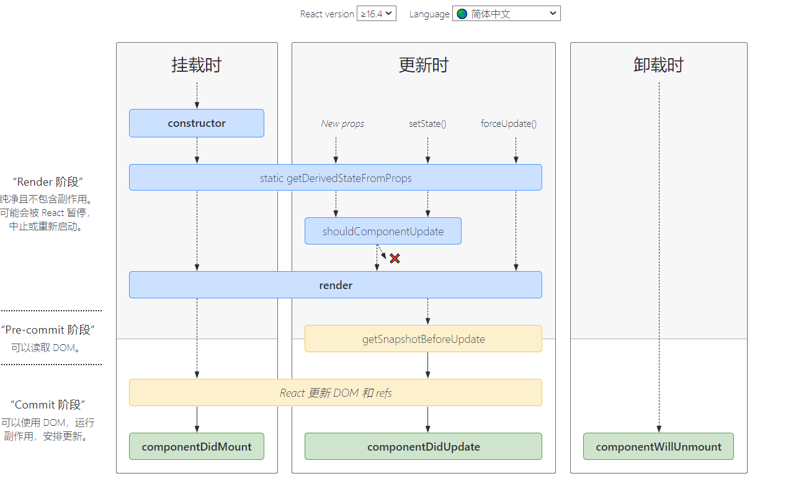
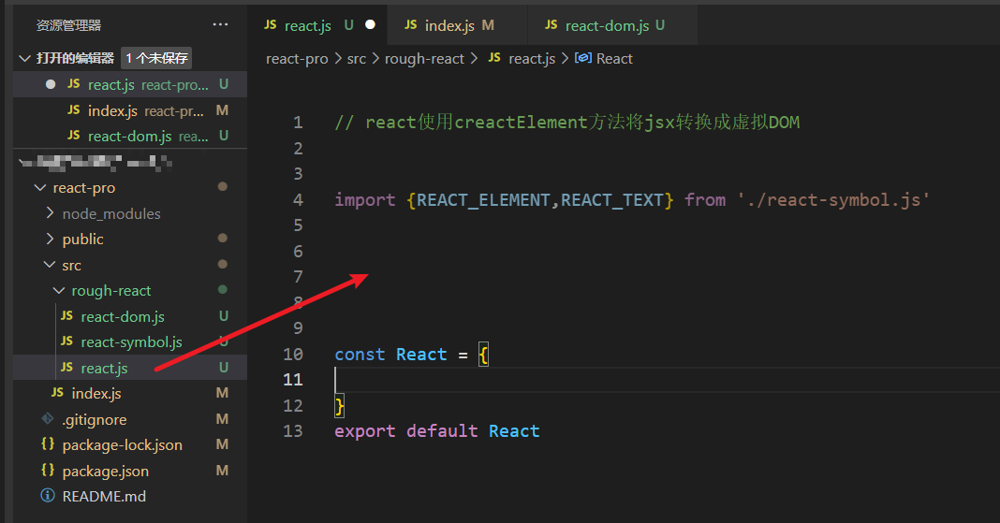
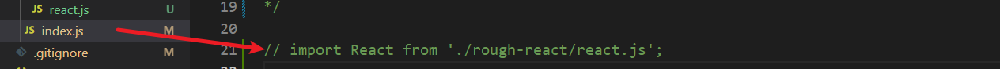
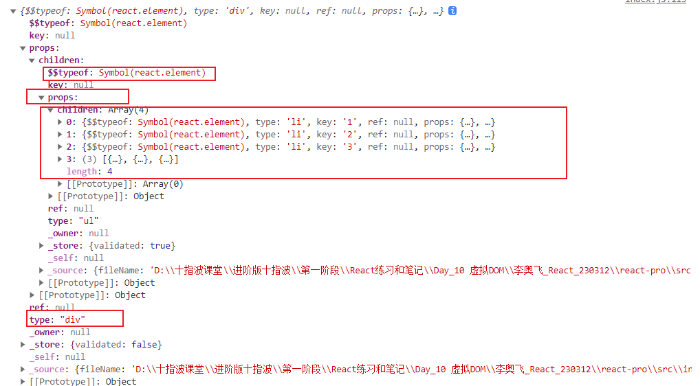
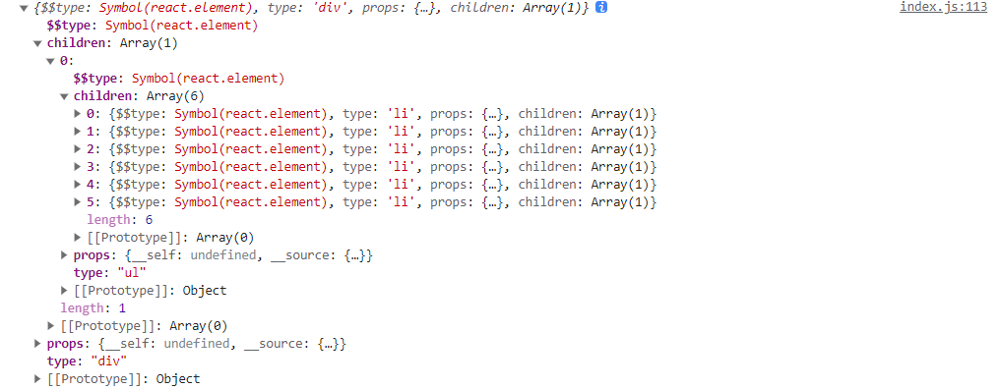
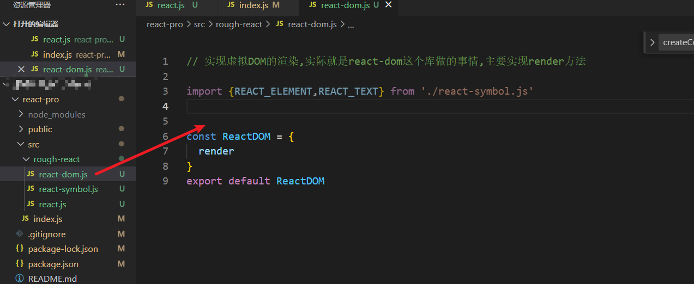
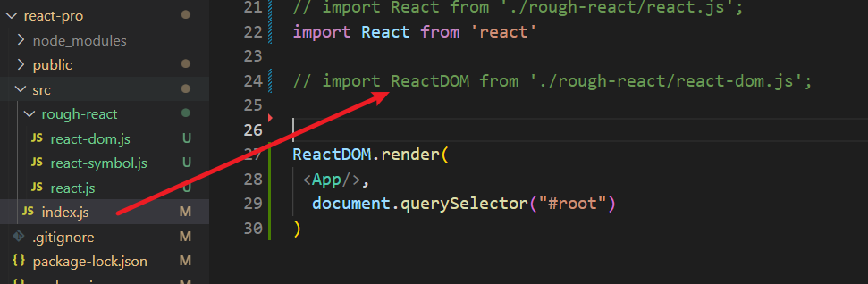
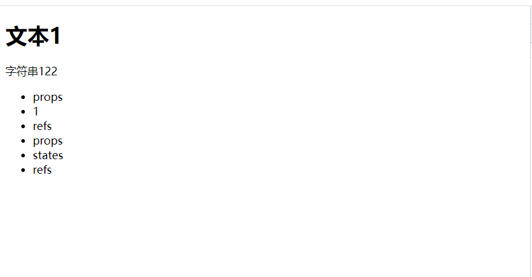
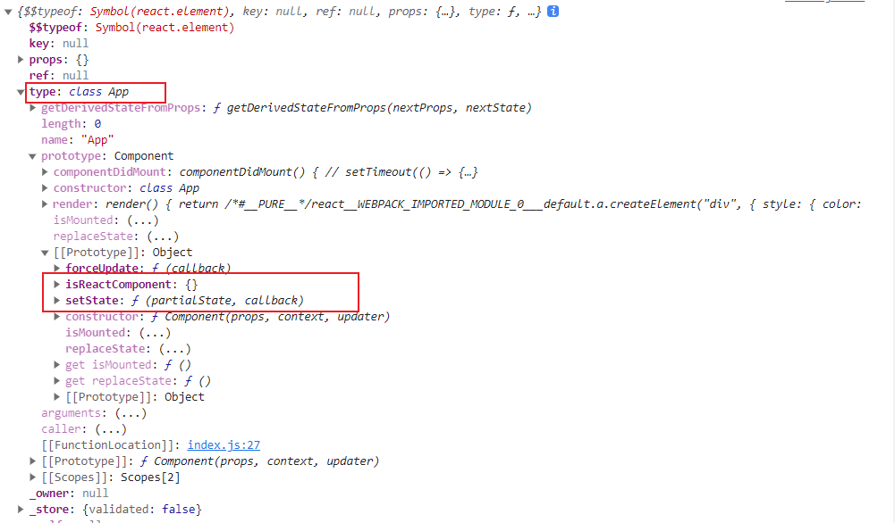

# React

## 起源和特点

> react是facebook工程师在2013年开源的前端渲染框架

- 声明式
- 组件化
- 跨平台
- 虚拟DOM

### 声明式

> 通过jsx实现声明式编写UI,通过js实现使用js实现创建和管理view

```js
页面插入一个元素
传统命令式编程方式需要四步:
获取容器 创建标签 添加标签内容 插入容器
let root = document.querySelector("#root")
let div = document.createElement("div")
div.innerHTML = "内容"
root.append(div)
声明式编程:
const element = <div className="wrap">内容</div>
root.render(element)
```

### 组件化

> 将页面封装成功能独立,逻辑完整,可高服用的单元

### 跨平台

> 支持PC,APP,服务端渲染

## React环境搭建

```js
因为react可以跨平台所以他的库是按照功能分开的
<!-- React核心渲染库 -->
<script src="https://unpkg.com/react@18.0.0/umd/react.production.min.js" crossorigin></script>
<!-- react dom渲染库 -->
<script src="https://unpkg.com/react-dom@18.0.0/umd/react-dom.production.min.js" crossorigin></script>
<!-- 渲染jsx语法 -->
<script src="https://unpkg.com/babel-standalone@6/babel.min.js"></script>
```

## React三个API

### createElement()

> 创建并返回指定类型的新**React**元素

```js
React.createElement(type,[porps],[..children])
    type:类型参数,可以是元素标签如div span也可以是React组件类型,或者是ReactFargment
    porps:属性对象:注意:类名用className,避免与es6语法class冲突,事件名用小驼峰:onClick,onMove等
    children:其余参数为元素内容,可以是文本,react组件

例:
//创建组件
const ele = React.createElement("div",{
  className: "test",
  onClick: ()=> {
    console.log("点击")
  }
},"点击")
```

### createRoot()

> 根据容器创建一个React根实例并返回,根实例可以用来将react组件渲染到DOM中,是react16.4新加的

```js
let root = ReactDOM.createRoot(document.querySelector("#root"))
root.render(react元素)
出了render()方法还支持其他方法:'
unmount()卸载
```

### render()

> 渲染react元素到指定根元素

## JSX渲染规则

> jsx文件提供了声明式UI编程的方式,其原理就是通过**Babel.js**将jsx语法转换成React基础ApI创建React组件的方式
>
> ```js
> 如: const h1 = <h1></h1>
> babel转换后: const h1 = React.createElement("h1",null,null)
> ```

**注意**: html文件引入babel后,在script中使用jsx语法需要在script标签中添加`type = "text/babel"`属性

### 1.不需要加引号

> jsx语法中,声明元素不需要加引号,直接书写标签

```jsx
const head = <head><ul><li>这是一个li</li></ul></head>
```

### 2.严格区分大小写

> jsx中html标签名必须**小写**,React组件名称必须首字母**大写**,

### 3.jsx标记必须闭合

> html标签和react组件标签都必须闭合

### 4.支持插值表达式

> 语法: {}
>
> 表达式内容: 
>
> 1. 变量
> 2. 运算
> 3. 函数调用
> 4. Boolean,null,undefined,symbol是合法的到那时不会渲染
> 5. 对于存在即生效的属性: disabled={true},插值内容为true即生效,为false不渲染

### 5.事件属性必须驼峰命名

```jsx
const button = <button onClick = {alert(1)}></button>
此处事件必须用驼峰
```

### 6.类名使用className

> 设置calss属性只能使用className,目的是与js中的类区分开

### 7.style属性值必须是对象

```jsx
const button = <button style = {{key: value}}></button>
```

### 8.只能有一个根标签

> 与vue 的template类似,内部只能有一个根标签

```jsx
正确: const head  = <head>
      	<main>
          
          </main>
          <section>
          
          </section>
      </head>
错误: const head = <head></head><main></main><section></section>
在工程中可以使用空标签达到相同的效果:
return (
	<>
    <div></div>
    <div></div>
    </>
)
```

### 列表渲染

> 原理:构建包含jsx语法的数组,将数组放在插值表达式中渲染
>
> ```jsx
> const arr = [
>     <li>这是第一v额</li>,
>     <li>这是第一v额</li>,
>     <li>这是第一v额</li>
> ]
> const ul = <ul>{arr}</ul>
> ```

正常实现:

```jsx
const arr = [1,2,3,4,5,6]
const ul = <ul>
      	{
              arr.map(item => return <li key= {item.id}>{item}</li>)
          }
      </ul>
**利用数组方法,返回一个构建好的数组常用的方法还有: filter,reduce
```

#### 唯一key

> 与vue相同,为了方便diff算法更新对比新旧DOM,需要给列表元素加上**唯一且不变**的key

```jsx
arr.map(item => return <li key= {item.id}>{item}</li>
```

### 条件渲染

- 三目运算实现

  ```jsx
  <head>{result ? <span>正确</span> : <span>错误</span>}</head>
  ```

- 短路运算符实现

  ```jsx
  <head>{result && <span>正确</span>}</head>
  ```

- 函数返回实现: 放一个函数通过条件控制返回的结果

  ```jsx
  const fun = (result) => {
      if(result){
          return <span>正确</span>
      }
      return <span>错误</span>
  }
  const head =<head>
            {
                fun(true)
            }</head>
  ```


## React CLI

> 什么是react脚手架: 脚手架内置了Babel,webpack,eslint.jest,webServer等工程化工具链以及react,react-dom,redux,react-redux等react核心库,只用通过一个命令就可以快速生成react项目

### 初始化项目

#### 传统方式

> 需要全局安装cli,占用电脑内存空间

1. 全局安装cli

   `npm i create-react-app -g`

2. 使用脚手架生成项目

   `create-react-app 项目名称`

3. 启动项目

   `npm start 运行项目`

   `npm bulid 打包项目`

   `npm  test 测试项目`

#### 推荐方式

> npx会先下载cli,然后通过cli生成项目,生成完毕后自动删除下载的cli,节省内存空间

`npx create-react-app 项目名称`

#### 插件安装

- JS JSX Snippets   jsx代码提示与快捷生成

- Simple React Snippets  react代码提示快捷生成 

配置

```json
 "emmet.triggerExpansionOnTab": true,
  "emmet.showAbbreviationSuggestions": true,
  "emmet.includeLanguages": {
    // jsx的提示
    "javascript": "javascriptreact",
    "vue-html": "html",
    "vue": "html",
    "wxml": "html"
  },
```

### React组件

> 所谓组件就是封装起来的具有独立功能的UI部分.React推荐以组件的方式重新思考UI构成,将UI上每一个功能相对独立的模块定义成组件,然后通过将小的组件通过组合嵌套的方式构成大组件,最终完成UI的整体构建

#### 开发一个组件的步骤

1. 引入核心模块

   ```js
   import react from 'react';
   ```

2. 构建类组件或者函数组件

3. 导出组件

**注意点: 组件命名必须首字母大写,且和文件名称保持一致**

**组件特征**

1. 可组合: 一个组件易于和其他组件一起使用,或者嵌套使用
2. 可重用: 每个组件都是功能独立,可以被重复使用
3. 可维护: 每个组件只包含自身的逻辑,更容易被理解和维护

#### 类组件

> 声明一个类,并且继承`React.component`类,组件的属性和方法就定义为类的属性和方法,类必须有一个`render()`方法,他返回的渲染的内容

```js
import React, {component} from 'react'
class Button extends componebt {//定义一个类组件
    render(){
        return(
        	<button>这是一个按钮</button>
        )
    }
}
export default Button //导出组件,外部引入就可以使用了
```

##### 类组件中绑定事件

> 在类组件中要注意this问题,具体见下文实例:

```js
import React, {component} from 'react'
class Button extends componebt {//定义一个类组件
    clickHandler(){
        console.log(this)
    }
    render(){
        return(
        	<button onClick={this.clickHandler}>
        )
    }
}
点击按钮打印this是undefined,原因: 在原生写法中,给事件绑定函数,事件触发时this指向的是window如:
<button onclick="demo()">dianji</button>
<script>
function demo(){
  console.log(this)//这里打印的是window对象,
}
</script>
而在react中babel严格模式下就指向了undefined
```

- 解决方式1: 使用class firld的方式(**推荐**)

  > 使用箭头函数的形式,js中this是在运行时确定的,箭头函数可以将this固定在定义时的外层,也就是组件实例

  ```js
  import React, {component} from 'react'
  class Button extends componebt {//定义一个类组件
      clickHandler = () => {
          console.log(this)
      }
      render(){
          return(
          	<button onClick={this.clickHandler}>
          )
      }
  }
  ```

- 解决方式2: bind

  > 使用bind在绑定事件的时候将this绑定在组件实例上

  ```js
  import React, {component} from 'react'
  class Button extends componebt {//定义一个类组件
      clickHandler(){
          console.log(this)
      }
      render(){
          return(
          	<button onClick={this.clickHandler.bind(this)}>
          )
      }
  }
  ```

- 解决方式3

  > 在jsx事件中包一层箭头函数,将this指定在箭头函数外层的组件实例上,jsx括号中{}的this是组件实例

  ```js
  import React, {component} from 'react'
  class Button extends componebt {//定义一个类组件
      clickHandler(){
          console.log(this)
      }
      render(){
          return(
          	<button onClick={()=>{this.clickHandler()}}>
          )
      }
  }
  ```

##### 类组件事件传参

1. 通过箭头函数

   ```js
   import React, {component} from 'react'
   class Button extends componebt {//定义一个类组件
       clickHandler(canshu,e){
           console.log(this,canshu,e)
       }
       render(){
           return(
           	<button onClick={(e)=>{this.clickHandler("参数",e)}}>
           )
       }
   }
   ```

2. 通过bind

   ```js
   import React, {component} from 'react'
   class Button extends componebt {//定义一个类组件
       clickHandler(canshu){
           console.log(this,canshu,e)
       }
       render(){
           return(
           	<button onClick={this.clickhandler.bind(this,"canshu")}>
           )
       }
   }
   bind会将参数放在第一个,默认参数e会排在最后
   ```

#### 函数组件

> 编写函数,函数名就是组件名称,函数return值就是要渲染的元素,如果返回多行需要加括号()
>
> **与类组件不同的是函数组件中不需要注意this问题**

```js
export default function MyButton() {
  let type = "函数式组件"
  return (
    <>
      <button>{type}</button>
      <p>zhehsimaioshu</p>
    </>
  )
}
```

##### 函数式组件绑定事件

> 两种定义函数的方式都可以

```js
export default function MyButton() {
  let type = "函数式组件"
  // function clickHandler(){
  //   console.log(this,type)
  // }
  let clickHandler = ()=> {
    console.log(this,type)
  }
  return (
    <>
      <button onClick={clickHandler}>{type}</button>
      <p>zhehsimaioshu</p>
    </>
  )
}
```

##### 函数式组件事件传参

> 通过箭头函数
>
> 通过bind

```js
export default function MyButton() {
  let type = "函数式组件"
  function clickhandler(){
    console.log("点击了按钮")
  }
  let clickHandler = (canshu)=> {
    console.log(canshu,type)
  }
  return (
    <>
    {/* 传参第一种方式 */}
      {/* <button onClick={() => {clickHandler("camshu")}}>{type}</button> */}
      {/* 第二种传参方式 */}
      <button onClick={clickHandler.bind(null,"camshu")}>{type}</button>
      <p>zhehsimaioshu</p>
    </>
  )
}
```

#### 阻止默认事件

> 通过事件对象,e.preventDefault();

#### 组件状态State

> State是组件当前状态,是一个对象,根据State决定UI渲染,状态改变会自动调用render()函数重新渲染

##### 初始化/读取State

> 在组件中定义state对象,作为状态机,通过this.state读取

```react
import react,{component} from 'react'

class Button extends component {
    state: {
        count: 0
    }
	render(){
        return(
            <button>{this.state.count}</button>
        )
    }
}
```

##### 修改State

> **在React中状态具有不可变性,不能直接修改state,只能通过setState方法修改**,

**react中State的状态是不可变的,当State中的值需要修改的时候,我们应该创建一个新的状态覆盖掉原来的状态,而不是修改原来的状态**

语法:

```react
this.setSate({要修改的数据,该对象的修改会合并到state上})
例如:
this.setState({
    count: this.state.count + 1;//修改state中count的值,为原来的值+1
})
```

setState的作用:

```react
1.修改state中的状态
2.触发render()函数重新渲染
```

setState的参数:

```react
this.setSate(obj/fun[,fun])
setSate有两个参数:第一个参数可以是对象也可以是函数,第二个参数是函数,
```

- 第一个参数为对象

  ```react
  第一个参数为obj时:
  	this.setState({
          count: this.state.count + 1;//修改state中count的值,为原来的值+1
      })
      console.log(this.state.count)
  	第一个参数为对象,修改后会覆盖掉原来的值
  注意:
  1.上述修改后立即获取修改的值,输出的还是原来的值:这是因为setState是异步的,执行后并非直接修改State中的值,而是将修改排入队列中,等到线程空闲时才会更新数据,当需要立即获取修改后的状态可以通过第二个参数在回调函数中获取
  2.当多个setState一起修改时:
  	this.setState({
          count: this.state.count + 1;//修改state中count的值,为原来的值+1
      })
      this.setState({
          count: this.state.count + 1;//修改state中count的值,为原来的值+1
      })
      this.setState({
          count: this.state.count + 1;//修改state中count的值,为原来的值+1
      })
  最后结果count并没有加3,而是加1,原因: 
  	1.react更新数据时,会合并多次操作:
          this.setState({
              count: 2
          })
          this.setState({
              count: 3
          })
          this.setState({
              count: 1
          })
  	上述操作,react会进行合并,最后count的值是1
      2.React中函数更新是异步的,第一个setSate执行后,this.state.count还是原来的值,那么下面的赋值都是重复的拿原来的值进行赋值
  ```

- 第一个参数为函数

  ```react
  this.setState((state,porps) => {
      console.log(state.count)//输出上一个setState修改后的值
      reutrn {
          这里修改state
      }
  })
  回调函数有两个参数: state 是上面修改过的state的副本,也就是说可以在这个回调函数中立即拿到修改的值
  该回调函数return一个对象,这个对象就是修改后的state
  
  函数执行规则: 
  在上一个setState执行完毕后,render()渲染之前
  this.setState({
    count: 3
  })
  this.setState((state) => {
    console.log("回调执行",state.count) //输出3
  })
  this.setState({
    count: 4
  })
  ```

- 第二个参数

  ```react
  this.setState({
      count: 2
  },()=>{
      console.log(this.state.count)//输出2,这里也能立即拿到修改后的state
  })
  函数执行时间: 
  在render()函数渲染之后执行
  ```

##### State特点总结

1. State的更新是异步的: 同步State防止多余的操作,在线程空闲时执行修改,优化性能
2. 第一个参数是对象: 会把多个setState合并成一个调用
3. 第一个参数是函数: 可以通过参数立即获取到上一个setState修改的值,执行时间是在上一次SetState后,render之前
4. 第二个参数: 可以立即获取到修改后的值,执行时间在render之后
5. **react中State的状态是不可变的,当State中的值需要修改的时候,我们应该创建一个新的状态覆盖掉原来的状态,而不是修改原来的状态**

##### 修改引用数据类型

> **总体思想:拷贝原来的state中的状态,修改后,对state重新赋值,覆盖掉原来的state**

- 修改数组

  ```react
  增加数组元素
  1.解构(推荐最常用):
  this.setState({
      arr: [...this.state.arr,"new1","new2"]
  })
  2.concat
  this.setState({
      arr: this.arr.concat(['new',"new"]),
      arr: this.arr.concat("new")
  })
  删除数组元素:
  	思路:
  	对数组进行拷贝(深浅拷贝,切断与this.state的联系)
      在拷贝的数组上操作
      之后将数组重新赋值给State
      举例子:(数组内部无引用类型的情况)
  	let newArr = [...this.state.arr];
  	newArr.splice(1,2)
  	this.setState({
          arr: newArr
      })
  其他处理:
  使用不修改原数组且返回新数组的方法:filter,map,reduce,slice等
  ```

- 修改对象

  ```react
  添加对象属性:
  1.解构
  this.setSate({
  	obj: {...this.state.obj,name: "新增属性"}
  })
  2.Object.assign()
  this.setState({
      obj: Object.assign({},this.state.obj,name:"新增属性")//为什么assign的第一个值是空对象而不是this.state.arr?
      因为本质上assign是对第一个属性直接操作,如果第一个是state就直接对state直接操作了,违反了react state的不可变性,
  })
  删除对象属性
  1.解构(最常用)
  let {name,...newObj} = this.state.obj
  this.setState({
      obj: newObj//这里删除了name属性之后覆盖原来state中的值
  })
  ```

##### 引用数据类型中还有引用数据类型

> 使用深拷贝,切断与state的联系
>
> 对拷贝后的值进行修改
>
> 覆盖原来的state

```react
使用深拷贝库lodsh
引入: import _ from 'lodsh'
_上cloneDeep(深拷贝)和clone(浅拷贝)两个方法,可以实现深拷贝和浅拷贝
```

### 组件通信

> 组件通信值指的是组件间数据的穿传递

种类包括:

- 父子传值 :props
- 兄弟传值: 通过事件总线,通过共同的父组件
- 其他组件间传值:mobx,redux,zustand

#### props

props就是自定义组件属性,通过在子组件上定义自定义属性并赋值将数据传递给子组件,子组件可以在`this.porps`上拿到

并使用

```js
父=>子:
父组件中:
	<子组件 自定义属性={值} />
子组件中:
	let {自定义属性} = this.props // this.props.自定义属性值
    
子=>父
父组件中:
	函数(参数){
        console.log(参数) //拿到子组件传递的参数
    }
	<子组件 自定义属性={函数} />
子组件中:
	this.props.自定义属性(参数)
```

##### **1.props的取值**

可以传递任意数据: 数字,布尔值,字符串,对象,数组,函数,jsx组件(传递过去就是一个虚拟的DOM)

**2.父子组件的关系**

父组件将状态传递给数组时,父组件状态改变子组件状态也会跟着改变,这是因为:*父组件状态改变会重新执行render渲染,子组件也会重新执行render渲染,但这里不必担心不必要的渲染,这里的渲染只是生成VDOM,并不是直接渲染到页面*

**3.props的不可变性**

根据**单项数据流**的要求,子组件不能修改父组件传递的props,数据从父组件=> 子组件

**4.数据来源单一原则**

设计组件时,就要确认组件的状态完全是有自身决定还是完全由其他组件的状态控制,一个组件只能有一个数据源这样直接就避免了两个组件操作同一个数据源的问题:

```js
派生state问题: 意思是组件的state是由props派生出来的
state ={
    a : this.state.a
}
这种情况下,就可能出现子组件修改state与父组件修改props产生冲突
```

##### props的默认值

如果父组件没给props赋值,那么props的值默认是**true**

```js
应用场景:
父组件: 
	<子组件 displayed />
子组件
	<div disable={this.props.isDisplayed} />
父组件中没有给displayed赋值,值会默认为true
```

##### props展开

父组件传递props时,可以将props写成一个对象,最后使用...运算符将数据解构出来

```js
父组件:
let porps = {
    a:1,
    b:2
}
<子组件 {...props} />
```

##### props.children

`this.props.children`表示使用组件标签时之间的所有内容,只要组件标签之间有内容,组件的props就有这个属性

```js
父组件
render(){
    return(
    <>
       <子组件>
        dom/react DOM/function/str/JSX/Object
        </子组件>
    </>
    )
}
子组件:
this.props.children => 获取到上述子组件标签之间的内容
```

##### children.map

专门用来循环`this.props.children`的方法,当`this.props.children`中包含多个元素时可以使用

```react
React.children.map(this.props.children,function)
```

#### props-render

是一个组件之间使用一个值为函数的prop共享代码的简单技术,简单来说就是将一个函数作为prop的值在子组件中进行使用,通过参数来共享数据

```react
场景:
三层组件,根组件和父组件都要给孙子组件传值,但是父组件中使用的孙子组件是不固定的,也就是说父组件中没有直接使用孙子组件,那么父组件如何给子组件传递值
使用prop-render技巧:

根组件中:
render(){
    return (
    <>
        <父组件  render={(msg) => (
                <孙子组件 pmsg={msg}></孙子组件>
        )}
        </父组件>
    </>
    )
}

父组件中:
render(){
 return (
            {this.props.render(父组件数据)} //执行props传递的函数
        )           
}
上述例子中,父组件未使用子组件也可以将值传递给子组件
            
            
也可以通过props.children来实现
            <父组件>
            {
                (msg) => {
                    return (
                        <子组件 pmsg= {msg}></子组件>
                    )
                }
            }
            </父组件>
```

#### props校验

- 安装`prop-types`

- 引入`import PropTypes from 'prop-types'`

- 使用:

  ```react
  假如给Tab组件添加props校验:
  Tab.propTypes = {
      参数1: PropTypes.number, //表示参数1需要是数字类型
  }
  或者:
  class Tab extends Component {
      static propTypes = {
          参数1: PropTypes.number
      }
  }
  ```

常见类型:number,bool,func,string,object,array,any

React元素类型: element

必填: `.Required`

特定的结构对象: shape({})

```react
Tab.propType = {
    参数1: PropTypes.shape({
        参数a: PropTypes.number,
        参数b: PropTypes.object
    })
}
```

#### props默认值

默认值会在undefined时生效或者prop缺失的时候生效,**但值为null的时候不会生效**

函数式组件中使用参数的默认值写法

类组件中需要定义一个静态属性defaultProps:

```react
class Tab extebds Component {
    static defaultProps = {
        参数1: "默认值"
    }
}
```

### Refs

提供一种我们直接可以获取DOM元素/React组件的方式,获取的DOM元素作为ref的current属性

#### 使用建议

尽量不使用ref,更不要使用ref进行组件通信,或者更改组件状态,这会导致组件的状态控制权混乱,不利于组件设计.下面是适用场景:

- 管理焦点,文本选择或者动画播放
- 触发强制动画
- 集成第三方DOM库

#### 使用方式

> 均针对类组件,函数式组件本身不能直接使用ref,因为函数式组件是个函数并不是组件实例

##### 第一种

通过React.createRef()

1. 创建ref

   ```react
   refInput = React.createRef()
   ```

2. 组件/DOM添加属性

   ```react
   <input ref = {this.refInput}/>
   ```

3. 使用

   ```react
   console.log(this.refInput) //current属性中包含元素
   ```

##### 第二种

通过回调

1. 添加属性

   ```react
   <input ref = {(ele)=>{ this.refInput = ele}}
   ```

2. 使用

   ```react
   console.log(this.refInput)
   ```

这种方式使用时,在组件更新过程中会被执行两次,第一次回调函数的参数是null,第二次才是DOM元素,这是因为组件渲染时不会修改原来的,会创建一个新的组件实例,所以react会清空ref并设置新的,如果组件中ref属性的回调函数是在class中定义的就不会出现这样的情况:

```react
class Bu extends Component {
    refButton = null
	fn = (ele) => {
        this.refButtn = ele
    }
    render(){
        return <Button ref={this.fn}></Button>
    }
}
```

#### ref转发

ref无法直接在函数式组件上使用,但函数式组件内部还是可以使用的,同时通过ref转发也可以实现在函数式组件上使用ref

```react
函数式组件内部使用ref
import {useRef} from "react"

let refInput = useRef(null)

<input ref={refInput}

ref转发:
const Button  = React.forwardRef((props,ref)=>{ //一个高阶函数,接收一个函数为参数并返回一个函数
    return <button ref={ref}></button>
})
创建ref
refButton = React.createRef()
使用:
<Button ref={this.refButton} />
获取:
console.log(this.refButton)
```

### 表单

#### 受控表单元素

受控表单元素是指表单元素的状态由组件的state来控制

元素的value属性,由state的值来决定,通过修改state的值来实现表元素value的值的改变

```react
class MyInput extends Component {
    state = {
        inputValue: ""
    }
	change = (e) => {
        this.setState({
            inputValue: e.target.value
        })
    }
    render(){
        return (
        	<input value={this.state.inputValue} onChange = {this.change} />
        )
    }
}
```

#### 常用表单元素

| 元素                  | 属性值              | 更改回调 | 回调中的值       |
| --------------------- | ------------------- | -------- | ---------------- |
| input text="text"     | value               | onChange | e.target.value   |
| input type="chechbox" | checkbox={boolean}  | onChange | e.target.checked |
| input type="radio"    | checked={boolean}   | onChange | e.target.checked |
| textarea              | value               | onChange | e.target.value   |
| select                | value="optionvalue" | onChange | e.target.value   |

#### 非受控表单元素

指手动操作DOM的方式直接获取元素的值

```react
class MyInput extends Component {
	change = (e) => {
        console.log(this.inputRef.current.vaule)
    }
    render(){
        return (
        	<input ref={(ele) => {this.inputRef = ele}} onChange = {this.change} />
        )
    }
}
```

#### 状态提升案例

> 实现汇率转换
>
> 需求: 实现美元,人民币,欧元之间的相互转换,三个输入框,选择一个框任意输入,自动在其他输入框显示转换结果,重新输入时清空输入框

```react 
import {Component} from 'react'

const EXCHANGEMAP = {
  CNY: 1,
  USD: 6.77,
  EURO: 13
}
/**
 * @message: 管道函数 从右往左执行
 * @return {function} 组合后的函数
 * @since: 2023-05-10 21:32:44
 */
function _compose(){
  let arr = Array.prototype.slice.call(arguments,0)
  arr = arr.reverse()
  return function(){
    return arr.reduce((acc,curr) => {
      return curr(acc(...arguments))
    })
  }
}
/**
 * @message: 根据汇率表将人民币转换成其他种类的货币值
 * @param {Number} value CNY值
 * @return {Obiect} 包含键值对为: 各种货币种类:值的对象 值取16位数
 * @since: 2023-05-10 20:16:24
 */
function _CNY2Every(value){
  return  Object.fromEntries(Object.entries(EXCHANGEMAP).map(([key,val]) => {
    return [key,(value / val).toString().substring(0,16)]
  }))
}
/**
 * @message: 根据汇率表将任何种类货币转换为人民币
 * @param {Number} who 货币种类
 * @param {Number} vaule 货币值
 * @return {Number} CNY货币值
 * @since: 2023-05-10 20:12:48
 */
function _every2CNY (who,value){
  return Object.fromEntries(Object.entries(EXCHANGEMAP).map(([key,val]) => {
    return [key,value * val]
  }))[who]
}

export default class Calsultor extends Component {
  state = {
    allConvert: Object.fromEntries(Object.entries(EXCHANGEMAP).map(([key,value]) => [key,""]))
  }
  timer = null;
  change = (who,val) => {
    this.setState({
      allConvert: {...this.state.allConvert,[who]: val}
    })
    clearInterval(this.timer)
    this.timer = setTimeout(() => {
      let value = val.toString().replace(/[\`\~\!\@\#\$\%\^\&\*\(\)\_\+\-\=a-zA-Z]/,"");
      let func = _compose(_CNY2Every,_every2CNY)
      this.setState({
        allConvert: func(who,value)
      })
    },400)
  }
  focus = (who) => {
    this.setState({
      allConvert: {...this.state.allConvert,[who]: ""}
    })
  }
  render(){
    let {allConvert} = this.state
    return (<>
    <h1>汇率换算</h1>
    {
      Object.entries(allConvert).map(([key,val]) => {
        return (<div key={key}>
          {key}:&nbsp;<Input value={val} focus={this.focus.bind(null,key)} change = {this.change.bind(null,key)}/>
        </div>)
      })
    }
    </>)
  }
}
//输入框组件
class Input extends  Component {
  render(){
    let {value,change,focus} = this.props
    return (<>
    <input type="text" onFocus = {focus} value={value} onChange = {(e) => {change(e.target.value)}} />
    </>)
  }
}
```

### 组件生命周期

组件的生命周期是指组件被创建到挂载到卸载的过程,**只有类组件才有生命周期**从不同的角度可以分为三大时态和两大阶段

生命周期总览:



#### 三大时态

##### 挂载时

> 组件实例初次被创建的过程

###### **constructor()**

在组件挂载之前调用,如果实现这个方法要注意以下几点:

- 如果需要访问this就使用constructor,且必须调用`super()`进行继承
- constructor可以不写,react默认添加一个空的constructor
- 如果使用了`this.props`,则必须给supper添加参数`super(props)`
- 无论是否实现constructor,在render中this.props都是默认可以使用的,这是react附带的
- 不要在constructor中调用`this.setState()`

参数:

- props: 

使用场景

- 通过`this.state`赋值初始化内部state
- 为事件处理函数绑定实例

###### **static getDerivedStateFromProps()  不常用**

在调用render之前执行,并且初始挂载和后续的更新都会被调用,必须有返回值,**返回一个对象来更新State或者返回一个null**

参数

> static getDerivedStateFromProps (nextProps,nextState)

- 更新后的state和props

使用场景

- 不推荐使用,罕见场景
- 如果需要在状态改变时执行副作用(执行动画等),可以使用`componentDidUpdate`
- 如果只是想在props更新时重新计算某些数据可以使用`memoization helper`
- 如果想在props更新时重置某些state,请考虑组件使完全受控

###### **render()**

类组件中唯一一个必须实现的方法,返回一个组件需要渲染的内容:

- 应该把它写成一个纯函数,
- 它并没有将组件渲染到页面上,而是返回需要渲染的内容,`Root.render()`才是真正的渲染
- 官网说react会随时调用render,所以不应该说render什么时候执行.一般情况下,检测到state和props改变就会执行render

参数:

> render(preProps,preState)

- preProps: 更新前的props
- preState: 更新后的state

###### **componentDidMount()**

当组件被挂载到屏幕上时进行执行,且只触发一次

- 可以获取到DOm节点
- react在调用componentDidMount时然后立即调用componentWillUnmount,然后再调用componentDidMount,为了提示逻辑是否缺失
- 尽量不要使用`this.setState`,可能导致性能问题,但某些场景下是必要的

应用场景

- 请求数据
- 发布事件
- 开启定时器

##### 更新时

> 组件在创建后再次渲染的过程

newProps,newState,foceUpdate()强制更新

###### **static getDerivedStateFromProps () 不常用**

> 详情见上述说明

###### shoudComponentUpdate() 不常用

数据更新时render之前触发,react会根据这个方法的返回值,决定是否跳过组件更新:

- 调用foceUpdate时不会触发
- 必须有返回值,默认是`true`,返回`false`跳过重新渲染
- 这个方法只用于`性能优化`的时候使用
- 返回false不会阻止子组件状态变化时的更新

参数

> shoudComponentUpdate(nextProps,nextState,nextContext)

- nextprops: 更新后的props
- nextState: 更新后的state
- nextContext: 组件将要渲染的下一个组件上下文

使用场景

- 性能优化

###### **render()**

> 详情见上述render

###### **getSnapshotBeforeUpdate() 不常用**

在render之后立即调用,可以在组件更新获取一些DOM信息,它的任何返回值都会作为`compontDidUpdate`的参数

参数

- prevProps:更新前的props
- prevState: 更新前的state

###### **componentDidUpdate()**

在render之后执行

参数

- prevProps:更新前的props
- prevState: 更新前的state
- snapshot: getSnapshotBeforeUpdate的返回值

使用场景

- 操作DOM
- 网络请求

##### 卸载时

> 组件在使用完后被销毁的过程

###### **conmponentWillUnmount()**

组件卸载前触发

使用场景

- 取消定时器
- 取消订阅
- 中止网络请求

#### 两大阶段

##### 渲染阶段"render"

> 渲染阶段会确定进行哪些更改,在此阶段React调用render然后将结果和上一次渲染结果进行比较,确定最终的渲染结果
>
> 纯净且没有副作用,可能被react随时叫停

什么叫做没有副作用: 就是说渲染阶段不会执行具有副作用的操作如:数据据获取,事件订阅或者手动改变DOM,

为什么不要有副作用:提交阶段通常会很快,但渲染阶段可能很慢,因此即将推出的concurrent模式将渲染工作分解为多个部分,对任务进行暂停和恢复操作以免阻塞浏览器,这意味着React可以在提交之前多次调用渲染阶段的生命周期的方法,或者在不提交的情况下调用他们,为了解决这个问题就需要一套异步可中断的更新方式(consurrent);来让耗时的计算让出js的执行权给优先级更高的任务,在浏览器闲置的时候在执行这些计算,多以我们需要一种数据结构来描述真是DOM和更新的信息,在适当的时候可以在内存中中断reconclie的过程 ,这种数据结构就是Fiber 

**该阶段包含这些函数**

- constructor
- static getDerivedStateFromProps ()
- shoudComponentUpdate
- render

##### 提交阶段"commit"

也叫绘制阶段,将render阶段得到的最新UI tree更新到浏览器进行DOM胡绘制

**该阶段包含这些函数**

- componentDidMount
- componentDidUpdate
- componentDidUnmout

#### 隐藏的一个阶段

##### Pre-commit 阶段

在render阶段之后commit阶段之前,可以读取 DOM。

**该阶段包含的函数**

- getSnapshotBeforeUpdate()

#### 父子组件生命周期

##### 挂载时

> 从上到下依次执行

父组件 contructor()

父组件 getDerivedStateFromProps()

父组件render()

子组件 constructor()

子组件 getDerivedStateFromProps()

子组件 render()

子组件 componentDidMount

父组件 componentDidMount

##### 更新时

> 父组件状态更更新,从上到下依次执行

父组件 getDerivedStateFromProps()

父组件 shouldComponentUpdate()

父组件 render()

子组件 getDerivedStateFromProps()

子组件 shouldComponentUpdate()

子组件 render()

子组件 getSnapshotBeforeUpdate ()

父组件 getSnapshotBeforeUpdate ()

子组件 componentDiaUpdate()

父组件 componentDidUpdate()

##### 卸载时

> 父组件卸载从上到下依次执行

子组件 componentWillUnmount()

父组件 componentWillUnmount()

### 虚拟DOM

> react核心库: 
>
> react-scripts => 提供createElement方法,将jsx转换为虚拟DOM,文件导出为React
>
> react-dom => 提供render方法将虚拟DOM渲染,并放在指定容器中,文件导出为ReactDOM

#### 整体流程: 

1. `jsx`语法通过`babel`编译为`React.createElement(type,props,...children)`的形式
2. `react`调用`createElement`方法生成虚拟DOM
3. `react`调用`ReactDOM.render(vDOM,root)`方法将虚拟DOM渲染成真实DOM

#### 实现简易版本React前提

将`react-scripts`库的版本降低到3.x.x,高版本库会自动调用`ReactDOM.render()`方法,不利于手动实现

#### 实现react.createElement方法

实际就是模拟`react-scripts`这个库,react通过该方法将jsx转换成虚拟DOM,babel转义jsx语法后会自动调用react的createElement方法,因此先新建模块`react.js`并导出`React`,在使用的页面导入后,babel运行时就会调用我们模拟的`createElement`方法了:

1. 新建:

   

2. 使用:

   

接下来先引入正经的react看看其虚拟DOM结构 : 



知道结构后照猫画虎,实现自己的createElement方法:

1. 根据参数生成一个对象

```js
react.js
/**
 * @message: jsx转换成虚拟DOM 实现react-scripts中的方法: createElement
 * @param {*} type 标签名称
 * @param {*} props 配置
 * @param {array} children 子元素
 * @return {*}
 * @since: 2023-07-29 12:30:31
 */
function  createElement(type,props,...children){
  // 为了方便这里将原来props内的children写在了外层,对字符串和数字进行处理,标记$$type便于后面处理
  children = children.flat(Infinity).map(item => {
    if(typeof item === "object"){
      return item
    }
    if(typeof item === "string" || typeof item === "number"){
      return {
        $$type: REACT_TEXT,
        inner: item
      }
    }
    return item
  }).filter(item => typeof item !== "boolean")
  return {
    $$type: REACT_ELEMENT,
    type,
    props,
    children
  }
}
```

运行查看效果:



#### 实现ReactDOM.render方法

实际模拟的时`react-dom`这个库,该方法接收两个参数: 虚拟DOM和容器元素,先新建这个模块,便于导入使用 :

1. 新建

   

2. 使用:

   

该方法主要做了以下事情:

1. 根据虚拟DOM的type的不同创建不同的真实DOM,包括以下几种
   1. 类组件
   2. 标签元素
   3. 文本节点
2. 给真实DOM绑定虚拟DOM中props包含的属性
   1. 事件
   2. 类名
   3. 内联属性

```js
react-dom.js
/**
 * @message: 主渲染方法
 * @param {*} tree 虚拟DOM createElement将jsx转换后的产物
 * @param {*} root 容器
 * @since: 2023-07-29 01:25:05
 */
function render(tree,root){
  let rDom = getRealDOM(tree)
  root.append(rDom)
}
/**
 * @message: 根据虚拟DOM树创建真实DOM
 * @param {*} tree 虚拟DOM
 * @return {HTMLElement} 真实DOM
 * @since: 2023-07-29 01:22:15
 */
function getRealDOM(tree){
  let rDom;
  if(tree.type?.isComponent){ //类组件
    rDom = createComRdom(tree)
    return rDom
  }
  if(tree.$$type === REACT_ELEMENT){ //react元素
    rDom = document.createElement(tree.type)
    let isHaveChild = tree.children && tree.children.length > 0
    if(isHaveChild){
      tree.children.forEach(item => {
        rDom.append(getRealDOM(item)) //有子元素递归生成真实节点
      })
    }
    rDom = addDomProps(rDom,tree.props,tree)
    return rDom
  }
  if(tree.$$type === REACT_TEXT) { //文本节点
    rDom = document.createTextNode(tree.inner)
    return rDom
  }
}
/**
 * @message: 为真实DOM添加属性
 * @param {HTMLElement} rDom 真实DOM
 * @param {Object} props
 * @return {HTMLElement} 挂载好属性的真实DOM
 * @since: 2023-07-29 01:21:51
 */
function addDomProps(rDom,props){
  delete props._self
  delete props._source
  for(let prop in props){
    if(prop.slice(0,2) === "on"){ //事件
      rDom[prop.toLowerCase()] = function(e){
        if(props[prop].cmp){
          let cmp = props[prop].cmp
          batchUpdate(cmp,props[prop],[e])
        }
      }
    }
    if(prop === "style"){ //内联样式
      Object.assign(rDom.style,props.style)
    }
    rDom[prop] = props[prop] //其他属性
  }
  return rDom
}
```

运行查看效果:

​	成功渲染:



类组件的处理:

1. 类组件继承自react.Component,因此在react-scripts中定义component类
2. 类组件通过createElement方法转换后,react在其type属性赋值为定义的类组件,
3. ReacDOM.render时判断虚拟DOM时候包含`isComponents`属性,如果包含说明时类组件,走类组件转换逻辑
4. 通过type实例化类组件,调用类组件的render方法,获取到jsx
5. 将jsx转换成真实DOM

### 渲染类组件

先看一下正经的类组件虚拟DOM: 



实现步骤:

1. 类组件继承自react.Component,因此在react-scripts中定义component类
2. 类组件通过createElement方法转换后,react在其type属性赋值为定义的组件类,
3. ReacDOM.render时判断虚拟DOM时候包含`isComponents`属性,如果包含说明时类组件,走类组件转换逻辑
4. 通过type实例化类组件,调用类组件的render方法,获取到jsx
5. 将jsx转换成真实DOM

在`react.js`模块中新建`Component`类,以便继承:

1. 主要包含props属性和`isCompoent`属性,后者是用来判断是否是类组件的
2. `setState`方法

```js
react.js
class Component {
  constructor(props){
    this.props = props
  }
  static isComponent = {}
  setState(newState){
    // 根据批处理开关判断是否进行批处理
    if(this.isBatchUpdate){
      this.batchUpdateArr.push(newState)
    }else {
      this.upDater(this.porps,newState)
    }
  }
//批处理相关
  upDater(nextprops,nextState){
    this.props = nextprops
    this.state = Object.assign({},this.state,nextState)
  }
}
```

`React.createElement`中添加对类组件的处理:

1. 从虚拟DOM的type中拿到类
2. 将类实例化
3. 调用实例的render方法,拿到虚拟DOM并进行渲染
4. 实现部分生命周期

```js
react-dom.js
/**
 * @message: 根据类组件创建真实DOM
 * @param {*} tree 类组件虚拟DOM
 * @return {HTMLElement}
 * @since: 2023-07-29 13:57:03
 */
function createComRdom(tree){
  const cmp = new tree.type(tree.props)
  let newState = getDerivedStateFromProps(tree.type,cmp.props,cmp.state) //第一个生命周期,在render之前执行
  Object.assign(cmp.state,newState)
  let vDom = cmp.render()
  let rDom = getRealDOM(vDom)
  addCmpInHandle(vDom,cmp)
  setTimeout(() => {
    batchUpdate(cmp,cmp.componentDidMount)//第二个生命周期,在render之后执行,这里进行了setState的批处理,详情在后面
  })
  return rDom
}
/**
 * @message: 声明周期getDerivedStateFromProps,在render之前执行
 * @param {*} cmpClass 组件类
 * @param {*} props 当前props
 * @param {*} state 当前state
 * @return {Object} 更新的state
 * @since: 2023-07-29 13:57:54
 */
function getDerivedStateFromProps(cmpClass,props,state){
  return cmpClass.getDerivedStateFromProps ? cmpClass.getDerivedStateFromProps(props,state) : {}
}
```

### 批处理机制

#### 前置概念

**批处理机制(异步更新state)是指: react会合并同一行为过程中所有的`setState`结果,最终只对state进行一次修改,用以提升数据处理性能**

```
异步的现象: 
state = {
	num: 1
}
handlerCick = () => {
	this.setState({
		num: 2
	})
	cosnole.log(this.state.num) 这里输出的num还是1,但内部已经变成4了
	this.setState({
		num: 3
	})
	cosnole.log(this.state.num) 这里输出的num还是1,但内部已经变成4了
	this.setState({
		num: 4
	})
	cosnole.log(this.state.num) 这里输出的num还是1,但内部已经变成4了

}
```

**全自动状态:**

react中所有的行为更新state时都会通过批处理进行合并,数据是异步更新的效果

**半自动状态: **

react中异步,原生绑定事件为半自动状态,数据实时更新

react中合成事件,生命周期为全自动状态,数据异步更新

#### 什么情况下是全/半自动状态?

1. react版本小于18或者版本大于等于18但入口API没有使用`ReactDOM提供的CreatRoot`API时,`setState`是半自动状态
   - react可以控制的行为: 合成事件,生命周期,采用的是批处理,数据进行异步更新
   - react无法控制的行为:  原生绑定事件,异步(宏任务,微任务)无法采用批处理,数据实时更新
2. react版本大于等于18且入口API使用的是`ReactDOM提供的CreateRoot`API时,`setState`是全自动状态
   - 任何行为都采用批处理,数据全部是异步更新

**ReactDOM.createRoot就是react18新增的**

#### 具体实现

##### 生命周期中的批处理:

1. 给实例添加一个标记,用来判断是否需要批处理
2. 一个state批处理队列,存储setState的结果
3. 将队列中的结果合并

```js
react-dom.js
// 生命周期setState批处理
function batchUpdate(cmp,fn,args){
  cmp.isBatchUpdate = true //实例挂载标记
  cmp.batchUpdateArr = [] //挂载批处理队列
  fn && fn.apply(cmp,args) 执行生命周期
  let nextState = cmp.batchUpdateArr.reduce((acc,curr) => { //合并state
    return {...acc,...curr}
  },{})
  cmp.isBatchUpdate = false //关闭标记
  cmp.upDater(cmp.props,nextState) //更新实例中的state
  let newVDom = cmp.render() //重新生成虚拟DOM
  console.log(newVDom)
}
```

##### 合成事件中的批处理:

react中合成事件是通过发布订阅模式,通过代理监听变化的,这里使用一点'奇技淫巧'来简单实现

1. 在`createComRdom`在渲染类组件实例中将虚拟DOM和类组件实例,传递过来
2. `addCmpInHandle`递归获取所有的事件,并在事件上挂载上实例,方便将事件进行批处理
3. 在`addDomProps`中对事件进行`batchUpdate`处理

```js
react-dom.js
//递归获取虚拟DOM上的所有事件,并且在事件函数上挂载组件实例
function addCmpInHandle(vNode,cmp){
  rucur(vNode)
  console.log(handles)
  function rucur(vNode){
    let {props = {},children = []} = vNode
    for(let key in props){
      if(key.slice(0,2) === "on" && typeof props[key] === "function"){//获取所有绑定的事件进行处理
        props[key].cmp = cmp
      }
    }
    if(children.length > 0){
      for(let item of children){
        rucur(item)
      }
    }
  }
}
```

### diff算法

### diff PatchUpdater

### 函数式组件开发

函数式组件优势:

- 更简洁

  函数式组件对于类组件而言,代码量更少,结构更简单,更容易理解和维护

- 更高效

  类组件需要实例化之后才能使用,函数式组件没有实例化过程,不需要维护组件的生命周期,可以更快的渲染

- 更容易优化

  函数式组件本身只依赖props和state,相对于类组件更容易优化性能

- 更容易测试

  - 函数式组件的输入和输出都很明确,更容易进行单元测试

- 更容易理解

  - 函数式编程时一种声明式编程方式,可以让代码更容易理解和推理,更容易发现潜在的错误和问题

函数式组件注意事项:

- 函数式组件时没有实例和状态的,因此组件内部使用的任何变量都应该通过props传递进来
- 避免使用this关键字,函数式组件中this关键字是没有定义的,如果需要使用this,可以考虑使用箭头函数
- 不要改变props,保持单向数据流
- 避免在渲染期间进行有副作用的操作(直接在函数中做副作用的操作),因为函数式组件不支持生命周期方法,所以不应该在渲染期间进行副作用操作,如果要使用请在提供的钩子中使用
- 避免使用函数式组件进行重复渲染：函数式组件应该尽可能避免在渲染期间进行重复渲染，因为这会影响性能。如果需要进行此类操作，则可以考虑使用Memoization等技术
- 使用PropTypes进行类型检查：虽然函数式组件没有实例，但它们仍然可以接受props参数。因此，建议使用PropTypes对输入props进行类型检查，以确保传递的数据类型正确。

### HOOKS

> Hook是react16.8.0新增的特性,它可以使函数式组件拥有自己的状态和使用React的特性.Hooks将组件中相互关联的部分拆分成更小的函数,并且使你能够使用函数式编程的方式复用状态逻辑

#### 前因

在React Hooks出现之前,react的组件主要有两种形式: 类组件和函数式组件,类组件可以使用state和生命周期方法,函数式组件只能处理props,但函数式组件因为结构清晰,易于理解和使用,所以在react中越来越受欢迎.React Hooks的出现为函数式组件提供了类似class组件的特性,因此他们在许多情况下可以代替class组件.

hooks的出现主要为了解决以下几个问题:

1. 组件间复用状态逻辑的问题
2. 组件状态和生命周期函数的耦合问题
3. 组件复杂度增加的问题
4. 组件可维护性和可测试性问题

 什么是Hooks?

Hooks是React16.8.0新增的一项特性,可以在函数式组件中使用state和react特性(生命周期),React Hooks是一套API的集合,其中包含一些可以帮助我们处理state,副作用等的函数如: useState,useEffect,useContext等

```js
import {Hooks函数如: useState} from "react"

function App(){
    let [a,setA] = useState(0)
}
```

#### 以useState为例子讲解Hooks的原理和机制

useState保存状态的原理

>  变闭包的原理,useState就是一个闭包

```js
初始化时useState根据传递的值进行创建,

数据更新时虽然函数会重新执行并重新useState,但数据时基于上次的值进行改变的,并不会重新初始化
原理 :

function Hooks(){
    const state = {}//react内部使用的链表进行存储
    return function useState(value){
        let isMOunted = state.isMounted
        if(!isMOunted){ //首次调用进行初始化赋值
            state.value = value
            state.isMounted = true
		}
        function setState(newValue) {
            state.value = newValue
            //react内部使用链表来记录每一次更新的值
            //下面进行视图更新等操作
        }
        return [state.value,setState]
    }
}

const useState = Hooks()

形成闭包机制,state存储在最顶层作用域

使用时
let [state,setState] = useState(0)
```

#### Hooks使用规则

1. 不要再for,if中使用Hooks:

   > 函数式组件使用filber架构,在创建状态时是将状态保存在链表中每一个useState都会在链表中追加一个状态,函数式组件第一次执行完毕,这个链表的结构就固定下来了,组件中每个状态按照顺序和链表中存储的数据对应起来了,无论函数执行多少次,只要**uesState顺序**和**数量**不变,就能找到对应的状态,
   >
   > 而在for,if中使用useState时无法确定useState的顺序和数量,函数之后的更新行为在链表中就找不到对应的状态了,一定**保证函数每次执行时useState的数量和顺序的一致性**

2. 不要在类组件和普通函数中使用useState

   > 类组件和普通函数是不走filber架构的,不会创建链表

### useState

创建一个状态

使用:

```js
import {useState} from "react"

function App(){
    let [x,setX] = useState(0)
}

x: 声明的状态变量
setX: 修改x的专用方法,修改x只能通过setX
0: 初始值
```

#### useState的规则

1. setState修改变量的机制

   - 类组件中this.setState是覆盖的形式类似Object.assign()
   - 函数式组件中setState是重新赋值的形式,重新替换为新的值

2. setState是异步的

   - 函数式组件中也进行了批处理优化,多次setState只render一次
   - 如果想做成同步的(每次setState都重新render),可以使用`flushSync方法``flushSync(() => {setState(0)})`这个方法每一次都会重新进行render,这个方法是react-dom的方法引入使用`import {flushSync} from "react-dom"`

3. 内置优化

   - react在更新视图的时候,都次setState同样的值,只会render一次,内部使用object.is()来判断前后值是否变化,如果是true则中止函数的重新调用,类似内置了类组件的shoudComponentUpdate方法

4. useState初始值是一个函数

   - 当我们想使用一个函数计算的值作为useState的初始值的时候,可以将函数直接传递给useState,这样的化函数只会在初始化时执行一次

5. setState的参数是一个函数

   ```js
   setState((prevState) => {
       //prevState是上一个setState的值
       return nextState //返回更新的值
   })
   ```

### useEffect

在组件的挂载,更新,卸载的浏览器GUI线程渲染完毕后都会重新执行,具体执行时机要根据第二个参数来决定

```js
import {useEffect} from "react"

function App(){
    useEffect(()=> {
        ...
    },"第二个参数type: Array")
}
```

#### 控制触发时机

1. 无第二个参数: 组件每次挂载,更新,卸载都会触发
2. 第二个参数为空依赖数组: 组件第一次挂载时会触发
3. 第三个参数为非空依赖数组: 组件第一次挂载和之后依赖数组中的变量变化引发更新时触发
4. useEffect的回调函数中return的函数会在组件销毁的时候触发

**useEffect的参数不能时async修饰的函数**

### useLayoutEffect

与useEffect相同,唯一不同的是useEffect是在浏览器GUI线程执行之前执行

**当状态转变过于频繁,导致页面发生肉眼可观察的重新渲染时**

```js
举例:
function App(){
    let [bgColor,setBgColor] = useState("red")
    useEffect(()=>{
        setBgColor("#333")
    })
    return (<>
            <div style={"backgroundColor": bgColor}></div>
    </>)
}
上述代码刷新页面时能看到红色一闪而过再变成深色,这是因为useEffect是在GUI线程渲染之后执行的,所以GUI先渲染了初始的红色,之后变量变化重新渲染为#333
将钩子换成useLayoutEffect就不会有闪动,他是在GUI渲染之前执行的,所以GUI开始渲染的时候bgColor就已经是#333,
```

### useRef

函数式组件上不能使用ref因为函数式组件是一个函数,不像类组件有实例,但函数式组件内部可以使用ref,支持三种方式:

- callbackRef
- React.createRef
- useRef

后两种效果相同,但要注意的是**useRef是Hooks,以闭包为原理,组件更新时依然返回的时同一个对象,而createRef每次都会重新执行返回一个新的对象**

可以利用这一点永久的存储数据,脱离组件更新的困扰

```js
function App(){
    let ref = useRef(0)
    let [a,serA] = useState(1)
    useEffect(()=>{
        //实现自增,下面这种方式是无法实现的,因为在这个作用于下a永远是更新之前的值,所以a+1每次都是0+1
        setA(a+1)
        //可以在ref对象上current属性存储的就是useRef传递的值,用它来保存实时状态
        ref.current = ref.current + 1
        setA(ref.current)
    })
    const click = () => {
		
    }
    return (<>
            <div onClick={click}>{a}</div>
    </>)
}
```

#### forwardRef

> ref转发

通过forwardRef包裹函数式组件,之后函数式组件就可以被ref获取到

```js
定义:
import  react,{forwardRef} from "react"
const Main = forwardRef((props,ref) => {
  return (<>
          <div ref = {ref}}></div>
  </>)
})

使用:
import react,{useRef} from "react"
const Effect = () => {
  let [isDis,setIsdis] = useState(true)
  const refMain = useRef(null);
  return (
    <Main ref={refMain}/>
  )
}
```

### useImperativeHandle

提供父组件操控子组件的方式,通过ref将函数式组件中的状态方法等暴露出去

##### 参数

- ref对象
- 一个函数该函数返回一个对象,该对象的属性和方法可以被父组件调用

```js
  定义:
import  react,{forwardRef,useImperativeHandle} from "react"
const Main = forwardRef((props,ref) => {
useImperativeHandle(ref,()=>{ //这里不给ref赋值为元素,而是通过useImperativeHandle,将函数中的方法暴露出去
    return {
      fn
    }
})
  const fn = () => {
    console.log("fn")
  }
  return (<>
          <div ref = {ref}}></div>
  </>)
})

使用:
import react,{useRef} from "react"
const Effect = () => {
  let [isDis,setIsdis] = useState(true)
  const refMain = useRef(null); //这里的refMain就是一个包含fn方法的对象
  return (
    <Main ref={refMain}/>
  )
}
```

##### 实现细节

1. 创建内部ref对象
2. 判断是否传入ref参数,如果有则将其与内部创建的ref对象关联
3. 调用传递进来的函数,获取需要暴露出去的API
4. 将API挂载到关联的ref上
5. 在组件卸载时清楚关联的ref

**想要使用useImperativeHandle那么子组件必须由forwardRef包裹起来,只有这样父组件才能获取到子组件的ref**

### useReducer

通常使用useState对组件的状态进行管理,但组件状态过多的时候,组件的状态管理就是变的混乱,这时可以使用useReducer来管理组件状态

##### 使用

- 参数: useReducer(reducer函数,初始值)

  ```js
  let [a,dispatch] = useReducer(reducer,"0")
  function reducer(state,action){}
  a: 状态值
  dispatch: 派发行为,提供修改a的方式
  reducer: 有两个参数,state: 状态,action:一个对象,dispatch的参数,自定义触发的行为
  "0": a的初始值
  ```

  一个状态对应一个reducer,reducer中可以封装对这个状态不同的修改方式(行为)

- 例子:

  - ```js
    function reducer(state,action){
        switch (action.type){
                case "add":
                	return state + 1
                break;
                case "minus":
                	return state - 1
                break;
                default:
                	console.log("无对应处理")
                	throw new Error()
        }
    }
    
    组件中:
    let [a,dispath] = useReducer(reduce,0)
    
    const add = () => {
        dispath({
            type: "add" //派发add的行为,dispath想传递什么就传递什么,只要reducer函数中对应即可
        })
    }
    ```

  - 讲解: 

    - 上述情况使用useState的话,如果每个状态的有很多行为,那么这些行为只能在组件内部定义,导致组件内容很庞大,可读性差
  - 使用reducer,将该状态的行为提取出来,封装,通过派发行为的方式来进行状态修改,更见模块化,状态管理思路更加清晰

  #### useReducer的优点

  与useState相比:

  处理复杂状态: 当需要处理非常复杂的状态的时候useReducer能更好的管理状态,使代码逻辑更加清晰

  组件逻辑和UI分离: 状态逻辑都封装在了reducer函数中,我们可以将组件逻辑与UI分离开来,使组件更加容易维护

  可以使用中间件: 与reducx相比,useReducer可以使用中间件,以便处理异步操作,日志记录等操作

  更加轻量级: 与redux相比useReducer没有太多抽象概念和代码

#### useReducer的缺点

1. 相对useState更加复杂
2. 可能会过度使用,在某些情况下,一些简单状态管理没必要使用useReducer

### useCallback

在函数式组件中记忆函数,以减少组件重新渲染的次数:

>  最常用的场景1: 父组件给子组件传递函数作为props,当子组件状态不更新,只有父组件状态更新时,父组件会重新运行以返回新的JSX,当父组件重新执行的时候,传递给子组件的函数也会重新声明并返回新的内存地址,那么子组件就会检测到props变化,虽然函数内容相同,但函数的内存地址发生改变,子组件也会重新渲染
>
> 场景2: 当组件中函数很多的时候,每次组件重新渲染都会迫使函数重新被创建,导致不必要的性能开销

##### 参数

- 回调函数 :要记忆的函数
- 依赖项数组: 依赖的项变化时,会重新创建记忆的函数

```js
const memoizedCallback = useCallback(
	() = > {
        doSomething()
    },
    [a,b]
)
```

若依赖项数组为空,回调函数只会在组件首次渲染的时候创建,并在整个声明周期中保持不变

优点: 

减少了组件的渲染次数,还可以防止回调函数被无限制创建,从而减少性能消耗

缺点: 

依赖数组太长可能导致性能问题,同时在回调函数中使用了其他Hook时如useState,useEffect,可能导致其他意外问题

##### 注意事项

1. 依赖项数组数据类型只包含简单类型: 数字,字符串,布尔,避免依赖复杂数据类型,因为每次组件重新渲染都会对依赖项进行比较,层次过深影响性能
2. 使用useCallback的时候,优先考虑使用useMemo

### useMemo

可以用来记忆函数的计算结果,当一个函数可能会被重复调用,,且计算过程比较耗时时,可以使用useMemo将计算结果缓存下来,避免函数重复调用

##### 参数

- 需要缓存结果的函数
- 依赖项数组: 依赖项的值变化,才重新计算,否则返回上一次计算的缓存结果

```js
const memoizedValue = useMemo( //函数运行的结果会保存在memoizedValue中
	() => {
        fn()
    },
    [a,b]
)
```

##### 使用场景

1. 计算函数的结果需要传递给子组件
2. 在列表或表格中渲染大量数据时,计算每个元素的样式或其他属性
3. 计算复杂的数学公式

##### 注意事项

1. 不要过度使用useMemo,计算过程简单,或函数只在组件渲染时使用一次,就不要使用memo了,反而会降低性能
2. 不要在useMemo中修改状态和执行副作用

### useTransition

react18新增加的hook,用来处理异步渲染操作,实现平滑的过渡效果,减少页面卡顿

##### 参数

- 状态,与可能产生卡顿有关的状态
- 配置对象
  - timeout: 过渡的时间长度
  - busyDelay" 在过渡开始之前,UI上显示loding状态的事件,单位: ms
  - busyMinDuration: 在过渡完成之前至少显示loading状态的时间,单位ms
  - exitTail: 在过渡完成之后,尾部留下的元素数

```js
import { useTransition } from 'react';

function App() {
  const [isPending, setIsPending] = useState(false);
  const [data, setData] = useState(null);

  const handleClick = async () => {
    setIsPending(true);
    const response = await fetch('https://api.example.com/data');
    const json = await response.json();
    setData(json);
    setIsPending(false);
  };

  const transitions = useTransition(isPending, {
    timeout: 500,
    busyDelay: 1000,
    busyMinDuration: 2000,
    exitTail: 2,
  });

  return (
    <>
      <button onClick={handleClick}>Fetch Data</button>
      {transitions((style, item) =>
        item ? (
          <div style={style}>Loading...</div>
        ) : (
          <div style={style}>{data ? data.title : ''}</div>
        )
      )}
    </>
  );
}
```

### 自定义Hook

> 在React中Hooks是一种函数,可以让我们在函数式组件中使用状态和react的其他功能,React提供了一些内置的Hook,但有时我们需要共享某些逻辑,并在多个组件之间重用它,这时我们可以编写自定义的Hook来封装这些逻辑

例子

```js
定义一个Hook: 计数器
function useCounter(initialCount) {
  const [count, setCount] = useState(initialCount);

  const increment = () => setCount(count + 1);
  const decrement = () => setCount(count - 1);

  return { count, increment, decrement };
}
使用Hook
function Counter() {
  const { count, increment, decrement } = useCounter(0);

  return (
    <div>
      <p>Count: {count}</p>
      <button onClick={increment}>Increment</button>
      <button onClick={decrement}>Decrement</button>
    </div>
  );
}
```

#### 注意事项

1. 自定义Hook应该以use开头,以便react能够正确识别他们
2. 自定义Hook就是一个函数
3. 自定义Hook可以自主设定参数和返回值的形式
4. 自定义Hooks中可以使用其他Hook
5. 自定义Hook在项目中常用于逻辑的封装复用,建议提取到单独的目录,并将文件以统一的方式命名....hooks.js,封装好之后同级目录做一个index文件,导入并导出hooks,做一个中转,这样不仅方便hooks导入,同时编辑多个Hook也会方便
6. 有时也会在同级目录下新建...hook.helper.js文件,可以在里面写一些文档或者辅助函数甚至一些测试函数等

#### 封装一个初始化不执行的Effect

文件夹结构:

useJumperMountedEffect

- index.js
- useJumperMountedEffect.hooks.js

```js
import {useState,useEffect} from "react"
export default function useJumperMountedEffect() {
  const [isMounted,setIsMounted] = useState(false)
  useEffect(() => {
    setIsMounted(true)
  },[])
  return isMounted
}
```

### 组件通信

#### 全局组件通信Context

使用`createcontext`创建一个context对象,通过这个对象进行通信

```js
在单独的模块创建context对象
import {createContext} from "react"
export const MsgContext = createContext() //注意首字母大写
//MsgContext中有两个react组件: provider和consumer,前者用来传递参数,后者用来接收参数
在传递参数的组件中:
import MsgContext from "./MsgContext"
//使用provider组件包含这个对像
<MsgContext.provider value={参数}>
    <child/>
</MsgContext.provider>

在接收组件的组件中:
import MsgContext from "./MsgContext" 引入同一个context对象
//使用consumer包含这个对象
<MsgContext.consumer>
    (value) => {
    这里的value就是上面传递的value
}
</MsgContext.consumer>
```

#### 便捷接收方式useContext

使用这个hook之后在组件中就不必使用`consumer`包裹组件了

```js
import MsgContext from "./MsgContext"
import {useContext} from "react"

组件中:
const {a,b,c} = useContext(MsgContext) //直接结构使用
```

#### EventBus

发布订阅模式结合单例模式

```js
class EventBus {
    constructor(){
        this.event = {}
    }
    static instance = null
	static getInstance(){  //单例设计模式
        if(!EventBus.instance){
            EventBus.instance = new EventBus
        }
        return EventBus.instace
    }
    //发布
    $on(handler,fn){
        if(this.event[handler]){
            this.event[handler].push(fn)
        }else{
            this.event[handler] = [fn]
        }
    }
    //订阅
    $emit(handler,...rest){
        if(!this.event[handler]){
            return
        }
        this.event[handler].forEach(item => item.apply(null,rest))
    }
    ///解绑
    $off(handler,fn){
        if(!this.event[handler]){
            return
        }
        this.event[handler] = this.event[handler].filter(item => item !== fn )
        if(this.event[handler].length === 0){
            delete this.event[handler]
        }
    }
    
}
```

### CRA自定义配置

使用`create-react-app`创建项目默认无法修改内部的webpack配置,**原因h是在后期升级时react可自动升级配置不必手动修改每一项**其被react隐藏在react-scripts中,所以项目中看不到任何配置信息,

我们有两种方案修改工程配置:

1. 通过第三方库来修改: `@craco/craco`
2. 通过执行命令`npm run eject`来释放`react-scripts`中所有配置到项目中

#### 命令方式

运行`npm run eject`,**释放后无法复原**项目的各个配置将是放在`config`文件夹中,文件夹结构如下:


env.js:配置环境变量

getHttpsConfig.js:配置基础的网络交互配置

webpack.config.js: 上述文件最终生效都是在这个文件中生效的

##### 配置less loader

`npm i less less-loader -D`

webpack.config.js中添加配置

```js
{
  test: /\.less/,
  use: getStyleLoaders(
    {
      importLoaders: 3,
      sourceMap: isEnvProduction
        ? shouldUseSourceMap
        : isEnvDevelopment,
      modules: {
        mode: 'icss',
      },
    },
    'less-loader'
  ),
  sideEffects: true,
},
```

#### 第三方

这种方式通过增量更改,不会将原来的配置文件释放出来,新建craco.config.js文件,在其中添加想要的配置即可

- `npm i @craco/craco -D`
- 项目根目录下新建 craco.config.js

##### 配置别名

```js
const path = require("path")

module.exports = {
  webpack: {
    alias: {
      "@": path.resolve(__dirname,'src')
    }
  }
}

同时package.json中将start命令执行的内容替换为: craco start 通过craco启动
```

##### 配置less

安装less和craco对less的支持库

`npm i less craco-less -D --force`

> 这种第三方库的第三方支持如craco-less依赖的npm是很混乱的,直接安装可能报错,加--force强制安装

##### araco.config.js中添加配置

```js
const CracoLessPlugin = require('craco-less');

module.exports = {
  plugins: [
    {
      plugin: CracoLessPlugin,
      options: {
        lessLoaderOptions: {
          lessOptions: {
            modifyVars: {},
            javascriptEnabled: true,
          },
        },
      },
    },
  ],
}
```

### CSS私有化方案

#### BEM命名规范

> block element modifler 

- block: 表示一个独立的块,块名为单个字母,单词或短语,使用连字符连接如: `header,menu-item`
- element: 表示块中的子元素,使用双下划线连接:`___`如: `header__link`
- modifler: 表示对元素的描述,使用单下滑线连接: `header__link-active`

#### CSS Modules

一种用于处理css的技术,它使用类似bem命名的方式根据已有样式表创建私有样式表,在css modules中,每一个css文件都被视为一个独立的模块,拥有局部作用域,所有的类名都是唯一的

```js
新建xxx.module.css
导出css样式: 
.类名1: {},
.类名2: {}
使用
import style from './xxx.module.css'

console.log(style): 输出: {类名1:组件名_类名_随机hash值..}
<div className = {style.类名1}></div>
```

能自动的BEM化类名,并构建成对象导出使用

#### css Modules的优点

- 类名唯一: css module具有局部作用域,确保每个类名都是唯一的
- 可读性强: 由于每个类名都是独一无二的,因此代码更容易理解和维护
- 易于维护: 由于每个模块都有自己的局部作用域,因此更容易理解和维护

#### css-in-js

让js参与css管理的一种方式,推荐库: styled components

styled components 是一种将样式和组件深度集中的css-in-js库,它使用标记模板语法来定义样式,并在组件中使用他们,由于styled components在组件级别上定义样式,因此可以避免样式污染和冲突问题

##### styled Components的使用方式

安装: `npm install from styled-component -D`

导入: `import styled from 'styled-components'`

定义样式: 

```js
import  styled form 'styled-components'

const MyButton = styled.button`样式` 
```

使用:

```js
const App = () => {
    <MyButton></MyButton>
}
```

样式传参:

```js
import styled from 'styled-components'

const Mybutton = styled.button`
	background-color: ${(props) => peops.color || '#fff' }
`
const APP = () => {
    return (
    	<MyButton color={'pink'}> 按钮 </MyButton>	
    )
}

props中包含属性: children,className,color
```

样式继承:

```js
import styled from 'styled-components'

const Mybutton = styled.button`
	border-radius: 4px;
`
const ErrorButton = styled(MyButton)`
	background-color: red;
`
const APP = () => {
    return (
    	<ErrorButton> 按钮 </ErrorButton>	
    )
}
```

直接包装组件:

```js
const ButtonLink = ({className}) => { //结构出来className,样式统一将写在这个类名下
  return (<>
    <a href="www.baidu.com" className={className}>前往百度</a>
  </>)
}

const Link = styled(ButtonLink)`
  background-color: #333;
  weight: 900;
` 
export default Link
```

对props进行过滤:

```js
const MyButton = styled.button.attrs((props) => { //通过attrts可以设置一层props拦截
  console.log(props)
  props.color = "black"
})`
  width: 200px;
  height: 100px;
  border-radius: 4px;
  color: #fff;
  background-color: ${(props) => {
    return props.color || '#fff'
  }};

const StyleButton = () => {
  return(
    <>
      <MyButton color={"pink"}>按钮</MyButton>
      <ErrorButton>按钮</ErrorButton>
    </>
  )
}
```

##### 优缺

- 多样化,动态性很强
- 性能负担较大

#### 全局原子化类名

Tailwind css这个库精细的将样式封装成公共类名,提供给我们使用,书写时可以完全抛弃css文件,Tailwind css会扫描所有的HTML文件,组件,以及模板中的类名,然后生成相应的样式代码 并写入到一个静态css文件中

官网地址: [Tailwind css](https://www.tailwindcss.cn/docs/installation)

根据官网地址进行配置即可

### Render Prop

Render prop是组件之间使用一个值为函数的prop共享逻辑的技术,这个函数会返回一个组件,具有render prop的组件接受一个返回React元素的函数,并在组件内部通过调用此函数来实现自己 的渲染逻辑,用来解决各个横切关注点,

更具体的说render prop是一个用于告知组件都需要渲染什么内容的函数prop

```jsx
实现一个简单的小例子: 为所有需要的组件提供加载动画loading

const LoadingWrap = (props) => {
    const {children} = props
    const [isLoading,setLoadiung] = useState(false)
    return (<>
            {
				isloading && "loading..."     
    		}
			{
                !isLoading && children()
            }
			{
                <button onClick = {() => {setLoading(true)}}
            }
   </>)
}

使用: 
<LoadingWrap>
    {
        () => 任何组件,之后都会添加上loading效果
    }
</LoadingWrap>
```

### HOC高阶组件

什么是高阶组件?

高阶组件时一个函数,这个函数接受一个组件作为参数,并返回一个**增强**的组件,可以给组件**增强**一些共用逻辑和状态,实现代码的复用和抽象,可以使用高阶组件来实现:

- 认证和权限控制
- 数据请求和状态管理
- 性能优化和缓存
- 条件渲染

```jsx
使用HOC实现Render prop章节的例子,根据数据决定渲染loading还是组件

const withLoading = (component) => {
    return (props) => {
        const {list} = props
        if(list.length > 0){
            return <component {...props}>
        }else{
            return <>loading</>
        }
    }
}
                
const withLoadIngList = withLoading(list)
```

HOC是一个函数,他接受一个组件,并返回一个新的组件,这个新的组件可以包装原来的组件,并将一些逻辑注入到组件中,通过HOC我们可以将多个组件的共有逻辑抽离出来并封装在一个函数中,一个最常见的例子就是`react Redux`库中提供的`connect`函数,它可以将Redux store中的数据和action creators注入到一个组件中

**注意事项**

- 只传递给包裹组件需要的props
- 不要修改被包裹组件本身,HOC的目的是对组件的增强
- 不要在返回的组件中添加任何样式和类名
- 不要在组件内部使用HOC
- HOC命名一般以``with`开头后面跟具体的包装项目

### HOC与Render prop

HOC和Render prop的区别在于抽象级别和使用方式,Render prop更加灵活,因为他将组件的渲染逻辑作为参数传递给其他组件,可以在渲染过程中动态的改变组件的行为,而HOC更加的静态,因为他在组件的定义阶段就已经将额外的逻辑注入到组件中,所以不能在渲染过程中动态的改变组件的行为,此外HOC会在组件树中创建新的组件层级,可能会增加一些额外的复杂度,而Render prop则不会.因此Render prop更适合用于实现动态的复杂的组件,而HOC更适合用于实现静态的,通用的逻辑复用

### HOC与HOOK

HOC和HOOK都是实现业务和逻辑分离的目的,但是他们的关注点不一样

HOOK作用于组件内部,关注于将组件中的逻辑抽象出来使其可以在不同组件之间可以共享和复用,自定义Hook可以把于组件无关的逻辑从组件中抽离出来提供给其他组件使用

而HOC更关注于组件的外部包装,是对组件的增强和扩展,通过HOC可以对多个组件在外部实现相同的增强,这也就达到了复用逻辑的目的


