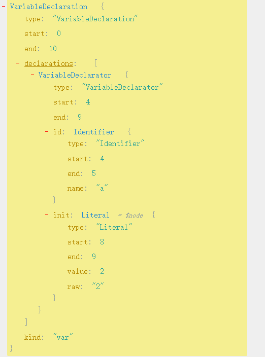

[电子版地址](https://github.com/getify/You-Dont-Know-JS)

## 作用域是什么

前言: 本章对js的编译原理,js变量的查找方式,作用域,引擎,编译器之间的协作进行介绍

### 什么是作用域?

 js中存储变量,查找变量的规则就是作用域

### 编译原理

js事实上也是一门编译语言,大部分情况下编译发生在执行前的几微秒

什么是编译呢? 编译就是将js代码转换成机器指令的过程,js中这个过程包含三个步骤: 

- 分词/词法分析

  这个过程会将源代码字符串转换成一个个`词法单元`,如`var a = 2;`这句代码会转换成五个词法单元: `var,a,=,2,;`

- 解析/语法分析

  这个过程会将词法分析产生的`词法单元流`构建为`抽象语法树`(AST),抽象语法树就是由元素逐级嵌套组成的代表程序语法结构的树

  `var a = 2;`的AST抽象语法树如下所示,这里推荐一个生成AST的网站: [astexplorer](https://astexplorer.net/)

  

  

- 代码生成

  这个过程会将AST转换成可执行的机器指令: 用来创建一个叫做a的变量,并将一个值存储在a中

### 引擎 编译器和作用域

实际上在编译执行的过程中情况还要复杂的多,主要由以下三个部分协同合作: 

- 引擎: 主要负责执行过程
- 编译器: 主要负责词法分析,语法分析
- 作用域: 主要负责收集并维护由所有标识符组成的一些列查询,并实施一套严格的规则,确定当前执行代码对标识符的访问权限

以`var a = 2;`为例看其中是如何协作的: 

传统思想中我们对这句代码的解释大概是: 为变量分配一个内存,将其命名为a,然后将2保存到这个变量.实时上处理过程要复杂的多:

1. 编译器解析`var a`,先向作用域询问同一作用域下的集合中是否声明的有这个名称的变量,如果有: 编译器会忽略该声明,继续编译,如果没有: 编译器会让作用域在当前作用域集合中声明该变量,之后编译器继续编译,并将编译结果给引擎进行执行
2. 引擎拿到`a = 2`,开始执行时会向询问作用域当前作用域集合中是否声明了该变量,如果有,那么引擎会使用该变量,如果没有那么引擎会继续查找,直到找不到,就会抛出错误

#### LHS和RHS

在上述过程中,引擎会查找变量a,如何查找变量,会影响到最终的查找结果.共有两种查找方式: LHS,RHS

LHS: 赋值操作左侧查询,对a的LHS可以理解为: 赋值操作的目标(a)是谁

RHS: 赋值操作右侧查询,对a的RHS可以理解为: 赋值操作中值(a)是多少

换句化说: 当变量出现在操作符左侧时进行LHS查询,为了查询到变量在哪.当变量出现在操作符右侧时进行RHS查询,为了查询变量的值是多少

`a = 2`是对a进行LHS,是为了找到a变量,并将2赋值给它

`console.log(a)`是对a进行RHS,是为了查找到a的值并传递给`console.log`

```js
function foo(a){
    var b = a;
    return a+b
}
var c = foo(2)

上述的查询包含: 
1.对c进行LHS c=foo(2)
2.对foo进行RHS c = foo(2)
3.对参数a进行LHS 
4.对b进行LHS b=a
5.对a进行RHS b=a
6.对b和a分别进行RHS a+b
一共进行了三次LHS 四次RHS
```

#### 为何区分RHS和LHS

因为在变量还未声明的时候,对变量的RHS和LHS的行为是不同的

**RHS:**RHS在所有嵌套作用域都无法查找该变量的时候,会直接抛出异常:ReferenceError引用错误

**LHS:**LHS在所有嵌套作用域都无法查找到该变量的时候.非严格模式下会在`顶级作用域`声明该变量(隐式声明),严格模式下会抛出异常: ReferenceError引用错误

顺带一提: 当对变量的值进行不合理操作的时候会抛出另一种异常: TypeError,如对非函数变量进行函数调用,访问`null`或`undefined`类型的值的属性时

### 作用域嵌套

当一个块或函数嵌套在另一个块和函数的时候,就发生了作用域嵌套,此时变量查找时,若没有在当前作用域找到,就会向外层嵌套的作用域进行查找直到找到该变量或查找到顶层作用域为止

## 词法作用域

上回书说到,我们将作用域定义为一套规则,这套规则用来管理引擎如何查找变量,而作用域的工作模型主要有两种: `词法作用域`和`动态作用域`,`词法作用域`是最普遍的,被大多数编程语言使用,JS也是使用的这种模型.作用域如何工作就是由其采用的工作模型确定的

### 词法阶段

在第一章中说过,源代码执行前会经历三个阶段: `分词/词法分析`,`解析/语法分析`,`生成机器指令`.第一个阶段就是词法阶段.

#### 静态作用域

**词法作用域就是定义在词法阶段的作用域**,也可以说: `词法作用域`是由写代码时变量写在哪里决定的,因此作用域在写代码时就确定了.(大部分情况是这样,当使用`eval,with`时,词法作用域是可以动态修改的)

在没有深入js之前就听过一句话: ''js的作用域是静态的'',现在知道了这句话的依据,那就是js的作用域使用的工作模型是`词法作用域`,`词法作用域`在`词法阶段`就已经确定了,

#### 遮蔽效应

作用域查找会在找到第一个匹配的标识符时停止,因此内层作用域和外层作用域的同名变量,由内向外查找时优先使用内层的变量

### 欺骗词法

上文中说,作用域可以通过`eval`和`with`动态修改,来欺骗词法作用域,然而这种做法是非常不推荐的: `欺骗词法作用域只会导致性能下降`

#### eval

js中`eval()`可以接收一个字符串作为参数,并将其中内容视为好像书写时就存在该位置的代码进行运行.

因此根据传递的字符串,可以动态的修改当前作用域:

```js
function foo(str, a) {
  eval(str);
  console.log(a, b);
}
var b = 2;
foo('var b = 3', 2); //输出2 3而非2 2
```

如果作用域没有改变,当执行`console.log(a,b)`时,会对b进行RHS,发现当前作用域没有,便向外部作用域查找,并返回2

然而由于由eval的存在,将`var b = 3`当作本来就在这个位置进行处理,结果就变成: 当执行`console.log(a,b)`时,对b进行RHS,由于使用`eval`在当前作用域动态声明了一个`b`变量,那么由于遮蔽效应,直接使用当前作用域的变量`b`

> 另: 严格模式下,eval()有自己的词法作用域,此时无法修改所在作用域的

与`eval`类似`setTimeout,setInterval`的第一个参数可以是字符串,也会被当作动态生成的代码函数,`new Function`的最后一个参数也可以接收字符串并将其转换成动态函数

#### with

`with()`接收一个参数作为作用域:

```js
var obj = {
    a:1,
    b:2,
    c:3
}
修改obj的属性时: 
obj.a = 2;
obj.b = 3;
obj.c = 4;

使用with()后:
with(obj){
	a = 2;
    b = 3;
    c = 4;
}
```

with单独形成一个obj的作用域,在这个作用域下访问变量都是obj上的属性

**与`eval`修改作用域不同,`with`是创建一个全新的词法作用域**,我们传递`obj`给`whit`时,`with`所声明的作用域就是`obj`

再看一个泄漏的例子:

```js
function foo(obj){
    with(obj){
        a=2
    }
}

var o1 = {
    a:1
}
var o2 = {
    b:2
}

foo(o1)
console.log(o1.a) //2

foo(o2)
console.log(o1.b) //undefined
console.log(a) // 2,a直接泄漏到全局作用域中
```

上述例子中,执行`foo(o1)`时,由于`o1`中包有a属性,所以一切正常,将o1.a赋值为2,当执行`foo(o2)`时,由于`o2`没有a属性,所以没有赋值o2.a为undefined,那么为什么在全局作用域打印a也能成功呢?

其实`foo(o2)`的整个过程是这样的: 由于`whit`创建了一个新的作用域,那么整个作用域嵌套式这样的: o2作用域 => 函数作用域 => 全局作用域,当执行`a=2`时,对`a`进行RHS,发现o2作用域没有该变量,于是就去函数作用域查找,直到全局作用域都没有,于是在全局作用域隐式声明了a

#### 性能问题

为什么说`eval`和`with`会对性能有很大的影响呢?其实真正对性能产生影响的是`不确定的作用域的产生`

在JavaScript中引擎会在编译阶段做很多性能优化,其中有些优化依赖于能够根据代码的`词法`做`静态分析`,并且**预先确定所有变量和函数定义的位置,以便需要的时候能快速找到**.

但是如果代码中使用了`eval`和`with`,就不能在词法阶段确定作用域是否进行了修改,如何修改,进而预先确定所有变量和函数的定义位置的优化就无法进行,进行了也是无意义的,最坏的情况就是不做任何优化.因此如果代码大量使用了`eval,with`,那么运行起来一定会很慢.

## 函数作用域和块级作用域

### 函数中的作用域

函数作用域是指: 属于这个函数的全部变量都可以在整个函数的范围内使用及复用(包括嵌套作用域).只要标识符声明在函数的括号内,这个标识符所代表的变量或者函数都将附属于该作用域

### 隐藏内部实现

在第二章中,我们解释了`JS的作用域是静态的`的原因,即js的作用域工作模型采用的是`词法作用域`,而词法作用域在词法阶段定义.

这里我们解释一下js作用域另一个特点: 单向性,即变量的查找只能由内层作用域向外层作用域查找

#### 最小特权原则

也叫最小授权,最小暴露原则,是指: 在软件设计中,应该最小限度的暴露必要的内容,而其他内容都隐藏起来

这个原则引申到如何选择作用域来包含变量和函数时,我们就理解为什么作用域是单向的;

在编写代码时,我们大可以将所有变量和函数都写在全局作用域中,但这会破坏`最小特权原则`,因为我们可能会暴露过多的变量和函数,这是很危险的,在将来谁知道会产生什么意想不到的影响.正确的方式是只暴露需要暴露的变量和函数,而将其他的想办法隐藏起来,不让别人随意访问.这就是函数作用域做的事情.我们把私有的变量和函数包裹在一个函数作用域中,用函数作用域来隐藏他们.

于是产生的效果就是外层作用域无法访问内层作用域的变量和函数,因为对js来说,我们创建内层作用域就是为了隐藏私有变量和函数的

#### 规避冲突

"隐藏"作用域中的变量和函数的另一个好处就是: 可以避免同名标识符的冲突

其次还有其他方式可以很好的规避冲突: 

1. 全局命名空间

   变量冲突的一个典型例子存在于全局作用域中,当程序加载很多第三方库的时候,如果没有妥善管理库私有的变量和函数,就很容易引起冲突.

   一般情况下,这些库会在群居作用域中声明一个足够特殊的的变量如`jquery的$`,通常是一个对象.这个对象被用作库的`命名空间`,所有需要暴露给外界的功能都会称为这个对象的属性,而不是直接将标识符暴露出去

2. 模块管理

   这种方式和现代的模块管理机制很接近,就是使用模块管理器,使用这些工具时,任何库都无需将标识符加入到全局作用域中,而是通过依赖管理器的机制,将库的标识符显式的导入到另外一个作用域中

   只要你愿意,即使不使用任何依赖管理工具也可以实现相同的功效,在第五章会进行介绍

### 函数作用域

#### 函数声明和函数表达式

我们已经知道,在任意代码片段外不添加包装函数,可以将内部的变量和函数"隐藏"起来,外部作用域无法访问包装函数内部的任何内容

虽然这种技术可以解决一些问题,但同时也带来了一下麻烦: 

1. 首先,必须声明一个具名函数,意味着这个具名函数的标识符本身就''污染''了所在的作用域
2. 其次,必须显式的通过函数名调用这个函数才能运行其中的代码

好在JavaScript提供了能同时解决上述两个问题的方案: 函数表达式

```js
(function foo(){})() //函数表达式
function foo(){} //函数声明
```

上述包装函数使用`(function`开头,却没有使用`function`开头,这里不仅是书写上的小不同,实际上有着很重要的区别: **这里的函数会被当作函数表达式而不是函数声明来处理**

> 区分函数声明和函数表达式最简单的办法就是看`function`关键字的在声明中出现的位置不仅仅是所在的那一行代码,而是整个声明中的位置,如果`function`是第一个词,那就是函数声明,否则是函数表达式

```js
setTimeout(function(){},1000) //其中的函数其实是函数表达式
```

**函数声明和函数表达式的区别:**

最大的区别就是,他们的标识符会被绑定在何处

- 函数声明: 绑定在所在作用域中,不可以省略标识符
- 函数表达式: 绑定在自身的函数中,而非所在作用域中.可以省略标识符(匿名函数表达式),

```js
(function foo() {
    console.log(foo); //[Function: foo] //自身作用域可以访问到
})(); 
console.log(foo); //foo is not defined  //外界作用域无法访问到foo
再入:
setTimeout(function foo() {
  console.log(foo);  //[Function: foo] //自身作用域可以访问到
}, 1000);
console.log(foo); //foo is not defined  //外界作用域无法访问到foo
```

#### 匿名和具名

对于函数表达式最属性的场景可能就是回调函数了:

```js
setTimeout(function(){},1000)
```

这叫做`匿名函数表达式`,因为function没有名称标识符,函数表达式可以是匿名的,但函数声明不可以

匿名函数表达式的缺点: 

1. 匿名函数在栈追踪中不会显示出有意义的命名,使调试很困难
2. 如果没有函数名,当函数需要自身引用的时候只能使用已经过期的`arguments.cellee`引用,比如递归,事件触发后解绑
3. 匿名函数省略了对代码可读性,很重要的函数名

给函数表达式一个指定的名称可以有效的解决这些问题: 

```js
setTimeout(function timeoutHandler(){},1000)
```

#### 立即执行函数

`IIFE`代表立即执行函数

将函数包裹在一对括号内`()`,因此称为了函数表达式,再在末尾添加一个括号`()`,可以立即执行这个函数,这就是`IIFE`,以下两种形式功能上式一致的:

```js
(function(){})()
或者
(function(){}())
```

##### 用法

1. 把他们当作函数调用,并传参进去

   ```js
   (function IIFE(global){
       console.log(global.xxx)
   })(window)
   ```

   这样一来,从代码风格上将全局对象的引用变得比引用一个没有`全局`字样的变量更加清晰

2. 解决``undefined`被意外赋值的问题,我们知道undefined可以作为变量名被赋值,从而在判断`undefined`的时候发生意料之外的事情,我们可以使用IIFE将第一个参数命名为undefined,但是在对应位置不传递任何的值

   ```js
   undefined = true
   (function IIFE(undefined){
       let a;
       if(a === undefined){} //这里可以正常进行判断,不用担心undefuned被覆盖
   })() //这里不要传递参数
   ```

3. 倒置代码的顺序,将要运行的代码放在第二位,这种方式在`UMD`项目中被官广泛使用,

   ```js
   UMD模式简介: 
   UMD 是一种用于创建可以在多种环境中运行的 JavaScript 模块的通用标准。
   在 JavaScript 中，存在多种模块系统，例如 CommonJS、AMD（Asynchronous Module Definition）和 ES6 Modules。这些模块系统在不同的环境中有不同的使用方式和语法规则。UMD 的目标是提供一种通用的方法，使得一个 JavaScript 模块都可以在多种环境下使用，包括在浏览器中作为全局变量使用，或通过 CommonJS、AMD 等模块加载器引入。
   
   (function (root, factory) {
       if (typeof define === 'function' && define.amd) {
           // AMD 环境
           define(['dependency'], factory);
       } else if (typeof exports === 'object') {
           // CommonJS 环境
           module.exports = factory(require('dependency'));
       } else {
           // 浏览器全局变量
           root.MyModule = factory(root.Dependency);
       }
   }(this, function (Dependency) {
       // 模块代码
       return {
           // 模块导出的内容
       };
   }));
   这里通过一个IIFE函数根据当前的执行环境来决定如何导出模块.
   ```

### 块作用域

块作用域是一个用来对之前的`最小授权`原则进行扩展的工具,将代码从函数作用域中隐藏的信息扩展为在块作用域中隐藏信息,

```js
for(var i = 0; i < 10; i++){
    console.log(i) //输出 0 ,1,2,3,4,5,6,7,8,9
}
console.log(i) //输出 10
```

上述代码是很常见的`for`循环,我们在循环头部直接定义了变量`i`,正常情况下,我们只想在循环内部使用`i`,不希望`i`暴露给外部,但从例子中我们可以看到,在循环外部成功的打印了`i`,这时因为`i`被绑定在了外部作用中,显然着违背了`最小授权`原则,那么如何将`i`固定在循环所在的上下文之中呢?

块作用域就可以做到这一点:

```js
for(let i = 0; i < 10; i++){
    console.log(i) //输出 0 ,1,2,3,4,5,6,7,8,9
}
console.log(i) // ReferenceError i is not defined
```

看我们通过`let`关键字,将``for`循环的`{}`变成了块级作用域,因此下方在访问的时候就会抛出错误,没有在当前作用域找到`i`

#### 块作用域分类

块作用域写法只是简单的`{}`即可,但只用`{}`是无法构成块作用域的,需要特定的条件才可以开启,

##### **with**

虽然不推荐使用`with`,但使用`with`从对象创建的作用域确实仅在`with`声明中使用,外部作用域无法访问

##### **try/catch**

`try/catch`在ES3之后,其`catch`分分句会创建块级作用域,其中声明的变量仅仅在`catch`中可以访问

```js
try {
  throw 1;
} catch (err) {
  console.log(err); //1
}
console.log(err); //ReferenceError 
```

> 书中说: `catch会创建块级作用域,其中声明的变量仅在catch内部有效`.
>
> 但我尝试了以下代码,代码行为并不像书中所述:
>
> ```js
> try {
>   throw 1;
> } catch (err) {
>     var a = 2
>   console.log(a); //2
> }
> console.log(a); //2 正常输出,并没有报错.
> ```
>
> 不知道这里是不是书中描述不准确,有路过懂的大神,还请指指教指教

##### let/const

使用`let,const `关键字可以开启块级作用域,将`let`所在的`{}`变成块级作用域

###### 垃圾收集

块级作用域很有用的其中一个原因就是其和闭包及垃圾回收机制有关

```js
function process(data){
    ....
}
var someData = {}
process(someData)
var btn = document.querSelector('my_button')

btn.addEventListener("click",function(){...})
```

上述代码中由于`click`函数形成了一个覆盖整个作用域的闭包,导致即使`process`执行完毕,垃圾回收机制**可能**依然保持这个结构,不会回收函数执行占用的大量空间,(之所以说可能是因为这取决于具体实现),

使用块作用域就可以打消这种顾虑:

```js
function process(data){
    ....
}
{
    let someData = {}
	process(someData)
}
var btn = document.querSelector('my_button')
btn.addEventListener("click",function(){...})
```

这样引擎就清楚的知道没有必要继续保存`someData`这个变量了

## 提升

提升指的是: 包含变量和函数的**所有声明**都会在任何代码**被执行**前首先被处理.这个过程就好像变量和函数的声明从他们的代码中被移动到最上面了

看一下这个例子:

```js
console.log(a) //输出undefined
var a = 2
```

由于变量声明在函数执行前被提前处理,移动至最上面,因此实际的代码执行顺序是这样: 

```js
var a;
console.log(a);
a = 2;
```

### 变量为什么会提升

回忆一下第一章节内容,源代码转换为机器指令要先进行编译,而编译阶段中的一部分工作就是**找到所有的声明,并用合适的作用域将他们关联起来**,这也是第二章词法作用域的主要内容,

上述例子中值得注意的是: `var a = 2`被拆解为两个部分: `var a;`和`a = 2`,第一部分是在编译阶段进行的,第二部分赋值会留在原地等待执行阶段.也就是说只有声明会被先处理(提升),而赋值等其他逻辑会留在原地等待执行

### 函数优先

函数要比变量优先提升,就是说先提升所有的函数,然后再提升变量

```js
foo(); //输出undefined
var foo = 1;
var b = 2;
function foo() {
  console.log(b);
}
```

看上述代码其执行过程是这样的: 

1. 代码首先进入编译阶段: 对所有声明进行提升,优先提升函数: 

   1. 编译器发现有函数声明,于是先把函数声明提升至作用域最顶端

   2. 之后发现了又一个声明`var foo`,编译器会询问作用域里是否已存在这个声明,作用域说:之前已经有了一个foo的函数声明,编译器发现作用域中已经存在了`foo`的声明,就会忽略掉这个次的`var foo`

   3. 全部编译完后,代码顺序变成了这个样子:

      ```js
      function foo(){...}//提升了的函数声明,注意只是声明被提升了,而实际的函数体没有,执行时会根据函数声明找到函数体
      var b;
      foo();              //执行函数
      foo = 1;            //将foo重新赋值为1
      b = 2               //给b赋值
      ```

2. 执行阶段: 由上至下开始执行编译后的代码

需要注意的是: 在普通的块中函数声明仍然会被提升至所在作用域顶部,猜猜以下代码输出什么?

```js
foo()
var a = 0;
if(a){
    function foo(){
        console.log("a")
    }
}else {
    function foo(){
        console.log("b")
    }
}
```

输出: `TypeError: foo is not a function`,你可能会疑惑为什么输出的不是`ReferenceError 引用错误`而是`TypeError 类型错误`,其主要原因是: 普通块内的函数声明会被提升至所在作用域顶部,那么`foo`的声明就提升到了`foo()`之前,但此时foo的值为默认值`undefined`,当执行`foo()`时,其实是将`undefined`当作函数调用

## 闭包

> 本书作者说: 如果了解了之前关于词法作用域的讨论,那么闭包的概念就不言自明了.仔细想想确实是这样,所以如果对词法作用域不是很清楚,请回到第二章回顾一下吧~!

闭包是基于词法作用域书写代码产生的自然结果,JavaScript中闭包无处不在,如果不能察觉到它的身影,那所缺少的就是根据自己的意愿来识别,拥有和影响闭包

最后恍然大悟: 原来我的代码中已经到处是闭包了!

### 什么是闭包?

闭包其实就是一种引用:**当函数在定义的作用域之外被调用的时候就产生了闭包**,函数持有对定义作用域的引用,这个引用就是闭包

这个引用使定义作用域无法被垃圾回收,从而提供了一种外部作用域通过这个引用访问内部作用域的一种方式.

```js
function foo(){
	let a = 0;
    function bar(){
		console.log(a); //函数引用定义时所在作用域的变量
    }
    return bar;
}
const fn = foo() //此时foo作用域执行完毕理应被回收机制销毁,但由于bar拥有涵盖foo()内部作用域的闭包,因此bar依然持有foo作用域的引用,导致foo作用域未能被垃圾回收
fn() //bar在定义时作用域之外被执行,输出了foo作用域下的变量a的值,说明在全局作用域访问函数作用域成功了,如果没有闭包,这是万万不能实现的
```

`函数bar`的词法作用域可以访问`函数foo`的内部作用域,然后我们将`bar`所引用的函数本身当作返回值传递到外层,`foo`执行后,其返回值赋值给了`fn`并调用了`fn`,实际上是通过不同标识符的引用调用了内部的函数`bar`,

当`foo`执行完毕的时候,其理应被回收机制回收,但由于`bar`一直在引用`foo的作用域`,导致`foo`不会被回收,这就是闭包做的事情.

#### 一些例子

判断是否存在闭包的最好方法就是: 观察函数是否在其定义的作用域之外被调用 

本质上无论何时,如果将可以访问它们各自作用域的函数,当作第一级的值类型并到处传递,就能看到闭包在这些函数中的应用,让我们来看一些闭包例子:

```js
定时器: timer函数定义在wait作用域中,但其执行确实在其他地方执行
function wait(message){
    setTimeot(function timer(){
        console.log(message)
    })
}
wait("test")

事件监听器: active函数定义在addClick作用域内,其被调用的地方虽然不在这个作用域,但依然能访问到addClick作用域
function addClick(name,selector){
    $(selector).click(function active(){
        console.log(name)
    })
}
addClick('test','#div_1')
```

除了上述的例子还有: Ajax请求,web Workers,跨窗口通信,只要使用了回调函数实际上就是在使用闭包

### 循环和闭包

每间隔一秒输出一次的代码,依次输出0,1,2,3...共五次,我们可能会这样写:

```js
for(var i = 0; i < 5;i++){
	setTimeout(function timer(){
        console.log(i)
    },i*1000)
}
```

但执行的时候发现每次都会输出`5`,我们也许会很诧异,但仔细想想也都对: 循环完毕`i===5`,之后执行宏任务,找到`i`并打印,发现当前作用域声明的有`i`,于是就进行打印.而此时`i`已经是`5`了

那如何才能实现我们的需求呢? 

深究一下连续打印`5`的原因,很容易发现: 当`i`等于1时,我们理应进行打印的但是由于同步代码总要比异步代码先执行完,还没等到去打印值为1的`i`,`i`就已经赋值为`2`了,就这样一直重复到循环结束,那么问题根因就在于`i`无法等到被打印就被重新赋值了,无法保存`i`的状态,

而创建一个闭包是可以保存本应销毁的状态的,如果当`i`等于1时,将这个值存在一个作用域中,由于timer函数一直引用,那么这个作用域就一直不会被销毁,直到timer函数执行完毕,听起来不错,也许可以试试,为了方便我们直接使用`IIFE`: 

```js
for (var i = 0; i < 5; i++) {
  (function wrap() { //给timer外添加一层函数作用域用来形成闭包
    setTimeout(function timer() {
      console.log(i);
    }, i * 1000);
  })();
}
```

执行后发现,还是每次都输出`5`,仔细观察代码,哦~原来`timer`函数并没有持有`wrap`函数的作用域,因为`wrap`函数作用域中空空如也,一个变量也没有,`timer`想引用其变量也引用不了;知道原因了那么来修改一下代码:

```js
for (var i = 0; i < 5; i++) {
  (function wrap(i) { //由于timer一直引用wrap的i,导致这个i不会被回收,传进来是几,就会一直保存着,知道没有其他地方引用它之后,才被销毁
    setTimeout(function timer() {
      console.log(i);
    }, i * 1000);
  })(i); //将当前的i传递到函数中,
}
```

OK,这次就可以按照预想的打印了,

这就完了嘛,其实还跟简单的方法: 块作用域

```js
for(let i = 0; i < 5;i++){
	setTimeout(function timer(){
        console.log(i)
    },i*1000)
}
```

`for`循环头部的`let`还有一个特殊行为: 变量在循环过程中不止被声明一次,每次迭代都会声明,并且都会用上一次迭代结束的值来初始化这个变量

